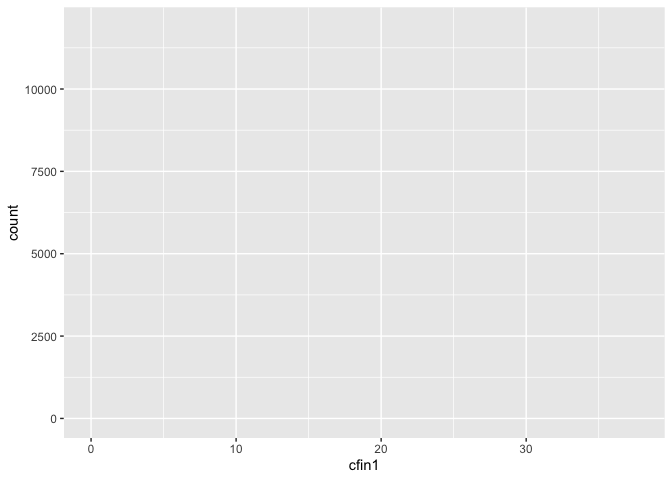

-   [1. Kod wyliczający wykorzystane
    biblioteki.](#kod-wyliczający-wykorzystane-biblioteki.)
-   [2. Powtarzalność wyników](#powtarzalność-wyników)
-   [3. Wczytanie danych z pliku](#wczytanie-danych-z-pliku)
-   [5. Sekcja podsumowującą rozmiar zbioru i podstawowe
    statystyki.](#sekcja-podsumowującą-rozmiar-zbioru-i-podstawowe-statystyki.)
-   [4. Kod przetwarzający brakujące
    dane](#kod-przetwarzający-brakujące-dane)
-   [Rozkład wartości atrybutów](#rozkład-wartości-atrybutów)

1. Kod wyliczający wykorzystane biblioteki.
===========================================

``` r
library(knitr)        # report generation
library(dplyr)        # data manipulation
library(ggplot2)      # plots visualisation
library(plotly)       # interactive plots
library(caret)        # data exploration lib
library(randomForest) # rf
```

2. Powtarzalność wyników
========================

``` r
set.seed(231)
```

3. Wczytanie danych z pliku
===========================

``` r
rawCSV <- read.csv("~/Downloads/sledzie.csv", na.strings = "?")
str(rawCSV)
```

    ## 'data.frame':    52582 obs. of  16 variables:
    ##  $ X     : int  0 1 2 3 4 5 6 7 8 9 ...
    ##  $ length: num  23 22.5 25 25.5 24 22 24 23.5 22.5 22.5 ...
    ##  $ cfin1 : num  0.0278 0.0278 0.0278 0.0278 0.0278 ...
    ##  $ cfin2 : num  0.278 0.278 0.278 0.278 0.278 ...
    ##  $ chel1 : num  2.47 2.47 2.47 2.47 2.47 ...
    ##  $ chel2 : num  NA 21.4 21.4 21.4 21.4 ...
    ##  $ lcop1 : num  2.55 2.55 2.55 2.55 2.55 ...
    ##  $ lcop2 : num  26.4 26.4 26.4 26.4 26.4 ...
    ##  $ fbar  : num  0.356 0.356 0.356 0.356 0.356 0.356 0.356 0.356 0.356 0.356 ...
    ##  $ recr  : int  482831 482831 482831 482831 482831 482831 482831 482831 482831 482831 ...
    ##  $ cumf  : num  0.306 0.306 0.306 0.306 0.306 ...
    ##  $ totaln: num  267381 267381 267381 267381 267381 ...
    ##  $ sst   : num  14.3 14.3 14.3 14.3 14.3 ...
    ##  $ sal   : num  35.5 35.5 35.5 35.5 35.5 ...
    ##  $ xmonth: int  7 7 7 7 7 7 7 7 7 7 ...
    ##  $ nao   : num  2.8 2.8 2.8 2.8 2.8 2.8 2.8 2.8 2.8 2.8 ...

<!-- Zbiór danych zawiera 52582 obserwacje opisane 16 atrybutami:  -->
<!-- Nazwa atrybutu| Opis -->
<!-- ---------|-------------------------------------------- -->
<!-- length        | długość złowionego śledzia [cm] -->
<!-- cfin1         | dostępność planktonu [zagęszczenie Calanus finmarchicus gat. 1] -->
<!-- cfin2         | dostępność planktonu [zagęszczenie Calanus finmarchicus gat. 2] -->
<!-- chel1         | dostępność planktonu [zagęszczenie Calanus helgolandicus gat. 1] -->
<!-- chel2         | dostępność planktonu [zagęszczenie Calanus helgolandicus gat. 2] -->
<!-- lcop1         | dostępność planktonu [zagęszczenie widłonogów  gat. 1] -->
<!-- lcop2         | dostępność planktonu [zagęszczenie widłonogów  gat. 2] -->
<!-- fbar          | natężenie połowów w regionie [ułamek pozostawionego narybku] -->
<!-- recr          | roczny narybek [liczba śledzi] -->
<!-- cumf          | łączne roczne natężenie połowów w regionie [ułamek pozostawionego narybku] -->
<!-- totaln        | łączna liczba ryb złowionych w ramach połowu [liczba śledzi] -->
<!-- sst           | temperatura przy powierzchni wody [°C] -->
<!-- sal           | poziom zasolenia wody [Knudsen ppt] -->
<!-- xmonth        | miesiąc połowu [numer miesiąca] -->
<!-- nao           | oscylacja północnoatlantycka [mb] -->
5. Sekcja podsumowującą rozmiar zbioru i podstawowe statystyki.
===============================================================

Krótkie podsumowanie statystyk wartości atrybutów:

``` r
summary(rawCSV[-1])
```

    ##      length         cfin1             cfin2             chel1       
    ##  Min.   :19.0   Min.   : 0.0000   Min.   : 0.0000   Min.   : 0.000  
    ##  1st Qu.:24.0   1st Qu.: 0.0000   1st Qu.: 0.2778   1st Qu.: 2.469  
    ##  Median :25.5   Median : 0.1111   Median : 0.7012   Median : 5.750  
    ##  Mean   :25.3   Mean   : 0.4458   Mean   : 2.0248   Mean   :10.006  
    ##  3rd Qu.:26.5   3rd Qu.: 0.3333   3rd Qu.: 1.7936   3rd Qu.:11.500  
    ##  Max.   :32.5   Max.   :37.6667   Max.   :19.3958   Max.   :75.000  
    ##                 NA's   :1581      NA's   :1536      NA's   :1555    
    ##      chel2            lcop1              lcop2             fbar       
    ##  Min.   : 5.238   Min.   :  0.3074   Min.   : 7.849   Min.   :0.0680  
    ##  1st Qu.:13.427   1st Qu.:  2.5479   1st Qu.:17.808   1st Qu.:0.2270  
    ##  Median :21.673   Median :  7.0000   Median :24.859   Median :0.3320  
    ##  Mean   :21.221   Mean   : 12.8108   Mean   :28.419   Mean   :0.3304  
    ##  3rd Qu.:27.193   3rd Qu.: 21.2315   3rd Qu.:37.232   3rd Qu.:0.4560  
    ##  Max.   :57.706   Max.   :115.5833   Max.   :68.736   Max.   :0.8490  
    ##  NA's   :1556     NA's   :1653       NA's   :1591                     
    ##       recr              cumf             totaln             sst       
    ##  Min.   : 140515   Min.   :0.06833   Min.   : 144137   Min.   :12.77  
    ##  1st Qu.: 360061   1st Qu.:0.14809   1st Qu.: 306068   1st Qu.:13.60  
    ##  Median : 421391   Median :0.23191   Median : 539558   Median :13.86  
    ##  Mean   : 520366   Mean   :0.22981   Mean   : 514973   Mean   :13.87  
    ##  3rd Qu.: 724151   3rd Qu.:0.29803   3rd Qu.: 730351   3rd Qu.:14.16  
    ##  Max.   :1565890   Max.   :0.39801   Max.   :1015595   Max.   :14.73  
    ##                                                        NA's   :1584   
    ##       sal            xmonth            nao          
    ##  Min.   :35.40   Min.   : 1.000   Min.   :-4.89000  
    ##  1st Qu.:35.51   1st Qu.: 5.000   1st Qu.:-1.89000  
    ##  Median :35.51   Median : 8.000   Median : 0.20000  
    ##  Mean   :35.51   Mean   : 7.258   Mean   :-0.09236  
    ##  3rd Qu.:35.52   3rd Qu.: 9.000   3rd Qu.: 1.63000  
    ##  Max.   :35.61   Max.   :12.000   Max.   : 5.08000  
    ## 

4. Kod przetwarzający brakujące dane
====================================

``` r
allRows <- nrow(rawCSV)
allRows
```

    ## [1] 52582

``` r
completeRows <- sum(complete.cases(rawCSV))
rowsWithNA <- allRows - completeRows
```

``` r
filteredRows <- na.omit(rawCSV)
filteredRows
```

    ##         X length   cfin1   cfin2    chel1    chel2    lcop1    lcop2  fbar
    ## 2       1   22.5 0.02778 0.27785  2.46875 21.43548  2.54787 26.35881 0.356
    ## 3       2   25.0 0.02778 0.27785  2.46875 21.43548  2.54787 26.35881 0.356
    ## 4       3   25.5 0.02778 0.27785  2.46875 21.43548  2.54787 26.35881 0.356
    ## 5       4   24.0 0.02778 0.27785  2.46875 21.43548  2.54787 26.35881 0.356
    ## 7       6   24.0 0.02778 0.27785  2.46875 21.43548  2.54787 26.35881 0.356
    ## 8       7   23.5 0.02778 0.27785  2.46875 21.43548  2.54787 26.35881 0.356
    ## 9       8   22.5 0.02778 0.27785  2.46875 21.43548  2.54787 26.35881 0.356
    ## 10      9   22.5 0.02778 0.27785  2.46875 21.43548  2.54787 26.35881 0.356
    ## 11     10   23.0 0.02778 0.27785  2.46875 21.43548  2.54787 26.35881 0.356
    ## 12     11   22.5 0.02778 0.27785  2.46875 21.43548  2.54787 26.35881 0.356
    ## 13     12   22.0 0.02778 0.27785  2.46875 21.43548  2.54787 26.35881 0.356
    ## 15     14   23.5 0.02778 0.27785  2.46875 21.43548  2.54787 26.35881 0.356
    ## 16     15   24.0 0.02778 0.27785  2.46875 21.43548  2.54787 26.35881 0.356
    ## 17     16   21.5 0.02778 0.27785  2.46875 21.43548  2.54787 26.35881 0.356
    ## 18     17   23.0 0.02778 0.27785  2.46875 21.43548  2.54787 26.35881 0.356
    ## 19     18   24.5 0.02778 0.27785  2.46875 21.43548  2.54787 26.35881 0.356
    ## 20     19   22.5 0.02778 0.27785  2.46875 21.43548  2.54787 26.35881 0.356
    ## 21     20   22.0 0.02778 0.27785  2.46875 21.43548  2.54787 26.35881 0.356
    ## 22     21   23.5 0.02778 0.27785  2.46875 21.43548  2.54787 26.35881 0.356
    ## 23     22   22.5 0.02778 0.27785  2.46875 21.43548  2.54787 26.35881 0.356
    ## 24     23   22.5 0.02778 0.27785  2.46875 21.43548  2.54787 26.35881 0.356
    ## 25     24   21.5 0.02778 0.27785  2.46875 21.43548  2.54787 26.35881 0.356
    ## 26     25   23.0 0.02778 0.27785  2.46875 21.43548  2.54787 26.35881 0.356
    ## 27     26   27.5 0.02778 0.27785  2.46875 21.43548  2.54787 26.35881 0.356
    ## 28     27   23.0 0.02778 0.27785  2.46875 21.43548  2.54787 26.35881 0.356
    ## 29     28   25.0 0.02778 0.27785  2.46875 21.43548  2.54787 26.35881 0.356
    ## 31     30   21.0 0.02778 0.27785  2.46875 21.43548  2.54787 26.35881 0.356
    ## 32     31   23.5 0.02778 0.27785  2.46875 21.43548  2.54787 26.35881 0.356
    ## 33     32   23.0 0.02778 0.27785  2.46875 21.43548  2.54787 26.35881 0.356
    ## 35     34   22.0 0.02778 0.27785  2.46875 21.43548  2.54787 26.35881 0.356
    ## 37     36   22.5 0.02778 0.27785  2.46875 21.43548  2.54787 26.35881 0.356
    ## 38     37   25.0 0.02778 0.27785  2.46875 21.43548  2.54787 26.35881 0.356
    ## 39     38   22.5 0.02778 0.27785  2.46875 21.43548  2.54787 26.35881 0.356
    ## 40     39   22.5 0.02778 0.27785  2.46875 21.43548  2.54787 26.35881 0.356
    ## 41     40   23.0 0.02778 0.27785  2.46875 21.43548  2.54787 26.35881 0.356
    ## 42     41   22.0 0.02778 0.27785  2.46875 21.43548  2.54787 26.35881 0.356
    ## 43     42   25.0 0.02778 0.27785  2.46875 21.43548  2.54787 26.35881 0.356
    ## 44     43   22.0 0.02778 0.27785  2.46875 21.43548  2.54787 26.35881 0.356
    ## 45     44   24.0 0.02778 0.27785  2.46875 21.43548  2.54787 26.35881 0.356
    ## 47     46   22.5 0.02778 0.27785  2.46875 21.43548  2.54787 26.35881 0.356
    ## 48     47   22.5 0.02778 0.27785  2.46875 21.43548  2.54787 26.35881 0.356
    ## 50     49   24.5 0.02778 0.27785  2.46875 21.43548  2.54787 26.35881 0.356
    ## 51     50   21.5 0.02778 0.27785  2.46875 21.43548  2.54787 26.35881 0.356
    ## 52     51   23.5 0.02778 0.27785  2.46875 21.43548  2.54787 26.35881 0.356
    ## 53     52   22.0 0.02778 0.27785  2.46875 21.43548  2.54787 26.35881 0.356
    ## 54     53   21.0 0.02778 0.27785  2.46875 21.43548  2.54787 26.35881 0.356
    ## 55     54   22.5 0.02778 0.27785  2.46875 21.43548  2.54787 26.35881 0.356
    ## 57     56   22.0 0.02778 0.27785  2.46875 21.43548  2.54787 26.35881 0.356
    ## 58     57   22.0 0.02778 0.27785  2.46875 21.43548  2.54787 26.35881 0.356
    ## 59     58   23.5 0.02778 0.27785  2.46875 21.43548  2.54787 26.35881 0.356
    ## 60     59   21.5 0.02778 0.27785  2.46875 21.43548  2.54787 26.35881 0.356
    ## 61     60   24.0 0.02778 0.27785  2.46875 21.43548  2.54787 26.35881 0.356
    ## 62     61   22.0 0.02778 0.27785  2.46875 21.43548  2.54787 26.35881 0.356
    ## 63     62   23.0 0.02778 0.27785  2.46875 21.43548  2.54787 26.35881 0.356
    ## 64     63   21.0 0.02778 0.27785  2.46875 21.43548  2.54787 26.35881 0.356
    ## 65     64   23.0 0.02778 0.27785  2.46875 21.43548  2.54787 26.35881 0.356
    ## 67     66   21.5 0.02778 0.27785  2.46875 21.43548  2.54787 26.35881 0.356
    ## 68     67   22.5 0.02778 0.27785  2.46875 21.43548  2.54787 26.35881 0.356
    ## 69     68   21.5 0.02778 0.27785  2.46875 21.43548  2.54787 26.35881 0.356
    ## 70     69   23.5 0.02778 0.27785  2.46875 21.43548  2.54787 26.35881 0.356
    ## 71     70   23.0 0.02778 0.27785  2.46875 21.43548  2.54787 26.35881 0.356
    ## 72     71   24.0 0.02778 0.27785  2.46875 21.43548  2.54787 26.35881 0.356
    ## 73     72   21.5 0.02778 0.27785  2.46875 21.43548  2.54787 26.35881 0.356
    ## 74     73   25.5 0.02778 0.27785  2.46875 21.43548  2.54787 26.35881 0.356
    ## 75     74   22.0 0.02778 0.27785  2.46875 21.43548  2.54787 26.35881 0.356
    ## 76     75   24.5 0.02778 0.27785  2.46875 21.43548  2.54787 26.35881 0.356
    ## 77     76   26.0 0.02778 0.27785  2.46875 21.43548  2.54787 26.35881 0.356
    ## 80     79   24.0 0.02778 0.27785  2.46875 21.43548  2.54787 26.35881 0.356
    ## 83     82   24.0 0.02778 0.27785  2.46875 21.43548  2.54787 26.35881 0.356
    ## 85     84   24.0 0.02778 0.27785  2.46875 21.43548  2.54787 26.35881 0.356
    ## 86     85   22.0 0.02778 0.27785  2.46875 21.43548  2.54787 26.35881 0.356
    ## 87     86   21.5 0.02778 0.27785  2.46875 21.43548  2.54787 26.35881 0.356
    ## 88     87   23.5 0.02778 0.27785  2.46875 21.43548  2.54787 26.35881 0.356
    ## 90     89   24.0 0.02778 0.27785  2.46875 21.43548  2.54787 26.35881 0.356
    ## 92     91   22.5 0.02778 0.27785  2.46875 21.43548  2.54787 26.35881 0.356
    ## 93     92   21.5 0.02778 0.27785  2.46875 21.43548  2.54787 26.35881 0.356
    ## 94     93   22.5 0.02778 0.27785  2.46875 21.43548  2.54787 26.35881 0.356
    ## 96     95   24.0 0.02778 0.27785  2.46875 21.43548  2.54787 26.35881 0.356
    ## 97     96   22.5 0.02778 0.27785  2.46875 21.43548  2.54787 26.35881 0.356
    ## 98     97   23.5 0.02778 0.27785  2.46875 21.43548  2.54787 26.35881 0.356
    ## 99     98   25.0 0.02778 0.27785  2.46875 21.43548  2.54787 26.35881 0.356
    ## 101   100   22.5 0.02778 0.27785  2.46875 21.43548  2.54787 26.35881 0.356
    ## 102   101   20.5 0.02778 0.27785  2.46875 21.43548  2.54787 26.35881 0.356
    ## 103   102   22.5 0.02778 0.27785  2.46875 21.43548  2.54787 26.35881 0.356
    ## 104   103   22.5 0.02778 0.27785  2.46875 21.43548  2.54787 26.35881 0.356
    ## 106   105   23.5 0.02778 0.27785  2.46875 21.43548  2.54787 26.35881 0.356
    ## 107   106   23.5 0.02778 0.27785  2.46875 21.43548  2.54787 26.35881 0.356
    ## 109   108   22.5 0.02778 0.27785  2.46875 21.43548  2.54787 26.35881 0.356
    ## 110   109   22.5 0.02778 0.27785  2.46875 21.43548  2.54787 26.35881 0.356
    ## 113   112   21.0 0.02778 0.27785  2.46875 21.43548  2.54787 26.35881 0.356
    ## 115   114   25.0 0.02778 0.27785  2.46875 21.43548  2.54787 26.35881 0.356
    ## 116   115   20.5 0.02778 0.27785  2.46875 21.43548  2.54787 26.35881 0.356
    ## 117   116   22.5 0.02778 0.27785  2.46875 21.43548  2.54787 26.35881 0.356
    ## 118   117   22.5 0.02778 0.27785  2.46875 21.43548  2.54787 26.35881 0.356
    ## 119   118   22.0 0.02778 0.27785  2.46875 21.43548  2.54787 26.35881 0.356
    ## 121   120   22.0 0.02778 0.27785  2.46875 21.43548  2.54787 26.35881 0.356
    ## 122   121   23.0 0.02778 0.27785  2.46875 21.43548  2.54787 26.35881 0.356
    ## 123   122   23.5 0.02778 0.27785  2.46875 21.43548  2.54787 26.35881 0.356
    ## 124   123   21.5 0.02778 0.27785  2.46875 21.43548  2.54787 26.35881 0.356
    ## 125   124   24.5 0.02778 0.27785  2.46875 21.43548  2.54787 26.35881 0.356
    ## 126   125   21.5 0.02778 0.27785  2.46875 21.43548  2.54787 26.35881 0.356
    ## 129   128   23.0 0.02778 0.27785  2.46875 21.43548  2.54787 26.35881 0.356
    ## 130   129   23.5 0.02778 0.27785  2.46875 21.43548  2.54787 26.35881 0.356
    ## 131   130   23.5 0.02778 0.27785  2.46875 21.43548  2.54787 26.35881 0.356
    ## 132   131   24.0 0.02778 0.27785  2.46875 21.43548  2.54787 26.35881 0.356
    ## 133   132   22.0 0.02778 0.27785  2.46875 21.43548  2.54787 26.35881 0.356
    ## 134   133   24.0 0.02778 0.27785  2.46875 21.43548  2.54787 26.35881 0.356
    ## 135   134   24.5 0.02778 0.27785  2.46875 21.43548  2.54787 26.35881 0.356
    ## 138   137   21.5 0.02778 0.27785  2.46875 21.43548  2.54787 26.35881 0.356
    ## 139   138   25.5 0.02778 0.27785  2.46875 21.43548  2.54787 26.35881 0.356
    ## 140   139   24.0 0.02778 0.27785  2.46875 21.43548  2.54787 26.35881 0.356
    ## 142   141   23.5 0.02778 0.27785  2.46875 21.43548  2.54787 26.35881 0.356
    ## 143   142   22.5 0.02778 0.27785  2.46875 21.43548  2.54787 26.35881 0.356
    ## 144   143   23.0 0.02778 0.27785  2.46875 21.43548  2.54787 26.35881 0.356
    ## 145   144   23.5 0.02778 0.27785  2.46875 21.43548  2.54787 26.35881 0.356
    ## 146   145   23.5 0.02778 0.27785  2.46875 21.43548  2.54787 26.35881 0.356
    ## 147   146   24.0 0.02778 0.27785  2.46875 21.43548  2.54787 26.35881 0.356
    ## 148   147   23.5 0.02778 0.27785  2.46875 21.43548  2.54787 26.35881 0.356
    ## 149   148   24.0 0.02778 0.27785  2.46875 21.43548  2.54787 26.35881 0.356
    ## 150   149   23.5 0.02778 0.27785  2.46875 21.43548  2.54787 26.35881 0.356
    ## 151   150   22.5 0.02778 0.27785  2.46875 21.43548  2.54787 26.35881 0.356
    ## 152   151   22.5 0.02778 0.27785  2.46875 21.43548  2.54787 26.35881 0.356
    ## 153   152   24.0 0.02778 0.27785  2.46875 21.43548  2.54787 26.35881 0.356
    ## 154   153   21.0 0.02778 0.27785  2.46875 21.43548  2.54787 26.35881 0.356
    ## 156   155   22.5 0.02778 0.27785  2.46875 21.43548  2.54787 26.35881 0.356
    ## 157   156   22.0 0.02778 0.27785  2.46875 21.43548  2.54787 26.35881 0.356
    ## 158   157   22.0 0.02778 0.27785  2.46875 21.43548  2.54787 26.35881 0.356
    ## 160   159   21.0 0.02778 0.27785  2.46875 21.43548  2.54787 26.35881 0.356
    ## 161   160   22.5 0.02778 0.27785  2.46875 21.43548  2.54787 26.35881 0.356
    ## 162   161   21.5 0.02778 0.27785  2.46875 21.43548  2.54787 26.35881 0.356
    ## 163   162   22.0 0.02778 0.27785  2.46875 21.43548  2.54787 26.35881 0.356
    ## 164   163   23.0 0.02778 0.27785  2.46875 21.43548  2.54787 26.35881 0.356
    ## 165   164   22.0 0.02778 0.27785  2.46875 21.43548  2.54787 26.35881 0.356
    ## 166   165   23.0 0.02778 0.27785  2.46875 21.43548  2.54787 26.35881 0.356
    ## 169   168   21.0 0.02778 0.27785  2.46875 21.43548  2.54787 26.35881 0.356
    ## 170   169   21.5 0.02778 0.27785  2.46875 21.43548  2.54787 26.35881 0.356
    ## 171   170   20.5 0.02778 0.27785  2.46875 21.43548  2.54787 26.35881 0.356
    ## 173   172   24.5 0.02778 0.27785  2.46875 21.43548  2.54787 26.35881 0.356
    ## 174   173   25.0 0.02778 0.27785  2.46875 21.43548  2.54787 26.35881 0.356
    ## 175   174   23.5 0.02778 0.27785  2.46875 21.43548  2.54787 26.35881 0.356
    ## 177   176   24.0 0.02778 0.27785  2.46875 21.43548  2.54787 26.35881 0.356
    ## 179   178   22.0 0.02778 0.27785  2.46875 21.43548  2.54787 26.35881 0.356
    ## 180   179   22.0 0.02778 0.27785  2.46875 21.43548  2.54787 26.35881 0.356
    ## 182   181   25.0 0.02778 0.27785  2.46875 21.43548  2.54787 26.35881 0.356
    ## 183   182   23.0 0.02778 0.27785  2.46875 21.43548  2.54787 26.35881 0.356
    ## 184   183   23.5 0.02778 0.27785  2.46875 21.43548  2.54787 26.35881 0.356
    ## 185   184   22.0 0.02778 0.27785  2.46875 21.43548  2.54787 26.35881 0.356
    ## 187   186   22.5 0.02778 0.27785  2.46875 21.43548  2.54787 26.35881 0.356
    ## 189   188   22.0 0.02778 0.27785  2.46875 21.43548  2.54787 26.35881 0.356
    ## 191   190   25.0 0.02778 0.27785  2.46875 21.43548  2.54787 26.35881 0.356
    ## 192   191   22.0 0.02778 0.27785  2.46875 21.43548  2.54787 26.35881 0.356
    ## 193   192   20.5 0.02778 0.27785  2.46875 21.43548  2.54787 26.35881 0.356
    ## 194   193   23.0 0.02778 0.27785  2.46875 21.43548  2.54787 26.35881 0.356
    ## 195   194   24.0 0.02778 0.27785  2.46875 21.43548  2.54787 26.35881 0.356
    ## 196   195   21.5 0.02778 0.27785  2.46875 21.43548  2.54787 26.35881 0.356
    ## 197   196   25.5 0.02778 0.27785  2.46875 21.43548  2.54787 26.35881 0.356
    ## 198   197   22.0 0.02778 0.27785  2.46875 21.43548  2.54787 26.35881 0.356
    ## 199   198   22.0 0.02778 0.27785  2.46875 21.43548  2.54787 26.35881 0.356
    ## 200   199   23.5 0.02778 0.27785  2.46875 21.43548  2.54787 26.35881 0.356
    ## 202   201   23.0 0.02778 0.27785  2.46875 21.43548  2.54787 26.35881 0.356
    ## 204   203   20.5 0.02778 0.27785  2.46875 21.43548  2.54787 26.35881 0.356
    ## 207   206   20.5 0.02778 0.27785  2.46875 21.43548  2.54787 26.35881 0.356
    ## 208   207   24.0 0.02778 0.27785  2.46875 21.43548  2.54787 26.35881 0.356
    ## 209   208   21.0 0.02778 0.27785  2.46875 21.43548  2.54787 26.35881 0.356
    ## 210   209   21.0 0.02778 0.27785  2.46875 21.43548  2.54787 26.35881 0.356
    ## 211   210   23.0 0.02778 0.27785  2.46875 21.43548  2.54787 26.35881 0.356
    ## 212   211   23.0 0.02778 0.27785  2.46875 21.43548  2.54787 26.35881 0.356
    ## 213   212   21.5 0.02778 0.27785  2.46875 21.43548  2.54787 26.35881 0.356
    ## 215   214   21.5 0.02778 0.27785  2.46875 21.43548  2.54787 26.35881 0.356
    ## 216   215   20.5 0.02778 0.27785  2.46875 21.43548  2.54787 26.35881 0.356
    ## 217   216   23.0 0.02778 0.27785  2.46875 21.43548  2.54787 26.35881 0.356
    ## 218   217   23.5 0.02778 0.27785  2.46875 21.43548  2.54787 26.35881 0.356
    ## 220   219   23.0 0.02778 0.27785  2.46875 21.43548  2.54787 26.35881 0.356
    ## 221   220   22.5 0.02778 0.27785  2.46875 21.43548  2.54787 26.35881 0.356
    ## 222   221   23.0 0.36032 5.36402  4.32674 27.16006  5.08099 36.68770 0.434
    ## 223   222   22.0 0.36032 5.36402  4.32674 27.16006  5.08099 36.68770 0.434
    ## 224   223   23.5 0.36032 5.36402  4.32674 27.16006  5.08099 36.68770 0.434
    ## 225   224   24.0 0.36032 5.36402  4.32674 27.16006  5.08099 36.68770 0.434
    ## 226   225   23.5 0.02778 0.27785  2.46875 21.43548  2.54787 26.35881 0.356
    ## 227   226   24.0 0.02778 0.27785  2.46875 21.43548  2.54787 26.35881 0.356
    ## 228   227   22.0 0.02778 0.27785  2.46875 21.43548  2.54787 26.35881 0.356
    ## 229   228   24.0 0.02778 0.27785  2.46875 21.43548  2.54787 26.35881 0.356
    ## 230   229   23.0 0.02778 0.27785  2.46875 21.43548  2.54787 26.35881 0.356
    ## 231   230   22.0 0.02778 0.27785  2.46875 21.43548  2.54787 26.35881 0.356
    ## 232   231   23.0 0.02778 0.27785  2.46875 21.43548  2.54787 26.35881 0.356
    ## 233   232   23.0 0.02778 0.27785  2.46875 21.43548  2.54787 26.35881 0.356
    ## 235   234   23.0 0.02778 0.27785  2.46875 21.43548  2.54787 26.35881 0.356
    ## 236   235   23.0 0.02778 0.27785  2.46875 21.43548  2.54787 26.35881 0.356
    ## 237   236   22.5 0.02778 0.27785  2.46875 21.43548  2.54787 26.35881 0.356
    ## 238   237   22.5 0.02778 0.27785  2.46875 21.43548  2.54787 26.35881 0.356
    ## 239   238   22.0 0.02778 0.27785  2.46875 21.43548  2.54787 26.35881 0.356
    ## 241   240   22.0 0.02778 0.27785  2.46875 21.43548  2.54787 26.35881 0.356
    ## 243   242   20.5 0.02778 0.27785  2.46875 21.43548  2.54787 26.35881 0.356
    ## 244   243   24.0 0.02778 0.27785  2.46875 21.43548  2.54787 26.35881 0.356
    ## 245   244   21.5 0.02778 0.27785  2.46875 21.43548  2.54787 26.35881 0.356
    ## 246   245   23.5 0.02778 0.27785  2.46875 21.43548  2.54787 26.35881 0.356
    ## 247   246   21.5 0.02778 0.27785  2.46875 21.43548  2.54787 26.35881 0.356
    ## 249   248   23.0 0.02778 0.27785  2.46875 21.43548  2.54787 26.35881 0.356
    ## 250   249   23.0 0.02778 0.27785  2.46875 21.43548  2.54787 26.35881 0.356
    ## 252   251   22.5 0.02778 0.27785  2.46875 21.43548  2.54787 26.35881 0.356
    ## 253   252   21.5 0.02778 0.27785  2.46875 21.43548  2.54787 26.35881 0.356
    ## 254   253   21.5 0.02778 0.27785  2.46875 21.43548  2.54787 26.35881 0.356
    ## 255   254   24.5 0.02778 0.27785  2.46875 21.43548  2.54787 26.35881 0.356
    ## 256   255   23.0 0.02778 0.27785  2.46875 21.43548  2.54787 26.35881 0.356
    ## 257   256   22.0 0.02778 0.27785  2.46875 21.43548  2.54787 26.35881 0.356
    ## 259   258   22.0 0.02778 0.27785  2.46875 21.43548  2.54787 26.35881 0.356
    ## 260   259   21.5 0.02778 0.27785  2.46875 21.43548  2.54787 26.35881 0.356
    ## 261   260   23.5 0.02778 0.27785  2.46875 21.43548  2.54787 26.35881 0.356
    ## 262   261   21.5 0.02778 0.27785  2.46875 21.43548  2.54787 26.35881 0.356
    ## 263   262   25.0 0.02778 0.27785  2.46875 21.43548  2.54787 26.35881 0.356
    ## 264   263   21.0 0.02778 0.27785  2.46875 21.43548  2.54787 26.35881 0.356
    ## 265   264   22.5 0.02778 0.27785  2.46875 21.43548  2.54787 26.35881 0.356
    ## 266   265   23.5 0.02778 0.27785  2.46875 21.43548  2.54787 26.35881 0.356
    ## 267   266   21.5 0.02778 0.27785  2.46875 21.43548  2.54787 26.35881 0.356
    ## 268   267   22.0 0.02778 0.27785  2.46875 21.43548  2.54787 26.35881 0.356
    ## 269   268   23.0 0.02778 0.27785  2.46875 21.43548  2.54787 26.35881 0.356
    ## 270   269   20.0 0.02778 0.27785  2.46875 21.43548  2.54787 26.35881 0.356
    ## 272   271   23.5 0.02778 0.27785  2.46875 21.43548  2.54787 26.35881 0.356
    ## 273   272   23.0 0.02778 0.27785  2.46875 21.43548  2.54787 26.35881 0.356
    ## 274   273   22.5 0.02778 0.27785  2.46875 21.43548  2.54787 26.35881 0.356
    ## 275   274   23.5 0.02778 0.27785  2.46875 21.43548  2.54787 26.35881 0.356
    ## 276   275   21.5 0.02778 0.27785  2.46875 21.43548  2.54787 26.35881 0.356
    ## 277   276   21.0 0.02778 0.27785  2.46875 21.43548  2.54787 26.35881 0.356
    ## 278   277   20.5 0.02778 0.27785  2.46875 21.43548  2.54787 26.35881 0.356
    ## 279   278   21.0 0.02778 0.27785  2.46875 21.43548  2.54787 26.35881 0.356
    ## 280   279   20.5 0.02778 0.27785  2.46875 21.43548  2.54787 26.35881 0.356
    ## 281   280   21.0 0.02778 0.27785  2.46875 21.43548  2.54787 26.35881 0.356
    ## 282   281   24.0 0.02778 0.27785  2.46875 21.43548  2.54787 26.35881 0.356
    ## 283   282   23.0 0.36032 5.36402  4.32674 27.16006  5.08099 36.68770 0.434
    ## 284   283   24.0 0.36032 5.36402  4.32674 27.16006  5.08099 36.68770 0.434
    ## 285   284   21.5 0.36032 5.36402  4.32674 27.16006  5.08099 36.68770 0.434
    ## 288   287   23.5 0.36032 5.36402  4.32674 27.16006  5.08099 36.68770 0.434
    ## 290   289   21.5 0.36032 5.36402  4.32674 27.16006  5.08099 36.68770 0.434
    ## 291   290   27.0 2.14333 4.45882  6.38667 26.17187  9.01000 32.19090 0.327
    ## 292   291   25.5 2.14333 4.45882  6.38667 26.17187  9.01000 32.19090 0.327
    ## 293   292   25.0 2.14333 4.45882  6.38667 26.17187  9.01000 32.19090 0.327
    ## 296   295   22.5 0.02778 0.27785  2.46875 21.43548  2.54787 26.35881 0.356
    ## 297   296   23.0 0.02778 0.27785  2.46875 21.43548  2.54787 26.35881 0.356
    ## 298   297   23.5 0.02778 0.27785  2.46875 21.43548  2.54787 26.35881 0.356
    ## 299   298   23.0 0.02778 0.27785  2.46875 21.43548  2.54787 26.35881 0.356
    ## 300   299   21.5 0.02778 0.27785  2.46875 21.43548  2.54787 26.35881 0.356
    ## 301   300   23.0 0.02778 0.27785  2.46875 21.43548  2.54787 26.35881 0.356
    ## 302   301   22.0 0.02778 0.27785  2.46875 21.43548  2.54787 26.35881 0.356
    ## 303   302   22.0 0.02778 0.27785  2.46875 21.43548  2.54787 26.35881 0.356
    ## 304   303   23.5 0.02778 0.27785  2.46875 21.43548  2.54787 26.35881 0.356
    ## 306   305   22.5 0.02778 0.27785  2.46875 21.43548  2.54787 26.35881 0.356
    ## 307   306   23.0 0.02778 0.27785  2.46875 21.43548  2.54787 26.35881 0.356
    ## 309   308   22.5 0.02778 0.27785  2.46875 21.43548  2.54787 26.35881 0.356
    ## 310   309   20.5 0.02778 0.27785  2.46875 21.43548  2.54787 26.35881 0.356
    ## 311   310   22.5 0.02778 0.27785  2.46875 21.43548  2.54787 26.35881 0.356
    ## 312   311   21.0 0.02778 0.27785  2.46875 21.43548  2.54787 26.35881 0.356
    ## 314   313   21.0 0.02778 0.27785  2.46875 21.43548  2.54787 26.35881 0.356
    ## 315   314   20.5 0.02778 0.27785  2.46875 21.43548  2.54787 26.35881 0.356
    ## 316   315   26.0 2.14333 4.45882  6.38667 26.17187  9.01000 32.19090 0.327
    ## 317   316   24.0 2.14333 4.45882  6.38667 26.17187  9.01000 32.19090 0.327
    ## 320   319   25.5 2.14333 4.45882  6.38667 26.17187  9.01000 32.19090 0.327
    ## 322   321   24.5 2.14333 4.45882  6.38667 26.17187  9.01000 32.19090 0.327
    ## 324   323   25.0 2.14333 4.45882  6.38667 26.17187  9.01000 32.19090 0.327
    ## 326   325   24.0 2.14333 4.45882  6.38667 26.17187  9.01000 32.19090 0.327
    ## 328   327   25.0 2.14333 4.45882  6.38667 26.17187  9.01000 32.19090 0.327
    ## 329   328   25.0 2.14333 4.45882  6.38667 26.17187  9.01000 32.19090 0.327
    ## 330   329   26.5 2.14333 4.45882  6.38667 26.17187  9.01000 32.19090 0.327
    ## 332   331   26.5 2.14333 4.45882  6.38667 26.17187  9.01000 32.19090 0.327
    ## 334   333   26.0 2.14333 4.45882  6.38667 26.17187  9.01000 32.19090 0.327
    ## 335   334   24.0 0.02778 0.27785  2.46875 21.43548  2.54787 26.35881 0.356
    ## 337   336   23.5 0.02778 0.27785  2.46875 21.43548  2.54787 26.35881 0.356
    ## 338   337   23.5 0.02778 0.27785  2.46875 21.43548  2.54787 26.35881 0.356
    ## 339   338   23.0 0.02778 0.27785  2.46875 21.43548  2.54787 26.35881 0.356
    ## 340   339   24.5 0.02778 0.27785  2.46875 21.43548  2.54787 26.35881 0.356
    ## 341   340   24.5 0.02778 0.27785  2.46875 21.43548  2.54787 26.35881 0.356
    ## 343   342   25.0 0.02778 0.27785  2.46875 21.43548  2.54787 26.35881 0.356
    ## 345   344   26.5 0.02778 0.27785  2.46875 21.43548  2.54787 26.35881 0.356
    ## 346   345   24.5 0.02778 0.27785  2.46875 21.43548  2.54787 26.35881 0.356
    ## 347   346   25.0 0.02778 0.27785  2.46875 21.43548  2.54787 26.35881 0.356
    ## 348   347   24.0 0.02778 0.27785  2.46875 21.43548  2.54787 26.35881 0.356
    ## 349   348   23.5 0.02778 0.27785  2.46875 21.43548  2.54787 26.35881 0.356
    ## 350   349   25.0 0.02778 0.27785  2.46875 21.43548  2.54787 26.35881 0.356
    ## 352   351   25.0 0.02778 0.27785  2.46875 21.43548  2.54787 26.35881 0.356
    ## 353   352   25.5 0.02778 0.27785  2.46875 21.43548  2.54787 26.35881 0.356
    ## 354   353   24.0 0.02778 0.27785  2.46875 21.43548  2.54787 26.35881 0.356
    ## 355   354   23.5 0.02778 0.27785  2.46875 21.43548  2.54787 26.35881 0.356
    ## 356   355   24.5 0.02778 0.27785  2.46875 21.43548  2.54787 26.35881 0.356
    ## 357   356   24.5 0.02778 0.27785  2.46875 21.43548  2.54787 26.35881 0.356
    ## 358   357   24.0 0.02778 0.27785  2.46875 21.43548  2.54787 26.35881 0.356
    ## 359   358   24.0 0.02778 0.27785  2.46875 21.43548  2.54787 26.35881 0.356
    ## 360   359   25.0 0.02778 0.27785  2.46875 21.43548  2.54787 26.35881 0.356
    ## 361   360   22.5 0.02778 0.27785  2.46875 21.43548  2.54787 26.35881 0.356
    ## 362   361   23.5 0.02778 0.27785  2.46875 21.43548  2.54787 26.35881 0.356
    ## 364   363   22.0 0.02778 0.27785  2.46875 21.43548  2.54787 26.35881 0.356
    ## 365   364   25.5 0.02778 0.27785  2.46875 21.43548  2.54787 26.35881 0.356
    ## 366   365   23.0 0.02778 0.27785  2.46875 21.43548  2.54787 26.35881 0.356
    ## 367   366   21.5 0.02778 0.27785  2.46875 21.43548  2.54787 26.35881 0.356
    ## 368   367   23.0 0.02778 0.27785  2.46875 21.43548  2.54787 26.35881 0.356
    ## 369   368   22.5 0.02778 0.27785  2.46875 21.43548  2.54787 26.35881 0.356
    ## 370   369   22.5 0.02778 0.27785  2.46875 21.43548  2.54787 26.35881 0.356
    ## 372   371   23.0 0.02778 0.27785  2.46875 21.43548  2.54787 26.35881 0.356
    ## 373   372   23.5 0.02778 0.27785  2.46875 21.43548  2.54787 26.35881 0.356
    ## 375   374   22.0 0.02778 0.27785  2.46875 21.43548  2.54787 26.35881 0.356
    ## 377   376   21.0 0.02778 0.27785  2.46875 21.43548  2.54787 26.35881 0.356
    ## 378   377   22.5 0.02778 0.27785  2.46875 21.43548  2.54787 26.35881 0.356
    ## 379   378   23.0 0.02778 0.27785  2.46875 21.43548  2.54787 26.35881 0.356
    ## 380   379   24.0 0.02778 0.27785  2.46875 21.43548  2.54787 26.35881 0.356
    ## 382   381   23.5 0.02778 0.27785  2.46875 21.43548  2.54787 26.35881 0.356
    ## 383   382   21.5 0.02778 0.27785  2.46875 21.43548  2.54787 26.35881 0.356
    ## 385   384   22.5 0.02778 0.27785  2.46875 21.43548  2.54787 26.35881 0.356
    ## 386   385   24.5 0.02778 0.27785  2.46875 21.43548  2.54787 26.35881 0.356
    ## 387   386   24.5 0.02778 0.27785  2.46875 21.43548  2.54787 26.35881 0.356
    ## 388   387   22.0 0.02778 0.27785  2.46875 21.43548  2.54787 26.35881 0.356
    ## 390   389   21.0 0.02778 0.27785  2.46875 21.43548  2.54787 26.35881 0.356
    ## 391   390   21.0 0.02778 0.27785  2.46875 21.43548  2.54787 26.35881 0.356
    ## 392   391   20.5 0.02778 0.27785  2.46875 21.43548  2.54787 26.35881 0.356
    ## 393   392   21.0 0.02778 0.27785  2.46875 21.43548  2.54787 26.35881 0.356
    ## 394   393   27.0 2.14333 4.45882  6.38667 26.17187  9.01000 32.19090 0.327
    ## 398   397   27.5 2.14333 4.45882  6.38667 26.17187  9.01000 32.19090 0.327
    ## 400   399   26.0 2.14333 4.45882  6.38667 26.17187  9.01000 32.19090 0.327
    ## 401   400   26.0 2.14333 4.45882  6.38667 26.17187  9.01000 32.19090 0.327
    ## 403   402   27.5 2.14333 4.45882  6.38667 26.17187  9.01000 32.19090 0.327
    ## 404   403   26.5 2.14333 4.45882  6.38667 26.17187  9.01000 32.19090 0.327
    ## 405   404   25.5 2.14333 4.45882  6.38667 26.17187  9.01000 32.19090 0.327
    ## 406   405   26.5 2.14333 4.45882  6.38667 26.17187  9.01000 32.19090 0.327
    ## 407   406   28.0 2.14333 4.45882  6.38667 26.17187  9.01000 32.19090 0.327
    ## 408   407   27.0 2.14333 4.45882  6.38667 26.17187  9.01000 32.19090 0.327
    ## 411   410   26.0 2.14333 4.45882  6.38667 26.17187  9.01000 32.19090 0.327
    ## 412   411   26.5 2.14333 4.45882  6.38667 26.17187  9.01000 32.19090 0.327
    ## 413   412   26.0 2.14333 4.45882  6.38667 26.17187  9.01000 32.19090 0.327
    ## 415   414   26.0 2.14333 4.45882  6.38667 26.17187  9.01000 32.19090 0.327
    ## 416   415   25.5 2.14333 4.45882  6.38667 26.17187  9.01000 32.19090 0.327
    ## 417   416   25.0 2.14333 4.45882  6.38667 26.17187  9.01000 32.19090 0.327
    ## 418   417   24.0 2.14333 4.45882  6.38667 26.17187  9.01000 32.19090 0.327
    ## 419   418   26.0 2.14333 4.45882  6.38667 26.17187  9.01000 32.19090 0.327
    ## 420   419   25.5 2.14333 4.45882  6.38667 26.17187  9.01000 32.19090 0.327
    ## 422   421   24.5 0.02778 0.27785  2.46875 21.43548  2.54787 26.35881 0.356
    ## 423   422   26.0 0.02778 0.27785  2.46875 21.43548  2.54787 26.35881 0.356
    ## 424   423   24.5 0.02778 0.27785  2.46875 21.43548  2.54787 26.35881 0.356
    ## 425   424   25.0 0.02778 0.27785  2.46875 21.43548  2.54787 26.35881 0.356
    ## 426   425   25.0 0.02778 0.27785  2.46875 21.43548  2.54787 26.35881 0.356
    ## 427   426   27.5 0.02778 0.27785  2.46875 21.43548  2.54787 26.35881 0.356
    ## 429   428   25.0 0.02778 0.27785  2.46875 21.43548  2.54787 26.35881 0.356
    ## 430   429   24.5 0.02778 0.27785  2.46875 21.43548  2.54787 26.35881 0.356
    ## 431   430   24.5 0.02778 0.27785  2.46875 21.43548  2.54787 26.35881 0.356
    ## 432   431   25.5 0.02778 0.27785  2.46875 21.43548  2.54787 26.35881 0.356
    ## 433   432   24.0 0.02778 0.27785  2.46875 21.43548  2.54787 26.35881 0.356
    ## 434   433   21.0 0.02778 0.27785  2.46875 21.43548  2.54787 26.35881 0.356
    ## 436   435   21.5 0.02778 0.27785  2.46875 21.43548  2.54787 26.35881 0.356
    ## 437   436   21.5 0.02778 0.27785  2.46875 21.43548  2.54787 26.35881 0.356
    ## 438   437   21.0 0.02778 0.27785  2.46875 21.43548  2.54787 26.35881 0.356
    ## 439   438   24.5 0.02778 0.27785  2.46875 21.43548  2.54787 26.35881 0.356
    ## 441   440   24.5 0.02778 0.27785  2.46875 21.43548  2.54787 26.35881 0.356
    ## 443   442   22.0 0.02778 0.27785  2.46875 21.43548  2.54787 26.35881 0.356
    ## 444   443   22.0 0.02778 0.27785  2.46875 21.43548  2.54787 26.35881 0.356
    ## 445   444   22.5 0.02778 0.27785  2.46875 21.43548  2.54787 26.35881 0.356
    ## 446   445   24.0 0.02778 0.27785  2.46875 21.43548  2.54787 26.35881 0.356
    ## 448   447   21.5 0.02778 0.27785  2.46875 21.43548  2.54787 26.35881 0.356
    ## 449   448   24.0 0.02778 0.27785  2.46875 21.43548  2.54787 26.35881 0.356
    ## 452   451   20.5 0.02778 0.27785  2.46875 21.43548  2.54787 26.35881 0.356
    ## 453   452   23.0 0.02778 0.27785  2.46875 21.43548  2.54787 26.35881 0.356
    ## 454   453   24.5 0.02778 0.27785  2.46875 21.43548  2.54787 26.35881 0.356
    ## 457   456   24.5 0.02778 0.27785  2.46875 21.43548  2.54787 26.35881 0.356
    ## 458   457   24.0 0.02778 0.27785  2.46875 21.43548  2.54787 26.35881 0.356
    ## 459   458   25.0 0.02778 0.27785  2.46875 21.43548  2.54787 26.35881 0.356
    ## 461   460   24.5 0.02778 0.27785  2.46875 21.43548  2.54787 26.35881 0.356
    ## 462   461   24.0 0.02778 0.27785  2.46875 21.43548  2.54787 26.35881 0.356
    ## 464   463   25.5 0.02778 0.27785  2.46875 21.43548  2.54787 26.35881 0.356
    ## 465   464   26.0 0.02778 0.27785  2.46875 21.43548  2.54787 26.35881 0.356
    ## 467   466   25.0 0.02778 0.27785  2.46875 21.43548  2.54787 26.35881 0.356
    ## 468   467   25.0 0.02778 0.27785  2.46875 21.43548  2.54787 26.35881 0.356
    ## 470   469   25.0 0.02778 0.27785  2.46875 21.43548  2.54787 26.35881 0.356
    ## 474   473   26.5 2.14333 4.45882  6.38667 26.17187  9.01000 32.19090 0.327
    ## 475   474   25.5 2.14333 4.45882  6.38667 26.17187  9.01000 32.19090 0.327
    ## 477   476   25.0 2.14333 4.45882  6.38667 26.17187  9.01000 32.19090 0.327
    ## 478   477   27.0 2.14333 4.45882  6.38667 26.17187  9.01000 32.19090 0.327
    ## 479   478   26.0 2.14333 4.45882  6.38667 26.17187  9.01000 32.19090 0.327
    ## 480   479   26.5 2.14333 4.45882  6.38667 26.17187  9.01000 32.19090 0.327
    ## 481   480   25.5 2.14333 4.45882  6.38667 26.17187  9.01000 32.19090 0.327
    ## 482   481   25.0 2.14333 4.45882  6.38667 26.17187  9.01000 32.19090 0.327
    ## 483   482   25.0 2.14333 4.45882  6.38667 26.17187  9.01000 32.19090 0.327
    ## 485   484   27.5 2.14333 4.45882  6.38667 26.17187  9.01000 32.19090 0.327
    ## 486   485   26.0 2.14333 4.45882  6.38667 26.17187  9.01000 32.19090 0.327
    ## 487   486   26.0 2.14333 4.45882  6.38667 26.17187  9.01000 32.19090 0.327
    ## 488   487   25.0 2.14333 4.45882  6.38667 26.17187  9.01000 32.19090 0.327
    ## 489   488   24.5 2.14333 4.45882  6.38667 26.17187  9.01000 32.19090 0.327
    ## 490   489   25.0 2.14333 4.45882  6.38667 26.17187  9.01000 32.19090 0.327
    ## 491   490   24.5 2.14333 4.45882  6.38667 26.17187  9.01000 32.19090 0.327
    ## 492   491   25.0 2.14333 4.45882  6.38667 26.17187  9.01000 32.19090 0.327
    ## 493   492   25.0 2.14333 4.45882  6.38667 26.17187  9.01000 32.19090 0.327
    ## 494   493   26.5 2.14333 4.45882  6.38667 26.17187  9.01000 32.19090 0.327
    ## 495   494   25.5 2.14333 4.45882  6.38667 26.17187  9.01000 32.19090 0.327
    ## 496   495   26.0 2.14333 4.45882  6.38667 26.17187  9.01000 32.19090 0.327
    ## 497   496   26.5 2.14333 4.45882  6.38667 26.17187  9.01000 32.19090 0.327
    ## 498   497   23.5 2.14333 4.45882  6.38667 26.17187  9.01000 32.19090 0.327
    ## 499   498   25.5 2.14333 4.45882  6.38667 26.17187  9.01000 32.19090 0.327
    ## 500   499   23.5 2.14333 4.45882  6.38667 26.17187  9.01000 32.19090 0.327
    ## 501   500   26.5 2.14333 4.45882  6.38667 26.17187  9.01000 32.19090 0.327
    ## 502   501   26.5 2.14333 4.45882  6.38667 26.17187  9.01000 32.19090 0.327
    ## 503   502   25.5 2.14333 4.45882  6.38667 26.17187  9.01000 32.19090 0.327
    ## 505   504   21.0 0.02778 0.27785  2.46875 21.43548  2.54787 26.35881 0.356
    ## 506   505   21.5 0.02778 0.27785  2.46875 21.43548  2.54787 26.35881 0.356
    ## 507   506   22.5 0.02778 0.27785  2.46875 21.43548  2.54787 26.35881 0.356
    ## 508   507   21.5 0.02778 0.27785  2.46875 21.43548  2.54787 26.35881 0.356
    ## 509   508   22.0 0.02778 0.27785  2.46875 21.43548  2.54787 26.35881 0.356
    ## 510   509   22.5 0.02778 0.27785  2.46875 21.43548  2.54787 26.35881 0.356
    ## 512   511   23.0 0.02778 0.27785  2.46875 21.43548  2.54787 26.35881 0.356
    ## 513   512   23.5 0.02778 0.27785  2.46875 21.43548  2.54787 26.35881 0.356
    ## 514   513   23.0 0.02778 0.27785  2.46875 21.43548  2.54787 26.35881 0.356
    ## 515   514   21.0 0.02778 0.27785  2.46875 21.43548  2.54787 26.35881 0.356
    ## 516   515   23.0 0.02778 0.27785  2.46875 21.43548  2.54787 26.35881 0.356
    ## 518   517   22.5 0.02778 0.27785  2.46875 21.43548  2.54787 26.35881 0.356
    ## 519   518   21.0 0.02778 0.27785  2.46875 21.43548  2.54787 26.35881 0.356
    ## 520   519   25.0 0.02778 0.27785  2.46875 21.43548  2.54787 26.35881 0.356
    ## 521   520   21.5 0.02778 0.27785  2.46875 21.43548  2.54787 26.35881 0.356
    ## 522   521   23.0 0.02778 0.27785  2.46875 21.43548  2.54787 26.35881 0.356
    ## 523   522   23.0 0.02778 0.27785  2.46875 21.43548  2.54787 26.35881 0.356
    ## 525   524   22.0 0.02778 0.27785  2.46875 21.43548  2.54787 26.35881 0.356
    ## 526   525   23.0 0.02778 0.27785  2.46875 21.43548  2.54787 26.35881 0.356
    ## 527   526   21.5 0.02778 0.27785  2.46875 21.43548  2.54787 26.35881 0.356
    ## 528   527   23.5 0.02778 0.27785  2.46875 21.43548  2.54787 26.35881 0.356
    ## 529   528   22.0 0.02778 0.27785  2.46875 21.43548  2.54787 26.35881 0.356
    ## 530   529   24.0 0.02778 0.27785  2.46875 21.43548  2.54787 26.35881 0.356
    ## 531   530   21.5 0.02778 0.27785  2.46875 21.43548  2.54787 26.35881 0.356
    ## 532   531   23.0 0.02778 0.27785  2.46875 21.43548  2.54787 26.35881 0.356
    ## 533   532   24.0 0.02778 0.27785  2.46875 21.43548  2.54787 26.35881 0.356
    ## 534   533   22.5 0.02778 0.27785  2.46875 21.43548  2.54787 26.35881 0.356
    ## 535   534   22.5 0.02778 0.27785  2.46875 21.43548  2.54787 26.35881 0.356
    ## 536   535   22.5 0.02778 0.27785  2.46875 21.43548  2.54787 26.35881 0.356
    ## 537   536   24.0 0.02778 0.27785  2.46875 21.43548  2.54787 26.35881 0.356
    ## 538   537   23.5 0.02778 0.27785  2.46875 21.43548  2.54787 26.35881 0.356
    ## 540   539   22.0 0.02778 0.27785  2.46875 21.43548  2.54787 26.35881 0.356
    ## 541   540   22.0 0.02778 0.27785  2.46875 21.43548  2.54787 26.35881 0.356
    ## 542   541   24.5 0.02778 0.27785  2.46875 21.43548  2.54787 26.35881 0.356
    ## 543   542   23.5 0.02778 0.27785  2.46875 21.43548  2.54787 26.35881 0.356
    ## 544   543   23.0 0.02778 0.27785  2.46875 21.43548  2.54787 26.35881 0.356
    ## 546   545   23.0 0.02778 0.27785  2.46875 21.43548  2.54787 26.35881 0.356
    ## 547   546   21.5 0.02778 0.27785  2.46875 21.43548  2.54787 26.35881 0.356
    ## 548   547   22.0 0.02778 0.27785  2.46875 21.43548  2.54787 26.35881 0.356
    ## 549   548   24.0 0.02778 0.27785  2.46875 21.43548  2.54787 26.35881 0.356
    ## 552   551   22.0 0.02778 0.27785  2.46875 21.43548  2.54787 26.35881 0.356
    ## 553   552   26.0 0.02778 0.27785  2.46875 21.43548  2.54787 26.35881 0.356
    ## 554   553   25.0 0.02778 0.27785  2.46875 21.43548  2.54787 26.35881 0.356
    ## 555   554   25.5 0.02778 0.27785  2.46875 21.43548  2.54787 26.35881 0.356
    ## 556   555   25.5 0.02778 0.27785  2.46875 21.43548  2.54787 26.35881 0.356
    ## 557   556   25.0 0.02778 0.27785  2.46875 21.43548  2.54787 26.35881 0.356
    ## 558   557   25.5 0.02778 0.27785  2.46875 21.43548  2.54787 26.35881 0.356
    ## 559   558   25.0 0.02778 0.27785  2.46875 21.43548  2.54787 26.35881 0.356
    ## 560   559   26.0 0.02778 0.27785  2.46875 21.43548  2.54787 26.35881 0.356
    ## 563   562   24.0 0.02778 0.27785  2.46875 21.43548  2.54787 26.35881 0.356
    ## 564   563   26.5 0.02778 0.27785  2.46875 21.43548  2.54787 26.35881 0.356
    ## 565   564   25.5 0.02778 0.27785  2.46875 21.43548  2.54787 26.35881 0.356
    ## 566   565   24.0 0.02778 0.27785  2.46875 21.43548  2.54787 26.35881 0.356
    ## 567   566   25.0 0.02778 0.27785  2.46875 21.43548  2.54787 26.35881 0.356
    ## 568   567   25.5 0.02778 0.27785  2.46875 21.43548  2.54787 26.35881 0.356
    ## 570   569   26.0 0.02778 0.27785  2.46875 21.43548  2.54787 26.35881 0.356
    ## 572   571   25.5 0.02778 0.27785  2.46875 21.43548  2.54787 26.35881 0.356
    ## 573   572   25.5 0.02778 0.27785  2.46875 21.43548  2.54787 26.35881 0.356
    ## 574   573   23.0 0.02778 0.27785  2.46875 21.43548  2.54787 26.35881 0.356
    ## 575   574   23.0 0.02778 0.27785  2.46875 21.43548  2.54787 26.35881 0.356
    ## 578   577   23.5 0.02778 0.27785  2.46875 21.43548  2.54787 26.35881 0.356
    ## 580   579   22.5 0.02778 0.27785  2.46875 21.43548  2.54787 26.35881 0.356
    ## 581   580   21.5 0.02778 0.27785  2.46875 21.43548  2.54787 26.35881 0.356
    ## 583   582   24.5 0.02778 0.27785  2.46875 21.43548  2.54787 26.35881 0.356
    ## 584   583   21.0 0.02778 0.27785  2.46875 21.43548  2.54787 26.35881 0.356
    ## 585   584   24.5 0.02778 0.27785  2.46875 21.43548  2.54787 26.35881 0.356
    ## 586   585   21.5 0.02778 0.27785  2.46875 21.43548  2.54787 26.35881 0.356
    ## 587   586   21.5 0.02778 0.27785  2.46875 21.43548  2.54787 26.35881 0.356
    ## 589   588   23.0 0.02778 0.27785  2.46875 21.43548  2.54787 26.35881 0.356
    ## 590   589   22.5 0.02778 0.27785  2.46875 21.43548  2.54787 26.35881 0.356
    ## 591   590   22.5 0.02778 0.27785  2.46875 21.43548  2.54787 26.35881 0.356
    ## 592   591   24.5 0.02778 0.27785  2.46875 21.43548  2.54787 26.35881 0.356
    ## 594   593   24.0 0.02778 0.27785  2.46875 21.43548  2.54787 26.35881 0.356
    ## 595   594   24.0 0.02778 0.27785  2.46875 21.43548  2.54787 26.35881 0.356
    ## 597   596   23.0 0.02778 0.27785  2.46875 21.43548  2.54787 26.35881 0.356
    ## 598   597   23.0 0.02778 0.27785  2.46875 21.43548  2.54787 26.35881 0.356
    ## 600   599   22.0 0.02778 0.27785  2.46875 21.43548  2.54787 26.35881 0.356
    ## 601   600   23.5 0.02778 0.27785  2.46875 21.43548  2.54787 26.35881 0.356
    ## 602   601   20.5 0.02778 0.27785  2.46875 21.43548  2.54787 26.35881 0.356
    ## 603   602   25.0 2.14333 4.45882  6.38667 26.17187  9.01000 32.19090 0.327
    ## 607   606   23.0 2.14333 4.45882  6.38667 26.17187  9.01000 32.19090 0.327
    ## 608   607   26.0 2.14333 4.45882  6.38667 26.17187  9.01000 32.19090 0.327
    ## 609   608   25.0 2.14333 4.45882  6.38667 26.17187  9.01000 32.19090 0.327
    ## 610   609   25.0 2.14333 4.45882  6.38667 26.17187  9.01000 32.19090 0.327
    ## 611   610   24.0 2.14333 4.45882  6.38667 26.17187  9.01000 32.19090 0.327
    ## 612   611   24.5 2.14333 4.45882  6.38667 26.17187  9.01000 32.19090 0.327
    ## 613   612   25.5 2.14333 4.45882  6.38667 26.17187  9.01000 32.19090 0.327
    ## 614   613   24.0 2.14333 4.45882  6.38667 26.17187  9.01000 32.19090 0.327
    ## 615   614   25.0 2.14333 4.45882  6.38667 26.17187  9.01000 32.19090 0.327
    ## 616   615   26.0 2.14333 4.45882  6.38667 26.17187  9.01000 32.19090 0.327
    ## 617   616   24.5 2.14333 4.45882  6.38667 26.17187  9.01000 32.19090 0.327
    ## 618   617   25.5 2.14333 4.45882  6.38667 26.17187  9.01000 32.19090 0.327
    ## 619   618   25.0 2.14333 4.45882  6.38667 26.17187  9.01000 32.19090 0.327
    ## 624   623   24.0 0.02778 0.27785  2.46875 21.43548  2.54787 26.35881 0.356
    ## 626   625   25.0 0.02778 0.27785  2.46875 21.43548  2.54787 26.35881 0.356
    ## 627   626   22.0 0.02778 0.27785  2.46875 21.43548  2.54787 26.35881 0.356
    ## 628   627   21.0 0.02778 0.27785  2.46875 21.43548  2.54787 26.35881 0.356
    ## 630   629   23.0 0.02778 0.27785  2.46875 21.43548  2.54787 26.35881 0.356
    ## 631   630   23.0 0.02778 0.27785  2.46875 21.43548  2.54787 26.35881 0.356
    ## 632   631   23.0 0.02778 0.27785  2.46875 21.43548  2.54787 26.35881 0.356
    ## 633   632   24.5 0.02778 0.27785  2.46875 21.43548  2.54787 26.35881 0.356
    ## 635   634   23.5 0.02778 0.27785  2.46875 21.43548  2.54787 26.35881 0.356
    ## 636   635   23.5 0.02778 0.27785  2.46875 21.43548  2.54787 26.35881 0.356
    ## 637   636   22.0 0.02778 0.27785  2.46875 21.43548  2.54787 26.35881 0.356
    ## 638   637   23.5 0.02778 0.27785  2.46875 21.43548  2.54787 26.35881 0.356
    ## 639   638   23.5 0.02778 0.27785  2.46875 21.43548  2.54787 26.35881 0.356
    ## 640   639   21.5 0.02778 0.27785  2.46875 21.43548  2.54787 26.35881 0.356
    ## 641   640   23.0 0.02778 0.27785  2.46875 21.43548  2.54787 26.35881 0.356
    ## 642   641   22.0 0.02778 0.27785  2.46875 21.43548  2.54787 26.35881 0.356
    ## 643   642   21.0 0.02778 0.27785  2.46875 21.43548  2.54787 26.35881 0.356
    ## 644   643   21.0 0.02778 0.27785  2.46875 21.43548  2.54787 26.35881 0.356
    ## 645   644   22.5 0.02778 0.27785  2.46875 21.43548  2.54787 26.35881 0.356
    ## 646   645   24.0 0.02778 0.27785  2.46875 21.43548  2.54787 26.35881 0.356
    ## 647   646   23.0 0.02778 0.27785  2.46875 21.43548  2.54787 26.35881 0.356
    ## 648   647   22.5 0.02778 0.27785  2.46875 21.43548  2.54787 26.35881 0.356
    ## 649   648   23.5 0.02778 0.27785  2.46875 21.43548  2.54787 26.35881 0.356
    ## 650   649   23.5 0.02778 0.27785  2.46875 21.43548  2.54787 26.35881 0.356
    ## 651   650   21.5 0.02778 0.27785  2.46875 21.43548  2.54787 26.35881 0.356
    ## 656   655   21.0 0.02778 0.27785  2.46875 21.43548  2.54787 26.35881 0.356
    ## 659   658   22.0 0.02778 0.27785  2.46875 21.43548  2.54787 26.35881 0.356
    ## 660   659   23.5 0.02778 0.27785  2.46875 21.43548  2.54787 26.35881 0.356
    ## 661   660   22.5 0.02778 0.27785  2.46875 21.43548  2.54787 26.35881 0.356
    ## 662   661   22.5 0.02778 0.27785  2.46875 21.43548  2.54787 26.35881 0.356
    ## 664   663   22.0 0.02778 0.27785  2.46875 21.43548  2.54787 26.35881 0.356
    ## 665   664   23.5 0.02778 0.27785  2.46875 21.43548  2.54787 26.35881 0.356
    ## 666   665   21.5 0.02778 0.27785  2.46875 21.43548  2.54787 26.35881 0.356
    ## 667   666   23.5 0.02778 0.27785  2.46875 21.43548  2.54787 26.35881 0.356
    ## 668   667   21.5 0.02778 0.27785  2.46875 21.43548  2.54787 26.35881 0.356
    ## 669   668   21.5 0.02778 0.27785  2.46875 21.43548  2.54787 26.35881 0.356
    ## 670   669   22.5 0.02778 0.27785  2.46875 21.43548  2.54787 26.35881 0.356
    ## 672   671   24.5 0.02778 0.27785  2.46875 21.43548  2.54787 26.35881 0.356
    ## 673   672   24.0 0.02778 0.27785  2.46875 21.43548  2.54787 26.35881 0.356
    ## 675   674   25.5 0.02778 0.27785  2.46875 21.43548  2.54787 26.35881 0.356
    ## 676   675   24.5 0.02778 0.27785  2.46875 21.43548  2.54787 26.35881 0.356
    ## 677   676   24.5 0.02778 0.27785  2.46875 21.43548  2.54787 26.35881 0.356
    ## 678   677   25.0 0.02778 0.27785  2.46875 21.43548  2.54787 26.35881 0.356
    ## 679   678   25.5 0.02778 0.27785  2.46875 21.43548  2.54787 26.35881 0.356
    ## 680   679   24.5 0.02778 0.27785  2.46875 21.43548  2.54787 26.35881 0.356
    ## 681   680   25.0 0.02778 0.27785  2.46875 21.43548  2.54787 26.35881 0.356
    ## 682   681   25.0 0.02778 0.27785  2.46875 21.43548  2.54787 26.35881 0.356
    ## 683   682   24.5 0.02778 0.27785  2.46875 21.43548  2.54787 26.35881 0.356
    ## 685   684   25.5 0.02778 0.27785  2.46875 21.43548  2.54787 26.35881 0.356
    ## 686   685   24.5 0.02778 0.27785  2.46875 21.43548  2.54787 26.35881 0.356
    ## 687   686   24.0 0.02778 0.27785  2.46875 21.43548  2.54787 26.35881 0.356
    ## 688   687   23.5 0.02778 0.27785  2.46875 21.43548  2.54787 26.35881 0.356
    ## 689   688   24.0 0.02778 0.27785  2.46875 21.43548  2.54787 26.35881 0.356
    ## 690   689   25.5 0.02778 0.27785  2.46875 21.43548  2.54787 26.35881 0.356
    ## 692   691   26.0 0.02778 0.27785  2.46875 21.43548  2.54787 26.35881 0.356
    ## 694   693   25.5 0.02778 0.27785  2.46875 21.43548  2.54787 26.35881 0.356
    ## 695   694   25.0 0.02778 0.27785  2.46875 21.43548  2.54787 26.35881 0.356
    ## 696   695   24.0 0.02778 0.27785  2.46875 21.43548  2.54787 26.35881 0.356
    ## 697   696   25.0 0.02778 0.27785  2.46875 21.43548  2.54787 26.35881 0.356
    ## 698   697   24.5 0.02778 0.27785  2.46875 21.43548  2.54787 26.35881 0.356
    ## 700   699   24.0 0.02778 0.27785  2.46875 21.43548  2.54787 26.35881 0.356
    ## 701   700   24.0 0.02778 0.27785  2.46875 21.43548  2.54787 26.35881 0.356
    ## 702   701   26.0 0.02778 0.27785  2.46875 21.43548  2.54787 26.35881 0.356
    ## 703   702   23.5 0.02778 0.27785  2.46875 21.43548  2.54787 26.35881 0.356
    ## 704   703   24.0 0.02778 0.27785  2.46875 21.43548  2.54787 26.35881 0.356
    ## 705   704   25.5 0.02778 0.27785  2.46875 21.43548  2.54787 26.35881 0.356
    ## 706   705   25.5 0.02778 0.27785  2.46875 21.43548  2.54787 26.35881 0.356
    ## 707   706   24.5 0.02778 0.27785  2.46875 21.43548  2.54787 26.35881 0.356
    ## 708   707   23.5 0.02778 0.27785  2.46875 21.43548  2.54787 26.35881 0.356
    ## 710   709   23.0 0.02778 0.27785  2.46875 21.43548  2.54787 26.35881 0.356
    ## 711   710   24.0 0.02778 0.27785  2.46875 21.43548  2.54787 26.35881 0.356
    ## 715   714   25.0 0.02778 0.27785  2.46875 21.43548  2.54787 26.35881 0.356
    ## 716   715   24.5 0.02778 0.27785  2.46875 21.43548  2.54787 26.35881 0.356
    ## 717   716   26.0 0.02778 0.27785  2.46875 21.43548  2.54787 26.35881 0.356
    ## 718   717   23.5 0.02778 0.27785  2.46875 21.43548  2.54787 26.35881 0.356
    ## 719   718   24.5 0.02778 0.27785  2.46875 21.43548  2.54787 26.35881 0.356
    ## 720   719   24.5 0.02778 0.27785  2.46875 21.43548  2.54787 26.35881 0.356
    ## 721   720   24.5 0.02778 0.27785  2.46875 21.43548  2.54787 26.35881 0.356
    ## 722   721   25.0 2.14333 4.45882  6.38667 26.17187  9.01000 32.19090 0.327
    ## 723   722   28.0 2.14333 4.45882  6.38667 26.17187  9.01000 32.19090 0.327
    ## 724   723   26.0 2.14333 4.45882  6.38667 26.17187  9.01000 32.19090 0.327
    ## 726   725   24.0 2.14333 4.45882  6.38667 26.17187  9.01000 32.19090 0.327
    ## 728   727   23.0 2.14333 4.45882  6.38667 26.17187  9.01000 32.19090 0.327
    ## 729   728   21.0 2.14333 4.45882  6.38667 26.17187  9.01000 32.19090 0.327
    ## 730   729   26.0 2.14333 4.45882  6.38667 26.17187  9.01000 32.19090 0.327
    ## 732   731   26.0 2.14333 4.45882  6.38667 26.17187  9.01000 32.19090 0.327
    ## 733   732   26.5 2.14333 4.45882  6.38667 26.17187  9.01000 32.19090 0.327
    ## 734   733   26.5 2.14333 4.45882  6.38667 26.17187  9.01000 32.19090 0.327
    ## 735   734   27.5 2.14333 4.45882  6.38667 26.17187  9.01000 32.19090 0.327
    ## 737   736   25.5 2.14333 4.45882  6.38667 26.17187  9.01000 32.19090 0.327
    ## 739   738   26.0 2.14333 4.45882  6.38667 26.17187  9.01000 32.19090 0.327
    ## 740   739   25.5 2.14333 4.45882  6.38667 26.17187  9.01000 32.19090 0.327
    ## 741   740   26.0 2.14333 4.45882  6.38667 26.17187  9.01000 32.19090 0.327
    ## 742   741   25.0 2.14333 4.45882  6.38667 26.17187  9.01000 32.19090 0.327
    ## 743   742   28.0 2.14333 4.45882  6.38667 26.17187  9.01000 32.19090 0.327
    ## 744   743   25.5 2.14333 4.45882  6.38667 26.17187  9.01000 32.19090 0.327
    ## 745   744   28.0 2.14333 4.45882  6.38667 26.17187  9.01000 32.19090 0.327
    ## 746   745   26.5 2.14333 4.45882  6.38667 26.17187  9.01000 32.19090 0.327
    ## 747   746   27.0 2.14333 4.45882  6.38667 26.17187  9.01000 32.19090 0.327
    ## 748   747   26.5 2.14333 4.45882  6.38667 26.17187  9.01000 32.19090 0.327
    ## 749   748   27.0 2.14333 4.45882  6.38667 26.17187  9.01000 32.19090 0.327
    ## 750   749   25.5 2.14333 4.45882  6.38667 26.17187  9.01000 32.19090 0.327
    ## 752   751   25.5 2.14333 4.45882  6.38667 26.17187  9.01000 32.19090 0.327
    ## 753   752   26.0 2.14333 4.45882  6.38667 26.17187  9.01000 32.19090 0.327
    ## 754   753   26.5 2.14333 4.45882  6.38667 26.17187  9.01000 32.19090 0.327
    ## 755   754   25.5 2.14333 4.45882  6.38667 26.17187  9.01000 32.19090 0.327
    ## 756   755   25.5 2.14333 4.45882  6.38667 26.17187  9.01000 32.19090 0.327
    ## 757   756   26.5 2.14333 4.45882  6.38667 26.17187  9.01000 32.19090 0.327
    ## 758   757   27.0 2.14333 4.45882  6.38667 26.17187  9.01000 32.19090 0.327
    ## 759   758   26.5 2.14333 4.45882  6.38667 26.17187  9.01000 32.19090 0.327
    ## 760   759   26.5 2.14333 4.45882  6.38667 26.17187  9.01000 32.19090 0.327
    ## 761   760   26.5 2.14333 4.45882  6.38667 26.17187  9.01000 32.19090 0.327
    ## 762   761   25.5 2.14333 4.45882  6.38667 26.17187  9.01000 32.19090 0.327
    ## 763   762   25.5 2.14333 4.45882  6.38667 26.17187  9.01000 32.19090 0.327
    ## 764   763   27.5 2.14333 4.45882  6.38667 26.17187  9.01000 32.19090 0.327
    ## 765   764   27.5 2.14333 4.45882  6.38667 26.17187  9.01000 32.19090 0.327
    ## 766   765   26.5 2.14333 4.45882  6.38667 26.17187  9.01000 32.19090 0.327
    ## 767   766   26.0 2.14333 4.45882  6.38667 26.17187  9.01000 32.19090 0.327
    ## 768   767   27.0 2.14333 4.45882  6.38667 26.17187  9.01000 32.19090 0.327
    ## 770   769   27.5 2.14333 4.45882  6.38667 26.17187  9.01000 32.19090 0.327
    ## 772   771   26.0 2.14333 4.45882  6.38667 26.17187  9.01000 32.19090 0.327
    ## 773   772   27.0 2.14333 4.45882  6.38667 26.17187  9.01000 32.19090 0.327
    ## 774   773   26.5 2.14333 4.45882  6.38667 26.17187  9.01000 32.19090 0.327
    ## 775   774   25.5 2.14333 4.45882  6.38667 26.17187  9.01000 32.19090 0.327
    ## 776   775   26.5 2.14333 4.45882  6.38667 26.17187  9.01000 32.19090 0.327
    ## 778   777   26.5 2.14333 4.45882  6.38667 26.17187  9.01000 32.19090 0.327
    ## 779   778   26.0 2.14333 4.45882  6.38667 26.17187  9.01000 32.19090 0.327
    ## 780   779   26.5 2.14333 4.45882  6.38667 26.17187  9.01000 32.19090 0.327
    ## 782   781   23.0 0.18940 0.85684  0.60308  9.43208  0.82803 10.72889 0.571
    ## 783   782   25.0 0.18940 0.85684  0.60308  9.43208  0.82803 10.72889 0.571
    ## 785   784   25.0 0.18940 0.85684  0.60308  9.43208  0.82803 10.72889 0.571
    ## 788   787   22.5 0.02778 0.27785  2.46875 21.43548  2.54787 26.35881 0.356
    ## 790   789   24.5 0.36032 5.36402  4.32674 27.16006  5.08099 36.68770 0.434
    ## 791   790   23.0 0.36032 5.36402  4.32674 27.16006  5.08099 36.68770 0.434
    ## 792   791   21.5 0.36032 5.36402  4.32674 27.16006  5.08099 36.68770 0.434
    ## 793   792   23.0 0.36032 5.36402  4.32674 27.16006  5.08099 36.68770 0.434
    ## 794   793   21.0 0.02778 0.27785  2.46875 21.43548  2.54787 26.35881 0.356
    ## 795   794   22.0 0.02778 0.27785  2.46875 21.43548  2.54787 26.35881 0.356
    ## 796   795   24.0 0.02778 0.27785  2.46875 21.43548  2.54787 26.35881 0.356
    ## 797   796   23.5 0.02778 0.27785  2.46875 21.43548  2.54787 26.35881 0.356
    ## 798   797   23.0 0.02778 0.27785  2.46875 21.43548  2.54787 26.35881 0.356
    ## 799   798   25.0 0.02778 0.27785  2.46875 21.43548  2.54787 26.35881 0.356
    ## 800   799   24.0 2.14333 4.45882  6.38667 26.17187  9.01000 32.19090 0.327
    ## 802   801   24.5 2.14333 4.45882  6.38667 26.17187  9.01000 32.19090 0.327
    ## 804   803   24.5 2.14333 4.45882  6.38667 26.17187  9.01000 32.19090 0.327
    ## 806   805   26.0 2.14333 4.45882  6.38667 26.17187  9.01000 32.19090 0.327
    ## 807   806   23.5 2.14333 4.45882  6.38667 26.17187  9.01000 32.19090 0.327
    ## 808   807   25.0 2.14333 4.45882  6.38667 26.17187  9.01000 32.19090 0.327
    ## 809   808   26.0 2.14333 4.45882  6.38667 26.17187  9.01000 32.19090 0.327
    ## 810   809   25.5 2.14333 4.45882  6.38667 26.17187  9.01000 32.19090 0.327
    ## 812   811   25.0 2.14333 4.45882  6.38667 26.17187  9.01000 32.19090 0.327
    ## 813   812   24.0 2.14333 4.45882  6.38667 26.17187  9.01000 32.19090 0.327
    ## 816   815   26.0 2.14333 4.45882  6.38667 26.17187  9.01000 32.19090 0.327
    ## 818   817   24.0 2.14333 4.45882  6.38667 26.17187  9.01000 32.19090 0.327
    ## 819   818   25.5 2.14333 4.45882  6.38667 26.17187  9.01000 32.19090 0.327
    ## 820   819   26.5 2.14333 4.45882  6.38667 26.17187  9.01000 32.19090 0.327
    ## 821   820   26.0 2.14333 4.45882  6.38667 26.17187  9.01000 32.19090 0.327
    ## 822   821   26.5 2.14333 4.45882  6.38667 26.17187  9.01000 32.19090 0.327
    ## 824   823   25.0 2.14333 4.45882  6.38667 26.17187  9.01000 32.19090 0.327
    ## 825   824   25.5 2.14333 4.45882  6.38667 26.17187  9.01000 32.19090 0.327
    ## 826   825   25.5 2.14333 4.45882  6.38667 26.17187  9.01000 32.19090 0.327
    ## 827   826   25.0 2.14333 4.45882  6.38667 26.17187  9.01000 32.19090 0.327
    ## 828   827   25.5 2.14333 4.45882  6.38667 26.17187  9.01000 32.19090 0.327
    ## 829   828   26.0 2.14333 4.45882  6.38667 26.17187  9.01000 32.19090 0.327
    ## 830   829   25.5 2.14333 4.45882  6.38667 26.17187  9.01000 32.19090 0.327
    ## 831   830   24.5 2.14333 4.45882  6.38667 26.17187  9.01000 32.19090 0.327
    ## 832   831   24.5 2.14333 4.45882  6.38667 26.17187  9.01000 32.19090 0.327
    ## 834   833   24.5 2.14333 4.45882  6.38667 26.17187  9.01000 32.19090 0.327
    ## 835   834   23.5 2.14333 4.45882  6.38667 26.17187  9.01000 32.19090 0.327
    ## 836   835   23.0 2.14333 4.45882  6.38667 26.17187  9.01000 32.19090 0.327
    ## 837   836   24.5 2.14333 4.45882  6.38667 26.17187  9.01000 32.19090 0.327
    ## 838   837   24.0 2.14333 4.45882  6.38667 26.17187  9.01000 32.19090 0.327
    ## 839   838   24.5 0.18940 0.85684  0.60308  9.43208  0.82803 10.72889 0.571
    ## 841   840   24.5 0.18940 0.85684  0.60308  9.43208  0.82803 10.72889 0.571
    ## 842   841   26.0 0.18940 0.85684  0.60308  9.43208  0.82803 10.72889 0.571
    ## 843   842   25.0 0.18940 0.85684  0.60308  9.43208  0.82803 10.72889 0.571
    ## 844   843   25.0 0.18940 0.85684  0.60308  9.43208  0.82803 10.72889 0.571
    ## 845   844   24.5 0.18940 0.85684  0.60308  9.43208  0.82803 10.72889 0.571
    ## 846   845   25.5 0.18940 0.85684  0.60308  9.43208  0.82803 10.72889 0.571
    ## 847   846   25.5 0.18940 0.85684  0.60308  9.43208  0.82803 10.72889 0.571
    ## 848   847   25.0 0.18940 0.85684  0.60308  9.43208  0.82803 10.72889 0.571
    ## 849   848   24.0 0.18940 0.85684  0.60308  9.43208  0.82803 10.72889 0.571
    ## 851   850   25.0 0.18940 0.85684  0.60308  9.43208  0.82803 10.72889 0.571
    ## 852   851   24.0 0.18940 0.85684  0.60308  9.43208  0.82803 10.72889 0.571
    ## 853   852   26.5 0.18940 0.85684  0.60308  9.43208  0.82803 10.72889 0.571
    ## 854   853   25.0 0.18940 0.85684  0.60308  9.43208  0.82803 10.72889 0.571
    ## 855   854   27.5 0.18940 0.85684  0.60308  9.43208  0.82803 10.72889 0.571
    ## 856   855   24.5 0.18940 0.85684  0.60308  9.43208  0.82803 10.72889 0.571
    ## 857   856   25.0 0.18940 0.85684  0.60308  9.43208  0.82803 10.72889 0.571
    ## 858   857   25.0 0.18940 0.85684  0.60308  9.43208  0.82803 10.72889 0.571
    ## 859   858   27.0 0.18940 0.85684  0.60308  9.43208  0.82803 10.72889 0.571
    ## 860   859   24.5 0.18940 0.85684  0.60308  9.43208  0.82803 10.72889 0.571
    ## 862   861   26.5 0.18940 0.85684  0.60308  9.43208  0.82803 10.72889 0.571
    ## 864   863   25.5 0.18940 0.85684  0.60308  9.43208  0.82803 10.72889 0.571
    ## 865   864   26.5 1.02508 3.66319  6.42127 25.51806 10.92857 37.39201 0.485
    ## 866   865   24.5 1.02508 3.66319  6.42127 25.51806 10.92857 37.39201 0.485
    ## 867   866   23.5 1.02508 3.66319  6.42127 25.51806 10.92857 37.39201 0.485
    ## 868   867   27.5 1.02508 3.66319  6.42127 25.51806 10.92857 37.39201 0.485
    ## 869   868   24.0 1.02508 3.66319  6.42127 25.51806 10.92857 37.39201 0.485
    ## 871   870   24.5 1.02508 3.66319  6.42127 25.51806 10.92857 37.39201 0.485
    ## 872   871   22.0 0.02778 0.27785  2.46875 21.43548  2.54787 26.35881 0.356
    ## 873   872   23.0 0.02778 0.27785  2.46875 21.43548  2.54787 26.35881 0.356
    ## 874   873   23.0 0.02778 0.27785  2.46875 21.43548  2.54787 26.35881 0.356
    ## 875   874   24.0 0.02778 0.27785  2.46875 21.43548  2.54787 26.35881 0.356
    ## 876   875   27.0 2.14333 4.45882  6.38667 26.17187  9.01000 32.19090 0.327
    ## 877   876   25.5 2.14333 4.45882  6.38667 26.17187  9.01000 32.19090 0.327
    ## 878   877   26.0 2.14333 4.45882  6.38667 26.17187  9.01000 32.19090 0.327
    ## 879   878   26.5 2.14333 4.45882  6.38667 26.17187  9.01000 32.19090 0.327
    ## 880   879   26.0 2.14333 4.45882  6.38667 26.17187  9.01000 32.19090 0.327
    ## 883   882   28.0 2.14333 4.45882  6.38667 26.17187  9.01000 32.19090 0.327
    ## 886   885   26.5 2.14333 4.45882  6.38667 26.17187  9.01000 32.19090 0.327
    ## 887   886   26.5 2.14333 4.45882  6.38667 26.17187  9.01000 32.19090 0.327
    ## 888   887   25.5 2.14333 4.45882  6.38667 26.17187  9.01000 32.19090 0.327
    ## 889   888   24.0 2.14333 4.45882  6.38667 26.17187  9.01000 32.19090 0.327
    ## 892   891   23.0 0.02778 0.27785  2.46875 21.43548  2.54787 26.35881 0.356
    ## 894   893   22.5 0.02778 0.27785  2.46875 21.43548  2.54787 26.35881 0.356
    ## 895   894   21.0 0.02778 0.27785  2.46875 21.43548  2.54787 26.35881 0.356
    ## 896   895   22.0 0.02778 0.27785  2.46875 21.43548  2.54787 26.35881 0.356
    ## 897   896   24.0 0.02778 0.27785  2.46875 21.43548  2.54787 26.35881 0.356
    ## 898   897   22.5 0.02778 0.27785  2.46875 21.43548  2.54787 26.35881 0.356
    ## 899   898   24.0 2.14333 4.45882  6.38667 26.17187  9.01000 32.19090 0.327
    ## 900   899   24.0 2.14333 4.45882  6.38667 26.17187  9.01000 32.19090 0.327
    ## 901   900   24.5 2.14333 4.45882  6.38667 26.17187  9.01000 32.19090 0.327
    ## 902   901   24.5 2.14333 4.45882  6.38667 26.17187  9.01000 32.19090 0.327
    ## 903   902   25.5 2.14333 4.45882  6.38667 26.17187  9.01000 32.19090 0.327
    ## 905   904   25.0 2.14333 4.45882  6.38667 26.17187  9.01000 32.19090 0.327
    ## 906   905   25.0 2.14333 4.45882  6.38667 26.17187  9.01000 32.19090 0.327
    ## 907   906   25.0 2.14333 4.45882  6.38667 26.17187  9.01000 32.19090 0.327
    ## 909   908   25.0 2.14333 4.45882  6.38667 26.17187  9.01000 32.19090 0.327
    ## 910   909   24.5 2.14333 4.45882  6.38667 26.17187  9.01000 32.19090 0.327
    ## 911   910   26.0 2.14333 4.45882  6.38667 26.17187  9.01000 32.19090 0.327
    ## 912   911   24.0 2.14333 4.45882  6.38667 26.17187  9.01000 32.19090 0.327
    ## 913   912   24.0 2.14333 4.45882  6.38667 26.17187  9.01000 32.19090 0.327
    ## 914   913   24.5 2.14333 4.45882  6.38667 26.17187  9.01000 32.19090 0.327
    ## 915   914   25.5 2.14333 4.45882  6.38667 26.17187  9.01000 32.19090 0.327
    ## 916   915   24.0 2.14333 4.45882  6.38667 26.17187  9.01000 32.19090 0.327
    ## 920   919   25.0 2.14333 4.45882  6.38667 26.17187  9.01000 32.19090 0.327
    ## 921   920   24.0 2.14333 4.45882  6.38667 26.17187  9.01000 32.19090 0.327
    ## 922   921   23.5 2.14333 4.45882  6.38667 26.17187  9.01000 32.19090 0.327
    ## 923   922   23.5 2.14333 4.45882  6.38667 26.17187  9.01000 32.19090 0.327
    ## 924   923   25.0 2.14333 4.45882  6.38667 26.17187  9.01000 32.19090 0.327
    ## 925   924   25.0 2.14333 4.45882  6.38667 26.17187  9.01000 32.19090 0.327
    ## 926   925   24.5 2.14333 4.45882  6.38667 26.17187  9.01000 32.19090 0.327
    ## 928   927   26.5 2.14333 4.45882  6.38667 26.17187  9.01000 32.19090 0.327
    ## 929   928   26.5 2.14333 4.45882  6.38667 26.17187  9.01000 32.19090 0.327
    ## 930   929   24.0 2.14333 4.45882  6.38667 26.17187  9.01000 32.19090 0.327
    ## 931   930   24.5 2.14333 4.45882  6.38667 26.17187  9.01000 32.19090 0.327
    ## 932   931   24.0 2.14333 4.45882  6.38667 26.17187  9.01000 32.19090 0.327
    ## 933   932   25.5 2.14333 4.45882  6.38667 26.17187  9.01000 32.19090 0.327
    ## 934   933   25.5 2.14333 4.45882  6.38667 26.17187  9.01000 32.19090 0.327
    ## 935   934   24.5 2.14333 4.45882  6.38667 26.17187  9.01000 32.19090 0.327
    ## 936   935   23.5 2.14333 4.45882  6.38667 26.17187  9.01000 32.19090 0.327
    ## 937   936   25.5 2.14333 4.45882  6.38667 26.17187  9.01000 32.19090 0.327
    ## 939   938   25.0 2.14333 4.45882  6.38667 26.17187  9.01000 32.19090 0.327
    ## 940   939   24.0 2.14333 4.45882  6.38667 26.17187  9.01000 32.19090 0.327
    ## 941   940   25.5 2.14333 4.45882  6.38667 26.17187  9.01000 32.19090 0.327
    ## 942   941   24.0 2.14333 4.45882  6.38667 26.17187  9.01000 32.19090 0.327
    ## 943   942   26.0 2.14333 4.45882  6.38667 26.17187  9.01000 32.19090 0.327
    ## 944   943   25.5 2.14333 4.45882  6.38667 26.17187  9.01000 32.19090 0.327
    ## 945   944   24.5 2.14333 4.45882  6.38667 26.17187  9.01000 32.19090 0.327
    ## 947   946   24.5 2.14333 4.45882  6.38667 26.17187  9.01000 32.19090 0.327
    ## 950   949   23.0 0.36032 5.36402  4.32674 27.16006  5.08099 36.68770 0.434
    ## 951   950   27.5 2.14333 4.45882  6.38667 26.17187  9.01000 32.19090 0.327
    ## 952   951   26.5 2.14333 4.45882  6.38667 26.17187  9.01000 32.19090 0.327
    ## 953   952   26.0 2.14333 4.45882  6.38667 26.17187  9.01000 32.19090 0.327
    ## 954   953   28.5 2.14333 4.45882  6.38667 26.17187  9.01000 32.19090 0.327
    ## 955   954   27.0 2.14333 4.45882  6.38667 26.17187  9.01000 32.19090 0.327
    ## 957   956   27.0 2.14333 4.45882  6.38667 26.17187  9.01000 32.19090 0.327
    ## 958   957   26.0 2.14333 4.45882  6.38667 26.17187  9.01000 32.19090 0.327
    ## 959   958   25.0 2.14333 4.45882  6.38667 26.17187  9.01000 32.19090 0.327
    ## 960   959   26.5 2.14333 4.45882  6.38667 26.17187  9.01000 32.19090 0.327
    ## 961   960   27.0 2.14333 4.45882  6.38667 26.17187  9.01000 32.19090 0.327
    ## 963   962   26.5 2.14333 4.45882  6.38667 26.17187  9.01000 32.19090 0.327
    ## 964   963   26.5 2.14333 4.45882  6.38667 26.17187  9.01000 32.19090 0.327
    ## 965   964   26.0 2.14333 4.45882  6.38667 26.17187  9.01000 32.19090 0.327
    ## 966   965   26.0 2.14333 4.45882  6.38667 26.17187  9.01000 32.19090 0.327
    ## 967   966   25.5 2.14333 4.45882  6.38667 26.17187  9.01000 32.19090 0.327
    ## 968   967   26.0 2.14333 4.45882  6.38667 26.17187  9.01000 32.19090 0.327
    ## 969   968   22.0 0.02778 0.27785  2.46875 21.43548  2.54787 26.35881 0.356
    ## 970   969   24.0 0.02778 0.27785  2.46875 21.43548  2.54787 26.35881 0.356
    ## 971   970   23.5 0.02778 0.27785  2.46875 21.43548  2.54787 26.35881 0.356
    ## 972   971   21.5 0.02778 0.27785  2.46875 21.43548  2.54787 26.35881 0.356
    ## 973   972   21.0 0.02778 0.27785  2.46875 21.43548  2.54787 26.35881 0.356
    ## 974   973   21.0 0.02778 0.27785  2.46875 21.43548  2.54787 26.35881 0.356
    ## 975   974   20.0 0.02778 0.27785  2.46875 21.43548  2.54787 26.35881 0.356
    ## 976   975   26.0 2.14333 0.29600  6.38667 21.67333  9.01000 24.85867 0.158
    ## 977   976   24.5 2.14333 0.29600  6.38667 21.67333  9.01000 24.85867 0.158
    ## 978   977   24.5 2.14333 0.29600  6.38667 21.67333  9.01000 24.85867 0.158
    ## 979   978   24.5 2.14333 0.29600  6.38667 21.67333  9.01000 24.85867 0.158
    ## 982   981   23.5 2.14333 0.29600  6.38667 21.67333  9.01000 24.85867 0.158
    ## 983   982   24.5 2.14333 0.29600  6.38667 21.67333  9.01000 24.85867 0.158
    ## 984   983   26.5 2.14333 0.29600  6.38667 21.67333  9.01000 24.85867 0.158
    ## 985   984   26.5 2.14333 0.29600  6.38667 21.67333  9.01000 24.85867 0.158
    ## 986   985   26.0 2.14333 0.29600  6.38667 21.67333  9.01000 24.85867 0.158
    ## 987   986   24.0 2.14333 0.29600  6.38667 21.67333  9.01000 24.85867 0.158
    ## 988   987   26.5 2.14333 0.29600  6.38667 21.67333  9.01000 24.85867 0.158
    ## 990   989   24.0 2.14333 0.29600  6.38667 21.67333  9.01000 24.85867 0.158
    ## 991   990   24.5 2.14333 0.29600  6.38667 21.67333  9.01000 24.85867 0.158
    ## 992   991   23.5 2.14333 0.29600  6.38667 21.67333  9.01000 24.85867 0.158
    ## 993   992   23.0 2.14333 0.29600  6.38667 21.67333  9.01000 24.85867 0.158
    ## 994   993   25.0 2.14333 0.29600  6.38667 21.67333  9.01000 24.85867 0.158
    ## 995   994   24.0 2.14333 0.29600  6.38667 21.67333  9.01000 24.85867 0.158
    ## 996   995   25.5 2.14333 0.29600  6.38667 21.67333  9.01000 24.85867 0.158
    ## 997   996   23.0 2.14333 0.29600  6.38667 21.67333  9.01000 24.85867 0.158
    ## 998   997   24.5 2.14333 0.29600  6.38667 21.67333  9.01000 24.85867 0.158
    ## 999   998   25.0 2.14333 0.29600  6.38667 21.67333  9.01000 24.85867 0.158
    ## 1000  999   22.5 2.14333 0.29600  6.38667 21.67333  9.01000 24.85867 0.158
    ## 1001 1000   26.5 2.14333 0.29600  6.38667 21.67333  9.01000 24.85867 0.158
    ## 1002 1001   25.0 2.14333 0.29600  6.38667 21.67333  9.01000 24.85867 0.158
    ## 1003 1002   25.5 2.14333 0.29600  6.38667 21.67333  9.01000 24.85867 0.158
    ## 1005 1004   24.5 2.14333 4.45882  6.38667 26.17187  9.01000 32.19090 0.327
    ## 1006 1005   23.0 2.14333 4.45882  6.38667 26.17187  9.01000 32.19090 0.327
    ## 1008 1007   23.0 2.14333 4.45882  6.38667 26.17187  9.01000 32.19090 0.327
    ## 1009 1008   27.5 2.14333 4.45882  6.38667 26.17187  9.01000 32.19090 0.327
    ## 1010 1009   26.0 2.14333 4.45882  6.38667 26.17187  9.01000 32.19090 0.327
    ## 1011 1010   27.5 2.14333 4.45882  6.38667 26.17187  9.01000 32.19090 0.327
    ## 1014 1013   26.0 2.14333 4.45882  6.38667 26.17187  9.01000 32.19090 0.327
    ## 1015 1014   26.5 2.14333 4.45882  6.38667 26.17187  9.01000 32.19090 0.327
    ## 1016 1015   25.5 2.14333 4.45882  6.38667 26.17187  9.01000 32.19090 0.327
    ## 1017 1016   27.0 2.14333 4.45882  6.38667 26.17187  9.01000 32.19090 0.327
    ## 1019 1018   27.0 2.14333 4.45882  6.38667 26.17187  9.01000 32.19090 0.327
    ## 1020 1019   26.5 2.14333 4.45882  6.38667 26.17187  9.01000 32.19090 0.327
    ## 1021 1020   27.0 2.14333 4.45882  6.38667 26.17187  9.01000 32.19090 0.327
    ## 1022 1021   26.0 2.14333 4.45882  6.38667 26.17187  9.01000 32.19090 0.327
    ## 1023 1022   27.0 2.14333 4.45882  6.38667 26.17187  9.01000 32.19090 0.327
    ## 1025 1024   26.5 2.14333 4.45882  6.38667 26.17187  9.01000 32.19090 0.327
    ## 1026 1025   26.5 2.14333 4.45882  6.38667 26.17187  9.01000 32.19090 0.327
    ## 1027 1026   25.5 2.14333 4.45882  6.38667 26.17187  9.01000 32.19090 0.327
    ## 1028 1027   27.0 2.14333 4.45882  6.38667 26.17187  9.01000 32.19090 0.327
    ## 1030 1029   26.5 2.14333 4.45882  6.38667 26.17187  9.01000 32.19090 0.327
    ## 1032 1031   22.5 0.02778 0.27785  2.46875 21.43548  2.54787 26.35881 0.356
    ## 1033 1032   22.5 0.02778 0.27785  2.46875 21.43548  2.54787 26.35881 0.356
    ## 1034 1033   23.0 0.02778 0.27785  2.46875 21.43548  2.54787 26.35881 0.356
    ## 1035 1034   22.5 0.02778 0.27785  2.46875 21.43548  2.54787 26.35881 0.356
    ## 1037 1036   22.0 0.02778 0.27785  2.46875 21.43548  2.54787 26.35881 0.356
    ## 1038 1037   22.0 0.02778 0.27785  2.46875 21.43548  2.54787 26.35881 0.356
    ## 1039 1038   21.5 0.02778 0.27785  2.46875 21.43548  2.54787 26.35881 0.356
    ## 1040 1039   21.5 0.02778 0.27785  2.46875 21.43548  2.54787 26.35881 0.356
    ## 1041 1040   24.5 0.02778 0.27785  2.46875 21.43548  2.54787 26.35881 0.356
    ## 1042 1041   21.5 0.02778 0.27785  2.46875 21.43548  2.54787 26.35881 0.356
    ## 1043 1042   28.5 2.14333 4.45882  6.38667 26.17187  9.01000 32.19090 0.327
    ## 1046 1045   27.0 2.14333 4.45882  6.38667 26.17187  9.01000 32.19090 0.327
    ## 1047 1046   26.5 2.14333 4.45882  6.38667 26.17187  9.01000 32.19090 0.327
    ## 1048 1047   25.5 2.14333 4.45882  6.38667 26.17187  9.01000 32.19090 0.327
    ## 1049 1048   26.5 2.14333 4.45882  6.38667 26.17187  9.01000 32.19090 0.327
    ## 1050 1049   27.0 2.14333 4.45882  6.38667 26.17187  9.01000 32.19090 0.327
    ## 1051 1050   26.5 2.14333 4.45882  6.38667 26.17187  9.01000 32.19090 0.327
    ## 1052 1051   27.0 2.14333 4.45882  6.38667 26.17187  9.01000 32.19090 0.327
    ## 1053 1052   25.5 2.14333 4.45882  6.38667 26.17187  9.01000 32.19090 0.327
    ## 1055 1054   26.5 2.14333 4.45882  6.38667 26.17187  9.01000 32.19090 0.327
    ## 1056 1055   28.5 2.14333 4.45882  6.38667 26.17187  9.01000 32.19090 0.327
    ## 1057 1056   26.5 2.14333 4.45882  6.38667 26.17187  9.01000 32.19090 0.327
    ## 1059 1058   27.0 2.14333 4.45882  6.38667 26.17187  9.01000 32.19090 0.327
    ## 1061 1060   25.5 2.14333 4.45882  6.38667 26.17187  9.01000 32.19090 0.327
    ## 1062 1061   25.0 1.02508 3.66319  6.42127 25.51806 10.92857 37.39201 0.485
    ## 1063 1062   26.0 1.02508 3.66319  6.42127 25.51806 10.92857 37.39201 0.485
    ## 1064 1063   27.0 1.02508 3.66319  6.42127 25.51806 10.92857 37.39201 0.485
    ## 1065 1064   26.0 1.02508 3.66319  6.42127 25.51806 10.92857 37.39201 0.485
    ## 1066 1065   27.5 1.02508 3.66319  6.42127 25.51806 10.92857 37.39201 0.485
    ## 1068 1067   24.5 2.14333 0.29600  6.38667 21.67333  9.01000 24.85867 0.158
    ## 1069 1068   25.0 2.14333 0.29600  6.38667 21.67333  9.01000 24.85867 0.158
    ## 1071 1070   24.5 2.14333 0.29600  6.38667 21.67333  9.01000 24.85867 0.158
    ## 1072 1071   25.5 2.14333 0.29600  6.38667 21.67333  9.01000 24.85867 0.158
    ## 1073 1072   24.5 2.14333 0.29600  6.38667 21.67333  9.01000 24.85867 0.158
    ## 1074 1073   26.0 2.14333 0.29600  6.38667 21.67333  9.01000 24.85867 0.158
    ## 1076 1075   25.0 2.14333 0.29600  6.38667 21.67333  9.01000 24.85867 0.158
    ## 1077 1076   25.0 2.14333 0.29600  6.38667 21.67333  9.01000 24.85867 0.158
    ## 1079 1078   23.5 2.14333 0.29600  6.38667 21.67333  9.01000 24.85867 0.158
    ## 1080 1079   25.0 2.14333 0.29600  6.38667 21.67333  9.01000 24.85867 0.158
    ## 1081 1080   24.0 2.14333 0.29600  6.38667 21.67333  9.01000 24.85867 0.158
    ## 1082 1081   25.5 2.14333 0.29600  6.38667 21.67333  9.01000 24.85867 0.158
    ## 1083 1082   24.0 2.14333 0.29600  6.38667 21.67333  9.01000 24.85867 0.158
    ## 1085 1084   24.0 2.14333 0.29600  6.38667 21.67333  9.01000 24.85867 0.158
    ## 1086 1085   25.5 2.14333 0.29600  6.38667 21.67333  9.01000 24.85867 0.158
    ## 1088 1087   26.5 2.14333 0.29600  6.38667 21.67333  9.01000 24.85867 0.158
    ## 1089 1088   26.5 2.14333 0.29600  6.38667 21.67333  9.01000 24.85867 0.158
    ## 1090 1089   24.5 2.14333 0.29600  6.38667 21.67333  9.01000 24.85867 0.158
    ## 1091 1090   24.5 2.14333 0.29600  6.38667 21.67333  9.01000 24.85867 0.158
    ## 1092 1091   25.0 2.14333 0.29600  6.38667 21.67333  9.01000 24.85867 0.158
    ## 1093 1092   28.0 2.14333 0.29600  6.38667 21.67333  9.01000 24.85867 0.158
    ## 1095 1094   25.5 2.14333 0.29600  6.38667 21.67333  9.01000 24.85867 0.158
    ## 1096 1095   25.0 2.14333 0.29600  6.38667 21.67333  9.01000 24.85867 0.158
    ## 1097 1096   25.0 2.14333 0.29600  6.38667 21.67333  9.01000 24.85867 0.158
    ## 1098 1097   23.5 2.14333 0.29600  6.38667 21.67333  9.01000 24.85867 0.158
    ## 1099 1098   24.0 2.14333 0.29600  6.38667 21.67333  9.01000 24.85867 0.158
    ## 1100 1099   27.0 2.14333 0.29600  6.38667 21.67333  9.01000 24.85867 0.158
    ## 1101 1100   25.5 2.14333 0.29600  6.38667 21.67333  9.01000 24.85867 0.158
    ## 1102 1101   24.5 2.14333 0.29600  6.38667 21.67333  9.01000 24.85867 0.158
    ## 1103 1102   25.0 2.14333 0.29600  6.38667 21.67333  9.01000 24.85867 0.158
    ## 1104 1103   26.0 2.14333 0.29600  6.38667 21.67333  9.01000 24.85867 0.158
    ## 1105 1104   24.5 2.14333 0.29600  6.38667 21.67333  9.01000 24.85867 0.158
    ## 1106 1105   24.5 2.14333 0.29600  6.38667 21.67333  9.01000 24.85867 0.158
    ## 1107 1106   24.5 2.14333 0.29600  6.38667 21.67333  9.01000 24.85867 0.158
    ## 1108 1107   23.5 2.14333 0.29600  6.38667 21.67333  9.01000 24.85867 0.158
    ## 1110 1109   24.0 2.14333 0.29600  6.38667 21.67333  9.01000 24.85867 0.158
    ## 1112 1111   24.5 2.14333 4.45882  6.38667 26.17187  9.01000 32.19090 0.327
    ## 1113 1112   25.0 2.14333 4.45882  6.38667 26.17187  9.01000 32.19090 0.327
    ## 1114 1113   27.0 2.14333 4.45882  6.38667 26.17187  9.01000 32.19090 0.327
    ## 1116 1115   27.0 2.14333 4.45882  6.38667 26.17187  9.01000 32.19090 0.327
    ## 1118 1117   26.5 2.14333 4.45882  6.38667 26.17187  9.01000 32.19090 0.327
    ## 1119 1118   25.5 2.14333 4.45882  6.38667 26.17187  9.01000 32.19090 0.327
    ## 1121 1120   26.0 2.14333 4.45882  6.38667 26.17187  9.01000 32.19090 0.327
    ## 1122 1121   25.5 2.14333 4.45882  6.38667 26.17187  9.01000 32.19090 0.327
    ## 1123 1122   24.5 2.14333 4.45882  6.38667 26.17187  9.01000 32.19090 0.327
    ## 1124 1123   26.0 2.14333 4.45882  6.38667 26.17187  9.01000 32.19090 0.327
    ## 1125 1124   26.5 2.14333 4.45882  6.38667 26.17187  9.01000 32.19090 0.327
    ## 1126 1125   25.0 2.14333 4.45882  6.38667 26.17187  9.01000 32.19090 0.327
    ## 1128 1127   24.5 2.14333 4.45882  6.38667 26.17187  9.01000 32.19090 0.327
    ## 1129 1128   25.5 2.14333 4.45882  6.38667 26.17187  9.01000 32.19090 0.327
    ## 1130 1129   25.5 2.14333 4.45882  6.38667 26.17187  9.01000 32.19090 0.327
    ## 1131 1130   26.0 2.14333 4.45882  6.38667 26.17187  9.01000 32.19090 0.327
    ## 1132 1131   25.0 2.14333 4.45882  6.38667 26.17187  9.01000 32.19090 0.327
    ## 1134 1133   26.0 2.14333 4.45882  6.38667 26.17187  9.01000 32.19090 0.327
    ## 1135 1134   26.5 2.14333 4.45882  6.38667 26.17187  9.01000 32.19090 0.327
    ## 1136 1135   27.0 2.14333 4.45882  6.38667 26.17187  9.01000 32.19090 0.327
    ## 1137 1136   26.0 2.14333 4.45882  6.38667 26.17187  9.01000 32.19090 0.327
    ## 1138 1137   26.5 2.14333 4.45882  6.38667 26.17187  9.01000 32.19090 0.327
    ## 1139 1138   23.0 2.14333 4.45882  6.38667 26.17187  9.01000 32.19090 0.327
    ## 1140 1139   26.0 2.14333 4.45882  6.38667 26.17187  9.01000 32.19090 0.327
    ## 1141 1140   25.5 2.14333 4.45882  6.38667 26.17187  9.01000 32.19090 0.327
    ## 1142 1141   23.5 2.14333 4.45882  6.38667 26.17187  9.01000 32.19090 0.327
    ## 1145 1144   23.0 2.14333 4.45882  6.38667 26.17187  9.01000 32.19090 0.327
    ## 1146 1145   25.5 2.14333 4.45882  6.38667 26.17187  9.01000 32.19090 0.327
    ## 1147 1146   27.0 2.14333 4.45882  6.38667 26.17187  9.01000 32.19090 0.327
    ## 1148 1147   28.0 2.14333 4.45882  6.38667 26.17187  9.01000 32.19090 0.327
    ## 1149 1148   28.5 2.14333 4.45882  6.38667 26.17187  9.01000 32.19090 0.327
    ## 1150 1149   28.0 2.14333 4.45882  6.38667 26.17187  9.01000 32.19090 0.327
    ## 1151 1150   26.5 2.14333 4.45882  6.38667 26.17187  9.01000 32.19090 0.327
    ## 1153 1152   26.5 2.14333 4.45882  6.38667 26.17187  9.01000 32.19090 0.327
    ## 1154 1153   26.0 2.14333 4.45882  6.38667 26.17187  9.01000 32.19090 0.327
    ## 1155 1154   26.5 2.14333 4.45882  6.38667 26.17187  9.01000 32.19090 0.327
    ## 1157 1156   27.5 2.14333 4.45882  6.38667 26.17187  9.01000 32.19090 0.327
    ## 1158 1157   26.0 2.14333 4.45882  6.38667 26.17187  9.01000 32.19090 0.327
    ## 1160 1159   26.5 2.14333 4.45882  6.38667 26.17187  9.01000 32.19090 0.327
    ## 1162 1161   25.5 2.14333 4.45882  6.38667 26.17187  9.01000 32.19090 0.327
    ## 1163 1162   25.5 2.14333 4.45882  6.38667 26.17187  9.01000 32.19090 0.327
    ## 1165 1164   26.0 2.14333 4.45882  6.38667 26.17187  9.01000 32.19090 0.327
    ## 1168 1167   28.0 2.14333 4.45882  6.38667 26.17187  9.01000 32.19090 0.327
    ## 1169 1168   27.0 2.14333 4.45882  6.38667 26.17187  9.01000 32.19090 0.327
    ## 1172 1171   26.5 1.02508 3.66319  6.42127 25.51806 10.92857 37.39201 0.485
    ## 1173 1172   28.0 1.02508 3.66319  6.42127 25.51806 10.92857 37.39201 0.485
    ## 1174 1173   26.0 1.02508 3.66319  6.42127 25.51806 10.92857 37.39201 0.485
    ## 1175 1174   26.5 1.02508 3.66319  6.42127 25.51806 10.92857 37.39201 0.485
    ## 1176 1175   26.5 1.02508 3.66319  6.42127 25.51806 10.92857 37.39201 0.485
    ## 1178 1177   21.0 0.02778 0.27785  2.46875 21.43548  2.54787 26.35881 0.356
    ## 1179 1178   21.5 0.02778 0.27785  2.46875 21.43548  2.54787 26.35881 0.356
    ## 1180 1179   23.5 0.02778 0.27785  2.46875 21.43548  2.54787 26.35881 0.356
    ## 1181 1180   24.0 0.02778 0.27785  2.46875 21.43548  2.54787 26.35881 0.356
    ## 1182 1181   24.0 0.02778 0.27785  2.46875 21.43548  2.54787 26.35881 0.356
    ## 1183 1182   21.5 0.02778 0.27785  2.46875 21.43548  2.54787 26.35881 0.356
    ## 1185 1184   21.0 0.02778 0.27785  2.46875 21.43548  2.54787 26.35881 0.356
    ## 1187 1186   22.0 0.02778 0.27785  2.46875 21.43548  2.54787 26.35881 0.356
    ## 1188 1187   21.0 0.02778 0.27785  2.46875 21.43548  2.54787 26.35881 0.356
    ## 1189 1188   26.0 1.02508 3.66319  6.42127 25.51806 10.92857 37.39201 0.485
    ## 1190 1189   24.5 1.02508 3.66319  6.42127 25.51806 10.92857 37.39201 0.485
    ## 1191 1190   25.5 1.02508 3.66319  6.42127 25.51806 10.92857 37.39201 0.485
    ## 1192 1191   25.0 1.02508 3.66319  6.42127 25.51806 10.92857 37.39201 0.485
    ## 1193 1192   28.0 1.02508 3.66319  6.42127 25.51806 10.92857 37.39201 0.485
    ## 1194 1193   25.0 1.02508 3.66319  6.42127 25.51806 10.92857 37.39201 0.485
    ## 1195 1194   25.5 1.02508 3.66319  6.42127 25.51806 10.92857 37.39201 0.485
    ## 1197 1196   25.0 1.02508 3.66319  6.42127 25.51806 10.92857 37.39201 0.485
    ## 1198 1197   26.5 1.02508 3.66319  6.42127 25.51806 10.92857 37.39201 0.485
    ## 1199 1198   27.0 1.02508 3.66319  6.42127 25.51806 10.92857 37.39201 0.485
    ## 1200 1199   28.0 1.02508 3.66319  6.42127 25.51806 10.92857 37.39201 0.485
    ## 1201 1200   26.0 1.02508 3.66319  6.42127 25.51806 10.92857 37.39201 0.485
    ## 1202 1201   26.5 1.02508 3.66319  6.42127 25.51806 10.92857 37.39201 0.485
    ## 1203 1202   25.5 1.02508 3.66319  6.42127 25.51806 10.92857 37.39201 0.485
    ## 1204 1203   27.0 1.02508 3.66319  6.42127 25.51806 10.92857 37.39201 0.485
    ## 1205 1204   28.5 1.02508 3.66319  6.42127 25.51806 10.92857 37.39201 0.485
    ## 1206 1205   25.0 2.14333 4.45882  6.38667 26.17187  9.01000 32.19090 0.327
    ## 1207 1206   23.0 2.14333 4.45882  6.38667 26.17187  9.01000 32.19090 0.327
    ## 1208 1207   24.5 2.14333 4.45882  6.38667 26.17187  9.01000 32.19090 0.327
    ## 1209 1208   25.5 2.14333 4.45882  6.38667 26.17187  9.01000 32.19090 0.327
    ## 1210 1209   25.5 2.14333 4.45882  6.38667 26.17187  9.01000 32.19090 0.327
    ## 1211 1210   25.0 2.14333 4.45882  6.38667 26.17187  9.01000 32.19090 0.327
    ## 1213 1212   27.5 2.14333 4.45882  6.38667 26.17187  9.01000 32.19090 0.327
    ## 1214 1213   26.0 2.14333 4.45882  6.38667 26.17187  9.01000 32.19090 0.327
    ## 1216 1215   24.5 2.14333 4.45882  6.38667 26.17187  9.01000 32.19090 0.327
    ## 1217 1216   26.5 1.02508 3.66319  6.42127 25.51806 10.92857 37.39201 0.485
    ## 1218 1217   26.5 1.02508 3.66319  6.42127 25.51806 10.92857 37.39201 0.485
    ## 1219 1218   25.0 1.02508 3.66319  6.42127 25.51806 10.92857 37.39201 0.485
    ## 1220 1219   25.5 1.02508 3.66319  6.42127 25.51806 10.92857 37.39201 0.485
    ## 1221 1220   25.0 1.02508 3.66319  6.42127 25.51806 10.92857 37.39201 0.485
    ## 1222 1221   28.0 1.02508 3.66319  6.42127 25.51806 10.92857 37.39201 0.485
    ## 1223 1222   26.5 1.02508 3.66319  6.42127 25.51806 10.92857 37.39201 0.485
    ## 1224 1223   26.0 1.02508 3.66319  6.42127 25.51806 10.92857 37.39201 0.485
    ## 1225 1224   25.0 1.02508 3.66319  6.42127 25.51806 10.92857 37.39201 0.485
    ## 1226 1225   27.0 1.02508 3.66319  6.42127 25.51806 10.92857 37.39201 0.485
    ## 1227 1226   24.0 0.02778 0.29600  2.46875 21.67333  2.54787 24.85867 0.158
    ## 1228 1227   24.5 0.02778 0.29600  2.46875 21.67333  2.54787 24.85867 0.158
    ## 1229 1228   24.0 0.02778 0.29600  2.46875 21.67333  2.54787 24.85867 0.158
    ## 1230 1229   25.5 0.02778 0.29600  2.46875 21.67333  2.54787 24.85867 0.158
    ## 1231 1230   24.5 0.02778 0.29600  2.46875 21.67333  2.54787 24.85867 0.158
    ## 1232 1231   25.0 0.02778 0.29600  2.46875 21.67333  2.54787 24.85867 0.158
    ## 1233 1232   25.0 0.02778 0.29600  2.46875 21.67333  2.54787 24.85867 0.158
    ## 1235 1234   24.0 0.02778 0.29600  2.46875 21.67333  2.54787 24.85867 0.158
    ## 1236 1235   24.5 0.02778 0.29600  2.46875 21.67333  2.54787 24.85867 0.158
    ## 1237 1236   25.5 0.02778 0.29600  2.46875 21.67333  2.54787 24.85867 0.158
    ## 1238 1237   24.5 0.02778 0.29600  2.46875 21.67333  2.54787 24.85867 0.158
    ## 1239 1238   24.0 0.02778 0.29600  2.46875 21.67333  2.54787 24.85867 0.158
    ## 1240 1239   24.5 0.02778 0.29600  2.46875 21.67333  2.54787 24.85867 0.158
    ## 1241 1240   22.0 0.02778 0.27785  2.46875 21.43548  2.54787 26.35881 0.356
    ## 1242 1241   22.5 0.02778 0.27785  2.46875 21.43548  2.54787 26.35881 0.356
    ## 1244 1243   24.5 0.02778 0.27785  2.46875 21.43548  2.54787 26.35881 0.356
    ## 1247 1246   24.5 0.02778 0.27785  2.46875 21.43548  2.54787 26.35881 0.356
    ## 1248 1247   23.5 0.02778 0.27785  2.46875 21.43548  2.54787 26.35881 0.356
    ## 1249 1248   22.5 0.02778 0.27785  2.46875 21.43548  2.54787 26.35881 0.356
    ## 1250 1249   21.0 0.02778 0.27785  2.46875 21.43548  2.54787 26.35881 0.356
    ## 1251 1250   22.5 0.02778 0.27785  2.46875 21.43548  2.54787 26.35881 0.356
    ## 1252 1251   24.5 0.02778 0.27785  2.46875 21.43548  2.54787 26.35881 0.356
    ## 1253 1252   23.5 0.02778 0.27785  2.46875 21.43548  2.54787 26.35881 0.356
    ## 1254 1253   23.0 0.02778 0.27785  2.46875 21.43548  2.54787 26.35881 0.356
    ## 1255 1254   24.0 0.02778 0.27785  2.46875 21.43548  2.54787 26.35881 0.356
    ## 1256 1255   21.5 0.02778 0.27785  2.46875 21.43548  2.54787 26.35881 0.356
    ## 1257 1256   24.0 0.02778 0.27785  2.46875 21.43548  2.54787 26.35881 0.356
    ## 1258 1257   24.5 0.02778 0.27785  2.46875 21.43548  2.54787 26.35881 0.356
    ## 1259 1258   25.5 0.02778 0.27785  2.46875 21.43548  2.54787 26.35881 0.356
    ## 1260 1259   23.0 0.02778 0.27785  2.46875 21.43548  2.54787 26.35881 0.356
    ## 1261 1260   23.0 0.02778 0.27785  2.46875 21.43548  2.54787 26.35881 0.356
    ## 1262 1261   25.0 0.02778 0.27785  2.46875 21.43548  2.54787 26.35881 0.356
    ## 1263 1262   21.5 0.02778 0.27785  2.46875 21.43548  2.54787 26.35881 0.356
    ## 1264 1263   22.0 0.02778 0.27785  2.46875 21.43548  2.54787 26.35881 0.356
    ## 1265 1264   21.0 0.02778 0.27785  2.46875 21.43548  2.54787 26.35881 0.356
    ## 1266 1265   21.5 0.02778 0.27785  2.46875 21.43548  2.54787 26.35881 0.356
    ## 1267 1266   26.0 1.02508 3.66319  6.42127 25.51806 10.92857 37.39201 0.485
    ## 1268 1267   26.0 1.02508 3.66319  6.42127 25.51806 10.92857 37.39201 0.485
    ## 1269 1268   26.0 1.02508 3.66319  6.42127 25.51806 10.92857 37.39201 0.485
    ## 1270 1269   25.0 1.02508 3.66319  6.42127 25.51806 10.92857 37.39201 0.485
    ## 1271 1270   27.5 1.02508 3.66319  6.42127 25.51806 10.92857 37.39201 0.485
    ## 1274 1273   27.0 1.02508 3.66319  6.42127 25.51806 10.92857 37.39201 0.485
    ## 1275 1274   27.0 1.02508 3.66319  6.42127 25.51806 10.92857 37.39201 0.485
    ## 1276 1275   24.5 1.02508 3.66319  6.42127 25.51806 10.92857 37.39201 0.485
    ## 1277 1276   27.0 1.02508 3.66319  6.42127 25.51806 10.92857 37.39201 0.485
    ## 1278 1277   24.0 1.02508 3.66319  6.42127 25.51806 10.92857 37.39201 0.485
    ## 1279 1278   25.5 1.02508 3.66319  6.42127 25.51806 10.92857 37.39201 0.485
    ## 1280 1279   27.0 1.02508 3.66319  6.42127 25.51806 10.92857 37.39201 0.485
    ## 1281 1280   26.5 1.02508 3.66319  6.42127 25.51806 10.92857 37.39201 0.485
    ## 1282 1281   24.5 1.02508 3.66319  6.42127 25.51806 10.92857 37.39201 0.485
    ## 1283 1282   26.5 1.02508 3.66319  6.42127 25.51806 10.92857 37.39201 0.485
    ## 1284 1283   25.0 1.02508 3.66319  6.42127 25.51806 10.92857 37.39201 0.485
    ## 1285 1284   25.0 1.02508 3.66319  6.42127 25.51806 10.92857 37.39201 0.485
    ## 1286 1285   24.5 1.02508 3.66319  6.42127 25.51806 10.92857 37.39201 0.485
    ## 1287 1286   25.0 1.02508 3.66319  6.42127 25.51806 10.92857 37.39201 0.485
    ## 1288 1287   26.5 1.02508 3.66319  6.42127 25.51806 10.92857 37.39201 0.485
    ## 1289 1288   27.0 1.02508 3.66319  6.42127 25.51806 10.92857 37.39201 0.485
    ## 1290 1289   27.0 1.02508 3.66319  6.42127 25.51806 10.92857 37.39201 0.485
    ## 1291 1290   26.5 1.02508 3.66319  6.42127 25.51806 10.92857 37.39201 0.485
    ## 1292 1291   25.0 1.02508 3.66319  6.42127 25.51806 10.92857 37.39201 0.485
    ## 1293 1292   25.0 1.02508 3.66319  6.42127 25.51806 10.92857 37.39201 0.485
    ## 1294 1293   27.0 1.02508 3.66319  6.42127 25.51806 10.92857 37.39201 0.485
    ## 1295 1294   27.0 1.02508 3.66319  6.42127 25.51806 10.92857 37.39201 0.485
    ## 1296 1295   27.5 1.02508 3.66319  6.42127 25.51806 10.92857 37.39201 0.485
    ## 1297 1296   25.5 1.02508 3.66319  6.42127 25.51806 10.92857 37.39201 0.485
    ## 1299 1298   26.5 1.02508 3.66319  6.42127 25.51806 10.92857 37.39201 0.485
    ## 1300 1299   26.5 1.02508 3.66319  6.42127 25.51806 10.92857 37.39201 0.485
    ## 1301 1300   25.0 1.02508 3.66319  6.42127 25.51806 10.92857 37.39201 0.485
    ## 1303 1302   26.0 1.02508 3.66319  6.42127 25.51806 10.92857 37.39201 0.485
    ## 1304 1303   24.5 1.02508 3.66319  6.42127 25.51806 10.92857 37.39201 0.485
    ## 1306 1305   24.0 1.02508 3.66319  6.42127 25.51806 10.92857 37.39201 0.485
    ## 1307 1306   25.0 1.02508 3.66319  6.42127 25.51806 10.92857 37.39201 0.485
    ## 1308 1307   25.0 1.02508 3.66319  6.42127 25.51806 10.92857 37.39201 0.485
    ## 1309 1308   24.5 1.02508 3.66319  6.42127 25.51806 10.92857 37.39201 0.485
    ## 1310 1309   23.5 1.02508 3.66319  6.42127 25.51806 10.92857 37.39201 0.485
    ## 1311 1310   25.0 1.02508 3.66319  6.42127 25.51806 10.92857 37.39201 0.485
    ## 1312 1311   25.0 1.02508 3.66319  6.42127 25.51806 10.92857 37.39201 0.485
    ## 1313 1312   25.0 1.02508 3.66319  6.42127 25.51806 10.92857 37.39201 0.485
    ## 1315 1314   28.0 1.02508 3.66319  6.42127 25.51806 10.92857 37.39201 0.485
    ## 1316 1315   26.5 1.02508 3.66319  6.42127 25.51806 10.92857 37.39201 0.485
    ## 1317 1316   24.5 1.02508 3.66319  6.42127 25.51806 10.92857 37.39201 0.485
    ## 1320 1319   24.5 1.02508 3.66319  6.42127 25.51806 10.92857 37.39201 0.485
    ## 1321 1320   24.0 1.02508 3.66319  6.42127 25.51806 10.92857 37.39201 0.485
    ## 1322 1321   25.0 1.02508 3.66319  6.42127 25.51806 10.92857 37.39201 0.485
    ## 1323 1322   26.5 1.02508 3.66319  6.42127 25.51806 10.92857 37.39201 0.485
    ## 1324 1323   26.5 1.02508 3.66319  6.42127 25.51806 10.92857 37.39201 0.485
    ## 1325 1324   26.5 1.02508 3.66319  6.42127 25.51806 10.92857 37.39201 0.485
    ## 1326 1325   26.0 1.02508 3.66319  6.42127 25.51806 10.92857 37.39201 0.485
    ## 1327 1326   25.0 1.02508 3.66319  6.42127 25.51806 10.92857 37.39201 0.485
    ## 1328 1327   24.5 1.02508 3.66319  6.42127 25.51806 10.92857 37.39201 0.485
    ## 1329 1328   25.0 1.02508 3.66319  6.42127 25.51806 10.92857 37.39201 0.485
    ## 1330 1329   24.5 1.02508 3.66319  6.42127 25.51806 10.92857 37.39201 0.485
    ## 1331 1330   24.0 1.02508 3.66319  6.42127 25.51806 10.92857 37.39201 0.485
    ## 1332 1331   24.0 1.02508 3.66319  6.42127 25.51806 10.92857 37.39201 0.485
    ## 1333 1332   25.5 1.02508 3.66319  6.42127 25.51806 10.92857 37.39201 0.485
    ## 1335 1334   24.5 1.02508 3.66319  6.42127 25.51806 10.92857 37.39201 0.485
    ## 1336 1335   26.5 1.02508 3.66319  6.42127 25.51806 10.92857 37.39201 0.485
    ## 1337 1336   25.5 1.02508 3.66319  6.42127 25.51806 10.92857 37.39201 0.485
    ## 1338 1337   27.0 1.02508 3.66319  6.42127 25.51806 10.92857 37.39201 0.485
    ## 1339 1338   27.0 1.02508 3.66319  6.42127 25.51806 10.92857 37.39201 0.485
    ## 1341 1340   25.0 1.02508 3.66319  6.42127 25.51806 10.92857 37.39201 0.485
    ## 1342 1341   26.5 1.02508 3.66319  6.42127 25.51806 10.92857 37.39201 0.485
    ## 1343 1342   25.5 1.02508 3.66319  6.42127 25.51806 10.92857 37.39201 0.485
    ## 1344 1343   23.5 1.02508 3.66319  6.42127 25.51806 10.92857 37.39201 0.485
    ## 1346 1345   24.5 1.02508 3.66319  6.42127 25.51806 10.92857 37.39201 0.485
    ## 1347 1346   24.5 1.02508 3.66319  6.42127 25.51806 10.92857 37.39201 0.485
    ## 1348 1347   25.5 1.02508 3.66319  6.42127 25.51806 10.92857 37.39201 0.485
    ## 1349 1348   26.5 1.02508 3.66319  6.42127 25.51806 10.92857 37.39201 0.485
    ## 1350 1349   25.5 1.02508 3.66319  6.42127 25.51806 10.92857 37.39201 0.485
    ## 1351 1350   27.0 1.02508 3.66319  6.42127 25.51806 10.92857 37.39201 0.485
    ## 1352 1351   26.5 1.02508 3.66319  6.42127 25.51806 10.92857 37.39201 0.485
    ## 1353 1352   27.0 1.02508 3.66319  6.42127 25.51806 10.92857 37.39201 0.485
    ## 1354 1353   25.5 1.02508 3.66319  6.42127 25.51806 10.92857 37.39201 0.485
    ## 1355 1354   27.5 1.02508 3.66319  6.42127 25.51806 10.92857 37.39201 0.485
    ## 1357 1356   26.0 1.02508 3.66319  6.42127 25.51806 10.92857 37.39201 0.485
    ## 1358 1357   26.5 1.02508 3.66319  6.42127 25.51806 10.92857 37.39201 0.485
    ## 1359 1358   28.0 1.02508 3.66319  6.42127 25.51806 10.92857 37.39201 0.485
    ## 1360 1359   26.0 1.02508 3.66319  6.42127 25.51806 10.92857 37.39201 0.485
    ## 1361 1360   25.5 1.02508 3.66319  6.42127 25.51806 10.92857 37.39201 0.485
    ## 1363 1362   25.0 1.02508 3.66319  6.42127 25.51806 10.92857 37.39201 0.485
    ## 1364 1363   25.5 1.02508 3.66319  6.42127 25.51806 10.92857 37.39201 0.485
    ## 1365 1364   25.5 1.02508 3.66319  6.42127 25.51806 10.92857 37.39201 0.485
    ## 1366 1365   25.5 1.02508 3.66319  6.42127 25.51806 10.92857 37.39201 0.485
    ## 1367 1366   27.5 1.02508 3.66319  6.42127 25.51806 10.92857 37.39201 0.485
    ## 1368 1367   25.5 1.02508 3.66319  6.42127 25.51806 10.92857 37.39201 0.485
    ## 1369 1368   26.5 1.02508 3.66319  6.42127 25.51806 10.92857 37.39201 0.485
    ## 1370 1369   27.5 1.02508 3.66319  6.42127 25.51806 10.92857 37.39201 0.485
    ## 1371 1370   26.0 1.02508 3.66319  6.42127 25.51806 10.92857 37.39201 0.485
    ## 1372 1371   24.0 1.02508 3.66319  6.42127 25.51806 10.92857 37.39201 0.485
    ## 1374 1373   27.5 1.02508 3.66319  6.42127 25.51806 10.92857 37.39201 0.485
    ## 1375 1374   24.0 1.02508 3.66319  6.42127 25.51806 10.92857 37.39201 0.485
    ## 1377 1376   27.0 1.02508 3.66319  6.42127 25.51806 10.92857 37.39201 0.485
    ## 1379 1378   25.0 2.14333 4.45882  6.38667 26.17187  9.01000 32.19090 0.327
    ## 1380 1379   27.5 2.14333 4.45882  6.38667 26.17187  9.01000 32.19090 0.327
    ## 1381 1380   25.5 2.14333 4.45882  6.38667 26.17187  9.01000 32.19090 0.327
    ## 1382 1381   25.0 2.14333 4.45882  6.38667 26.17187  9.01000 32.19090 0.327
    ## 1384 1383   25.5 2.14333 4.45882  6.38667 26.17187  9.01000 32.19090 0.327
    ## 1385 1384   24.5 2.14333 4.45882  6.38667 26.17187  9.01000 32.19090 0.327
    ## 1386 1385   24.5 2.14333 4.45882  6.38667 26.17187  9.01000 32.19090 0.327
    ## 1387 1386   25.5 2.14333 4.45882  6.38667 26.17187  9.01000 32.19090 0.327
    ## 1388 1387   26.0 2.14333 4.45882  6.38667 26.17187  9.01000 32.19090 0.327
    ## 1389 1388   24.0 2.14333 4.45882  6.38667 26.17187  9.01000 32.19090 0.327
    ## 1391 1390   25.5 2.14333 4.45882  6.38667 26.17187  9.01000 32.19090 0.327
    ## 1392 1391   25.5 2.14333 4.45882  6.38667 26.17187  9.01000 32.19090 0.327
    ## 1394 1393   26.5 2.14333 4.45882  6.38667 26.17187  9.01000 32.19090 0.327
    ## 1395 1394   25.0 2.14333 4.45882  6.38667 26.17187  9.01000 32.19090 0.327
    ## 1396 1395   26.0 2.14333 4.45882  6.38667 26.17187  9.01000 32.19090 0.327
    ## 1397 1396   25.5 1.02508 3.66319  6.42127 25.51806 10.92857 37.39201 0.485
    ## 1398 1397   25.5 1.02508 3.66319  6.42127 25.51806 10.92857 37.39201 0.485
    ## 1400 1399   27.5 1.02508 3.66319  6.42127 25.51806 10.92857 37.39201 0.485
    ## 1402 1401   25.0 1.02508 3.66319  6.42127 25.51806 10.92857 37.39201 0.485
    ## 1404 1403   27.5 1.02508 3.66319  6.42127 25.51806 10.92857 37.39201 0.485
    ## 1405 1404   25.5 1.02508 3.66319  6.42127 25.51806 10.92857 37.39201 0.485
    ## 1406 1405   27.5 1.02508 3.66319  6.42127 25.51806 10.92857 37.39201 0.485
    ## 1408 1407   26.0 1.02508 3.66319  6.42127 25.51806 10.92857 37.39201 0.485
    ## 1409 1408   26.0 1.02508 3.66319  6.42127 25.51806 10.92857 37.39201 0.485
    ## 1410 1409   28.0 1.02508 3.66319  6.42127 25.51806 10.92857 37.39201 0.485
    ## 1411 1410   26.5 1.02508 3.66319  6.42127 25.51806 10.92857 37.39201 0.485
    ## 1412 1411   26.0 1.02508 3.66319  6.42127 25.51806 10.92857 37.39201 0.485
    ## 1413 1412   25.5 1.02508 3.66319  6.42127 25.51806 10.92857 37.39201 0.485
    ## 1414 1413   26.0 1.02508 3.66319  6.42127 25.51806 10.92857 37.39201 0.485
    ## 1415 1414   27.0 1.02508 3.66319  6.42127 25.51806 10.92857 37.39201 0.485
    ## 1416 1415   26.5 1.02508 3.66319  6.42127 25.51806 10.92857 37.39201 0.485
    ## 1417 1416   21.5 0.02778 0.27785  2.46875 21.43548  2.54787 26.35881 0.356
    ## 1418 1417   22.0 0.02778 0.27785  2.46875 21.43548  2.54787 26.35881 0.356
    ## 1419 1418   22.0 0.02778 0.27785  2.46875 21.43548  2.54787 26.35881 0.356
    ## 1421 1420   21.5 0.02778 0.27785  2.46875 21.43548  2.54787 26.35881 0.356
    ## 1422 1421   21.0 0.02778 0.27785  2.46875 21.43548  2.54787 26.35881 0.356
    ## 1423 1422   21.0 0.02778 0.27785  2.46875 21.43548  2.54787 26.35881 0.356
    ## 1424 1423   26.5 0.02778 0.29600  2.46875 21.67333  2.54787 24.85867 0.158
    ## 1425 1424   26.0 0.02778 0.29600  2.46875 21.67333  2.54787 24.85867 0.158
    ## 1426 1425   25.5 0.02778 0.29600  2.46875 21.67333  2.54787 24.85867 0.158
    ## 1427 1426   26.0 0.02778 0.29600  2.46875 21.67333  2.54787 24.85867 0.158
    ## 1428 1427   26.0 0.02778 0.29600  2.46875 21.67333  2.54787 24.85867 0.158
    ## 1429 1428   25.0 0.02778 0.29600  2.46875 21.67333  2.54787 24.85867 0.158
    ## 1430 1429   27.5 0.02778 0.29600  2.46875 21.67333  2.54787 24.85867 0.158
    ## 1431 1430   26.0 0.02778 0.29600  2.46875 21.67333  2.54787 24.85867 0.158
    ## 1432 1431   26.0 0.02778 0.29600  2.46875 21.67333  2.54787 24.85867 0.158
    ## 1433 1432   25.0 0.02778 0.29600  2.46875 21.67333  2.54787 24.85867 0.158
    ## 1435 1434   27.0 0.02778 0.29600  2.46875 21.67333  2.54787 24.85867 0.158
    ## 1436 1435   28.0 0.02778 0.29600  2.46875 21.67333  2.54787 24.85867 0.158
    ## 1437 1436   27.5 0.02778 0.29600  2.46875 21.67333  2.54787 24.85867 0.158
    ## 1438 1437   26.0 0.02778 0.29600  2.46875 21.67333  2.54787 24.85867 0.158
    ## 1439 1438   27.0 0.02778 0.29600  2.46875 21.67333  2.54787 24.85867 0.158
    ## 1440 1439   29.5 0.02778 0.29600  2.46875 21.67333  2.54787 24.85867 0.158
    ## 1441 1440   27.5 0.02778 0.29600  2.46875 21.67333  2.54787 24.85867 0.158
    ## 1443 1442   24.5 0.02778 0.29600  2.46875 21.67333  2.54787 24.85867 0.158
    ## 1444 1443   26.0 0.02778 0.29600  2.46875 21.67333  2.54787 24.85867 0.158
    ## 1445 1444   28.0 0.02778 0.29600  2.46875 21.67333  2.54787 24.85867 0.158
    ## 1446 1445   25.5 0.02778 0.29600  2.46875 21.67333  2.54787 24.85867 0.158
    ## 1447 1446   26.0 0.02778 0.29600  2.46875 21.67333  2.54787 24.85867 0.158
    ## 1448 1447   26.0 0.02778 0.29600  2.46875 21.67333  2.54787 24.85867 0.158
    ## 1449 1448   28.0 0.02778 0.29600  2.46875 21.67333  2.54787 24.85867 0.158
    ## 1451 1450   25.5 0.02778 0.27785  2.46875 21.43548  2.54787 26.35881 0.356
    ## 1452 1451   24.0 0.02778 0.27785  2.46875 21.43548  2.54787 26.35881 0.356
    ## 1453 1452   22.5 0.02778 0.27785  2.46875 21.43548  2.54787 26.35881 0.356
    ## 1454 1453   24.0 0.02778 0.27785  2.46875 21.43548  2.54787 26.35881 0.356
    ## 1455 1454   24.0 0.02778 0.27785  2.46875 21.43548  2.54787 26.35881 0.356
    ## 1456 1455   25.0 0.02778 0.27785  2.46875 21.43548  2.54787 26.35881 0.356
    ## 1458 1457   25.0 0.02778 0.27785  2.46875 21.43548  2.54787 26.35881 0.356
    ## 1459 1458   23.5 0.02778 0.27785  2.46875 21.43548  2.54787 26.35881 0.356
    ## 1460 1459   24.5 0.02778 0.27785  2.46875 21.43548  2.54787 26.35881 0.356
    ## 1461 1460   24.5 0.02778 0.27785  2.46875 21.43548  2.54787 26.35881 0.356
    ## 1462 1461   24.5 0.02778 0.27785  2.46875 21.43548  2.54787 26.35881 0.356
    ## 1464 1463   23.5 0.02778 0.27785  2.46875 21.43548  2.54787 26.35881 0.356
    ## 1466 1465   25.0 0.02778 0.27785  2.46875 21.43548  2.54787 26.35881 0.356
    ## 1467 1466   23.5 0.02778 0.27785  2.46875 21.43548  2.54787 26.35881 0.356
    ## 1469 1468   23.5 0.02778 0.27785  2.46875 21.43548  2.54787 26.35881 0.356
    ## 1470 1469   25.0 0.02778 0.27785  2.46875 21.43548  2.54787 26.35881 0.356
    ## 1471 1470   25.0 0.02778 0.27785  2.46875 21.43548  2.54787 26.35881 0.356
    ## 1472 1471   24.5 0.02778 0.27785  2.46875 21.43548  2.54787 26.35881 0.356
    ## 1473 1472   24.5 0.02778 0.27785  2.46875 21.43548  2.54787 26.35881 0.356
    ## 1474 1473   25.0 0.02778 0.27785  2.46875 21.43548  2.54787 26.35881 0.356
    ## 1475 1474   24.0 0.02778 0.27785  2.46875 21.43548  2.54787 26.35881 0.356
    ## 1477 1476   25.0 0.02778 0.27785  2.46875 21.43548  2.54787 26.35881 0.356
    ## 1478 1477   25.5 0.02778 0.27785  2.46875 21.43548  2.54787 26.35881 0.356
    ## 1479 1478   24.5 0.02778 0.27785  2.46875 21.43548  2.54787 26.35881 0.356
    ## 1480 1479   25.0 0.02778 0.27785  2.46875 21.43548  2.54787 26.35881 0.356
    ## 1481 1480   25.5 0.02778 0.27785  2.46875 21.43548  2.54787 26.35881 0.356
    ## 1482 1481   24.5 0.02778 0.27785  2.46875 21.43548  2.54787 26.35881 0.356
    ## 1483 1482   24.0 0.02778 0.27785  2.46875 21.43548  2.54787 26.35881 0.356
    ## 1484 1483   26.0 0.02778 0.27785  2.46875 21.43548  2.54787 26.35881 0.356
    ## 1485 1484   25.0 0.02778 0.27785  2.46875 21.43548  2.54787 26.35881 0.356
    ## 1487 1486   27.5 1.02508 3.66319  6.42127 25.51806 10.92857 37.39201 0.485
    ## 1488 1487   26.5 1.02508 3.66319  6.42127 25.51806 10.92857 37.39201 0.485
    ## 1490 1489   27.5 1.02508 3.66319  6.42127 25.51806 10.92857 37.39201 0.485
    ## 1492 1491   26.0 1.02508 3.66319  6.42127 25.51806 10.92857 37.39201 0.485
    ## 1493 1492   25.0 1.02508 3.66319  6.42127 25.51806 10.92857 37.39201 0.485
    ## 1494 1493   25.0 1.02508 3.66319  6.42127 25.51806 10.92857 37.39201 0.485
    ## 1496 1495   28.0 1.02508 3.66319  6.42127 25.51806 10.92857 37.39201 0.485
    ## 1497 1496   26.5 1.02508 3.66319  6.42127 25.51806 10.92857 37.39201 0.485
    ## 1498 1497   24.5 1.02508 3.66319  6.42127 25.51806 10.92857 37.39201 0.485
    ## 1499 1498   25.5 1.02508 3.66319  6.42127 25.51806 10.92857 37.39201 0.485
    ## 1501 1500   25.0 1.02508 3.66319  6.42127 25.51806 10.92857 37.39201 0.485
    ## 1502 1501   24.5 1.02508 3.66319  6.42127 25.51806 10.92857 37.39201 0.485
    ## 1503 1502   25.0 1.02508 3.66319  6.42127 25.51806 10.92857 37.39201 0.485
    ## 1504 1503   26.0 1.02508 3.66319  6.42127 25.51806 10.92857 37.39201 0.485
    ## 1505 1504   25.5 1.02508 3.66319  6.42127 25.51806 10.92857 37.39201 0.485
    ## 1507 1506   26.5 1.02508 3.66319  6.42127 25.51806 10.92857 37.39201 0.485
    ## 1508 1507   26.0 1.02508 3.66319  6.42127 25.51806 10.92857 37.39201 0.485
    ## 1509 1508   24.5 1.02508 3.66319  6.42127 25.51806 10.92857 37.39201 0.485
    ## 1510 1509   25.0 1.02508 3.66319  6.42127 25.51806 10.92857 37.39201 0.485
    ## 1511 1510   26.5 1.02508 3.66319  6.42127 25.51806 10.92857 37.39201 0.485
    ## 1512 1511   25.0 1.02508 3.66319  6.42127 25.51806 10.92857 37.39201 0.485
    ## 1513 1512   25.0 1.02508 3.66319  6.42127 25.51806 10.92857 37.39201 0.485
    ## 1514 1513   26.5 1.02508 3.66319  6.42127 25.51806 10.92857 37.39201 0.485
    ## 1516 1515   24.5 1.02508 3.66319  6.42127 25.51806 10.92857 37.39201 0.485
    ## 1517 1516   26.5 1.02508 3.66319  6.42127 25.51806 10.92857 37.39201 0.485
    ## 1519 1518   24.5 1.02508 3.66319  6.42127 25.51806 10.92857 37.39201 0.485
    ## 1522 1521   26.0 1.02508 3.66319  6.42127 25.51806 10.92857 37.39201 0.485
    ## 1524 1523   27.5 1.02508 3.66319  6.42127 25.51806 10.92857 37.39201 0.485
    ## 1527 1526   24.5 1.02508 3.66319  6.42127 25.51806 10.92857 37.39201 0.485
    ## 1528 1527   24.0 2.14333 4.45882  6.38667 26.17187  9.01000 32.19090 0.327
    ## 1529 1528   25.5 2.14333 4.45882  6.38667 26.17187  9.01000 32.19090 0.327
    ## 1530 1529   26.0 2.14333 4.45882  6.38667 26.17187  9.01000 32.19090 0.327
    ## 1531 1530   26.0 2.14333 4.45882  6.38667 26.17187  9.01000 32.19090 0.327
    ## 1532 1531   25.5 2.14333 4.45882  6.38667 26.17187  9.01000 32.19090 0.327
    ## 1533 1532   27.0 2.14333 4.45882  6.38667 26.17187  9.01000 32.19090 0.327
    ## 1534 1533   26.5 2.14333 4.45882  6.38667 26.17187  9.01000 32.19090 0.327
    ## 1537 1536   26.0 2.14333 4.45882  6.38667 26.17187  9.01000 32.19090 0.327
    ## 1538 1537   26.0 2.14333 4.45882  6.38667 26.17187  9.01000 32.19090 0.327
    ## 1539 1538   26.5 2.14333 4.45882  6.38667 26.17187  9.01000 32.19090 0.327
    ## 1540 1539   27.0 2.14333 4.45882  6.38667 26.17187  9.01000 32.19090 0.327
    ## 1541 1540   26.0 2.14333 4.45882  6.38667 26.17187  9.01000 32.19090 0.327
    ## 1542 1541   26.0 2.14333 4.45882  6.38667 26.17187  9.01000 32.19090 0.327
    ## 1543 1542   27.0 2.14333 4.45882  6.38667 26.17187  9.01000 32.19090 0.327
    ## 1544 1543   26.0 2.14333 4.45882  6.38667 26.17187  9.01000 32.19090 0.327
    ## 1546 1545   26.5 2.14333 4.45882  6.38667 26.17187  9.01000 32.19090 0.327
    ## 1547 1546   26.5 2.14333 4.45882  6.38667 26.17187  9.01000 32.19090 0.327
    ## 1548 1547   25.0 2.14333 4.45882  6.38667 26.17187  9.01000 32.19090 0.327
    ## 1550 1549   26.5 2.14333 4.45882  6.38667 26.17187  9.01000 32.19090 0.327
    ## 1551 1550   27.0 2.14333 4.45882  6.38667 26.17187  9.01000 32.19090 0.327
    ## 1552 1551   25.0 2.14333 4.45882  6.38667 26.17187  9.01000 32.19090 0.327
    ## 1553 1552   26.0 2.14333 4.45882  6.38667 26.17187  9.01000 32.19090 0.327
    ## 1554 1553   26.5 2.14333 4.45882  6.38667 26.17187  9.01000 32.19090 0.327
    ## 1557 1556   26.0 2.14333 4.45882  6.38667 26.17187  9.01000 32.19090 0.327
    ## 1558 1557   24.5 1.02508 3.66319  6.42127 25.51806 10.92857 37.39201 0.485
    ## 1559 1558   26.5 1.02508 3.66319  6.42127 25.51806 10.92857 37.39201 0.485
    ## 1561 1560   26.5 1.02508 3.66319  6.42127 25.51806 10.92857 37.39201 0.485
    ## 1563 1562   26.5 1.02508 3.66319  6.42127 25.51806 10.92857 37.39201 0.485
    ## 1564 1563   25.5 1.02508 3.66319  6.42127 25.51806 10.92857 37.39201 0.485
    ## 1565 1564   27.5 1.02508 3.66319  6.42127 25.51806 10.92857 37.39201 0.485
    ## 1566 1565   26.5 1.02508 3.66319  6.42127 25.51806 10.92857 37.39201 0.485
    ## 1567 1566   24.5 1.02508 3.66319  6.42127 25.51806 10.92857 37.39201 0.485
    ## 1568 1567   26.0 1.02508 3.66319  6.42127 25.51806 10.92857 37.39201 0.485
    ## 1569 1568   26.0 1.02508 3.66319  6.42127 25.51806 10.92857 37.39201 0.485
    ## 1570 1569   26.0 1.02508 3.66319  6.42127 25.51806 10.92857 37.39201 0.485
    ## 1571 1570   25.5 1.02508 3.66319  6.42127 25.51806 10.92857 37.39201 0.485
    ## 1572 1571   25.5 1.02508 3.66319  6.42127 25.51806 10.92857 37.39201 0.485
    ## 1573 1572   26.0 1.02508 3.66319  6.42127 25.51806 10.92857 37.39201 0.485
    ## 1574 1573   27.0 1.02508 3.66319  6.42127 25.51806 10.92857 37.39201 0.485
    ## 1575 1574   25.0 1.02508 3.66319  6.42127 25.51806 10.92857 37.39201 0.485
    ## 1576 1575   26.5 1.02508 3.66319  6.42127 25.51806 10.92857 37.39201 0.485
    ## 1577 1576   28.0 1.02508 3.66319  6.42127 25.51806 10.92857 37.39201 0.485
    ## 1579 1578   25.0 1.02508 3.66319  6.42127 25.51806 10.92857 37.39201 0.485
    ## 1580 1579   25.0 1.02508 3.66319  6.42127 25.51806 10.92857 37.39201 0.485
    ## 1581 1580   25.0 1.02508 3.66319  6.42127 25.51806 10.92857 37.39201 0.485
    ## 1582 1581   26.0 1.02508 3.66319  6.42127 25.51806 10.92857 37.39201 0.485
    ## 1584 1583   23.5 1.02508 3.66319  6.42127 25.51806 10.92857 37.39201 0.485
    ## 1585 1584   28.5 1.02508 3.66319  6.42127 25.51806 10.92857 37.39201 0.485
    ## 1586 1585   27.0 1.02508 3.66319  6.42127 25.51806 10.92857 37.39201 0.485
    ## 1587 1586   25.5 1.02508 3.66319  6.42127 25.51806 10.92857 37.39201 0.485
    ## 1588 1587   25.5 1.02508 3.66319  6.42127 25.51806 10.92857 37.39201 0.485
    ## 1589 1588   24.5 1.02508 3.66319  6.42127 25.51806 10.92857 37.39201 0.485
    ## 1590 1589   24.5 1.02508 3.66319  6.42127 25.51806 10.92857 37.39201 0.485
    ## 1591 1590   26.5 1.02508 3.66319  6.42127 25.51806 10.92857 37.39201 0.485
    ## 1592 1591   25.5 1.02508 3.66319  6.42127 25.51806 10.92857 37.39201 0.485
    ## 1593 1592   24.0 1.02508 3.66319  6.42127 25.51806 10.92857 37.39201 0.485
    ## 1595 1594   24.5 1.02508 3.66319  6.42127 25.51806 10.92857 37.39201 0.485
    ## 1596 1595   27.5 1.02508 3.66319  6.42127 25.51806 10.92857 37.39201 0.485
    ## 1598 1597   26.0 1.02508 3.66319  6.42127 25.51806 10.92857 37.39201 0.485
    ## 1599 1598   25.0 1.02508 3.66319  6.42127 25.51806 10.92857 37.39201 0.485
    ## 1600 1599   25.5 1.02508 3.66319  6.42127 25.51806 10.92857 37.39201 0.485
    ## 1601 1600   25.5 1.02508 3.66319  6.42127 25.51806 10.92857 37.39201 0.485
    ## 1602 1601   25.0 1.02508 3.66319  6.42127 25.51806 10.92857 37.39201 0.485
    ## 1603 1602   26.5 1.02508 3.66319  6.42127 25.51806 10.92857 37.39201 0.485
    ## 1604 1603   26.5 1.02508 3.66319  6.42127 25.51806 10.92857 37.39201 0.485
    ## 1605 1604   25.0 1.02508 3.66319  6.42127 25.51806 10.92857 37.39201 0.485
    ## 1607 1606   23.5 1.02508 3.66319  6.42127 25.51806 10.92857 37.39201 0.485
    ## 1608 1607   24.5 1.02508 3.66319  6.42127 25.51806 10.92857 37.39201 0.485
    ## 1610 1609   25.5 1.02508 3.66319  6.42127 25.51806 10.92857 37.39201 0.485
    ## 1611 1610   23.5 1.02508 3.66319  6.42127 25.51806 10.92857 37.39201 0.485
    ## 1612 1611   23.5 1.02508 3.66319  6.42127 25.51806 10.92857 37.39201 0.485
    ## 1614 1613   23.5 1.02508 3.66319  6.42127 25.51806 10.92857 37.39201 0.485
    ## 1615 1614   27.0 1.02508 3.66319  6.42127 25.51806 10.92857 37.39201 0.485
    ## 1616 1615   25.0 1.02508 3.66319  6.42127 25.51806 10.92857 37.39201 0.485
    ## 1617 1616   25.0 1.02508 3.66319  6.42127 25.51806 10.92857 37.39201 0.485
    ## 1618 1617   26.0 1.02508 3.66319  6.42127 25.51806 10.92857 37.39201 0.485
    ## 1619 1618   25.0 1.02508 3.66319  6.42127 25.51806 10.92857 37.39201 0.485
    ## 1620 1619   24.0 1.02508 3.66319  6.42127 25.51806 10.92857 37.39201 0.485
    ## 1623 1622   26.5 1.02508 3.66319  6.42127 25.51806 10.92857 37.39201 0.485
    ## 1625 1624   26.5 1.02508 3.66319  6.42127 25.51806 10.92857 37.39201 0.485
    ## 1627 1626   25.0 1.02508 3.66319  6.42127 25.51806 10.92857 37.39201 0.485
    ## 1628 1627   27.0 1.02508 3.66319  6.42127 25.51806 10.92857 37.39201 0.485
    ## 1629 1628   25.0 1.02508 3.66319  6.42127 25.51806 10.92857 37.39201 0.485
    ## 1630 1629   27.0 1.02508 3.66319  6.42127 25.51806 10.92857 37.39201 0.485
    ## 1631 1630   31.0 1.02508 3.66319  6.42127 25.51806 10.92857 37.39201 0.485
    ## 1632 1631   26.0 1.02508 3.66319  6.42127 25.51806 10.92857 37.39201 0.485
    ## 1633 1632   27.5 1.02508 3.66319  6.42127 25.51806 10.92857 37.39201 0.485
    ## 1634 1633   26.0 1.02508 3.66319  6.42127 25.51806 10.92857 37.39201 0.485
    ## 1635 1634   25.5 1.02508 3.66319  6.42127 25.51806 10.92857 37.39201 0.485
    ## 1636 1635   26.0 1.02508 3.66319  6.42127 25.51806 10.92857 37.39201 0.485
    ## 1637 1636   26.0 1.02508 3.66319  6.42127 25.51806 10.92857 37.39201 0.485
    ## 1638 1637   27.0 1.02508 3.66319  6.42127 25.51806 10.92857 37.39201 0.485
    ## 1640 1639   24.5 1.02508 3.66319  6.42127 25.51806 10.92857 37.39201 0.485
    ## 1641 1640   25.0 1.02508 3.66319  6.42127 25.51806 10.92857 37.39201 0.485
    ## 1642 1641   25.0 1.02508 3.66319  6.42127 25.51806 10.92857 37.39201 0.485
    ## 1643 1642   24.5 1.02508 3.66319  6.42127 25.51806 10.92857 37.39201 0.485
    ## 1644 1643   26.5 1.02508 3.66319  6.42127 25.51806 10.92857 37.39201 0.485
    ## 1645 1644   28.0 1.02508 3.66319  6.42127 25.51806 10.92857 37.39201 0.485
    ## 1646 1645   27.5 1.02508 3.66319  6.42127 25.51806 10.92857 37.39201 0.485
    ## 1647 1646   28.0 1.02508 3.66319  6.42127 25.51806 10.92857 37.39201 0.485
    ## 1648 1647   26.0 1.02508 3.66319  6.42127 25.51806 10.92857 37.39201 0.485
    ## 1649 1648   26.5 1.02508 3.66319  6.42127 25.51806 10.92857 37.39201 0.485
    ## 1650 1649   26.0 1.02508 3.66319  6.42127 25.51806 10.92857 37.39201 0.485
    ## 1652 1651   24.5 1.02508 3.66319  6.42127 25.51806 10.92857 37.39201 0.485
    ## 1653 1652   26.0 1.02508 3.66319  6.42127 25.51806 10.92857 37.39201 0.485
    ## 1654 1653   24.5 1.02508 3.66319  6.42127 25.51806 10.92857 37.39201 0.485
    ## 1655 1654   26.0 1.02508 3.66319  6.42127 25.51806 10.92857 37.39201 0.485
    ## 1657 1656   25.0 0.02778 0.27785  2.46875 21.43548  2.54787 26.35881 0.356
    ## 1658 1657   24.0 0.02778 0.27785  2.46875 21.43548  2.54787 26.35881 0.356
    ## 1659 1658   24.5 0.02778 0.27785  2.46875 21.43548  2.54787 26.35881 0.356
    ## 1660 1659   24.0 0.02778 0.27785  2.46875 21.43548  2.54787 26.35881 0.356
    ## 1662 1661   24.0 0.02778 0.27785  2.46875 21.43548  2.54787 26.35881 0.356
    ## 1663 1662   24.5 0.02778 0.27785  2.46875 21.43548  2.54787 26.35881 0.356
    ## 1664 1663   24.5 0.02778 0.27785  2.46875 21.43548  2.54787 26.35881 0.356
    ## 1665 1664   23.0 0.02778 0.27785  2.46875 21.43548  2.54787 26.35881 0.356
    ## 1666 1665   27.0 2.14333 4.45882  6.38667 26.17187  9.01000 32.19090 0.327
    ## 1667 1666   25.5 2.14333 4.45882  6.38667 26.17187  9.01000 32.19090 0.327
    ## 1668 1667   26.5 2.14333 4.45882  6.38667 26.17187  9.01000 32.19090 0.327
    ## 1669 1668   26.0 2.14333 4.45882  6.38667 26.17187  9.01000 32.19090 0.327
    ## 1670 1669   29.5 2.14333 4.45882  6.38667 26.17187  9.01000 32.19090 0.327
    ## 1671 1670   27.0 2.14333 4.45882  6.38667 26.17187  9.01000 32.19090 0.327
    ## 1673 1672   28.0 2.14333 4.45882  6.38667 26.17187  9.01000 32.19090 0.327
    ## 1674 1673   26.5 2.14333 4.45882  6.38667 26.17187  9.01000 32.19090 0.327
    ## 1675 1674   26.0 2.14333 4.45882  6.38667 26.17187  9.01000 32.19090 0.327
    ## 1676 1675   26.5 2.14333 4.45882  6.38667 26.17187  9.01000 32.19090 0.327
    ## 1678 1677   27.5 2.14333 4.45882  6.38667 26.17187  9.01000 32.19090 0.327
    ## 1679 1678   26.5 2.14333 4.45882  6.38667 26.17187  9.01000 32.19090 0.327
    ## 1681 1680   25.0 2.14333 4.45882  6.38667 26.17187  9.01000 32.19090 0.327
    ## 1684 1683   26.5 2.14333 4.45882  6.38667 26.17187  9.01000 32.19090 0.327
    ## 1685 1684   26.5 2.14333 4.45882  6.38667 26.17187  9.01000 32.19090 0.327
    ## 1686 1685   25.0 1.02508 3.66319  6.42127 25.51806 10.92857 37.39201 0.485
    ## 1687 1686   26.0 1.02508 3.66319  6.42127 25.51806 10.92857 37.39201 0.485
    ## 1689 1688   27.5 1.02508 3.66319  6.42127 25.51806 10.92857 37.39201 0.485
    ## 1690 1689   24.0 1.02508 3.66319  6.42127 25.51806 10.92857 37.39201 0.485
    ## 1691 1690   25.0 1.02508 3.66319  6.42127 25.51806 10.92857 37.39201 0.485
    ## 1692 1691   27.0 1.02508 3.66319  6.42127 25.51806 10.92857 37.39201 0.485
    ## 1694 1693   25.0 1.02508 3.66319  6.42127 25.51806 10.92857 37.39201 0.485
    ## 1695 1694   24.5 1.02508 3.66319  6.42127 25.51806 10.92857 37.39201 0.485
    ## 1696 1695   26.0 1.02508 3.66319  6.42127 25.51806 10.92857 37.39201 0.485
    ## 1697 1696   27.5 1.02508 3.66319  6.42127 25.51806 10.92857 37.39201 0.485
    ## 1698 1697   27.5 1.02508 3.66319  6.42127 25.51806 10.92857 37.39201 0.485
    ## 1699 1698   24.0 1.02508 3.66319  6.42127 25.51806 10.92857 37.39201 0.485
    ## 1700 1699   27.5 1.02508 3.66319  6.42127 25.51806 10.92857 37.39201 0.485
    ## 1704 1703   26.5 1.02508 3.66319  6.42127 25.51806 10.92857 37.39201 0.485
    ## 1705 1704   25.0 1.02508 3.66319  6.42127 25.51806 10.92857 37.39201 0.485
    ## 1706 1705   27.0 1.02508 3.66319  6.42127 25.51806 10.92857 37.39201 0.485
    ## 1709 1708   27.0 1.02508 3.66319  6.42127 25.51806 10.92857 37.39201 0.485
    ## 1712 1711   26.0 1.02508 0.29600  6.42127 21.67333 10.92857 24.85867 0.158
    ## 1713 1712   26.0 1.02508 0.29600  6.42127 21.67333 10.92857 24.85867 0.158
    ## 1715 1714   26.0 1.02508 0.29600  6.42127 21.67333 10.92857 24.85867 0.158
    ## 1716 1715   24.5 1.02508 0.29600  6.42127 21.67333 10.92857 24.85867 0.158
    ## 1717 1716   26.5 1.02508 0.29600  6.42127 21.67333 10.92857 24.85867 0.158
    ## 1718 1717   25.5 1.02508 0.29600  6.42127 21.67333 10.92857 24.85867 0.158
    ## 1719 1718   24.0 1.02508 0.29600  6.42127 21.67333 10.92857 24.85867 0.158
    ## 1720 1719   25.0 1.02508 0.29600  6.42127 21.67333 10.92857 24.85867 0.158
    ## 1722 1721   25.0 1.02508 0.29600  6.42127 21.67333 10.92857 24.85867 0.158
    ## 1724 1723   27.5 1.02508 0.29600  6.42127 21.67333 10.92857 24.85867 0.158
    ## 1725 1724   27.5 1.02508 0.29600  6.42127 21.67333 10.92857 24.85867 0.158
    ## 1726 1725   25.5 1.02508 0.29600  6.42127 21.67333 10.92857 24.85867 0.158
    ## 1727 1726   25.0 1.02508 0.29600  6.42127 21.67333 10.92857 24.85867 0.158
    ## 1728 1727   23.0 1.02508 0.29600  6.42127 21.67333 10.92857 24.85867 0.158
    ## 1730 1729   24.5 1.02508 3.66319  6.42127 25.51806 10.92857 37.39201 0.485
    ## 1732 1731   26.0 1.02508 3.66319  6.42127 25.51806 10.92857 37.39201 0.485
    ## 1733 1732   26.5 1.02508 3.66319  6.42127 25.51806 10.92857 37.39201 0.485
    ## 1734 1733   27.0 1.02508 3.66319  6.42127 25.51806 10.92857 37.39201 0.485
    ## 1735 1734   27.5 1.02508 3.66319  6.42127 25.51806 10.92857 37.39201 0.485
    ## 1736 1735   26.0 1.02508 3.66319  6.42127 25.51806 10.92857 37.39201 0.485
    ## 1737 1736   24.5 1.02508 3.66319  6.42127 25.51806 10.92857 37.39201 0.485
    ## 1738 1737   25.0 1.02508 3.66319  6.42127 25.51806 10.92857 37.39201 0.485
    ## 1740 1739   25.0 1.02508 3.66319  6.42127 25.51806 10.92857 37.39201 0.485
    ## 1741 1740   26.0 1.02508 3.66319  6.42127 25.51806 10.92857 37.39201 0.485
    ## 1742 1741   25.0 1.02508 3.66319  6.42127 25.51806 10.92857 37.39201 0.485
    ## 1743 1742   27.5 1.02508 3.66319  6.42127 25.51806 10.92857 37.39201 0.485
    ## 1744 1743   26.0 1.02508 3.66319  6.42127 25.51806 10.92857 37.39201 0.485
    ## 1746 1745   26.0 1.02508 3.66319  6.42127 25.51806 10.92857 37.39201 0.485
    ## 1747 1746   25.0 1.02508 3.66319  6.42127 25.51806 10.92857 37.39201 0.485
    ## 1748 1747   26.0 1.02508 3.66319  6.42127 25.51806 10.92857 37.39201 0.485
    ## 1749 1748   25.5 1.02508 3.66319  6.42127 25.51806 10.92857 37.39201 0.485
    ## 1751 1750   25.0 1.02508 3.66319  6.42127 25.51806 10.92857 37.39201 0.485
    ## 1754 1753   27.5 1.02508 3.66319  6.42127 25.51806 10.92857 37.39201 0.485
    ## 1755 1754   26.0 1.02508 3.66319  6.42127 25.51806 10.92857 37.39201 0.485
    ## 1756 1755   25.0 1.02508 3.66319  6.42127 25.51806 10.92857 37.39201 0.485
    ## 1757 1756   26.5 1.02508 3.66319  6.42127 25.51806 10.92857 37.39201 0.485
    ## 1758 1757   25.5 1.02508 3.66319  6.42127 25.51806 10.92857 37.39201 0.485
    ## 1759 1758   25.0 1.02508 3.66319  6.42127 25.51806 10.92857 37.39201 0.485
    ## 1760 1759   24.5 1.02508 3.66319  6.42127 25.51806 10.92857 37.39201 0.485
    ## 1761 1760   26.5 1.02508 3.66319  6.42127 25.51806 10.92857 37.39201 0.485
    ## 1762 1761   26.5 1.02508 3.66319  6.42127 25.51806 10.92857 37.39201 0.485
    ## 1763 1762   25.5 1.02508 3.66319  6.42127 25.51806 10.92857 37.39201 0.485
    ## 1764 1763   26.5 1.02508 3.66319  6.42127 25.51806 10.92857 37.39201 0.485
    ## 1765 1764   26.0 1.02508 3.66319  6.42127 25.51806 10.92857 37.39201 0.485
    ## 1766 1765   24.5 1.02508 3.66319  6.42127 25.51806 10.92857 37.39201 0.485
    ## 1767 1766   24.0 1.02508 3.66319  6.42127 25.51806 10.92857 37.39201 0.485
    ## 1768 1767   26.5 1.02508 3.66319  6.42127 25.51806 10.92857 37.39201 0.485
    ## 1769 1768   25.0 1.02508 3.66319  6.42127 25.51806 10.92857 37.39201 0.485
    ## 1770 1769   26.0 1.02508 3.66319  6.42127 25.51806 10.92857 37.39201 0.485
    ## 1771 1770   25.0 1.02508 3.66319  6.42127 25.51806 10.92857 37.39201 0.485
    ## 1772 1771   25.0 1.02508 3.66319  6.42127 25.51806 10.92857 37.39201 0.485
    ## 1773 1772   26.5 1.02508 3.66319  6.42127 25.51806 10.92857 37.39201 0.485
    ## 1774 1773   24.5 1.02508 3.66319  6.42127 25.51806 10.92857 37.39201 0.485
    ## 1775 1774   24.0 1.02508 3.66319  6.42127 25.51806 10.92857 37.39201 0.485
    ## 1777 1776   25.0 1.02508 3.66319  6.42127 25.51806 10.92857 37.39201 0.485
    ## 1778 1777   24.0 1.02508 3.66319  6.42127 25.51806 10.92857 37.39201 0.485
    ## 1781 1780   27.5 1.02508 3.66319  6.42127 25.51806 10.92857 37.39201 0.485
    ## 1783 1782   24.5 1.02508 3.66319  6.42127 25.51806 10.92857 37.39201 0.485
    ## 1784 1783   24.0 1.02508 3.66319  6.42127 25.51806 10.92857 37.39201 0.485
    ## 1785 1784   27.0 1.02508 3.66319  6.42127 25.51806 10.92857 37.39201 0.485
    ## 1786 1785   23.5 1.02508 3.66319  6.42127 25.51806 10.92857 37.39201 0.485
    ## 1788 1787   24.0 1.02508 3.66319  6.42127 25.51806 10.92857 37.39201 0.485
    ## 1789 1788   24.5 1.02508 3.66319  6.42127 25.51806 10.92857 37.39201 0.485
    ## 1790 1789   24.0 1.02508 3.66319  6.42127 25.51806 10.92857 37.39201 0.485
    ## 1791 1790   27.5 1.02508 3.66319  6.42127 25.51806 10.92857 37.39201 0.485
    ## 1792 1791   24.0 1.02508 3.66319  6.42127 25.51806 10.92857 37.39201 0.485
    ## 1794 1793   24.5 1.02508 3.66319  6.42127 25.51806 10.92857 37.39201 0.485
    ## 1798 1797   24.0 1.02508 3.66319  6.42127 25.51806 10.92857 37.39201 0.485
    ## 1799 1798   24.0 1.02508 3.66319  6.42127 25.51806 10.92857 37.39201 0.485
    ## 1800 1799   23.5 1.02508 3.66319  6.42127 25.51806 10.92857 37.39201 0.485
    ## 1802 1801   24.5 1.02508 3.66319  6.42127 25.51806 10.92857 37.39201 0.485
    ## 1803 1802   23.5 1.02508 3.66319  6.42127 25.51806 10.92857 37.39201 0.485
    ## 1804 1803   24.5 1.02508 3.66319  6.42127 25.51806 10.92857 37.39201 0.485
    ## 1805 1804   26.0 1.02508 3.66319  6.42127 25.51806 10.92857 37.39201 0.485
    ## 1806 1805   24.0 1.02508 3.66319  6.42127 25.51806 10.92857 37.39201 0.485
    ## 1807 1806   25.5 1.02508 3.66319  6.42127 25.51806 10.92857 37.39201 0.485
    ## 1810 1809   24.5 1.02508 3.66319  6.42127 25.51806 10.92857 37.39201 0.485
    ## 1811 1810   25.0 1.02508 3.66319  6.42127 25.51806 10.92857 37.39201 0.485
    ## 1812 1811   26.0 1.02508 3.66319  6.42127 25.51806 10.92857 37.39201 0.485
    ## 1813 1812   26.0 2.14333 4.45882  6.38667 26.17187  9.01000 32.19090 0.327
    ## 1815 1814   26.5 2.14333 4.45882  6.38667 26.17187  9.01000 32.19090 0.327
    ## 1816 1815   26.0 2.14333 4.45882  6.38667 26.17187  9.01000 32.19090 0.327
    ## 1817 1816   26.5 2.14333 4.45882  6.38667 26.17187  9.01000 32.19090 0.327
    ## 1818 1817   26.0 2.14333 4.45882  6.38667 26.17187  9.01000 32.19090 0.327
    ## 1819 1818   26.0 2.14333 4.45882  6.38667 26.17187  9.01000 32.19090 0.327
    ## 1820 1819   26.0 2.14333 4.45882  6.38667 26.17187  9.01000 32.19090 0.327
    ## 1821 1820   28.0 2.14333 4.45882  6.38667 26.17187  9.01000 32.19090 0.327
    ## 1822 1821   26.5 2.14333 4.45882  6.38667 26.17187  9.01000 32.19090 0.327
    ## 1823 1822   25.5 2.14333 4.45882  6.38667 26.17187  9.01000 32.19090 0.327
    ## 1825 1824   29.0 2.14333 4.45882  6.38667 26.17187  9.01000 32.19090 0.327
    ## 1826 1825   26.5 2.14333 4.45882  6.38667 26.17187  9.01000 32.19090 0.327
    ## 1827 1826   26.5 2.14333 4.45882  6.38667 26.17187  9.01000 32.19090 0.327
    ## 1828 1827   25.5 2.14333 4.45882  6.38667 26.17187  9.01000 32.19090 0.327
    ## 1829 1828   27.0 2.14333 4.45882  6.38667 26.17187  9.01000 32.19090 0.327
    ## 1831 1830   25.5 2.14333 4.45882  6.38667 26.17187  9.01000 32.19090 0.327
    ## 1832 1831   26.0 2.14333 4.45882  6.38667 26.17187  9.01000 32.19090 0.327
    ## 1833 1832   26.0 1.02508 3.66319  6.42127 25.51806 10.92857 37.39201 0.485
    ## 1834 1833   25.5 1.02508 3.66319  6.42127 25.51806 10.92857 37.39201 0.485
    ## 1835 1834   24.5 1.02508 3.66319  6.42127 25.51806 10.92857 37.39201 0.485
    ## 1836 1835   25.0 1.02508 3.66319  6.42127 25.51806 10.92857 37.39201 0.485
    ## 1838 1837   23.5 1.02508 3.66319  6.42127 25.51806 10.92857 37.39201 0.485
    ## 1839 1838   25.5 1.02508 3.66319  6.42127 25.51806 10.92857 37.39201 0.485
    ## 1840 1839   27.0 1.02508 3.66319  6.42127 25.51806 10.92857 37.39201 0.485
    ## 1841 1840   27.5 1.02508 3.66319  6.42127 25.51806 10.92857 37.39201 0.485
    ## 1842 1841   24.5 1.02508 3.66319  6.42127 25.51806 10.92857 37.39201 0.485
    ## 1843 1842   24.0 1.02508 3.66319  6.42127 25.51806 10.92857 37.39201 0.485
    ## 1844 1843   24.0 1.02508 3.66319  6.42127 25.51806 10.92857 37.39201 0.485
    ## 1845 1844   24.5 1.02508 3.66319  6.42127 25.51806 10.92857 37.39201 0.485
    ## 1846 1845   25.0 1.02508 3.66319  6.42127 25.51806 10.92857 37.39201 0.485
    ## 1847 1846   26.5 1.02508 3.66319  6.42127 25.51806 10.92857 37.39201 0.485
    ## 1848 1847   23.5 1.02508 3.66319  6.42127 25.51806 10.92857 37.39201 0.485
    ## 1850 1849   24.0 1.02508 3.66319  6.42127 25.51806 10.92857 37.39201 0.485
    ## 1851 1850   24.5 1.02508 3.66319  6.42127 25.51806 10.92857 37.39201 0.485
    ## 1853 1852   23.5 1.02508 3.66319  6.42127 25.51806 10.92857 37.39201 0.485
    ## 1854 1853   24.0 1.02508 3.66319  6.42127 25.51806 10.92857 37.39201 0.485
    ## 1855 1854   24.5 1.02508 3.66319  6.42127 25.51806 10.92857 37.39201 0.485
    ## 1856 1855   23.0 1.02508 3.66319  6.42127 25.51806 10.92857 37.39201 0.485
    ## 1857 1856   24.0 1.02508 3.66319  6.42127 25.51806 10.92857 37.39201 0.485
    ## 1858 1857   25.5 1.02508 3.66319  6.42127 25.51806 10.92857 37.39201 0.485
    ## 1859 1858   23.5 1.02508 3.66319  6.42127 25.51806 10.92857 37.39201 0.485
    ## 1860 1859   28.0 1.02508 3.66319  6.42127 25.51806 10.92857 37.39201 0.485
    ## 1861 1860   25.0 1.02508 3.66319  6.42127 25.51806 10.92857 37.39201 0.485
    ## 1862 1861   26.0 1.02508 3.66319  6.42127 25.51806 10.92857 37.39201 0.485
    ## 1863 1862   25.5 1.02508 3.66319  6.42127 25.51806 10.92857 37.39201 0.485
    ## 1864 1863   24.0 1.02508 3.66319  6.42127 25.51806 10.92857 37.39201 0.485
    ## 1865 1864   25.0 1.02508 3.66319  6.42127 25.51806 10.92857 37.39201 0.485
    ## 1866 1865   25.0 1.02508 3.66319  6.42127 25.51806 10.92857 37.39201 0.485
    ## 1867 1866   24.0 1.02508 3.66319  6.42127 25.51806 10.92857 37.39201 0.485
    ## 1868 1867   24.5 1.02508 3.66319  6.42127 25.51806 10.92857 37.39201 0.485
    ## 1869 1868   24.0 1.02508 3.66319  6.42127 25.51806 10.92857 37.39201 0.485
    ## 1870 1869   25.5 1.02508 3.66319  6.42127 25.51806 10.92857 37.39201 0.485
    ## 1871 1870   28.0 1.02508 3.66319  6.42127 25.51806 10.92857 37.39201 0.485
    ## 1874 1873   24.5 1.02508 3.66319  6.42127 25.51806 10.92857 37.39201 0.485
    ## 1875 1874   27.5 1.02508 3.66319  6.42127 25.51806 10.92857 37.39201 0.485
    ## 1876 1875   24.0 2.14333 0.29600  6.38667 21.67333  9.01000 24.85867 0.158
    ## 1877 1876   25.5 2.14333 0.29600  6.38667 21.67333  9.01000 24.85867 0.158
    ## 1878 1877   24.5 2.14333 0.29600  6.38667 21.67333  9.01000 24.85867 0.158
    ## 1879 1878   25.0 2.14333 0.29600  6.38667 21.67333  9.01000 24.85867 0.158
    ## 1880 1879   28.5 2.14333 0.29600  6.38667 21.67333  9.01000 24.85867 0.158
    ## 1881 1880   25.5 2.14333 0.29600  6.38667 21.67333  9.01000 24.85867 0.158
    ## 1884 1883   23.5 2.14333 0.29600  6.38667 21.67333  9.01000 24.85867 0.158
    ## 1885 1884   25.0 2.14333 0.29600  6.38667 21.67333  9.01000 24.85867 0.158
    ## 1887 1886   26.0 2.14333 0.29600  6.38667 21.67333  9.01000 24.85867 0.158
    ## 1888 1887   23.5 2.14333 0.29600  6.38667 21.67333  9.01000 24.85867 0.158
    ## 1889 1888   23.5 2.14333 0.29600  6.38667 21.67333  9.01000 24.85867 0.158
    ## 1890 1889   24.0 2.14333 0.29600  6.38667 21.67333  9.01000 24.85867 0.158
    ## 1891 1890   23.0 2.14333 0.29600  6.38667 21.67333  9.01000 24.85867 0.158
    ## 1892 1891   26.0 2.14333 0.29600  6.38667 21.67333  9.01000 24.85867 0.158
    ## 1894 1893   25.0 2.14333 0.29600  6.38667 21.67333  9.01000 24.85867 0.158
    ## 1895 1894   26.5 2.14333 4.45882  6.38667 26.17187  9.01000 32.19090 0.327
    ## 1897 1896   27.5 2.14333 4.45882  6.38667 26.17187  9.01000 32.19090 0.327
    ## 1898 1897   27.0 2.14333 4.45882  6.38667 26.17187  9.01000 32.19090 0.327
    ## 1899 1898   26.5 2.14333 4.45882  6.38667 26.17187  9.01000 32.19090 0.327
    ## 1900 1899   26.5 2.14333 4.45882  6.38667 26.17187  9.01000 32.19090 0.327
    ## 1901 1900   26.0 2.14333 4.45882  6.38667 26.17187  9.01000 32.19090 0.327
    ## 1902 1901   26.5 2.14333 4.45882  6.38667 26.17187  9.01000 32.19090 0.327
    ## 1903 1902   27.5 2.14333 4.45882  6.38667 26.17187  9.01000 32.19090 0.327
    ## 1904 1903   26.5 2.14333 4.45882  6.38667 26.17187  9.01000 32.19090 0.327
    ## 1906 1905   26.0 2.14333 4.45882  6.38667 26.17187  9.01000 32.19090 0.327
    ## 1907 1906   26.5 2.14333 4.45882  6.38667 26.17187  9.01000 32.19090 0.327
    ## 1908 1907   25.5 2.14333 4.45882  6.38667 26.17187  9.01000 32.19090 0.327
    ## 1909 1908   27.0 2.14333 4.45882  6.38667 26.17187  9.01000 32.19090 0.327
    ## 1910 1909   27.0 2.14333 4.45882  6.38667 26.17187  9.01000 32.19090 0.327
    ## 1911 1910   27.0 2.14333 4.45882  6.38667 26.17187  9.01000 32.19090 0.327
    ## 1912 1911   26.0 2.14333 4.45882  6.38667 26.17187  9.01000 32.19090 0.327
    ## 1914 1913   26.0 2.14333 4.45882  6.38667 26.17187  9.01000 32.19090 0.327
    ## 1915 1914   27.0 2.14333 4.45882  6.38667 26.17187  9.01000 32.19090 0.327
    ## 1917 1916   24.5 2.14333 4.45882  6.38667 26.17187  9.01000 32.19090 0.327
    ## 1918 1917   26.0 2.14333 4.45882  6.38667 26.17187  9.01000 32.19090 0.327
    ## 1919 1918   27.5 2.14333 4.45882  6.38667 26.17187  9.01000 32.19090 0.327
    ## 1920 1919   27.0 2.14333 4.45882  6.38667 26.17187  9.01000 32.19090 0.327
    ## 1921 1920   26.5 2.14333 4.45882  6.38667 26.17187  9.01000 32.19090 0.327
    ## 1923 1922   27.0 2.14333 4.45882  6.38667 26.17187  9.01000 32.19090 0.327
    ## 1925 1924   26.0 2.14333 4.45882  6.38667 26.17187  9.01000 32.19090 0.327
    ## 1926 1925   26.5 2.14333 4.45882  6.38667 26.17187  9.01000 32.19090 0.327
    ## 1927 1926   27.5 2.14333 4.45882  6.38667 26.17187  9.01000 32.19090 0.327
    ## 1930 1929   26.5 2.14333 4.45882  6.38667 26.17187  9.01000 32.19090 0.327
    ## 1932 1931   25.5 2.14333 4.45882  6.38667 26.17187  9.01000 32.19090 0.327
    ## 1933 1932   26.5 2.14333 4.45882  6.38667 26.17187  9.01000 32.19090 0.327
    ## 1934 1933   26.0 2.14333 4.45882  6.38667 26.17187  9.01000 32.19090 0.327
    ## 1935 1934   25.5 1.02508 3.66319  6.42127 25.51806 10.92857 37.39201 0.485
    ## 1936 1935   25.5 1.02508 3.66319  6.42127 25.51806 10.92857 37.39201 0.485
    ## 1937 1936   24.0 1.02508 3.66319  6.42127 25.51806 10.92857 37.39201 0.485
    ## 1938 1937   24.0 1.02508 3.66319  6.42127 25.51806 10.92857 37.39201 0.485
    ## 1939 1938   25.0 1.02508 3.66319  6.42127 25.51806 10.92857 37.39201 0.485
    ## 1942 1941   25.5 1.02508 3.66319  6.42127 25.51806 10.92857 37.39201 0.485
    ## 1943 1942   25.0 1.02508 3.66319  6.42127 25.51806 10.92857 37.39201 0.485
    ## 1944 1943   24.0 1.02508 3.66319  6.42127 25.51806 10.92857 37.39201 0.485
    ## 1945 1944   24.0 1.02508 3.66319  6.42127 25.51806 10.92857 37.39201 0.485
    ## 1946 1945   26.5 1.02508 3.66319  6.42127 25.51806 10.92857 37.39201 0.485
    ## 1947 1946   26.5 1.02508 3.66319  6.42127 25.51806 10.92857 37.39201 0.485
    ## 1948 1947   24.0 1.02508 3.66319  6.42127 25.51806 10.92857 37.39201 0.485
    ## 1949 1948   23.5 1.02508 3.66319  6.42127 25.51806 10.92857 37.39201 0.485
    ## 1950 1949   25.0 1.02508 3.66319  6.42127 25.51806 10.92857 37.39201 0.485
    ## 1951 1950   24.0 1.02508 3.66319  6.42127 25.51806 10.92857 37.39201 0.485
    ## 1953 1952   26.5 1.02508 3.66319  6.42127 25.51806 10.92857 37.39201 0.485
    ## 1955 1954   24.5 1.02508 3.66319  6.42127 25.51806 10.92857 37.39201 0.485
    ## 1956 1955   24.0 1.02508 3.66319  6.42127 25.51806 10.92857 37.39201 0.485
    ## 1958 1957   25.0 1.02508 3.66319  6.42127 25.51806 10.92857 37.39201 0.485
    ## 1959 1958   25.0 1.02508 3.66319  6.42127 25.51806 10.92857 37.39201 0.485
    ## 1960 1959   26.0 1.02508 3.66319  6.42127 25.51806 10.92857 37.39201 0.485
    ## 1961 1960   24.0 1.02508 3.66319  6.42127 25.51806 10.92857 37.39201 0.485
    ## 1962 1961   24.5 1.02508 3.66319  6.42127 25.51806 10.92857 37.39201 0.485
    ## 1963 1962   24.5 1.02508 3.66319  6.42127 25.51806 10.92857 37.39201 0.485
    ## 1964 1963   26.5 1.02508 3.66319  6.42127 25.51806 10.92857 37.39201 0.485
    ## 1965 1964   23.5 1.02508 3.66319  6.42127 25.51806 10.92857 37.39201 0.485
    ## 1967 1966   25.0 1.02508 3.66319  6.42127 25.51806 10.92857 37.39201 0.485
    ## 1968 1967   23.5 1.02508 3.66319  6.42127 25.51806 10.92857 37.39201 0.485
    ## 1969 1968   25.5 1.02508 3.66319  6.42127 25.51806 10.92857 37.39201 0.485
    ## 1970 1969   25.0 1.02508 3.66319  6.42127 25.51806 10.92857 37.39201 0.485
    ## 1971 1970   23.5 1.02508 3.66319  6.42127 25.51806 10.92857 37.39201 0.485
    ## 1972 1971   24.0 1.02508 3.66319  6.42127 25.51806 10.92857 37.39201 0.485
    ## 1974 1973   22.0 1.02508 3.66319  6.42127 25.51806 10.92857 37.39201 0.485
    ## 1975 1974   27.5 1.02508 3.66319  6.42127 25.51806 10.92857 37.39201 0.485
    ## 1977 1976   24.5 1.02508 3.66319  6.42127 25.51806 10.92857 37.39201 0.485
    ## 1978 1977   24.0 1.02508 3.66319  6.42127 25.51806 10.92857 37.39201 0.485
    ## 1979 1978   24.0 1.02508 3.66319  6.42127 25.51806 10.92857 37.39201 0.485
    ## 1980 1979   24.5 1.02508 3.66319  6.42127 25.51806 10.92857 37.39201 0.485
    ## 1981 1980   26.5 1.02508 3.66319  6.42127 25.51806 10.92857 37.39201 0.485
    ## 1982 1981   25.5 2.14333 4.45882  6.38667 26.17187  9.01000 32.19090 0.327
    ## 1983 1982   25.5 2.14333 4.45882  6.38667 26.17187  9.01000 32.19090 0.327
    ## 1984 1983   27.0 2.14333 4.45882  6.38667 26.17187  9.01000 32.19090 0.327
    ## 1985 1984   27.0 2.14333 4.45882  6.38667 26.17187  9.01000 32.19090 0.327
    ## 1986 1985   26.0 2.14333 4.45882  6.38667 26.17187  9.01000 32.19090 0.327
    ## 1987 1986   26.0 2.14333 4.45882  6.38667 26.17187  9.01000 32.19090 0.327
    ## 1988 1987   25.5 2.14333 4.45882  6.38667 26.17187  9.01000 32.19090 0.327
    ## 1989 1988   26.5 2.14333 4.45882  6.38667 26.17187  9.01000 32.19090 0.327
    ## 1990 1989   25.5 1.02508 3.66319  6.42127 25.51806 10.92857 37.39201 0.485
    ## 1993 1992   27.0 1.02508 3.66319  6.42127 25.51806 10.92857 37.39201 0.485
    ## 1994 1993   25.0 1.02508 3.66319  6.42127 25.51806 10.92857 37.39201 0.485
    ## 1995 1994   25.5 1.02508 3.66319  6.42127 25.51806 10.92857 37.39201 0.485
    ## 1996 1995   24.0 1.02508 3.66319  6.42127 25.51806 10.92857 37.39201 0.485
    ## 1997 1996   24.5 1.02508 3.66319  6.42127 25.51806 10.92857 37.39201 0.485
    ## 1998 1997   24.0 1.02508 3.66319  6.42127 25.51806 10.92857 37.39201 0.485
    ## 2000 1999   25.5 1.02508 3.66319  6.42127 25.51806 10.92857 37.39201 0.485
    ## 2001 2000   26.0 1.02508 3.66319  6.42127 25.51806 10.92857 37.39201 0.485
    ## 2002 2001   25.5 1.02508 3.66319  6.42127 25.51806 10.92857 37.39201 0.485
    ## 2003 2002   24.5 1.02508 3.66319  6.42127 25.51806 10.92857 37.39201 0.485
    ## 2004 2003   24.5 1.02508 3.66319  6.42127 25.51806 10.92857 37.39201 0.485
    ## 2005 2004   26.0 1.02508 3.66319  6.42127 25.51806 10.92857 37.39201 0.485
    ## 2006 2005   25.5 1.02508 3.66319  6.42127 25.51806 10.92857 37.39201 0.485
    ## 2007 2006   25.5 1.02508 3.66319  6.42127 25.51806 10.92857 37.39201 0.485
    ## 2008 2007   25.5 1.02508 3.66319  6.42127 25.51806 10.92857 37.39201 0.485
    ## 2009 2008   26.0 1.02508 3.66319  6.42127 25.51806 10.92857 37.39201 0.485
    ## 2010 2009   24.0 1.02508 3.66319  6.42127 25.51806 10.92857 37.39201 0.485
    ## 2011 2010   24.0 1.02508 3.66319  6.42127 25.51806 10.92857 37.39201 0.485
    ## 2013 2012   26.0 1.02508 3.66319  6.42127 25.51806 10.92857 37.39201 0.485
    ## 2014 2013   24.5 1.02508 3.66319  6.42127 25.51806 10.92857 37.39201 0.485
    ## 2015 2014   25.5 1.02508 3.66319  6.42127 25.51806 10.92857 37.39201 0.485
    ## 2016 2015   26.0 1.02508 3.66319  6.42127 25.51806 10.92857 37.39201 0.485
    ## 2017 2016   26.0 1.02508 3.66319  6.42127 25.51806 10.92857 37.39201 0.485
    ## 2018 2017   25.0 1.02508 3.66319  6.42127 25.51806 10.92857 37.39201 0.485
    ## 2019 2018   26.0 0.02778 0.29600  2.46875 21.67333  2.54787 24.85867 0.158
    ## 2020 2019   25.5 0.02778 0.29600  2.46875 21.67333  2.54787 24.85867 0.158
    ## 2021 2020   25.0 0.02778 0.29600  2.46875 21.67333  2.54787 24.85867 0.158
    ## 2022 2021   25.0 0.02778 0.29600  2.46875 21.67333  2.54787 24.85867 0.158
    ## 2023 2022   25.5 0.02778 0.29600  2.46875 21.67333  2.54787 24.85867 0.158
    ## 2024 2023   24.0 0.02778 0.29600  2.46875 21.67333  2.54787 24.85867 0.158
    ## 2025 2024   26.5 0.02778 0.29600  2.46875 21.67333  2.54787 24.85867 0.158
    ## 2026 2025   24.5 0.02778 0.29600  2.46875 21.67333  2.54787 24.85867 0.158
    ## 2028 2027   29.0 0.02778 0.29600  2.46875 21.67333  2.54787 24.85867 0.158
    ## 2029 2028   23.5 0.02778 0.29600  2.46875 21.67333  2.54787 24.85867 0.158
    ## 2030 2029   22.5 0.02778 0.29600  2.46875 21.67333  2.54787 24.85867 0.158
    ## 2032 2031   24.5 0.02778 0.29600  2.46875 21.67333  2.54787 24.85867 0.158
    ## 2033 2032   24.5 0.02778 0.29600  2.46875 21.67333  2.54787 24.85867 0.158
    ## 2034 2033   28.0 0.02778 0.29600  2.46875 21.67333  2.54787 24.85867 0.158
    ## 2036 2035   25.0 0.02778 0.29600  2.46875 21.67333  2.54787 24.85867 0.158
    ## 2037 2036   24.5 0.02778 0.29600  2.46875 21.67333  2.54787 24.85867 0.158
    ## 2038 2037   23.5 0.02778 0.29600  2.46875 21.67333  2.54787 24.85867 0.158
    ## 2039 2038   24.5 0.02778 0.29600  2.46875 21.67333  2.54787 24.85867 0.158
    ## 2040 2039   23.5 0.02778 0.29600  2.46875 21.67333  2.54787 24.85867 0.158
    ## 2041 2040   22.5 0.02778 0.29600  2.46875 21.67333  2.54787 24.85867 0.158
    ## 2042 2041   24.5 0.02778 0.29600  2.46875 21.67333  2.54787 24.85867 0.158
    ## 2043 2042   22.5 0.02778 0.29600  2.46875 21.67333  2.54787 24.85867 0.158
    ## 2044 2043   25.5 0.02778 0.29600  2.46875 21.67333  2.54787 24.85867 0.158
    ## 2045 2044   27.0 0.02778 0.29600  2.46875 21.67333  2.54787 24.85867 0.158
    ## 2046 2045   25.0 0.02778 0.29600  2.46875 21.67333  2.54787 24.85867 0.158
    ## 2048 2047   27.0 0.02778 0.29600  2.46875 21.67333  2.54787 24.85867 0.158
    ## 2049 2048   23.5 0.02778 0.29600  2.46875 21.67333  2.54787 24.85867 0.158
    ## 2050 2049   24.5 0.02778 0.29600  2.46875 21.67333  2.54787 24.85867 0.158
    ## 2051 2050   21.5 0.02778 0.27785  2.46875 21.43548  2.54787 26.35881 0.356
    ## 2054 2053   22.5 0.02778 0.27785  2.46875 21.43548  2.54787 26.35881 0.356
    ## 2055 2054   22.0 0.02778 0.27785  2.46875 21.43548  2.54787 26.35881 0.356
    ## 2056 2055   21.0 0.02778 0.27785  2.46875 21.43548  2.54787 26.35881 0.356
    ## 2057 2056   22.5 0.02778 0.27785  2.46875 21.43548  2.54787 26.35881 0.356
    ## 2061 2060   22.5 0.02778 0.27785  2.46875 21.43548  2.54787 26.35881 0.356
    ## 2062 2061   22.0 0.02778 0.27785  2.46875 21.43548  2.54787 26.35881 0.356
    ## 2063 2062   23.0 0.02778 0.27785  2.46875 21.43548  2.54787 26.35881 0.356
    ## 2064 2063   22.5 0.02778 0.27785  2.46875 21.43548  2.54787 26.35881 0.356
    ## 2065 2064   22.0 0.02778 0.27785  2.46875 21.43548  2.54787 26.35881 0.356
    ## 2066 2065   23.5 0.02778 0.27785  2.46875 21.43548  2.54787 26.35881 0.356
    ## 2067 2066   22.0 0.02778 0.27785  2.46875 21.43548  2.54787 26.35881 0.356
    ## 2068 2067   23.0 0.02778 0.27785  2.46875 21.43548  2.54787 26.35881 0.356
    ## 2069 2068   21.5 0.02778 0.27785  2.46875 21.43548  2.54787 26.35881 0.356
    ## 2070 2069   24.0 0.36032 5.36402  4.32674 27.16006  5.08099 36.68770 0.434
    ## 2071 2070   26.0 0.36032 5.36402  4.32674 27.16006  5.08099 36.68770 0.434
    ## 2072 2071   23.5 0.36032 5.36402  4.32674 27.16006  5.08099 36.68770 0.434
    ## 2073 2072   24.5 1.02508 3.66319  6.42127 25.51806 10.92857 37.39201 0.485
    ## 2074 2073   24.0 1.02508 3.66319  6.42127 25.51806 10.92857 37.39201 0.485
    ## 2075 2074   27.5 1.02508 3.66319  6.42127 25.51806 10.92857 37.39201 0.485
    ## 2076 2075   24.0 1.02508 3.66319  6.42127 25.51806 10.92857 37.39201 0.485
    ## 2078 2077   24.0 1.02508 3.66319  6.42127 25.51806 10.92857 37.39201 0.485
    ## 2079 2078   24.0 1.02508 3.66319  6.42127 25.51806 10.92857 37.39201 0.485
    ## 2082 2081   25.0 1.02508 3.66319  6.42127 25.51806 10.92857 37.39201 0.485
    ## 2085 2084   24.5 1.02508 3.66319  6.42127 25.51806 10.92857 37.39201 0.485
    ## 2086 2085   26.0 1.02508 3.66319  6.42127 25.51806 10.92857 37.39201 0.485
    ## 2087 2086   24.0 1.02508 3.66319  6.42127 25.51806 10.92857 37.39201 0.485
    ## 2088 2087   25.0 1.02508 3.66319  6.42127 25.51806 10.92857 37.39201 0.485
    ## 2089 2088   23.0 1.02508 0.29600  6.42127 21.67333 10.92857 24.85867 0.158
    ## 2090 2089   25.5 1.02508 0.29600  6.42127 21.67333 10.92857 24.85867 0.158
    ## 2091 2090   27.0 1.02508 0.29600  6.42127 21.67333 10.92857 24.85867 0.158
    ## 2092 2091   23.5 1.02508 0.29600  6.42127 21.67333 10.92857 24.85867 0.158
    ## 2093 2092   26.5 1.02508 0.29600  6.42127 21.67333 10.92857 24.85867 0.158
    ## 2095 2094   24.0 1.02508 0.29600  6.42127 21.67333 10.92857 24.85867 0.158
    ## 2096 2095   25.5 1.02508 0.29600  6.42127 21.67333 10.92857 24.85867 0.158
    ## 2097 2096   25.5 1.02508 0.29600  6.42127 21.67333 10.92857 24.85867 0.158
    ## 2098 2097   26.0 1.02508 0.29600  6.42127 21.67333 10.92857 24.85867 0.158
    ## 2099 2098   24.5 1.02508 0.29600  6.42127 21.67333 10.92857 24.85867 0.158
    ## 2100 2099   25.5 1.02508 0.29600  6.42127 21.67333 10.92857 24.85867 0.158
    ## 2101 2100   26.5 1.02508 0.29600  6.42127 21.67333 10.92857 24.85867 0.158
    ## 2102 2101   25.0 1.02508 0.29600  6.42127 21.67333 10.92857 24.85867 0.158
    ## 2103 2102   23.0 1.02508 0.29600  6.42127 21.67333 10.92857 24.85867 0.158
    ## 2104 2103   24.0 1.02508 0.29600  6.42127 21.67333 10.92857 24.85867 0.158
    ## 2105 2104   24.5 1.02508 0.29600  6.42127 21.67333 10.92857 24.85867 0.158
    ## 2106 2105   28.0 1.02508 0.29600  6.42127 21.67333 10.92857 24.85867 0.158
    ## 2107 2106   26.5 1.02508 0.29600  6.42127 21.67333 10.92857 24.85867 0.158
    ## 2108 2107   27.5 1.02508 0.29600  6.42127 21.67333 10.92857 24.85867 0.158
    ## 2109 2108   26.0 1.02508 0.29600  6.42127 21.67333 10.92857 24.85867 0.158
    ## 2110 2109   26.5 1.02508 0.29600  6.42127 21.67333 10.92857 24.85867 0.158
    ## 2111 2110   26.5 1.02508 0.29600  6.42127 21.67333 10.92857 24.85867 0.158
    ## 2113 2112   24.0 1.02508 0.29600  6.42127 21.67333 10.92857 24.85867 0.158
    ## 2115 2114   25.5 1.02508 0.29600  6.42127 21.67333 10.92857 24.85867 0.158
    ## 2116 2115   28.0 1.02508 0.29600  6.42127 21.67333 10.92857 24.85867 0.158
    ## 2117 2116   25.5 1.02508 0.29600  6.42127 21.67333 10.92857 24.85867 0.158
    ## 2118 2117   27.5 1.02508 0.29600  6.42127 21.67333 10.92857 24.85867 0.158
    ## 2119 2118   26.5 1.02508 0.36424  6.42127 15.54081 10.92857 22.82693 0.098
    ## 2121 2120   26.5 1.02508 3.66319  6.42127 25.51806 10.92857 37.39201 0.485
    ## 2122 2121   25.5 1.02508 3.66319  6.42127 25.51806 10.92857 37.39201 0.485
    ## 2123 2122   26.5 1.02508 3.66319  6.42127 25.51806 10.92857 37.39201 0.485
    ## 2124 2123   25.0 1.02508 3.66319  6.42127 25.51806 10.92857 37.39201 0.485
    ## 2125 2124   24.5 1.02508 3.66319  6.42127 25.51806 10.92857 37.39201 0.485
    ## 2126 2125   25.5 1.02508 3.66319  6.42127 25.51806 10.92857 37.39201 0.485
    ## 2127 2126   26.0 1.02508 3.66319  6.42127 25.51806 10.92857 37.39201 0.485
    ## 2128 2127   24.5 1.02508 3.66319  6.42127 25.51806 10.92857 37.39201 0.485
    ## 2130 2129   27.0 1.02508 3.66319  6.42127 25.51806 10.92857 37.39201 0.485
    ## 2131 2130   26.0 1.02508 3.66319  6.42127 25.51806 10.92857 37.39201 0.485
    ## 2133 2132   24.0 1.02508 3.66319  6.42127 25.51806 10.92857 37.39201 0.485
    ## 2134 2133   25.0 1.02508 3.66319  6.42127 25.51806 10.92857 37.39201 0.485
    ## 2135 2134   26.0 1.02508 3.66319  6.42127 25.51806 10.92857 37.39201 0.485
    ## 2136 2135   26.5 1.02508 3.66319  6.42127 25.51806 10.92857 37.39201 0.485
    ## 2138 2137   25.5 1.02508 3.66319  6.42127 25.51806 10.92857 37.39201 0.485
    ## 2139 2138   27.0 1.02508 3.66319  6.42127 25.51806 10.92857 37.39201 0.485
    ## 2140 2139   27.0 1.02508 3.66319  6.42127 25.51806 10.92857 37.39201 0.485
    ## 2141 2140   25.0 1.02508 3.66319  6.42127 25.51806 10.92857 37.39201 0.485
    ## 2142 2141   26.0 1.02508 3.66319  6.42127 25.51806 10.92857 37.39201 0.485
    ## 2143 2142   26.0 1.02508 3.66319  6.42127 25.51806 10.92857 37.39201 0.485
    ## 2144 2143   24.0 0.02778 0.27785  2.46875 21.43548  2.54787 26.35881 0.356
    ## 2146 2145   21.5 0.02778 0.27785  2.46875 21.43548  2.54787 26.35881 0.356
    ## 2147 2146   24.0 0.36032 0.29600  4.32674 21.67333  5.08099 24.85867 0.158
    ## 2148 2147   26.5 0.36032 0.29600  4.32674 21.67333  5.08099 24.85867 0.158
    ## 2149 2148   25.0 0.36032 0.29600  4.32674 21.67333  5.08099 24.85867 0.158
    ## 2150 2149   25.5 0.36032 0.29600  4.32674 21.67333  5.08099 24.85867 0.158
    ## 2151 2150   25.5 0.36032 0.29600  4.32674 21.67333  5.08099 24.85867 0.158
    ## 2153 2152   27.0 0.36032 0.29600  4.32674 21.67333  5.08099 24.85867 0.158
    ## 2154 2153   26.0 0.36032 0.29600  4.32674 21.67333  5.08099 24.85867 0.158
    ## 2155 2154   26.0 0.36032 0.29600  4.32674 21.67333  5.08099 24.85867 0.158
    ## 2156 2155   26.0 0.36032 0.29600  4.32674 21.67333  5.08099 24.85867 0.158
    ## 2157 2156   25.5 0.36032 0.29600  4.32674 21.67333  5.08099 24.85867 0.158
    ## 2158 2157   26.0 0.36032 0.29600  4.32674 21.67333  5.08099 24.85867 0.158
    ## 2159 2158   26.0 0.36032 0.29600  4.32674 21.67333  5.08099 24.85867 0.158
    ## 2160 2159   26.0 0.36032 0.29600  4.32674 21.67333  5.08099 24.85867 0.158
    ## 2161 2160   27.0 0.36032 0.29600  4.32674 21.67333  5.08099 24.85867 0.158
    ## 2163 2162   24.0 0.36032 0.29600  4.32674 21.67333  5.08099 24.85867 0.158
    ## 2165 2164   26.0 0.36032 0.29600  4.32674 21.67333  5.08099 24.85867 0.158
    ## 2166 2165   24.0 0.36032 0.29600  4.32674 21.67333  5.08099 24.85867 0.158
    ## 2167 2166   26.5 0.36032 0.29600  4.32674 21.67333  5.08099 24.85867 0.158
    ## 2168 2167   25.5 0.36032 0.29600  4.32674 21.67333  5.08099 24.85867 0.158
    ## 2170 2169   25.5 0.36032 0.29600  4.32674 21.67333  5.08099 24.85867 0.158
    ## 2171 2170   24.0 0.36032 0.29600  4.32674 21.67333  5.08099 24.85867 0.158
    ## 2172 2171   24.5 0.36032 0.29600  4.32674 21.67333  5.08099 24.85867 0.158
    ## 2173 2172   25.5 0.36032 0.29600  4.32674 21.67333  5.08099 24.85867 0.158
    ## 2175 2174   26.0 0.36032 0.29600  4.32674 21.67333  5.08099 24.85867 0.158
    ## 2176 2175   25.0 0.36032 0.29600  4.32674 21.67333  5.08099 24.85867 0.158
    ## 2177 2176   25.5 0.36032 0.29600  4.32674 21.67333  5.08099 24.85867 0.158
    ## 2178 2177   24.5 0.36032 5.36402  4.32674 27.16006  5.08099 36.68770 0.434
    ## 2179 2178   23.0 0.02778 0.27785  2.46875 21.43548  2.54787 26.35881 0.356
    ## 2180 2179   21.0 0.02778 0.27785  2.46875 21.43548  2.54787 26.35881 0.356
    ## 2181 2180   22.5 0.02778 0.27785  2.46875 21.43548  2.54787 26.35881 0.356
    ## 2182 2181   22.5 0.02778 0.27785  2.46875 21.43548  2.54787 26.35881 0.356
    ## 2183 2182   21.5 0.02778 0.27785  2.46875 21.43548  2.54787 26.35881 0.356
    ## 2184 2183   21.0 0.02778 0.27785  2.46875 21.43548  2.54787 26.35881 0.356
    ## 2186 2185   21.5 0.02778 0.27785  2.46875 21.43548  2.54787 26.35881 0.356
    ## 2187 2186   21.5 0.02778 0.27785  2.46875 21.43548  2.54787 26.35881 0.356
    ## 2189 2188   26.5 3.00000 0.29600  4.00000 21.67333  7.00000 24.85867 0.158
    ## 2192 2191   27.5 3.00000 0.29600  4.00000 21.67333  7.00000 24.85867 0.158
    ## 2193 2192   27.0 3.00000 0.29600  4.00000 21.67333  7.00000 24.85867 0.158
    ## 2194 2193   27.5 3.00000 0.29600  4.00000 21.67333  7.00000 24.85867 0.158
    ## 2195 2194   25.5 3.00000 0.29600  4.00000 21.67333  7.00000 24.85867 0.158
    ## 2196 2195   26.0 3.00000 0.29600  4.00000 21.67333  7.00000 24.85867 0.158
    ## 2197 2196   26.5 3.00000 0.29600  4.00000 21.67333  7.00000 24.85867 0.158
    ## 2198 2197   25.5 3.00000 0.29600  4.00000 21.67333  7.00000 24.85867 0.158
    ## 2199 2198   25.0 3.00000 0.29600  4.00000 21.67333  7.00000 24.85867 0.158
    ## 2200 2199   24.0 3.00000 0.29600  4.00000 21.67333  7.00000 24.85867 0.158
    ## 2201 2200   25.5 3.00000 0.29600  4.00000 21.67333  7.00000 24.85867 0.158
    ## 2202 2201   27.5 3.00000 0.29600  4.00000 21.67333  7.00000 24.85867 0.158
    ## 2203 2202   28.5 3.00000 0.29600  4.00000 21.67333  7.00000 24.85867 0.158
    ## 2204 2203   25.0 3.00000 0.29600  4.00000 21.67333  7.00000 24.85867 0.158
    ## 2206 2205   26.0 3.00000 0.29600  4.00000 21.67333  7.00000 24.85867 0.158
    ## 2209 2208   26.5 3.00000 0.29600  4.00000 21.67333  7.00000 24.85867 0.158
    ## 2211 2210   25.0 3.00000 0.29600  4.00000 21.67333  7.00000 24.85867 0.158
    ## 2212 2211   28.5 3.00000 0.29600  4.00000 21.67333  7.00000 24.85867 0.158
    ## 2214 2213   25.5 3.00000 0.29600  4.00000 21.67333  7.00000 24.85867 0.158
    ## 2215 2214   24.0 3.00000 0.29600  4.00000 21.67333  7.00000 24.85867 0.158
    ## 2216 2215   25.5 3.00000 0.29600  4.00000 21.67333  7.00000 24.85867 0.158
    ## 2217 2216   27.0 3.00000 0.29600  4.00000 21.67333  7.00000 24.85867 0.158
    ## 2218 2217   25.0 3.00000 0.36424  4.00000 15.54081  7.00000 22.82693 0.098
    ## 2219 2218   26.5 3.00000 0.36424  4.00000 15.54081  7.00000 22.82693 0.098
    ## 2220 2219   25.0 3.00000 0.36424  4.00000 15.54081  7.00000 22.82693 0.098
    ## 2221 2220   26.0 3.00000 0.36424  4.00000 15.54081  7.00000 22.82693 0.098
    ## 2222 2221   26.0 3.00000 0.36424  4.00000 15.54081  7.00000 22.82693 0.098
    ## 2225 2224   26.0 3.00000 0.36424  4.00000 15.54081  7.00000 22.82693 0.098
    ## 2226 2225   25.5 3.00000 0.36424  4.00000 15.54081  7.00000 22.82693 0.098
    ## 2228 2227   25.5 3.00000 0.36424  4.00000 15.54081  7.00000 22.82693 0.098
    ## 2230 2229   26.0 3.00000 3.05141  4.00000 16.12879  7.00000 23.36652 0.200
    ## 2231 2230   26.0 3.00000 3.05141  4.00000 16.12879  7.00000 23.36652 0.200
    ## 2232 2231   24.5 3.00000 3.05141  4.00000 16.12879  7.00000 23.36652 0.200
    ## 2233 2232   25.0 3.00000 3.05141  4.00000 16.12879  7.00000 23.36652 0.200
    ## 2234 2233   23.5 0.02778 0.27785  2.46875 21.43548  2.54787 26.35881 0.356
    ## 2235 2234   23.0 0.02778 0.27785  2.46875 21.43548  2.54787 26.35881 0.356
    ## 2236 2235   22.0 0.02778 0.27785  2.46875 21.43548  2.54787 26.35881 0.356
    ## 2237 2236   21.0 0.02778 0.27785  2.46875 21.43548  2.54787 26.35881 0.356
    ## 2238 2237   22.0 0.02778 0.27785  2.46875 21.43548  2.54787 26.35881 0.356
    ## 2239 2238   21.0 0.02778 0.27785  2.46875 21.43548  2.54787 26.35881 0.356
    ## 2240 2239   22.5 0.02778 0.27785  2.46875 21.43548  2.54787 26.35881 0.356
    ## 2241 2240   24.5 0.02778 0.27785  2.46875 21.43548  2.54787 26.35881 0.356
    ## 2242 2241   23.5 0.02778 0.27785  2.46875 21.43548  2.54787 26.35881 0.356
    ## 2245 2244   22.0 0.02778 0.27785  2.46875 21.43548  2.54787 26.35881 0.356
    ## 2246 2245   24.0 0.02778 0.27785  2.46875 21.43548  2.54787 26.35881 0.356
    ## 2247 2246   23.0 0.02778 0.27785  2.46875 21.43548  2.54787 26.35881 0.356
    ## 2249 2248   25.5 0.36032 5.36402  4.32674 27.16006  5.08099 36.68770 0.434
    ## 2250 2249   24.5 0.36032 5.36402  4.32674 27.16006  5.08099 36.68770 0.434
    ## 2251 2250   25.5 0.02778 0.29600  2.46875 21.67333  2.54787 24.85867 0.158
    ## 2254 2253   26.0 0.02778 0.29600  2.46875 21.67333  2.54787 24.85867 0.158
    ## 2255 2254   25.5 0.02778 0.29600  2.46875 21.67333  2.54787 24.85867 0.158
    ## 2256 2255   25.0 0.02778 0.29600  2.46875 21.67333  2.54787 24.85867 0.158
    ## 2257 2256   28.0 0.02778 0.29600  2.46875 21.67333  2.54787 24.85867 0.158
    ## 2258 2257   25.0 0.02778 0.29600  2.46875 21.67333  2.54787 24.85867 0.158
    ## 2260 2259   25.5 0.02778 0.29600  2.46875 21.67333  2.54787 24.85867 0.158
    ## 2261 2260   26.0 0.02778 0.29600  2.46875 21.67333  2.54787 24.85867 0.158
    ## 2262 2261   26.5 0.02778 0.29600  2.46875 21.67333  2.54787 24.85867 0.158
    ## 2263 2262   25.5 0.02778 0.29600  2.46875 21.67333  2.54787 24.85867 0.158
    ## 2264 2263   24.5 0.02778 0.29600  2.46875 21.67333  2.54787 24.85867 0.158
    ## 2266 2265   26.0 0.02778 0.29600  2.46875 21.67333  2.54787 24.85867 0.158
    ## 2267 2266   26.5 0.02778 0.29600  2.46875 21.67333  2.54787 24.85867 0.158
    ## 2270 2269   27.5 0.02778 0.29600  2.46875 21.67333  2.54787 24.85867 0.158
    ## 2271 2270   24.5 0.02778 0.29600  2.46875 21.67333  2.54787 24.85867 0.158
    ## 2272 2271   26.5 0.02778 0.29600  2.46875 21.67333  2.54787 24.85867 0.158
    ## 2273 2272   26.0 0.02778 0.29600  2.46875 21.67333  2.54787 24.85867 0.158
    ## 2274 2273   27.0 0.02778 0.29600  2.46875 21.67333  2.54787 24.85867 0.158
    ## 2276 2275   22.5 0.02778 0.27785  2.46875 21.43548  2.54787 26.35881 0.356
    ## 2277 2276   24.5 0.02778 0.27785  2.46875 21.43548  2.54787 26.35881 0.356
    ## 2279 2278   25.0 0.02778 0.27785  2.46875 21.43548  2.54787 26.35881 0.356
    ## 2280 2279   24.5 0.02778 0.27785  2.46875 21.43548  2.54787 26.35881 0.356
    ## 2282 2281   24.0 0.02778 0.27785  2.46875 21.43548  2.54787 26.35881 0.356
    ## 2283 2282   23.0 0.02778 0.27785  2.46875 21.43548  2.54787 26.35881 0.356
    ## 2284 2283   23.5 0.02778 0.27785  2.46875 21.43548  2.54787 26.35881 0.356
    ## 2285 2284   22.5 0.02778 0.27785  2.46875 21.43548  2.54787 26.35881 0.356
    ## 2287 2286   23.0 0.02778 0.27785  2.46875 21.43548  2.54787 26.35881 0.356
    ## 2288 2287   21.0 0.02778 0.27785  2.46875 21.43548  2.54787 26.35881 0.356
    ## 2289 2288   20.5 0.02778 0.27785  2.46875 21.43548  2.54787 26.35881 0.356
    ## 2290 2289   26.0 3.00000 3.05141  4.00000 16.12879  7.00000 23.36652 0.200
    ## 2291 2290   27.0 3.00000 3.05141  4.00000 16.12879  7.00000 23.36652 0.200
    ## 2293 2292   26.0 3.00000 3.05141  4.00000 16.12879  7.00000 23.36652 0.200
    ## 2294 2293   26.0 3.00000 3.05141  4.00000 16.12879  7.00000 23.36652 0.200
    ## 2295 2294   25.0 3.00000 3.05141  4.00000 16.12879  7.00000 23.36652 0.200
    ## 2296 2295   26.0 3.00000 3.05141  4.00000 16.12879  7.00000 23.36652 0.200
    ## 2297 2296   26.0 3.00000 3.05141  4.00000 16.12879  7.00000 23.36652 0.200
    ## 2298 2297   24.5 3.00000 3.05141  4.00000 16.12879  7.00000 23.36652 0.200
    ## 2299 2298   26.5 3.00000 3.05141  4.00000 16.12879  7.00000 23.36652 0.200
    ## 2300 2299   25.5 3.00000 3.05141  4.00000 16.12879  7.00000 23.36652 0.200
    ## 2301 2300   25.5 3.00000 3.05141  4.00000 16.12879  7.00000 23.36652 0.200
    ## 2302 2301   26.0 3.00000 3.05141  4.00000 16.12879  7.00000 23.36652 0.200
    ## 2304 2303   27.0 3.00000 3.05141  4.00000 16.12879  7.00000 23.36652 0.200
    ## 2305 2304   26.5 3.00000 3.05141  4.00000 16.12879  7.00000 23.36652 0.200
    ## 2306 2305   25.5 3.00000 3.05141  4.00000 16.12879  7.00000 23.36652 0.200
    ## 2307 2306   25.0 3.00000 3.05141  4.00000 16.12879  7.00000 23.36652 0.200
    ## 2308 2307   25.0 3.00000 3.05141  4.00000 16.12879  7.00000 23.36652 0.200
    ## 2309 2308   26.5 3.00000 3.05141  4.00000 16.12879  7.00000 23.36652 0.200
    ## 2310 2309   26.5 0.36032 0.36424  4.32674 15.54081  5.08099 22.82693 0.098
    ## 2311 2310   28.0 0.36032 0.36424  4.32674 15.54081  5.08099 22.82693 0.098
    ## 2312 2311   26.0 0.36032 0.36424  4.32674 15.54081  5.08099 22.82693 0.098
    ## 2313 2312   24.5 0.36032 0.36424  4.32674 15.54081  5.08099 22.82693 0.098
    ## 2314 2313   26.0 0.36032 0.36424  4.32674 15.54081  5.08099 22.82693 0.098
    ## 2315 2314   26.5 0.36032 0.36424  4.32674 15.54081  5.08099 22.82693 0.098
    ## 2316 2315   27.0 0.36032 0.36424  4.32674 15.54081  5.08099 22.82693 0.098
    ## 2317 2316   26.0 0.36032 0.36424  4.32674 15.54081  5.08099 22.82693 0.098
    ## 2318 2317   27.0 0.36032 0.36424  4.32674 15.54081  5.08099 22.82693 0.098
    ## 2319 2318   26.5 0.36032 0.36424  4.32674 15.54081  5.08099 22.82693 0.098
    ## 2320 2319   26.0 0.36032 0.36424  4.32674 15.54081  5.08099 22.82693 0.098
    ## 2321 2320   23.0 0.36032 5.36402  4.32674 27.16006  5.08099 36.68770 0.434
    ## 2322 2321   23.5 0.36032 5.36402  4.32674 27.16006  5.08099 36.68770 0.434
    ## 2323 2322   22.5 0.36032 5.36402  4.32674 27.16006  5.08099 36.68770 0.434
    ## 2324 2323   25.0 0.36032 5.36402  4.32674 27.16006  5.08099 36.68770 0.434
    ## 2325 2324   27.0 3.00000 0.29600  4.00000 21.67333  7.00000 24.85867 0.158
    ## 2326 2325   27.5 3.00000 0.29600  4.00000 21.67333  7.00000 24.85867 0.158
    ## 2327 2326   26.0 3.00000 0.29600  4.00000 21.67333  7.00000 24.85867 0.158
    ## 2328 2327   25.5 3.00000 0.29600  4.00000 21.67333  7.00000 24.85867 0.158
    ## 2329 2328   26.0 3.00000 0.29600  4.00000 21.67333  7.00000 24.85867 0.158
    ## 2330 2329   25.5 3.00000 0.29600  4.00000 21.67333  7.00000 24.85867 0.158
    ## 2331 2330   25.5 3.00000 0.29600  4.00000 21.67333  7.00000 24.85867 0.158
    ## 2332 2331   24.5 3.00000 0.29600  4.00000 21.67333  7.00000 24.85867 0.158
    ## 2333 2332   25.0 3.00000 0.29600  4.00000 21.67333  7.00000 24.85867 0.158
    ## 2335 2334   25.0 3.00000 0.29600  4.00000 21.67333  7.00000 24.85867 0.158
    ## 2340 2339   25.5 3.00000 0.29600  4.00000 21.67333  7.00000 24.85867 0.158
    ## 2341 2340   26.5 3.00000 3.05141  4.00000 16.12879  7.00000 23.36652 0.200
    ## 2343 2342   26.5 3.00000 3.05141  4.00000 16.12879  7.00000 23.36652 0.200
    ## 2344 2343   24.5 3.00000 3.05141  4.00000 16.12879  7.00000 23.36652 0.200
    ## 2346 2345   27.0 0.02778 0.36424  2.46875 15.54081  2.54787 22.82693 0.098
    ## 2347 2346   25.5 0.02778 0.36424  2.46875 15.54081  2.54787 22.82693 0.098
    ## 2349 2348   26.0 0.02778 0.36424  2.46875 15.54081  2.54787 22.82693 0.098
    ## 2350 2349   25.0 0.02778 0.36424  2.46875 15.54081  2.54787 22.82693 0.098
    ## 2351 2350   23.0 0.02778 0.36424  2.46875 15.54081  2.54787 22.82693 0.098
    ## 2352 2351   24.5 0.02778 0.36424  2.46875 15.54081  2.54787 22.82693 0.098
    ## 2354 2353   26.0 0.02778 0.36424  2.46875 15.54081  2.54787 22.82693 0.098
    ## 2356 2355   26.0 0.02778 0.36424  2.46875 15.54081  2.54787 22.82693 0.098
    ## 2357 2356   22.5 0.02778 0.27785  2.46875 21.43548  2.54787 26.35881 0.356
    ## 2358 2357   20.0 0.02778 0.27785  2.46875 21.43548  2.54787 26.35881 0.356
    ## 2359 2358   22.0 0.02778 0.27785  2.46875 21.43548  2.54787 26.35881 0.356
    ## 2360 2359   24.5 0.02778 0.27785  2.46875 21.43548  2.54787 26.35881 0.356
    ## 2361 2360   23.5 0.02778 0.27785  2.46875 21.43548  2.54787 26.35881 0.356
    ## 2362 2361   23.0 0.02778 0.27785  2.46875 21.43548  2.54787 26.35881 0.356
    ## 2363 2362   22.0 0.02778 0.27785  2.46875 21.43548  2.54787 26.35881 0.356
    ## 2364 2363   23.0 0.02778 0.27785  2.46875 21.43548  2.54787 26.35881 0.356
    ## 2365 2364   22.0 0.02778 0.27785  2.46875 21.43548  2.54787 26.35881 0.356
    ## 2368 2367   22.5 0.02778 0.27785  2.46875 21.43548  2.54787 26.35881 0.356
    ## 2369 2368   23.0 0.02778 0.27785  2.46875 21.43548  2.54787 26.35881 0.356
    ## 2371 2370   23.0 0.02778 0.27785  2.46875 21.43548  2.54787 26.35881 0.356
    ## 2372 2371   23.5 0.02778 0.27785  2.46875 21.43548  2.54787 26.35881 0.356
    ## 2373 2372   22.5 0.02778 0.27785  2.46875 21.43548  2.54787 26.35881 0.356
    ## 2374 2373   21.5 0.02778 0.27785  2.46875 21.43548  2.54787 26.35881 0.356
    ## 2375 2374   21.0 0.02778 0.27785  2.46875 21.43548  2.54787 26.35881 0.356
    ## 2376 2375   20.5 0.02778 0.27785  2.46875 21.43548  2.54787 26.35881 0.356
    ## 2377 2376   21.5 0.02778 0.27785  2.46875 21.43548  2.54787 26.35881 0.356
    ## 2378 2377   21.5 0.02778 0.27785  2.46875 21.43548  2.54787 26.35881 0.356
    ## 2379 2378   21.5 0.02778 0.27785  2.46875 21.43548  2.54787 26.35881 0.356
    ## 2380 2379   20.5 0.02778 0.27785  2.46875 21.43548  2.54787 26.35881 0.356
    ## 2382 2381   21.5 0.02778 0.27785  2.46875 21.43548  2.54787 26.35881 0.356
    ## 2383 2382   24.0 0.02778 0.29600  2.46875 21.67333  2.54787 24.85867 0.158
    ## 2384 2383   27.0 0.02778 0.29600  2.46875 21.67333  2.54787 24.85867 0.158
    ## 2385 2384   25.5 0.02778 0.29600  2.46875 21.67333  2.54787 24.85867 0.158
    ## 2386 2385   24.5 0.02778 0.27785  2.46875 21.43548  2.54787 26.35881 0.356
    ## 2387 2386   23.5 0.02778 0.27785  2.46875 21.43548  2.54787 26.35881 0.356
    ## 2388 2387   24.0 0.02778 0.27785  2.46875 21.43548  2.54787 26.35881 0.356
    ## 2389 2388   23.0 0.02778 0.27785  2.46875 21.43548  2.54787 26.35881 0.356
    ## 2391 2390   23.0 0.02778 0.27785  2.46875 21.43548  2.54787 26.35881 0.356
    ## 2392 2391   23.5 0.02778 0.27785  2.46875 21.43548  2.54787 26.35881 0.356
    ## 2393 2392   21.5 0.02778 0.27785  2.46875 21.43548  2.54787 26.35881 0.356
    ## 2395 2394   25.0 0.02778 0.27785  2.46875 21.43548  2.54787 26.35881 0.356
    ## 2398 2397   25.5 0.02778 0.27785  2.46875 21.43548  2.54787 26.35881 0.356
    ## 2399 2398   22.5 0.02778 0.27785  2.46875 21.43548  2.54787 26.35881 0.356
    ## 2400 2399   22.5 0.02778 0.27785  2.46875 21.43548  2.54787 26.35881 0.356
    ## 2402 2401   23.0 0.02778 0.27785  2.46875 21.43548  2.54787 26.35881 0.356
    ## 2403 2402   23.5 1.02508 0.29600  6.42127 21.67333 10.92857 24.85867 0.158
    ## 2405 2404   25.5 1.02508 0.29600  6.42127 21.67333 10.92857 24.85867 0.158
    ## 2406 2405   26.0 1.02508 0.29600  6.42127 21.67333 10.92857 24.85867 0.158
    ## 2407 2406   25.0 1.02508 0.29600  6.42127 21.67333 10.92857 24.85867 0.158
    ## 2408 2407   24.0 1.02508 0.29600  6.42127 21.67333 10.92857 24.85867 0.158
    ## 2410 2409   25.5 1.02508 0.29600  6.42127 21.67333 10.92857 24.85867 0.158
    ## 2411 2410   26.0 1.02508 0.29600  6.42127 21.67333 10.92857 24.85867 0.158
    ## 2412 2411   28.0 1.02508 0.29600  6.42127 21.67333 10.92857 24.85867 0.158
    ## 2413 2412   24.5 1.02508 0.29600  6.42127 21.67333 10.92857 24.85867 0.158
    ## 2414 2413   26.5 1.02508 0.29600  6.42127 21.67333 10.92857 24.85867 0.158
    ## 2415 2414   24.5 1.02508 0.29600  6.42127 21.67333 10.92857 24.85867 0.158
    ## 2416 2415   28.5 1.02508 0.29600  6.42127 21.67333 10.92857 24.85867 0.158
    ## 2417 2416   25.0 1.02508 0.29600  6.42127 21.67333 10.92857 24.85867 0.158
    ## 2418 2417   26.0 1.02508 0.29600  6.42127 21.67333 10.92857 24.85867 0.158
    ## 2419 2418   24.0 1.02508 0.29600  6.42127 21.67333 10.92857 24.85867 0.158
    ## 2420 2419   27.0 1.02508 0.29600  6.42127 21.67333 10.92857 24.85867 0.158
    ## 2421 2420   26.5 1.02508 0.29600  6.42127 21.67333 10.92857 24.85867 0.158
    ## 2422 2421   24.5 1.02508 0.29600  6.42127 21.67333 10.92857 24.85867 0.158
    ## 2423 2422   26.0 1.02508 0.29600  6.42127 21.67333 10.92857 24.85867 0.158
    ## 2424 2423   27.0 1.02508 0.29600  6.42127 21.67333 10.92857 24.85867 0.158
    ## 2427 2426   27.0 1.02508 0.29600  6.42127 21.67333 10.92857 24.85867 0.158
    ## 2428 2427   27.5 1.02508 0.29600  6.42127 21.67333 10.92857 24.85867 0.158
    ## 2431 2430   25.0 1.02508 0.29600  6.42127 21.67333 10.92857 24.85867 0.158
    ## 2432 2431   25.5 1.02508 0.29600  6.42127 21.67333 10.92857 24.85867 0.158
    ## 2433 2432   27.5 1.02508 0.29600  6.42127 21.67333 10.92857 24.85867 0.158
    ## 2434 2433   26.5 1.02508 0.29600  6.42127 21.67333 10.92857 24.85867 0.158
    ## 2435 2434   27.0 1.02508 0.29600  6.42127 21.67333 10.92857 24.85867 0.158
    ## 2436 2435   26.5 1.02508 0.29600  6.42127 21.67333 10.92857 24.85867 0.158
    ## 2437 2436   25.5 1.02508 0.29600  6.42127 21.67333 10.92857 24.85867 0.158
    ## 2438 2437   25.5 1.02508 0.29600  6.42127 21.67333 10.92857 24.85867 0.158
    ## 2439 2438   26.0 1.02508 0.29600  6.42127 21.67333 10.92857 24.85867 0.158
    ## 2440 2439   28.0 1.02508 0.29600  6.42127 21.67333 10.92857 24.85867 0.158
    ## 2442 2441   27.0 1.02508 0.29600  6.42127 21.67333 10.92857 24.85867 0.158
    ## 2443 2442   27.0 1.02508 0.29600  6.42127 21.67333 10.92857 24.85867 0.158
    ## 2444 2443   24.5 1.02508 0.29600  6.42127 21.67333 10.92857 24.85867 0.158
    ## 2445 2444   25.5 1.02508 0.29600  6.42127 21.67333 10.92857 24.85867 0.158
    ## 2446 2445   25.5 1.02508 0.29600  6.42127 21.67333 10.92857 24.85867 0.158
    ## 2447 2446   26.0 1.02508 0.29600  6.42127 21.67333 10.92857 24.85867 0.158
    ## 2448 2447   25.5 1.02508 0.29600  6.42127 21.67333 10.92857 24.85867 0.158
    ## 2449 2448   25.0 1.02508 0.29600  6.42127 21.67333 10.92857 24.85867 0.158
    ## 2450 2449   26.0 1.02508 0.29600  6.42127 21.67333 10.92857 24.85867 0.158
    ## 2452 2451   25.5 1.02508 0.29600  6.42127 21.67333 10.92857 24.85867 0.158
    ## 2453 2452   25.0 1.02508 0.29600  6.42127 21.67333 10.92857 24.85867 0.158
    ## 2454 2453   26.0 1.02508 0.29600  6.42127 21.67333 10.92857 24.85867 0.158
    ## 2455 2454   25.0 1.02508 0.29600  6.42127 21.67333 10.92857 24.85867 0.158
    ## 2456 2455   24.5 1.02508 0.29600  6.42127 21.67333 10.92857 24.85867 0.158
    ## 2458 2457   24.5 1.02508 0.36424  6.42127 15.54081 10.92857 22.82693 0.098
    ## 2459 2458   23.0 1.02508 0.36424  6.42127 15.54081 10.92857 22.82693 0.098
    ## 2460 2459   26.5 1.02508 0.36424  6.42127 15.54081 10.92857 22.82693 0.098
    ## 2461 2460   27.0 1.02508 0.36424  6.42127 15.54081 10.92857 22.82693 0.098
    ## 2463 2462   26.0 1.02508 0.36424  6.42127 15.54081 10.92857 22.82693 0.098
    ## 2464 2463   25.0 1.02508 0.36424  6.42127 15.54081 10.92857 22.82693 0.098
    ## 2465 2464   26.5 1.02508 0.36424  6.42127 15.54081 10.92857 22.82693 0.098
    ## 2466 2465   26.0 1.02508 0.36424  6.42127 15.54081 10.92857 22.82693 0.098
    ## 2468 2467   24.5 1.02508 0.36424  6.42127 15.54081 10.92857 22.82693 0.098
    ## 2470 2469   26.0 1.02508 0.36424  6.42127 15.54081 10.92857 22.82693 0.098
    ## 2471 2470   25.5 1.02508 0.36424  6.42127 15.54081 10.92857 22.82693 0.098
    ## 2472 2471   25.5 1.02508 0.36424  6.42127 15.54081 10.92857 22.82693 0.098
    ## 2474 2473   24.5 1.02508 0.36424  6.42127 15.54081 10.92857 22.82693 0.098
    ## 2475 2474   26.5 1.02508 0.36424  6.42127 15.54081 10.92857 22.82693 0.098
    ## 2477 2476   24.5 1.02508 0.36424  6.42127 15.54081 10.92857 22.82693 0.098
    ## 2478 2477   26.0 1.02508 0.36424  6.42127 15.54081 10.92857 22.82693 0.098
    ## 2479 2478   24.5 1.02508 0.36424  6.42127 15.54081 10.92857 22.82693 0.098
    ## 2482 2481   25.0 1.02508 0.36424  6.42127 15.54081 10.92857 22.82693 0.098
    ## 2483 2482   24.0 1.02508 0.29600  6.42127 21.67333 10.92857 24.85867 0.158
    ## 2485 2484   25.0 1.02508 0.29600  6.42127 21.67333 10.92857 24.85867 0.158
    ## 2486 2485   25.5 1.02508 0.29600  6.42127 21.67333 10.92857 24.85867 0.158
    ## 2487 2486   25.5 1.02508 0.29600  6.42127 21.67333 10.92857 24.85867 0.158
    ## 2488 2487   24.5 1.02508 0.29600  6.42127 21.67333 10.92857 24.85867 0.158
    ## 2490 2489   25.0 1.02508 0.29600  6.42127 21.67333 10.92857 24.85867 0.158
    ## 2491 2490   25.5 1.02508 0.29600  6.42127 21.67333 10.92857 24.85867 0.158
    ## 2492 2491   24.0 1.02508 0.29600  6.42127 21.67333 10.92857 24.85867 0.158
    ## 2493 2492   24.0 1.02508 0.29600  6.42127 21.67333 10.92857 24.85867 0.158
    ## 2494 2493   26.5 1.02508 0.29600  6.42127 21.67333 10.92857 24.85867 0.158
    ## 2495 2494   26.0 1.02508 0.29600  6.42127 21.67333 10.92857 24.85867 0.158
    ## 2496 2495   26.5 1.02508 0.29600  6.42127 21.67333 10.92857 24.85867 0.158
    ## 2497 2496   25.5 1.02508 0.29600  6.42127 21.67333 10.92857 24.85867 0.158
    ## 2498 2497   25.0 1.02508 0.29600  6.42127 21.67333 10.92857 24.85867 0.158
    ## 2499 2498   26.5 1.02508 0.29600  6.42127 21.67333 10.92857 24.85867 0.158
    ## 2500 2499   26.0 1.02508 0.29600  6.42127 21.67333 10.92857 24.85867 0.158
    ## 2501 2500   26.0 1.02508 0.29600  6.42127 21.67333 10.92857 24.85867 0.158
    ## 2502 2501   25.0 1.02508 0.29600  6.42127 21.67333 10.92857 24.85867 0.158
    ## 2503 2502   27.0 1.02508 0.29600  6.42127 21.67333 10.92857 24.85867 0.158
    ## 2504 2503   25.5 1.02508 0.29600  6.42127 21.67333 10.92857 24.85867 0.158
    ## 2505 2504   24.0 1.02508 0.29600  6.42127 21.67333 10.92857 24.85867 0.158
    ## 2506 2505   25.0 1.02508 0.29600  6.42127 21.67333 10.92857 24.85867 0.158
    ## 2507 2506   24.0 1.02508 0.29600  6.42127 21.67333 10.92857 24.85867 0.158
    ## 2510 2509   24.5 1.02508 3.66319  6.42127 25.51806 10.92857 37.39201 0.485
    ## 2511 2510   26.5 1.02508 3.66319  6.42127 25.51806 10.92857 37.39201 0.485
    ## 2512 2511   25.0 1.02508 3.66319  6.42127 25.51806 10.92857 37.39201 0.485
    ## 2513 2512   25.5 1.02508 3.66319  6.42127 25.51806 10.92857 37.39201 0.485
    ## 2514 2513   26.0 1.02508 3.66319  6.42127 25.51806 10.92857 37.39201 0.485
    ## 2515 2514   27.0 1.02508 3.66319  6.42127 25.51806 10.92857 37.39201 0.485
    ## 2516 2515   26.0 1.02508 3.66319  6.42127 25.51806 10.92857 37.39201 0.485
    ## 2517 2516   25.0 1.02508 3.66319  6.42127 25.51806 10.92857 37.39201 0.485
    ## 2519 2518   25.0 1.02508 3.66319  6.42127 25.51806 10.92857 37.39201 0.485
    ## 2521 2520   24.5 1.02508 3.66319  6.42127 25.51806 10.92857 37.39201 0.485
    ## 2522 2521   24.5 1.02508 3.66319  6.42127 25.51806 10.92857 37.39201 0.485
    ## 2523 2522   26.0 1.02508 3.66319  6.42127 25.51806 10.92857 37.39201 0.485
    ## 2524 2523   27.0 1.02508 3.66319  6.42127 25.51806 10.92857 37.39201 0.485
    ## 2525 2524   26.5 1.02508 3.66319  6.42127 25.51806 10.92857 37.39201 0.485
    ## 2526 2525   25.5 1.02508 3.66319  6.42127 25.51806 10.92857 37.39201 0.485
    ## 2527 2526   28.0 1.02508 3.66319  6.42127 25.51806 10.92857 37.39201 0.485
    ## 2528 2527   27.0 1.02508 3.66319  6.42127 25.51806 10.92857 37.39201 0.485
    ## 2529 2528   25.5 1.02508 3.66319  6.42127 25.51806 10.92857 37.39201 0.485
    ## 2530 2529   25.0 1.02508 3.66319  6.42127 25.51806 10.92857 37.39201 0.485
    ## 2531 2530   24.5 1.02508 3.66319  6.42127 25.51806 10.92857 37.39201 0.485
    ## 2532 2531   26.5 1.02508 3.66319  6.42127 25.51806 10.92857 37.39201 0.485
    ## 2533 2532   26.0 1.02508 3.66319  6.42127 25.51806 10.92857 37.39201 0.485
    ## 2534 2533   26.0 1.02508 3.66319  6.42127 25.51806 10.92857 37.39201 0.485
    ## 2535 2534   27.5 1.02508 3.66319  6.42127 25.51806 10.92857 37.39201 0.485
    ## 2536 2535   26.5 0.02778 0.29600  2.46875 21.67333  2.54787 24.85867 0.158
    ## 2537 2536   28.5 0.02778 0.29600  2.46875 21.67333  2.54787 24.85867 0.158
    ## 2538 2537   25.5 0.02778 0.29600  2.46875 21.67333  2.54787 24.85867 0.158
    ## 2539 2538   27.0 0.02778 0.29600  2.46875 21.67333  2.54787 24.85867 0.158
    ## 2540 2539   26.5 0.02778 0.29600  2.46875 21.67333  2.54787 24.85867 0.158
    ## 2541 2540   24.5 0.02778 0.29600  2.46875 21.67333  2.54787 24.85867 0.158
    ## 2542 2541   26.0 0.02778 0.29600  2.46875 21.67333  2.54787 24.85867 0.158
    ## 2543 2542   25.0 0.02778 0.29600  2.46875 21.67333  2.54787 24.85867 0.158
    ## 2544 2543   25.5 0.02778 0.29600  2.46875 21.67333  2.54787 24.85867 0.158
    ## 2545 2544   25.5 0.02778 0.29600  2.46875 21.67333  2.54787 24.85867 0.158
    ## 2547 2546   26.0 0.02778 0.29600  2.46875 21.67333  2.54787 24.85867 0.158
    ## 2548 2547   27.0 0.02778 0.29600  2.46875 21.67333  2.54787 24.85867 0.158
    ## 2549 2548   26.0 0.02778 0.29600  2.46875 21.67333  2.54787 24.85867 0.158
    ## 2550 2549   27.0 0.02778 0.29600  2.46875 21.67333  2.54787 24.85867 0.158
    ## 2551 2550   25.5 0.02778 0.29600  2.46875 21.67333  2.54787 24.85867 0.158
    ## 2552 2551   25.5 0.02778 0.29600  2.46875 21.67333  2.54787 24.85867 0.158
    ## 2553 2552   27.5 0.02778 0.29600  2.46875 21.67333  2.54787 24.85867 0.158
    ## 2554 2553   24.5 0.02778 0.29600  2.46875 21.67333  2.54787 24.85867 0.158
    ## 2555 2554   26.0 0.02778 0.29600  2.46875 21.67333  2.54787 24.85867 0.158
    ## 2556 2555   25.5 0.02778 0.29600  2.46875 21.67333  2.54787 24.85867 0.158
    ## 2557 2556   24.5 0.02778 0.29600  2.46875 21.67333  2.54787 24.85867 0.158
    ## 2558 2557   24.0 0.02778 0.29600  2.46875 21.67333  2.54787 24.85867 0.158
    ## 2560 2559   26.0 0.02778 0.29600  2.46875 21.67333  2.54787 24.85867 0.158
    ## 2561 2560   25.0 0.02778 0.29600  2.46875 21.67333  2.54787 24.85867 0.158
    ## 2564 2563   26.5 0.02778 0.29600  2.46875 21.67333  2.54787 24.85867 0.158
    ## 2565 2564   25.0 0.02778 0.29600  2.46875 21.67333  2.54787 24.85867 0.158
    ## 2566 2565   23.0 0.02778 0.29600  2.46875 21.67333  2.54787 24.85867 0.158
    ## 2567 2566   25.0 0.02778 0.29600  2.46875 21.67333  2.54787 24.85867 0.158
    ## 2568 2567   25.0 0.02778 0.29600  2.46875 21.67333  2.54787 24.85867 0.158
    ## 2570 2569   26.0 0.02778 0.29600  2.46875 21.67333  2.54787 24.85867 0.158
    ## 2571 2570   25.5 0.02778 0.29600  2.46875 21.67333  2.54787 24.85867 0.158
    ## 2573 2572   26.0 0.02778 0.29600  2.46875 21.67333  2.54787 24.85867 0.158
    ## 2574 2573   24.0 0.02778 0.29600  2.46875 21.67333  2.54787 24.85867 0.158
    ## 2576 2575   24.0 0.02778 0.29600  2.46875 21.67333  2.54787 24.85867 0.158
    ## 2577 2576   25.0 0.02778 0.29600  2.46875 21.67333  2.54787 24.85867 0.158
    ## 2578 2577   23.5 0.02778 0.27785  2.46875 21.43548  2.54787 26.35881 0.356
    ## 2579 2578   24.5 0.02778 0.27785  2.46875 21.43548  2.54787 26.35881 0.356
    ## 2581 2580   25.0 0.02778 0.27785  2.46875 21.43548  2.54787 26.35881 0.356
    ## 2582 2581   25.5 0.02778 0.27785  2.46875 21.43548  2.54787 26.35881 0.356
    ## 2584 2583   26.0 0.02778 0.36424  2.46875 15.54081  2.54787 22.82693 0.098
    ## 2585 2584   24.5 0.02778 0.36424  2.46875 15.54081  2.54787 22.82693 0.098
    ## 2586 2585   26.0 0.02778 0.36424  2.46875 15.54081  2.54787 22.82693 0.098
    ## 2587 2586   26.0 0.02778 0.36424  2.46875 15.54081  2.54787 22.82693 0.098
    ## 2589 2588   24.5 0.02778 0.36424  2.46875 15.54081  2.54787 22.82693 0.098
    ## 2590 2589   27.0 0.02778 0.36424  2.46875 15.54081  2.54787 22.82693 0.098
    ## 2591 2590   27.5 0.02778 0.36424  2.46875 15.54081  2.54787 22.82693 0.098
    ## 2592 2591   26.0 0.02778 0.36424  2.46875 15.54081  2.54787 22.82693 0.098
    ## 2593 2592   25.5 0.02778 0.36424  2.46875 15.54081  2.54787 22.82693 0.098
    ## 2594 2593   25.0 0.02778 0.36424  2.46875 15.54081  2.54787 22.82693 0.098
    ## 2595 2594   25.0 0.02778 0.36424  2.46875 15.54081  2.54787 22.82693 0.098
    ## 2596 2595   26.5 0.02778 0.36424  2.46875 15.54081  2.54787 22.82693 0.098
    ## 2597 2596   26.0 0.02778 0.36424  2.46875 15.54081  2.54787 22.82693 0.098
    ## 2598 2597   25.5 0.02778 0.36424  2.46875 15.54081  2.54787 22.82693 0.098
    ## 2599 2598   26.0 0.02778 0.36424  2.46875 15.54081  2.54787 22.82693 0.098
    ## 2601 2600   25.0 0.02778 0.36424  2.46875 15.54081  2.54787 22.82693 0.098
    ## 2602 2601   26.5 0.02778 0.36424  2.46875 15.54081  2.54787 22.82693 0.098
    ## 2603 2602   26.0 0.02778 0.36424  2.46875 15.54081  2.54787 22.82693 0.098
    ## 2604 2603   26.5 0.02778 0.36424  2.46875 15.54081  2.54787 22.82693 0.098
    ## 2605 2604   26.5 0.02778 0.36424  2.46875 15.54081  2.54787 22.82693 0.098
    ## 2606 2605   25.5 0.02778 0.36424  2.46875 15.54081  2.54787 22.82693 0.098
    ## 2607 2606   26.0 0.02778 0.36424  2.46875 15.54081  2.54787 22.82693 0.098
    ## 2608 2607   25.5 0.02778 0.36424  2.46875 15.54081  2.54787 22.82693 0.098
    ## 2609 2608   26.5 0.02778 0.36424  2.46875 15.54081  2.54787 22.82693 0.098
    ## 2611 2610   25.5 0.02778 0.36424  2.46875 15.54081  2.54787 22.82693 0.098
    ## 2612 2611   27.0 0.02778 0.36424  2.46875 15.54081  2.54787 22.82693 0.098
    ## 2613 2612   26.5 0.02778 0.36424  2.46875 15.54081  2.54787 22.82693 0.098
    ## 2614 2613   26.0 0.02778 0.36424  2.46875 15.54081  2.54787 22.82693 0.098
    ## 2615 2614   26.0 0.02778 0.36424  2.46875 15.54081  2.54787 22.82693 0.098
    ## 2616 2615   26.0 0.02778 0.36424  2.46875 15.54081  2.54787 22.82693 0.098
    ## 2617 2616   26.5 0.02778 0.36424  2.46875 15.54081  2.54787 22.82693 0.098
    ## 2619 2618   25.0 0.02778 0.36424  2.46875 15.54081  2.54787 22.82693 0.098
    ## 2620 2619   26.5 0.02778 0.36424  2.46875 15.54081  2.54787 22.82693 0.098
    ## 2624 2623   25.0 0.02778 0.36424  2.46875 15.54081  2.54787 22.82693 0.098
    ## 2625 2624   26.5 0.02778 0.36424  2.46875 15.54081  2.54787 22.82693 0.098
    ## 2627 2626   24.0 0.02778 0.36424  2.46875 15.54081  2.54787 22.82693 0.098
    ## 2628 2627   26.5 0.02778 0.36424  2.46875 15.54081  2.54787 22.82693 0.098
    ## 2629 2628   26.5 0.02778 0.36424  2.46875 15.54081  2.54787 22.82693 0.098
    ## 2630 2629   27.5 0.02778 0.36424  2.46875 15.54081  2.54787 22.82693 0.098
    ## 2632 2631   24.5 0.02778 0.36424  2.46875 15.54081  2.54787 22.82693 0.098
    ## 2634 2633   25.0 0.02778 0.29600  2.46875 21.67333  2.54787 24.85867 0.158
    ## 2636 2635   26.5 0.02778 0.29600  2.46875 21.67333  2.54787 24.85867 0.158
    ## 2637 2636   26.0 0.02778 0.29600  2.46875 21.67333  2.54787 24.85867 0.158
    ## 2638 2637   26.5 0.02778 0.29600  2.46875 21.67333  2.54787 24.85867 0.158
    ## 2639 2638   25.5 0.02778 0.29600  2.46875 21.67333  2.54787 24.85867 0.158
    ## 2640 2639   26.5 0.02778 0.29600  2.46875 21.67333  2.54787 24.85867 0.158
    ## 2641 2640   26.5 0.02778 0.29600  2.46875 21.67333  2.54787 24.85867 0.158
    ## 2642 2641   24.0 0.02778 0.29600  2.46875 21.67333  2.54787 24.85867 0.158
    ## 2643 2642   24.5 0.02778 0.29600  2.46875 21.67333  2.54787 24.85867 0.158
    ## 2644 2643   27.0 0.02778 0.29600  2.46875 21.67333  2.54787 24.85867 0.158
    ## 2645 2644   25.0 0.02778 0.29600  2.46875 21.67333  2.54787 24.85867 0.158
    ## 2646 2645   26.5 0.02778 0.29600  2.46875 21.67333  2.54787 24.85867 0.158
    ## 2647 2646   26.0 0.02778 0.29600  2.46875 21.67333  2.54787 24.85867 0.158
    ## 2648 2647   25.5 0.02778 0.29600  2.46875 21.67333  2.54787 24.85867 0.158
    ## 2649 2648   25.0 0.02778 0.29600  2.46875 21.67333  2.54787 24.85867 0.158
    ## 2650 2649   25.5 0.02778 0.29600  2.46875 21.67333  2.54787 24.85867 0.158
    ## 2651 2650   26.0 0.02778 0.29600  2.46875 21.67333  2.54787 24.85867 0.158
    ## 2653 2652   25.5 0.02778 0.29600  2.46875 21.67333  2.54787 24.85867 0.158
    ## 2654 2653   25.0 0.02778 0.29600  2.46875 21.67333  2.54787 24.85867 0.158
    ## 2655 2654   27.0 0.02778 0.29600  2.46875 21.67333  2.54787 24.85867 0.158
    ## 2656 2655   26.0 0.02778 0.29600  2.46875 21.67333  2.54787 24.85867 0.158
    ## 2657 2656   27.0 0.02778 0.29600  2.46875 21.67333  2.54787 24.85867 0.158
    ## 2658 2657   26.0 0.02778 0.29600  2.46875 21.67333  2.54787 24.85867 0.158
    ## 2660 2659   25.5 0.02778 0.29600  2.46875 21.67333  2.54787 24.85867 0.158
    ## 2661 2660   27.0 0.02778 0.29600  2.46875 21.67333  2.54787 24.85867 0.158
    ## 2662 2661   24.5 0.02778 0.29600  2.46875 21.67333  2.54787 24.85867 0.158
    ## 2663 2662   27.0 0.02778 0.29600  2.46875 21.67333  2.54787 24.85867 0.158
    ## 2664 2663   27.0 0.02778 0.29600  2.46875 21.67333  2.54787 24.85867 0.158
    ## 2665 2664   26.0 0.02778 0.29600  2.46875 21.67333  2.54787 24.85867 0.158
    ## 2666 2665   25.5 0.02778 0.29600  2.46875 21.67333  2.54787 24.85867 0.158
    ## 2667 2666   25.5 0.02778 0.29600  2.46875 21.67333  2.54787 24.85867 0.158
    ## 2668 2667   27.0 0.02778 0.29600  2.46875 21.67333  2.54787 24.85867 0.158
    ## 2669 2668   23.5 0.02778 0.29600  2.46875 21.67333  2.54787 24.85867 0.158
    ## 2671 2670   25.0 0.02778 0.29600  2.46875 21.67333  2.54787 24.85867 0.158
    ## 2674 2673   25.0 0.02778 0.29600  2.46875 21.67333  2.54787 24.85867 0.158
    ## 2675 2674   24.5 0.02778 0.29600  2.46875 21.67333  2.54787 24.85867 0.158
    ## 2676 2675   25.5 0.02778 0.29600  2.46875 21.67333  2.54787 24.85867 0.158
    ## 2677 2676   25.0 0.02778 0.29600  2.46875 21.67333  2.54787 24.85867 0.158
    ## 2678 2677   25.5 0.02778 0.29600  2.46875 21.67333  2.54787 24.85867 0.158
    ## 2679 2678   24.0 0.02778 0.29600  2.46875 21.67333  2.54787 24.85867 0.158
    ## 2680 2679   24.5 0.02778 0.29600  2.46875 21.67333  2.54787 24.85867 0.158
    ## 2681 2680   25.5 0.02778 0.29600  2.46875 21.67333  2.54787 24.85867 0.158
    ## 2682 2681   24.5 0.02778 0.29600  2.46875 21.67333  2.54787 24.85867 0.158
    ## 2683 2682   23.5 0.02778 0.29600  2.46875 21.67333  2.54787 24.85867 0.158
    ## 2684 2683   26.0 0.02778 0.29600  2.46875 21.67333  2.54787 24.85867 0.158
    ## 2685 2684   25.0 0.02778 0.29600  2.46875 21.67333  2.54787 24.85867 0.158
    ## 2686 2685   25.5 0.02778 0.29600  2.46875 21.67333  2.54787 24.85867 0.158
    ## 2688 2687   23.5 0.02778 0.29600  2.46875 21.67333  2.54787 24.85867 0.158
    ## 2689 2688   22.0 0.02778 0.29600  2.46875 21.67333  2.54787 24.85867 0.158
    ## 2690 2689   22.5 0.02778 0.29600  2.46875 21.67333  2.54787 24.85867 0.158
    ## 2691 2690   24.5 0.02778 0.29600  2.46875 21.67333  2.54787 24.85867 0.158
    ## 2693 2692   26.5 0.02778 0.29600  2.46875 21.67333  2.54787 24.85867 0.158
    ## 2695 2694   26.5 0.02778 0.29600  2.46875 21.67333  2.54787 24.85867 0.158
    ## 2696 2695   26.5 0.02778 0.29600  2.46875 21.67333  2.54787 24.85867 0.158
    ## 2697 2696   27.0 0.02778 0.29600  2.46875 21.67333  2.54787 24.85867 0.158
    ## 2698 2697   26.0 0.02778 0.29600  2.46875 21.67333  2.54787 24.85867 0.158
    ## 2699 2698   24.0 0.02778 0.29600  2.46875 21.67333  2.54787 24.85867 0.158
    ## 2700 2699   26.0 0.02778 0.29600  2.46875 21.67333  2.54787 24.85867 0.158
    ## 2701 2700   27.0 0.02778 0.29600  2.46875 21.67333  2.54787 24.85867 0.158
    ## 2702 2701   25.0 0.02778 0.29600  2.46875 21.67333  2.54787 24.85867 0.158
    ## 2703 2702   27.5 0.02778 0.29600  2.46875 21.67333  2.54787 24.85867 0.158
    ## 2705 2704   28.0 0.02778 0.29600  2.46875 21.67333  2.54787 24.85867 0.158
    ## 2706 2705   26.5 0.02778 0.29600  2.46875 21.67333  2.54787 24.85867 0.158
    ## 2707 2706   27.0 0.02778 0.29600  2.46875 21.67333  2.54787 24.85867 0.158
    ## 2708 2707   27.5 0.02778 0.29600  2.46875 21.67333  2.54787 24.85867 0.158
    ## 2709 2708   27.0 0.02778 0.29600  2.46875 21.67333  2.54787 24.85867 0.158
    ## 2710 2709   26.0 0.02778 0.29600  2.46875 21.67333  2.54787 24.85867 0.158
    ## 2711 2710   26.5 0.02778 0.29600  2.46875 21.67333  2.54787 24.85867 0.158
    ## 2712 2711   23.0 0.02778 0.29600  2.46875 21.67333  2.54787 24.85867 0.158
    ## 2713 2712   25.5 0.02778 0.29600  2.46875 21.67333  2.54787 24.85867 0.158
    ## 2714 2713   30.5 0.02778 0.29600  2.46875 21.67333  2.54787 24.85867 0.158
    ## 2715 2714   26.0 0.02778 0.29600  2.46875 21.67333  2.54787 24.85867 0.158
    ## 2716 2715   26.0 0.02778 0.27785  2.46875 21.43548  2.54787 26.35881 0.356
    ## 2717 2716   23.0 0.02778 0.27785  2.46875 21.43548  2.54787 26.35881 0.356
    ## 2718 2717   24.5 0.02778 0.27785  2.46875 21.43548  2.54787 26.35881 0.356
    ## 2719 2718   23.0 0.02778 0.27785  2.46875 21.43548  2.54787 26.35881 0.356
    ## 2720 2719   22.0 0.02778 0.27785  2.46875 21.43548  2.54787 26.35881 0.356
    ## 2722 2721   23.0 0.02778 0.27785  2.46875 21.43548  2.54787 26.35881 0.356
    ## 2723 2722   23.0 0.02778 0.27785  2.46875 21.43548  2.54787 26.35881 0.356
    ## 2724 2723   23.0 0.02778 0.27785  2.46875 21.43548  2.54787 26.35881 0.356
    ## 2728 2727   23.5 0.02778 0.27785  2.46875 21.43548  2.54787 26.35881 0.356
    ## 2729 2728   22.5 0.02778 0.27785  2.46875 21.43548  2.54787 26.35881 0.356
    ## 2731 2730   22.0 0.02778 0.27785  2.46875 21.43548  2.54787 26.35881 0.356
    ## 2732 2731   25.5 3.00000 3.05141  4.00000 16.12879  7.00000 23.36652 0.200
    ## 2734 2733   25.5 3.00000 3.05141  4.00000 16.12879  7.00000 23.36652 0.200
    ## 2735 2734   25.5 3.00000 3.05141  4.00000 16.12879  7.00000 23.36652 0.200
    ## 2739 2738   26.0 3.00000 0.36424  4.00000 15.54081  7.00000 22.82693 0.098
    ## 2740 2739   27.0 3.00000 0.36424  4.00000 15.54081  7.00000 22.82693 0.098
    ## 2742 2741   26.0 3.00000 0.36424  4.00000 15.54081  7.00000 22.82693 0.098
    ## 2743 2742   26.0 3.00000 0.36424  4.00000 15.54081  7.00000 22.82693 0.098
    ## 2744 2743   26.0 3.00000 0.36424  4.00000 15.54081  7.00000 22.82693 0.098
    ## 2745 2744   27.0 3.00000 0.36424  4.00000 15.54081  7.00000 22.82693 0.098
    ## 2747 2746   26.5 3.00000 0.36424  4.00000 15.54081  7.00000 22.82693 0.098
    ## 2750 2749   24.5 3.00000 0.36424  4.00000 15.54081  7.00000 22.82693 0.098
    ## 2751 2750   23.0 3.00000 0.36424  4.00000 15.54081  7.00000 22.82693 0.098
    ## 2752 2751   24.0 3.00000 0.29600  4.00000 21.67333  7.00000 24.85867 0.158
    ## 2753 2752   25.0 3.00000 0.29600  4.00000 21.67333  7.00000 24.85867 0.158
    ## 2754 2753   25.0 3.00000 0.29600  4.00000 21.67333  7.00000 24.85867 0.158
    ## 2755 2754   25.5 3.00000 0.29600  4.00000 21.67333  7.00000 24.85867 0.158
    ## 2756 2755   23.0 3.00000 0.29600  4.00000 21.67333  7.00000 24.85867 0.158
    ## 2757 2756   26.5 3.00000 0.29600  4.00000 21.67333  7.00000 24.85867 0.158
    ## 2760 2759   25.5 3.00000 0.29600  4.00000 21.67333  7.00000 24.85867 0.158
    ## 2761 2760   25.0 3.00000 0.29600  4.00000 21.67333  7.00000 24.85867 0.158
    ## 2762 2761   26.5 3.00000 0.29600  4.00000 21.67333  7.00000 24.85867 0.158
    ## 2763 2762   24.5 3.00000 0.29600  4.00000 21.67333  7.00000 24.85867 0.158
    ## 2764 2763   25.5 3.00000 0.29600  4.00000 21.67333  7.00000 24.85867 0.158
    ## 2765 2764   24.0 3.00000 0.29600  4.00000 21.67333  7.00000 24.85867 0.158
    ## 2766 2765   21.5 3.00000 0.29600  4.00000 21.67333  7.00000 24.85867 0.158
    ## 2768 2767   22.5 3.00000 0.29600  4.00000 21.67333  7.00000 24.85867 0.158
    ## 2769 2768   24.0 3.00000 0.29600  4.00000 21.67333  7.00000 24.85867 0.158
    ## 2771 2770   24.0 3.00000 0.29600  4.00000 21.67333  7.00000 24.85867 0.158
    ## 2772 2771   24.5 3.00000 0.29600  4.00000 21.67333  7.00000 24.85867 0.158
    ## 2773 2772   25.5 3.00000 0.29600  4.00000 21.67333  7.00000 24.85867 0.158
    ## 2774 2773   24.5 3.00000 0.29600  4.00000 21.67333  7.00000 24.85867 0.158
    ## 2775 2774   25.0 3.00000 0.29600  4.00000 21.67333  7.00000 24.85867 0.158
    ## 2776 2775   26.0 3.00000 3.05141  4.00000 16.12879  7.00000 23.36652 0.200
    ## 2777 2776   26.0 3.00000 3.05141  4.00000 16.12879  7.00000 23.36652 0.200
    ## 2778 2777   25.5 3.00000 3.05141  4.00000 16.12879  7.00000 23.36652 0.200
    ## 2779 2778   25.0 3.00000 3.05141  4.00000 16.12879  7.00000 23.36652 0.200
    ## 2780 2779   25.5 3.00000 3.05141  4.00000 16.12879  7.00000 23.36652 0.200
    ## 2781 2780   26.0 3.00000 3.05141  4.00000 16.12879  7.00000 23.36652 0.200
    ## 2782 2781   26.0 3.00000 3.05141  4.00000 16.12879  7.00000 23.36652 0.200
    ## 2783 2782   26.5 3.00000 3.05141  4.00000 16.12879  7.00000 23.36652 0.200
    ## 2784 2783   24.5 3.00000 3.05141  4.00000 16.12879  7.00000 23.36652 0.200
    ## 2785 2784   26.5 3.00000 3.05141  4.00000 16.12879  7.00000 23.36652 0.200
    ## 2787 2786   27.0 3.00000 3.05141  4.00000 16.12879  7.00000 23.36652 0.200
    ## 2788 2787   25.5 3.00000 3.05141  4.00000 16.12879  7.00000 23.36652 0.200
    ## 2789 2788   25.0 3.00000 3.05141  4.00000 16.12879  7.00000 23.36652 0.200
    ## 2790 2789   25.5 3.00000 3.05141  4.00000 16.12879  7.00000 23.36652 0.200
    ## 2791 2790   26.0 1.02508 3.66319  6.42127 25.51806 10.92857 37.39201 0.485
    ## 2792 2791   25.0 1.02508 3.66319  6.42127 25.51806 10.92857 37.39201 0.485
    ## 2794 2793   28.5 1.02508 3.66319  6.42127 25.51806 10.92857 37.39201 0.485
    ## 2795 2794   26.0 1.02508 3.66319  6.42127 25.51806 10.92857 37.39201 0.485
    ## 2797 2796   26.5 1.02508 3.66319  6.42127 25.51806 10.92857 37.39201 0.485
    ## 2800 2799   24.5 1.02508 3.66319  6.42127 25.51806 10.92857 37.39201 0.485
    ## 2801 2800   25.5 1.02508 3.66319  6.42127 25.51806 10.92857 37.39201 0.485
    ## 2802 2801   26.0 1.02508 3.66319  6.42127 25.51806 10.92857 37.39201 0.485
    ## 2803 2802   25.0 1.02508 3.66319  6.42127 25.51806 10.92857 37.39201 0.485
    ## 2804 2803   26.5 1.02508 3.66319  6.42127 25.51806 10.92857 37.39201 0.485
    ## 2805 2804   26.5 1.02508 3.66319  6.42127 25.51806 10.92857 37.39201 0.485
    ## 2807 2806   27.5 3.00000 0.29600  4.00000 21.67333  7.00000 24.85867 0.158
    ## 2808 2807   28.0 3.00000 0.29600  4.00000 21.67333  7.00000 24.85867 0.158
    ## 2809 2808   27.0 3.00000 0.29600  4.00000 21.67333  7.00000 24.85867 0.158
    ## 2810 2809   25.5 3.00000 0.29600  4.00000 21.67333  7.00000 24.85867 0.158
    ## 2812 2811   23.5 3.00000 0.29600  4.00000 21.67333  7.00000 24.85867 0.158
    ## 2813 2812   23.5 3.00000 0.29600  4.00000 21.67333  7.00000 24.85867 0.158
    ## 2814 2813   27.5 3.00000 0.29600  4.00000 21.67333  7.00000 24.85867 0.158
    ## 2815 2814   28.5 3.00000 0.29600  4.00000 21.67333  7.00000 24.85867 0.158
    ## 2816 2815   27.5 3.00000 0.29600  4.00000 21.67333  7.00000 24.85867 0.158
    ## 2819 2818   24.5 3.00000 0.29600  4.00000 21.67333  7.00000 24.85867 0.158
    ## 2821 2820   24.0 3.00000 0.29600  4.00000 21.67333  7.00000 24.85867 0.158
    ## 2822 2821   25.5 3.00000 0.29600  4.00000 21.67333  7.00000 24.85867 0.158
    ## 2824 2823   26.0 3.00000 0.29600  4.00000 21.67333  7.00000 24.85867 0.158
    ## 2825 2824   25.5 3.00000 0.29600  4.00000 21.67333  7.00000 24.85867 0.158
    ## 2826 2825   25.5 3.00000 0.29600  4.00000 21.67333  7.00000 24.85867 0.158
    ## 2827 2826   23.5 3.00000 0.29600  4.00000 21.67333  7.00000 24.85867 0.158
    ## 2828 2827   23.5 3.00000 0.29600  4.00000 21.67333  7.00000 24.85867 0.158
    ## 2829 2828   25.5 3.00000 0.29600  4.00000 21.67333  7.00000 24.85867 0.158
    ## 2831 2830   24.5 3.00000 0.29600  4.00000 21.67333  7.00000 24.85867 0.158
    ## 2833 2832   24.5 3.00000 0.29600  4.00000 21.67333  7.00000 24.85867 0.158
    ## 2834 2833   25.5 3.00000 0.29600  4.00000 21.67333  7.00000 24.85867 0.158
    ## 2835 2834   24.0 3.00000 0.29600  4.00000 21.67333  7.00000 24.85867 0.158
    ## 2836 2835   25.5 3.00000 0.29600  4.00000 21.67333  7.00000 24.85867 0.158
    ## 2837 2836   25.5 3.00000 0.29600  4.00000 21.67333  7.00000 24.85867 0.158
    ## 2838 2837   22.5 3.00000 0.29600  4.00000 21.67333  7.00000 24.85867 0.158
    ## 2840 2839   25.0 3.00000 0.29600  4.00000 21.67333  7.00000 24.85867 0.158
    ## 2841 2840   24.0 3.00000 0.29600  4.00000 21.67333  7.00000 24.85867 0.158
    ## 2842 2841   25.5 3.00000 0.29600  4.00000 21.67333  7.00000 24.85867 0.158
    ## 2843 2842   24.5 3.00000 0.29600  4.00000 21.67333  7.00000 24.85867 0.158
    ## 2844 2843   25.5 3.00000 0.29600  4.00000 21.67333  7.00000 24.85867 0.158
    ## 2847 2846   26.5 3.00000 0.29600  4.00000 21.67333  7.00000 24.85867 0.158
    ## 2849 2848   27.0 3.00000 0.29600  4.00000 21.67333  7.00000 24.85867 0.158
    ## 2850 2849   26.0 3.00000 0.29600  4.00000 21.67333  7.00000 24.85867 0.158
    ## 2851 2850   25.0 3.00000 0.29600  4.00000 21.67333  7.00000 24.85867 0.158
    ## 2852 2851   25.0 3.00000 0.29600  4.00000 21.67333  7.00000 24.85867 0.158
    ## 2855 2854   25.5 3.00000 0.29600  4.00000 21.67333  7.00000 24.85867 0.158
    ## 2856 2855   26.0 3.00000 0.29600  4.00000 21.67333  7.00000 24.85867 0.158
    ## 2857 2856   26.5 3.00000 0.29600  4.00000 21.67333  7.00000 24.85867 0.158
    ## 2858 2857   24.5 3.00000 0.29600  4.00000 21.67333  7.00000 24.85867 0.158
    ## 2859 2858   24.0 3.00000 0.29600  4.00000 21.67333  7.00000 24.85867 0.158
    ## 2860 2859   26.0 3.00000 0.29600  4.00000 21.67333  7.00000 24.85867 0.158
    ## 2861 2860   24.0 3.00000 0.29600  4.00000 21.67333  7.00000 24.85867 0.158
    ## 2862 2861   26.0 3.00000 0.29600  4.00000 21.67333  7.00000 24.85867 0.158
    ## 2864 2863   25.5 3.00000 0.29600  4.00000 21.67333  7.00000 24.85867 0.158
    ## 2865 2864   24.5 3.00000 0.29600  4.00000 21.67333  7.00000 24.85867 0.158
    ## 2866 2865   26.5 3.00000 0.29600  4.00000 21.67333  7.00000 24.85867 0.158
    ## 2867 2866   25.5 3.00000 0.29600  4.00000 21.67333  7.00000 24.85867 0.158
    ## 2868 2867   25.0 3.00000 0.29600  4.00000 21.67333  7.00000 24.85867 0.158
    ## 2869 2868   26.5 3.00000 0.29600  4.00000 21.67333  7.00000 24.85867 0.158
    ## 2870 2869   26.0 3.00000 0.29600  4.00000 21.67333  7.00000 24.85867 0.158
    ## 2871 2870   25.5 3.00000 0.29600  4.00000 21.67333  7.00000 24.85867 0.158
    ## 2872 2871   29.5 3.00000 0.29600  4.00000 21.67333  7.00000 24.85867 0.158
    ## 2874 2873   25.5 3.00000 0.29600  4.00000 21.67333  7.00000 24.85867 0.158
    ## 2876 2875   25.5 3.00000 0.29600  4.00000 21.67333  7.00000 24.85867 0.158
    ## 2877 2876   24.0 3.00000 0.29600  4.00000 21.67333  7.00000 24.85867 0.158
    ## 2878 2877   24.5 3.00000 0.29600  4.00000 21.67333  7.00000 24.85867 0.158
    ## 2879 2878   25.0 3.00000 0.29600  4.00000 21.67333  7.00000 24.85867 0.158
    ## 2880 2879   26.0 3.00000 0.29600  4.00000 21.67333  7.00000 24.85867 0.158
    ## 2881 2880   26.5 3.00000 0.29600  4.00000 21.67333  7.00000 24.85867 0.158
    ## 2882 2881   24.0 3.00000 0.29600  4.00000 21.67333  7.00000 24.85867 0.158
    ## 2883 2882   25.5 3.00000 0.29600  4.00000 21.67333  7.00000 24.85867 0.158
    ## 2884 2883   26.0 3.00000 0.29600  4.00000 21.67333  7.00000 24.85867 0.158
    ## 2886 2885   25.0 3.00000 0.29600  4.00000 21.67333  7.00000 24.85867 0.158
    ## 2888 2887   27.0 3.00000 0.29600  4.00000 21.67333  7.00000 24.85867 0.158
    ## 2889 2888   24.0 3.00000 0.29600  4.00000 21.67333  7.00000 24.85867 0.158
    ## 2890 2889   25.5 3.00000 0.29600  4.00000 21.67333  7.00000 24.85867 0.158
    ## 2891 2890   26.0 3.00000 0.29600  4.00000 21.67333  7.00000 24.85867 0.158
    ## 2893 2892   24.5 3.00000 0.29600  4.00000 21.67333  7.00000 24.85867 0.158
    ## 2894 2893   23.5 3.00000 0.29600  4.00000 21.67333  7.00000 24.85867 0.158
    ## 2895 2894   25.5 3.00000 0.29600  4.00000 21.67333  7.00000 24.85867 0.158
    ## 2896 2895   26.5 3.00000 0.29600  4.00000 21.67333  7.00000 24.85867 0.158
    ## 2897 2896   25.0 3.00000 0.29600  4.00000 21.67333  7.00000 24.85867 0.158
    ## 2898 2897   27.0 3.00000 0.29600  4.00000 21.67333  7.00000 24.85867 0.158
    ## 2899 2898   26.5 3.00000 0.29600  4.00000 21.67333  7.00000 24.85867 0.158
    ## 2900 2899   27.0 3.00000 0.29600  4.00000 21.67333  7.00000 24.85867 0.158
    ## 2902 2901   26.0 3.00000 0.29600  4.00000 21.67333  7.00000 24.85867 0.158
    ## 2903 2902   26.5 3.00000 3.05141  4.00000 16.12879  7.00000 23.36652 0.200
    ## 2904 2903   26.0 3.00000 3.05141  4.00000 16.12879  7.00000 23.36652 0.200
    ## 2905 2904   24.5 3.00000 3.05141  4.00000 16.12879  7.00000 23.36652 0.200
    ## 2907 2906   26.0 3.00000 3.05141  4.00000 16.12879  7.00000 23.36652 0.200
    ## 2909 2908   26.5 3.00000 3.05141  4.00000 16.12879  7.00000 23.36652 0.200
    ## 2911 2910   26.0 3.00000 3.05141  4.00000 16.12879  7.00000 23.36652 0.200
    ## 2912 2911   25.0 3.00000 3.05141  4.00000 16.12879  7.00000 23.36652 0.200
    ## 2913 2912   25.5 3.00000 3.05141  4.00000 16.12879  7.00000 23.36652 0.200
    ## 2914 2913   24.5 3.00000 3.05141  4.00000 16.12879  7.00000 23.36652 0.200
    ## 2915 2914   24.5 3.00000 3.05141  4.00000 16.12879  7.00000 23.36652 0.200
    ## 2916 2915   25.5 3.00000 3.05141  4.00000 16.12879  7.00000 23.36652 0.200
    ## 2920 2919   25.0 3.00000 3.05141  4.00000 16.12879  7.00000 23.36652 0.200
    ## 2921 2920   26.0 3.00000 3.05141  4.00000 16.12879  7.00000 23.36652 0.200
    ## 2923 2922   25.0 1.02508 0.29600  6.42127 21.67333 10.92857 24.85867 0.158
    ## 2924 2923   26.5 1.02508 0.29600  6.42127 21.67333 10.92857 24.85867 0.158
    ## 2925 2924   25.5 1.02508 3.66319  6.42127 25.51806 10.92857 37.39201 0.485
    ## 2926 2925   24.5 1.02508 3.66319  6.42127 25.51806 10.92857 37.39201 0.485
    ## 2928 2927   26.0 1.02508 3.66319  6.42127 25.51806 10.92857 37.39201 0.485
    ## 2929 2928   24.5 1.02508 3.66319  6.42127 25.51806 10.92857 37.39201 0.485
    ## 2930 2929   24.5 1.02508 3.66319  6.42127 25.51806 10.92857 37.39201 0.485
    ## 2931 2930   25.5 1.02508 3.66319  6.42127 25.51806 10.92857 37.39201 0.485
    ## 2932 2931   23.5 1.02508 3.66319  6.42127 25.51806 10.92857 37.39201 0.485
    ## 2933 2932   25.0 1.02508 3.66319  6.42127 25.51806 10.92857 37.39201 0.485
    ## 2934 2933   24.0 1.02508 3.66319  6.42127 25.51806 10.92857 37.39201 0.485
    ## 2935 2934   24.0 1.02508 3.66319  6.42127 25.51806 10.92857 37.39201 0.485
    ## 2936 2935   26.5 1.02508 3.66319  6.42127 25.51806 10.92857 37.39201 0.485
    ## 2937 2936   23.5 1.02508 3.66319  6.42127 25.51806 10.92857 37.39201 0.485
    ## 2939 2938   24.5 1.02508 3.66319  6.42127 25.51806 10.92857 37.39201 0.485
    ## 2940 2939   24.5 1.02508 3.66319  6.42127 25.51806 10.92857 37.39201 0.485
    ## 2941 2940   24.0 1.02508 3.66319  6.42127 25.51806 10.92857 37.39201 0.485
    ## 2942 2941   24.0 1.02508 3.66319  6.42127 25.51806 10.92857 37.39201 0.485
    ## 2943 2942   24.5 1.02508 3.66319  6.42127 25.51806 10.92857 37.39201 0.485
    ## 2945 2944   23.0 1.02508 3.66319  6.42127 25.51806 10.92857 37.39201 0.485
    ## 2947 2946   26.0 1.02508 3.66319  6.42127 25.51806 10.92857 37.39201 0.485
    ## 2948 2947   24.0 1.02508 3.66319  6.42127 25.51806 10.92857 37.39201 0.485
    ## 2949 2948   24.0 1.02508 3.66319  6.42127 25.51806 10.92857 37.39201 0.485
    ## 2950 2949   23.5 1.02508 3.66319  6.42127 25.51806 10.92857 37.39201 0.485
    ## 2951 2950   24.5 1.02508 3.66319  6.42127 25.51806 10.92857 37.39201 0.485
    ## 2952 2951   27.5 3.00000 0.29600  4.00000 21.67333  7.00000 24.85867 0.158
    ## 2953 2952   25.5 3.00000 0.29600  4.00000 21.67333  7.00000 24.85867 0.158
    ## 2955 2954   25.5 3.00000 0.29600  4.00000 21.67333  7.00000 24.85867 0.158
    ## 2956 2955   24.5 3.00000 0.29600  4.00000 21.67333  7.00000 24.85867 0.158
    ## 2957 2956   25.5 3.00000 0.29600  4.00000 21.67333  7.00000 24.85867 0.158
    ## 2958 2957   25.0 3.00000 0.29600  4.00000 21.67333  7.00000 24.85867 0.158
    ## 2959 2958   25.5 3.00000 0.29600  4.00000 21.67333  7.00000 24.85867 0.158
    ## 2960 2959   26.0 3.00000 0.29600  4.00000 21.67333  7.00000 24.85867 0.158
    ## 2961 2960   26.5 3.00000 0.29600  4.00000 21.67333  7.00000 24.85867 0.158
    ## 2962 2961   25.5 3.00000 0.29600  4.00000 21.67333  7.00000 24.85867 0.158
    ## 2963 2962   25.5 3.00000 0.29600  4.00000 21.67333  7.00000 24.85867 0.158
    ## 2964 2963   24.5 3.00000 0.29600  4.00000 21.67333  7.00000 24.85867 0.158
    ## 2965 2964   24.5 3.00000 0.29600  4.00000 21.67333  7.00000 24.85867 0.158
    ## 2966 2965   25.5 3.00000 0.29600  4.00000 21.67333  7.00000 24.85867 0.158
    ## 2967 2966   25.0 3.00000 0.29600  4.00000 21.67333  7.00000 24.85867 0.158
    ## 2970 2969   24.5 3.00000 0.29600  4.00000 21.67333  7.00000 24.85867 0.158
    ## 2971 2970   24.5 3.00000 0.29600  4.00000 21.67333  7.00000 24.85867 0.158
    ## 2972 2971   26.0 3.00000 0.29600  4.00000 21.67333  7.00000 24.85867 0.158
    ## 2973 2972   24.0 3.00000 0.29600  4.00000 21.67333  7.00000 24.85867 0.158
    ## 2974 2973   23.5 3.00000 0.29600  4.00000 21.67333  7.00000 24.85867 0.158
    ## 2975 2974   25.0 3.00000 0.29600  4.00000 21.67333  7.00000 24.85867 0.158
    ## 2976 2975   26.0 3.00000 0.29600  4.00000 21.67333  7.00000 24.85867 0.158
    ## 2977 2976   25.5 3.00000 0.29600  4.00000 21.67333  7.00000 24.85867 0.158
    ## 2978 2977   25.0 3.00000 0.29600  4.00000 21.67333  7.00000 24.85867 0.158
    ## 2979 2978   25.5 3.00000 0.29600  4.00000 21.67333  7.00000 24.85867 0.158
    ## 2980 2979   25.5 3.00000 0.29600  4.00000 21.67333  7.00000 24.85867 0.158
    ## 2981 2980   25.5 3.00000 0.29600  4.00000 21.67333  7.00000 24.85867 0.158
    ## 2982 2981   24.5 3.00000 0.29600  4.00000 21.67333  7.00000 24.85867 0.158
    ## 2984 2983   25.5 3.00000 0.29600  4.00000 21.67333  7.00000 24.85867 0.158
    ## 2985 2984   26.0 3.00000 0.29600  4.00000 21.67333  7.00000 24.85867 0.158
    ## 2987 2986   26.5 3.00000 0.29600  4.00000 21.67333  7.00000 24.85867 0.158
    ## 2988 2987   26.5 3.00000 0.29600  4.00000 21.67333  7.00000 24.85867 0.158
    ## 2989 2988   27.0 3.00000 0.29600  4.00000 21.67333  7.00000 24.85867 0.158
    ## 2991 2990   25.5 3.00000 0.29600  4.00000 21.67333  7.00000 24.85867 0.158
    ## 2992 2991   24.5 3.00000 0.29600  4.00000 21.67333  7.00000 24.85867 0.158
    ## 2993 2992   27.0 3.00000 0.29600  4.00000 21.67333  7.00000 24.85867 0.158
    ## 2994 2993   25.0 3.00000 0.29600  4.00000 21.67333  7.00000 24.85867 0.158
    ## 2995 2994   26.0 3.00000 0.29600  4.00000 21.67333  7.00000 24.85867 0.158
    ## 2996 2995   25.5 3.00000 0.29600  4.00000 21.67333  7.00000 24.85867 0.158
    ## 2998 2997   27.0 3.00000 0.29600  4.00000 21.67333  7.00000 24.85867 0.158
    ## 2999 2998   25.0 3.00000 0.29600  4.00000 21.67333  7.00000 24.85867 0.158
    ## 3000 2999   26.0 3.00000 0.29600  4.00000 21.67333  7.00000 24.85867 0.158
    ## 3001 3000   24.5 3.00000 3.05141  4.00000 16.12879  7.00000 23.36652 0.200
    ## 3003 3002   25.0 3.00000 3.05141  4.00000 16.12879  7.00000 23.36652 0.200
    ## 3004 3003   25.5 3.00000 3.05141  4.00000 16.12879  7.00000 23.36652 0.200
    ## 3005 3004   25.0 3.00000 3.05141  4.00000 16.12879  7.00000 23.36652 0.200
    ## 3006 3005   27.0 3.00000 3.05141  4.00000 16.12879  7.00000 23.36652 0.200
    ## 3007 3006   26.5 3.00000 3.05141  4.00000 16.12879  7.00000 23.36652 0.200
    ## 3008 3007   23.5 3.00000 3.05141  4.00000 16.12879  7.00000 23.36652 0.200
    ## 3009 3008   24.5 3.00000 3.05141  4.00000 16.12879  7.00000 23.36652 0.200
    ## 3010 3009   25.0 3.00000 3.05141  4.00000 16.12879  7.00000 23.36652 0.200
    ## 3011 3010   25.5 3.00000 3.05141  4.00000 16.12879  7.00000 23.36652 0.200
    ## 3012 3011   24.5 3.00000 3.05141  4.00000 16.12879  7.00000 23.36652 0.200
    ## 3014 3013   26.5 3.00000 3.05141  4.00000 16.12879  7.00000 23.36652 0.200
    ## 3015 3014   25.5 0.02778 0.29600  2.46875 21.67333  2.54787 24.85867 0.158
    ## 3017 3016   26.5 0.02778 0.29600  2.46875 21.67333  2.54787 24.85867 0.158
    ## 3018 3017   27.5 0.02778 0.29600  2.46875 21.67333  2.54787 24.85867 0.158
    ## 3020 3019   26.5 0.02778 0.29600  2.46875 21.67333  2.54787 24.85867 0.158
    ## 3021 3020   26.5 0.02778 0.29600  2.46875 21.67333  2.54787 24.85867 0.158
    ## 3022 3021   24.5 0.02778 0.27785  2.46875 21.43548  2.54787 26.35881 0.356
    ## 3023 3022   24.5 1.02508 0.29600  6.42127 21.67333 10.92857 24.85867 0.158
    ## 3024 3023   25.5 1.02508 0.29600  6.42127 21.67333 10.92857 24.85867 0.158
    ## 3025 3024   22.5 1.02508 0.29600  6.42127 21.67333 10.92857 24.85867 0.158
    ## 3026 3025   28.0 1.02508 3.66319  6.42127 25.51806 10.92857 37.39201 0.485
    ## 3028 3027   23.0 1.02508 3.66319  6.42127 25.51806 10.92857 37.39201 0.485
    ## 3029 3028   24.0 1.02508 3.66319  6.42127 25.51806 10.92857 37.39201 0.485
    ## 3030 3029   24.0 1.02508 3.66319  6.42127 25.51806 10.92857 37.39201 0.485
    ## 3033 3032   23.5 1.02508 3.66319  6.42127 25.51806 10.92857 37.39201 0.485
    ## 3034 3033   26.0 1.02508 3.66319  6.42127 25.51806 10.92857 37.39201 0.485
    ## 3035 3034   24.5 1.02508 3.66319  6.42127 25.51806 10.92857 37.39201 0.485
    ## 3036 3035   25.0 1.02508 3.66319  6.42127 25.51806 10.92857 37.39201 0.485
    ## 3037 3036   23.5 1.02508 3.66319  6.42127 25.51806 10.92857 37.39201 0.485
    ## 3040 3039   25.0 1.02508 3.66319  6.42127 25.51806 10.92857 37.39201 0.485
    ## 3041 3040   23.5 1.02508 3.66319  6.42127 25.51806 10.92857 37.39201 0.485
    ## 3044 3043   25.0 1.02508 3.66319  6.42127 25.51806 10.92857 37.39201 0.485
    ## 3046 3045   25.5 1.02508 3.66319  6.42127 25.51806 10.92857 37.39201 0.485
    ## 3047 3046   25.5 1.02508 3.66319  6.42127 25.51806 10.92857 37.39201 0.485
    ## 3048 3047   24.0 1.02508 3.66319  6.42127 25.51806 10.92857 37.39201 0.485
    ## 3049 3048   25.5 1.02508 3.66319  6.42127 25.51806 10.92857 37.39201 0.485
    ## 3050 3049   24.0 1.02508 3.66319  6.42127 25.51806 10.92857 37.39201 0.485
    ## 3051 3050   23.0 1.02508 3.66319  6.42127 25.51806 10.92857 37.39201 0.485
    ## 3052 3051   24.5 1.02508 3.66319  6.42127 25.51806 10.92857 37.39201 0.485
    ## 3054 3053   24.0 1.02508 3.66319  6.42127 25.51806 10.92857 37.39201 0.485
    ## 3055 3054   24.0 1.02508 3.66319  6.42127 25.51806 10.92857 37.39201 0.485
    ## 3056 3055   23.0 1.02508 3.66319  6.42127 25.51806 10.92857 37.39201 0.485
    ## 3058 3057   24.0 1.02508 3.66319  6.42127 25.51806 10.92857 37.39201 0.485
    ## 3059 3058   24.0 1.02508 3.66319  6.42127 25.51806 10.92857 37.39201 0.485
    ## 3060 3059   25.0 1.02508 3.66319  6.42127 25.51806 10.92857 37.39201 0.485
    ## 3061 3060   26.0 1.02508 3.66319  6.42127 25.51806 10.92857 37.39201 0.485
    ## 3062 3061   23.5 1.02508 3.66319  6.42127 25.51806 10.92857 37.39201 0.485
    ## 3063 3062   23.0 1.02508 3.66319  6.42127 25.51806 10.92857 37.39201 0.485
    ## 3064 3063   25.5 1.02508 3.66319  6.42127 25.51806 10.92857 37.39201 0.485
    ## 3065 3064   25.0 1.02508 3.66319  6.42127 25.51806 10.92857 37.39201 0.485
    ## 3066 3065   26.5 1.02508 3.66319  6.42127 25.51806 10.92857 37.39201 0.485
    ## 3068 3067   25.0 1.02508 3.66319  6.42127 25.51806 10.92857 37.39201 0.485
    ## 3069 3068   24.5 1.02508 3.66319  6.42127 25.51806 10.92857 37.39201 0.485
    ## 3070 3069   24.5 1.02508 3.66319  6.42127 25.51806 10.92857 37.39201 0.485
    ## 3071 3070   24.5 1.02508 3.66319  6.42127 25.51806 10.92857 37.39201 0.485
    ## 3072 3071   26.5 3.00000 3.05141  4.00000 16.12879  7.00000 23.36652 0.200
    ## 3073 3072   26.0 3.00000 3.05141  4.00000 16.12879  7.00000 23.36652 0.200
    ## 3074 3073   24.5 3.00000 3.05141  4.00000 16.12879  7.00000 23.36652 0.200
    ## 3075 3074   25.5 3.00000 3.05141  4.00000 16.12879  7.00000 23.36652 0.200
    ## 3076 3075   25.5 3.00000 3.05141  4.00000 16.12879  7.00000 23.36652 0.200
    ## 3077 3076   26.0 3.00000 3.05141  4.00000 16.12879  7.00000 23.36652 0.200
    ## 3078 3077   25.5 3.00000 3.05141  4.00000 16.12879  7.00000 23.36652 0.200
    ## 3079 3078   25.0 3.00000 3.05141  4.00000 16.12879  7.00000 23.36652 0.200
    ## 3080 3079   24.5 3.00000 3.05141  4.00000 16.12879  7.00000 23.36652 0.200
    ## 3082 3081   26.0 3.00000 3.05141  4.00000 16.12879  7.00000 23.36652 0.200
    ## 3083 3082   24.0 3.00000 3.05141  4.00000 16.12879  7.00000 23.36652 0.200
    ## 3084 3083   26.0 3.00000 3.05141  4.00000 16.12879  7.00000 23.36652 0.200
    ## 3085 3084   22.5 0.02778 0.27785  2.46875 21.43548  2.54787 26.35881 0.356
    ## 3088 3087   21.5 0.02778 0.27785  2.46875 21.43548  2.54787 26.35881 0.356
    ## 3089 3088   23.0 0.02778 0.27785  2.46875 21.43548  2.54787 26.35881 0.356
    ## 3090 3089   22.5 0.02778 0.27785  2.46875 21.43548  2.54787 26.35881 0.356
    ## 3091 3090   22.5 0.02778 0.27785  2.46875 21.43548  2.54787 26.35881 0.356
    ## 3092 3091   21.5 0.02778 0.27785  2.46875 21.43548  2.54787 26.35881 0.356
    ## 3093 3092   20.5 0.02778 0.27785  2.46875 21.43548  2.54787 26.35881 0.356
    ## 3094 3093   22.0 0.02778 0.27785  2.46875 21.43548  2.54787 26.35881 0.356
    ## 3096 3095   22.0 0.02778 0.27785  2.46875 21.43548  2.54787 26.35881 0.356
    ## 3097 3096   21.0 0.02778 0.27785  2.46875 21.43548  2.54787 26.35881 0.356
    ## 3098 3097   22.0 0.02778 0.27785  2.46875 21.43548  2.54787 26.35881 0.356
    ## 3099 3098   22.0 0.02778 0.27785  2.46875 21.43548  2.54787 26.35881 0.356
    ## 3100 3099   22.0 0.02778 0.27785  2.46875 21.43548  2.54787 26.35881 0.356
    ## 3101 3100   25.0 0.02778 0.29600  2.46875 21.67333  2.54787 24.85867 0.158
    ## 3102 3101   23.5 0.02778 0.29600  2.46875 21.67333  2.54787 24.85867 0.158
    ## 3103 3102   26.0 0.02778 0.29600  2.46875 21.67333  2.54787 24.85867 0.158
    ## 3105 3104   27.0 0.02778 0.29600  2.46875 21.67333  2.54787 24.85867 0.158
    ## 3106 3105   25.5 0.02778 0.29600  2.46875 21.67333  2.54787 24.85867 0.158
    ## 3107 3106   25.0 0.02778 0.29600  2.46875 21.67333  2.54787 24.85867 0.158
    ## 3108 3107   25.5 0.02778 0.29600  2.46875 21.67333  2.54787 24.85867 0.158
    ## 3109 3108   29.0 0.02778 0.29600  2.46875 21.67333  2.54787 24.85867 0.158
    ## 3111 3110   25.0 0.02778 0.29600  2.46875 21.67333  2.54787 24.85867 0.158
    ## 3114 3113   23.0 0.02778 0.27785  2.46875 21.43548  2.54787 26.35881 0.356
    ## 3115 3114   22.5 0.02778 0.27785  2.46875 21.43548  2.54787 26.35881 0.356
    ## 3116 3115   22.0 0.02778 0.27785  2.46875 21.43548  2.54787 26.35881 0.356
    ## 3117 3116   22.5 0.02778 0.27785  2.46875 21.43548  2.54787 26.35881 0.356
    ## 3118 3117   21.0 0.02778 0.27785  2.46875 21.43548  2.54787 26.35881 0.356
    ## 3119 3118   22.0 0.02778 0.27785  2.46875 21.43548  2.54787 26.35881 0.356
    ## 3120 3119   22.0 0.02778 0.27785  2.46875 21.43548  2.54787 26.35881 0.356
    ## 3121 3120   21.5 0.02778 0.27785  2.46875 21.43548  2.54787 26.35881 0.356
    ## 3123 3122   23.5 0.02778 0.27785  2.46875 21.43548  2.54787 26.35881 0.356
    ## 3124 3123   22.5 0.02778 0.27785  2.46875 21.43548  2.54787 26.35881 0.356
    ## 3125 3124   23.5 0.02778 0.27785  2.46875 21.43548  2.54787 26.35881 0.356
    ## 3127 3126   24.5 1.02508 3.66319  6.42127 25.51806 10.92857 37.39201 0.485
    ## 3128 3127   23.5 1.02508 3.66319  6.42127 25.51806 10.92857 37.39201 0.485
    ## 3129 3128   23.0 0.02778 0.27785  2.46875 21.43548  2.54787 26.35881 0.356
    ## 3130 3129   21.0 0.02778 0.27785  2.46875 21.43548  2.54787 26.35881 0.356
    ## 3132 3131   25.5 0.02778 0.29600  2.46875 21.67333  2.54787 24.85867 0.158
    ## 3133 3132   26.0 0.02778 0.29600  2.46875 21.67333  2.54787 24.85867 0.158
    ## 3134 3133   24.0 0.02778 0.29600  2.46875 21.67333  2.54787 24.85867 0.158
    ## 3135 3134   27.5 0.02778 0.29600  2.46875 21.67333  2.54787 24.85867 0.158
    ## 3137 3136   27.0 0.02778 0.29600  2.46875 21.67333  2.54787 24.85867 0.158
    ## 3139 3138   28.0 0.02778 0.29600  2.46875 21.67333  2.54787 24.85867 0.158
    ## 3140 3139   24.5 0.02778 0.29600  2.46875 21.67333  2.54787 24.85867 0.158
    ## 3141 3140   22.5 0.02778 0.29600  2.46875 21.67333  2.54787 24.85867 0.158
    ## 3143 3142   25.5 0.02778 0.29600  2.46875 21.67333  2.54787 24.85867 0.158
    ## 3144 3143   27.0 0.02778 0.29600  2.46875 21.67333  2.54787 24.85867 0.158
    ## 3145 3144   26.0 0.02778 0.29600  2.46875 21.67333  2.54787 24.85867 0.158
    ## 3146 3145   25.0 0.02778 0.29600  2.46875 21.67333  2.54787 24.85867 0.158
    ## 3147 3146   23.5 0.02778 0.29600  2.46875 21.67333  2.54787 24.85867 0.158
    ## 3148 3147   24.5 0.02778 0.29600  2.46875 21.67333  2.54787 24.85867 0.158
    ## 3149 3148   25.5 0.02778 0.29600  2.46875 21.67333  2.54787 24.85867 0.158
    ## 3150 3149   25.0 0.02778 0.29600  2.46875 21.67333  2.54787 24.85867 0.158
    ## 3151 3150   22.5 0.02778 0.29600  2.46875 21.67333  2.54787 24.85867 0.158
    ## 3152 3151   24.5 0.02778 0.29600  2.46875 21.67333  2.54787 24.85867 0.158
    ## 3154 3153   24.5 0.02778 0.29600  2.46875 21.67333  2.54787 24.85867 0.158
    ## 3155 3154   24.0 0.02778 0.29600  2.46875 21.67333  2.54787 24.85867 0.158
    ## 3156 3155   25.0 0.02778 0.29600  2.46875 21.67333  2.54787 24.85867 0.158
    ## 3157 3156   24.0 0.02778 0.29600  2.46875 21.67333  2.54787 24.85867 0.158
    ## 3159 3158   26.5 0.02778 0.29600  2.46875 21.67333  2.54787 24.85867 0.158
    ## 3160 3159   27.5 0.02778 0.29600  2.46875 21.67333  2.54787 24.85867 0.158
    ## 3161 3160   26.0 0.02778 0.29600  2.46875 21.67333  2.54787 24.85867 0.158
    ## 3162 3161   27.0 0.02778 0.29600  2.46875 21.67333  2.54787 24.85867 0.158
    ## 3163 3162   24.0 0.02778 0.29600  2.46875 21.67333  2.54787 24.85867 0.158
    ## 3164 3163   24.0 0.02778 0.29600  2.46875 21.67333  2.54787 24.85867 0.158
    ## 3167 3166   23.5 0.02778 0.29600  2.46875 21.67333  2.54787 24.85867 0.158
    ## 3168 3167   24.0 0.02778 0.29600  2.46875 21.67333  2.54787 24.85867 0.158
    ## 3169 3168   25.5 0.02778 0.29600  2.46875 21.67333  2.54787 24.85867 0.158
    ## 3170 3169   23.5 0.02778 0.29600  2.46875 21.67333  2.54787 24.85867 0.158
    ## 3171 3170   29.5 0.02778 0.29600  2.46875 21.67333  2.54787 24.85867 0.158
    ## 3172 3171   26.0 0.02778 0.29600  2.46875 21.67333  2.54787 24.85867 0.158
    ## 3173 3172   26.0 0.02778 0.29600  2.46875 21.67333  2.54787 24.85867 0.158
    ## 3174 3173   23.5 0.02778 0.29600  2.46875 21.67333  2.54787 24.85867 0.158
    ## 3175 3174   25.0 0.02778 0.29600  2.46875 21.67333  2.54787 24.85867 0.158
    ## 3176 3175   24.0 0.02778 0.29600  2.46875 21.67333  2.54787 24.85867 0.158
    ## 3177 3176   26.0 0.02778 0.29600  2.46875 21.67333  2.54787 24.85867 0.158
    ## 3178 3177   25.5 0.02778 0.29600  2.46875 21.67333  2.54787 24.85867 0.158
    ## 3179 3178   25.0 0.02778 0.29600  2.46875 21.67333  2.54787 24.85867 0.158
    ## 3180 3179   22.5 0.02778 0.27785  2.46875 21.43548  2.54787 26.35881 0.356
    ## 3181 3180   22.0 0.02778 0.27785  2.46875 21.43548  2.54787 26.35881 0.356
    ## 3182 3181   22.5 0.02778 0.27785  2.46875 21.43548  2.54787 26.35881 0.356
    ## 3183 3182   24.0 0.02778 0.27785  2.46875 21.43548  2.54787 26.35881 0.356
    ## 3184 3183   22.0 0.02778 0.27785  2.46875 21.43548  2.54787 26.35881 0.356
    ## 3185 3184   23.0 0.02778 0.27785  2.46875 21.43548  2.54787 26.35881 0.356
    ## 3186 3185   21.0 0.02778 0.27785  2.46875 21.43548  2.54787 26.35881 0.356
    ## 3187 3186   23.5 0.02778 0.27785  2.46875 21.43548  2.54787 26.35881 0.356
    ## 3188 3187   26.0 0.02778 0.36424  2.46875 15.54081  2.54787 22.82693 0.098
    ## 3189 3188   27.0 0.02778 0.36424  2.46875 15.54081  2.54787 22.82693 0.098
    ## 3192 3191   25.0 0.02778 0.36424  2.46875 15.54081  2.54787 22.82693 0.098
    ## 3193 3192   24.5 0.02778 0.36424  2.46875 15.54081  2.54787 22.82693 0.098
    ## 3194 3193   25.0 0.02778 0.36424  2.46875 15.54081  2.54787 22.82693 0.098
    ## 3196 3195   23.5 0.02778 0.36424  2.46875 15.54081  2.54787 22.82693 0.098
    ## 3197 3196   24.5 0.02778 0.36424  2.46875 15.54081  2.54787 22.82693 0.098
    ## 3201 3200   20.0 0.02778 0.27785  2.46875 21.43548  2.54787 26.35881 0.356
    ## 3202 3201   22.5 0.02778 0.27785  2.46875 21.43548  2.54787 26.35881 0.356
    ## 3205 3204   23.5 0.02778 0.27785  2.46875 21.43548  2.54787 26.35881 0.356
    ## 3206 3205   23.5 0.02778 0.27785  2.46875 21.43548  2.54787 26.35881 0.356
    ## 3207 3206   24.5 0.02778 0.27785  2.46875 21.43548  2.54787 26.35881 0.356
    ## 3208 3207   23.0 0.02778 0.27785  2.46875 21.43548  2.54787 26.35881 0.356
    ## 3209 3208   23.0 0.02778 0.27785  2.46875 21.43548  2.54787 26.35881 0.356
    ## 3210 3209   22.5 0.02778 0.27785  2.46875 21.43548  2.54787 26.35881 0.356
    ## 3211 3210   24.0 0.02778 0.27785  2.46875 21.43548  2.54787 26.35881 0.356
    ## 3213 3212   24.0 0.02778 0.27785  2.46875 21.43548  2.54787 26.35881 0.356
    ## 3214 3213   21.0 0.02778 0.27785  2.46875 21.43548  2.54787 26.35881 0.356
    ## 3215 3214   24.5 0.02778 0.27785  2.46875 21.43548  2.54787 26.35881 0.356
    ## 3219 3218   22.5 0.02778 0.27785  2.46875 21.43548  2.54787 26.35881 0.356
    ## 3220 3219   23.0 0.02778 0.27785  2.46875 21.43548  2.54787 26.35881 0.356
    ## 3221 3220   22.0 0.02778 0.27785  2.46875 21.43548  2.54787 26.35881 0.356
    ## 3222 3221   24.0 0.02778 0.27785  2.46875 21.43548  2.54787 26.35881 0.356
    ## 3223 3222   24.0 0.02778 0.27785  2.46875 21.43548  2.54787 26.35881 0.356
    ## 3224 3223   21.0 0.02778 0.27785  2.46875 21.43548  2.54787 26.35881 0.356
    ## 3225 3224   24.0 0.02778 0.27785  2.46875 21.43548  2.54787 26.35881 0.356
    ## 3226 3225   23.0 0.02778 0.27785  2.46875 21.43548  2.54787 26.35881 0.356
    ## 3227 3226   22.5 0.02778 0.27785  2.46875 21.43548  2.54787 26.35881 0.356
    ## 3228 3227   22.0 0.02778 0.27785  2.46875 21.43548  2.54787 26.35881 0.356
    ## 3229 3228   24.0 0.02778 0.27785  2.46875 21.43548  2.54787 26.35881 0.356
    ## 3230 3229   24.0 0.02778 0.27785  2.46875 21.43548  2.54787 26.35881 0.356
    ## 3231 3230   22.0 0.02778 0.27785  2.46875 21.43548  2.54787 26.35881 0.356
    ## 3232 3231   23.5 0.02778 0.27785  2.46875 21.43548  2.54787 26.35881 0.356
    ## 3233 3232   25.0 0.02778 0.27785  2.46875 21.43548  2.54787 26.35881 0.356
    ## 3234 3233   25.0 0.02778 0.27785  2.46875 21.43548  2.54787 26.35881 0.356
    ## 3235 3234   20.5 0.02778 0.27785  2.46875 21.43548  2.54787 26.35881 0.356
    ## 3236 3235   22.5 0.02778 0.27785  2.46875 21.43548  2.54787 26.35881 0.356
    ## 3237 3236   26.5 2.14333 4.45882  6.38667 26.17187  9.01000 32.19090 0.327
    ## 3238 3237   24.5 2.14333 4.45882  6.38667 26.17187  9.01000 32.19090 0.327
    ## 3239 3238   20.5 0.02778 0.27785  2.46875 21.43548  2.54787 26.35881 0.356
    ## 3240 3239   24.5 0.02778 0.27785  2.46875 21.43548  2.54787 26.35881 0.356
    ## 3241 3240   23.5 0.02778 0.27785  2.46875 21.43548  2.54787 26.35881 0.356
    ## 3242 3241   21.5 0.02778 0.27785  2.46875 21.43548  2.54787 26.35881 0.356
    ## 3243 3242   22.0 0.02778 0.27785  2.46875 21.43548  2.54787 26.35881 0.356
    ## 3244 3243   22.0 0.02778 0.27785  2.46875 21.43548  2.54787 26.35881 0.356
    ## 3245 3244   23.0 0.02778 0.27785  2.46875 21.43548  2.54787 26.35881 0.356
    ## 3246 3245   21.5 0.02778 0.27785  2.46875 21.43548  2.54787 26.35881 0.356
    ## 3247 3246   21.0 0.02778 0.27785  2.46875 21.43548  2.54787 26.35881 0.356
    ## 3248 3247   21.5 0.02778 0.27785  2.46875 21.43548  2.54787 26.35881 0.356
    ## 3249 3248   25.0 0.02778 0.27785  2.46875 21.43548  2.54787 26.35881 0.356
    ## 3250 3249   26.0 0.02778 0.27785  2.46875 21.43548  2.54787 26.35881 0.356
    ## 3252 3251   21.0 0.02778 0.27785  2.46875 21.43548  2.54787 26.35881 0.356
    ## 3254 3253   24.5 2.14333 0.29600  6.38667 21.67333  9.01000 24.85867 0.158
    ## 3255 3254   25.5 2.14333 0.29600  6.38667 21.67333  9.01000 24.85867 0.158
    ## 3256 3255   26.5 2.14333 0.29600  6.38667 21.67333  9.01000 24.85867 0.158
    ## 3257 3256   25.0 2.14333 0.29600  6.38667 21.67333  9.01000 24.85867 0.158
    ## 3258 3257   25.0 2.14333 0.29600  6.38667 21.67333  9.01000 24.85867 0.158
    ## 3259 3258   26.5 2.14333 0.29600  6.38667 21.67333  9.01000 24.85867 0.158
    ## 3261 3260   26.0 2.14333 0.29600  6.38667 21.67333  9.01000 24.85867 0.158
    ## 3262 3261   26.0 2.14333 0.29600  6.38667 21.67333  9.01000 24.85867 0.158
    ## 3263 3262   24.0 2.14333 0.29600  6.38667 21.67333  9.01000 24.85867 0.158
    ## 3265 3264   24.5 2.14333 0.29600  6.38667 21.67333  9.01000 24.85867 0.158
    ## 3266 3265   24.0 2.14333 0.29600  6.38667 21.67333  9.01000 24.85867 0.158
    ## 3267 3266   23.5 2.14333 0.29600  6.38667 21.67333  9.01000 24.85867 0.158
    ## 3268 3267   24.0 2.14333 0.29600  6.38667 21.67333  9.01000 24.85867 0.158
    ## 3270 3269   23.5 2.14333 0.29600  6.38667 21.67333  9.01000 24.85867 0.158
    ## 3271 3270   26.5 2.14333 0.29600  6.38667 21.67333  9.01000 24.85867 0.158
    ## 3272 3271   25.5 2.14333 4.45882  6.38667 26.17187  9.01000 32.19090 0.327
    ## 3273 3272   25.5 2.14333 4.45882  6.38667 26.17187  9.01000 32.19090 0.327
    ## 3274 3273   26.0 2.14333 4.45882  6.38667 26.17187  9.01000 32.19090 0.327
    ## 3275 3274   25.5 2.14333 4.45882  6.38667 26.17187  9.01000 32.19090 0.327
    ## 3276 3275   26.5 2.14333 4.45882  6.38667 26.17187  9.01000 32.19090 0.327
    ## 3277 3276   25.5 2.14333 4.45882  6.38667 26.17187  9.01000 32.19090 0.327
    ## 3279 3278   27.0 2.14333 4.45882  6.38667 26.17187  9.01000 32.19090 0.327
    ## 3280 3279   27.0 2.14333 4.45882  6.38667 26.17187  9.01000 32.19090 0.327
    ## 3281 3280   25.0 2.14333 4.45882  6.38667 26.17187  9.01000 32.19090 0.327
    ## 3284 3283   27.5 2.14333 4.45882  6.38667 26.17187  9.01000 32.19090 0.327
    ## 3286 3285   25.0 2.14333 4.45882  6.38667 26.17187  9.01000 32.19090 0.327
    ## 3287 3286   26.5 2.14333 4.45882  6.38667 26.17187  9.01000 32.19090 0.327
    ## 3288 3287   27.5 2.14333 4.45882  6.38667 26.17187  9.01000 32.19090 0.327
    ## 3290 3289   26.5 2.14333 4.45882  6.38667 26.17187  9.01000 32.19090 0.327
    ## 3292 3291   28.5 0.02778 0.29600  2.46875 21.67333  2.54787 24.85867 0.158
    ## 3293 3292   27.0 0.02778 0.29600  2.46875 21.67333  2.54787 24.85867 0.158
    ## 3294 3293   25.0 0.02778 0.29600  2.46875 21.67333  2.54787 24.85867 0.158
    ## 3295 3294   27.5 0.02778 0.29600  2.46875 21.67333  2.54787 24.85867 0.158
    ## 3298 3297   24.5 0.02778 0.29600  2.46875 21.67333  2.54787 24.85867 0.158
    ## 3299 3298   24.5 0.02778 0.29600  2.46875 21.67333  2.54787 24.85867 0.158
    ## 3301 3300   23.5 0.02778 0.29600  2.46875 21.67333  2.54787 24.85867 0.158
    ## 3302 3301   24.5 0.02778 0.29600  2.46875 21.67333  2.54787 24.85867 0.158
    ## 3304 3303   24.5 0.02778 0.29600  2.46875 21.67333  2.54787 24.85867 0.158
    ## 3305 3304   23.0 0.02778 0.29600  2.46875 21.67333  2.54787 24.85867 0.158
    ## 3306 3305   24.5 0.02778 0.29600  2.46875 21.67333  2.54787 24.85867 0.158
    ## 3307 3306   27.0 0.02778 0.29600  2.46875 21.67333  2.54787 24.85867 0.158
    ## 3308 3307   26.5 0.02778 0.29600  2.46875 21.67333  2.54787 24.85867 0.158
    ## 3310 3309   27.5 0.02778 0.29600  2.46875 21.67333  2.54787 24.85867 0.158
    ## 3311 3310   23.5 0.02778 0.29600  2.46875 21.67333  2.54787 24.85867 0.158
    ## 3312 3311   25.5 0.02778 0.29600  2.46875 21.67333  2.54787 24.85867 0.158
    ## 3313 3312   26.0 0.02778 0.29600  2.46875 21.67333  2.54787 24.85867 0.158
    ## 3314 3313   26.0 0.02778 0.29600  2.46875 21.67333  2.54787 24.85867 0.158
    ## 3315 3314   24.5 0.02778 0.29600  2.46875 21.67333  2.54787 24.85867 0.158
    ## 3316 3315   26.5 0.02778 0.29600  2.46875 21.67333  2.54787 24.85867 0.158
    ## 3317 3316   25.0 0.02778 0.29600  2.46875 21.67333  2.54787 24.85867 0.158
    ## 3318 3317   27.0 0.02778 0.29600  2.46875 21.67333  2.54787 24.85867 0.158
    ## 3320 3319   24.0 0.02778 0.29600  2.46875 21.67333  2.54787 24.85867 0.158
    ## 3321 3320   27.0 0.02778 0.29600  2.46875 21.67333  2.54787 24.85867 0.158
    ## 3322 3321   28.5 0.02778 0.29600  2.46875 21.67333  2.54787 24.85867 0.158
    ## 3325 3324   26.5 0.02778 0.29600  2.46875 21.67333  2.54787 24.85867 0.158
    ## 3326 3325   26.5 0.02778 0.29600  2.46875 21.67333  2.54787 24.85867 0.158
    ## 3327 3326   25.5 0.02778 0.29600  2.46875 21.67333  2.54787 24.85867 0.158
    ## 3328 3327   25.0 0.02778 0.29600  2.46875 21.67333  2.54787 24.85867 0.158
    ## 3329 3328   25.5 0.02778 0.29600  2.46875 21.67333  2.54787 24.85867 0.158
    ## 3330 3329   26.0 0.02778 0.29600  2.46875 21.67333  2.54787 24.85867 0.158
    ## 3331 3330   25.0 0.02778 0.29600  2.46875 21.67333  2.54787 24.85867 0.158
    ## 3333 3332   26.0 0.02778 0.29600  2.46875 21.67333  2.54787 24.85867 0.158
    ## 3334 3333   25.5 0.02778 0.27785  2.46875 21.43548  2.54787 26.35881 0.356
    ## 3335 3334   25.5 0.02778 0.27785  2.46875 21.43548  2.54787 26.35881 0.356
    ## 3336 3335   23.0 0.02778 0.27785  2.46875 21.43548  2.54787 26.35881 0.356
    ## 3337 3336   23.5 0.02778 0.27785  2.46875 21.43548  2.54787 26.35881 0.356
    ## 3338 3337   23.5 0.02778 0.27785  2.46875 21.43548  2.54787 26.35881 0.356
    ## 3339 3338   22.5 0.36032 0.29600  4.32674 21.67333  5.08099 24.85867 0.158
    ## 3340 3339   24.0 0.36032 0.29600  4.32674 21.67333  5.08099 24.85867 0.158
    ## 3341 3340   27.5 0.36032 0.29600  4.32674 21.67333  5.08099 24.85867 0.158
    ## 3342 3341   25.5 0.36032 0.29600  4.32674 21.67333  5.08099 24.85867 0.158
    ## 3343 3342   25.5 0.36032 5.36402  4.32674 27.16006  5.08099 36.68770 0.434
    ## 3344 3343   23.5 0.36032 5.36402  4.32674 27.16006  5.08099 36.68770 0.434
    ## 3346 3345   23.0 0.36032 5.36402  4.32674 27.16006  5.08099 36.68770 0.434
    ## 3348 3347   24.5 2.14333 4.45882  6.38667 26.17187  9.01000 32.19090 0.327
    ## 3349 3348   25.5 2.14333 4.45882  6.38667 26.17187  9.01000 32.19090 0.327
    ## 3351 3350   25.5 2.14333 4.45882  6.38667 26.17187  9.01000 32.19090 0.327
    ## 3352 3351   25.5 2.14333 4.45882  6.38667 26.17187  9.01000 32.19090 0.327
    ## 3354 3353   26.0 2.14333 4.45882  6.38667 26.17187  9.01000 32.19090 0.327
    ## 3356 3355   26.0 2.14333 4.45882  6.38667 26.17187  9.01000 32.19090 0.327
    ## 3357 3356   24.0 2.14333 4.45882  6.38667 26.17187  9.01000 32.19090 0.327
    ## 3358 3357   24.0 2.14333 4.45882  6.38667 26.17187  9.01000 32.19090 0.327
    ## 3360 3359   27.0 2.14333 4.45882  6.38667 26.17187  9.01000 32.19090 0.327
    ## 3361 3360   25.5 2.14333 4.45882  6.38667 26.17187  9.01000 32.19090 0.327
    ## 3362 3361   27.0 0.02778 0.29600  2.46875 21.67333  2.54787 24.85867 0.158
    ## 3363 3362   23.5 0.02778 0.29600  2.46875 21.67333  2.54787 24.85867 0.158
    ## 3364 3363   25.5 0.02778 0.29600  2.46875 21.67333  2.54787 24.85867 0.158
    ## 3365 3364   27.5 0.02778 0.29600  2.46875 21.67333  2.54787 24.85867 0.158
    ## 3366 3365   27.5 0.02778 0.29600  2.46875 21.67333  2.54787 24.85867 0.158
    ## 3367 3366   24.0 0.02778 0.29600  2.46875 21.67333  2.54787 24.85867 0.158
    ## 3368 3367   23.5 0.02778 0.29600  2.46875 21.67333  2.54787 24.85867 0.158
    ## 3369 3368   25.0 0.02778 0.29600  2.46875 21.67333  2.54787 24.85867 0.158
    ## 3370 3369   25.0 0.02778 0.29600  2.46875 21.67333  2.54787 24.85867 0.158
    ## 3371 3370   25.0 0.02778 0.29600  2.46875 21.67333  2.54787 24.85867 0.158
    ## 3372 3371   27.0 0.02778 0.29600  2.46875 21.67333  2.54787 24.85867 0.158
    ## 3373 3372   26.0 0.02778 0.29600  2.46875 21.67333  2.54787 24.85867 0.158
    ## 3374 3373   21.0 0.02778 0.27785  2.46875 21.43548  2.54787 26.35881 0.356
    ## 3375 3374   20.5 0.02778 0.27785  2.46875 21.43548  2.54787 26.35881 0.356
    ## 3376 3375   24.0 0.02778 0.27785  2.46875 21.43548  2.54787 26.35881 0.356
    ## 3377 3376   24.0 0.02778 0.27785  2.46875 21.43548  2.54787 26.35881 0.356
    ## 3378 3377   24.0 0.02778 0.27785  2.46875 21.43548  2.54787 26.35881 0.356
    ## 3379 3378   25.5 0.02778 0.27785  2.46875 21.43548  2.54787 26.35881 0.356
    ## 3380 3379   22.0 0.02778 0.27785  2.46875 21.43548  2.54787 26.35881 0.356
    ## 3381 3380   24.5 3.00000 3.05141  4.00000 16.12879  7.00000 23.36652 0.200
    ## 3382 3381   26.0 3.00000 3.05141  4.00000 16.12879  7.00000 23.36652 0.200
    ## 3383 3382   25.0 3.00000 3.05141  4.00000 16.12879  7.00000 23.36652 0.200
    ## 3384 3383   26.5 3.00000 3.05141  4.00000 16.12879  7.00000 23.36652 0.200
    ## 3385 3384   25.5 3.00000 3.05141  4.00000 16.12879  7.00000 23.36652 0.200
    ## 3386 3385   25.5 3.00000 3.05141  4.00000 16.12879  7.00000 23.36652 0.200
    ## 3388 3387   25.5 3.00000 3.05141  4.00000 16.12879  7.00000 23.36652 0.200
    ## 3389 3388   25.5 3.00000 3.05141  4.00000 16.12879  7.00000 23.36652 0.200
    ## 3390 3389   25.0 2.14333 4.45882  6.38667 26.17187  9.01000 32.19090 0.327
    ## 3392 3391   25.0 2.14333 4.45882  6.38667 26.17187  9.01000 32.19090 0.327
    ## 3393 3392   25.5 2.14333 4.45882  6.38667 26.17187  9.01000 32.19090 0.327
    ## 3394 3393   25.5 2.14333 4.45882  6.38667 26.17187  9.01000 32.19090 0.327
    ## 3395 3394   27.0 1.02508 3.66319  6.42127 25.51806 10.92857 37.39201 0.485
    ## 3396 3395   26.5 1.02508 3.66319  6.42127 25.51806 10.92857 37.39201 0.485
    ## 3397 3396   26.0 1.02508 3.66319  6.42127 25.51806 10.92857 37.39201 0.485
    ## 3398 3397   25.0 1.02508 3.66319  6.42127 25.51806 10.92857 37.39201 0.485
    ## 3399 3398   25.5 1.02508 3.66319  6.42127 25.51806 10.92857 37.39201 0.485
    ## 3401 3400   26.5 0.02778 0.29600  2.46875 21.67333  2.54787 24.85867 0.158
    ## 3404 3403   25.0 0.02778 0.29600  2.46875 21.67333  2.54787 24.85867 0.158
    ## 3405 3404   24.0 0.02778 0.29600  2.46875 21.67333  2.54787 24.85867 0.158
    ## 3406 3405   25.0 0.02778 0.29600  2.46875 21.67333  2.54787 24.85867 0.158
    ## 3407 3406   23.5 0.02778 0.29600  2.46875 21.67333  2.54787 24.85867 0.158
    ## 3408 3407   23.5 0.02778 0.29600  2.46875 21.67333  2.54787 24.85867 0.158
    ## 3409 3408   24.5 0.02778 0.29600  2.46875 21.67333  2.54787 24.85867 0.158
    ## 3410 3409   23.0 0.02778 0.29600  2.46875 21.67333  2.54787 24.85867 0.158
    ## 3412 3411   26.5 0.02778 0.29600  2.46875 21.67333  2.54787 24.85867 0.158
    ## 3413 3412   24.5 0.02778 0.29600  2.46875 21.67333  2.54787 24.85867 0.158
    ## 3414 3413   25.0 0.02778 0.29600  2.46875 21.67333  2.54787 24.85867 0.158
    ## 3416 3415   27.0 0.02778 0.29600  2.46875 21.67333  2.54787 24.85867 0.158
    ## 3418 3417   25.5 0.02778 0.29600  2.46875 21.67333  2.54787 24.85867 0.158
    ## 3419 3418   23.0 0.02778 0.29600  2.46875 21.67333  2.54787 24.85867 0.158
    ## 3420 3419   25.0 0.02778 0.29600  2.46875 21.67333  2.54787 24.85867 0.158
    ## 3421 3420   26.5 0.02778 0.29600  2.46875 21.67333  2.54787 24.85867 0.158
    ## 3422 3421   24.0 0.02778 0.29600  2.46875 21.67333  2.54787 24.85867 0.158
    ## 3423 3422   22.5 0.02778 0.29600  2.46875 21.67333  2.54787 24.85867 0.158
    ## 3424 3423   24.0 0.02778 0.29600  2.46875 21.67333  2.54787 24.85867 0.158
    ## 3425 3424   25.5 0.02778 0.29600  2.46875 21.67333  2.54787 24.85867 0.158
    ## 3426 3425   27.5 0.02778 0.29600  2.46875 21.67333  2.54787 24.85867 0.158
    ## 3427 3426   23.0 0.02778 0.29600  2.46875 21.67333  2.54787 24.85867 0.158
    ## 3428 3427   25.0 0.02778 0.29600  2.46875 21.67333  2.54787 24.85867 0.158
    ## 3430 3429   24.5 0.02778 0.29600  2.46875 21.67333  2.54787 24.85867 0.158
    ## 3431 3430   24.5 0.02778 0.29600  2.46875 21.67333  2.54787 24.85867 0.158
    ## 3432 3431   22.0 0.02778 0.29600  2.46875 21.67333  2.54787 24.85867 0.158
    ## 3433 3432   25.0 0.02778 0.29600  2.46875 21.67333  2.54787 24.85867 0.158
    ## 3434 3433   23.0 0.02778 0.27785  2.46875 21.43548  2.54787 26.35881 0.356
    ## 3435 3434   23.5 0.02778 0.27785  2.46875 21.43548  2.54787 26.35881 0.356
    ## 3436 3435   24.5 0.02778 0.27785  2.46875 21.43548  2.54787 26.35881 0.356
    ## 3437 3436   22.5 0.02778 0.27785  2.46875 21.43548  2.54787 26.35881 0.356
    ## 3439 3438   24.0 0.02778 0.27785  2.46875 21.43548  2.54787 26.35881 0.356
    ## 3440 3439   21.0 0.02778 0.27785  2.46875 21.43548  2.54787 26.35881 0.356
    ## 3441 3440   20.0 0.02778 0.27785  2.46875 21.43548  2.54787 26.35881 0.356
    ## 3442 3441   20.5 0.02778 0.27785  2.46875 21.43548  2.54787 26.35881 0.356
    ## 3445 3444   24.0 0.02778 0.27785  2.46875 21.43548  2.54787 26.35881 0.356
    ## 3446 3445   22.5 0.02778 0.27785  2.46875 21.43548  2.54787 26.35881 0.356
    ## 3447 3446   22.5 0.02778 0.27785  2.46875 21.43548  2.54787 26.35881 0.356
    ## 3449 3448   23.5 0.02778 0.27785  2.46875 21.43548  2.54787 26.35881 0.356
    ## 3450 3449   24.0 0.02778 0.27785  2.46875 21.43548  2.54787 26.35881 0.356
    ## 3451 3450   21.5 0.02778 0.27785  2.46875 21.43548  2.54787 26.35881 0.356
    ## 3452 3451   24.0 0.02778 0.27785  2.46875 21.43548  2.54787 26.35881 0.356
    ## 3453 3452   22.5 0.02778 0.27785  2.46875 21.43548  2.54787 26.35881 0.356
    ## 3454 3453   22.5 0.02778 0.27785  2.46875 21.43548  2.54787 26.35881 0.356
    ## 3456 3455   23.0 0.02778 0.27785  2.46875 21.43548  2.54787 26.35881 0.356
    ## 3457 3456   21.0 0.02778 0.27785  2.46875 21.43548  2.54787 26.35881 0.356
    ## 3458 3457   22.0 0.02778 0.27785  2.46875 21.43548  2.54787 26.35881 0.356
    ## 3459 3458   23.5 0.02778 0.27785  2.46875 21.43548  2.54787 26.35881 0.356
    ## 3460 3459   25.5 0.02778 0.27785  2.46875 21.43548  2.54787 26.35881 0.356
    ## 3461 3460   22.0 0.02778 0.27785  2.46875 21.43548  2.54787 26.35881 0.356
    ## 3462 3461   20.5 0.02778 0.27785  2.46875 21.43548  2.54787 26.35881 0.356
    ## 3463 3462   24.0 1.02508 3.66319  6.42127 25.51806 10.92857 37.39201 0.485
    ## 3464 3463   24.0 1.02508 3.66319  6.42127 25.51806 10.92857 37.39201 0.485
    ## 3465 3464   24.5 1.02508 3.66319  6.42127 25.51806 10.92857 37.39201 0.485
    ## 3466 3465   25.0 1.02508 3.66319  6.42127 25.51806 10.92857 37.39201 0.485
    ## 3467 3466   26.5 1.02508 3.66319  6.42127 25.51806 10.92857 37.39201 0.485
    ## 3468 3467   25.0 1.02508 3.66319  6.42127 25.51806 10.92857 37.39201 0.485
    ## 3469 3468   28.0 1.02508 3.66319  6.42127 25.51806 10.92857 37.39201 0.485
    ## 3470 3469   25.5 1.02508 3.66319  6.42127 25.51806 10.92857 37.39201 0.485
    ## 3471 3470   27.0 1.02508 3.66319  6.42127 25.51806 10.92857 37.39201 0.485
    ## 3473 3472   26.0 1.02508 3.66319  6.42127 25.51806 10.92857 37.39201 0.485
    ## 3474 3473   27.0 1.02508 3.66319  6.42127 25.51806 10.92857 37.39201 0.485
    ## 3475 3474   27.0 1.02508 3.66319  6.42127 25.51806 10.92857 37.39201 0.485
    ## 3476 3475   25.0 1.02508 3.66319  6.42127 25.51806 10.92857 37.39201 0.485
    ## 3477 3476   27.0 1.02508 3.66319  6.42127 25.51806 10.92857 37.39201 0.485
    ## 3478 3477   26.5 1.02508 3.66319  6.42127 25.51806 10.92857 37.39201 0.485
    ## 3480 3479   27.0 1.02508 3.66319  6.42127 25.51806 10.92857 37.39201 0.485
    ## 3481 3480   26.0 1.02508 3.66319  6.42127 25.51806 10.92857 37.39201 0.485
    ## 3482 3481   24.5 3.00000 0.29600  4.00000 21.67333  7.00000 24.85867 0.158
    ## 3483 3482   23.5 3.00000 0.29600  4.00000 21.67333  7.00000 24.85867 0.158
    ## 3484 3483   23.5 3.00000 0.29600  4.00000 21.67333  7.00000 24.85867 0.158
    ## 3485 3484   26.0 3.00000 0.29600  4.00000 21.67333  7.00000 24.85867 0.158
    ## 3487 3486   24.5 3.00000 0.29600  4.00000 21.67333  7.00000 24.85867 0.158
    ## 3488 3487   24.0 3.00000 0.29600  4.00000 21.67333  7.00000 24.85867 0.158
    ## 3489 3488   25.5 3.00000 0.29600  4.00000 21.67333  7.00000 24.85867 0.158
    ## 3490 3489   25.5 3.00000 0.29600  4.00000 21.67333  7.00000 24.85867 0.158
    ## 3492 3491   24.5 3.00000 0.29600  4.00000 21.67333  7.00000 24.85867 0.158
    ## 3494 3493   22.5 3.00000 0.29600  4.00000 21.67333  7.00000 24.85867 0.158
    ## 3495 3494   24.5 3.00000 0.29600  4.00000 21.67333  7.00000 24.85867 0.158
    ## 3496 3495   24.0 3.00000 0.29600  4.00000 21.67333  7.00000 24.85867 0.158
    ## 3497 3496   23.5 3.00000 0.29600  4.00000 21.67333  7.00000 24.85867 0.158
    ## 3498 3497   23.5 3.00000 0.29600  4.00000 21.67333  7.00000 24.85867 0.158
    ## 3499 3498   24.0 3.00000 0.29600  4.00000 21.67333  7.00000 24.85867 0.158
    ## 3500 3499   23.5 3.00000 0.29600  4.00000 21.67333  7.00000 24.85867 0.158
    ## 3501 3500   24.5 3.00000 0.29600  4.00000 21.67333  7.00000 24.85867 0.158
    ## 3502 3501   22.5 3.00000 0.29600  4.00000 21.67333  7.00000 24.85867 0.158
    ## 3503 3502   27.0 3.00000 0.29600  4.00000 21.67333  7.00000 24.85867 0.158
    ## 3504 3503   26.0 3.00000 0.29600  4.00000 21.67333  7.00000 24.85867 0.158
    ## 3505 3504   24.5 3.00000 0.29600  4.00000 21.67333  7.00000 24.85867 0.158
    ## 3506 3505   26.5 3.00000 0.29600  4.00000 21.67333  7.00000 24.85867 0.158
    ## 3507 3506   25.5 3.00000 0.29600  4.00000 21.67333  7.00000 24.85867 0.158
    ## 3509 3508   25.5 3.00000 0.29600  4.00000 21.67333  7.00000 24.85867 0.158
    ## 3510 3509   24.0 3.00000 0.29600  4.00000 21.67333  7.00000 24.85867 0.158
    ## 3511 3510   26.5 3.00000 0.29600  4.00000 21.67333  7.00000 24.85867 0.158
    ## 3512 3511   22.5 3.00000 0.29600  4.00000 21.67333  7.00000 24.85867 0.158
    ## 3513 3512   26.5 3.00000 0.29600  4.00000 21.67333  7.00000 24.85867 0.158
    ## 3514 3513   25.5 3.00000 0.29600  4.00000 21.67333  7.00000 24.85867 0.158
    ## 3515 3514   24.5 3.00000 0.29600  4.00000 21.67333  7.00000 24.85867 0.158
    ## 3516 3515   25.5 3.00000 0.29600  4.00000 21.67333  7.00000 24.85867 0.158
    ## 3517 3516   25.5 3.00000 0.29600  4.00000 21.67333  7.00000 24.85867 0.158
    ## 3518 3517   23.0 3.00000 0.29600  4.00000 21.67333  7.00000 24.85867 0.158
    ## 3519 3518   26.5 3.00000 0.29600  4.00000 21.67333  7.00000 24.85867 0.158
    ## 3520 3519   25.5 3.00000 0.29600  4.00000 21.67333  7.00000 24.85867 0.158
    ## 3521 3520   25.0 3.00000 0.29600  4.00000 21.67333  7.00000 24.85867 0.158
    ## 3522 3521   23.5 3.00000 0.29600  4.00000 21.67333  7.00000 24.85867 0.158
    ## 3523 3522   25.5 3.00000 0.29600  4.00000 21.67333  7.00000 24.85867 0.158
    ## 3525 3524   25.5 3.00000 0.29600  4.00000 21.67333  7.00000 24.85867 0.158
    ## 3526 3525   27.0 3.00000 0.29600  4.00000 21.67333  7.00000 24.85867 0.158
    ## 3527 3526   23.5 3.00000 0.29600  4.00000 21.67333  7.00000 24.85867 0.158
    ## 3528 3527   25.0 3.00000 0.29600  4.00000 21.67333  7.00000 24.85867 0.158
    ## 3530 3529   26.0 3.00000 0.29600  4.00000 21.67333  7.00000 24.85867 0.158
    ## 3531 3530   25.5 3.00000 0.29600  4.00000 21.67333  7.00000 24.85867 0.158
    ## 3534 3533   25.5 3.00000 0.29600  4.00000 21.67333  7.00000 24.85867 0.158
    ## 3535 3534   25.0 3.00000 0.29600  4.00000 21.67333  7.00000 24.85867 0.158
    ## 3536 3535   25.5 3.00000 0.29600  4.00000 21.67333  7.00000 24.85867 0.158
    ## 3537 3536   23.5 3.00000 0.29600  4.00000 21.67333  7.00000 24.85867 0.158
    ## 3538 3537   25.0 3.00000 0.29600  4.00000 21.67333  7.00000 24.85867 0.158
    ## 3539 3538   24.5 3.00000 0.29600  4.00000 21.67333  7.00000 24.85867 0.158
    ## 3540 3539   25.0 3.00000 0.29600  4.00000 21.67333  7.00000 24.85867 0.158
    ## 3542 3541   25.0 3.00000 0.29600  4.00000 21.67333  7.00000 24.85867 0.158
    ## 3544 3543   24.5 3.00000 0.29600  4.00000 21.67333  7.00000 24.85867 0.158
    ## 3545 3544   25.0 3.00000 0.29600  4.00000 21.67333  7.00000 24.85867 0.158
    ## 3548 3547   25.0 3.00000 0.29600  4.00000 21.67333  7.00000 24.85867 0.158
    ## 3551 3550   25.0 3.00000 0.29600  4.00000 21.67333  7.00000 24.85867 0.158
    ## 3552 3551   26.0 3.00000 0.29600  4.00000 21.67333  7.00000 24.85867 0.158
    ## 3553 3552   25.0 3.00000 0.29600  4.00000 21.67333  7.00000 24.85867 0.158
    ## 3554 3553   23.5 3.00000 0.29600  4.00000 21.67333  7.00000 24.85867 0.158
    ## 3556 3555   26.5 3.00000 0.29600  4.00000 21.67333  7.00000 24.85867 0.158
    ## 3557 3556   25.5 3.00000 0.29600  4.00000 21.67333  7.00000 24.85867 0.158
    ## 3558 3557   25.0 3.00000 0.29600  4.00000 21.67333  7.00000 24.85867 0.158
    ## 3559 3558   26.5 3.00000 0.29600  4.00000 21.67333  7.00000 24.85867 0.158
    ## 3560 3559   22.5 3.00000 0.29600  4.00000 21.67333  7.00000 24.85867 0.158
    ## 3561 3560   24.5 3.00000 3.05141  4.00000 16.12879  7.00000 23.36652 0.200
    ## 3562 3561   29.5 3.00000 3.05141  4.00000 16.12879  7.00000 23.36652 0.200
    ## 3563 3562   26.5 3.00000 3.05141  4.00000 16.12879  7.00000 23.36652 0.200
    ## 3564 3563   23.5 0.02778 0.27785  2.46875 21.43548  2.54787 26.35881 0.356
    ## 3565 3564   24.5 0.02778 0.27785  2.46875 21.43548  2.54787 26.35881 0.356
    ## 3566 3565   24.0 0.02778 0.27785  2.46875 21.43548  2.54787 26.35881 0.356
    ## 3567 3566   22.5 0.02778 0.27785  2.46875 21.43548  2.54787 26.35881 0.356
    ## 3568 3567   24.0 0.02778 0.27785  2.46875 21.43548  2.54787 26.35881 0.356
    ## 3569 3568   24.5 0.02778 0.27785  2.46875 21.43548  2.54787 26.35881 0.356
    ## 3570 3569   24.0 0.02778 0.27785  2.46875 21.43548  2.54787 26.35881 0.356
    ## 3571 3570   24.5 0.02778 0.27785  2.46875 21.43548  2.54787 26.35881 0.356
    ## 3572 3571   24.0 0.02778 0.27785  2.46875 21.43548  2.54787 26.35881 0.356
    ## 3573 3572   24.0 0.02778 0.27785  2.46875 21.43548  2.54787 26.35881 0.356
    ## 3574 3573   24.0 0.02778 0.27785  2.46875 21.43548  2.54787 26.35881 0.356
    ## 3575 3574   24.5 0.02778 0.27785  2.46875 21.43548  2.54787 26.35881 0.356
    ## 3576 3575   25.5 0.02778 0.27785  2.46875 21.43548  2.54787 26.35881 0.356
    ## 3578 3577   24.0 0.02778 0.27785  2.46875 21.43548  2.54787 26.35881 0.356
    ## 3579 3578   24.0 0.02778 0.27785  2.46875 21.43548  2.54787 26.35881 0.356
    ## 3580 3579   25.0 0.02778 0.27785  2.46875 21.43548  2.54787 26.35881 0.356
    ## 3581 3580   25.0 0.02778 0.27785  2.46875 21.43548  2.54787 26.35881 0.356
    ## 3582 3581   25.5 0.02778 0.27785  2.46875 21.43548  2.54787 26.35881 0.356
    ## 3583 3582   25.0 0.02778 0.27785  2.46875 21.43548  2.54787 26.35881 0.356
    ## 3584 3583   26.0 1.02508 3.66319  6.42127 25.51806 10.92857 37.39201 0.485
    ## 3586 3585   26.0 1.02508 3.66319  6.42127 25.51806 10.92857 37.39201 0.485
    ## 3588 3587   25.0 1.02508 3.66319  6.42127 25.51806 10.92857 37.39201 0.485
    ## 3589 3588   24.5 1.02508 3.66319  6.42127 25.51806 10.92857 37.39201 0.485
    ## 3590 3589   27.5 1.02508 3.66319  6.42127 25.51806 10.92857 37.39201 0.485
    ## 3591 3590   25.5 1.02508 3.66319  6.42127 25.51806 10.92857 37.39201 0.485
    ## 3592 3591   24.5 0.02778 0.27785  2.46875 21.43548  2.54787 26.35881 0.356
    ## 3593 3592   26.0 0.02778 0.27785  2.46875 21.43548  2.54787 26.35881 0.356
    ## 3594 3593   23.5 0.02778 0.27785  2.46875 21.43548  2.54787 26.35881 0.356
    ## 3596 3595   24.0 0.02778 0.27785  2.46875 21.43548  2.54787 26.35881 0.356
    ## 3597 3596   25.0 0.02778 0.27785  2.46875 21.43548  2.54787 26.35881 0.356
    ## 3599 3598   24.5 0.02778 0.27785  2.46875 21.43548  2.54787 26.35881 0.356
    ## 3600 3599   25.5 0.02778 0.27785  2.46875 21.43548  2.54787 26.35881 0.356
    ## 3601 3600   24.5 0.02778 0.27785  2.46875 21.43548  2.54787 26.35881 0.356
    ## 3602 3601   25.0 0.02778 0.27785  2.46875 21.43548  2.54787 26.35881 0.356
    ## 3603 3602   25.0 0.02778 0.27785  2.46875 21.43548  2.54787 26.35881 0.356
    ## 3604 3603   24.5 0.02778 0.27785  2.46875 21.43548  2.54787 26.35881 0.356
    ## 3605 3604   25.5 0.02778 0.27785  2.46875 21.43548  2.54787 26.35881 0.356
    ## 3606 3605   23.5 0.02778 0.27785  2.46875 21.43548  2.54787 26.35881 0.356
    ## 3607 3606   24.5 0.02778 0.27785  2.46875 21.43548  2.54787 26.35881 0.356
    ## 3608 3607   25.5 0.02778 0.27785  2.46875 21.43548  2.54787 26.35881 0.356
    ## 3609 3608   24.0 0.02778 0.27785  2.46875 21.43548  2.54787 26.35881 0.356
    ## 3610 3609   22.5 0.02778 0.27785  2.46875 21.43548  2.54787 26.35881 0.356
    ## 3611 3610   25.0 0.02778 0.27785  2.46875 21.43548  2.54787 26.35881 0.356
    ## 3612 3611   25.5 0.02778 0.27785  2.46875 21.43548  2.54787 26.35881 0.356
    ## 3616 3615   24.5 0.02778 0.27785  2.46875 21.43548  2.54787 26.35881 0.356
    ## 3617 3616   23.5 0.02778 0.27785  2.46875 21.43548  2.54787 26.35881 0.356
    ## 3618 3617   24.5 0.02778 0.27785  2.46875 21.43548  2.54787 26.35881 0.356
    ## 3620 3619   25.0 0.02778 0.27785  2.46875 21.43548  2.54787 26.35881 0.356
    ## 3621 3620   26.5 0.36032 0.29600  4.32674 21.67333  5.08099 24.85867 0.158
    ## 3622 3621   24.5 0.36032 0.29600  4.32674 21.67333  5.08099 24.85867 0.158
    ## 3625 3624   26.0 0.36032 5.36402  4.32674 27.16006  5.08099 36.68770 0.434
    ## 3626 3625   22.5 0.36032 5.36402  4.32674 27.16006  5.08099 36.68770 0.434
    ## 3627 3626   23.5 0.36032 5.36402  4.32674 27.16006  5.08099 36.68770 0.434
    ## 3628 3627   24.0 0.36032 5.36402  4.32674 27.16006  5.08099 36.68770 0.434
    ## 3629 3628   23.5 0.36032 5.36402  4.32674 27.16006  5.08099 36.68770 0.434
    ## 3630 3629   23.5 0.36032 5.36402  4.32674 27.16006  5.08099 36.68770 0.434
    ## 3631 3630   23.5 0.36032 5.36402  4.32674 27.16006  5.08099 36.68770 0.434
    ## 3632 3631   23.5 0.36032 5.36402  4.32674 27.16006  5.08099 36.68770 0.434
    ## 3633 3632   23.0 0.36032 5.36402  4.32674 27.16006  5.08099 36.68770 0.434
    ## 3634 3633   23.5 0.02778 0.27785  2.46875 21.43548  2.54787 26.35881 0.356
    ## 3636 3635   25.0 0.02778 0.27785  2.46875 21.43548  2.54787 26.35881 0.356
    ## 3637 3636   26.0 0.02778 0.27785  2.46875 21.43548  2.54787 26.35881 0.356
    ## 3639 3638   27.5 1.02508 0.29600  6.42127 21.67333 10.92857 24.85867 0.158
    ## 3640 3639   24.5 1.02508 0.29600  6.42127 21.67333 10.92857 24.85867 0.158
    ## 3641 3640   27.0 1.02508 0.29600  6.42127 21.67333 10.92857 24.85867 0.158
    ## 3642 3641   25.0 1.02508 0.29600  6.42127 21.67333 10.92857 24.85867 0.158
    ## 3643 3642   26.5 1.02508 0.29600  6.42127 21.67333 10.92857 24.85867 0.158
    ## 3644 3643   26.0 1.02508 0.29600  6.42127 21.67333 10.92857 24.85867 0.158
    ## 3646 3645   25.0 1.02508 0.29600  6.42127 21.67333 10.92857 24.85867 0.158
    ## 3648 3647   25.0 1.02508 0.29600  6.42127 21.67333 10.92857 24.85867 0.158
    ## 3649 3648   25.5 1.02508 0.29600  6.42127 21.67333 10.92857 24.85867 0.158
    ## 3650 3649   26.0 1.02508 0.29600  6.42127 21.67333 10.92857 24.85867 0.158
    ## 3651 3650   27.0 1.02508 0.29600  6.42127 21.67333 10.92857 24.85867 0.158
    ## 3652 3651   28.0 1.02508 0.29600  6.42127 21.67333 10.92857 24.85867 0.158
    ## 3653 3652   26.5 1.02508 0.29600  6.42127 21.67333 10.92857 24.85867 0.158
    ## 3654 3653   25.5 1.02508 0.29600  6.42127 21.67333 10.92857 24.85867 0.158
    ## 3655 3654   27.0 1.02508 0.29600  6.42127 21.67333 10.92857 24.85867 0.158
    ## 3656 3655   26.0 1.02508 0.29600  6.42127 21.67333 10.92857 24.85867 0.158
    ## 3657 3656   24.0 1.02508 0.29600  6.42127 21.67333 10.92857 24.85867 0.158
    ## 3659 3658   23.5 1.02508 0.29600  6.42127 21.67333 10.92857 24.85867 0.158
    ## 3660 3659   25.0 1.02508 0.29600  6.42127 21.67333 10.92857 24.85867 0.158
    ## 3661 3660   26.0 1.02508 0.29600  6.42127 21.67333 10.92857 24.85867 0.158
    ## 3662 3661   25.5 1.02508 0.29600  6.42127 21.67333 10.92857 24.85867 0.158
    ## 3663 3662   25.0 1.02508 0.29600  6.42127 21.67333 10.92857 24.85867 0.158
    ## 3664 3663   25.0 1.02508 0.29600  6.42127 21.67333 10.92857 24.85867 0.158
    ## 3665 3664   25.5 1.02508 0.29600  6.42127 21.67333 10.92857 24.85867 0.158
    ## 3666 3665   26.0 1.02508 0.29600  6.42127 21.67333 10.92857 24.85867 0.158
    ## 3667 3666   24.5 1.02508 0.29600  6.42127 21.67333 10.92857 24.85867 0.158
    ## 3668 3667   24.0 1.02508 0.29600  6.42127 21.67333 10.92857 24.85867 0.158
    ## 3669 3668   26.0 1.02508 0.29600  6.42127 21.67333 10.92857 24.85867 0.158
    ## 3670 3669   25.5 1.02508 0.29600  6.42127 21.67333 10.92857 24.85867 0.158
    ## 3672 3671   27.5 1.02508 0.29600  6.42127 21.67333 10.92857 24.85867 0.158
    ## 3673 3672   26.0 1.02508 0.29600  6.42127 21.67333 10.92857 24.85867 0.158
    ## 3674 3673   25.5 1.02508 0.29600  6.42127 21.67333 10.92857 24.85867 0.158
    ## 3675 3674   24.0 1.02508 0.29600  6.42127 21.67333 10.92857 24.85867 0.158
    ## 3676 3675   25.0 1.02508 0.29600  6.42127 21.67333 10.92857 24.85867 0.158
    ## 3677 3676   23.0 1.02508 0.29600  6.42127 21.67333 10.92857 24.85867 0.158
    ## 3678 3677   24.5 1.02508 0.29600  6.42127 21.67333 10.92857 24.85867 0.158
    ## 3679 3678   25.0 1.02508 0.29600  6.42127 21.67333 10.92857 24.85867 0.158
    ## 3681 3680   28.0 1.02508 3.66319  6.42127 25.51806 10.92857 37.39201 0.485
    ## 3682 3681   25.0 1.02508 3.66319  6.42127 25.51806 10.92857 37.39201 0.485
    ## 3683 3682   25.0 1.02508 3.66319  6.42127 25.51806 10.92857 37.39201 0.485
    ## 3684 3683   25.0 1.02508 3.66319  6.42127 25.51806 10.92857 37.39201 0.485
    ## 3685 3684   25.0 1.02508 3.66319  6.42127 25.51806 10.92857 37.39201 0.485
    ## 3686 3685   27.0 1.02508 3.66319  6.42127 25.51806 10.92857 37.39201 0.485
    ## 3687 3686   26.0 1.02508 3.66319  6.42127 25.51806 10.92857 37.39201 0.485
    ## 3688 3687   24.0 1.02508 3.66319  6.42127 25.51806 10.92857 37.39201 0.485
    ## 3689 3688   25.0 1.02508 3.66319  6.42127 25.51806 10.92857 37.39201 0.485
    ## 3690 3689   27.0 1.02508 3.66319  6.42127 25.51806 10.92857 37.39201 0.485
    ## 3691 3690   25.0 1.02508 3.66319  6.42127 25.51806 10.92857 37.39201 0.485
    ## 3692 3691   26.0 1.02508 3.66319  6.42127 25.51806 10.92857 37.39201 0.485
    ## 3694 3693   25.5 1.02508 3.66319  6.42127 25.51806 10.92857 37.39201 0.485
    ## 3695 3694   26.0 1.02508 3.66319  6.42127 25.51806 10.92857 37.39201 0.485
    ## 3696 3695   24.5 0.02778 0.27785  2.46875 21.43548  2.54787 26.35881 0.356
    ## 3697 3696   21.0 0.02778 0.27785  2.46875 21.43548  2.54787 26.35881 0.356
    ## 3698 3697   24.0 0.02778 0.27785  2.46875 21.43548  2.54787 26.35881 0.356
    ## 3700 3699   23.0 0.02778 0.27785  2.46875 21.43548  2.54787 26.35881 0.356
    ## 3701 3700   21.0 0.02778 0.27785  2.46875 21.43548  2.54787 26.35881 0.356
    ## 3702 3701   21.5 0.02778 0.27785  2.46875 21.43548  2.54787 26.35881 0.356
    ## 3703 3702   20.5 0.02778 0.27785  2.46875 21.43548  2.54787 26.35881 0.356
    ## 3704 3703   20.0 0.02778 0.27785  2.46875 21.43548  2.54787 26.35881 0.356
    ## 3705 3704   23.5 0.02778 0.27785  2.46875 21.43548  2.54787 26.35881 0.356
    ## 3706 3705   22.0 0.02778 0.27785  2.46875 21.43548  2.54787 26.35881 0.356
    ## 3707 3706   21.5 0.02778 0.27785  2.46875 21.43548  2.54787 26.35881 0.356
    ## 3708 3707   24.5 0.36032 0.29600  4.32674 21.67333  5.08099 24.85867 0.158
    ## 3710 3709   26.5 0.36032 0.29600  4.32674 21.67333  5.08099 24.85867 0.158
    ## 3711 3710   27.0 0.36032 0.29600  4.32674 21.67333  5.08099 24.85867 0.158
    ## 3713 3712   26.0 0.36032 0.29600  4.32674 21.67333  5.08099 24.85867 0.158
    ## 3714 3713   25.5 0.36032 0.29600  4.32674 21.67333  5.08099 24.85867 0.158
    ## 3715 3714   25.5 0.36032 0.29600  4.32674 21.67333  5.08099 24.85867 0.158
    ## 3716 3715   26.5 0.36032 0.29600  4.32674 21.67333  5.08099 24.85867 0.158
    ## 3717 3716   26.5 0.36032 0.29600  4.32674 21.67333  5.08099 24.85867 0.158
    ## 3718 3717   27.0 0.36032 0.29600  4.32674 21.67333  5.08099 24.85867 0.158
    ## 3719 3718   26.0 0.36032 0.29600  4.32674 21.67333  5.08099 24.85867 0.158
    ## 3720 3719   26.0 0.36032 0.29600  4.32674 21.67333  5.08099 24.85867 0.158
    ## 3721 3720   26.0 0.36032 0.29600  4.32674 21.67333  5.08099 24.85867 0.158
    ## 3722 3721   25.0 0.36032 0.29600  4.32674 21.67333  5.08099 24.85867 0.158
    ## 3723 3722   25.0 0.36032 0.29600  4.32674 21.67333  5.08099 24.85867 0.158
    ## 3724 3723   24.5 0.36032 0.29600  4.32674 21.67333  5.08099 24.85867 0.158
    ## 3725 3724   24.5 0.36032 0.29600  4.32674 21.67333  5.08099 24.85867 0.158
    ## 3726 3725   26.0 0.36032 0.29600  4.32674 21.67333  5.08099 24.85867 0.158
    ## 3728 3727   26.5 0.36032 0.29600  4.32674 21.67333  5.08099 24.85867 0.158
    ## 3729 3728   25.5 0.36032 0.29600  4.32674 21.67333  5.08099 24.85867 0.158
    ## 3732 3731   24.5 0.36032 0.29600  4.32674 21.67333  5.08099 24.85867 0.158
    ## 3737 3736   25.5 0.36032 0.29600  4.32674 21.67333  5.08099 24.85867 0.158
    ## 3738 3737   25.5 0.36032 0.29600  4.32674 21.67333  5.08099 24.85867 0.158
    ## 3739 3738   27.0 0.36032 0.29600  4.32674 21.67333  5.08099 24.85867 0.158
    ## 3741 3740   25.0 0.36032 0.29600  4.32674 21.67333  5.08099 24.85867 0.158
    ## 3742 3741   25.5 0.36032 0.29600  4.32674 21.67333  5.08099 24.85867 0.158
    ## 3743 3742   26.0 0.36032 0.29600  4.32674 21.67333  5.08099 24.85867 0.158
    ## 3744 3743   27.5 0.36032 0.29600  4.32674 21.67333  5.08099 24.85867 0.158
    ## 3745 3744   25.5 0.36032 0.29600  4.32674 21.67333  5.08099 24.85867 0.158
    ## 3747 3746   26.5 0.36032 0.29600  4.32674 21.67333  5.08099 24.85867 0.158
    ## 3748 3747   25.0 0.36032 0.36424  4.32674 15.54081  5.08099 22.82693 0.098
    ## 3749 3748   24.0 0.36032 0.36424  4.32674 15.54081  5.08099 22.82693 0.098
    ## 3750 3749   26.0 0.36032 0.36424  4.32674 15.54081  5.08099 22.82693 0.098
    ## 3751 3750   23.0 0.36032 5.36402  4.32674 27.16006  5.08099 36.68770 0.434
    ## 3752 3751   23.0 0.36032 5.36402  4.32674 27.16006  5.08099 36.68770 0.434
    ## 3754 3753   22.0 0.36032 5.36402  4.32674 27.16006  5.08099 36.68770 0.434
    ## 3755 3754   27.0 3.00000 3.05141  4.00000 16.12879  7.00000 23.36652 0.200
    ## 3757 3756   26.0 3.00000 3.05141  4.00000 16.12879  7.00000 23.36652 0.200
    ## 3758 3757   26.0 3.00000 3.05141  4.00000 16.12879  7.00000 23.36652 0.200
    ## 3761 3760   23.5 0.02778 0.36424  2.46875 15.54081  2.54787 22.82693 0.098
    ## 3762 3761   26.5 0.02778 0.36424  2.46875 15.54081  2.54787 22.82693 0.098
    ## 3763 3762   27.0 0.02778 0.36424  2.46875 15.54081  2.54787 22.82693 0.098
    ## 3764 3763   26.5 0.02778 0.36424  2.46875 15.54081  2.54787 22.82693 0.098
    ## 3765 3764   26.5 0.02778 0.36424  2.46875 15.54081  2.54787 22.82693 0.098
    ## 3767 3766   24.0 0.02778 0.36424  2.46875 15.54081  2.54787 22.82693 0.098
    ## 3768 3767   25.0 0.02778 0.36424  2.46875 15.54081  2.54787 22.82693 0.098
    ## 3769 3768   25.5 0.02778 0.36424  2.46875 15.54081  2.54787 22.82693 0.098
    ## 3771 3770   26.0 0.02778 0.36424  2.46875 15.54081  2.54787 22.82693 0.098
    ## 3772 3771   26.0 0.02778 0.36424  2.46875 15.54081  2.54787 22.82693 0.098
    ## 3773 3772   26.0 0.02778 0.36424  2.46875 15.54081  2.54787 22.82693 0.098
    ## 3774 3773   26.0 0.02778 0.36424  2.46875 15.54081  2.54787 22.82693 0.098
    ## 3775 3774   25.0 0.02778 0.36424  2.46875 15.54081  2.54787 22.82693 0.098
    ## 3776 3775   26.0 0.02778 0.36424  2.46875 15.54081  2.54787 22.82693 0.098
    ## 3780 3779   26.0 0.02778 0.36424  2.46875 15.54081  2.54787 22.82693 0.098
    ## 3782 3781   25.0 0.02778 0.36424  2.46875 15.54081  2.54787 22.82693 0.098
    ## 3783 3782   26.0 0.02778 0.36424  2.46875 15.54081  2.54787 22.82693 0.098
    ## 3786 3785   25.5 0.02778 0.36424  2.46875 15.54081  2.54787 22.82693 0.098
    ## 3787 3786   26.0 0.02778 0.36424  2.46875 15.54081  2.54787 22.82693 0.098
    ## 3788 3787   26.0 0.02778 0.36424  2.46875 15.54081  2.54787 22.82693 0.098
    ## 3789 3788   25.0 0.02778 0.36424  2.46875 15.54081  2.54787 22.82693 0.098
    ## 3790 3789   21.0 0.02778 0.27785  2.46875 21.43548  2.54787 26.35881 0.356
    ## 3792 3791   23.5 0.02778 0.27785  2.46875 21.43548  2.54787 26.35881 0.356
    ## 3793 3792   24.5 0.02778 0.27785  2.46875 21.43548  2.54787 26.35881 0.356
    ## 3794 3793   20.5 0.02778 0.27785  2.46875 21.43548  2.54787 26.35881 0.356
    ## 3796 3795   21.5 0.02778 0.27785  2.46875 21.43548  2.54787 26.35881 0.356
    ## 3797 3796   24.5 0.02778 0.27785  2.46875 21.43548  2.54787 26.35881 0.356
    ## 3798 3797   22.5 0.02778 0.27785  2.46875 21.43548  2.54787 26.35881 0.356
    ## 3799 3798   20.0 0.02778 0.27785  2.46875 21.43548  2.54787 26.35881 0.356
    ## 3800 3799   21.5 0.02778 0.27785  2.46875 21.43548  2.54787 26.35881 0.356
    ## 3801 3800   22.5 0.02778 0.27785  2.46875 21.43548  2.54787 26.35881 0.356
    ## 3802 3801   21.5 0.02778 0.27785  2.46875 21.43548  2.54787 26.35881 0.356
    ## 3803 3802   21.5 0.02778 0.27785  2.46875 21.43548  2.54787 26.35881 0.356
    ## 3805 3804   21.0 0.02778 0.27785  2.46875 21.43548  2.54787 26.35881 0.356
    ## 3806 3805   21.0 0.02778 0.27785  2.46875 21.43548  2.54787 26.35881 0.356
    ## 3807 3806   21.5 0.02778 0.27785  2.46875 21.43548  2.54787 26.35881 0.356
    ## 3809 3808   22.5 0.02778 0.27785  2.46875 21.43548  2.54787 26.35881 0.356
    ## 3810 3809   21.5 0.02778 0.27785  2.46875 21.43548  2.54787 26.35881 0.356
    ## 3811 3810   23.5 0.02778 0.27785  2.46875 21.43548  2.54787 26.35881 0.356
    ## 3812 3811   20.5 0.02778 0.27785  2.46875 21.43548  2.54787 26.35881 0.356
    ## 3813 3812   21.0 0.02778 0.27785  2.46875 21.43548  2.54787 26.35881 0.356
    ## 3815 3814   23.5 0.02778 0.27785  2.46875 21.43548  2.54787 26.35881 0.356
    ## 3816 3815   21.0 0.02778 0.27785  2.46875 21.43548  2.54787 26.35881 0.356
    ## 3817 3816   20.0 0.02778 0.27785  2.46875 21.43548  2.54787 26.35881 0.356
    ## 3819 3818   25.5 3.00000 0.29600  4.00000 21.67333  7.00000 24.85867 0.158
    ## 3820 3819   26.5 3.00000 0.29600  4.00000 21.67333  7.00000 24.85867 0.158
    ## 3823 3822   26.0 3.00000 0.29600  4.00000 21.67333  7.00000 24.85867 0.158
    ## 3824 3823   25.5 3.00000 0.29600  4.00000 21.67333  7.00000 24.85867 0.158
    ## 3825 3824   26.5 3.00000 0.29600  4.00000 21.67333  7.00000 24.85867 0.158
    ## 3826 3825   26.0 3.00000 0.29600  4.00000 21.67333  7.00000 24.85867 0.158
    ## 3827 3826   28.0 3.00000 0.29600  4.00000 21.67333  7.00000 24.85867 0.158
    ## 3828 3827   27.0 3.00000 0.29600  4.00000 21.67333  7.00000 24.85867 0.158
    ## 3829 3828   27.0 3.00000 0.29600  4.00000 21.67333  7.00000 24.85867 0.158
    ## 3830 3829   26.5 3.00000 0.29600  4.00000 21.67333  7.00000 24.85867 0.158
    ## 3831 3830   27.5 3.00000 0.29600  4.00000 21.67333  7.00000 24.85867 0.158
    ## 3832 3831   26.0 3.00000 3.05141  4.00000 16.12879  7.00000 23.36652 0.200
    ## 3833 3832   26.0 3.00000 3.05141  4.00000 16.12879  7.00000 23.36652 0.200
    ## 3834 3833   25.5 3.00000 3.05141  4.00000 16.12879  7.00000 23.36652 0.200
    ## 3835 3834   24.0 2.14333 0.29600  6.38667 21.67333  9.01000 24.85867 0.158
    ## 3837 3836   25.0 2.14333 0.29600  6.38667 21.67333  9.01000 24.85867 0.158
    ## 3838 3837   25.5 2.14333 0.29600  6.38667 21.67333  9.01000 24.85867 0.158
    ## 3839 3838   24.0 2.14333 0.29600  6.38667 21.67333  9.01000 24.85867 0.158
    ## 3840 3839   25.5 2.14333 0.29600  6.38667 21.67333  9.01000 24.85867 0.158
    ## 3841 3840   26.0 2.14333 0.29600  6.38667 21.67333  9.01000 24.85867 0.158
    ## 3842 3841   25.5 2.14333 0.29600  6.38667 21.67333  9.01000 24.85867 0.158
    ## 3843 3842   26.0 2.14333 0.29600  6.38667 21.67333  9.01000 24.85867 0.158
    ## 3844 3843   24.0 2.14333 0.29600  6.38667 21.67333  9.01000 24.85867 0.158
    ## 3846 3845   27.0 2.14333 0.29600  6.38667 21.67333  9.01000 24.85867 0.158
    ## 3847 3846   25.5 2.14333 0.29600  6.38667 21.67333  9.01000 24.85867 0.158
    ## 3848 3847   23.5 2.14333 0.29600  6.38667 21.67333  9.01000 24.85867 0.158
    ## 3850 3849   25.5 2.14333 0.29600  6.38667 21.67333  9.01000 24.85867 0.158
    ## 3851 3850   25.5 2.14333 0.29600  6.38667 21.67333  9.01000 24.85867 0.158
    ## 3852 3851   27.0 2.14333 0.29600  6.38667 21.67333  9.01000 24.85867 0.158
    ## 3853 3852   24.5 2.14333 0.29600  6.38667 21.67333  9.01000 24.85867 0.158
    ## 3854 3853   25.5 2.14333 0.29600  6.38667 21.67333  9.01000 24.85867 0.158
    ## 3855 3854   25.0 2.14333 0.29600  6.38667 21.67333  9.01000 24.85867 0.158
    ## 3856 3855   23.5 2.14333 0.29600  6.38667 21.67333  9.01000 24.85867 0.158
    ## 3857 3856   23.5 2.14333 0.29600  6.38667 21.67333  9.01000 24.85867 0.158
    ## 3858 3857   24.0 2.14333 0.29600  6.38667 21.67333  9.01000 24.85867 0.158
    ## 3860 3859   26.0 2.14333 0.29600  6.38667 21.67333  9.01000 24.85867 0.158
    ## 3861 3860   22.5 2.14333 0.29600  6.38667 21.67333  9.01000 24.85867 0.158
    ## 3862 3861   26.0 2.14333 0.29600  6.38667 21.67333  9.01000 24.85867 0.158
    ## 3863 3862   26.0 2.14333 0.36424  6.38667 15.54081  9.01000 22.82693 0.098
    ## 3865 3864   25.0 2.14333 0.36424  6.38667 15.54081  9.01000 22.82693 0.098
    ## 3866 3865   25.5 2.14333 0.29600  6.38667 21.67333  9.01000 24.85867 0.158
    ## 3867 3866   25.0 2.14333 0.29600  6.38667 21.67333  9.01000 24.85867 0.158
    ## 3868 3867   27.0 2.14333 0.29600  6.38667 21.67333  9.01000 24.85867 0.158
    ## 3869 3868   28.0 2.14333 0.29600  6.38667 21.67333  9.01000 24.85867 0.158
    ## 3870 3869   26.0 2.14333 0.29600  6.38667 21.67333  9.01000 24.85867 0.158
    ## 3871 3870   27.5 2.14333 0.29600  6.38667 21.67333  9.01000 24.85867 0.158
    ## 3872 3871   26.0 2.14333 0.29600  6.38667 21.67333  9.01000 24.85867 0.158
    ## 3873 3872   26.0 2.14333 0.29600  6.38667 21.67333  9.01000 24.85867 0.158
    ## 3876 3875   27.5 2.14333 0.29600  6.38667 21.67333  9.01000 24.85867 0.158
    ## 3878 3877   26.5 2.14333 0.29600  6.38667 21.67333  9.01000 24.85867 0.158
    ## 3879 3878   25.5 2.14333 0.29600  6.38667 21.67333  9.01000 24.85867 0.158
    ## 3880 3879   27.0 2.14333 0.29600  6.38667 21.67333  9.01000 24.85867 0.158
    ## 3881 3880   24.5 2.14333 0.29600  6.38667 21.67333  9.01000 24.85867 0.158
    ## 3883 3882   27.0 2.14333 0.29600  6.38667 21.67333  9.01000 24.85867 0.158
    ## 3884 3883   22.5 2.14333 0.29600  6.38667 21.67333  9.01000 24.85867 0.158
    ## 3885 3884   25.5 2.14333 0.29600  6.38667 21.67333  9.01000 24.85867 0.158
    ## 3886 3885   24.5 2.14333 0.29600  6.38667 21.67333  9.01000 24.85867 0.158
    ## 3887 3886   22.0 2.14333 0.29600  6.38667 21.67333  9.01000 24.85867 0.158
    ## 3888 3887   25.5 2.14333 0.29600  6.38667 21.67333  9.01000 24.85867 0.158
    ## 3890 3889   26.5 2.14333 0.29600  6.38667 21.67333  9.01000 24.85867 0.158
    ## 3892 3891   27.5 2.14333 0.29600  6.38667 21.67333  9.01000 24.85867 0.158
    ## 3893 3892   25.5 2.14333 0.29600  6.38667 21.67333  9.01000 24.85867 0.158
    ## 3894 3893   27.0 2.14333 0.29600  6.38667 21.67333  9.01000 24.85867 0.158
    ## 3895 3894   25.5 2.14333 0.29600  6.38667 21.67333  9.01000 24.85867 0.158
    ## 3896 3895   27.0 2.14333 0.29600  6.38667 21.67333  9.01000 24.85867 0.158
    ## 3897 3896   26.5 2.14333 0.29600  6.38667 21.67333  9.01000 24.85867 0.158
    ## 3898 3897   27.0 2.14333 0.29600  6.38667 21.67333  9.01000 24.85867 0.158
    ## 3899 3898   25.5 2.14333 0.29600  6.38667 21.67333  9.01000 24.85867 0.158
    ## 3900 3899   26.0 2.14333 0.29600  6.38667 21.67333  9.01000 24.85867 0.158
    ## 3901 3900   25.5 2.14333 0.29600  6.38667 21.67333  9.01000 24.85867 0.158
    ## 3902 3901   25.5 2.14333 0.29600  6.38667 21.67333  9.01000 24.85867 0.158
    ## 3903 3902   25.5 2.14333 0.29600  6.38667 21.67333  9.01000 24.85867 0.158
    ## 3904 3903   27.0 2.14333 0.29600  6.38667 21.67333  9.01000 24.85867 0.158
    ## 3905 3904   24.0 2.14333 0.29600  6.38667 21.67333  9.01000 24.85867 0.158
    ## 3906 3905   23.0 2.14333 0.29600  6.38667 21.67333  9.01000 24.85867 0.158
    ## 3907 3906   24.5 2.14333 0.29600  6.38667 21.67333  9.01000 24.85867 0.158
    ## 3908 3907   24.0 2.14333 0.29600  6.38667 21.67333  9.01000 24.85867 0.158
    ## 3910 3909   24.5 2.14333 0.29600  6.38667 21.67333  9.01000 24.85867 0.158
    ## 3911 3910   26.0 2.14333 0.29600  6.38667 21.67333  9.01000 24.85867 0.158
    ## 3913 3912   25.0 2.14333 0.29600  6.38667 21.67333  9.01000 24.85867 0.158
    ## 3915 3914   26.0 2.14333 0.29600  6.38667 21.67333  9.01000 24.85867 0.158
    ## 3916 3915   24.5 2.14333 0.29600  6.38667 21.67333  9.01000 24.85867 0.158
    ## 3917 3916   24.0 2.14333 0.29600  6.38667 21.67333  9.01000 24.85867 0.158
    ## 3918 3917   25.5 2.14333 0.29600  6.38667 21.67333  9.01000 24.85867 0.158
    ## 3919 3918   25.5 2.14333 0.29600  6.38667 21.67333  9.01000 24.85867 0.158
    ## 3920 3919   25.0 2.14333 0.29600  6.38667 21.67333  9.01000 24.85867 0.158
    ## 3921 3920   26.0 2.14333 0.29600  6.38667 21.67333  9.01000 24.85867 0.158
    ## 3923 3922   26.0 2.14333 0.29600  6.38667 21.67333  9.01000 24.85867 0.158
    ## 3924 3923   25.0 2.14333 0.29600  6.38667 21.67333  9.01000 24.85867 0.158
    ## 3925 3924   25.5 2.14333 0.29600  6.38667 21.67333  9.01000 24.85867 0.158
    ## 3926 3925   24.5 2.14333 0.29600  6.38667 21.67333  9.01000 24.85867 0.158
    ## 3928 3927   24.5 2.14333 0.29600  6.38667 21.67333  9.01000 24.85867 0.158
    ## 3929 3928   27.0 2.14333 0.29600  6.38667 21.67333  9.01000 24.85867 0.158
    ## 3930 3929   27.0 2.14333 0.29600  6.38667 21.67333  9.01000 24.85867 0.158
    ## 3931 3930   26.0 2.14333 0.29600  6.38667 21.67333  9.01000 24.85867 0.158
    ## 3932 3931   25.0 2.14333 0.29600  6.38667 21.67333  9.01000 24.85867 0.158
    ## 3933 3932   24.5 2.14333 0.29600  6.38667 21.67333  9.01000 24.85867 0.158
    ## 3934 3933   25.0 2.14333 0.29600  6.38667 21.67333  9.01000 24.85867 0.158
    ## 3935 3934   24.0 2.14333 0.29600  6.38667 21.67333  9.01000 24.85867 0.158
    ## 3936 3935   23.5 2.14333 0.29600  6.38667 21.67333  9.01000 24.85867 0.158
    ## 3939 3938   23.0 2.14333 0.29600  6.38667 21.67333  9.01000 24.85867 0.158
    ## 3940 3939   24.0 2.14333 0.36424  6.38667 15.54081  9.01000 22.82693 0.098
    ## 3942 3941   27.0 2.14333 0.36424  6.38667 15.54081  9.01000 22.82693 0.098
    ## 3943 3942   25.0 2.14333 0.36424  6.38667 15.54081  9.01000 22.82693 0.098
    ## 3944 3943   26.5 2.14333 0.36424  6.38667 15.54081  9.01000 22.82693 0.098
    ## 3945 3944   24.0 2.14333 0.36424  6.38667 15.54081  9.01000 22.82693 0.098
    ## 3946 3945   26.0 2.14333 0.36424  6.38667 15.54081  9.01000 22.82693 0.098
    ## 3947 3946   26.0 2.14333 0.36424  6.38667 15.54081  9.01000 22.82693 0.098
    ## 3948 3947   26.0 2.14333 0.36424  6.38667 15.54081  9.01000 22.82693 0.098
    ## 3949 3948   22.0 2.14333 0.29600  6.38667 21.67333  9.01000 24.85867 0.158
    ## 3951 3950   26.0 2.14333 0.29600  6.38667 21.67333  9.01000 24.85867 0.158
    ## 3953 3952   24.0 2.14333 0.29600  6.38667 21.67333  9.01000 24.85867 0.158
    ## 3954 3953   23.5 2.14333 0.29600  6.38667 21.67333  9.01000 24.85867 0.158
    ## 3955 3954   26.5 2.14333 0.29600  6.38667 21.67333  9.01000 24.85867 0.158
    ## 3956 3955   24.5 2.14333 0.29600  6.38667 21.67333  9.01000 24.85867 0.158
    ## 3959 3958   23.5 2.14333 0.29600  6.38667 21.67333  9.01000 24.85867 0.158
    ## 3961 3960   25.0 2.14333 0.29600  6.38667 21.67333  9.01000 24.85867 0.158
    ## 3962 3961   24.0 2.14333 0.29600  6.38667 21.67333  9.01000 24.85867 0.158
    ## 3963 3962   26.5 2.14333 0.29600  6.38667 21.67333  9.01000 24.85867 0.158
    ## 3965 3964   25.5 2.14333 0.29600  6.38667 21.67333  9.01000 24.85867 0.158
    ## 3966 3965   25.5 2.14333 0.29600  6.38667 21.67333  9.01000 24.85867 0.158
    ## 3967 3966   26.5 2.14333 0.29600  6.38667 21.67333  9.01000 24.85867 0.158
    ## 3968 3967   27.5 2.14333 0.29600  6.38667 21.67333  9.01000 24.85867 0.158
    ## 3970 3969   26.0 2.14333 0.29600  6.38667 21.67333  9.01000 24.85867 0.158
    ## 3972 3971   28.5 2.14333 0.29600  6.38667 21.67333  9.01000 24.85867 0.158
    ## 3973 3972   24.5 2.14333 0.29600  6.38667 21.67333  9.01000 24.85867 0.158
    ## 3974 3973   25.5 2.14333 0.29600  6.38667 21.67333  9.01000 24.85867 0.158
    ## 3976 3975   26.5 2.14333 0.29600  6.38667 21.67333  9.01000 24.85867 0.158
    ## 3977 3976   26.0 2.14333 0.29600  6.38667 21.67333  9.01000 24.85867 0.158
    ## 3978 3977   25.5 2.14333 0.29600  6.38667 21.67333  9.01000 24.85867 0.158
    ## 3979 3978   23.0 2.14333 0.29600  6.38667 21.67333  9.01000 24.85867 0.158
    ## 3980 3979   26.5 2.14333 0.29600  6.38667 21.67333  9.01000 24.85867 0.158
    ## 3981 3980   23.5 2.14333 0.29600  6.38667 21.67333  9.01000 24.85867 0.158
    ## 3982 3981   26.0 2.14333 0.29600  6.38667 21.67333  9.01000 24.85867 0.158
    ## 3983 3982   28.0 2.14333 0.29600  6.38667 21.67333  9.01000 24.85867 0.158
    ## 3984 3983   24.0 2.14333 0.29600  6.38667 21.67333  9.01000 24.85867 0.158
    ## 3985 3984   24.5 2.14333 0.29600  6.38667 21.67333  9.01000 24.85867 0.158
    ## 3989 3988   24.0 2.14333 0.29600  6.38667 21.67333  9.01000 24.85867 0.158
    ## 3990 3989   25.5 2.14333 0.29600  6.38667 21.67333  9.01000 24.85867 0.158
    ## 3991 3990   27.0 2.14333 0.29600  6.38667 21.67333  9.01000 24.85867 0.158
    ## 3992 3991   26.0 2.14333 0.29600  6.38667 21.67333  9.01000 24.85867 0.158
    ## 3993 3992   27.5 2.14333 0.29600  6.38667 21.67333  9.01000 24.85867 0.158
    ## 3996 3995   26.0 2.14333 0.36424  6.38667 15.54081  9.01000 22.82693 0.098
    ## 3997 3996   25.0 2.14333 0.36424  6.38667 15.54081  9.01000 22.82693 0.098
    ## 3998 3997   27.0 2.14333 0.36424  6.38667 15.54081  9.01000 22.82693 0.098
    ## 3999 3998   25.5 2.14333 0.36424  6.38667 15.54081  9.01000 22.82693 0.098
    ## 4000 3999   25.5 2.14333 0.36424  6.38667 15.54081  9.01000 22.82693 0.098
    ## 4001 4000   25.0 2.14333 0.36424  6.38667 15.54081  9.01000 22.82693 0.098
    ## 4002 4001   24.5 2.14333 0.36424  6.38667 15.54081  9.01000 22.82693 0.098
    ## 4003 4002   26.0 2.14333 0.36424  6.38667 15.54081  9.01000 22.82693 0.098
    ## 4004 4003   25.0 2.14333 0.36424  6.38667 15.54081  9.01000 22.82693 0.098
    ## 4006 4005   26.5 2.14333 0.36424  6.38667 15.54081  9.01000 22.82693 0.098
    ## 4007 4006   27.0 2.14333 0.36424  6.38667 15.54081  9.01000 22.82693 0.098
    ## 4008 4007   26.5 2.14333 0.36424  6.38667 15.54081  9.01000 22.82693 0.098
    ## 4010 4009   24.5 2.14333 0.36424  6.38667 15.54081  9.01000 22.82693 0.098
    ## 4011 4010   25.5 2.14333 0.36424  6.38667 15.54081  9.01000 22.82693 0.098
    ## 4012 4011   26.0 2.14333 0.29600  6.38667 21.67333  9.01000 24.85867 0.158
    ## 4015 4014   27.0 2.14333 0.29600  6.38667 21.67333  9.01000 24.85867 0.158
    ## 4016 4015   25.5 2.14333 0.29600  6.38667 21.67333  9.01000 24.85867 0.158
    ## 4017 4016   27.0 2.14333 0.29600  6.38667 21.67333  9.01000 24.85867 0.158
    ## 4019 4018   25.0 2.14333 0.29600  6.38667 21.67333  9.01000 24.85867 0.158
    ## 4022 4021   25.0 2.14333 0.29600  6.38667 21.67333  9.01000 24.85867 0.158
    ## 4024 4023   24.5 2.14333 0.29600  6.38667 21.67333  9.01000 24.85867 0.158
    ## 4026 4025   26.5 2.14333 0.29600  6.38667 21.67333  9.01000 24.85867 0.158
    ## 4027 4026   26.5 2.14333 0.29600  6.38667 21.67333  9.01000 24.85867 0.158
    ## 4028 4027   27.0 2.14333 0.29600  6.38667 21.67333  9.01000 24.85867 0.158
    ## 4029 4028   25.0 2.14333 0.29600  6.38667 21.67333  9.01000 24.85867 0.158
    ## 4030 4029   27.0 2.14333 0.29600  6.38667 21.67333  9.01000 24.85867 0.158
    ## 4031 4030   26.5 2.14333 0.29600  6.38667 21.67333  9.01000 24.85867 0.158
    ## 4033 4032   25.5 2.14333 0.29600  6.38667 21.67333  9.01000 24.85867 0.158
    ## 4034 4033   24.0 2.14333 0.29600  6.38667 21.67333  9.01000 24.85867 0.158
    ## 4035 4034   26.0 2.14333 0.29600  6.38667 21.67333  9.01000 24.85867 0.158
    ## 4037 4036   26.0 2.14333 0.29600  6.38667 21.67333  9.01000 24.85867 0.158
    ## 4038 4037   26.0 2.14333 0.29600  6.38667 21.67333  9.01000 24.85867 0.158
    ## 4039 4038   26.5 2.14333 0.29600  6.38667 21.67333  9.01000 24.85867 0.158
    ## 4040 4039   24.5 2.14333 0.29600  6.38667 21.67333  9.01000 24.85867 0.158
    ## 4041 4040   25.5 2.14333 0.29600  6.38667 21.67333  9.01000 24.85867 0.158
    ## 4042 4041   27.0 2.14333 0.29600  6.38667 21.67333  9.01000 24.85867 0.158
    ## 4043 4042   27.5 2.14333 0.29600  6.38667 21.67333  9.01000 24.85867 0.158
    ## 4044 4043   27.0 2.14333 0.29600  6.38667 21.67333  9.01000 24.85867 0.158
    ## 4045 4044   25.5 2.14333 0.29600  6.38667 21.67333  9.01000 24.85867 0.158
    ## 4046 4045   25.5 2.14333 0.29600  6.38667 21.67333  9.01000 24.85867 0.158
    ## 4048 4047   24.5 2.14333 0.29600  6.38667 21.67333  9.01000 24.85867 0.158
    ## 4049 4048   26.0 2.14333 0.29600  6.38667 21.67333  9.01000 24.85867 0.158
    ## 4050 4049   26.5 2.14333 0.29600  6.38667 21.67333  9.01000 24.85867 0.158
    ## 4051 4050   28.0 2.14333 0.29600  6.38667 21.67333  9.01000 24.85867 0.158
    ## 4053 4052   25.5 2.14333 0.29600  6.38667 21.67333  9.01000 24.85867 0.158
    ## 4054 4053   25.5 2.14333 0.29600  6.38667 21.67333  9.01000 24.85867 0.158
    ## 4055 4054   26.0 2.14333 0.29600  6.38667 21.67333  9.01000 24.85867 0.158
    ## 4056 4055   24.5 2.14333 0.29600  6.38667 21.67333  9.01000 24.85867 0.158
    ## 4057 4056   27.0 2.14333 0.29600  6.38667 21.67333  9.01000 24.85867 0.158
    ## 4059 4058   23.0 2.14333 0.29600  6.38667 21.67333  9.01000 24.85867 0.158
    ## 4062 4061   28.5 2.14333 0.29600  6.38667 21.67333  9.01000 24.85867 0.158
    ## 4063 4062   24.5 2.14333 0.29600  6.38667 21.67333  9.01000 24.85867 0.158
    ## 4064 4063   26.5 2.14333 0.29600  6.38667 21.67333  9.01000 24.85867 0.158
    ## 4065 4064   28.0 2.14333 0.29600  6.38667 21.67333  9.01000 24.85867 0.158
    ## 4066 4065   25.0 2.14333 0.29600  6.38667 21.67333  9.01000 24.85867 0.158
    ## 4067 4066   26.0 2.14333 0.29600  6.38667 21.67333  9.01000 24.85867 0.158
    ## 4068 4067   26.5 2.14333 0.29600  6.38667 21.67333  9.01000 24.85867 0.158
    ## 4069 4068   25.5 2.14333 0.29600  6.38667 21.67333  9.01000 24.85867 0.158
    ## 4070 4069   25.0 2.14333 0.29600  6.38667 21.67333  9.01000 24.85867 0.158
    ## 4071 4070   25.5 2.14333 0.29600  6.38667 21.67333  9.01000 24.85867 0.158
    ## 4072 4071   25.5 2.14333 0.29600  6.38667 21.67333  9.01000 24.85867 0.158
    ## 4073 4072   26.5 2.14333 0.29600  6.38667 21.67333  9.01000 24.85867 0.158
    ## 4074 4073   27.0 2.14333 0.29600  6.38667 21.67333  9.01000 24.85867 0.158
    ## 4075 4074   25.5 2.14333 0.29600  6.38667 21.67333  9.01000 24.85867 0.158
    ## 4076 4075   26.5 2.14333 0.29600  6.38667 21.67333  9.01000 24.85867 0.158
    ## 4077 4076   26.0 2.14333 0.29600  6.38667 21.67333  9.01000 24.85867 0.158
    ## 4078 4077   25.5 2.14333 0.29600  6.38667 21.67333  9.01000 24.85867 0.158
    ## 4079 4078   25.5 2.14333 0.29600  6.38667 21.67333  9.01000 24.85867 0.158
    ## 4080 4079   25.5 2.14333 0.29600  6.38667 21.67333  9.01000 24.85867 0.158
    ## 4081 4080   26.5 2.14333 0.29600  6.38667 21.67333  9.01000 24.85867 0.158
    ## 4082 4081   25.5 2.14333 0.29600  6.38667 21.67333  9.01000 24.85867 0.158
    ## 4083 4082   24.0 2.14333 0.29600  6.38667 21.67333  9.01000 24.85867 0.158
    ## 4084 4083   24.5 2.14333 0.29600  6.38667 21.67333  9.01000 24.85867 0.158
    ## 4085 4084   26.5 2.14333 0.29600  6.38667 21.67333  9.01000 24.85867 0.158
    ## 4086 4085   25.5 2.14333 0.29600  6.38667 21.67333  9.01000 24.85867 0.158
    ## 4089 4088   26.0 2.14333 0.29600  6.38667 21.67333  9.01000 24.85867 0.158
    ## 4090 4089   26.0 2.14333 0.29600  6.38667 21.67333  9.01000 24.85867 0.158
    ## 4091 4090   25.5 2.14333 0.29600  6.38667 21.67333  9.01000 24.85867 0.158
    ## 4092 4091   24.5 2.14333 0.29600  6.38667 21.67333  9.01000 24.85867 0.158
    ## 4094 4093   28.0 2.14333 0.29600  6.38667 21.67333  9.01000 24.85867 0.158
    ## 4095 4094   25.0 2.14333 0.29600  6.38667 21.67333  9.01000 24.85867 0.158
    ## 4097 4096   23.5 2.14333 0.29600  6.38667 21.67333  9.01000 24.85867 0.158
    ## 4098 4097   26.5 2.14333 0.29600  6.38667 21.67333  9.01000 24.85867 0.158
    ## 4100 4099   25.5 2.14333 0.29600  6.38667 21.67333  9.01000 24.85867 0.158
    ## 4102 4101   28.5 2.14333 0.29600  6.38667 21.67333  9.01000 24.85867 0.158
    ## 4103 4102   25.5 2.14333 0.29600  6.38667 21.67333  9.01000 24.85867 0.158
    ## 4104 4103   25.0 2.14333 0.29600  6.38667 21.67333  9.01000 24.85867 0.158
    ## 4105 4104   24.0 2.14333 0.29600  6.38667 21.67333  9.01000 24.85867 0.158
    ## 4106 4105   25.0 2.14333 0.29600  6.38667 21.67333  9.01000 24.85867 0.158
    ## 4107 4106   25.5 2.14333 0.29600  6.38667 21.67333  9.01000 24.85867 0.158
    ## 4109 4108   23.5 2.14333 0.29600  6.38667 21.67333  9.01000 24.85867 0.158
    ## 4110 4109   24.5 2.14333 0.29600  6.38667 21.67333  9.01000 24.85867 0.158
    ## 4113 4112   23.5 2.14333 0.36424  6.38667 15.54081  9.01000 22.82693 0.098
    ## 4115 4114   26.0 2.14333 0.36424  6.38667 15.54081  9.01000 22.82693 0.098
    ## 4117 4116   25.0 2.14333 0.36424  6.38667 15.54081  9.01000 22.82693 0.098
    ## 4118 4117   26.5 2.14333 0.36424  6.38667 15.54081  9.01000 22.82693 0.098
    ## 4119 4118   26.0 2.14333 0.36424  6.38667 15.54081  9.01000 22.82693 0.098
    ## 4121 4120   24.5 2.14333 0.36424  6.38667 15.54081  9.01000 22.82693 0.098
    ## 4122 4121   25.5 2.14333 0.36424  6.38667 15.54081  9.01000 22.82693 0.098
    ## 4124 4123   26.5 2.14333 0.29600  6.38667 21.67333  9.01000 24.85867 0.158
    ## 4125 4124   27.0 2.14333 0.29600  6.38667 21.67333  9.01000 24.85867 0.158
    ## 4126 4125   26.0 2.14333 0.29600  6.38667 21.67333  9.01000 24.85867 0.158
    ## 4127 4126   26.5 2.14333 0.29600  6.38667 21.67333  9.01000 24.85867 0.158
    ## 4128 4127   26.0 2.14333 0.29600  6.38667 21.67333  9.01000 24.85867 0.158
    ## 4129 4128   24.5 2.14333 0.29600  6.38667 21.67333  9.01000 24.85867 0.158
    ## 4132 4131   25.0 2.14333 0.29600  6.38667 21.67333  9.01000 24.85867 0.158
    ## 4133 4132   25.5 2.14333 0.29600  6.38667 21.67333  9.01000 24.85867 0.158
    ## 4134 4133   25.5 2.14333 0.29600  6.38667 21.67333  9.01000 24.85867 0.158
    ## 4135 4134   25.5 2.14333 0.29600  6.38667 21.67333  9.01000 24.85867 0.158
    ## 4136 4135   26.5 2.14333 0.29600  6.38667 21.67333  9.01000 24.85867 0.158
    ## 4137 4136   26.0 2.14333 0.29600  6.38667 21.67333  9.01000 24.85867 0.158
    ## 4138 4137   23.5 2.14333 0.29600  6.38667 21.67333  9.01000 24.85867 0.158
    ## 4139 4138   25.5 2.14333 0.29600  6.38667 21.67333  9.01000 24.85867 0.158
    ## 4140 4139   26.0 2.14333 0.29600  6.38667 21.67333  9.01000 24.85867 0.158
    ## 4141 4140   25.5 2.14333 0.29600  6.38667 21.67333  9.01000 24.85867 0.158
    ## 4142 4141   26.0 2.14333 0.29600  6.38667 21.67333  9.01000 24.85867 0.158
    ## 4143 4142   27.5 2.14333 0.29600  6.38667 21.67333  9.01000 24.85867 0.158
    ## 4144 4143   25.5 2.14333 0.29600  6.38667 21.67333  9.01000 24.85867 0.158
    ## 4145 4144   26.0 2.14333 0.29600  6.38667 21.67333  9.01000 24.85867 0.158
    ## 4146 4145   26.0 2.14333 0.29600  6.38667 21.67333  9.01000 24.85867 0.158
    ## 4147 4146   26.0 2.14333 0.29600  6.38667 21.67333  9.01000 24.85867 0.158
    ## 4148 4147   26.0 2.14333 0.29600  6.38667 21.67333  9.01000 24.85867 0.158
    ## 4150 4149   26.0 2.14333 0.29600  6.38667 21.67333  9.01000 24.85867 0.158
    ## 4151 4150   26.0 2.14333 0.29600  6.38667 21.67333  9.01000 24.85867 0.158
    ## 4153 4152   26.0 2.14333 0.29600  6.38667 21.67333  9.01000 24.85867 0.158
    ## 4155 4154   26.0 2.14333 0.29600  6.38667 21.67333  9.01000 24.85867 0.158
    ## 4156 4155   26.0 2.14333 0.29600  6.38667 21.67333  9.01000 24.85867 0.158
    ## 4157 4156   26.0 2.14333 0.29600  6.38667 21.67333  9.01000 24.85867 0.158
    ## 4158 4157   24.5 2.14333 0.29600  6.38667 21.67333  9.01000 24.85867 0.158
    ## 4159 4158   25.5 2.14333 0.29600  6.38667 21.67333  9.01000 24.85867 0.158
    ## 4160 4159   26.5 2.14333 0.36424  6.38667 15.54081  9.01000 22.82693 0.098
    ## 4161 4160   26.0 2.14333 0.36424  6.38667 15.54081  9.01000 22.82693 0.098
    ## 4162 4161   25.0 2.14333 0.36424  6.38667 15.54081  9.01000 22.82693 0.098
    ## 4166 4165   27.5 2.14333 0.36424  6.38667 15.54081  9.01000 22.82693 0.098
    ## 4167 4166   25.5 2.14333 0.36424  6.38667 15.54081  9.01000 22.82693 0.098
    ## 4168 4167   26.5 2.14333 0.36424  6.38667 15.54081  9.01000 22.82693 0.098
    ## 4170 4169   25.5 2.14333 0.36424  6.38667 15.54081  9.01000 22.82693 0.098
    ## 4171 4170   27.5 2.14333 0.36424  6.38667 15.54081  9.01000 22.82693 0.098
    ## 4173 4172   27.0 2.14333 0.36424  6.38667 15.54081  9.01000 22.82693 0.098
    ## 4174 4173   25.5 2.14333 0.36424  6.38667 15.54081  9.01000 22.82693 0.098
    ## 4175 4174   26.5 2.14333 0.36424  6.38667 15.54081  9.01000 22.82693 0.098
    ## 4176 4175   26.5 2.14333 0.36424  6.38667 15.54081  9.01000 22.82693 0.098
    ## 4178 4177   26.5 2.14333 0.36424  6.38667 15.54081  9.01000 22.82693 0.098
    ## 4179 4178   26.0 2.14333 0.36424  6.38667 15.54081  9.01000 22.82693 0.098
    ## 4180 4179   26.0 2.14333 0.36424  6.38667 15.54081  9.01000 22.82693 0.098
    ## 4181 4180   26.0 2.14333 0.36424  6.38667 15.54081  9.01000 22.82693 0.098
    ## 4182 4181   23.0 2.14333 0.29600  6.38667 21.67333  9.01000 24.85867 0.158
    ## 4183 4182   26.5 2.14333 0.29600  6.38667 21.67333  9.01000 24.85867 0.158
    ## 4184 4183   26.0 2.14333 0.29600  6.38667 21.67333  9.01000 24.85867 0.158
    ## 4185 4184   26.5 2.14333 0.29600  6.38667 21.67333  9.01000 24.85867 0.158
    ## 4186 4185   24.5 2.14333 0.29600  6.38667 21.67333  9.01000 24.85867 0.158
    ## 4187 4186   25.0 2.14333 0.29600  6.38667 21.67333  9.01000 24.85867 0.158
    ## 4189 4188   25.0 2.14333 0.29600  6.38667 21.67333  9.01000 24.85867 0.158
    ## 4190 4189   25.0 2.14333 0.29600  6.38667 21.67333  9.01000 24.85867 0.158
    ## 4192 4191   27.0 2.14333 0.29600  6.38667 21.67333  9.01000 24.85867 0.158
    ## 4193 4192   23.0 2.14333 0.29600  6.38667 21.67333  9.01000 24.85867 0.158
    ## 4194 4193   25.0 2.14333 0.29600  6.38667 21.67333  9.01000 24.85867 0.158
    ## 4195 4194   25.5 2.14333 0.29600  6.38667 21.67333  9.01000 24.85867 0.158
    ## 4196 4195   25.0 2.14333 0.29600  6.38667 21.67333  9.01000 24.85867 0.158
    ## 4197 4196   24.0 2.14333 0.29600  6.38667 21.67333  9.01000 24.85867 0.158
    ## 4198 4197   25.5 2.14333 0.29600  6.38667 21.67333  9.01000 24.85867 0.158
    ## 4201 4200   24.5 2.14333 0.29600  6.38667 21.67333  9.01000 24.85867 0.158
    ## 4203 4202   27.0 2.14333 0.29600  6.38667 21.67333  9.01000 24.85867 0.158
    ## 4204 4203   24.5 2.14333 0.29600  6.38667 21.67333  9.01000 24.85867 0.158
    ## 4205 4204   24.0 2.14333 0.29600  6.38667 21.67333  9.01000 24.85867 0.158
    ## 4207 4206   23.5 2.14333 0.29600  6.38667 21.67333  9.01000 24.85867 0.158
    ## 4208 4207   24.5 2.14333 0.29600  6.38667 21.67333  9.01000 24.85867 0.158
    ## 4209 4208   24.5 2.14333 0.29600  6.38667 21.67333  9.01000 24.85867 0.158
    ## 4210 4209   25.0 2.14333 0.29600  6.38667 21.67333  9.01000 24.85867 0.158
    ## 4211 4210   25.0 2.14333 0.29600  6.38667 21.67333  9.01000 24.85867 0.158
    ## 4212 4211   24.0 2.14333 0.29600  6.38667 21.67333  9.01000 24.85867 0.158
    ## 4213 4212   24.5 2.14333 0.29600  6.38667 21.67333  9.01000 24.85867 0.158
    ## 4214 4213   24.0 2.14333 0.29600  6.38667 21.67333  9.01000 24.85867 0.158
    ## 4215 4214   24.0 2.14333 0.29600  6.38667 21.67333  9.01000 24.85867 0.158
    ## 4217 4216   25.5 2.14333 0.29600  6.38667 21.67333  9.01000 24.85867 0.158
    ## 4218 4217   25.5 2.14333 0.29600  6.38667 21.67333  9.01000 24.85867 0.158
    ## 4219 4218   24.5 2.14333 0.29600  6.38667 21.67333  9.01000 24.85867 0.158
    ## 4220 4219   24.0 2.14333 0.29600  6.38667 21.67333  9.01000 24.85867 0.158
    ## 4221 4220   25.0 2.14333 0.29600  6.38667 21.67333  9.01000 24.85867 0.158
    ## 4223 4222   23.5 2.14333 0.29600  6.38667 21.67333  9.01000 24.85867 0.158
    ## 4224 4223   24.0 2.14333 0.29600  6.38667 21.67333  9.01000 24.85867 0.158
    ## 4225 4224   25.0 2.14333 0.29600  6.38667 21.67333  9.01000 24.85867 0.158
    ## 4228 4227   24.5 2.14333 0.36424  6.38667 15.54081  9.01000 22.82693 0.098
    ## 4229 4228   26.0 2.14333 0.36424  6.38667 15.54081  9.01000 22.82693 0.098
    ## 4230 4229   26.5 2.14333 0.36424  6.38667 15.54081  9.01000 22.82693 0.098
    ## 4231 4230   26.0 2.14333 0.36424  6.38667 15.54081  9.01000 22.82693 0.098
    ## 4233 4232   23.0 2.14333 0.29600  6.38667 21.67333  9.01000 24.85867 0.158
    ## 4234 4233   23.5 2.14333 0.29600  6.38667 21.67333  9.01000 24.85867 0.158
    ## 4238 4237   26.0 2.14333 0.29600  6.38667 21.67333  9.01000 24.85867 0.158
    ## 4239 4238   22.5 2.14333 0.29600  6.38667 21.67333  9.01000 24.85867 0.158
    ## 4240 4239   25.0 2.14333 0.29600  6.38667 21.67333  9.01000 24.85867 0.158
    ## 4244 4243   25.0 2.14333 0.29600  6.38667 21.67333  9.01000 24.85867 0.158
    ## 4245 4244   26.0 2.14333 0.29600  6.38667 21.67333  9.01000 24.85867 0.158
    ## 4246 4245   24.5 2.14333 0.29600  6.38667 21.67333  9.01000 24.85867 0.158
    ## 4247 4246   26.5 2.14333 0.29600  6.38667 21.67333  9.01000 24.85867 0.158
    ## 4248 4247   24.0 2.14333 0.29600  6.38667 21.67333  9.01000 24.85867 0.158
    ## 4249 4248   25.0 2.14333 0.29600  6.38667 21.67333  9.01000 24.85867 0.158
    ## 4250 4249   25.5 2.14333 0.29600  6.38667 21.67333  9.01000 24.85867 0.158
    ## 4252 4251   26.0 2.14333 0.29600  6.38667 21.67333  9.01000 24.85867 0.158
    ## 4253 4252   25.5 2.14333 0.29600  6.38667 21.67333  9.01000 24.85867 0.158
    ## 4254 4253   25.0 2.14333 0.29600  6.38667 21.67333  9.01000 24.85867 0.158
    ## 4255 4254   23.5 2.14333 0.29600  6.38667 21.67333  9.01000 24.85867 0.158
    ## 4257 4256   23.5 2.14333 0.29600  6.38667 21.67333  9.01000 24.85867 0.158
    ## 4258 4257   25.0 2.14333 0.29600  6.38667 21.67333  9.01000 24.85867 0.158
    ## 4260 4259   24.0 2.14333 0.29600  6.38667 21.67333  9.01000 24.85867 0.158
    ## 4261 4260   24.5 2.14333 0.29600  6.38667 21.67333  9.01000 24.85867 0.158
    ## 4262 4261   25.0 2.14333 0.29600  6.38667 21.67333  9.01000 24.85867 0.158
    ## 4263 4262   23.0 2.14333 0.29600  6.38667 21.67333  9.01000 24.85867 0.158
    ## 4264 4263   24.0 2.14333 0.29600  6.38667 21.67333  9.01000 24.85867 0.158
    ## 4265 4264   24.5 2.14333 0.29600  6.38667 21.67333  9.01000 24.85867 0.158
    ## 4266 4265   25.0 2.14333 0.29600  6.38667 21.67333  9.01000 24.85867 0.158
    ## 4267 4266   24.5 2.14333 0.29600  6.38667 21.67333  9.01000 24.85867 0.158
    ## 4268 4267   24.0 2.14333 0.29600  6.38667 21.67333  9.01000 24.85867 0.158
    ## 4269 4268   25.0 2.14333 0.29600  6.38667 21.67333  9.01000 24.85867 0.158
    ## 4271 4270   25.5 2.14333 0.29600  6.38667 21.67333  9.01000 24.85867 0.158
    ## 4272 4271   25.0 2.14333 0.29600  6.38667 21.67333  9.01000 24.85867 0.158
    ## 4274 4273   23.5 2.14333 0.29600  6.38667 21.67333  9.01000 24.85867 0.158
    ## 4276 4275   25.5 2.14333 0.29600  6.38667 21.67333  9.01000 24.85867 0.158
    ## 4277 4276   24.5 2.14333 0.29600  6.38667 21.67333  9.01000 24.85867 0.158
    ## 4278 4277   22.5 2.14333 0.29600  6.38667 21.67333  9.01000 24.85867 0.158
    ## 4279 4278   23.0 2.14333 0.29600  6.38667 21.67333  9.01000 24.85867 0.158
    ## 4280 4279   24.5 2.14333 0.29600  6.38667 21.67333  9.01000 24.85867 0.158
    ## 4281 4280   24.5 2.14333 0.29600  6.38667 21.67333  9.01000 24.85867 0.158
    ## 4283 4282   26.5 2.14333 0.36424  6.38667 15.54081  9.01000 22.82693 0.098
    ## 4284 4283   25.5 2.14333 0.36424  6.38667 15.54081  9.01000 22.82693 0.098
    ## 4285 4284   25.0 2.14333 0.36424  6.38667 15.54081  9.01000 22.82693 0.098
    ## 4286 4285   25.5 2.14333 0.36424  6.38667 15.54081  9.01000 22.82693 0.098
    ## 4287 4286   25.0 2.14333 0.36424  6.38667 15.54081  9.01000 22.82693 0.098
    ## 4289 4288   25.5 2.14333 0.36424  6.38667 15.54081  9.01000 22.82693 0.098
    ## 4290 4289   24.5 2.14333 0.36424  6.38667 15.54081  9.01000 22.82693 0.098
    ## 4292 4291   26.5 2.14333 0.36424  6.38667 15.54081  9.01000 22.82693 0.098
    ## 4293 4292   25.0 2.14333 0.36424  6.38667 15.54081  9.01000 22.82693 0.098
    ## 4294 4293   25.5 2.14333 0.36424  6.38667 15.54081  9.01000 22.82693 0.098
    ## 4296 4295   24.0 2.14333 0.36424  6.38667 15.54081  9.01000 22.82693 0.098
    ## 4299 4298   23.5 2.14333 0.36424  6.38667 15.54081  9.01000 22.82693 0.098
    ## 4300 4299   25.5 2.14333 0.36424  6.38667 15.54081  9.01000 22.82693 0.098
    ## 4301 4300   24.5 2.14333 0.36424  6.38667 15.54081  9.01000 22.82693 0.098
    ## 4303 4302   24.5 2.14333 0.36424  6.38667 15.54081  9.01000 22.82693 0.098
    ## 4304 4303   26.0 2.14333 0.36424  6.38667 15.54081  9.01000 22.82693 0.098
    ## 4305 4304   24.0 2.14333 0.36424  6.38667 15.54081  9.01000 22.82693 0.098
    ## 4306 4305   26.0 2.14333 0.36424  6.38667 15.54081  9.01000 22.82693 0.098
    ## 4307 4306   25.5 2.14333 4.45882  6.38667 26.17187  9.01000 32.19090 0.327
    ## 4308 4307   25.0 2.14333 4.45882  6.38667 26.17187  9.01000 32.19090 0.327
    ## 4309 4308   26.0 2.14333 4.45882  6.38667 26.17187  9.01000 32.19090 0.327
    ## 4310 4309   25.0 2.14333 4.45882  6.38667 26.17187  9.01000 32.19090 0.327
    ## 4311 4310   25.5 2.14333 4.45882  6.38667 26.17187  9.01000 32.19090 0.327
    ## 4313 4312   25.0 2.14333 4.45882  6.38667 26.17187  9.01000 32.19090 0.327
    ## 4314 4313   26.0 2.14333 4.45882  6.38667 26.17187  9.01000 32.19090 0.327
    ## 4315 4314   24.5 2.14333 4.45882  6.38667 26.17187  9.01000 32.19090 0.327
    ## 4317 4316   27.0 2.14333 4.45882  6.38667 26.17187  9.01000 32.19090 0.327
    ## 4318 4317   25.5 2.14333 4.45882  6.38667 26.17187  9.01000 32.19090 0.327
    ## 4319 4318   26.0 2.14333 4.45882  6.38667 26.17187  9.01000 32.19090 0.327
    ## 4320 4319   26.0 2.14333 4.45882  6.38667 26.17187  9.01000 32.19090 0.327
    ## 4321 4320   25.5 2.14333 4.45882  6.38667 26.17187  9.01000 32.19090 0.327
    ## 4322 4321   26.5 2.14333 4.45882  6.38667 26.17187  9.01000 32.19090 0.327
    ## 4325 4324   26.0 2.14333 4.45882  6.38667 26.17187  9.01000 32.19090 0.327
    ## 4326 4325   24.5 2.14333 4.45882  6.38667 26.17187  9.01000 32.19090 0.327
    ## 4327 4326   26.0 2.14333 4.45882  6.38667 26.17187  9.01000 32.19090 0.327
    ## 4328 4327   23.5 2.14333 4.45882  6.38667 26.17187  9.01000 32.19090 0.327
    ## 4329 4328   23.0 2.14333 4.45882  6.38667 26.17187  9.01000 32.19090 0.327
    ## 4330 4329   25.5 2.14333 0.36424  6.38667 15.54081  9.01000 22.82693 0.098
    ## 4331 4330   26.0 2.14333 0.36424  6.38667 15.54081  9.01000 22.82693 0.098
    ## 4332 4331   27.0 2.14333 0.36424  6.38667 15.54081  9.01000 22.82693 0.098
    ## 4333 4332   26.0 2.14333 0.36424  6.38667 15.54081  9.01000 22.82693 0.098
    ## 4334 4333   26.5 2.14333 0.36424  6.38667 15.54081  9.01000 22.82693 0.098
    ## 4335 4334   27.0 2.14333 0.36424  6.38667 15.54081  9.01000 22.82693 0.098
    ## 4336 4335   24.0 2.14333 0.36424  6.38667 15.54081  9.01000 22.82693 0.098
    ## 4337 4336   25.5 2.14333 0.36424  6.38667 15.54081  9.01000 22.82693 0.098
    ## 4338 4337   27.0 2.14333 0.36424  6.38667 15.54081  9.01000 22.82693 0.098
    ## 4339 4338   24.0 2.14333 0.36424  6.38667 15.54081  9.01000 22.82693 0.098
    ## 4341 4340   26.5 2.14333 0.36424  6.38667 15.54081  9.01000 22.82693 0.098
    ## 4342 4341   25.5 2.14333 0.36424  6.38667 15.54081  9.01000 22.82693 0.098
    ## 4343 4342   26.5 2.14333 0.36424  6.38667 15.54081  9.01000 22.82693 0.098
    ## 4344 4343   24.5 2.14333 0.36424  6.38667 15.54081  9.01000 22.82693 0.098
    ## 4346 4345   24.5 2.14333 0.36424  6.38667 15.54081  9.01000 22.82693 0.098
    ## 4349 4348   25.5 2.14333 0.29600  6.38667 21.67333  9.01000 24.85867 0.158
    ## 4351 4350   26.5 2.14333 0.29600  6.38667 21.67333  9.01000 24.85867 0.158
    ## 4352 4351   26.5 2.14333 0.29600  6.38667 21.67333  9.01000 24.85867 0.158
    ## 4353 4352   27.0 2.14333 0.29600  6.38667 21.67333  9.01000 24.85867 0.158
    ## 4354 4353   27.5 2.14333 0.29600  6.38667 21.67333  9.01000 24.85867 0.158
    ## 4355 4354   26.5 2.14333 0.29600  6.38667 21.67333  9.01000 24.85867 0.158
    ## 4356 4355   25.0 2.14333 0.29600  6.38667 21.67333  9.01000 24.85867 0.158
    ## 4357 4356   26.0 2.14333 0.29600  6.38667 21.67333  9.01000 24.85867 0.158
    ## 4358 4357   23.0 2.14333 0.29600  6.38667 21.67333  9.01000 24.85867 0.158
    ## 4359 4358   27.0 2.14333 0.29600  6.38667 21.67333  9.01000 24.85867 0.158
    ## 4361 4360   26.5 2.14333 0.29600  6.38667 21.67333  9.01000 24.85867 0.158
    ## 4362 4361   26.0 2.14333 0.29600  6.38667 21.67333  9.01000 24.85867 0.158
    ## 4363 4362   25.0 2.14333 0.29600  6.38667 21.67333  9.01000 24.85867 0.158
    ## 4364 4363   25.5 2.14333 0.29600  6.38667 21.67333  9.01000 24.85867 0.158
    ## 4367 4366   28.0 2.14333 0.29600  6.38667 21.67333  9.01000 24.85867 0.158
    ## 4368 4367   25.0 2.14333 4.45882  6.38667 26.17187  9.01000 32.19090 0.327
    ## 4369 4368   25.5 2.14333 4.45882  6.38667 26.17187  9.01000 32.19090 0.327
    ## 4370 4369   24.5 2.14333 4.45882  6.38667 26.17187  9.01000 32.19090 0.327
    ## 4371 4370   24.5 2.14333 4.45882  6.38667 26.17187  9.01000 32.19090 0.327
    ## 4372 4371   24.0 2.14333 4.45882  6.38667 26.17187  9.01000 32.19090 0.327
    ## 4375 4374   26.0 2.14333 4.45882  6.38667 26.17187  9.01000 32.19090 0.327
    ## 4376 4375   25.0 2.14333 4.45882  6.38667 26.17187  9.01000 32.19090 0.327
    ## 4377 4376   24.0 2.14333 4.45882  6.38667 26.17187  9.01000 32.19090 0.327
    ## 4378 4377   23.5 2.14333 4.45882  6.38667 26.17187  9.01000 32.19090 0.327
    ## 4379 4378   25.5 1.02508 3.66319  6.42127 25.51806 10.92857 37.39201 0.485
    ## 4381 4380   29.0 1.02508 3.66319  6.42127 25.51806 10.92857 37.39201 0.485
    ## 4382 4381   26.5 1.02508 3.66319  6.42127 25.51806 10.92857 37.39201 0.485
    ## 4383 4382   25.5 1.02508 3.66319  6.42127 25.51806 10.92857 37.39201 0.485
    ## 4384 4383   27.5 1.02508 3.66319  6.42127 25.51806 10.92857 37.39201 0.485
    ## 4385 4384   27.5 1.02508 3.66319  6.42127 25.51806 10.92857 37.39201 0.485
    ## 4387 4386   25.0 1.02508 3.66319  6.42127 25.51806 10.92857 37.39201 0.485
    ## 4388 4387   27.0 1.02508 3.66319  6.42127 25.51806 10.92857 37.39201 0.485
    ## 4389 4388   24.0 1.02508 0.36424  6.42127 15.54081 10.92857 22.82693 0.098
    ## 4390 4389   26.0 1.02508 0.36424  6.42127 15.54081 10.92857 22.82693 0.098
    ## 4391 4390   23.5 1.02508 0.36424  6.42127 15.54081 10.92857 22.82693 0.098
    ## 4392 4391   23.5 1.02508 0.36424  6.42127 15.54081 10.92857 22.82693 0.098
    ## 4393 4392   24.5 1.02508 0.36424  6.42127 15.54081 10.92857 22.82693 0.098
    ## 4394 4393   26.0 1.02508 0.36424  6.42127 15.54081 10.92857 22.82693 0.098
    ## 4400 4399   24.0 1.02508 0.36424  6.42127 15.54081 10.92857 22.82693 0.098
    ## 4401 4400   25.0 1.02508 0.36424  6.42127 15.54081 10.92857 22.82693 0.098
    ## 4402 4401   24.0 1.02508 0.36424  6.42127 15.54081 10.92857 22.82693 0.098
    ## 4403 4402   27.0 1.02508 0.36424  6.42127 15.54081 10.92857 22.82693 0.098
    ## 4404 4403   25.0 1.02508 0.36424  6.42127 15.54081 10.92857 22.82693 0.098
    ## 4405 4404   25.5 1.02508 0.29600  6.42127 21.67333 10.92857 24.85867 0.158
    ## 4407 4406   24.5 1.02508 0.29600  6.42127 21.67333 10.92857 24.85867 0.158
    ## 4408 4407   26.0 1.02508 0.29600  6.42127 21.67333 10.92857 24.85867 0.158
    ## 4409 4408   23.5 1.02508 0.29600  6.42127 21.67333 10.92857 24.85867 0.158
    ## 4410 4409   23.0 1.02508 0.29600  6.42127 21.67333 10.92857 24.85867 0.158
    ## 4411 4410   26.5 1.02508 0.29600  6.42127 21.67333 10.92857 24.85867 0.158
    ## 4412 4411   26.0 1.02508 0.29600  6.42127 21.67333 10.92857 24.85867 0.158
    ## 4413 4412   25.0 1.02508 0.29600  6.42127 21.67333 10.92857 24.85867 0.158
    ## 4414 4413   25.0 1.02508 0.29600  6.42127 21.67333 10.92857 24.85867 0.158
    ## 4415 4414   24.5 1.02508 0.29600  6.42127 21.67333 10.92857 24.85867 0.158
    ## 4416 4415   25.5 1.02508 0.29600  6.42127 21.67333 10.92857 24.85867 0.158
    ## 4417 4416   24.5 1.02508 0.29600  6.42127 21.67333 10.92857 24.85867 0.158
    ## 4418 4417   26.0 1.02508 0.29600  6.42127 21.67333 10.92857 24.85867 0.158
    ## 4419 4418   25.5 1.02508 0.29600  6.42127 21.67333 10.92857 24.85867 0.158
    ## 4421 4420   25.5 1.02508 0.29600  6.42127 21.67333 10.92857 24.85867 0.158
    ## 4423 4422   25.5 1.02508 0.29600  6.42127 21.67333 10.92857 24.85867 0.158
    ## 4424 4423   24.5 1.02508 0.29600  6.42127 21.67333 10.92857 24.85867 0.158
    ## 4425 4424   24.0 1.02508 0.29600  6.42127 21.67333 10.92857 24.85867 0.158
    ## 4426 4425   24.5 1.02508 0.29600  6.42127 21.67333 10.92857 24.85867 0.158
    ## 4427 4426   24.0 1.02508 0.29600  6.42127 21.67333 10.92857 24.85867 0.158
    ## 4428 4427   26.0 1.02508 3.66319  6.42127 25.51806 10.92857 37.39201 0.485
    ## 4429 4428   26.0 1.02508 3.66319  6.42127 25.51806 10.92857 37.39201 0.485
    ## 4431 4430   24.5 1.02508 3.66319  6.42127 25.51806 10.92857 37.39201 0.485
    ## 4432 4431   28.0 1.02508 3.66319  6.42127 25.51806 10.92857 37.39201 0.485
    ## 4433 4432   25.0 1.02508 3.66319  6.42127 25.51806 10.92857 37.39201 0.485
    ## 4435 4434   26.0 1.02508 3.66319  6.42127 25.51806 10.92857 37.39201 0.485
    ## 4436 4435   24.0 1.02508 3.66319  6.42127 25.51806 10.92857 37.39201 0.485
    ## 4437 4436   27.5 1.02508 3.66319  6.42127 25.51806 10.92857 37.39201 0.485
    ## 4439 4438   26.5 1.02508 3.66319  6.42127 25.51806 10.92857 37.39201 0.485
    ## 4440 4439   27.5 1.02508 3.66319  6.42127 25.51806 10.92857 37.39201 0.485
    ## 4441 4440   27.5 1.02508 3.66319  6.42127 25.51806 10.92857 37.39201 0.485
    ## 4443 4442   26.5 1.02508 3.66319  6.42127 25.51806 10.92857 37.39201 0.485
    ## 4444 4443   26.5 1.02508 3.66319  6.42127 25.51806 10.92857 37.39201 0.485
    ## 4445 4444   27.5 1.02508 3.66319  6.42127 25.51806 10.92857 37.39201 0.485
    ## 4446 4445   27.0 1.02508 3.66319  6.42127 25.51806 10.92857 37.39201 0.485
    ## 4447 4446   25.5 1.02508 3.66319  6.42127 25.51806 10.92857 37.39201 0.485
    ## 4448 4447   26.0 1.02508 3.66319  6.42127 25.51806 10.92857 37.39201 0.485
    ## 4449 4448   26.0 1.02508 3.66319  6.42127 25.51806 10.92857 37.39201 0.485
    ## 4450 4449   25.5 1.02508 3.66319  6.42127 25.51806 10.92857 37.39201 0.485
    ## 4451 4450   26.0 0.02778 0.29600  2.46875 21.67333  2.54787 24.85867 0.158
    ## 4452 4451   23.5 0.02778 0.29600  2.46875 21.67333  2.54787 24.85867 0.158
    ## 4453 4452   24.0 0.02778 0.29600  2.46875 21.67333  2.54787 24.85867 0.158
    ## 4454 4453   24.0 0.02778 0.29600  2.46875 21.67333  2.54787 24.85867 0.158
    ## 4455 4454   25.0 0.02778 0.29600  2.46875 21.67333  2.54787 24.85867 0.158
    ## 4456 4455   24.5 0.02778 0.29600  2.46875 21.67333  2.54787 24.85867 0.158
    ## 4457 4456   25.5 0.02778 0.29600  2.46875 21.67333  2.54787 24.85867 0.158
    ## 4458 4457   26.5 0.02778 0.29600  2.46875 21.67333  2.54787 24.85867 0.158
    ## 4461 4460   23.5 0.02778 0.29600  2.46875 21.67333  2.54787 24.85867 0.158
    ## 4462 4461   25.5 0.02778 0.29600  2.46875 21.67333  2.54787 24.85867 0.158
    ## 4464 4463   23.5 0.02778 0.36424  2.46875 15.54081  2.54787 22.82693 0.098
    ## 4465 4464   26.5 0.02778 0.36424  2.46875 15.54081  2.54787 22.82693 0.098
    ## 4466 4465   25.0 0.02778 0.36424  2.46875 15.54081  2.54787 22.82693 0.098
    ## 4467 4466   27.0 0.02778 0.29600  2.46875 21.67333  2.54787 24.85867 0.158
    ## 4468 4467   23.5 0.02778 0.29600  2.46875 21.67333  2.54787 24.85867 0.158
    ## 4469 4468   24.0 0.02778 0.29600  2.46875 21.67333  2.54787 24.85867 0.158
    ## 4470 4469   24.5 0.02778 0.29600  2.46875 21.67333  2.54787 24.85867 0.158
    ## 4471 4470   25.5 0.02778 0.29600  2.46875 21.67333  2.54787 24.85867 0.158
    ## 4473 4472   26.5 0.02778 0.29600  2.46875 21.67333  2.54787 24.85867 0.158
    ## 4475 4474   26.5 0.02778 0.36424  2.46875 15.54081  2.54787 22.82693 0.098
    ## 4476 4475   25.0 0.02778 0.36424  2.46875 15.54081  2.54787 22.82693 0.098
    ## 4478 4477   24.0 0.02778 0.36424  2.46875 15.54081  2.54787 22.82693 0.098
    ## 4479 4478   27.0 0.02778 0.36424  2.46875 15.54081  2.54787 22.82693 0.098
    ## 4480 4479   28.5 0.02778 0.36424  2.46875 15.54081  2.54787 22.82693 0.098
    ## 4481 4480   26.0 0.02778 0.36424  2.46875 15.54081  2.54787 22.82693 0.098
    ## 4482 4481   27.0 0.02778 0.36424  2.46875 15.54081  2.54787 22.82693 0.098
    ## 4483 4482   26.0 0.02778 0.36424  2.46875 15.54081  2.54787 22.82693 0.098
    ## 4484 4483   25.0 0.02778 0.36424  2.46875 15.54081  2.54787 22.82693 0.098
    ## 4486 4485   25.0 0.02778 0.36424  2.46875 15.54081  2.54787 22.82693 0.098
    ## 4488 4487   26.5 0.02778 0.36424  2.46875 15.54081  2.54787 22.82693 0.098
    ## 4489 4488   23.0 0.02778 0.29600  2.46875 21.67333  2.54787 24.85867 0.158
    ## 4490 4489   24.5 0.02778 0.29600  2.46875 21.67333  2.54787 24.85867 0.158
    ## 4491 4490   26.0 0.02778 0.29600  2.46875 21.67333  2.54787 24.85867 0.158
    ## 4492 4491   25.0 0.02778 0.29600  2.46875 21.67333  2.54787 24.85867 0.158
    ## 4493 4492   28.5 0.02778 0.29600  2.46875 21.67333  2.54787 24.85867 0.158
    ## 4494 4493   21.5 0.02778 0.27785  2.46875 21.43548  2.54787 26.35881 0.356
    ## 4495 4494   23.0 0.02778 0.27785  2.46875 21.43548  2.54787 26.35881 0.356
    ## 4496 4495   24.0 0.02778 0.27785  2.46875 21.43548  2.54787 26.35881 0.356
    ## 4497 4496   22.0 0.02778 0.27785  2.46875 21.43548  2.54787 26.35881 0.356
    ## 4498 4497   24.0 0.02778 0.27785  2.46875 21.43548  2.54787 26.35881 0.356
    ## 4502 4501   20.5 0.02778 0.27785  2.46875 21.43548  2.54787 26.35881 0.356
    ## 4503 4502   23.0 0.02778 0.27785  2.46875 21.43548  2.54787 26.35881 0.356
    ## 4504 4503   21.0 0.02778 0.27785  2.46875 21.43548  2.54787 26.35881 0.356
    ## 4506 4505   23.5 0.02778 0.27785  2.46875 21.43548  2.54787 26.35881 0.356
    ## 4507 4506   23.0 0.02778 0.27785  2.46875 21.43548  2.54787 26.35881 0.356
    ## 4508 4507   23.0 0.02778 0.27785  2.46875 21.43548  2.54787 26.35881 0.356
    ## 4509 4508   23.5 0.02778 0.27785  2.46875 21.43548  2.54787 26.35881 0.356
    ## 4510 4509   23.0 0.02778 0.27785  2.46875 21.43548  2.54787 26.35881 0.356
    ## 4511 4510   24.0 0.02778 0.27785  2.46875 21.43548  2.54787 26.35881 0.356
    ## 4513 4512   21.5 0.02778 0.27785  2.46875 21.43548  2.54787 26.35881 0.356
    ## 4515 4514   27.0 1.02508 0.29600  6.42127 21.67333 10.92857 24.85867 0.158
    ## 4518 4517   27.0 1.02508 0.29600  6.42127 21.67333 10.92857 24.85867 0.158
    ## 4520 4519   24.0 1.02508 0.29600  6.42127 21.67333 10.92857 24.85867 0.158
    ## 4521 4520   27.0 1.02508 0.29600  6.42127 21.67333 10.92857 24.85867 0.158
    ## 4522 4521   24.5 1.02508 0.29600  6.42127 21.67333 10.92857 24.85867 0.158
    ## 4523 4522   25.5 1.02508 0.29600  6.42127 21.67333 10.92857 24.85867 0.158
    ## 4524 4523   25.5 1.02508 0.29600  6.42127 21.67333 10.92857 24.85867 0.158
    ## 4525 4524   25.0 1.02508 0.29600  6.42127 21.67333 10.92857 24.85867 0.158
    ## 4526 4525   25.0 1.02508 0.29600  6.42127 21.67333 10.92857 24.85867 0.158
    ## 4527 4526   27.0 1.02508 0.29600  6.42127 21.67333 10.92857 24.85867 0.158
    ## 4529 4528   25.0 1.02508 0.29600  6.42127 21.67333 10.92857 24.85867 0.158
    ## 4530 4529   27.0 1.02508 3.66319  6.42127 25.51806 10.92857 37.39201 0.485
    ## 4531 4530   27.5 1.02508 3.66319  6.42127 25.51806 10.92857 37.39201 0.485
    ## 4532 4531   27.0 1.02508 3.66319  6.42127 25.51806 10.92857 37.39201 0.485
    ## 4536 4535   24.0 1.02508 3.66319  6.42127 25.51806 10.92857 37.39201 0.485
    ## 4537 4536   24.0 1.02508 3.66319  6.42127 25.51806 10.92857 37.39201 0.485
    ## 4538 4537   24.5 1.02508 3.66319  6.42127 25.51806 10.92857 37.39201 0.485
    ## 4539 4538   25.0 1.02508 3.66319  6.42127 25.51806 10.92857 37.39201 0.485
    ## 4540 4539   24.5 1.02508 3.66319  6.42127 25.51806 10.92857 37.39201 0.485
    ## 4541 4540   25.0 1.02508 3.66319  6.42127 25.51806 10.92857 37.39201 0.485
    ## 4542 4541   25.0 1.02508 3.66319  6.42127 25.51806 10.92857 37.39201 0.485
    ## 4545 4544   23.5 1.02508 3.66319  6.42127 25.51806 10.92857 37.39201 0.485
    ## 4546 4545   24.5 1.02508 3.66319  6.42127 25.51806 10.92857 37.39201 0.485
    ## 4549 4548   26.0 1.02508 3.66319  6.42127 25.51806 10.92857 37.39201 0.485
    ## 4550 4549   24.5 1.02508 3.66319  6.42127 25.51806 10.92857 37.39201 0.485
    ## 4551 4550   23.0 1.02508 3.66319  6.42127 25.51806 10.92857 37.39201 0.485
    ## 4552 4551   25.5 1.02508 3.66319  6.42127 25.51806 10.92857 37.39201 0.485
    ## 4553 4552   23.0 1.02508 3.66319  6.42127 25.51806 10.92857 37.39201 0.485
    ## 4554 4553   25.5 1.02508 3.66319  6.42127 25.51806 10.92857 37.39201 0.485
    ## 4555 4554   23.5 1.02508 3.66319  6.42127 25.51806 10.92857 37.39201 0.485
    ## 4557 4556   26.0 1.02508 0.29600  6.42127 21.67333 10.92857 24.85867 0.158
    ## 4558 4557   26.0 1.02508 0.29600  6.42127 21.67333 10.92857 24.85867 0.158
    ## 4559 4558   26.5 1.02508 0.29600  6.42127 21.67333 10.92857 24.85867 0.158
    ## 4560 4559   25.0 1.02508 0.29600  6.42127 21.67333 10.92857 24.85867 0.158
    ## 4561 4560   27.5 1.02508 0.29600  6.42127 21.67333 10.92857 24.85867 0.158
    ## 4562 4561   22.5 1.02508 0.29600  6.42127 21.67333 10.92857 24.85867 0.158
    ## 4563 4562   26.5 1.02508 0.29600  6.42127 21.67333 10.92857 24.85867 0.158
    ## 4565 4564   25.0 1.02508 0.29600  6.42127 21.67333 10.92857 24.85867 0.158
    ## 4566 4565   24.5 1.02508 0.29600  6.42127 21.67333 10.92857 24.85867 0.158
    ## 4567 4566   25.0 1.02508 0.29600  6.42127 21.67333 10.92857 24.85867 0.158
    ## 4568 4567   24.5 1.02508 0.29600  6.42127 21.67333 10.92857 24.85867 0.158
    ## 4569 4568   25.5 1.02508 0.29600  6.42127 21.67333 10.92857 24.85867 0.158
    ## 4570 4569   25.5 1.02508 0.29600  6.42127 21.67333 10.92857 24.85867 0.158
    ## 4572 4571   25.0 1.02508 0.29600  6.42127 21.67333 10.92857 24.85867 0.158
    ## 4573 4572   27.5 1.02508 0.29600  6.42127 21.67333 10.92857 24.85867 0.158
    ## 4574 4573   26.5 1.02508 0.29600  6.42127 21.67333 10.92857 24.85867 0.158
    ## 4575 4574   26.5 1.02508 0.29600  6.42127 21.67333 10.92857 24.85867 0.158
    ## 4576 4575   26.5 1.02508 0.29600  6.42127 21.67333 10.92857 24.85867 0.158
    ## 4577 4576   25.5 1.02508 0.29600  6.42127 21.67333 10.92857 24.85867 0.158
    ## 4579 4578   26.0 1.02508 0.29600  6.42127 21.67333 10.92857 24.85867 0.158
    ## 4580 4579   26.0 1.02508 0.29600  6.42127 21.67333 10.92857 24.85867 0.158
    ## 4581 4580   24.5 1.02508 0.29600  6.42127 21.67333 10.92857 24.85867 0.158
    ## 4582 4581   24.5 1.02508 0.29600  6.42127 21.67333 10.92857 24.85867 0.158
    ## 4584 4583   23.0 1.02508 0.29600  6.42127 21.67333 10.92857 24.85867 0.158
    ## 4585 4584   24.0 1.02508 0.29600  6.42127 21.67333 10.92857 24.85867 0.158
    ## 4586 4585   25.0 1.02508 0.29600  6.42127 21.67333 10.92857 24.85867 0.158
    ## 4587 4586   26.5 1.02508 0.29600  6.42127 21.67333 10.92857 24.85867 0.158
    ## 4588 4587   24.5 1.02508 0.29600  6.42127 21.67333 10.92857 24.85867 0.158
    ## 4589 4588   25.5 1.02508 0.29600  6.42127 21.67333 10.92857 24.85867 0.158
    ## 4590 4589   25.5 1.02508 0.29600  6.42127 21.67333 10.92857 24.85867 0.158
    ## 4591 4590   26.5 1.02508 0.29600  6.42127 21.67333 10.92857 24.85867 0.158
    ## 4592 4591   26.0 1.02508 0.29600  6.42127 21.67333 10.92857 24.85867 0.158
    ## 4594 4593   25.5 1.02508 0.29600  6.42127 21.67333 10.92857 24.85867 0.158
    ## 4595 4594   27.0 1.02508 0.29600  6.42127 21.67333 10.92857 24.85867 0.158
    ## 4596 4595   25.5 1.02508 0.29600  6.42127 21.67333 10.92857 24.85867 0.158
    ## 4597 4596   26.0 1.02508 0.29600  6.42127 21.67333 10.92857 24.85867 0.158
    ## 4598 4597   27.5 1.02508 0.29600  6.42127 21.67333 10.92857 24.85867 0.158
    ## 4599 4598   26.5 1.02508 0.29600  6.42127 21.67333 10.92857 24.85867 0.158
    ## 4600 4599   26.5 1.02508 0.36424  6.42127 15.54081 10.92857 22.82693 0.098
    ## 4601 4600   25.0 1.02508 0.36424  6.42127 15.54081 10.92857 22.82693 0.098
    ## 4602 4601   25.0 1.02508 0.36424  6.42127 15.54081 10.92857 22.82693 0.098
    ## 4603 4602   24.0 1.02508 0.36424  6.42127 15.54081 10.92857 22.82693 0.098
    ## 4604 4603   26.5 1.02508 0.36424  6.42127 15.54081 10.92857 22.82693 0.098
    ## 4605 4604   24.5 1.02508 0.36424  6.42127 15.54081 10.92857 22.82693 0.098
    ## 4606 4605   27.5 1.02508 0.36424  6.42127 15.54081 10.92857 22.82693 0.098
    ## 4607 4606   24.0 1.02508 0.36424  6.42127 15.54081 10.92857 22.82693 0.098
    ## 4609 4608   23.5 1.02508 0.36424  6.42127 15.54081 10.92857 22.82693 0.098
    ## 4610 4609   23.5 1.02508 0.36424  6.42127 15.54081 10.92857 22.82693 0.098
    ## 4611 4610   25.0 1.02508 0.36424  6.42127 15.54081 10.92857 22.82693 0.098
    ## 4613 4612   23.0 1.02508 0.36424  6.42127 15.54081 10.92857 22.82693 0.098
    ## 4614 4613   26.0 1.02508 0.29600  6.42127 21.67333 10.92857 24.85867 0.158
    ## 4615 4614   23.5 1.02508 0.29600  6.42127 21.67333 10.92857 24.85867 0.158
    ## 4616 4615   25.5 1.02508 0.29600  6.42127 21.67333 10.92857 24.85867 0.158
    ## 4618 4617   24.5 1.02508 0.29600  6.42127 21.67333 10.92857 24.85867 0.158
    ## 4620 4619   26.0 1.02508 0.29600  6.42127 21.67333 10.92857 24.85867 0.158
    ## 4621 4620   24.5 1.02508 0.29600  6.42127 21.67333 10.92857 24.85867 0.158
    ## 4622 4621   27.0 1.02508 0.29600  6.42127 21.67333 10.92857 24.85867 0.158
    ## 4623 4622   24.0 1.02508 0.29600  6.42127 21.67333 10.92857 24.85867 0.158
    ## 4624 4623   24.5 1.02508 0.29600  6.42127 21.67333 10.92857 24.85867 0.158
    ## 4625 4624   24.5 1.02508 0.29600  6.42127 21.67333 10.92857 24.85867 0.158
    ## 4626 4625   27.0 1.02508 0.29600  6.42127 21.67333 10.92857 24.85867 0.158
    ## 4627 4626   25.0 1.02508 0.29600  6.42127 21.67333 10.92857 24.85867 0.158
    ## 4628 4627   23.5 1.02508 0.29600  6.42127 21.67333 10.92857 24.85867 0.158
    ## 4629 4628   26.0 1.02508 0.29600  6.42127 21.67333 10.92857 24.85867 0.158
    ## 4630 4629   26.5 1.02508 0.29600  6.42127 21.67333 10.92857 24.85867 0.158
    ## 4631 4630   24.0 1.02508 0.29600  6.42127 21.67333 10.92857 24.85867 0.158
    ## 4632 4631   26.5 1.02508 0.29600  6.42127 21.67333 10.92857 24.85867 0.158
    ## 4633 4632   25.0 1.02508 0.29600  6.42127 21.67333 10.92857 24.85867 0.158
    ## 4635 4634   26.0 1.02508 0.36424  6.42127 15.54081 10.92857 22.82693 0.098
    ## 4636 4635   25.0 1.02508 0.36424  6.42127 15.54081 10.92857 22.82693 0.098
    ## 4637 4636   23.5 1.02508 0.36424  6.42127 15.54081 10.92857 22.82693 0.098
    ## 4639 4638   27.5 1.02508 0.36424  6.42127 15.54081 10.92857 22.82693 0.098
    ## 4640 4639   25.0 1.02508 0.36424  6.42127 15.54081 10.92857 22.82693 0.098
    ## 4642 4641   25.5 1.02508 0.36424  6.42127 15.54081 10.92857 22.82693 0.098
    ## 4643 4642   25.0 1.02508 0.36424  6.42127 15.54081 10.92857 22.82693 0.098
    ## 4645 4644   24.0 1.02508 0.36424  6.42127 15.54081 10.92857 22.82693 0.098
    ## 4646 4645   27.0 1.02508 0.36424  6.42127 15.54081 10.92857 22.82693 0.098
    ## 4648 4647   26.0 1.02508 0.36424  6.42127 15.54081 10.92857 22.82693 0.098
    ## 4649 4648   26.5 1.02508 0.36424  6.42127 15.54081 10.92857 22.82693 0.098
    ## 4650 4649   25.5 1.02508 0.36424  6.42127 15.54081 10.92857 22.82693 0.098
    ## 4651 4650   25.5 1.02508 0.29600  6.42127 21.67333 10.92857 24.85867 0.158
    ## 4652 4651   26.0 1.02508 0.29600  6.42127 21.67333 10.92857 24.85867 0.158
    ## 4654 4653   26.0 1.02508 0.29600  6.42127 21.67333 10.92857 24.85867 0.158
    ## 4655 4654   25.0 1.02508 0.29600  6.42127 21.67333 10.92857 24.85867 0.158
    ## 4656 4655   25.0 1.02508 0.29600  6.42127 21.67333 10.92857 24.85867 0.158
    ## 4657 4656   24.5 1.02508 0.29600  6.42127 21.67333 10.92857 24.85867 0.158
    ## 4658 4657   24.5 1.02508 0.36424  6.42127 15.54081 10.92857 22.82693 0.098
    ## 4659 4658   25.5 1.02508 0.36424  6.42127 15.54081 10.92857 22.82693 0.098
    ## 4660 4659   26.5 1.02508 0.36424  6.42127 15.54081 10.92857 22.82693 0.098
    ## 4662 4661   25.5 1.02508 0.36424  6.42127 15.54081 10.92857 22.82693 0.098
    ## 4663 4662   25.0 1.02508 0.36424  6.42127 15.54081 10.92857 22.82693 0.098
    ## 4664 4663   25.5 1.02508 0.36424  6.42127 15.54081 10.92857 22.82693 0.098
    ## 4666 4665   24.5 1.02508 0.36424  6.42127 15.54081 10.92857 22.82693 0.098
    ## 4667 4666   22.5 1.02508 0.36424  6.42127 15.54081 10.92857 22.82693 0.098
    ## 4668 4667   24.0 1.02508 0.36424  6.42127 15.54081 10.92857 22.82693 0.098
    ## 4669 4668   25.5 1.02508 0.36424  6.42127 15.54081 10.92857 22.82693 0.098
    ## 4671 4670   24.5 1.02508 0.36424  6.42127 15.54081 10.92857 22.82693 0.098
    ## 4672 4671   25.0 1.02508 0.36424  6.42127 15.54081 10.92857 22.82693 0.098
    ## 4673 4672   26.5 1.02508 0.36424  6.42127 15.54081 10.92857 22.82693 0.098
    ## 4674 4673   27.0 1.02508 0.36424  6.42127 15.54081 10.92857 22.82693 0.098
    ## 4675 4674   25.0 1.02508 0.36424  6.42127 15.54081 10.92857 22.82693 0.098
    ## 4676 4675   26.0 1.02508 0.36424  6.42127 15.54081 10.92857 22.82693 0.098
    ## 4678 4677   25.0 1.02508 0.29600  6.42127 21.67333 10.92857 24.85867 0.158
    ## 4679 4678   23.0 1.02508 0.29600  6.42127 21.67333 10.92857 24.85867 0.158
    ## 4680 4679   24.0 1.02508 0.29600  6.42127 21.67333 10.92857 24.85867 0.158
    ## 4681 4680   26.0 1.02508 0.29600  6.42127 21.67333 10.92857 24.85867 0.158
    ## 4683 4682   23.0 1.02508 0.29600  6.42127 21.67333 10.92857 24.85867 0.158
    ## 4684 4683   25.0 1.02508 0.29600  6.42127 21.67333 10.92857 24.85867 0.158
    ## 4687 4686   23.5 1.02508 0.29600  6.42127 21.67333 10.92857 24.85867 0.158
    ## 4688 4687   28.5 1.02508 0.29600  6.42127 21.67333 10.92857 24.85867 0.158
    ## 4689 4688   25.0 1.02508 0.29600  6.42127 21.67333 10.92857 24.85867 0.158
    ## 4690 4689   27.0 1.02508 0.29600  6.42127 21.67333 10.92857 24.85867 0.158
    ## 4691 4690   26.0 1.02508 0.29600  6.42127 21.67333 10.92857 24.85867 0.158
    ## 4692 4691   25.0 1.02508 0.29600  6.42127 21.67333 10.92857 24.85867 0.158
    ## 4693 4692   25.0 1.02508 0.29600  6.42127 21.67333 10.92857 24.85867 0.158
    ## 4694 4693   24.0 1.02508 0.29600  6.42127 21.67333 10.92857 24.85867 0.158
    ## 4695 4694   25.0 1.02508 0.29600  6.42127 21.67333 10.92857 24.85867 0.158
    ## 4696 4695   25.0 1.02508 0.29600  6.42127 21.67333 10.92857 24.85867 0.158
    ## 4697 4696   24.0 1.02508 3.66319  6.42127 25.51806 10.92857 37.39201 0.485
    ## 4698 4697   23.0 1.02508 3.66319  6.42127 25.51806 10.92857 37.39201 0.485
    ## 4699 4698   24.0 1.02508 3.66319  6.42127 25.51806 10.92857 37.39201 0.485
    ## 4700 4699   25.5 1.02508 3.66319  6.42127 25.51806 10.92857 37.39201 0.485
    ## 4701 4700   24.5 1.02508 3.66319  6.42127 25.51806 10.92857 37.39201 0.485
    ## 4702 4701   24.0 1.02508 3.66319  6.42127 25.51806 10.92857 37.39201 0.485
    ## 4703 4702   26.0 1.02508 3.66319  6.42127 25.51806 10.92857 37.39201 0.485
    ## 4704 4703   25.5 1.02508 3.66319  6.42127 25.51806 10.92857 37.39201 0.485
    ## 4705 4704   25.5 1.02508 3.66319  6.42127 25.51806 10.92857 37.39201 0.485
    ## 4706 4705   25.5 1.02508 3.66319  6.42127 25.51806 10.92857 37.39201 0.485
    ## 4707 4706   27.5 0.02778 0.29600  2.46875 21.67333  2.54787 24.85867 0.158
    ## 4708 4707   25.5 0.02778 0.29600  2.46875 21.67333  2.54787 24.85867 0.158
    ## 4709 4708   26.0 0.02778 0.29600  2.46875 21.67333  2.54787 24.85867 0.158
    ## 4710 4709   25.5 0.02778 0.29600  2.46875 21.67333  2.54787 24.85867 0.158
    ## 4711 4710   26.5 0.02778 0.29600  2.46875 21.67333  2.54787 24.85867 0.158
    ## 4713 4712   25.0 0.02778 0.36424  2.46875 15.54081  2.54787 22.82693 0.098
    ## 4714 4713   26.5 0.02778 0.36424  2.46875 15.54081  2.54787 22.82693 0.098
    ## 4715 4714   22.5 0.02778 0.36424  2.46875 15.54081  2.54787 22.82693 0.098
    ## 4716 4715   24.0 0.02778 0.36424  2.46875 15.54081  2.54787 22.82693 0.098
    ## 4717 4716   25.0 0.02778 0.36424  2.46875 15.54081  2.54787 22.82693 0.098
    ## 4718 4717   25.0 0.02778 0.36424  2.46875 15.54081  2.54787 22.82693 0.098
    ## 4719 4718   24.5 0.02778 0.36424  2.46875 15.54081  2.54787 22.82693 0.098
    ## 4721 4720   26.0 0.02778 0.36424  2.46875 15.54081  2.54787 22.82693 0.098
    ## 4722 4721   25.0 0.02778 0.36424  2.46875 15.54081  2.54787 22.82693 0.098
    ## 4723 4722   23.5 0.02778 0.36424  2.46875 15.54081  2.54787 22.82693 0.098
    ## 4724 4723   25.0 0.02778 0.36424  2.46875 15.54081  2.54787 22.82693 0.098
    ## 4725 4724   23.0 0.02778 0.36424  2.46875 15.54081  2.54787 22.82693 0.098
    ## 4727 4726   26.0 0.02778 0.36424  2.46875 15.54081  2.54787 22.82693 0.098
    ## 4728 4727   24.0 0.02778 0.36424  2.46875 15.54081  2.54787 22.82693 0.098
    ## 4729 4728   25.5 0.02778 0.36424  2.46875 15.54081  2.54787 22.82693 0.098
    ## 4730 4729   24.0 0.02778 0.36424  2.46875 15.54081  2.54787 22.82693 0.098
    ## 4731 4730   27.0 0.02778 0.36424  2.46875 15.54081  2.54787 22.82693 0.098
    ## 4733 4732   23.5 0.02778 0.36424  2.46875 15.54081  2.54787 22.82693 0.098
    ## 4734 4733   25.5 0.02778 0.36424  2.46875 15.54081  2.54787 22.82693 0.098
    ## 4735 4734   25.5 0.02778 0.36424  2.46875 15.54081  2.54787 22.82693 0.098
    ## 4736 4735   27.5 0.02778 0.36424  2.46875 15.54081  2.54787 22.82693 0.098
    ## 4737 4736   24.0 0.02778 0.36424  2.46875 15.54081  2.54787 22.82693 0.098
    ## 4738 4737   27.5 0.02778 0.36424  2.46875 15.54081  2.54787 22.82693 0.098
    ## 4741 4740   24.0 0.02778 0.36424  2.46875 15.54081  2.54787 22.82693 0.098
    ## 4742 4741   23.5 0.02778 0.36424  2.46875 15.54081  2.54787 22.82693 0.098
    ## 4745 4744   25.0 0.02778 0.36424  2.46875 15.54081  2.54787 22.82693 0.098
    ## 4746 4745   27.5 0.02778 0.29600  2.46875 21.67333  2.54787 24.85867 0.158
    ## 4747 4746   25.5 0.02778 0.29600  2.46875 21.67333  2.54787 24.85867 0.158
    ## 4748 4747   26.0 0.02778 0.29600  2.46875 21.67333  2.54787 24.85867 0.158
    ## 4749 4748   27.0 0.02778 0.29600  2.46875 21.67333  2.54787 24.85867 0.158
    ## 4750 4749   26.5 0.02778 0.29600  2.46875 21.67333  2.54787 24.85867 0.158
    ## 4751 4750   26.0 0.02778 0.29600  2.46875 21.67333  2.54787 24.85867 0.158
    ## 4752 4751   24.0 0.02778 0.29600  2.46875 21.67333  2.54787 24.85867 0.158
    ## 4753 4752   27.0 0.02778 0.29600  2.46875 21.67333  2.54787 24.85867 0.158
    ## 4754 4753   25.0 0.02778 0.29600  2.46875 21.67333  2.54787 24.85867 0.158
    ## 4755 4754   25.5 0.02778 0.29600  2.46875 21.67333  2.54787 24.85867 0.158
    ## 4756 4755   25.5 0.02778 0.29600  2.46875 21.67333  2.54787 24.85867 0.158
    ## 4757 4756   26.5 0.02778 0.29600  2.46875 21.67333  2.54787 24.85867 0.158
    ## 4759 4758   25.0 0.02778 0.29600  2.46875 21.67333  2.54787 24.85867 0.158
    ## 4761 4760   27.0 0.02778 0.36424  2.46875 15.54081  2.54787 22.82693 0.098
    ## 4762 4761   27.0 0.02778 0.36424  2.46875 15.54081  2.54787 22.82693 0.098
    ## 4764 4763   24.0 0.02778 0.36424  2.46875 15.54081  2.54787 22.82693 0.098
    ## 4765 4764   27.5 0.02778 0.36424  2.46875 15.54081  2.54787 22.82693 0.098
    ## 4766 4765   23.0 0.02778 0.36424  2.46875 15.54081  2.54787 22.82693 0.098
    ## 4768 4767   23.5 0.02778 0.36424  2.46875 15.54081  2.54787 22.82693 0.098
    ## 4769 4768   24.5 0.02778 0.36424  2.46875 15.54081  2.54787 22.82693 0.098
    ## 4771 4770   24.5 0.02778 0.36424  2.46875 15.54081  2.54787 22.82693 0.098
    ## 4774 4773   26.0 0.02778 0.36424  2.46875 15.54081  2.54787 22.82693 0.098
    ## 4775 4774   24.5 0.02778 0.36424  2.46875 15.54081  2.54787 22.82693 0.098
    ## 4776 4775   25.0 0.02778 0.36424  2.46875 15.54081  2.54787 22.82693 0.098
    ## 4778 4777   26.0 0.02778 0.36424  2.46875 15.54081  2.54787 22.82693 0.098
    ## 4780 4779   24.5 0.02778 0.36424  2.46875 15.54081  2.54787 22.82693 0.098
    ## 4781 4780   25.0 0.02778 0.36424  2.46875 15.54081  2.54787 22.82693 0.098
    ## 4782 4781   24.5 0.02778 0.36424  2.46875 15.54081  2.54787 22.82693 0.098
    ## 4783 4782   28.5 0.02778 0.29600  2.46875 21.67333  2.54787 24.85867 0.158
    ## 4784 4783   24.5 0.02778 0.29600  2.46875 21.67333  2.54787 24.85867 0.158
    ## 4785 4784   26.5 0.02778 0.29600  2.46875 21.67333  2.54787 24.85867 0.158
    ## 4789 4788   24.5 0.02778 0.29600  2.46875 21.67333  2.54787 24.85867 0.158
    ## 4790 4789   25.0 0.02778 0.29600  2.46875 21.67333  2.54787 24.85867 0.158
    ## 4791 4790   25.0 0.02778 0.29600  2.46875 21.67333  2.54787 24.85867 0.158
    ## 4792 4791   24.5 0.02778 0.29600  2.46875 21.67333  2.54787 24.85867 0.158
    ## 4793 4792   25.5 0.02778 0.29600  2.46875 21.67333  2.54787 24.85867 0.158
    ## 4794 4793   26.5 0.02778 0.29600  2.46875 21.67333  2.54787 24.85867 0.158
    ## 4795 4794   25.5 0.02778 0.29600  2.46875 21.67333  2.54787 24.85867 0.158
    ## 4796 4795   25.5 0.02778 0.29600  2.46875 21.67333  2.54787 24.85867 0.158
    ## 4797 4796   24.0 0.02778 0.36424  2.46875 15.54081  2.54787 22.82693 0.098
    ## 4798 4797   25.5 0.02778 0.36424  2.46875 15.54081  2.54787 22.82693 0.098
    ## 4800 4799   26.0 0.02778 0.29600  2.46875 21.67333  2.54787 24.85867 0.158
    ## 4801 4800   26.0 0.02778 0.29600  2.46875 21.67333  2.54787 24.85867 0.158
    ## 4802 4801   25.0 0.02778 0.29600  2.46875 21.67333  2.54787 24.85867 0.158
    ## 4804 4803   24.5 0.02778 0.29600  2.46875 21.67333  2.54787 24.85867 0.158
    ## 4805 4804   25.5 0.02778 0.29600  2.46875 21.67333  2.54787 24.85867 0.158
    ## 4806 4805   24.0 0.02778 0.29600  2.46875 21.67333  2.54787 24.85867 0.158
    ## 4807 4806   24.0 0.02778 0.29600  2.46875 21.67333  2.54787 24.85867 0.158
    ## 4808 4807   25.5 0.02778 0.29600  2.46875 21.67333  2.54787 24.85867 0.158
    ## 4809 4808   24.5 0.02778 0.29600  2.46875 21.67333  2.54787 24.85867 0.158
    ## 4810 4809   25.5 0.02778 0.29600  2.46875 21.67333  2.54787 24.85867 0.158
    ## 4811 4810   25.5 0.02778 0.29600  2.46875 21.67333  2.54787 24.85867 0.158
    ## 4813 4812   24.5 0.02778 0.29600  2.46875 21.67333  2.54787 24.85867 0.158
    ## 4815 4814   25.0 0.02778 0.29600  2.46875 21.67333  2.54787 24.85867 0.158
    ## 4816 4815   25.0 0.02778 0.29600  2.46875 21.67333  2.54787 24.85867 0.158
    ## 4817 4816   25.0 0.02778 0.29600  2.46875 21.67333  2.54787 24.85867 0.158
    ## 4818 4817   26.0 0.02778 0.29600  2.46875 21.67333  2.54787 24.85867 0.158
    ## 4819 4818   26.0 0.02778 0.29600  2.46875 21.67333  2.54787 24.85867 0.158
    ## 4821 4820   23.0 0.02778 0.29600  2.46875 21.67333  2.54787 24.85867 0.158
    ## 4822 4821   24.0 0.02778 0.29600  2.46875 21.67333  2.54787 24.85867 0.158
    ## 4823 4822   26.0 0.02778 0.29600  2.46875 21.67333  2.54787 24.85867 0.158
    ## 4824 4823   24.5 0.02778 0.36424  2.46875 15.54081  2.54787 22.82693 0.098
    ## 4825 4824   25.0 0.02778 0.36424  2.46875 15.54081  2.54787 22.82693 0.098
    ## 4826 4825   23.5 0.02778 0.36424  2.46875 15.54081  2.54787 22.82693 0.098
    ## 4828 4827   25.5 0.02778 0.36424  2.46875 15.54081  2.54787 22.82693 0.098
    ## 4829 4828   24.0 0.02778 0.36424  2.46875 15.54081  2.54787 22.82693 0.098
    ## 4830 4829   25.5 0.02778 0.36424  2.46875 15.54081  2.54787 22.82693 0.098
    ## 4831 4830   25.5 0.02778 0.36424  2.46875 15.54081  2.54787 22.82693 0.098
    ## 4832 4831   26.5 0.02778 0.36424  2.46875 15.54081  2.54787 22.82693 0.098
    ## 4833 4832   25.5 0.02778 0.36424  2.46875 15.54081  2.54787 22.82693 0.098
    ## 4834 4833   27.0 0.02778 0.36424  2.46875 15.54081  2.54787 22.82693 0.098
    ## 4835 4834   26.5 0.02778 0.36424  2.46875 15.54081  2.54787 22.82693 0.098
    ## 4836 4835   25.0 0.02778 0.36424  2.46875 15.54081  2.54787 22.82693 0.098
    ## 4837 4836   25.0 0.02778 0.36424  2.46875 15.54081  2.54787 22.82693 0.098
    ## 4838 4837   24.0 0.02778 0.36424  2.46875 15.54081  2.54787 22.82693 0.098
    ## 4839 4838   22.5 0.02778 0.36424  2.46875 15.54081  2.54787 22.82693 0.098
    ## 4840 4839   24.0 0.02778 0.36424  2.46875 15.54081  2.54787 22.82693 0.098
    ## 4841 4840   25.5 0.02778 0.36424  2.46875 15.54081  2.54787 22.82693 0.098
    ## 4845 4844   26.5 0.02778 0.36424  2.46875 15.54081  2.54787 22.82693 0.098
    ## 4846 4845   26.0 0.02778 0.36424  2.46875 15.54081  2.54787 22.82693 0.098
    ## 4848 4847   24.5 0.02778 0.36424  2.46875 15.54081  2.54787 22.82693 0.098
    ## 4849 4848   25.0 0.02778 0.36424  2.46875 15.54081  2.54787 22.82693 0.098
    ## 4850 4849   24.5 0.02778 0.36424  2.46875 15.54081  2.54787 22.82693 0.098
    ## 4851 4850   26.5 0.02778 0.36424  2.46875 15.54081  2.54787 22.82693 0.098
    ## 4852 4851   26.5 0.02778 0.36424  2.46875 15.54081  2.54787 22.82693 0.098
    ## 4853 4852   24.0 0.02778 0.36424  2.46875 15.54081  2.54787 22.82693 0.098
    ## 4854 4853   25.0 0.02778 0.36424  2.46875 15.54081  2.54787 22.82693 0.098
    ## 4858 4857   26.0 0.02778 0.36424  2.46875 15.54081  2.54787 22.82693 0.098
    ## 4859 4858   23.0 0.02778 0.36424  2.46875 15.54081  2.54787 22.82693 0.098
    ## 4860 4859   25.0 0.02778 0.36424  2.46875 15.54081  2.54787 22.82693 0.098
    ## 4861 4860   23.0 0.02778 0.36424  2.46875 15.54081  2.54787 22.82693 0.098
    ## 4863 4862   26.5 0.02778 0.36424  2.46875 15.54081  2.54787 22.82693 0.098
    ## 4864 4863   25.5 0.02778 0.36424  2.46875 15.54081  2.54787 22.82693 0.098
    ## 4865 4864   25.5 0.02778 0.36424  2.46875 15.54081  2.54787 22.82693 0.098
    ## 4866 4865   23.5 0.02778 0.36424  2.46875 15.54081  2.54787 22.82693 0.098
    ## 4868 4867   24.0 0.02778 0.36424  2.46875 15.54081  2.54787 22.82693 0.098
    ## 4869 4868   27.0 0.02778 0.36424  2.46875 15.54081  2.54787 22.82693 0.098
    ## 4870 4869   27.0 0.02778 0.36424  2.46875 15.54081  2.54787 22.82693 0.098
    ## 4871 4870   24.0 0.02778 0.36424  2.46875 15.54081  2.54787 22.82693 0.098
    ## 4872 4871   24.5 0.02778 0.36424  2.46875 15.54081  2.54787 22.82693 0.098
    ## 4874 4873   23.5 0.02778 0.27785  2.46875 21.43548  2.54787 26.35881 0.356
    ## 4875 4874   24.5 0.02778 0.27785  2.46875 21.43548  2.54787 26.35881 0.356
    ## 4876 4875   25.0 0.02778 0.27785  2.46875 21.43548  2.54787 26.35881 0.356
    ## 4879 4878   24.5 0.02778 0.27785  2.46875 21.43548  2.54787 26.35881 0.356
    ## 4880 4879   25.0 0.02778 0.27785  2.46875 21.43548  2.54787 26.35881 0.356
    ## 4881 4880   23.5 0.02778 0.27785  2.46875 21.43548  2.54787 26.35881 0.356
    ## 4882 4881   23.5 0.02778 0.27785  2.46875 21.43548  2.54787 26.35881 0.356
    ## 4883 4882   23.0 0.02778 0.27785  2.46875 21.43548  2.54787 26.35881 0.356
    ## 4884 4883   24.5 0.02778 0.27785  2.46875 21.43548  2.54787 26.35881 0.356
    ## 4885 4884   23.0 0.02778 0.27785  2.46875 21.43548  2.54787 26.35881 0.356
    ## 4887 4886   22.0 0.02778 0.27785  2.46875 21.43548  2.54787 26.35881 0.356
    ## 4889 4888   23.0 0.02778 0.27785  2.46875 21.43548  2.54787 26.35881 0.356
    ## 4890 4889   23.0 0.02778 0.27785  2.46875 21.43548  2.54787 26.35881 0.356
    ## 4892 4891   23.5 0.02778 0.27785  2.46875 21.43548  2.54787 26.35881 0.356
    ## 4893 4892   24.0 0.02778 0.27785  2.46875 21.43548  2.54787 26.35881 0.356
    ## 4894 4893   23.5 0.02778 0.27785  2.46875 21.43548  2.54787 26.35881 0.356
    ## 4896 4895   24.0 0.02778 0.27785  2.46875 21.43548  2.54787 26.35881 0.356
    ## 4897 4896   23.5 0.02778 0.27785  2.46875 21.43548  2.54787 26.35881 0.356
    ## 4898 4897   23.5 0.02778 0.27785  2.46875 21.43548  2.54787 26.35881 0.356
    ## 4899 4898   27.0 0.02778 0.29600  2.46875 21.67333  2.54787 24.85867 0.158
    ## 4900 4899   27.5 0.02778 0.29600  2.46875 21.67333  2.54787 24.85867 0.158
    ## 4901 4900   27.0 0.02778 0.29600  2.46875 21.67333  2.54787 24.85867 0.158
    ## 4904 4903   25.0 0.02778 0.29600  2.46875 21.67333  2.54787 24.85867 0.158
    ## 4905 4904   25.0 0.02778 0.29600  2.46875 21.67333  2.54787 24.85867 0.158
    ## 4906 4905   26.0 0.02778 0.29600  2.46875 21.67333  2.54787 24.85867 0.158
    ## 4907 4906   25.5 0.02778 0.29600  2.46875 21.67333  2.54787 24.85867 0.158
    ## 4908 4907   23.0 0.02778 0.29600  2.46875 21.67333  2.54787 24.85867 0.158
    ## 4909 4908   25.0 0.02778 0.29600  2.46875 21.67333  2.54787 24.85867 0.158
    ## 4910 4909   25.0 0.02778 0.29600  2.46875 21.67333  2.54787 24.85867 0.158
    ## 4911 4910   26.0 0.02778 0.29600  2.46875 21.67333  2.54787 24.85867 0.158
    ## 4913 4912   25.5 0.02778 0.29600  2.46875 21.67333  2.54787 24.85867 0.158
    ## 4914 4913   24.5 0.02778 0.29600  2.46875 21.67333  2.54787 24.85867 0.158
    ## 4915 4914   26.0 0.02778 0.29600  2.46875 21.67333  2.54787 24.85867 0.158
    ## 4916 4915   26.0 0.02778 0.29600  2.46875 21.67333  2.54787 24.85867 0.158
    ## 4917 4916   25.0 0.02778 0.29600  2.46875 21.67333  2.54787 24.85867 0.158
    ## 4919 4918   26.0 0.02778 0.29600  2.46875 21.67333  2.54787 24.85867 0.158
    ## 4920 4919   26.5 0.02778 0.29600  2.46875 21.67333  2.54787 24.85867 0.158
    ## 4921 4920   23.0 0.02778 0.29600  2.46875 21.67333  2.54787 24.85867 0.158
    ## 4922 4921   25.5 0.02778 0.29600  2.46875 21.67333  2.54787 24.85867 0.158
    ## 4923 4922   27.0 0.02778 0.29600  2.46875 21.67333  2.54787 24.85867 0.158
    ## 4924 4923   26.5 0.02778 0.29600  2.46875 21.67333  2.54787 24.85867 0.158
    ## 4925 4924   27.0 0.02778 0.29600  2.46875 21.67333  2.54787 24.85867 0.158
    ## 4926 4925   25.5 0.02778 0.29600  2.46875 21.67333  2.54787 24.85867 0.158
    ## 4927 4926   25.0 0.02778 0.29600  2.46875 21.67333  2.54787 24.85867 0.158
    ## 4929 4928   26.5 0.02778 0.29600  2.46875 21.67333  2.54787 24.85867 0.158
    ## 4931 4930   26.0 0.02778 0.29600  2.46875 21.67333  2.54787 24.85867 0.158
    ## 4932 4931   25.0 0.02778 0.29600  2.46875 21.67333  2.54787 24.85867 0.158
    ## 4934 4933   25.0 0.02778 0.29600  2.46875 21.67333  2.54787 24.85867 0.158
    ## 4935 4934   24.5 0.02778 0.36424  2.46875 15.54081  2.54787 22.82693 0.098
    ## 4936 4935   26.5 0.02778 0.36424  2.46875 15.54081  2.54787 22.82693 0.098
    ## 4938 4937   26.0 0.02778 0.36424  2.46875 15.54081  2.54787 22.82693 0.098
    ## 4941 4940   24.5 0.02778 0.36424  2.46875 15.54081  2.54787 22.82693 0.098
    ## 4942 4941   24.0 0.02778 0.36424  2.46875 15.54081  2.54787 22.82693 0.098
    ## 4943 4942   22.5 0.02778 0.36424  2.46875 15.54081  2.54787 22.82693 0.098
    ## 4944 4943   25.0 0.02778 0.36424  2.46875 15.54081  2.54787 22.82693 0.098
    ## 4945 4944   24.0 0.02778 0.36424  2.46875 15.54081  2.54787 22.82693 0.098
    ## 4946 4945   26.5 0.02778 0.36424  2.46875 15.54081  2.54787 22.82693 0.098
    ## 4947 4946   25.0 0.02778 0.36424  2.46875 15.54081  2.54787 22.82693 0.098
    ## 4948 4947   25.0 0.02778 0.36424  2.46875 15.54081  2.54787 22.82693 0.098
    ## 4949 4948   24.5 0.02778 0.36424  2.46875 15.54081  2.54787 22.82693 0.098
    ## 4951 4950   26.5 0.02778 0.36424  2.46875 15.54081  2.54787 22.82693 0.098
    ## 4952 4951   25.0 0.02778 0.36424  2.46875 15.54081  2.54787 22.82693 0.098
    ## 4953 4952   22.0 0.02778 0.36424  2.46875 15.54081  2.54787 22.82693 0.098
    ## 4956 4955   25.5 0.02778 0.36424  2.46875 15.54081  2.54787 22.82693 0.098
    ## 4957 4956   28.0 0.02778 0.36424  2.46875 15.54081  2.54787 22.82693 0.098
    ## 4959 4958   24.0 0.02778 0.27785  2.46875 21.43548  2.54787 26.35881 0.356
    ## 4961 4960   27.5 0.02778 0.29600  2.46875 21.67333  2.54787 24.85867 0.158
    ## 4962 4961   26.5 0.02778 0.29600  2.46875 21.67333  2.54787 24.85867 0.158
    ## 4963 4962   27.0 0.02778 0.29600  2.46875 21.67333  2.54787 24.85867 0.158
    ## 4964 4963   26.5 0.02778 0.29600  2.46875 21.67333  2.54787 24.85867 0.158
    ## 4965 4964   26.5 0.02778 0.29600  2.46875 21.67333  2.54787 24.85867 0.158
    ## 4968 4967   27.0 0.02778 0.29600  2.46875 21.67333  2.54787 24.85867 0.158
    ## 4969 4968   25.0 0.02778 0.29600  2.46875 21.67333  2.54787 24.85867 0.158
    ## 4970 4969   27.0 0.02778 0.29600  2.46875 21.67333  2.54787 24.85867 0.158
    ## 4972 4971   26.5 0.02778 0.29600  2.46875 21.67333  2.54787 24.85867 0.158
    ## 4974 4973   26.5 0.02778 0.29600  2.46875 21.67333  2.54787 24.85867 0.158
    ## 4978 4977   26.5 0.02778 0.29600  2.46875 21.67333  2.54787 24.85867 0.158
    ## 4979 4978   25.0 0.02778 0.29600  2.46875 21.67333  2.54787 24.85867 0.158
    ## 4980 4979   26.0 0.02778 0.29600  2.46875 21.67333  2.54787 24.85867 0.158
    ## 4983 4982   26.0 0.02778 0.29600  2.46875 21.67333  2.54787 24.85867 0.158
    ## 4984 4983   26.0 0.02778 0.29600  2.46875 21.67333  2.54787 24.85867 0.158
    ## 4985 4984   25.5 0.02778 0.29600  2.46875 21.67333  2.54787 24.85867 0.158
    ## 4988 4987   26.0 0.02778 0.29600  2.46875 21.67333  2.54787 24.85867 0.158
    ## 4990 4989   27.0 0.02778 0.29600  2.46875 21.67333  2.54787 24.85867 0.158
    ## 4991 4990   25.0 0.02778 0.29600  2.46875 21.67333  2.54787 24.85867 0.158
    ## 4992 4991   24.5 0.02778 0.29600  2.46875 21.67333  2.54787 24.85867 0.158
    ## 4993 4992   25.5 0.02778 0.29600  2.46875 21.67333  2.54787 24.85867 0.158
    ## 4994 4993   26.5 0.02778 0.29600  2.46875 21.67333  2.54787 24.85867 0.158
    ## 4995 4994   27.0 0.02778 0.29600  2.46875 21.67333  2.54787 24.85867 0.158
    ## 4996 4995   27.5 0.02778 0.29600  2.46875 21.67333  2.54787 24.85867 0.158
    ## 4998 4997   25.5 0.02778 0.29600  2.46875 21.67333  2.54787 24.85867 0.158
    ## 4999 4998   27.5 0.02778 0.29600  2.46875 21.67333  2.54787 24.85867 0.158
    ## 5000 4999   25.0 0.02778 0.29600  2.46875 21.67333  2.54787 24.85867 0.158
    ## 5001 5000   27.5 0.02778 0.29600  2.46875 21.67333  2.54787 24.85867 0.158
    ## 5003 5002   25.0 0.02778 0.29600  2.46875 21.67333  2.54787 24.85867 0.158
    ## 5004 5003   26.0 0.02778 0.29600  2.46875 21.67333  2.54787 24.85867 0.158
    ## 5005 5004   25.0 0.02778 0.29600  2.46875 21.67333  2.54787 24.85867 0.158
    ## 5006 5005   24.0 0.02778 0.29600  2.46875 21.67333  2.54787 24.85867 0.158
    ## 5007 5006   25.0 0.02778 0.29600  2.46875 21.67333  2.54787 24.85867 0.158
    ## 5008 5007   26.0 0.02778 0.29600  2.46875 21.67333  2.54787 24.85867 0.158
    ## 5009 5008   25.0 0.02778 0.29600  2.46875 21.67333  2.54787 24.85867 0.158
    ## 5010 5009   25.0 0.02778 0.29600  2.46875 21.67333  2.54787 24.85867 0.158
    ## 5011 5010   25.0 0.02778 0.29600  2.46875 21.67333  2.54787 24.85867 0.158
    ## 5013 5012   26.5 0.02778 0.29600  2.46875 21.67333  2.54787 24.85867 0.158
    ## 5014 5013   28.5 0.02778 0.29600  2.46875 21.67333  2.54787 24.85867 0.158
    ## 5015 5014   27.0 0.02778 0.29600  2.46875 21.67333  2.54787 24.85867 0.158
    ## 5016 5015   26.0 0.02778 0.29600  2.46875 21.67333  2.54787 24.85867 0.158
    ## 5017 5016   26.0 0.02778 0.29600  2.46875 21.67333  2.54787 24.85867 0.158
    ## 5018 5017   27.5 0.02778 0.29600  2.46875 21.67333  2.54787 24.85867 0.158
    ## 5019 5018   27.0 0.02778 0.29600  2.46875 21.67333  2.54787 24.85867 0.158
    ## 5020 5019   25.5 0.02778 0.29600  2.46875 21.67333  2.54787 24.85867 0.158
    ## 5021 5020   26.5 0.02778 0.29600  2.46875 21.67333  2.54787 24.85867 0.158
    ## 5022 5021   24.5 0.02778 0.29600  2.46875 21.67333  2.54787 24.85867 0.158
    ## 5023 5022   26.5 0.02778 0.29600  2.46875 21.67333  2.54787 24.85867 0.158
    ## 5024 5023   24.0 0.02778 0.29600  2.46875 21.67333  2.54787 24.85867 0.158
    ## 5025 5024   25.5 0.02778 0.29600  2.46875 21.67333  2.54787 24.85867 0.158
    ## 5027 5026   25.5 0.02778 0.29600  2.46875 21.67333  2.54787 24.85867 0.158
    ## 5028 5027   25.0 0.02778 0.29600  2.46875 21.67333  2.54787 24.85867 0.158
    ## 5029 5028   25.0 0.02778 0.29600  2.46875 21.67333  2.54787 24.85867 0.158
    ## 5030 5029   24.0 0.02778 0.29600  2.46875 21.67333  2.54787 24.85867 0.158
    ## 5031 5030   27.0 0.02778 0.29600  2.46875 21.67333  2.54787 24.85867 0.158
    ## 5032 5031   27.0 0.02778 0.29600  2.46875 21.67333  2.54787 24.85867 0.158
    ## 5033 5032   26.0 0.02778 0.29600  2.46875 21.67333  2.54787 24.85867 0.158
    ## 5034 5033   24.5 0.02778 0.29600  2.46875 21.67333  2.54787 24.85867 0.158
    ## 5035 5034   24.5 0.02778 0.29600  2.46875 21.67333  2.54787 24.85867 0.158
    ## 5036 5035   25.0 0.02778 0.29600  2.46875 21.67333  2.54787 24.85867 0.158
    ## 5037 5036   24.5 0.02778 0.29600  2.46875 21.67333  2.54787 24.85867 0.158
    ## 5038 5037   25.5 0.02778 0.29600  2.46875 21.67333  2.54787 24.85867 0.158
    ## 5039 5038   25.5 0.02778 0.29600  2.46875 21.67333  2.54787 24.85867 0.158
    ## 5040 5039   24.5 0.02778 0.29600  2.46875 21.67333  2.54787 24.85867 0.158
    ## 5041 5040   26.0 0.02778 0.29600  2.46875 21.67333  2.54787 24.85867 0.158
    ## 5042 5041   27.0 0.02778 0.29600  2.46875 21.67333  2.54787 24.85867 0.158
    ## 5044 5043   27.0 0.02778 0.29600  2.46875 21.67333  2.54787 24.85867 0.158
    ## 5045 5044   27.5 0.02778 0.29600  2.46875 21.67333  2.54787 24.85867 0.158
    ## 5046 5045   25.5 0.02778 0.29600  2.46875 21.67333  2.54787 24.85867 0.158
    ## 5047 5046   25.0 0.02778 0.29600  2.46875 21.67333  2.54787 24.85867 0.158
    ## 5048 5047   26.0 0.02778 0.29600  2.46875 21.67333  2.54787 24.85867 0.158
    ## 5049 5048   25.0 0.02778 0.29600  2.46875 21.67333  2.54787 24.85867 0.158
    ## 5050 5049   26.5 0.02778 0.29600  2.46875 21.67333  2.54787 24.85867 0.158
    ## 5055 5054   26.0 0.02778 0.29600  2.46875 21.67333  2.54787 24.85867 0.158
    ## 5056 5055   25.5 0.02778 0.29600  2.46875 21.67333  2.54787 24.85867 0.158
    ## 5058 5057   26.0 0.02778 0.29600  2.46875 21.67333  2.54787 24.85867 0.158
    ## 5059 5058   26.0 0.02778 0.29600  2.46875 21.67333  2.54787 24.85867 0.158
    ## 5060 5059   25.0 0.02778 0.29600  2.46875 21.67333  2.54787 24.85867 0.158
    ## 5061 5060   26.5 0.02778 0.29600  2.46875 21.67333  2.54787 24.85867 0.158
    ## 5062 5061   25.0 0.02778 0.29600  2.46875 21.67333  2.54787 24.85867 0.158
    ## 5063 5062   26.5 0.02778 0.29600  2.46875 21.67333  2.54787 24.85867 0.158
    ## 5064 5063   26.0 0.02778 0.29600  2.46875 21.67333  2.54787 24.85867 0.158
    ## 5065 5064   26.5 0.02778 0.29600  2.46875 21.67333  2.54787 24.85867 0.158
    ## 5066 5065   26.0 0.02778 0.29600  2.46875 21.67333  2.54787 24.85867 0.158
    ## 5067 5066   24.5 0.02778 0.29600  2.46875 21.67333  2.54787 24.85867 0.158
    ## 5069 5068   25.5 0.02778 0.29600  2.46875 21.67333  2.54787 24.85867 0.158
    ## 5070 5069   25.5 0.02778 0.29600  2.46875 21.67333  2.54787 24.85867 0.158
    ## 5071 5070   25.0 0.02778 0.29600  2.46875 21.67333  2.54787 24.85867 0.158
    ## 5072 5071   26.5 0.02778 0.29600  2.46875 21.67333  2.54787 24.85867 0.158
    ## 5073 5072   25.0 0.02778 0.29600  2.46875 21.67333  2.54787 24.85867 0.158
    ## 5074 5073   23.5 0.02778 0.29600  2.46875 21.67333  2.54787 24.85867 0.158
    ## 5075 5074   23.0 0.02778 0.29600  2.46875 21.67333  2.54787 24.85867 0.158
    ## 5076 5075   26.5 0.02778 0.29600  2.46875 21.67333  2.54787 24.85867 0.158
    ## 5077 5076   25.5 0.02778 0.29600  2.46875 21.67333  2.54787 24.85867 0.158
    ## 5078 5077   24.5 0.02778 0.29600  2.46875 21.67333  2.54787 24.85867 0.158
    ## 5079 5078   25.0 0.02778 0.29600  2.46875 21.67333  2.54787 24.85867 0.158
    ## 5080 5079   25.0 0.02778 0.29600  2.46875 21.67333  2.54787 24.85867 0.158
    ## 5081 5080   25.0 0.02778 0.29600  2.46875 21.67333  2.54787 24.85867 0.158
    ## 5082 5081   25.0 0.02778 0.29600  2.46875 21.67333  2.54787 24.85867 0.158
    ## 5083 5082   24.0 0.02778 0.29600  2.46875 21.67333  2.54787 24.85867 0.158
    ## 5084 5083   24.5 0.02778 0.29600  2.46875 21.67333  2.54787 24.85867 0.158
    ## 5085 5084   25.0 0.02778 0.29600  2.46875 21.67333  2.54787 24.85867 0.158
    ## 5086 5085   25.0 0.02778 0.29600  2.46875 21.67333  2.54787 24.85867 0.158
    ## 5087 5086   25.5 0.02778 0.29600  2.46875 21.67333  2.54787 24.85867 0.158
    ## 5088 5087   25.0 0.02778 0.36424  2.46875 15.54081  2.54787 22.82693 0.098
    ## 5089 5088   24.5 0.02778 0.36424  2.46875 15.54081  2.54787 22.82693 0.098
    ## 5090 5089   25.0 0.02778 0.36424  2.46875 15.54081  2.54787 22.82693 0.098
    ## 5091 5090   23.0 0.02778 0.36424  2.46875 15.54081  2.54787 22.82693 0.098
    ## 5092 5091   24.5 0.02778 0.36424  2.46875 15.54081  2.54787 22.82693 0.098
    ## 5094 5093   26.0 0.02778 0.36424  2.46875 15.54081  2.54787 22.82693 0.098
    ## 5095 5094   25.0 0.02778 0.36424  2.46875 15.54081  2.54787 22.82693 0.098
    ## 5097 5096   26.0 0.02778 0.36424  2.46875 15.54081  2.54787 22.82693 0.098
    ## 5099 5098   26.0 0.02778 0.36424  2.46875 15.54081  2.54787 22.82693 0.098
    ## 5100 5099   25.0 0.02778 0.36424  2.46875 15.54081  2.54787 22.82693 0.098
    ## 5101 5100   24.0 0.02778 0.36424  2.46875 15.54081  2.54787 22.82693 0.098
    ## 5102 5101   24.5 0.02778 0.36424  2.46875 15.54081  2.54787 22.82693 0.098
    ## 5103 5102   25.0 0.02778 0.36424  2.46875 15.54081  2.54787 22.82693 0.098
    ## 5104 5103   26.5 0.02778 0.29600  2.46875 21.67333  2.54787 24.85867 0.158
    ## 5106 5105   26.5 0.02778 0.29600  2.46875 21.67333  2.54787 24.85867 0.158
    ## 5107 5106   26.5 0.02778 0.29600  2.46875 21.67333  2.54787 24.85867 0.158
    ## 5109 5108   27.0 0.02778 0.29600  2.46875 21.67333  2.54787 24.85867 0.158
    ## 5111 5110   25.0 0.02778 0.29600  2.46875 21.67333  2.54787 24.85867 0.158
    ## 5112 5111   26.0 0.02778 0.29600  2.46875 21.67333  2.54787 24.85867 0.158
    ## 5113 5112   24.5 0.02778 0.29600  2.46875 21.67333  2.54787 24.85867 0.158
    ## 5114 5113   23.0 0.02778 0.29600  2.46875 21.67333  2.54787 24.85867 0.158
    ## 5115 5114   24.5 0.02778 0.29600  2.46875 21.67333  2.54787 24.85867 0.158
    ## 5116 5115   26.0 0.02778 0.29600  2.46875 21.67333  2.54787 24.85867 0.158
    ## 5117 5116   24.5 0.02778 0.29600  2.46875 21.67333  2.54787 24.85867 0.158
    ## 5118 5117   24.5 0.02778 0.29600  2.46875 21.67333  2.54787 24.85867 0.158
    ## 5119 5118   25.0 0.02778 0.29600  2.46875 21.67333  2.54787 24.85867 0.158
    ## 5120 5119   24.5 0.02778 0.29600  2.46875 21.67333  2.54787 24.85867 0.158
    ## 5121 5120   24.0 0.02778 0.29600  2.46875 21.67333  2.54787 24.85867 0.158
    ## 5122 5121   24.5 0.02778 0.29600  2.46875 21.67333  2.54787 24.85867 0.158
    ## 5125 5124   25.0 0.02778 0.29600  2.46875 21.67333  2.54787 24.85867 0.158
    ## 5127 5126   27.0 0.02778 0.29600  2.46875 21.67333  2.54787 24.85867 0.158
    ## 5128 5127   25.0 0.02778 0.29600  2.46875 21.67333  2.54787 24.85867 0.158
    ## 5129 5128   23.0 0.02778 0.29600  2.46875 21.67333  2.54787 24.85867 0.158
    ## 5130 5129   26.0 0.02778 0.29600  2.46875 21.67333  2.54787 24.85867 0.158
    ## 5131 5130   25.5 0.02778 0.29600  2.46875 21.67333  2.54787 24.85867 0.158
    ## 5132 5131   24.0 0.02778 0.29600  2.46875 21.67333  2.54787 24.85867 0.158
    ## 5133 5132   26.5 0.02778 0.29600  2.46875 21.67333  2.54787 24.85867 0.158
    ## 5135 5134   25.5 0.02778 0.29600  2.46875 21.67333  2.54787 24.85867 0.158
    ## 5136 5135   27.0 0.02778 0.29600  2.46875 21.67333  2.54787 24.85867 0.158
    ## 5137 5136   25.5 0.02778 0.29600  2.46875 21.67333  2.54787 24.85867 0.158
    ## 5138 5137   25.5 0.02778 0.29600  2.46875 21.67333  2.54787 24.85867 0.158
    ## 5139 5138   26.0 0.02778 0.29600  2.46875 21.67333  2.54787 24.85867 0.158
    ## 5140 5139   27.0 0.02778 0.29600  2.46875 21.67333  2.54787 24.85867 0.158
    ## 5141 5140   24.5 0.02778 0.29600  2.46875 21.67333  2.54787 24.85867 0.158
    ## 5142 5141   25.0 0.02778 0.36424  2.46875 15.54081  2.54787 22.82693 0.098
    ## 5143 5142   24.0 0.02778 0.36424  2.46875 15.54081  2.54787 22.82693 0.098
    ## 5145 5144   25.0 0.02778 0.36424  2.46875 15.54081  2.54787 22.82693 0.098
    ## 5147 5146   23.0 0.02778 0.36424  2.46875 15.54081  2.54787 22.82693 0.098
    ## 5148 5147   26.5 0.02778 0.36424  2.46875 15.54081  2.54787 22.82693 0.098
    ## 5149 5148   25.5 0.02778 0.36424  2.46875 15.54081  2.54787 22.82693 0.098
    ## 5150 5149   25.0 0.02778 0.36424  2.46875 15.54081  2.54787 22.82693 0.098
    ## 5151 5150   26.0 0.02778 0.36424  2.46875 15.54081  2.54787 22.82693 0.098
    ## 5153 5152   26.0 0.02778 0.36424  2.46875 15.54081  2.54787 22.82693 0.098
    ## 5155 5154   26.0 0.02778 0.36424  2.46875 15.54081  2.54787 22.82693 0.098
    ## 5157 5156   25.5 0.02778 0.36424  2.46875 15.54081  2.54787 22.82693 0.098
    ## 5158 5157   25.0 0.02778 0.36424  2.46875 15.54081  2.54787 22.82693 0.098
    ## 5159 5158   24.0 0.02778 0.36424  2.46875 15.54081  2.54787 22.82693 0.098
    ## 5160 5159   26.5 0.02778 0.36424  2.46875 15.54081  2.54787 22.82693 0.098
    ## 5161 5160   25.0 0.02778 0.29600  2.46875 21.67333  2.54787 24.85867 0.158
    ## 5162 5161   26.0 0.02778 0.29600  2.46875 21.67333  2.54787 24.85867 0.158
    ## 5163 5162   24.5 0.02778 0.29600  2.46875 21.67333  2.54787 24.85867 0.158
    ## 5164 5163   24.0 0.02778 0.29600  2.46875 21.67333  2.54787 24.85867 0.158
    ## 5165 5164   24.5 0.02778 0.29600  2.46875 21.67333  2.54787 24.85867 0.158
    ## 5166 5165   25.0 0.02778 0.29600  2.46875 21.67333  2.54787 24.85867 0.158
    ## 5168 5167   26.0 0.02778 0.29600  2.46875 21.67333  2.54787 24.85867 0.158
    ## 5169 5168   25.0 0.02778 0.29600  2.46875 21.67333  2.54787 24.85867 0.158
    ## 5171 5170   26.5 0.02778 0.29600  2.46875 21.67333  2.54787 24.85867 0.158
    ## 5173 5172   25.5 0.02778 0.29600  2.46875 21.67333  2.54787 24.85867 0.158
    ## 5176 5175   23.0 0.02778 0.29600  2.46875 21.67333  2.54787 24.85867 0.158
    ## 5177 5176   24.5 0.02778 0.29600  2.46875 21.67333  2.54787 24.85867 0.158
    ## 5178 5177   24.5 0.02778 0.29600  2.46875 21.67333  2.54787 24.85867 0.158
    ## 5180 5179   25.5 0.02778 0.29600  2.46875 21.67333  2.54787 24.85867 0.158
    ## 5181 5180   25.5 0.02778 0.29600  2.46875 21.67333  2.54787 24.85867 0.158
    ## 5182 5181   26.0 0.02778 0.29600  2.46875 21.67333  2.54787 24.85867 0.158
    ## 5183 5182   24.0 0.02778 0.29600  2.46875 21.67333  2.54787 24.85867 0.158
    ## 5184 5183   26.0 0.02778 0.29600  2.46875 21.67333  2.54787 24.85867 0.158
    ## 5185 5184   27.0 0.02778 0.29600  2.46875 21.67333  2.54787 24.85867 0.158
    ## 5186 5185   27.5 0.02778 0.29600  2.46875 21.67333  2.54787 24.85867 0.158
    ## 5187 5186   24.0 0.02778 0.29600  2.46875 21.67333  2.54787 24.85867 0.158
    ## 5188 5187   27.0 0.02778 0.29600  2.46875 21.67333  2.54787 24.85867 0.158
    ## 5189 5188   26.5 0.02778 0.29600  2.46875 21.67333  2.54787 24.85867 0.158
    ## 5190 5189   25.0 0.02778 0.29600  2.46875 21.67333  2.54787 24.85867 0.158
    ## 5191 5190   27.0 0.02778 0.29600  2.46875 21.67333  2.54787 24.85867 0.158
    ## 5192 5191   27.0 0.02778 0.29600  2.46875 21.67333  2.54787 24.85867 0.158
    ## 5193 5192   26.5 0.02778 0.29600  2.46875 21.67333  2.54787 24.85867 0.158
    ## 5194 5193   24.5 0.02778 0.29600  2.46875 21.67333  2.54787 24.85867 0.158
    ## 5195 5194   26.5 0.02778 0.29600  2.46875 21.67333  2.54787 24.85867 0.158
    ## 5196 5195   25.0 0.02778 0.29600  2.46875 21.67333  2.54787 24.85867 0.158
    ## 5197 5196   23.0 0.02778 0.29600  2.46875 21.67333  2.54787 24.85867 0.158
    ## 5198 5197   25.0 0.02778 0.29600  2.46875 21.67333  2.54787 24.85867 0.158
    ## 5199 5198   25.5 0.02778 0.29600  2.46875 21.67333  2.54787 24.85867 0.158
    ## 5200 5199   26.5 0.02778 0.29600  2.46875 21.67333  2.54787 24.85867 0.158
    ## 5201 5200   26.5 0.02778 0.29600  2.46875 21.67333  2.54787 24.85867 0.158
    ## 5202 5201   26.0 0.02778 0.29600  2.46875 21.67333  2.54787 24.85867 0.158
    ## 5203 5202   25.5 0.02778 0.29600  2.46875 21.67333  2.54787 24.85867 0.158
    ## 5204 5203   25.0 0.02778 0.29600  2.46875 21.67333  2.54787 24.85867 0.158
    ## 5205 5204   26.0 0.02778 0.29600  2.46875 21.67333  2.54787 24.85867 0.158
    ## 5207 5206   24.5 0.02778 0.29600  2.46875 21.67333  2.54787 24.85867 0.158
    ## 5208 5207   26.0 0.02778 0.29600  2.46875 21.67333  2.54787 24.85867 0.158
    ## 5209 5208   26.5 0.02778 0.29600  2.46875 21.67333  2.54787 24.85867 0.158
    ## 5210 5209   26.0 0.02778 0.29600  2.46875 21.67333  2.54787 24.85867 0.158
    ## 5211 5210   26.0 0.02778 0.29600  2.46875 21.67333  2.54787 24.85867 0.158
    ## 5212 5211   26.0 0.02778 0.29600  2.46875 21.67333  2.54787 24.85867 0.158
    ## 5213 5212   25.0 0.02778 0.29600  2.46875 21.67333  2.54787 24.85867 0.158
    ## 5214 5213   25.0 0.02778 0.29600  2.46875 21.67333  2.54787 24.85867 0.158
    ## 5216 5215   25.5 0.02778 0.29600  2.46875 21.67333  2.54787 24.85867 0.158
    ## 5217 5216   25.5 0.02778 0.29600  2.46875 21.67333  2.54787 24.85867 0.158
    ## 5218 5217   26.0 0.02778 0.29600  2.46875 21.67333  2.54787 24.85867 0.158
    ## 5221 5220   27.5 0.02778 0.29600  2.46875 21.67333  2.54787 24.85867 0.158
    ## 5222 5221   26.0 0.02778 0.29600  2.46875 21.67333  2.54787 24.85867 0.158
    ## 5224 5223   25.5 0.02778 0.29600  2.46875 21.67333  2.54787 24.85867 0.158
    ## 5225 5224   23.0 0.02778 0.29600  2.46875 21.67333  2.54787 24.85867 0.158
    ## 5226 5225   24.5 0.02778 0.29600  2.46875 21.67333  2.54787 24.85867 0.158
    ## 5228 5227   24.0 0.02778 0.29600  2.46875 21.67333  2.54787 24.85867 0.158
    ## 5229 5228   25.5 0.02778 0.29600  2.46875 21.67333  2.54787 24.85867 0.158
    ## 5231 5230   26.5 0.02778 0.29600  2.46875 21.67333  2.54787 24.85867 0.158
    ## 5232 5231   21.5 0.02778 0.27785  2.46875 21.43548  2.54787 26.35881 0.356
    ## 5233 5232   23.0 0.02778 0.27785  2.46875 21.43548  2.54787 26.35881 0.356
    ## 5234 5233   22.0 0.02778 0.27785  2.46875 21.43548  2.54787 26.35881 0.356
    ## 5235 5234   23.5 0.02778 0.27785  2.46875 21.43548  2.54787 26.35881 0.356
    ## 5236 5235   21.5 0.02778 0.27785  2.46875 21.43548  2.54787 26.35881 0.356
    ## 5238 5237   21.0 0.02778 0.27785  2.46875 21.43548  2.54787 26.35881 0.356
    ## 5239 5238   21.5 0.02778 0.27785  2.46875 21.43548  2.54787 26.35881 0.356
    ## 5240 5239   22.5 0.02778 0.27785  2.46875 21.43548  2.54787 26.35881 0.356
    ## 5241 5240   21.0 0.02778 0.27785  2.46875 21.43548  2.54787 26.35881 0.356
    ## 5242 5241   23.5 0.02778 0.27785  2.46875 21.43548  2.54787 26.35881 0.356
    ## 5243 5242   22.0 0.02778 0.27785  2.46875 21.43548  2.54787 26.35881 0.356
    ## 5245 5244   23.0 0.02778 0.27785  2.46875 21.43548  2.54787 26.35881 0.356
    ## 5246 5245   22.5 0.02778 0.27785  2.46875 21.43548  2.54787 26.35881 0.356
    ## 5247 5246   24.5 0.02778 0.27785  2.46875 21.43548  2.54787 26.35881 0.356
    ## 5248 5247   23.5 0.02778 0.27785  2.46875 21.43548  2.54787 26.35881 0.356
    ## 5249 5248   22.0 0.02778 0.27785  2.46875 21.43548  2.54787 26.35881 0.356
    ## 5250 5249   23.0 0.02778 0.27785  2.46875 21.43548  2.54787 26.35881 0.356
    ## 5251 5250   22.5 0.02778 0.27785  2.46875 21.43548  2.54787 26.35881 0.356
    ## 5252 5251   23.0 0.02778 0.27785  2.46875 21.43548  2.54787 26.35881 0.356
    ## 5253 5252   22.5 0.02778 0.27785  2.46875 21.43548  2.54787 26.35881 0.356
    ## 5254 5253   24.0 0.02778 0.27785  2.46875 21.43548  2.54787 26.35881 0.356
    ## 5255 5254   22.0 0.02778 0.27785  2.46875 21.43548  2.54787 26.35881 0.356
    ## 5256 5255   24.0 0.02778 0.27785  2.46875 21.43548  2.54787 26.35881 0.356
    ## 5258 5257   27.0 0.02778 0.27785  2.46875 21.43548  2.54787 26.35881 0.356
    ## 5260 5259   21.0 0.02778 0.27785  2.46875 21.43548  2.54787 26.35881 0.356
    ## 5262 5261   26.0 0.02778 0.27785  2.46875 21.43548  2.54787 26.35881 0.356
    ## 5263 5262   22.0 0.02778 0.27785  2.46875 21.43548  2.54787 26.35881 0.356
    ## 5264 5263   21.5 0.02778 0.27785  2.46875 21.43548  2.54787 26.35881 0.356
    ## 5265 5264   20.0 0.02778 0.27785  2.46875 21.43548  2.54787 26.35881 0.356
    ## 5266 5265   21.5 0.02778 0.27785  2.46875 21.43548  2.54787 26.35881 0.356
    ## 5268 5267   20.5 0.02778 0.27785  2.46875 21.43548  2.54787 26.35881 0.356
    ## 5269 5268   20.5 0.02778 0.27785  2.46875 21.43548  2.54787 26.35881 0.356
    ## 5272 5271   21.0 0.02778 0.27785  2.46875 21.43548  2.54787 26.35881 0.356
    ## 5273 5272   21.5 0.02778 0.27785  2.46875 21.43548  2.54787 26.35881 0.356
    ## 5274 5273   20.5 0.02778 0.27785  2.46875 21.43548  2.54787 26.35881 0.356
    ## 5275 5274   23.0 0.02778 0.27785  2.46875 21.43548  2.54787 26.35881 0.356
    ## 5277 5276   20.5 0.02778 0.27785  2.46875 21.43548  2.54787 26.35881 0.356
    ## 5278 5277   23.0 0.02778 0.27785  2.46875 21.43548  2.54787 26.35881 0.356
    ## 5279 5278   21.0 0.02778 0.27785  2.46875 21.43548  2.54787 26.35881 0.356
    ## 5281 5280   25.0 0.02778 0.27785  2.46875 21.43548  2.54787 26.35881 0.356
    ## 5282 5281   23.0 0.02778 0.27785  2.46875 21.43548  2.54787 26.35881 0.356
    ## 5283 5282   23.5 0.02778 0.27785  2.46875 21.43548  2.54787 26.35881 0.356
    ## 5284 5283   21.0 3.00000 0.29600  4.00000 21.67333  7.00000 24.85867 0.158
    ## 5285 5284   25.0 3.00000 0.29600  4.00000 21.67333  7.00000 24.85867 0.158
    ## 5287 5286   26.0 3.00000 0.29600  4.00000 21.67333  7.00000 24.85867 0.158
    ## 5288 5287   25.0 3.00000 0.29600  4.00000 21.67333  7.00000 24.85867 0.158
    ## 5289 5288   24.5 3.00000 0.29600  4.00000 21.67333  7.00000 24.85867 0.158
    ## 5290 5289   25.5 3.00000 0.29600  4.00000 21.67333  7.00000 24.85867 0.158
    ## 5291 5290   26.5 3.00000 0.29600  4.00000 21.67333  7.00000 24.85867 0.158
    ## 5292 5291   23.5 3.00000 0.29600  4.00000 21.67333  7.00000 24.85867 0.158
    ## 5294 5293   26.5 3.00000 0.29600  4.00000 21.67333  7.00000 24.85867 0.158
    ## 5295 5294   26.5 3.00000 0.29600  4.00000 21.67333  7.00000 24.85867 0.158
    ## 5296 5295   25.5 3.00000 0.29600  4.00000 21.67333  7.00000 24.85867 0.158
    ## 5297 5296   25.5 3.00000 0.29600  4.00000 21.67333  7.00000 24.85867 0.158
    ## 5298 5297   26.0 3.00000 0.29600  4.00000 21.67333  7.00000 24.85867 0.158
    ## 5302 5301   24.5 3.00000 0.29600  4.00000 21.67333  7.00000 24.85867 0.158
    ## 5303 5302   25.0 3.00000 0.29600  4.00000 21.67333  7.00000 24.85867 0.158
    ## 5306 5305   28.5 3.00000 0.29600  4.00000 21.67333  7.00000 24.85867 0.158
    ## 5307 5306   26.0 3.00000 0.29600  4.00000 21.67333  7.00000 24.85867 0.158
    ## 5308 5307   25.0 3.00000 0.29600  4.00000 21.67333  7.00000 24.85867 0.158
    ## 5309 5308   23.5 3.00000 0.29600  4.00000 21.67333  7.00000 24.85867 0.158
    ## 5310 5309   23.5 3.00000 0.29600  4.00000 21.67333  7.00000 24.85867 0.158
    ## 5312 5311   23.5 3.00000 0.29600  4.00000 21.67333  7.00000 24.85867 0.158
    ## 5313 5312   24.0 3.00000 0.29600  4.00000 21.67333  7.00000 24.85867 0.158
    ## 5314 5313   26.5 3.00000 0.29600  4.00000 21.67333  7.00000 24.85867 0.158
    ## 5315 5314   26.5 3.00000 0.29600  4.00000 21.67333  7.00000 24.85867 0.158
    ## 5316 5315   25.0 3.00000 0.29600  4.00000 21.67333  7.00000 24.85867 0.158
    ## 5317 5316   26.0 3.00000 0.29600  4.00000 21.67333  7.00000 24.85867 0.158
    ## 5319 5318   25.5 3.00000 0.29600  4.00000 21.67333  7.00000 24.85867 0.158
    ## 5321 5320   24.5 3.00000 0.29600  4.00000 21.67333  7.00000 24.85867 0.158
    ## 5322 5321   25.5 3.00000 0.29600  4.00000 21.67333  7.00000 24.85867 0.158
    ## 5324 5323   26.5 3.00000 0.29600  4.00000 21.67333  7.00000 24.85867 0.158
    ## 5325 5324   23.5 3.00000 0.29600  4.00000 21.67333  7.00000 24.85867 0.158
    ## 5326 5325   25.5 3.00000 0.29600  4.00000 21.67333  7.00000 24.85867 0.158
    ## 5327 5326   24.5 3.00000 0.29600  4.00000 21.67333  7.00000 24.85867 0.158
    ## 5328 5327   24.5 3.00000 0.29600  4.00000 21.67333  7.00000 24.85867 0.158
    ## 5330 5329   24.5 3.00000 0.29600  4.00000 21.67333  7.00000 24.85867 0.158
    ## 5332 5331   24.5 3.00000 0.29600  4.00000 21.67333  7.00000 24.85867 0.158
    ## 5333 5332   23.5 3.00000 0.29600  4.00000 21.67333  7.00000 24.85867 0.158
    ## 5334 5333   25.5 3.00000 0.29600  4.00000 21.67333  7.00000 24.85867 0.158
    ## 5335 5334   24.0 3.00000 0.29600  4.00000 21.67333  7.00000 24.85867 0.158
    ## 5336 5335   24.0 3.00000 0.29600  4.00000 21.67333  7.00000 24.85867 0.158
    ## 5338 5337   24.0 3.00000 0.29600  4.00000 21.67333  7.00000 24.85867 0.158
    ## 5339 5338   25.0 3.00000 0.29600  4.00000 21.67333  7.00000 24.85867 0.158
    ## 5340 5339   25.5 3.00000 0.29600  4.00000 21.67333  7.00000 24.85867 0.158
    ## 5342 5341   24.0 3.00000 0.29600  4.00000 21.67333  7.00000 24.85867 0.158
    ## 5343 5342   25.5 3.00000 0.29600  4.00000 21.67333  7.00000 24.85867 0.158
    ## 5345 5344   25.5 3.00000 0.29600  4.00000 21.67333  7.00000 24.85867 0.158
    ## 5348 5347   24.5 3.00000 0.29600  4.00000 21.67333  7.00000 24.85867 0.158
    ## 5349 5348   24.5 3.00000 0.29600  4.00000 21.67333  7.00000 24.85867 0.158
    ## 5350 5349   24.5 3.00000 0.29600  4.00000 21.67333  7.00000 24.85867 0.158
    ## 5353 5352   25.0 3.00000 0.29600  4.00000 21.67333  7.00000 24.85867 0.158
    ## 5354 5353   24.0 3.00000 0.29600  4.00000 21.67333  7.00000 24.85867 0.158
    ## 5355 5354   23.0 3.00000 0.29600  4.00000 21.67333  7.00000 24.85867 0.158
    ## 5356 5355   24.5 3.00000 0.29600  4.00000 21.67333  7.00000 24.85867 0.158
    ## 5357 5356   23.0 3.00000 0.29600  4.00000 21.67333  7.00000 24.85867 0.158
    ## 5359 5358   23.0 3.00000 0.29600  4.00000 21.67333  7.00000 24.85867 0.158
    ## 5360 5359   24.0 3.00000 0.29600  4.00000 21.67333  7.00000 24.85867 0.158
    ## 5361 5360   24.0 3.00000 0.29600  4.00000 21.67333  7.00000 24.85867 0.158
    ## 5362 5361   26.0 3.00000 0.29600  4.00000 21.67333  7.00000 24.85867 0.158
    ## 5363 5362   23.5 3.00000 0.29600  4.00000 21.67333  7.00000 24.85867 0.158
    ## 5365 5364   26.0 3.00000 0.29600  4.00000 21.67333  7.00000 24.85867 0.158
    ## 5366 5365   27.5 3.00000 0.29600  4.00000 21.67333  7.00000 24.85867 0.158
    ## 5367 5366   28.5 3.00000 0.29600  4.00000 21.67333  7.00000 24.85867 0.158
    ## 5368 5367   24.5 3.00000 0.29600  4.00000 21.67333  7.00000 24.85867 0.158
    ## 5369 5368   24.5 3.00000 0.29600  4.00000 21.67333  7.00000 24.85867 0.158
    ## 5370 5369   24.5 3.00000 0.29600  4.00000 21.67333  7.00000 24.85867 0.158
    ## 5371 5370   27.0 3.00000 0.29600  4.00000 21.67333  7.00000 24.85867 0.158
    ## 5373 5372   25.0 3.00000 0.29600  4.00000 21.67333  7.00000 24.85867 0.158
    ## 5374 5373   26.5 3.00000 0.29600  4.00000 21.67333  7.00000 24.85867 0.158
    ## 5376 5375   27.0 3.00000 0.29600  4.00000 21.67333  7.00000 24.85867 0.158
    ## 5377 5376   26.0 3.00000 0.29600  4.00000 21.67333  7.00000 24.85867 0.158
    ## 5378 5377   27.0 3.00000 0.29600  4.00000 21.67333  7.00000 24.85867 0.158
    ## 5379 5378   25.5 3.00000 0.29600  4.00000 21.67333  7.00000 24.85867 0.158
    ## 5380 5379   28.5 3.00000 0.29600  4.00000 21.67333  7.00000 24.85867 0.158
    ## 5382 5381   25.5 3.00000 0.29600  4.00000 21.67333  7.00000 24.85867 0.158
    ## 5383 5382   26.5 3.00000 0.29600  4.00000 21.67333  7.00000 24.85867 0.158
    ## 5384 5383   26.5 3.00000 0.29600  4.00000 21.67333  7.00000 24.85867 0.158
    ## 5385 5384   27.0 3.00000 0.29600  4.00000 21.67333  7.00000 24.85867 0.158
    ## 5386 5385   25.5 3.00000 0.29600  4.00000 21.67333  7.00000 24.85867 0.158
    ## 5387 5386   24.0 3.00000 0.29600  4.00000 21.67333  7.00000 24.85867 0.158
    ## 5389 5388   24.5 3.00000 0.29600  4.00000 21.67333  7.00000 24.85867 0.158
    ## 5390 5389   23.5 3.00000 0.29600  4.00000 21.67333  7.00000 24.85867 0.158
    ## 5392 5391   24.5 3.00000 0.36424  4.00000 15.54081  7.00000 22.82693 0.098
    ## 5393 5392   24.0 3.00000 0.36424  4.00000 15.54081  7.00000 22.82693 0.098
    ## 5394 5393   26.0 3.00000 0.36424  4.00000 15.54081  7.00000 22.82693 0.098
    ## 5395 5394   25.5 3.00000 0.36424  4.00000 15.54081  7.00000 22.82693 0.098
    ## 5396 5395   26.5 3.00000 0.36424  4.00000 15.54081  7.00000 22.82693 0.098
    ## 5397 5396   26.0 3.00000 0.36424  4.00000 15.54081  7.00000 22.82693 0.098
    ## 5398 5397   24.5 3.00000 0.36424  4.00000 15.54081  7.00000 22.82693 0.098
    ## 5400 5399   27.5 3.00000 0.36424  4.00000 15.54081  7.00000 22.82693 0.098
    ## 5401 5400   26.0 3.00000 0.36424  4.00000 15.54081  7.00000 22.82693 0.098
    ## 5402 5401   27.0 3.00000 0.36424  4.00000 15.54081  7.00000 22.82693 0.098
    ## 5404 5403   24.0 3.00000 0.36424  4.00000 15.54081  7.00000 22.82693 0.098
    ## 5405 5404   22.0 3.00000 0.36424  4.00000 15.54081  7.00000 22.82693 0.098
    ## 5406 5405   25.0 3.00000 0.36424  4.00000 15.54081  7.00000 22.82693 0.098
    ## 5407 5406   22.5 3.00000 0.36424  4.00000 15.54081  7.00000 22.82693 0.098
    ## 5409 5408   28.0 3.00000 0.29600  4.00000 21.67333  7.00000 24.85867 0.158
    ## 5410 5409   26.5 3.00000 0.29600  4.00000 21.67333  7.00000 24.85867 0.158
    ## 5412 5411   25.5 3.00000 0.36424  4.00000 15.54081  7.00000 22.82693 0.098
    ## 5413 5412   24.0 3.00000 0.36424  4.00000 15.54081  7.00000 22.82693 0.098
    ## 5414 5413   24.0 3.00000 0.36424  4.00000 15.54081  7.00000 22.82693 0.098
    ## 5416 5415   24.0 3.00000 0.36424  4.00000 15.54081  7.00000 22.82693 0.098
    ## 5417 5416   24.5 3.00000 0.36424  4.00000 15.54081  7.00000 22.82693 0.098
    ## 5418 5417   24.0 3.00000 0.36424  4.00000 15.54081  7.00000 22.82693 0.098
    ## 5420 5419   25.0 3.00000 0.36424  4.00000 15.54081  7.00000 22.82693 0.098
    ## 5421 5420   26.0 3.00000 0.36424  4.00000 15.54081  7.00000 22.82693 0.098
    ## 5423 5422   25.0 3.00000 0.36424  4.00000 15.54081  7.00000 22.82693 0.098
    ## 5424 5423   23.5 3.00000 0.36424  4.00000 15.54081  7.00000 22.82693 0.098
    ## 5425 5424   25.5 3.00000 0.36424  4.00000 15.54081  7.00000 22.82693 0.098
    ## 5426 5425   23.0 3.00000 0.36424  4.00000 15.54081  7.00000 22.82693 0.098
    ## 5427 5426   25.0 3.00000 0.36424  4.00000 15.54081  7.00000 22.82693 0.098
    ## 5428 5427   26.5 3.00000 0.36424  4.00000 15.54081  7.00000 22.82693 0.098
    ## 5429 5428   25.0 3.00000 0.36424  4.00000 15.54081  7.00000 22.82693 0.098
    ## 5431 5430   25.0 3.00000 0.36424  4.00000 15.54081  7.00000 22.82693 0.098
    ## 5432 5431   26.0 3.00000 0.36424  4.00000 15.54081  7.00000 22.82693 0.098
    ## 5433 5432   25.0 3.00000 0.36424  4.00000 15.54081  7.00000 22.82693 0.098
    ## 5435 5434   26.0 3.00000 0.36424  4.00000 15.54081  7.00000 22.82693 0.098
    ## 5436 5435   25.0 3.00000 0.36424  4.00000 15.54081  7.00000 22.82693 0.098
    ## 5437 5436   25.5 3.00000 0.36424  4.00000 15.54081  7.00000 22.82693 0.098
    ## 5438 5437   27.0 3.00000 0.36424  4.00000 15.54081  7.00000 22.82693 0.098
    ## 5439 5438   23.5 3.00000 0.36424  4.00000 15.54081  7.00000 22.82693 0.098
    ## 5440 5439   25.5 3.00000 0.36424  4.00000 15.54081  7.00000 22.82693 0.098
    ## 5441 5440   24.5 3.00000 0.36424  4.00000 15.54081  7.00000 22.82693 0.098
    ## 5442 5441   24.5 3.00000 0.36424  4.00000 15.54081  7.00000 22.82693 0.098
    ## 5443 5442   25.0 3.00000 0.36424  4.00000 15.54081  7.00000 22.82693 0.098
    ## 5444 5443   25.0 3.00000 0.36424  4.00000 15.54081  7.00000 22.82693 0.098
    ## 5445 5444   25.0 3.00000 0.36424  4.00000 15.54081  7.00000 22.82693 0.098
    ## 5446 5445   25.0 3.00000 0.36424  4.00000 15.54081  7.00000 22.82693 0.098
    ## 5447 5446   24.0 3.00000 0.36424  4.00000 15.54081  7.00000 22.82693 0.098
    ## 5448 5447   25.0 3.00000 0.36424  4.00000 15.54081  7.00000 22.82693 0.098
    ## 5449 5448   24.5 3.00000 0.36424  4.00000 15.54081  7.00000 22.82693 0.098
    ## 5451 5450   25.5 3.00000 0.36424  4.00000 15.54081  7.00000 22.82693 0.098
    ## 5452 5451   24.0 3.00000 0.36424  4.00000 15.54081  7.00000 22.82693 0.098
    ## 5453 5452   24.5 3.00000 0.36424  4.00000 15.54081  7.00000 22.82693 0.098
    ## 5455 5454   25.0 3.00000 0.36424  4.00000 15.54081  7.00000 22.82693 0.098
    ## 5456 5455   25.0 3.00000 0.36424  4.00000 15.54081  7.00000 22.82693 0.098
    ## 5457 5456   26.5 3.00000 0.36424  4.00000 15.54081  7.00000 22.82693 0.098
    ## 5458 5457   24.0 3.00000 0.36424  4.00000 15.54081  7.00000 22.82693 0.098
    ## 5459 5458   26.5 3.00000 0.36424  4.00000 15.54081  7.00000 22.82693 0.098
    ## 5460 5459   26.0 3.00000 0.36424  4.00000 15.54081  7.00000 22.82693 0.098
    ## 5462 5461   27.5 3.00000 0.36424  4.00000 15.54081  7.00000 22.82693 0.098
    ## 5463 5462   25.0 3.00000 0.36424  4.00000 15.54081  7.00000 22.82693 0.098
    ## 5465 5464   26.0 3.00000 0.36424  4.00000 15.54081  7.00000 22.82693 0.098
    ## 5466 5465   27.0 3.00000 0.36424  4.00000 15.54081  7.00000 22.82693 0.098
    ## 5467 5466   23.5 3.00000 0.36424  4.00000 15.54081  7.00000 22.82693 0.098
    ## 5468 5467   27.5 3.00000 0.36424  4.00000 15.54081  7.00000 22.82693 0.098
    ## 5470 5469   25.0 3.00000 0.36424  4.00000 15.54081  7.00000 22.82693 0.098
    ## 5471 5470   23.5 3.00000 0.36424  4.00000 15.54081  7.00000 22.82693 0.098
    ## 5472 5471   25.0 3.00000 0.36424  4.00000 15.54081  7.00000 22.82693 0.098
    ## 5473 5472   24.0 3.00000 0.36424  4.00000 15.54081  7.00000 22.82693 0.098
    ## 5474 5473   24.5 3.00000 0.36424  4.00000 15.54081  7.00000 22.82693 0.098
    ## 5475 5474   27.0 3.00000 0.36424  4.00000 15.54081  7.00000 22.82693 0.098
    ## 5478 5477   25.0 3.00000 0.36424  4.00000 15.54081  7.00000 22.82693 0.098
    ## 5479 5478   25.5 3.00000 0.36424  4.00000 15.54081  7.00000 22.82693 0.098
    ## 5480 5479   26.0 3.00000 0.36424  4.00000 15.54081  7.00000 22.82693 0.098
    ## 5481 5480   24.0 3.00000 0.36424  4.00000 15.54081  7.00000 22.82693 0.098
    ## 5482 5481   24.5 3.00000 0.36424  4.00000 15.54081  7.00000 22.82693 0.098
    ## 5483 5482   26.5 3.00000 0.36424  4.00000 15.54081  7.00000 22.82693 0.098
    ## 5484 5483   25.5 3.00000 0.36424  4.00000 15.54081  7.00000 22.82693 0.098
    ## 5485 5484   26.0 3.00000 0.36424  4.00000 15.54081  7.00000 22.82693 0.098
    ## 5486 5485   25.5 3.00000 0.36424  4.00000 15.54081  7.00000 22.82693 0.098
    ## 5487 5486   23.5 3.00000 0.36424  4.00000 15.54081  7.00000 22.82693 0.098
    ## 5488 5487   25.5 3.00000 0.36424  4.00000 15.54081  7.00000 22.82693 0.098
    ## 5489 5488   23.0 3.00000 0.36424  4.00000 15.54081  7.00000 22.82693 0.098
    ## 5491 5490   23.0 3.00000 0.36424  4.00000 15.54081  7.00000 22.82693 0.098
    ## 5492 5491   24.5 3.00000 0.36424  4.00000 15.54081  7.00000 22.82693 0.098
    ## 5493 5492   25.0 3.00000 0.36424  4.00000 15.54081  7.00000 22.82693 0.098
    ## 5494 5493   23.0 3.00000 0.36424  4.00000 15.54081  7.00000 22.82693 0.098
    ## 5495 5494   26.5 3.00000 0.36424  4.00000 15.54081  7.00000 22.82693 0.098
    ## 5496 5495   23.0 3.00000 0.36424  4.00000 15.54081  7.00000 22.82693 0.098
    ## 5497 5496   24.5 3.00000 0.36424  4.00000 15.54081  7.00000 22.82693 0.098
    ## 5498 5497   23.0 3.00000 0.36424  4.00000 15.54081  7.00000 22.82693 0.098
    ## 5499 5498   24.5 3.00000 0.36424  4.00000 15.54081  7.00000 22.82693 0.098
    ## 5500 5499   24.0 3.00000 0.36424  4.00000 15.54081  7.00000 22.82693 0.098
    ## 5501 5500   24.0 3.00000 0.36424  4.00000 15.54081  7.00000 22.82693 0.098
    ## 5502 5501   25.5 3.00000 0.36424  4.00000 15.54081  7.00000 22.82693 0.098
    ## 5503 5502   25.0 3.00000 0.36424  4.00000 15.54081  7.00000 22.82693 0.098
    ## 5504 5503   25.5 3.00000 0.36424  4.00000 15.54081  7.00000 22.82693 0.098
    ## 5505 5504   26.0 3.00000 0.36424  4.00000 15.54081  7.00000 22.82693 0.098
    ## 5507 5506   23.0 3.00000 0.36424  4.00000 15.54081  7.00000 22.82693 0.098
    ## 5508 5507   24.0 3.00000 0.36424  4.00000 15.54081  7.00000 22.82693 0.098
    ## 5509 5508   26.5 3.00000 0.36424  4.00000 15.54081  7.00000 22.82693 0.098
    ## 5510 5509   26.0 3.00000 0.36424  4.00000 15.54081  7.00000 22.82693 0.098
    ## 5511 5510   24.0 3.00000 0.36424  4.00000 15.54081  7.00000 22.82693 0.098
    ## 5512 5511   27.0 3.00000 0.36424  4.00000 15.54081  7.00000 22.82693 0.098
    ## 5514 5513   26.0 3.00000 0.36424  4.00000 15.54081  7.00000 22.82693 0.098
    ## 5515 5514   25.0 3.00000 0.36424  4.00000 15.54081  7.00000 22.82693 0.098
    ## 5516 5515   26.0 3.00000 0.36424  4.00000 15.54081  7.00000 22.82693 0.098
    ## 5519 5518   26.5 3.00000 0.36424  4.00000 15.54081  7.00000 22.82693 0.098
    ## 5520 5519   24.0 3.00000 0.36424  4.00000 15.54081  7.00000 22.82693 0.098
    ## 5521 5520   22.5 3.00000 0.29600  4.00000 21.67333  7.00000 24.85867 0.158
    ## 5522 5521   24.0 3.00000 0.29600  4.00000 21.67333  7.00000 24.85867 0.158
    ## 5525 5524   23.0 3.00000 0.29600  4.00000 21.67333  7.00000 24.85867 0.158
    ## 5526 5525   24.5 3.00000 0.29600  4.00000 21.67333  7.00000 24.85867 0.158
    ## 5530 5529   25.0 3.00000 0.36424  4.00000 15.54081  7.00000 22.82693 0.098
    ## 5531 5530   25.0 3.00000 0.29600  4.00000 21.67333  7.00000 24.85867 0.158
    ## 5532 5531   27.5 3.00000 0.29600  4.00000 21.67333  7.00000 24.85867 0.158
    ## 5533 5532   25.0 3.00000 0.29600  4.00000 21.67333  7.00000 24.85867 0.158
    ## 5534 5533   25.5 3.00000 0.29600  4.00000 21.67333  7.00000 24.85867 0.158
    ## 5535 5534   25.0 3.00000 0.29600  4.00000 21.67333  7.00000 24.85867 0.158
    ## 5536 5535   23.0 3.00000 0.29600  4.00000 21.67333  7.00000 24.85867 0.158
    ## 5538 5537   25.5 3.00000 0.29600  4.00000 21.67333  7.00000 24.85867 0.158
    ## 5539 5538   26.0 3.00000 0.29600  4.00000 21.67333  7.00000 24.85867 0.158
    ## 5540 5539   29.0 3.00000 0.29600  4.00000 21.67333  7.00000 24.85867 0.158
    ## 5541 5540   26.0 3.00000 0.29600  4.00000 21.67333  7.00000 24.85867 0.158
    ## 5542 5541   25.0 3.00000 0.29600  4.00000 21.67333  7.00000 24.85867 0.158
    ## 5543 5542   25.0 3.00000 0.29600  4.00000 21.67333  7.00000 24.85867 0.158
    ## 5544 5543   25.5 3.00000 0.29600  4.00000 21.67333  7.00000 24.85867 0.158
    ## 5545 5544   26.0 3.00000 0.29600  4.00000 21.67333  7.00000 24.85867 0.158
    ## 5546 5545   25.5 3.00000 0.29600  4.00000 21.67333  7.00000 24.85867 0.158
    ## 5548 5547   22.5 3.00000 0.29600  4.00000 21.67333  7.00000 24.85867 0.158
    ## 5549 5548   26.0 3.00000 3.05141  4.00000 16.12879  7.00000 23.36652 0.200
    ## 5551 5550   26.5 3.00000 3.05141  4.00000 16.12879  7.00000 23.36652 0.200
    ## 5552 5551   26.5 3.00000 3.05141  4.00000 16.12879  7.00000 23.36652 0.200
    ## 5553 5552   27.5 3.00000 3.05141  4.00000 16.12879  7.00000 23.36652 0.200
    ## 5554 5553   27.0 3.00000 0.29600  4.00000 21.67333  7.00000 24.85867 0.158
    ## 5555 5554   24.0 3.00000 0.29600  4.00000 21.67333  7.00000 24.85867 0.158
    ## 5556 5555   25.0 3.00000 0.29600  4.00000 21.67333  7.00000 24.85867 0.158
    ## 5557 5556   26.5 3.00000 0.29600  4.00000 21.67333  7.00000 24.85867 0.158
    ## 5558 5557   25.5 3.00000 0.29600  4.00000 21.67333  7.00000 24.85867 0.158
    ## 5560 5559   25.0 3.00000 0.29600  4.00000 21.67333  7.00000 24.85867 0.158
    ## 5561 5560   26.0 3.00000 0.29600  4.00000 21.67333  7.00000 24.85867 0.158
    ## 5562 5561   25.5 3.00000 0.29600  4.00000 21.67333  7.00000 24.85867 0.158
    ## 5565 5564   26.5 3.00000 0.29600  4.00000 21.67333  7.00000 24.85867 0.158
    ## 5566 5565   23.5 3.00000 0.29600  4.00000 21.67333  7.00000 24.85867 0.158
    ## 5567 5566   25.0 3.00000 0.29600  4.00000 21.67333  7.00000 24.85867 0.158
    ## 5568 5567   23.0 3.00000 0.29600  4.00000 21.67333  7.00000 24.85867 0.158
    ## 5569 5568   27.5 3.00000 0.29600  4.00000 21.67333  7.00000 24.85867 0.158
    ## 5572 5571   25.0 3.00000 0.29600  4.00000 21.67333  7.00000 24.85867 0.158
    ## 5573 5572   24.5 3.00000 0.29600  4.00000 21.67333  7.00000 24.85867 0.158
    ## 5574 5573   24.0 3.00000 0.29600  4.00000 21.67333  7.00000 24.85867 0.158
    ## 5575 5574   23.0 3.00000 0.29600  4.00000 21.67333  7.00000 24.85867 0.158
    ## 5576 5575   27.5 3.00000 0.29600  4.00000 21.67333  7.00000 24.85867 0.158
    ## 5577 5576   25.0 3.00000 0.29600  4.00000 21.67333  7.00000 24.85867 0.158
    ## 5578 5577   24.5 3.00000 0.29600  4.00000 21.67333  7.00000 24.85867 0.158
    ## 5579 5578   25.5 3.00000 3.05141  4.00000 16.12879  7.00000 23.36652 0.200
    ## 5580 5579   25.0 3.00000 3.05141  4.00000 16.12879  7.00000 23.36652 0.200
    ## 5581 5580   25.5 3.00000 3.05141  4.00000 16.12879  7.00000 23.36652 0.200
    ## 5582 5581   27.5 3.00000 3.05141  4.00000 16.12879  7.00000 23.36652 0.200
    ## 5583 5582   26.5 3.00000 3.05141  4.00000 16.12879  7.00000 23.36652 0.200
    ## 5584 5583   27.0 3.00000 3.05141  4.00000 16.12879  7.00000 23.36652 0.200
    ## 5586 5585   26.5 3.00000 3.05141  4.00000 16.12879  7.00000 23.36652 0.200
    ## 5589 5588   24.5 3.00000 3.05141  4.00000 16.12879  7.00000 23.36652 0.200
    ## 5591 5590   25.5 0.00000 0.18700  0.00000 11.10133  1.75000 20.96533 0.141
    ## 5592 5591   26.5 0.00000 0.18700  0.00000 11.10133  1.75000 20.96533 0.141
    ## 5593 5592   28.0 0.00000 0.18700  0.00000 11.10133  1.75000 20.96533 0.141
    ## 5595 5594   24.0 0.00000 0.18700  0.00000 11.10133  1.75000 20.96533 0.141
    ## 5596 5595   25.0 0.00000 0.18700  0.00000 11.10133  1.75000 20.96533 0.141
    ## 5597 5596   27.5 0.00000 0.18700  0.00000 11.10133  1.75000 20.96533 0.141
    ## 5598 5597   24.0 0.00000 0.18700  0.00000 11.10133  1.75000 20.96533 0.141
    ## 5599 5598   23.5 0.00000 0.18700  0.00000 11.10133  1.75000 20.96533 0.141
    ## 5600 5599   26.5 0.00000 0.18700  0.00000 11.10133  1.75000 20.96533 0.141
    ## 5601 5600   25.0 0.00000 0.18700  0.00000 11.10133  1.75000 20.96533 0.141
    ## 5602 5601   25.0 0.00000 0.29600  0.00000 21.67333  1.75000 24.85867 0.158
    ## 5604 5603   23.5 0.00000 0.29600  0.00000 21.67333  1.75000 24.85867 0.158
    ## 5605 5604   25.0 0.00000 0.29600  0.00000 21.67333  1.75000 24.85867 0.158
    ## 5606 5605   23.0 0.00000 0.29600  0.00000 21.67333  1.75000 24.85867 0.158
    ## 5608 5607   23.0 0.36032 5.36402  4.32674 27.16006  5.08099 36.68770 0.434
    ## 5609 5608   23.0 0.36032 5.36402  4.32674 27.16006  5.08099 36.68770 0.434
    ## 5610 5609   24.0 0.36032 5.36402  4.32674 27.16006  5.08099 36.68770 0.434
    ## 5612 5611   23.0 0.36032 5.36402  4.32674 27.16006  5.08099 36.68770 0.434
    ## 5613 5612   22.0 0.36032 5.36402  4.32674 27.16006  5.08099 36.68770 0.434
    ## 5614 5613   24.0 0.36032 5.36402  4.32674 27.16006  5.08099 36.68770 0.434
    ## 5616 5615   22.5 0.36032 5.36402  4.32674 27.16006  5.08099 36.68770 0.434
    ## 5617 5616   23.5 0.36032 5.36402  4.32674 27.16006  5.08099 36.68770 0.434
    ## 5618 5617   25.0 0.36032 5.36402  4.32674 27.16006  5.08099 36.68770 0.434
    ## 5619 5618   22.0 0.36032 5.36402  4.32674 27.16006  5.08099 36.68770 0.434
    ## 5620 5619   23.0 0.36032 5.36402  4.32674 27.16006  5.08099 36.68770 0.434
    ## 5624 5623   21.5 0.36032 5.36402  4.32674 27.16006  5.08099 36.68770 0.434
    ## 5625 5624   23.5 0.36032 5.36402  4.32674 27.16006  5.08099 36.68770 0.434
    ## 5626 5625   22.5 0.36032 5.36402  4.32674 27.16006  5.08099 36.68770 0.434
    ## 5627 5626   22.5 0.36032 5.36402  4.32674 27.16006  5.08099 36.68770 0.434
    ## 5628 5627   22.0 0.36032 5.36402  4.32674 27.16006  5.08099 36.68770 0.434
    ## 5630 5629   25.0 0.36032 5.36402  4.32674 27.16006  5.08099 36.68770 0.434
    ## 5631 5630   21.0 0.36032 5.36402  4.32674 27.16006  5.08099 36.68770 0.434
    ## 5632 5631   23.5 0.36032 5.36402  4.32674 27.16006  5.08099 36.68770 0.434
    ## 5634 5633   22.0 0.36032 5.36402  4.32674 27.16006  5.08099 36.68770 0.434
    ## 5635 5634   21.5 0.36032 5.36402  4.32674 27.16006  5.08099 36.68770 0.434
    ## 5638 5637   25.5 3.00000 0.36424  4.00000 15.54081  7.00000 22.82693 0.098
    ## 5639 5638   26.5 3.00000 0.36424  4.00000 15.54081  7.00000 22.82693 0.098
    ## 5640 5639   26.5 3.00000 0.36424  4.00000 15.54081  7.00000 22.82693 0.098
    ## 5641 5640   27.5 3.00000 0.36424  4.00000 15.54081  7.00000 22.82693 0.098
    ## 5642 5641   26.5 3.00000 0.36424  4.00000 15.54081  7.00000 22.82693 0.098
    ## 5643 5642   24.5 3.00000 3.05141  4.00000 16.12879  7.00000 23.36652 0.200
    ## 5644 5643   26.5 3.00000 3.05141  4.00000 16.12879  7.00000 23.36652 0.200
    ## 5645 5644   25.0 3.00000 3.05141  4.00000 16.12879  7.00000 23.36652 0.200
    ## 5646 5645   27.0 3.00000 3.05141  4.00000 16.12879  7.00000 23.36652 0.200
    ## 5647 5646   26.0 3.00000 3.05141  4.00000 16.12879  7.00000 23.36652 0.200
    ## 5648 5647   25.5 3.00000 3.05141  4.00000 16.12879  7.00000 23.36652 0.200
    ## 5650 5649   24.5 3.00000 0.36424  4.00000 15.54081  7.00000 22.82693 0.098
    ## 5651 5650   24.0 3.00000 0.36424  4.00000 15.54081  7.00000 22.82693 0.098
    ## 5652 5651   26.0 3.00000 3.05141  4.00000 16.12879  7.00000 23.36652 0.200
    ## 5653 5652   24.0 3.00000 3.05141  4.00000 16.12879  7.00000 23.36652 0.200
    ## 5655 5654   25.5 3.00000 3.05141  4.00000 16.12879  7.00000 23.36652 0.200
    ## 5656 5655   23.5 0.36032 0.36424  4.32674 15.54081  5.08099 22.82693 0.098
    ## 5657 5656   25.0 0.36032 0.36424  4.32674 15.54081  5.08099 22.82693 0.098
    ## 5659 5658   24.5 0.36032 0.36424  4.32674 15.54081  5.08099 22.82693 0.098
    ## 5660 5659   23.5 0.36032 0.36424  4.32674 15.54081  5.08099 22.82693 0.098
    ## 5662 5661   24.0 0.36032 0.36424  4.32674 15.54081  5.08099 22.82693 0.098
    ## 5663 5662   28.0 0.36032 0.36424  4.32674 15.54081  5.08099 22.82693 0.098
    ## 5664 5663   27.5 0.36032 0.36424  4.32674 15.54081  5.08099 22.82693 0.098
    ## 5665 5664   24.0 0.36032 0.36424  4.32674 15.54081  5.08099 22.82693 0.098
    ## 5666 5665   23.0 0.36032 0.36424  4.32674 15.54081  5.08099 22.82693 0.098
    ## 5667 5666   25.0 0.36032 0.36424  4.32674 15.54081  5.08099 22.82693 0.098
    ## 5668 5667   25.5 0.36032 0.36424  4.32674 15.54081  5.08099 22.82693 0.098
    ## 5669 5668   26.5 0.36032 0.36424  4.32674 15.54081  5.08099 22.82693 0.098
    ## 5670 5669   25.0 0.36032 0.36424  4.32674 15.54081  5.08099 22.82693 0.098
    ## 5672 5671   26.5 0.36032 0.36424  4.32674 15.54081  5.08099 22.82693 0.098
    ## 5673 5672   24.0 0.36032 5.36402  4.32674 27.16006  5.08099 36.68770 0.434
    ## 5674 5673   24.0 0.36032 5.36402  4.32674 27.16006  5.08099 36.68770 0.434
    ## 5675 5674   23.5 0.36032 5.36402  4.32674 27.16006  5.08099 36.68770 0.434
    ## 5676 5675   25.0 0.36032 0.29600  4.32674 21.67333  5.08099 24.85867 0.158
    ## 5677 5676   26.5 0.36032 0.29600  4.32674 21.67333  5.08099 24.85867 0.158
    ## 5678 5677   27.0 0.36032 0.29600  4.32674 21.67333  5.08099 24.85867 0.158
    ## 5679 5678   24.5 0.36032 5.36402  4.32674 27.16006  5.08099 36.68770 0.434
    ## 5680 5679   24.5 3.00000 3.05141  4.00000 16.12879  7.00000 23.36652 0.200
    ## 5681 5680   25.0 3.00000 3.05141  4.00000 16.12879  7.00000 23.36652 0.200
    ## 5682 5681   24.0 3.00000 3.05141  4.00000 16.12879  7.00000 23.36652 0.200
    ## 5683 5682   24.0 3.00000 3.05141  4.00000 16.12879  7.00000 23.36652 0.200
    ## 5684 5683   22.5 3.00000 3.05141  4.00000 16.12879  7.00000 23.36652 0.200
    ## 5685 5684   24.0 3.00000 3.05141  4.00000 16.12879  7.00000 23.36652 0.200
    ## 5686 5685   25.0 3.00000 3.05141  4.00000 16.12879  7.00000 23.36652 0.200
    ## 5687 5686   24.5 3.00000 3.05141  4.00000 16.12879  7.00000 23.36652 0.200
    ## 5688 5687   24.5 3.00000 3.05141  4.00000 16.12879  7.00000 23.36652 0.200
    ## 5689 5688   24.0 3.00000 3.05141  4.00000 16.12879  7.00000 23.36652 0.200
    ## 5690 5689   23.0 3.00000 3.05141  4.00000 16.12879  7.00000 23.36652 0.200
    ## 5691 5690   27.0 3.00000 3.05141  4.00000 16.12879  7.00000 23.36652 0.200
    ## 5692 5691   25.0 3.00000 3.05141  4.00000 16.12879  7.00000 23.36652 0.200
    ## 5693 5692   24.5 0.00000 0.18700  0.00000 11.10133  1.75000 20.96533 0.141
    ## 5694 5693   27.5 0.00000 0.18700  0.00000 11.10133  1.75000 20.96533 0.141
    ## 5695 5694   25.5 0.00000 0.18700  0.00000 11.10133  1.75000 20.96533 0.141
    ## 5696 5695   29.5 0.00000 0.18700  0.00000 11.10133  1.75000 20.96533 0.141
    ## 5697 5696   27.0 0.00000 0.18700  0.00000 11.10133  1.75000 20.96533 0.141
    ## 5698 5697   25.5 0.00000 0.18700  0.00000 11.10133  1.75000 20.96533 0.141
    ## 5699 5698   24.5 0.00000 0.18700  0.00000 11.10133  1.75000 20.96533 0.141
    ## 5700 5699   26.0 0.00000 0.18700  0.00000 11.10133  1.75000 20.96533 0.141
    ## 5701 5700   23.0 0.00000 0.18700  0.00000 11.10133  1.75000 20.96533 0.141
    ## 5703 5702   27.0 0.00000 0.18700  0.00000 11.10133  1.75000 20.96533 0.141
    ## 5704 5703   26.5 0.00000 0.18700  0.00000 11.10133  1.75000 20.96533 0.141
    ## 5705 5704   26.5 0.00000 0.18700  0.00000 11.10133  1.75000 20.96533 0.141
    ## 5706 5705   26.0 0.00000 0.18700  0.00000 11.10133  1.75000 20.96533 0.141
    ## 5707 5706   26.5 0.00000 0.18700  0.00000 11.10133  1.75000 20.96533 0.141
    ## 5709 5708   26.0 0.00000 0.18700  0.00000 11.10133  1.75000 20.96533 0.141
    ## 5710 5709   23.5 0.00000 0.18700  0.00000 11.10133  1.75000 20.96533 0.141
    ## 5712 5711   25.0 0.00000 0.18700  0.00000 11.10133  1.75000 20.96533 0.141
    ## 5713 5712   24.5 0.00000 0.18700  0.00000 11.10133  1.75000 20.96533 0.141
    ## 5714 5713   24.5 0.00000 0.18700  0.00000 11.10133  1.75000 20.96533 0.141
    ## 5715 5714   24.5 0.00000 0.18700  0.00000 11.10133  1.75000 20.96533 0.141
    ## 5716 5715   25.5 0.00000 0.18700  0.00000 11.10133  1.75000 20.96533 0.141
    ## 5717 5716   26.0 0.00000 0.18700  0.00000 11.10133  1.75000 20.96533 0.141
    ## 5718 5717   27.0 0.00000 0.18700  0.00000 11.10133  1.75000 20.96533 0.141
    ## 5721 5720   24.0 0.36032 5.36402  4.32674 27.16006  5.08099 36.68770 0.434
    ## 5723 5722   24.5 0.36032 5.36402  4.32674 27.16006  5.08099 36.68770 0.434
    ## 5724 5723   22.5 0.36032 5.36402  4.32674 27.16006  5.08099 36.68770 0.434
    ## 5726 5725   22.5 0.36032 5.36402  4.32674 27.16006  5.08099 36.68770 0.434
    ## 5727 5726   23.5 0.36032 5.36402  4.32674 27.16006  5.08099 36.68770 0.434
    ## 5728 5727   23.5 0.36032 5.36402  4.32674 27.16006  5.08099 36.68770 0.434
    ## 5730 5729   27.5 0.00000 0.18700  0.00000 11.10133  1.75000 20.96533 0.141
    ## 5731 5730   23.5 0.00000 0.18700  0.00000 11.10133  1.75000 20.96533 0.141
    ## 5732 5731   26.0 0.00000 0.18700  0.00000 11.10133  1.75000 20.96533 0.141
    ## 5734 5733   26.0 0.00000 0.18700  0.00000 11.10133  1.75000 20.96533 0.141
    ## 5736 5735   27.0 0.00000 0.18700  0.00000 11.10133  1.75000 20.96533 0.141
    ## 5737 5736   24.5 0.00000 0.18700  0.00000 11.10133  1.75000 20.96533 0.141
    ## 5738 5737   24.5 0.00000 0.18700  0.00000 11.10133  1.75000 20.96533 0.141
    ## 5739 5738   26.0 0.00000 0.18700  0.00000 11.10133  1.75000 20.96533 0.141
    ## 5740 5739   25.0 0.00000 0.18700  0.00000 11.10133  1.75000 20.96533 0.141
    ## 5741 5740   25.5 0.00000 0.18700  0.00000 11.10133  1.75000 20.96533 0.141
    ## 5742 5741   24.0 0.00000 0.18700  0.00000 11.10133  1.75000 20.96533 0.141
    ## 5743 5742   26.0 0.00000 0.18700  0.00000 11.10133  1.75000 20.96533 0.141
    ## 5744 5743   26.0 0.00000 0.18700  0.00000 11.10133  1.75000 20.96533 0.141
    ## 5748 5747   25.5 0.00000 0.18700  0.00000 11.10133  1.75000 20.96533 0.141
    ## 5749 5748   26.0 0.00000 0.18700  0.00000 11.10133  1.75000 20.96533 0.141
    ## 5750 5749   24.0 0.00000 0.18700  0.00000 11.10133  1.75000 20.96533 0.141
    ## 5751 5750   26.5 3.00000 3.05141  4.00000 16.12879  7.00000 23.36652 0.200
    ## 5752 5751   26.0 3.00000 3.05141  4.00000 16.12879  7.00000 23.36652 0.200
    ## 5753 5752   25.0 3.00000 3.05141  4.00000 16.12879  7.00000 23.36652 0.200
    ## 5754 5753   27.0 3.00000 3.05141  4.00000 16.12879  7.00000 23.36652 0.200
    ## 5755 5754   26.0 3.00000 3.05141  4.00000 16.12879  7.00000 23.36652 0.200
    ## 5757 5756   24.0 3.00000 3.05141  4.00000 16.12879  7.00000 23.36652 0.200
    ## 5758 5757   24.5 3.00000 3.05141  4.00000 16.12879  7.00000 23.36652 0.200
    ## 5760 5759   24.5 3.00000 3.05141  4.00000 16.12879  7.00000 23.36652 0.200
    ## 5762 5761   25.5 3.00000 3.05141  4.00000 16.12879  7.00000 23.36652 0.200
    ## 5763 5762   24.5 3.00000 3.05141  4.00000 16.12879  7.00000 23.36652 0.200
    ## 5764 5763   25.5 0.00000 0.18700  0.00000 11.10133  1.75000 20.96533 0.141
    ## 5765 5764   28.0 0.00000 0.18700  0.00000 11.10133  1.75000 20.96533 0.141
    ## 5766 5765   25.0 0.00000 0.18700  0.00000 11.10133  1.75000 20.96533 0.141
    ## 5767 5766   24.0 0.00000 0.18700  0.00000 11.10133  1.75000 20.96533 0.141
    ## 5768 5767   24.0 0.00000 0.18700  0.00000 11.10133  1.75000 20.96533 0.141
    ## 5769 5768   24.5 0.00000 0.18700  0.00000 11.10133  1.75000 20.96533 0.141
    ## 5770 5769   25.5 0.00000 0.18700  0.00000 11.10133  1.75000 20.96533 0.141
    ## 5771 5770   27.0 0.00000 0.18700  0.00000 11.10133  1.75000 20.96533 0.141
    ## 5772 5771   24.0 0.00000 0.18700  0.00000 11.10133  1.75000 20.96533 0.141
    ## 5774 5773   25.5 0.00000 0.18700  0.00000 11.10133  1.75000 20.96533 0.141
    ## 5776 5775   26.5 0.00000 0.18700  0.00000 11.10133  1.75000 20.96533 0.141
    ## 5778 5777   26.5 0.00000 0.18700  0.00000 11.10133  1.75000 20.96533 0.141
    ## 5779 5778   24.0 0.00000 0.18700  0.00000 11.10133  1.75000 20.96533 0.141
    ## 5780 5779   27.0 0.00000 0.18700  0.00000 11.10133  1.75000 20.96533 0.141
    ## 5781 5780   26.5 0.00000 0.18700  0.00000 11.10133  1.75000 20.96533 0.141
    ## 5782 5781   26.0 0.00000 0.18700  0.00000 11.10133  1.75000 20.96533 0.141
    ## 5784 5783   26.0 0.00000 0.18700  0.00000 11.10133  1.75000 20.96533 0.141
    ## 5785 5784   27.5 0.00000 0.18700  0.00000 11.10133  1.75000 20.96533 0.141
    ## 5786 5785   26.5 0.00000 0.18700  0.00000 11.10133  1.75000 20.96533 0.141
    ## 5788 5787   26.0 0.00000 0.18700  0.00000 11.10133  1.75000 20.96533 0.141
    ## 5791 5790   24.0 0.00000 0.18700  0.00000 11.10133  1.75000 20.96533 0.141
    ## 5792 5791   24.5 0.00000 0.18700  0.00000 11.10133  1.75000 20.96533 0.141
    ## 5793 5792   23.5 0.00000 0.18700  0.00000 11.10133  1.75000 20.96533 0.141
    ## 5794 5793   27.0 0.00000 0.18700  0.00000 11.10133  1.75000 20.96533 0.141
    ## 5795 5794   25.0 0.00000 0.18700  0.00000 11.10133  1.75000 20.96533 0.141
    ## 5796 5795   24.5 0.00000 0.18700  0.00000 11.10133  1.75000 20.96533 0.141
    ## 5797 5796   25.5 0.00000 0.18700  0.00000 11.10133  1.75000 20.96533 0.141
    ## 5798 5797   24.0 0.00000 0.18700  0.00000 11.10133  1.75000 20.96533 0.141
    ## 5799 5798   25.0 3.00000 0.29600  4.00000 21.67333  7.00000 24.85867 0.158
    ## 5800 5799   26.5 3.00000 0.29600  4.00000 21.67333  7.00000 24.85867 0.158
    ## 5801 5800   26.0 3.00000 0.29600  4.00000 21.67333  7.00000 24.85867 0.158
    ## 5802 5801   24.5 3.00000 0.29600  4.00000 21.67333  7.00000 24.85867 0.158
    ## 5803 5802   26.0 3.00000 0.29600  4.00000 21.67333  7.00000 24.85867 0.158
    ## 5804 5803   24.0 3.00000 0.29600  4.00000 21.67333  7.00000 24.85867 0.158
    ## 5805 5804   26.0 3.00000 0.29600  4.00000 21.67333  7.00000 24.85867 0.158
    ## 5807 5806   25.0 3.00000 0.29600  4.00000 21.67333  7.00000 24.85867 0.158
    ## 5808 5807   25.5 3.00000 0.29600  4.00000 21.67333  7.00000 24.85867 0.158
    ## 5809 5808   26.0 3.00000 0.29600  4.00000 21.67333  7.00000 24.85867 0.158
    ## 5810 5809   26.0 3.00000 0.29600  4.00000 21.67333  7.00000 24.85867 0.158
    ## 5812 5811   24.0 3.00000 0.29600  4.00000 21.67333  7.00000 24.85867 0.158
    ## 5813 5812   25.5 3.00000 0.29600  4.00000 21.67333  7.00000 24.85867 0.158
    ## 5814 5813   25.5 3.00000 0.29600  4.00000 21.67333  7.00000 24.85867 0.158
    ## 5815 5814   23.5 3.00000 0.29600  4.00000 21.67333  7.00000 24.85867 0.158
    ## 5817 5816   28.5 3.00000 0.29600  4.00000 21.67333  7.00000 24.85867 0.158
    ## 5818 5817   25.5 3.00000 0.29600  4.00000 21.67333  7.00000 24.85867 0.158
    ## 5819 5818   25.5 3.00000 0.29600  4.00000 21.67333  7.00000 24.85867 0.158
    ## 5820 5819   25.5 3.00000 0.29600  4.00000 21.67333  7.00000 24.85867 0.158
    ## 5821 5820   25.5 3.00000 0.29600  4.00000 21.67333  7.00000 24.85867 0.158
    ## 5822 5821   25.0 3.00000 0.29600  4.00000 21.67333  7.00000 24.85867 0.158
    ## 5823 5822   24.5 3.00000 0.29600  4.00000 21.67333  7.00000 24.85867 0.158
    ## 5824 5823   25.5 3.00000 0.29600  4.00000 21.67333  7.00000 24.85867 0.158
    ## 5825 5824   24.5 3.00000 0.29600  4.00000 21.67333  7.00000 24.85867 0.158
    ## 5826 5825   27.0 3.00000 0.29600  4.00000 21.67333  7.00000 24.85867 0.158
    ## 5828 5827   25.5 3.00000 0.29600  4.00000 21.67333  7.00000 24.85867 0.158
    ## 5829 5828   25.0 3.00000 0.29600  4.00000 21.67333  7.00000 24.85867 0.158
    ## 5830 5829   25.0 3.00000 0.29600  4.00000 21.67333  7.00000 24.85867 0.158
    ## 5831 5830   25.0 3.00000 0.29600  4.00000 21.67333  7.00000 24.85867 0.158
    ## 5832 5831   24.0 3.00000 0.29600  4.00000 21.67333  7.00000 24.85867 0.158
    ## 5833 5832   26.5 3.00000 0.29600  4.00000 21.67333  7.00000 24.85867 0.158
    ## 5834 5833   24.0 3.00000 0.29600  4.00000 21.67333  7.00000 24.85867 0.158
    ## 5835 5834   24.0 3.00000 0.29600  4.00000 21.67333  7.00000 24.85867 0.158
    ## 5836 5835   25.0 3.00000 0.29600  4.00000 21.67333  7.00000 24.85867 0.158
    ## 5837 5836   26.5 3.00000 0.29600  4.00000 21.67333  7.00000 24.85867 0.158
    ## 5838 5837   25.0 3.00000 0.29600  4.00000 21.67333  7.00000 24.85867 0.158
    ## 5839 5838   25.5 3.00000 0.29600  4.00000 21.67333  7.00000 24.85867 0.158
    ## 5840 5839   27.0 3.00000 0.29600  4.00000 21.67333  7.00000 24.85867 0.158
    ## 5841 5840   27.0 3.00000 0.29600  4.00000 21.67333  7.00000 24.85867 0.158
    ## 5842 5841   25.0 3.00000 0.29600  4.00000 21.67333  7.00000 24.85867 0.158
    ## 5843 5842   27.0 3.00000 0.29600  4.00000 21.67333  7.00000 24.85867 0.158
    ## 5845 5844   25.5 3.00000 0.29600  4.00000 21.67333  7.00000 24.85867 0.158
    ## 5846 5845   26.5 3.00000 0.29600  4.00000 21.67333  7.00000 24.85867 0.158
    ## 5847 5846   27.0 3.00000 0.29600  4.00000 21.67333  7.00000 24.85867 0.158
    ## 5848 5847   24.5 3.00000 0.29600  4.00000 21.67333  7.00000 24.85867 0.158
    ## 5849 5848   24.0 3.00000 3.05141  4.00000 16.12879  7.00000 23.36652 0.200
    ## 5850 5849   25.5 3.00000 3.05141  4.00000 16.12879  7.00000 23.36652 0.200
    ## 5851 5850   27.0 3.00000 3.05141  4.00000 16.12879  7.00000 23.36652 0.200
    ## 5852 5851   25.5 3.00000 3.05141  4.00000 16.12879  7.00000 23.36652 0.200
    ## 5853 5852   23.0 3.00000 3.05141  4.00000 16.12879  7.00000 23.36652 0.200
    ## 5854 5853   25.5 3.00000 3.05141  4.00000 16.12879  7.00000 23.36652 0.200
    ## 5856 5855   26.5 3.00000 3.05141  4.00000 16.12879  7.00000 23.36652 0.200
    ## 5857 5856   25.0 3.00000 3.05141  4.00000 16.12879  7.00000 23.36652 0.200
    ## 5858 5857   26.5 3.00000 3.05141  4.00000 16.12879  7.00000 23.36652 0.200
    ## 5859 5858   25.0 3.00000 3.05141  4.00000 16.12879  7.00000 23.36652 0.200
    ## 5860 5859   24.5 3.00000 3.05141  4.00000 16.12879  7.00000 23.36652 0.200
    ## 5862 5861   26.5 3.00000 3.05141  4.00000 16.12879  7.00000 23.36652 0.200
    ## 5863 5862   27.0 3.00000 3.05141  4.00000 16.12879  7.00000 23.36652 0.200
    ## 5864 5863   27.5 3.00000 3.05141  4.00000 16.12879  7.00000 23.36652 0.200
    ## 5865 5864   27.0 3.00000 3.05141  4.00000 16.12879  7.00000 23.36652 0.200
    ## 5866 5865   25.5 3.00000 3.05141  4.00000 16.12879  7.00000 23.36652 0.200
    ## 5867 5866   24.5 0.00000 0.29600  0.00000 21.67333  1.75000 24.85867 0.158
    ## 5868 5867   25.5 0.00000 0.29600  0.00000 21.67333  1.75000 24.85867 0.158
    ## 5869 5868   25.0 0.00000 0.29600  0.00000 21.67333  1.75000 24.85867 0.158
    ## 5870 5869   25.0 0.00000 0.18700  0.00000 11.10133  1.75000 20.96533 0.141
    ## 5871 5870   24.5 0.00000 0.18700  0.00000 11.10133  1.75000 20.96533 0.141
    ## 5872 5871   25.0 0.00000 0.18700  0.00000 11.10133  1.75000 20.96533 0.141
    ## 5873 5872   26.0 0.00000 0.18700  0.00000 11.10133  1.75000 20.96533 0.141
    ## 5874 5873   25.5 0.00000 0.18700  0.00000 11.10133  1.75000 20.96533 0.141
    ## 5876 5875   26.5 0.00000 0.18700  0.00000 11.10133  1.75000 20.96533 0.141
    ## 5878 5877   25.0 0.00000 0.18700  0.00000 11.10133  1.75000 20.96533 0.141
    ## 5879 5878   24.5 0.00000 0.18700  0.00000 11.10133  1.75000 20.96533 0.141
    ## 5881 5880   23.5 0.00000 0.18700  0.00000 11.10133  1.75000 20.96533 0.141
    ## 5882 5881   25.5 0.00000 0.18700  0.00000 11.10133  1.75000 20.96533 0.141
    ## 5883 5882   26.5 0.00000 0.18700  0.00000 11.10133  1.75000 20.96533 0.141
    ## 5886 5885   22.5 0.00000 0.18700  0.00000 11.10133  1.75000 20.96533 0.141
    ## 5887 5886   27.0 0.00000 0.18700  0.00000 11.10133  1.75000 20.96533 0.141
    ## 5888 5887   27.0 0.00000 0.18700  0.00000 11.10133  1.75000 20.96533 0.141
    ## 5889 5888   24.0 0.00000 0.18700  0.00000 11.10133  1.75000 20.96533 0.141
    ## 5890 5889   25.0 0.00000 0.18700  0.00000 11.10133  1.75000 20.96533 0.141
    ## 5892 5891   26.0 0.00000 0.18700  0.00000 11.10133  1.75000 20.96533 0.141
    ## 5894 5893   27.0 0.00000 0.18700  0.00000 11.10133  1.75000 20.96533 0.141
    ## 5895 5894   24.5 0.00000 0.18700  0.00000 11.10133  1.75000 20.96533 0.141
    ## 5897 5896   26.0 0.00000 0.18700  0.00000 11.10133  1.75000 20.96533 0.141
    ## 5899 5898   27.0 0.00000 0.18700  0.00000 11.10133  1.75000 20.96533 0.141
    ## 5900 5899   25.5 0.00000 0.18700  0.00000 11.10133  1.75000 20.96533 0.141
    ## 5901 5900   23.5 0.00000 0.18700  0.00000 11.10133  1.75000 20.96533 0.141
    ## 5902 5901   27.5 0.00000 0.18700  0.00000 11.10133  1.75000 20.96533 0.141
    ## 5903 5902   24.5 0.00000 0.18700  0.00000 11.10133  1.75000 20.96533 0.141
    ## 5904 5903   25.5 0.00000 0.18700  0.00000 11.10133  1.75000 20.96533 0.141
    ## 5905 5904   25.0 0.00000 0.18700  0.00000 11.10133  1.75000 20.96533 0.141
    ## 5906 5905   25.0 0.00000 0.18700  0.00000 11.10133  1.75000 20.96533 0.141
    ## 5907 5906   22.0 0.00000 0.18700  0.00000 11.10133  1.75000 20.96533 0.141
    ## 5908 5907   24.0 0.00000 0.18700  0.00000 11.10133  1.75000 20.96533 0.141
    ## 5909 5908   26.5 0.00000 0.18700  0.00000 11.10133  1.75000 20.96533 0.141
    ## 5910 5909   27.5 0.00000 0.18700  0.00000 11.10133  1.75000 20.96533 0.141
    ## 5911 5910   24.5 0.00000 0.18700  0.00000 11.10133  1.75000 20.96533 0.141
    ## 5913 5912   26.0 0.00000 0.18700  0.00000 11.10133  1.75000 20.96533 0.141
    ## 5914 5913   26.0 0.00000 0.18700  0.00000 11.10133  1.75000 20.96533 0.141
    ## 5916 5915   24.0 0.00000 0.18700  0.00000 11.10133  1.75000 20.96533 0.141
    ## 5917 5916   24.5 0.00000 0.18700  0.00000 11.10133  1.75000 20.96533 0.141
    ## 5918 5917   26.0 0.00000 0.18700  0.00000 11.10133  1.75000 20.96533 0.141
    ## 5919 5918   24.5 0.00000 0.18700  0.00000 11.10133  1.75000 20.96533 0.141
    ## 5920 5919   25.5 0.00000 0.18700  0.00000 11.10133  1.75000 20.96533 0.141
    ## 5921 5920   26.0 0.00000 0.18700  0.00000 11.10133  1.75000 20.96533 0.141
    ## 5922 5921   26.5 0.00000 0.18700  0.00000 11.10133  1.75000 20.96533 0.141
    ## 5923 5922   26.5 0.00000 0.18700  0.00000 11.10133  1.75000 20.96533 0.141
    ## 5924 5923   23.5 0.00000 0.18700  0.00000 11.10133  1.75000 20.96533 0.141
    ## 5925 5924   26.0 0.00000 0.18700  0.00000 11.10133  1.75000 20.96533 0.141
    ## 5926 5925   25.0 0.00000 0.18700  0.00000 11.10133  1.75000 20.96533 0.141
    ## 5928 5927   23.5 0.00000 0.18700  0.00000 11.10133  1.75000 20.96533 0.141
    ## 5930 5929   25.0 0.00000 0.18700  0.00000 11.10133  1.75000 20.96533 0.141
    ## 5931 5930   25.5 0.00000 0.18700  0.00000 11.10133  1.75000 20.96533 0.141
    ## 5933 5932   26.5 0.00000 0.18700  0.00000 11.10133  1.75000 20.96533 0.141
    ## 5934 5933   25.5 0.00000 0.18700  0.00000 11.10133  1.75000 20.96533 0.141
    ## 5936 5935   26.5 0.00000 0.18700  0.00000 11.10133  1.75000 20.96533 0.141
    ## 5937 5936   27.0 0.00000 0.18700  0.00000 11.10133  1.75000 20.96533 0.141
    ## 5938 5937   24.5 0.00000 0.18700  0.00000 11.10133  1.75000 20.96533 0.141
    ## 5939 5938   24.5 0.00000 0.18700  0.00000 11.10133  1.75000 20.96533 0.141
    ## 5940 5939   25.0 0.00000 0.18700  0.00000 11.10133  1.75000 20.96533 0.141
    ## 5942 5941   23.0 0.00000 0.18700  0.00000 11.10133  1.75000 20.96533 0.141
    ## 5943 5942   25.0 0.00000 0.18700  0.00000 11.10133  1.75000 20.96533 0.141
    ## 5945 5944   23.0 0.00000 0.18700  0.00000 11.10133  1.75000 20.96533 0.141
    ## 5947 5946   25.0 0.00000 0.18700  0.00000 11.10133  1.75000 20.96533 0.141
    ## 5948 5947   24.0 0.00000 0.18700  0.00000 11.10133  1.75000 20.96533 0.141
    ## 5949 5948   25.0 0.00000 0.18700  0.00000 11.10133  1.75000 20.96533 0.141
    ## 5950 5949   23.5 0.00000 0.18700  0.00000 11.10133  1.75000 20.96533 0.141
    ## 5951 5950   25.0 0.00000 0.18700  0.00000 11.10133  1.75000 20.96533 0.141
    ## 5952 5951   24.5 0.00000 0.18700  0.00000 11.10133  1.75000 20.96533 0.141
    ## 5953 5952   26.5 0.00000 0.18700  0.00000 11.10133  1.75000 20.96533 0.141
    ## 5954 5953   25.0 0.00000 0.18700  0.00000 11.10133  1.75000 20.96533 0.141
    ## 5955 5954   24.5 0.00000 0.18700  0.00000 11.10133  1.75000 20.96533 0.141
    ## 5957 5956   24.5 0.00000 0.18700  0.00000 11.10133  1.75000 20.96533 0.141
    ## 5958 5957   23.0 0.00000 0.18700  0.00000 11.10133  1.75000 20.96533 0.141
    ## 5961 5960   25.5 0.00000 0.18700  0.00000 11.10133  1.75000 20.96533 0.141
    ## 5962 5961   25.5 0.00000 0.18700  0.00000 11.10133  1.75000 20.96533 0.141
    ## 5963 5962   25.0 0.00000 0.18700  0.00000 11.10133  1.75000 20.96533 0.141
    ## 5964 5963   26.5 0.00000 0.18700  0.00000 11.10133  1.75000 20.96533 0.141
    ## 5965 5964   26.5 0.00000 0.18700  0.00000 11.10133  1.75000 20.96533 0.141
    ## 5966 5965   26.0 0.00000 0.18700  0.00000 11.10133  1.75000 20.96533 0.141
    ## 5967 5966   27.0 0.00000 0.18700  0.00000 11.10133  1.75000 20.96533 0.141
    ## 5968 5967   25.5 0.00000 0.18700  0.00000 11.10133  1.75000 20.96533 0.141
    ## 5969 5968   28.0 0.00000 0.18700  0.00000 11.10133  1.75000 20.96533 0.141
    ## 5970 5969   24.5 0.00000 0.18700  0.00000 11.10133  1.75000 20.96533 0.141
    ## 5971 5970   23.5 0.00000 0.18700  0.00000 11.10133  1.75000 20.96533 0.141
    ## 5973 5972   26.0 0.00000 0.18700  0.00000 11.10133  1.75000 20.96533 0.141
    ## 5974 5973   26.5 0.00000 0.18700  0.00000 11.10133  1.75000 20.96533 0.141
    ## 5975 5974   24.0 0.00000 0.18700  0.00000 11.10133  1.75000 20.96533 0.141
    ## 5976 5975   24.0 0.00000 0.18700  0.00000 11.10133  1.75000 20.96533 0.141
    ## 5977 5976   25.5 0.00000 0.18700  0.00000 11.10133  1.75000 20.96533 0.141
    ## 5978 5977   25.0 0.00000 0.18700  0.00000 11.10133  1.75000 20.96533 0.141
    ## 5979 5978   25.5 0.00000 0.18700  0.00000 11.10133  1.75000 20.96533 0.141
    ## 5980 5979   25.0 0.00000 0.18700  0.00000 11.10133  1.75000 20.96533 0.141
    ## 5981 5980   25.5 0.00000 0.18700  0.00000 11.10133  1.75000 20.96533 0.141
    ## 5982 5981   24.5 0.00000 0.18700  0.00000 11.10133  1.75000 20.96533 0.141
    ## 5984 5983   26.0 0.00000 0.18700  0.00000 11.10133  1.75000 20.96533 0.141
    ## 5985 5984   25.0 0.00000 0.18700  0.00000 11.10133  1.75000 20.96533 0.141
    ## 5986 5985   25.5 0.00000 0.18700  0.00000 11.10133  1.75000 20.96533 0.141
    ## 5988 5987   24.5 0.00000 0.18700  0.00000 11.10133  1.75000 20.96533 0.141
    ## 5989 5988   26.5 0.00000 0.18700  0.00000 11.10133  1.75000 20.96533 0.141
    ## 5990 5989   26.0 0.00000 0.18700  0.00000 11.10133  1.75000 20.96533 0.141
    ## 5991 5990   25.0 0.00000 0.18700  0.00000 11.10133  1.75000 20.96533 0.141
    ## 5992 5991   27.0 0.00000 0.18700  0.00000 11.10133  1.75000 20.96533 0.141
    ## 5993 5992   26.5 0.00000 0.29600  0.00000 21.67333  1.75000 24.85867 0.158
    ## 5994 5993   26.5 0.00000 0.29600  0.00000 21.67333  1.75000 24.85867 0.158
    ## 5995 5994   26.0 0.00000 0.29600  0.00000 21.67333  1.75000 24.85867 0.158
    ## 5996 5995   26.5 0.00000 0.29600  0.00000 21.67333  1.75000 24.85867 0.158
    ## 5997 5996   25.0 0.00000 0.29600  0.00000 21.67333  1.75000 24.85867 0.158
    ## 5999 5998   27.0 0.00000 0.29600  0.00000 21.67333  1.75000 24.85867 0.158
    ## 6000 5999   26.0 0.00000 0.29600  0.00000 21.67333  1.75000 24.85867 0.158
    ## 6001 6000   24.5 0.00000 0.29600  0.00000 21.67333  1.75000 24.85867 0.158
    ## 6002 6001   25.0 0.00000 0.29600  0.00000 21.67333  1.75000 24.85867 0.158
    ## 6004 6003   25.0 0.00000 0.29600  0.00000 21.67333  1.75000 24.85867 0.158
    ## 6006 6005   25.5 0.00000 0.29600  0.00000 21.67333  1.75000 24.85867 0.158
    ## 6008 6007   27.0 0.00000 0.29600  0.00000 21.67333  1.75000 24.85867 0.158
    ## 6009 6008   26.0 0.00000 0.29600  0.00000 21.67333  1.75000 24.85867 0.158
    ## 6011 6010   26.5 0.00000 0.29600  0.00000 21.67333  1.75000 24.85867 0.158
    ## 6013 6012   26.5 0.00000 0.29600  0.00000 21.67333  1.75000 24.85867 0.158
    ## 6015 6014   23.5 0.00000 0.29600  0.00000 21.67333  1.75000 24.85867 0.158
    ## 6016 6015   26.0 0.00000 0.29600  0.00000 21.67333  1.75000 24.85867 0.158
    ## 6017 6016   24.0 0.00000 0.29600  0.00000 21.67333  1.75000 24.85867 0.158
    ## 6018 6017   25.5 0.00000 0.29600  0.00000 21.67333  1.75000 24.85867 0.158
    ## 6019 6018   26.0 0.00000 0.29600  0.00000 21.67333  1.75000 24.85867 0.158
    ## 6021 6020   26.0 0.00000 0.29600  0.00000 21.67333  1.75000 24.85867 0.158
    ## 6023 6022   24.5 0.00000 0.29600  0.00000 21.67333  1.75000 24.85867 0.158
    ## 6024 6023   26.0 0.00000 0.29600  0.00000 21.67333  1.75000 24.85867 0.158
    ## 6025 6024   25.5 0.00000 0.29600  0.00000 21.67333  1.75000 24.85867 0.158
    ## 6026 6025   26.5 0.00000 0.29600  0.00000 21.67333  1.75000 24.85867 0.158
    ## 6027 6026   24.5 0.00000 0.29600  0.00000 21.67333  1.75000 24.85867 0.158
    ## 6028 6027   25.5 0.00000 0.29600  0.00000 21.67333  1.75000 24.85867 0.158
    ## 6029 6028   23.5 0.00000 0.29600  0.00000 21.67333  1.75000 24.85867 0.158
    ## 6030 6029   24.5 0.00000 0.29600  0.00000 21.67333  1.75000 24.85867 0.158
    ## 6031 6030   25.0 0.00000 0.29600  0.00000 21.67333  1.75000 24.85867 0.158
    ## 6033 6032   25.5 0.00000 0.29600  0.00000 21.67333  1.75000 24.85867 0.158
    ## 6034 6033   26.0 0.00000 0.29600  0.00000 21.67333  1.75000 24.85867 0.158
    ## 6035 6034   25.0 0.00000 0.29600  0.00000 21.67333  1.75000 24.85867 0.158
    ## 6037 6036   28.0 0.00000 0.29600  0.00000 21.67333  1.75000 24.85867 0.158
    ## 6038 6037   25.5 0.00000 0.29600  0.00000 21.67333  1.75000 24.85867 0.158
    ## 6040 6039   27.0 0.00000 0.18700  0.00000 11.10133  1.75000 20.96533 0.141
    ## 6041 6040   25.5 0.00000 0.18700  0.00000 11.10133  1.75000 20.96533 0.141
    ## 6042 6041   26.5 0.00000 0.18700  0.00000 11.10133  1.75000 20.96533 0.141
    ## 6043 6042   25.0 0.00000 0.18700  0.00000 11.10133  1.75000 20.96533 0.141
    ## 6044 6043   26.5 0.00000 0.18700  0.00000 11.10133  1.75000 20.96533 0.141
    ## 6046 6045   25.5 0.00000 0.18700  0.00000 11.10133  1.75000 20.96533 0.141
    ## 6047 6046   27.5 0.00000 0.18700  0.00000 11.10133  1.75000 20.96533 0.141
    ## 6048 6047   25.5 0.00000 0.18700  0.00000 11.10133  1.75000 20.96533 0.141
    ## 6049 6048   24.0 0.00000 0.18700  0.00000 11.10133  1.75000 20.96533 0.141
    ## 6050 6049   26.0 0.00000 0.18700  0.00000 11.10133  1.75000 20.96533 0.141
    ## 6051 6050   24.5 0.00000 0.18700  0.00000 11.10133  1.75000 20.96533 0.141
    ## 6052 6051   25.0 0.00000 0.18700  0.00000 11.10133  1.75000 20.96533 0.141
    ## 6053 6052   25.5 0.00000 0.18700  0.00000 11.10133  1.75000 20.96533 0.141
    ## 6055 6054   27.0 0.00000 0.18700  0.00000 11.10133  1.75000 20.96533 0.141
    ## 6056 6055   26.5 0.00000 0.18700  0.00000 11.10133  1.75000 20.96533 0.141
    ## 6057 6056   26.0 0.00000 0.18700  0.00000 11.10133  1.75000 20.96533 0.141
    ## 6058 6057   27.0 0.00000 0.18700  0.00000 11.10133  1.75000 20.96533 0.141
    ## 6059 6058   26.5 0.00000 0.18700  0.00000 11.10133  1.75000 20.96533 0.141
    ## 6061 6060   26.5 0.00000 0.18700  0.00000 11.10133  1.75000 20.96533 0.141
    ## 6062 6061   26.0 0.00000 0.18700  0.00000 11.10133  1.75000 20.96533 0.141
    ## 6063 6062   26.0 0.00000 0.18700  0.00000 11.10133  1.75000 20.96533 0.141
    ## 6066 6065   26.0 0.00000 0.18700  0.00000 11.10133  1.75000 20.96533 0.141
    ## 6068 6067   26.5 0.00000 0.18700  0.00000 11.10133  1.75000 20.96533 0.141
    ## 6069 6068   25.5 0.00000 0.18700  0.00000 11.10133  1.75000 20.96533 0.141
    ## 6070 6069   27.0 0.00000 0.18700  0.00000 11.10133  1.75000 20.96533 0.141
    ## 6073 6072   24.5 0.00000 0.18700  0.00000 11.10133  1.75000 20.96533 0.141
    ## 6075 6074   28.0 0.00000 0.18700  0.00000 11.10133  1.75000 20.96533 0.141
    ## 6076 6075   25.0 0.00000 0.18700  0.00000 11.10133  1.75000 20.96533 0.141
    ## 6077 6076   25.5 0.00000 0.18700  0.00000 11.10133  1.75000 20.96533 0.141
    ## 6078 6077   27.5 1.02508 0.29600  6.42127 21.67333 10.92857 24.85867 0.158
    ## 6079 6078   23.0 1.02508 0.29600  6.42127 21.67333 10.92857 24.85867 0.158
    ## 6080 6079   24.0 1.02508 0.29600  6.42127 21.67333 10.92857 24.85867 0.158
    ## 6082 6081   24.5 1.02508 0.29600  6.42127 21.67333 10.92857 24.85867 0.158
    ## 6084 6083   24.5 1.02508 0.29600  6.42127 21.67333 10.92857 24.85867 0.158
    ## 6087 6086   26.0 1.02508 0.29600  6.42127 21.67333 10.92857 24.85867 0.158
    ## 6089 6088   26.5 1.02508 0.29600  6.42127 21.67333 10.92857 24.85867 0.158
    ## 6090 6089   25.5 1.02508 0.29600  6.42127 21.67333 10.92857 24.85867 0.158
    ## 6091 6090   25.5 1.02508 0.29600  6.42127 21.67333 10.92857 24.85867 0.158
    ## 6092 6091   26.0 1.02508 0.29600  6.42127 21.67333 10.92857 24.85867 0.158
    ## 6093 6092   24.5 1.02508 0.29600  6.42127 21.67333 10.92857 24.85867 0.158
    ## 6095 6094   23.5 1.02508 0.29600  6.42127 21.67333 10.92857 24.85867 0.158
    ## 6096 6095   27.0 1.02508 0.29600  6.42127 21.67333 10.92857 24.85867 0.158
    ## 6097 6096   25.5 1.02508 0.29600  6.42127 21.67333 10.92857 24.85867 0.158
    ## 6099 6098   27.0 1.02508 0.29600  6.42127 21.67333 10.92857 24.85867 0.158
    ## 6100 6099   23.5 1.02508 0.29600  6.42127 21.67333 10.92857 24.85867 0.158
    ## 6101 6100   25.0 1.02508 0.29600  6.42127 21.67333 10.92857 24.85867 0.158
    ## 6102 6101   25.0 1.02508 0.29600  6.42127 21.67333 10.92857 24.85867 0.158
    ## 6103 6102   24.5 1.02508 0.29600  6.42127 21.67333 10.92857 24.85867 0.158
    ## 6104 6103   26.5 1.02508 0.29600  6.42127 21.67333 10.92857 24.85867 0.158
    ## 6105 6104   25.0 1.02508 0.29600  6.42127 21.67333 10.92857 24.85867 0.158
    ## 6106 6105   25.0 1.02508 0.29600  6.42127 21.67333 10.92857 24.85867 0.158
    ## 6107 6106   26.0 1.02508 0.29600  6.42127 21.67333 10.92857 24.85867 0.158
    ## 6108 6107   25.5 1.02508 0.29600  6.42127 21.67333 10.92857 24.85867 0.158
    ## 6109 6108   26.0 1.02508 0.29600  6.42127 21.67333 10.92857 24.85867 0.158
    ## 6110 6109   26.0 1.02508 0.29600  6.42127 21.67333 10.92857 24.85867 0.158
    ## 6111 6110   25.5 1.02508 0.29600  6.42127 21.67333 10.92857 24.85867 0.158
    ## 6112 6111   26.0 1.02508 0.29600  6.42127 21.67333 10.92857 24.85867 0.158
    ## 6113 6112   26.5 1.02508 0.29600  6.42127 21.67333 10.92857 24.85867 0.158
    ## 6114 6113   25.0 1.02508 0.29600  6.42127 21.67333 10.92857 24.85867 0.158
    ## 6115 6114   27.0 1.02508 0.29600  6.42127 21.67333 10.92857 24.85867 0.158
    ## 6116 6115   25.0 1.02508 0.29600  6.42127 21.67333 10.92857 24.85867 0.158
    ## 6117 6116   25.5 1.02508 0.29600  6.42127 21.67333 10.92857 24.85867 0.158
    ## 6119 6118   26.0 1.02508 0.29600  6.42127 21.67333 10.92857 24.85867 0.158
    ## 6120 6119   24.5 1.02508 0.29600  6.42127 21.67333 10.92857 24.85867 0.158
    ## 6121 6120   23.0 1.02508 0.29600  6.42127 21.67333 10.92857 24.85867 0.158
    ## 6122 6121   25.5 1.02508 0.29600  6.42127 21.67333 10.92857 24.85867 0.158
    ## 6123 6122   23.5 1.02508 0.29600  6.42127 21.67333 10.92857 24.85867 0.158
    ## 6124 6123   27.0 1.02508 0.29600  6.42127 21.67333 10.92857 24.85867 0.158
    ## 6125 6124   24.5 1.02508 0.29600  6.42127 21.67333 10.92857 24.85867 0.158
    ## 6126 6125   26.5 1.02508 0.29600  6.42127 21.67333 10.92857 24.85867 0.158
    ## 6127 6126   25.0 1.02508 0.29600  6.42127 21.67333 10.92857 24.85867 0.158
    ## 6128 6127   25.5 1.02508 0.29600  6.42127 21.67333 10.92857 24.85867 0.158
    ## 6129 6128   26.0 1.02508 0.29600  6.42127 21.67333 10.92857 24.85867 0.158
    ## 6130 6129   24.0 1.02508 0.29600  6.42127 21.67333 10.92857 24.85867 0.158
    ## 6133 6132   26.0 1.02508 0.29600  6.42127 21.67333 10.92857 24.85867 0.158
    ## 6134 6133   26.0 1.02508 0.29600  6.42127 21.67333 10.92857 24.85867 0.158
    ## 6135 6134   25.0 1.02508 0.29600  6.42127 21.67333 10.92857 24.85867 0.158
    ## 6136 6135   24.0 1.02508 0.29600  6.42127 21.67333 10.92857 24.85867 0.158
    ## 6137 6136   25.5 1.02508 0.29600  6.42127 21.67333 10.92857 24.85867 0.158
    ## 6139 6138   26.0 1.02508 0.29600  6.42127 21.67333 10.92857 24.85867 0.158
    ## 6140 6139   26.0 1.02508 0.29600  6.42127 21.67333 10.92857 24.85867 0.158
    ## 6141 6140   26.0 1.02508 0.29600  6.42127 21.67333 10.92857 24.85867 0.158
    ## 6143 6142   25.0 1.02508 0.29600  6.42127 21.67333 10.92857 24.85867 0.158
    ## 6144 6143   24.5 1.02508 0.29600  6.42127 21.67333 10.92857 24.85867 0.158
    ## 6145 6144   26.0 1.02508 0.29600  6.42127 21.67333 10.92857 24.85867 0.158
    ## 6146 6145   25.0 1.02508 0.29600  6.42127 21.67333 10.92857 24.85867 0.158
    ## 6148 6147   24.5 1.02508 0.29600  6.42127 21.67333 10.92857 24.85867 0.158
    ## 6149 6148   24.0 1.02508 0.29600  6.42127 21.67333 10.92857 24.85867 0.158
    ## 6150 6149   25.5 1.02508 0.29600  6.42127 21.67333 10.92857 24.85867 0.158
    ## 6152 6151   25.0 1.02508 0.29600  6.42127 21.67333 10.92857 24.85867 0.158
    ## 6153 6152   26.0 1.02508 0.29600  6.42127 21.67333 10.92857 24.85867 0.158
    ## 6156 6155   24.5 1.02508 0.29600  6.42127 21.67333 10.92857 24.85867 0.158
    ## 6157 6156   26.5 1.02508 0.29600  6.42127 21.67333 10.92857 24.85867 0.158
    ## 6158 6157   27.0 1.02508 0.29600  6.42127 21.67333 10.92857 24.85867 0.158
    ## 6159 6158   26.0 1.02508 0.29600  6.42127 21.67333 10.92857 24.85867 0.158
    ## 6160 6159   24.0 1.02508 0.29600  6.42127 21.67333 10.92857 24.85867 0.158
    ## 6161 6160   24.5 1.02508 0.29600  6.42127 21.67333 10.92857 24.85867 0.158
    ## 6162 6161   25.5 1.02508 0.29600  6.42127 21.67333 10.92857 24.85867 0.158
    ## 6163 6162   25.5 1.02508 0.29600  6.42127 21.67333 10.92857 24.85867 0.158
    ## 6164 6163   26.5 1.02508 0.29600  6.42127 21.67333 10.92857 24.85867 0.158
    ## 6165 6164   24.5 1.02508 0.29600  6.42127 21.67333 10.92857 24.85867 0.158
    ## 6168 6167   24.0 1.02508 0.29600  6.42127 21.67333 10.92857 24.85867 0.158
    ## 6169 6168   25.5 1.02508 0.29600  6.42127 21.67333 10.92857 24.85867 0.158
    ## 6170 6169   24.5 1.02508 0.29600  6.42127 21.67333 10.92857 24.85867 0.158
    ## 6171 6170   25.5 1.02508 0.29600  6.42127 21.67333 10.92857 24.85867 0.158
    ## 6172 6171   24.5 1.02508 0.29600  6.42127 21.67333 10.92857 24.85867 0.158
    ## 6173 6172   25.5 1.02508 3.66319  6.42127 25.51806 10.92857 37.39201 0.485
    ## 6175 6174   26.0 1.02508 3.66319  6.42127 25.51806 10.92857 37.39201 0.485
    ## 6176 6175   26.0 1.02508 3.66319  6.42127 25.51806 10.92857 37.39201 0.485
    ## 6177 6176   27.5 1.02508 3.66319  6.42127 25.51806 10.92857 37.39201 0.485
    ## 6178 6177   28.5 1.02508 3.66319  6.42127 25.51806 10.92857 37.39201 0.485
    ## 6179 6178   25.0 1.02508 3.66319  6.42127 25.51806 10.92857 37.39201 0.485
    ## 6180 6179   27.5 1.02508 3.66319  6.42127 25.51806 10.92857 37.39201 0.485
    ## 6181 6180   26.0 1.02508 3.66319  6.42127 25.51806 10.92857 37.39201 0.485
    ## 6182 6181   26.0 1.02508 3.66319  6.42127 25.51806 10.92857 37.39201 0.485
    ## 6183 6182   26.0 1.02508 3.66319  6.42127 25.51806 10.92857 37.39201 0.485
    ## 6184 6183   25.5 1.02508 3.66319  6.42127 25.51806 10.92857 37.39201 0.485
    ## 6185 6184   26.0 1.02508 3.66319  6.42127 25.51806 10.92857 37.39201 0.485
    ## 6186 6185   25.5 1.02508 3.66319  6.42127 25.51806 10.92857 37.39201 0.485
    ## 6187 6186   25.5 1.02508 3.66319  6.42127 25.51806 10.92857 37.39201 0.485
    ## 6188 6187   25.5 1.02508 3.66319  6.42127 25.51806 10.92857 37.39201 0.485
    ## 6189 6188   26.0 1.02508 3.66319  6.42127 25.51806 10.92857 37.39201 0.485
    ## 6191 6190   27.5 1.02508 3.66319  6.42127 25.51806 10.92857 37.39201 0.485
    ## 6192 6191   28.0 1.02508 3.66319  6.42127 25.51806 10.92857 37.39201 0.485
    ## 6193 6192   27.0 1.02508 3.66319  6.42127 25.51806 10.92857 37.39201 0.485
    ## 6194 6193   26.5 1.02508 3.66319  6.42127 25.51806 10.92857 37.39201 0.485
    ## 6195 6194   27.0 1.02508 3.66319  6.42127 25.51806 10.92857 37.39201 0.485
    ## 6197 6196   25.5 1.02508 3.66319  6.42127 25.51806 10.92857 37.39201 0.485
    ## 6198 6197   24.5 1.02508 3.66319  6.42127 25.51806 10.92857 37.39201 0.485
    ## 6199 6198   28.0 1.02508 3.66319  6.42127 25.51806 10.92857 37.39201 0.485
    ## 6200 6199   26.0 1.02508 3.66319  6.42127 25.51806 10.92857 37.39201 0.485
    ## 6201 6200   26.0 1.02508 3.66319  6.42127 25.51806 10.92857 37.39201 0.485
    ## 6202 6201   27.0 1.02508 3.66319  6.42127 25.51806 10.92857 37.39201 0.485
    ## 6203 6202   27.5 1.02508 3.66319  6.42127 25.51806 10.92857 37.39201 0.485
    ## 6204 6203   26.0 1.02508 3.66319  6.42127 25.51806 10.92857 37.39201 0.485
    ## 6205 6204   24.5 1.02508 3.66319  6.42127 25.51806 10.92857 37.39201 0.485
    ## 6206 6205   24.0 1.02508 3.66319  6.42127 25.51806 10.92857 37.39201 0.485
    ## 6208 6207   27.0 1.02508 3.66319  6.42127 25.51806 10.92857 37.39201 0.485
    ## 6209 6208   25.0 1.02508 3.66319  6.42127 25.51806 10.92857 37.39201 0.485
    ## 6211 6210   25.5 1.02508 3.66319  6.42127 25.51806 10.92857 37.39201 0.485
    ## 6212 6211   27.0 1.02508 3.66319  6.42127 25.51806 10.92857 37.39201 0.485
    ## 6214 6213   26.5 1.02508 3.66319  6.42127 25.51806 10.92857 37.39201 0.485
    ## 6215 6214   25.0 1.02508 3.66319  6.42127 25.51806 10.92857 37.39201 0.485
    ## 6216 6215   25.5 1.02508 3.66319  6.42127 25.51806 10.92857 37.39201 0.485
    ## 6217 6216   26.0 1.02508 3.66319  6.42127 25.51806 10.92857 37.39201 0.485
    ## 6218 6217   26.0 1.02508 3.66319  6.42127 25.51806 10.92857 37.39201 0.485
    ## 6220 6219   24.0 0.02778 0.27785  2.46875 21.43548  2.54787 26.35881 0.356
    ## 6221 6220   24.5 0.02778 0.27785  2.46875 21.43548  2.54787 26.35881 0.356
    ## 6222 6221   23.5 0.02778 0.27785  2.46875 21.43548  2.54787 26.35881 0.356
    ## 6223 6222   26.0 0.00000 0.18700  0.00000 11.10133  1.75000 20.96533 0.141
    ## 6224 6223   26.5 0.00000 0.18700  0.00000 11.10133  1.75000 20.96533 0.141
    ## 6225 6224   24.5 0.00000 0.18700  0.00000 11.10133  1.75000 20.96533 0.141
    ## 6228 6227   26.5 0.00000 0.18700  0.00000 11.10133  1.75000 20.96533 0.141
    ## 6230 6229   25.5 0.00000 0.18700  0.00000 11.10133  1.75000 20.96533 0.141
    ## 6233 6232   24.5 0.00000 0.18700  0.00000 11.10133  1.75000 20.96533 0.141
    ## 6234 6233   26.0 0.00000 0.18700  0.00000 11.10133  1.75000 20.96533 0.141
    ## 6236 6235   27.5 0.00000 0.18700  0.00000 11.10133  1.75000 20.96533 0.141
    ## 6237 6236   26.0 0.00000 0.18700  0.00000 11.10133  1.75000 20.96533 0.141
    ## 6240 6239   26.0 0.00000 0.18700  0.00000 11.10133  1.75000 20.96533 0.141
    ## 6241 6240   26.0 0.00000 0.18700  0.00000 11.10133  1.75000 20.96533 0.141
    ## 6243 6242   26.5 0.00000 0.18700  0.00000 11.10133  1.75000 20.96533 0.141
    ## 6245 6244   26.0 0.00000 0.18700  0.00000 11.10133  1.75000 20.96533 0.141
    ## 6246 6245   25.5 0.00000 0.18700  0.00000 11.10133  1.75000 20.96533 0.141
    ## 6247 6246   22.5 0.00000 0.18700  0.00000 11.10133  1.75000 20.96533 0.141
    ## 6248 6247   23.5 0.00000 0.18700  0.00000 11.10133  1.75000 20.96533 0.141
    ## 6249 6248   27.0 0.00000 0.18700  0.00000 11.10133  1.75000 20.96533 0.141
    ## 6250 6249   25.0 0.00000 0.18700  0.00000 11.10133  1.75000 20.96533 0.141
    ## 6251 6250   27.0 0.00000 0.18700  0.00000 11.10133  1.75000 20.96533 0.141
    ## 6252 6251   24.5 0.00000 0.18700  0.00000 11.10133  1.75000 20.96533 0.141
    ## 6253 6252   24.5 0.00000 0.18700  0.00000 11.10133  1.75000 20.96533 0.141
    ## 6255 6254   25.5 0.00000 0.18700  0.00000 11.10133  1.75000 20.96533 0.141
    ## 6256 6255   24.0 0.00000 0.29600  0.00000 21.67333  1.75000 24.85867 0.158
    ## 6257 6256   24.0 0.00000 0.29600  0.00000 21.67333  1.75000 24.85867 0.158
    ## 6258 6257   26.0 0.00000 0.29600  0.00000 21.67333  1.75000 24.85867 0.158
    ## 6259 6258   26.0 0.00000 0.29600  0.00000 21.67333  1.75000 24.85867 0.158
    ## 6262 6261   25.5 0.00000 0.29600  0.00000 21.67333  1.75000 24.85867 0.158
    ## 6263 6262   25.0 0.00000 0.29600  0.00000 21.67333  1.75000 24.85867 0.158
    ## 6265 6264   24.5 0.00000 0.29600  0.00000 21.67333  1.75000 24.85867 0.158
    ## 6266 6265   23.5 0.00000 0.29600  0.00000 21.67333  1.75000 24.85867 0.158
    ## 6268 6267   27.5 0.00000 0.18700  0.00000 11.10133  1.75000 20.96533 0.141
    ## 6269 6268   25.5 0.00000 0.18700  0.00000 11.10133  1.75000 20.96533 0.141
    ## 6270 6269   26.5 0.00000 0.18700  0.00000 11.10133  1.75000 20.96533 0.141
    ## 6272 6271   26.5 0.00000 0.18700  0.00000 11.10133  1.75000 20.96533 0.141
    ## 6273 6272   24.0 0.00000 0.18700  0.00000 11.10133  1.75000 20.96533 0.141
    ## 6274 6273   23.0 0.00000 0.18700  0.00000 11.10133  1.75000 20.96533 0.141
    ## 6275 6274   25.0 0.00000 0.18700  0.00000 11.10133  1.75000 20.96533 0.141
    ## 6276 6275   23.5 0.00000 0.18700  0.00000 11.10133  1.75000 20.96533 0.141
    ## 6277 6276   24.0 0.00000 0.18700  0.00000 11.10133  1.75000 20.96533 0.141
    ## 6278 6277   26.5 0.00000 0.18700  0.00000 11.10133  1.75000 20.96533 0.141
    ## 6279 6278   24.5 0.00000 0.18700  0.00000 11.10133  1.75000 20.96533 0.141
    ## 6280 6279   26.5 0.00000 0.18700  0.00000 11.10133  1.75000 20.96533 0.141
    ## 6281 6280   25.5 0.00000 0.29600  0.00000 21.67333  1.75000 24.85867 0.158
    ## 6282 6281   24.5 0.00000 0.29600  0.00000 21.67333  1.75000 24.85867 0.158
    ## 6283 6282   25.0 0.00000 0.29600  0.00000 21.67333  1.75000 24.85867 0.158
    ## 6284 6283   26.0 0.00000 0.29600  0.00000 21.67333  1.75000 24.85867 0.158
    ## 6285 6284   24.0 0.00000 0.29600  0.00000 21.67333  1.75000 24.85867 0.158
    ## 6286 6285   24.5 0.00000 0.29600  0.00000 21.67333  1.75000 24.85867 0.158
    ## 6287 6286   25.0 0.00000 0.29600  0.00000 21.67333  1.75000 24.85867 0.158
    ## 6288 6287   25.5 0.00000 0.29600  0.00000 21.67333  1.75000 24.85867 0.158
    ## 6289 6288   26.0 0.00000 0.29600  0.00000 21.67333  1.75000 24.85867 0.158
    ## 6290 6289   26.0 0.00000 0.29600  0.00000 21.67333  1.75000 24.85867 0.158
    ## 6291 6290   24.5 0.00000 0.29600  0.00000 21.67333  1.75000 24.85867 0.158
    ## 6292 6291   25.0 0.00000 0.29600  0.00000 21.67333  1.75000 24.85867 0.158
    ## 6293 6292   25.0 0.00000 0.29600  0.00000 21.67333  1.75000 24.85867 0.158
    ## 6294 6293   25.5 0.00000 0.29600  0.00000 21.67333  1.75000 24.85867 0.158
    ## 6295 6294   25.5 0.00000 0.29600  0.00000 21.67333  1.75000 24.85867 0.158
    ## 6296 6295   25.0 0.00000 0.29600  0.00000 21.67333  1.75000 24.85867 0.158
    ## 6298 6297   25.0 0.00000 0.29600  0.00000 21.67333  1.75000 24.85867 0.158
    ## 6299 6298   26.5 0.00000 0.29600  0.00000 21.67333  1.75000 24.85867 0.158
    ## 6300 6299   25.5 0.00000 0.29600  0.00000 21.67333  1.75000 24.85867 0.158
    ## 6302 6301   25.5 0.00000 0.29600  0.00000 21.67333  1.75000 24.85867 0.158
    ## 6303 6302   26.0 0.00000 0.29600  0.00000 21.67333  1.75000 24.85867 0.158
    ## 6305 6304   25.0 0.00000 0.29600  0.00000 21.67333  1.75000 24.85867 0.158
    ## 6306 6305   27.5 0.00000 0.29600  0.00000 21.67333  1.75000 24.85867 0.158
    ## 6307 6306   24.5 0.00000 0.29600  0.00000 21.67333  1.75000 24.85867 0.158
    ## 6308 6307   26.5 0.00000 0.29600  0.00000 21.67333  1.75000 24.85867 0.158
    ## 6309 6308   26.0 0.00000 0.29600  0.00000 21.67333  1.75000 24.85867 0.158
    ## 6310 6309   26.5 0.00000 0.29600  0.00000 21.67333  1.75000 24.85867 0.158
    ## 6311 6310   24.0 0.00000 0.29600  0.00000 21.67333  1.75000 24.85867 0.158
    ## 6313 6312   26.0 0.00000 0.29600  0.00000 21.67333  1.75000 24.85867 0.158
    ## 6314 6313   25.0 0.00000 0.29600  0.00000 21.67333  1.75000 24.85867 0.158
    ## 6316 6315   23.0 0.00000 0.29600  0.00000 21.67333  1.75000 24.85867 0.158
    ## 6320 6319   25.5 0.00000 0.29600  0.00000 21.67333  1.75000 24.85867 0.158
    ## 6321 6320   25.0 0.00000 0.29600  0.00000 21.67333  1.75000 24.85867 0.158
    ## 6322 6321   25.5 0.00000 0.29600  0.00000 21.67333  1.75000 24.85867 0.158
    ## 6323 6322   26.5 0.00000 0.18700  0.00000 11.10133  1.75000 20.96533 0.141
    ## 6324 6323   25.5 0.36032 5.36402  4.32674 27.16006  5.08099 36.68770 0.434
    ## 6325 6324   24.0 0.36032 5.36402  4.32674 27.16006  5.08099 36.68770 0.434
    ## 6326 6325   25.0 0.36032 5.36402  4.32674 27.16006  5.08099 36.68770 0.434
    ## 6329 6328   24.0 0.00000 0.18700  0.00000 11.10133  1.75000 20.96533 0.141
    ## 6330 6329   24.0 0.00000 0.18700  0.00000 11.10133  1.75000 20.96533 0.141
    ## 6333 6332   26.0 0.00000 0.18700  0.00000 11.10133  1.75000 20.96533 0.141
    ## 6334 6333   24.0 0.00000 0.18700  0.00000 11.10133  1.75000 20.96533 0.141
    ## 6336 6335   25.0 0.00000 0.18700  0.00000 11.10133  1.75000 20.96533 0.141
    ## 6337 6336   26.5 0.00000 0.18700  0.00000 11.10133  1.75000 20.96533 0.141
    ## 6338 6337   23.0 0.16667 0.29600  5.75000 21.67333  5.91667 24.85867 0.158
    ## 6339 6338   26.0 0.16667 0.29600  5.75000 21.67333  5.91667 24.85867 0.158
    ## 6341 6340   23.5 0.16667 0.29600  5.75000 21.67333  5.91667 24.85867 0.158
    ## 6343 6342   25.5 0.16667 0.29600  5.75000 21.67333  5.91667 24.85867 0.158
    ## 6344 6343   24.5 0.16667 0.29600  5.75000 21.67333  5.91667 24.85867 0.158
    ## 6345 6344   24.5 0.16667 0.29600  5.75000 21.67333  5.91667 24.85867 0.158
    ## 6346 6345   26.0 0.16667 0.55636  5.75000 36.59919  5.91667 45.41616 0.201
    ## 6347 6346   28.0 0.16667 0.55636  5.75000 36.59919  5.91667 45.41616 0.201
    ## 6348 6347   28.5 0.16667 0.55636  5.75000 36.59919  5.91667 45.41616 0.201
    ## 6349 6348   27.0 0.16667 0.55636  5.75000 36.59919  5.91667 45.41616 0.201
    ## 6350 6349   27.5 0.16667 0.55636  5.75000 36.59919  5.91667 45.41616 0.201
    ## 6351 6350   27.0 0.16667 0.55636  5.75000 36.59919  5.91667 45.41616 0.201
    ## 6352 6351   27.5 0.16667 0.55636  5.75000 36.59919  5.91667 45.41616 0.201
    ## 6353 6352   26.0 0.16667 0.55636  5.75000 36.59919  5.91667 45.41616 0.201
    ## 6355 6354   26.0 0.16667 0.55636  5.75000 36.59919  5.91667 45.41616 0.201
    ## 6357 6356   27.0 0.16667 0.55636  5.75000 36.59919  5.91667 45.41616 0.201
    ## 6358 6357   28.0 0.16667 0.55636  5.75000 36.59919  5.91667 45.41616 0.201
    ## 6359 6358   26.5 0.16667 0.55636  5.75000 36.59919  5.91667 45.41616 0.201
    ## 6360 6359   27.0 0.16667 0.55636  5.75000 36.59919  5.91667 45.41616 0.201
    ## 6361 6360   26.5 0.16667 0.55636  5.75000 36.59919  5.91667 45.41616 0.201
    ## 6362 6361   26.5 0.16667 0.55636  5.75000 36.59919  5.91667 45.41616 0.201
    ## 6363 6362   26.0 0.16667 0.55636  5.75000 36.59919  5.91667 45.41616 0.201
    ## 6364 6363   26.0 0.16667 0.29600  5.75000 21.67333  5.91667 24.85867 0.158
    ## 6365 6364   25.5 0.16667 0.29600  5.75000 21.67333  5.91667 24.85867 0.158
    ## 6366 6365   25.5 0.16667 0.29600  5.75000 21.67333  5.91667 24.85867 0.158
    ## 6367 6366   25.5 0.16667 0.29600  5.75000 21.67333  5.91667 24.85867 0.158
    ## 6369 6368   25.0 0.16667 0.29600  5.75000 21.67333  5.91667 24.85867 0.158
    ## 6370 6369   25.0 0.16667 0.29600  5.75000 21.67333  5.91667 24.85867 0.158
    ## 6371 6370   26.0 0.16667 0.29600  5.75000 21.67333  5.91667 24.85867 0.158
    ## 6372 6371   21.5 0.16667 0.29600  5.75000 21.67333  5.91667 24.85867 0.158
    ## 6373 6372   25.0 0.16667 0.29600  5.75000 21.67333  5.91667 24.85867 0.158
    ## 6374 6373   23.0 0.16667 0.29600  5.75000 21.67333  5.91667 24.85867 0.158
    ## 6375 6374   26.0 0.16667 0.29600  5.75000 21.67333  5.91667 24.85867 0.158
    ## 6376 6375   26.0 0.16667 0.29600  5.75000 21.67333  5.91667 24.85867 0.158
    ## 6378 6377   27.0 0.16667 0.29600  5.75000 21.67333  5.91667 24.85867 0.158
    ## 6379 6378   24.0 0.16667 0.29600  5.75000 21.67333  5.91667 24.85867 0.158
    ## 6381 6380   25.0 0.16667 0.29600  5.75000 21.67333  5.91667 24.85867 0.158
    ## 6382 6381   22.5 0.16667 0.29600  5.75000 21.67333  5.91667 24.85867 0.158
    ## 6384 6383   26.5 0.16667 0.29600  5.75000 21.67333  5.91667 24.85867 0.158
    ## 6386 6385   23.0 0.16667 0.29600  5.75000 21.67333  5.91667 24.85867 0.158
    ## 6388 6387   24.0 0.16667 0.29600  5.75000 21.67333  5.91667 24.85867 0.158
    ## 6389 6388   23.5 0.16667 0.29600  5.75000 21.67333  5.91667 24.85867 0.158
    ## 6390 6389   24.0 0.16667 0.29600  5.75000 21.67333  5.91667 24.85867 0.158
    ## 6391 6390   25.0 0.16667 0.29600  5.75000 21.67333  5.91667 24.85867 0.158
    ## 6392 6391   28.0 0.16667 0.29600  5.75000 21.67333  5.91667 24.85867 0.158
    ## 6394 6393   24.5 0.16667 0.29600  5.75000 21.67333  5.91667 24.85867 0.158
    ## 6395 6394   24.5 0.16667 0.29600  5.75000 21.67333  5.91667 24.85867 0.158
    ## 6396 6395   24.5 0.16667 0.29600  5.75000 21.67333  5.91667 24.85867 0.158
    ## 6397 6396   24.0 0.16667 0.29600  5.75000 21.67333  5.91667 24.85867 0.158
    ## 6398 6397   24.0 0.16667 0.29600  5.75000 21.67333  5.91667 24.85867 0.158
    ## 6399 6398   24.5 0.16667 0.29600  5.75000 21.67333  5.91667 24.85867 0.158
    ## 6400 6399   26.5 0.16667 0.29600  5.75000 21.67333  5.91667 24.85867 0.158
    ## 6401 6400   27.5 0.16667 0.29600  5.75000 21.67333  5.91667 24.85867 0.158
    ## 6402 6401   25.5 0.16667 0.29600  5.75000 21.67333  5.91667 24.85867 0.158
    ## 6405 6404   23.5 0.16667 0.29600  5.75000 21.67333  5.91667 24.85867 0.158
    ## 6406 6405   22.5 0.16667 0.29600  5.75000 21.67333  5.91667 24.85867 0.158
    ## 6408 6407   25.0 0.16667 0.29600  5.75000 21.67333  5.91667 24.85867 0.158
    ## 6409 6408   24.5 0.16667 0.29600  5.75000 21.67333  5.91667 24.85867 0.158
    ## 6410 6409   25.5 0.16667 0.29600  5.75000 21.67333  5.91667 24.85867 0.158
    ## 6411 6410   24.5 0.16667 0.29600  5.75000 21.67333  5.91667 24.85867 0.158
    ## 6412 6411   26.0 0.16667 0.29600  5.75000 21.67333  5.91667 24.85867 0.158
    ## 6413 6412   25.5 0.16667 0.29600  5.75000 21.67333  5.91667 24.85867 0.158
    ## 6414 6413   26.5 0.16667 0.29600  5.75000 21.67333  5.91667 24.85867 0.158
    ## 6415 6414   24.5 0.16667 0.29600  5.75000 21.67333  5.91667 24.85867 0.158
    ## 6416 6415   26.5 0.16667 0.29600  5.75000 21.67333  5.91667 24.85867 0.158
    ## 6417 6416   27.0 0.16667 0.29600  5.75000 21.67333  5.91667 24.85867 0.158
    ## 6418 6417   24.5 0.16667 0.29600  5.75000 21.67333  5.91667 24.85867 0.158
    ## 6419 6418   22.5 0.16667 0.29600  5.75000 21.67333  5.91667 24.85867 0.158
    ## 6420 6419   23.0 0.16667 0.29600  5.75000 21.67333  5.91667 24.85867 0.158
    ## 6421 6420   25.0 0.16667 0.29600  5.75000 21.67333  5.91667 24.85867 0.158
    ## 6423 6422   24.0 0.16667 0.29600  5.75000 21.67333  5.91667 24.85867 0.158
    ## 6424 6423   24.5 0.16667 0.29600  5.75000 21.67333  5.91667 24.85867 0.158
    ## 6425 6424   26.0 0.16667 0.29600  5.75000 21.67333  5.91667 24.85867 0.158
    ## 6427 6426   25.5 0.16667 0.29600  5.75000 21.67333  5.91667 24.85867 0.158
    ## 6428 6427   25.5 0.16667 0.29600  5.75000 21.67333  5.91667 24.85867 0.158
    ## 6431 6430   26.0 0.16667 0.29600  5.75000 21.67333  5.91667 24.85867 0.158
    ## 6432 6431   25.5 0.16667 0.29600  5.75000 21.67333  5.91667 24.85867 0.158
    ## 6433 6432   26.0 0.16667 0.29600  5.75000 21.67333  5.91667 24.85867 0.158
    ## 6434 6433   24.5 0.16667 0.29600  5.75000 21.67333  5.91667 24.85867 0.158
    ## 6435 6434   25.5 0.16667 0.29600  5.75000 21.67333  5.91667 24.85867 0.158
    ## 6436 6435   24.5 0.16667 0.29600  5.75000 21.67333  5.91667 24.85867 0.158
    ## 6438 6437   27.0 0.16667 0.29600  5.75000 21.67333  5.91667 24.85867 0.158
    ## 6439 6438   27.0 0.16667 0.29600  5.75000 21.67333  5.91667 24.85867 0.158
    ## 6440 6439   26.0 0.16667 0.29600  5.75000 21.67333  5.91667 24.85867 0.158
    ## 6442 6441   25.0 0.16667 0.29600  5.75000 21.67333  5.91667 24.85867 0.158
    ## 6443 6442   26.0 0.16667 0.29600  5.75000 21.67333  5.91667 24.85867 0.158
    ## 6444 6443   26.0 0.16667 0.29600  5.75000 21.67333  5.91667 24.85867 0.158
    ## 6445 6444   25.5 0.16667 0.29600  5.75000 21.67333  5.91667 24.85867 0.158
    ## 6446 6445   25.0 0.16667 0.29600  5.75000 21.67333  5.91667 24.85867 0.158
    ## 6448 6447   26.5 0.16667 0.29600  5.75000 21.67333  5.91667 24.85867 0.158
    ## 6450 6449   25.5 0.16667 0.29600  5.75000 21.67333  5.91667 24.85867 0.158
    ## 6451 6450   24.5 0.16667 0.29600  5.75000 21.67333  5.91667 24.85867 0.158
    ## 6452 6451   25.5 0.16667 0.55636  5.75000 36.59919  5.91667 45.41616 0.201
    ## 6453 6452   26.0 0.16667 0.55636  5.75000 36.59919  5.91667 45.41616 0.201
    ## 6454 6453   26.0 0.16667 0.55636  5.75000 36.59919  5.91667 45.41616 0.201
    ## 6455 6454   25.5 0.16667 0.55636  5.75000 36.59919  5.91667 45.41616 0.201
    ## 6456 6455   27.5 0.16667 0.55636  5.75000 36.59919  5.91667 45.41616 0.201
    ## 6457 6456   24.5 0.16667 0.55636  5.75000 36.59919  5.91667 45.41616 0.201
    ## 6459 6458   26.0 0.16667 0.55636  5.75000 36.59919  5.91667 45.41616 0.201
    ## 6460 6459   28.0 0.16667 0.55636  5.75000 36.59919  5.91667 45.41616 0.201
    ## 6461 6460   26.5 0.16667 0.55636  5.75000 36.59919  5.91667 45.41616 0.201
    ## 6462 6461   26.0 0.16667 0.55636  5.75000 36.59919  5.91667 45.41616 0.201
    ## 6463 6462   27.0 0.16667 0.55636  5.75000 36.59919  5.91667 45.41616 0.201
    ## 6464 6463   25.0 0.16667 0.55636  5.75000 36.59919  5.91667 45.41616 0.201
    ## 6465 6464   25.0 0.16667 0.29600  5.75000 21.67333  5.91667 24.85867 0.158
    ## 6466 6465   26.0 0.16667 0.29600  5.75000 21.67333  5.91667 24.85867 0.158
    ## 6467 6466   26.5 0.16667 0.29600  5.75000 21.67333  5.91667 24.85867 0.158
    ## 6468 6467   25.5 0.16667 0.29600  5.75000 21.67333  5.91667 24.85867 0.158
    ## 6469 6468   27.0 0.16667 0.29600  5.75000 21.67333  5.91667 24.85867 0.158
    ## 6470 6469   27.0 0.16667 0.29600  5.75000 21.67333  5.91667 24.85867 0.158
    ## 6471 6470   26.0 0.16667 0.29600  5.75000 21.67333  5.91667 24.85867 0.158
    ## 6472 6471   25.0 0.16667 0.29600  5.75000 21.67333  5.91667 24.85867 0.158
    ## 6473 6472   28.5 0.16667 0.29600  5.75000 21.67333  5.91667 24.85867 0.158
    ## 6474 6473   24.5 0.16667 0.29600  5.75000 21.67333  5.91667 24.85867 0.158
    ## 6475 6474   26.0 0.16667 0.29600  5.75000 21.67333  5.91667 24.85867 0.158
    ## 6476 6475   24.0 0.16667 0.29600  5.75000 21.67333  5.91667 24.85867 0.158
    ## 6477 6476   24.5 0.16667 0.29600  5.75000 21.67333  5.91667 24.85867 0.158
    ## 6478 6477   24.0 0.16667 0.29600  5.75000 21.67333  5.91667 24.85867 0.158
    ## 6479 6478   25.5 0.16667 0.29600  5.75000 21.67333  5.91667 24.85867 0.158
    ## 6480 6479   27.0 0.16667 0.55636  5.75000 36.59919  5.91667 45.41616 0.201
    ## 6481 6480   26.5 0.16667 0.55636  5.75000 36.59919  5.91667 45.41616 0.201
    ## 6482 6481   25.5 0.16667 0.55636  5.75000 36.59919  5.91667 45.41616 0.201
    ## 6483 6482   28.5 0.16667 0.55636  5.75000 36.59919  5.91667 45.41616 0.201
    ## 6484 6483   26.5 0.16667 0.55636  5.75000 36.59919  5.91667 45.41616 0.201
    ## 6485 6484   27.5 0.16667 0.55636  5.75000 36.59919  5.91667 45.41616 0.201
    ## 6486 6485   27.0 0.16667 0.55636  5.75000 36.59919  5.91667 45.41616 0.201
    ## 6487 6486   26.5 0.16667 0.55636  5.75000 36.59919  5.91667 45.41616 0.201
    ## 6489 6488   26.5 0.16667 0.55636  5.75000 36.59919  5.91667 45.41616 0.201
    ## 6490 6489   26.5 0.16667 0.55636  5.75000 36.59919  5.91667 45.41616 0.201
    ## 6491 6490   27.0 0.16667 0.55636  5.75000 36.59919  5.91667 45.41616 0.201
    ## 6492 6491   26.5 0.16667 0.55636  5.75000 36.59919  5.91667 45.41616 0.201
    ## 6494 6493   27.5 0.16667 0.55636  5.75000 36.59919  5.91667 45.41616 0.201
    ## 6495 6494   27.5 0.16667 0.55636  5.75000 36.59919  5.91667 45.41616 0.201
    ## 6496 6495   25.5 0.16667 0.29600  5.75000 21.67333  5.91667 24.85867 0.158
    ## 6498 6497   25.0 0.16667 0.29600  5.75000 21.67333  5.91667 24.85867 0.158
    ## 6499 6498   25.5 0.16667 0.29600  5.75000 21.67333  5.91667 24.85867 0.158
    ## 6500 6499   26.0 0.16667 0.29600  5.75000 21.67333  5.91667 24.85867 0.158
    ## 6501 6500   26.0 0.16667 0.29600  5.75000 21.67333  5.91667 24.85867 0.158
    ## 6502 6501   26.5 0.16667 0.29600  5.75000 21.67333  5.91667 24.85867 0.158
    ## 6503 6502   26.5 0.16667 0.29600  5.75000 21.67333  5.91667 24.85867 0.158
    ## 6504 6503   26.0 0.16667 0.29600  5.75000 21.67333  5.91667 24.85867 0.158
    ## 6505 6504   25.5 0.16667 0.29600  5.75000 21.67333  5.91667 24.85867 0.158
    ## 6506 6505   27.0 0.16667 0.29600  5.75000 21.67333  5.91667 24.85867 0.158
    ## 6507 6506   24.5 0.16667 0.29600  5.75000 21.67333  5.91667 24.85867 0.158
    ## 6510 6509   25.5 0.16667 0.29600  5.75000 21.67333  5.91667 24.85867 0.158
    ## 6512 6511   27.0 0.16667 0.29600  5.75000 21.67333  5.91667 24.85867 0.158
    ## 6515 6514   27.0 0.16667 0.29600  5.75000 21.67333  5.91667 24.85867 0.158
    ## 6517 6516   26.5 0.16667 0.29600  5.75000 21.67333  5.91667 24.85867 0.158
    ## 6518 6517   24.5 0.16667 0.29600  5.75000 21.67333  5.91667 24.85867 0.158
    ## 6519 6518   27.0 0.16667 0.55636  5.75000 36.59919  5.91667 45.41616 0.201
    ## 6520 6519   27.5 0.16667 0.55636  5.75000 36.59919  5.91667 45.41616 0.201
    ## 6521 6520   27.0 0.16667 0.55636  5.75000 36.59919  5.91667 45.41616 0.201
    ## 6522 6521   27.0 0.16667 0.55636  5.75000 36.59919  5.91667 45.41616 0.201
    ## 6523 6522   27.0 0.16667 0.55636  5.75000 36.59919  5.91667 45.41616 0.201
    ## 6524 6523   26.5 0.16667 0.55636  5.75000 36.59919  5.91667 45.41616 0.201
    ## 6525 6524   25.0 0.16667 0.55636  5.75000 36.59919  5.91667 45.41616 0.201
    ## 6527 6526   28.5 0.16667 0.55636  5.75000 36.59919  5.91667 45.41616 0.201
    ## 6528 6527   27.5 0.16667 0.55636  5.75000 36.59919  5.91667 45.41616 0.201
    ## 6529 6528   25.0 0.16667 0.55636  5.75000 36.59919  5.91667 45.41616 0.201
    ## 6530 6529   24.0 0.16667 0.29600  5.75000 21.67333  5.91667 24.85867 0.158
    ## 6531 6530   24.5 0.16667 0.29600  5.75000 21.67333  5.91667 24.85867 0.158
    ## 6533 6532   26.5 0.16667 0.29600  5.75000 21.67333  5.91667 24.85867 0.158
    ## 6534 6533   27.0 0.16667 0.29600  5.75000 21.67333  5.91667 24.85867 0.158
    ## 6535 6534   25.0 0.16667 0.29600  5.75000 21.67333  5.91667 24.85867 0.158
    ## 6537 6536   23.5 0.16667 0.29600  5.75000 21.67333  5.91667 24.85867 0.158
    ## 6538 6537   25.5 0.16667 0.29600  5.75000 21.67333  5.91667 24.85867 0.158
    ## 6540 6539   22.0 0.16667 0.29600  5.75000 21.67333  5.91667 24.85867 0.158
    ## 6543 6542   26.5 0.16667 0.29600  5.75000 21.67333  5.91667 24.85867 0.158
    ## 6544 6543   26.0 0.16667 0.29600  5.75000 21.67333  5.91667 24.85867 0.158
    ## 6546 6545   22.5 0.16667 0.29600  5.75000 21.67333  5.91667 24.85867 0.158
    ## 6547 6546   24.5 0.16667 0.29600  5.75000 21.67333  5.91667 24.85867 0.158
    ## 6548 6547   25.0 0.16667 0.29600  5.75000 21.67333  5.91667 24.85867 0.158
    ## 6549 6548   24.5 0.16667 0.29600  5.75000 21.67333  5.91667 24.85867 0.158
    ## 6550 6549   25.5 0.16667 0.29600  5.75000 21.67333  5.91667 24.85867 0.158
    ## 6552 6551   24.0 0.16667 0.29600  5.75000 21.67333  5.91667 24.85867 0.158
    ## 6553 6552   25.5 0.16667 0.29600  5.75000 21.67333  5.91667 24.85867 0.158
    ## 6554 6553   26.5 0.16667 0.29600  5.75000 21.67333  5.91667 24.85867 0.158
    ## 6555 6554   25.5 0.16667 0.29600  5.75000 21.67333  5.91667 24.85867 0.158
    ## 6557 6556   27.0 0.16667 0.29600  5.75000 21.67333  5.91667 24.85867 0.158
    ## 6558 6557   24.5 0.16667 0.55636  5.75000 36.59919  5.91667 45.41616 0.201
    ## 6559 6558   27.0 0.16667 0.55636  5.75000 36.59919  5.91667 45.41616 0.201
    ## 6560 6559   28.0 0.16667 0.55636  5.75000 36.59919  5.91667 45.41616 0.201
    ## 6561 6560   26.0 0.16667 0.55636  5.75000 36.59919  5.91667 45.41616 0.201
    ## 6562 6561   27.5 0.16667 0.55636  5.75000 36.59919  5.91667 45.41616 0.201
    ## 6563 6562   27.0 0.16667 0.55636  5.75000 36.59919  5.91667 45.41616 0.201
    ## 6564 6563   27.5 0.16667 0.55636  5.75000 36.59919  5.91667 45.41616 0.201
    ## 6566 6565   25.5 0.16667 0.55636  5.75000 36.59919  5.91667 45.41616 0.201
    ## 6568 6567   27.5 0.16667 0.55636  5.75000 36.59919  5.91667 45.41616 0.201
    ## 6571 6570   24.5 0.16667 0.55636  5.75000 36.59919  5.91667 45.41616 0.201
    ## 6572 6571   27.0 0.16667 0.55636  5.75000 36.59919  5.91667 45.41616 0.201
    ## 6573 6572   27.5 0.16667 0.55636  5.75000 36.59919  5.91667 45.41616 0.201
    ## 6574 6573   25.0 0.16667 0.55636  5.75000 36.59919  5.91667 45.41616 0.201
    ## 6575 6574   26.5 0.16667 0.55636  5.75000 36.59919  5.91667 45.41616 0.201
    ## 6576 6575   26.0 0.16667 0.55636  5.75000 36.59919  5.91667 45.41616 0.201
    ## 6577 6576   28.0 0.16667 0.55636  5.75000 36.59919  5.91667 45.41616 0.201
    ## 6578 6577   25.5 0.16667 0.55636  5.75000 36.59919  5.91667 45.41616 0.201
    ## 6579 6578   24.0 0.02778 0.27785  2.46875 21.43548  2.54787 26.35881 0.356
    ## 6581 6580   23.5 0.02778 0.27785  2.46875 21.43548  2.54787 26.35881 0.356
    ## 6582 6581   25.0 0.02778 0.27785  2.46875 21.43548  2.54787 26.35881 0.356
    ## 6583 6582   23.0 0.02778 0.27785  2.46875 21.43548  2.54787 26.35881 0.356
    ## 6584 6583   23.5 0.02778 0.27785  2.46875 21.43548  2.54787 26.35881 0.356
    ## 6585 6584   23.0 0.02778 0.27785  2.46875 21.43548  2.54787 26.35881 0.356
    ## 6586 6585   23.5 0.02778 0.27785  2.46875 21.43548  2.54787 26.35881 0.356
    ## 6587 6586   24.0 0.02778 0.27785  2.46875 21.43548  2.54787 26.35881 0.356
    ## 6589 6588   23.0 0.02778 0.27785  2.46875 21.43548  2.54787 26.35881 0.356
    ## 6590 6589   22.0 0.02778 0.27785  2.46875 21.43548  2.54787 26.35881 0.356
    ## 6591 6590   24.0 0.02778 0.27785  2.46875 21.43548  2.54787 26.35881 0.356
    ## 6592 6591   23.0 0.02778 0.27785  2.46875 21.43548  2.54787 26.35881 0.356
    ## 6593 6592   21.5 0.02778 0.27785  2.46875 21.43548  2.54787 26.35881 0.356
    ## 6594 6593   22.0 0.02778 0.27785  2.46875 21.43548  2.54787 26.35881 0.356
    ## 6595 6594   22.0 0.02778 0.27785  2.46875 21.43548  2.54787 26.35881 0.356
    ## 6596 6595   22.5 0.02778 0.27785  2.46875 21.43548  2.54787 26.35881 0.356
    ## 6597 6596   22.0 0.02778 0.27785  2.46875 21.43548  2.54787 26.35881 0.356
    ## 6598 6597   22.0 0.02778 0.27785  2.46875 21.43548  2.54787 26.35881 0.356
    ## 6599 6598   22.5 0.02778 0.27785  2.46875 21.43548  2.54787 26.35881 0.356
    ## 6600 6599   21.0 0.02778 0.27785  2.46875 21.43548  2.54787 26.35881 0.356
    ## 6601 6600   21.5 0.02778 0.27785  2.46875 21.43548  2.54787 26.35881 0.356
    ## 6602 6601   21.0 0.02778 0.27785  2.46875 21.43548  2.54787 26.35881 0.356
    ## 6603 6602   21.5 0.02778 0.27785  2.46875 21.43548  2.54787 26.35881 0.356
    ## 6604 6603   21.0 0.02778 0.27785  2.46875 21.43548  2.54787 26.35881 0.356
    ## 6606 6605   25.0 0.16667 0.29600  5.75000 21.67333  5.91667 24.85867 0.158
    ## 6607 6606   24.5 0.16667 0.29600  5.75000 21.67333  5.91667 24.85867 0.158
    ## 6609 6608   26.5 0.16667 0.29600  5.75000 21.67333  5.91667 24.85867 0.158
    ## 6610 6609   24.5 0.16667 0.29600  5.75000 21.67333  5.91667 24.85867 0.158
    ## 6611 6610   24.0 0.16667 0.29600  5.75000 21.67333  5.91667 24.85867 0.158
    ## 6612 6611   26.0 0.16667 0.29600  5.75000 21.67333  5.91667 24.85867 0.158
    ## 6613 6612   28.0 0.16667 0.29600  5.75000 21.67333  5.91667 24.85867 0.158
    ## 6614 6613   25.5 0.16667 0.29600  5.75000 21.67333  5.91667 24.85867 0.158
    ## 6615 6614   27.0 0.16667 0.29600  5.75000 21.67333  5.91667 24.85867 0.158
    ## 6616 6615   26.0 0.16667 0.29600  5.75000 21.67333  5.91667 24.85867 0.158
    ## 6617 6616   25.5 0.16667 0.29600  5.75000 21.67333  5.91667 24.85867 0.158
    ## 6620 6619   27.0 0.16667 0.29600  5.75000 21.67333  5.91667 24.85867 0.158
    ## 6621 6620   26.5 0.16667 0.29600  5.75000 21.67333  5.91667 24.85867 0.158
    ## 6624 6623   28.0 0.16667 0.29600  5.75000 21.67333  5.91667 24.85867 0.158
    ## 6625 6624   25.5 0.16667 0.29600  5.75000 21.67333  5.91667 24.85867 0.158
    ## 6626 6625   25.5 0.16667 0.29600  5.75000 21.67333  5.91667 24.85867 0.158
    ## 6628 6627   25.5 0.16667 0.29600  5.75000 21.67333  5.91667 24.85867 0.158
    ## 6629 6628   26.0 0.16667 0.29600  5.75000 21.67333  5.91667 24.85867 0.158
    ## 6631 6630   26.0 0.16667 0.29600  5.75000 21.67333  5.91667 24.85867 0.158
    ## 6632 6631   26.5 0.16667 0.29600  5.75000 21.67333  5.91667 24.85867 0.158
    ## 6633 6632   25.5 0.16667 0.29600  5.75000 21.67333  5.91667 24.85867 0.158
    ## 6634 6633   26.0 0.16667 0.29600  5.75000 21.67333  5.91667 24.85867 0.158
    ## 6635 6634   26.0 0.16667 0.29600  5.75000 21.67333  5.91667 24.85867 0.158
    ## 6636 6635   25.5 0.16667 0.29600  5.75000 21.67333  5.91667 24.85867 0.158
    ## 6637 6636   26.0 0.16667 0.29600  5.75000 21.67333  5.91667 24.85867 0.158
    ## 6638 6637   27.0 0.16667 0.29600  5.75000 21.67333  5.91667 24.85867 0.158
    ## 6639 6638   25.5 0.16667 0.29600  5.75000 21.67333  5.91667 24.85867 0.158
    ## 6641 6640   26.0 0.16667 0.29600  5.75000 21.67333  5.91667 24.85867 0.158
    ## 6642 6641   27.0 0.16667 0.29600  5.75000 21.67333  5.91667 24.85867 0.158
    ## 6643 6642   26.0 0.16667 0.29600  5.75000 21.67333  5.91667 24.85867 0.158
    ## 6644 6643   24.0 0.16667 0.29600  5.75000 21.67333  5.91667 24.85867 0.158
    ## 6645 6644   22.5 0.16667 0.29600  5.75000 21.67333  5.91667 24.85867 0.158
    ## 6646 6645   24.5 0.16667 0.29600  5.75000 21.67333  5.91667 24.85867 0.158
    ## 6647 6646   26.5 0.16667 0.29600  5.75000 21.67333  5.91667 24.85867 0.158
    ## 6648 6647   26.0 0.16667 0.29600  5.75000 21.67333  5.91667 24.85867 0.158
    ## 6649 6648   24.5 0.16667 0.29600  5.75000 21.67333  5.91667 24.85867 0.158
    ## 6650 6649   26.5 0.16667 0.29600  5.75000 21.67333  5.91667 24.85867 0.158
    ## 6651 6650   24.0 0.16667 0.29600  5.75000 21.67333  5.91667 24.85867 0.158
    ## 6652 6651   23.0 0.16667 0.29600  5.75000 21.67333  5.91667 24.85867 0.158
    ## 6653 6652   26.5 0.16667 0.29600  5.75000 21.67333  5.91667 24.85867 0.158
    ## 6654 6653   26.5 0.16667 0.29600  5.75000 21.67333  5.91667 24.85867 0.158
    ## 6655 6654   26.5 0.16667 0.29600  5.75000 21.67333  5.91667 24.85867 0.158
    ## 6656 6655   23.5 0.16667 0.29600  5.75000 21.67333  5.91667 24.85867 0.158
    ## 6657 6656   24.5 0.16667 0.29600  5.75000 21.67333  5.91667 24.85867 0.158
    ## 6659 6658   27.5 0.16667 0.29600  5.75000 21.67333  5.91667 24.85867 0.158
    ## 6660 6659   26.0 0.16667 0.29600  5.75000 21.67333  5.91667 24.85867 0.158
    ## 6662 6661   27.0 0.16667 0.29600  5.75000 21.67333  5.91667 24.85867 0.158
    ## 6663 6662   26.5 0.16667 0.29600  5.75000 21.67333  5.91667 24.85867 0.158
    ## 6664 6663   26.0 0.16667 0.29600  5.75000 21.67333  5.91667 24.85867 0.158
    ## 6665 6664   25.5 0.16667 0.29600  5.75000 21.67333  5.91667 24.85867 0.158
    ## 6666 6665   27.5 0.16667 0.29600  5.75000 21.67333  5.91667 24.85867 0.158
    ## 6667 6666   24.0 0.16667 0.29600  5.75000 21.67333  5.91667 24.85867 0.158
    ## 6668 6667   25.0 0.16667 0.29600  5.75000 21.67333  5.91667 24.85867 0.158
    ## 6669 6668   28.5 0.16667 0.29600  5.75000 21.67333  5.91667 24.85867 0.158
    ## 6670 6669   25.0 0.16667 0.29600  5.75000 21.67333  5.91667 24.85867 0.158
    ## 6671 6670   22.5 0.16667 0.29600  5.75000 21.67333  5.91667 24.85867 0.158
    ## 6672 6671   26.5 0.16667 0.29600  5.75000 21.67333  5.91667 24.85867 0.158
    ## 6673 6672   27.5 0.16667 0.29600  5.75000 21.67333  5.91667 24.85867 0.158
    ## 6674 6673   27.5 0.16667 0.29600  5.75000 21.67333  5.91667 24.85867 0.158
    ## 6675 6674   25.5 0.16667 0.29600  5.75000 21.67333  5.91667 24.85867 0.158
    ## 6676 6675   27.0 0.16667 0.29600  5.75000 21.67333  5.91667 24.85867 0.158
    ## 6677 6676   24.5 0.16667 0.29600  5.75000 21.67333  5.91667 24.85867 0.158
    ## 6679 6678   27.5 0.16667 0.29600  5.75000 21.67333  5.91667 24.85867 0.158
    ## 6680 6679   24.5 0.16667 0.29600  5.75000 21.67333  5.91667 24.85867 0.158
    ## 6685 6684   23.5 0.16667 0.29600  5.75000 21.67333  5.91667 24.85867 0.158
    ## 6686 6685   24.0 0.16667 0.29600  5.75000 21.67333  5.91667 24.85867 0.158
    ## 6688 6687   26.5 0.16667 0.29600  5.75000 21.67333  5.91667 24.85867 0.158
    ## 6689 6688   26.0 0.16667 0.29600  5.75000 21.67333  5.91667 24.85867 0.158
    ## 6691 6690   25.5 0.16667 0.29600  5.75000 21.67333  5.91667 24.85867 0.158
    ## 6692 6691   26.5 0.16667 0.29600  5.75000 21.67333  5.91667 24.85867 0.158
    ## 6693 6692   24.5 0.16667 0.29600  5.75000 21.67333  5.91667 24.85867 0.158
    ## 6694 6693   26.0 0.16667 0.29600  5.75000 21.67333  5.91667 24.85867 0.158
    ## 6695 6694   26.5 0.16667 0.29600  5.75000 21.67333  5.91667 24.85867 0.158
    ## 6696 6695   25.5 0.16667 0.29600  5.75000 21.67333  5.91667 24.85867 0.158
    ## 6697 6696   27.0 0.16667 0.29600  5.75000 21.67333  5.91667 24.85867 0.158
    ## 6698 6697   25.0 0.16667 0.29600  5.75000 21.67333  5.91667 24.85867 0.158
    ## 6700 6699   23.5 0.16667 0.29600  5.75000 21.67333  5.91667 24.85867 0.158
    ## 6701 6700   26.5 0.16667 0.29600  5.75000 21.67333  5.91667 24.85867 0.158
    ## 6702 6701   25.5 0.16667 0.29600  5.75000 21.67333  5.91667 24.85867 0.158
    ## 6703 6702   26.0 0.16667 0.55636  5.75000 36.59919  5.91667 45.41616 0.201
    ## 6705 6704   25.0 0.16667 0.55636  5.75000 36.59919  5.91667 45.41616 0.201
    ## 6706 6705   28.0 0.00000 0.36424  0.00000 15.54081  1.75000 22.82693 0.098
    ## 6707 6706   25.5 0.00000 0.36424  0.00000 15.54081  1.75000 22.82693 0.098
    ## 6708 6707   26.0 0.00000 0.36424  0.00000 15.54081  1.75000 22.82693 0.098
    ## 6710 6709   25.5 0.00000 0.36424  0.00000 15.54081  1.75000 22.82693 0.098
    ## 6713 6712   25.5 0.00000 0.36424  0.00000 15.54081  1.75000 22.82693 0.098
    ## 6714 6713   25.5 0.00000 0.36424  0.00000 15.54081  1.75000 22.82693 0.098
    ## 6715 6714   25.5 0.00000 0.36424  0.00000 15.54081  1.75000 22.82693 0.098
    ## 6716 6715   26.5 0.00000 0.36424  0.00000 15.54081  1.75000 22.82693 0.098
    ## 6717 6716   26.5 0.00000 0.36424  0.00000 15.54081  1.75000 22.82693 0.098
    ## 6718 6717   25.5 0.00000 0.36424  0.00000 15.54081  1.75000 22.82693 0.098
    ## 6720 6719   27.0 0.00000 0.36424  0.00000 15.54081  1.75000 22.82693 0.098
    ## 6721 6720   25.5 0.00000 0.36424  0.00000 15.54081  1.75000 22.82693 0.098
    ## 6722 6721   27.5 0.00000 0.18700  0.00000 11.10133  1.75000 20.96533 0.141
    ## 6723 6722   24.5 0.00000 0.18700  0.00000 11.10133  1.75000 20.96533 0.141
    ## 6724 6723   25.5 0.00000 0.18700  0.00000 11.10133  1.75000 20.96533 0.141
    ## 6726 6725   25.5 0.00000 0.18700  0.00000 11.10133  1.75000 20.96533 0.141
    ## 6727 6726   23.0 0.00000 0.18700  0.00000 11.10133  1.75000 20.96533 0.141
    ## 6728 6727   26.5 0.00000 0.18700  0.00000 11.10133  1.75000 20.96533 0.141
    ## 6729 6728   26.0 0.00000 0.18700  0.00000 11.10133  1.75000 20.96533 0.141
    ## 6731 6730   25.0 0.00000 0.18700  0.00000 11.10133  1.75000 20.96533 0.141
    ## 6732 6731   25.5 0.00000 0.18700  0.00000 11.10133  1.75000 20.96533 0.141
    ## 6733 6732   25.5 0.00000 0.18700  0.00000 11.10133  1.75000 20.96533 0.141
    ## 6734 6733   24.5 0.00000 0.18700  0.00000 11.10133  1.75000 20.96533 0.141
    ## 6735 6734   25.0 3.00000 3.05141  4.00000 16.12879  7.00000 23.36652 0.200
    ## 6736 6735   27.5 3.00000 3.05141  4.00000 16.12879  7.00000 23.36652 0.200
    ## 6737 6736   26.0 3.00000 3.05141  4.00000 16.12879  7.00000 23.36652 0.200
    ## 6738 6737   25.5 3.00000 3.05141  4.00000 16.12879  7.00000 23.36652 0.200
    ## 6739 6738   28.5 3.00000 3.05141  4.00000 16.12879  7.00000 23.36652 0.200
    ## 6740 6739   26.0 3.00000 3.05141  4.00000 16.12879  7.00000 23.36652 0.200
    ## 6741 6740   26.5 3.00000 3.05141  4.00000 16.12879  7.00000 23.36652 0.200
    ## 6743 6742   26.5 3.00000 3.05141  4.00000 16.12879  7.00000 23.36652 0.200
    ## 6745 6744   27.5 3.00000 3.05141  4.00000 16.12879  7.00000 23.36652 0.200
    ## 6746 6745   26.0 3.00000 3.05141  4.00000 16.12879  7.00000 23.36652 0.200
    ## 6747 6746   26.0 3.00000 3.05141  4.00000 16.12879  7.00000 23.36652 0.200
    ## 6749 6748   25.5 0.00000 0.29600  0.00000 21.67333  1.75000 24.85867 0.158
    ## 6750 6749   26.0 0.00000 0.29600  0.00000 21.67333  1.75000 24.85867 0.158
    ## 6751 6750   26.5 0.00000 0.29600  0.00000 21.67333  1.75000 24.85867 0.158
    ## 6752 6751   24.5 0.00000 0.29600  0.00000 21.67333  1.75000 24.85867 0.158
    ## 6753 6752   23.5 0.00000 0.29600  0.00000 21.67333  1.75000 24.85867 0.158
    ## 6755 6754   25.5 0.00000 0.29600  0.00000 21.67333  1.75000 24.85867 0.158
    ## 6756 6755   24.5 0.00000 0.29600  0.00000 21.67333  1.75000 24.85867 0.158
    ## 6757 6756   22.5 0.00000 0.29600  0.00000 21.67333  1.75000 24.85867 0.158
    ## 6758 6757   23.0 0.00000 0.29600  0.00000 21.67333  1.75000 24.85867 0.158
    ## 6759 6758   24.5 0.00000 0.29600  0.00000 21.67333  1.75000 24.85867 0.158
    ## 6761 6760   26.5 0.00000 0.29600  0.00000 21.67333  1.75000 24.85867 0.158
    ## 6763 6762   25.0 0.00000 0.18700  0.00000 11.10133  1.75000 20.96533 0.141
    ## 6765 6764   25.5 0.00000 0.18700  0.00000 11.10133  1.75000 20.96533 0.141
    ## 6766 6765   25.5 0.00000 0.18700  0.00000 11.10133  1.75000 20.96533 0.141
    ## 6767 6766   27.0 0.00000 0.18700  0.00000 11.10133  1.75000 20.96533 0.141
    ## 6768 6767   25.5 0.00000 0.18700  0.00000 11.10133  1.75000 20.96533 0.141
    ## 6769 6768   25.5 0.00000 0.18700  0.00000 11.10133  1.75000 20.96533 0.141
    ## 6770 6769   25.0 0.00000 0.18700  0.00000 11.10133  1.75000 20.96533 0.141
    ## 6771 6770   27.0 0.00000 0.18700  0.00000 11.10133  1.75000 20.96533 0.141
    ## 6773 6772   23.0 0.00000 0.18700  0.00000 11.10133  1.75000 20.96533 0.141
    ## 6774 6773   24.5 0.00000 0.18700  0.00000 11.10133  1.75000 20.96533 0.141
    ## 6775 6774   25.5 0.00000 0.18700  0.00000 11.10133  1.75000 20.96533 0.141
    ## 6776 6775   24.5 0.00000 0.18700  0.00000 11.10133  1.75000 20.96533 0.141
    ## 6777 6776   27.0 0.00000 0.18700  0.00000 11.10133  1.75000 20.96533 0.141
    ## 6778 6777   27.0 0.00000 0.18700  0.00000 11.10133  1.75000 20.96533 0.141
    ## 6779 6778   25.0 0.00000 0.18700  0.00000 11.10133  1.75000 20.96533 0.141
    ## 6780 6779   25.5 0.00000 0.18700  0.00000 11.10133  1.75000 20.96533 0.141
    ## 6783 6782   25.0 0.00000 0.18700  0.00000 11.10133  1.75000 20.96533 0.141
    ## 6784 6783   24.5 0.00000 0.18700  0.00000 11.10133  1.75000 20.96533 0.141
    ## 6785 6784   27.5 0.00000 0.18700  0.00000 11.10133  1.75000 20.96533 0.141
    ## 6786 6785   26.5 0.00000 0.18700  0.00000 11.10133  1.75000 20.96533 0.141
    ## 6787 6786   26.5 0.00000 0.18700  0.00000 11.10133  1.75000 20.96533 0.141
    ## 6788 6787   23.5 0.00000 0.18700  0.00000 11.10133  1.75000 20.96533 0.141
    ## 6789 6788   22.0 0.16667 0.29600  5.75000 21.67333  5.91667 24.85867 0.158
    ## 6790 6789   23.5 0.16667 0.29600  5.75000 21.67333  5.91667 24.85867 0.158
    ## 6791 6790   25.5 0.16667 0.29600  5.75000 21.67333  5.91667 24.85867 0.158
    ## 6792 6791   24.5 0.16667 0.29600  5.75000 21.67333  5.91667 24.85867 0.158
    ## 6793 6792   23.5 0.16667 0.29600  5.75000 21.67333  5.91667 24.85867 0.158
    ## 6794 6793   23.5 0.16667 0.29600  5.75000 21.67333  5.91667 24.85867 0.158
    ## 6795 6794   23.5 0.16667 0.29600  5.75000 21.67333  5.91667 24.85867 0.158
    ## 6796 6795   24.5 0.16667 0.29600  5.75000 21.67333  5.91667 24.85867 0.158
    ## 6797 6796   28.0 0.16667 0.55636  5.75000 36.59919  5.91667 45.41616 0.201
    ## 6798 6797   26.5 0.16667 0.55636  5.75000 36.59919  5.91667 45.41616 0.201
    ## 6799 6798   26.5 0.00000 0.36424  0.00000 15.54081  1.75000 22.82693 0.098
    ## 6800 6799   24.5 0.00000 0.36424  0.00000 15.54081  1.75000 22.82693 0.098
    ## 6802 6801   24.0 0.00000 0.36424  0.00000 15.54081  1.75000 22.82693 0.098
    ## 6803 6802   25.5 0.00000 0.36424  0.00000 15.54081  1.75000 22.82693 0.098
    ## 6804 6803   26.0 0.00000 0.36424  0.00000 15.54081  1.75000 22.82693 0.098
    ## 6806 6805   24.0 0.00000 0.36424  0.00000 15.54081  1.75000 22.82693 0.098
    ## 6808 6807   25.5 0.00000 0.36424  0.00000 15.54081  1.75000 22.82693 0.098
    ## 6809 6808   25.5 0.00000 0.36424  0.00000 15.54081  1.75000 22.82693 0.098
    ## 6810 6809   25.5 0.00000 0.18700  0.00000 11.10133  1.75000 20.96533 0.141
    ## 6811 6810   25.5 0.00000 0.18700  0.00000 11.10133  1.75000 20.96533 0.141
    ## 6812 6811   26.0 0.00000 0.18700  0.00000 11.10133  1.75000 20.96533 0.141
    ## 6813 6812   23.0 0.00000 0.18700  0.00000 11.10133  1.75000 20.96533 0.141
    ## 6814 6813   26.5 0.00000 0.18700  0.00000 11.10133  1.75000 20.96533 0.141
    ## 6815 6814   24.0 0.00000 0.18700  0.00000 11.10133  1.75000 20.96533 0.141
    ## 6817 6816   24.0 0.00000 0.18700  0.00000 11.10133  1.75000 20.96533 0.141
    ## 6819 6818   25.0 0.00000 0.18700  0.00000 11.10133  1.75000 20.96533 0.141
    ## 6820 6819   26.0 0.00000 0.18700  0.00000 11.10133  1.75000 20.96533 0.141
    ## 6821 6820   25.5 0.00000 0.18700  0.00000 11.10133  1.75000 20.96533 0.141
    ## 6822 6821   25.5 0.00000 0.18700  0.00000 11.10133  1.75000 20.96533 0.141
    ## 6823 6822   26.0 0.00000 0.18700  0.00000 11.10133  1.75000 20.96533 0.141
    ## 6824 6823   26.5 0.00000 0.18700  0.00000 11.10133  1.75000 20.96533 0.141
    ## 6825 6824   24.0 0.00000 0.18700  0.00000 11.10133  1.75000 20.96533 0.141
    ## 6826 6825   27.0 0.00000 0.18700  0.00000 11.10133  1.75000 20.96533 0.141
    ## 6827 6826   26.0 0.00000 0.18700  0.00000 11.10133  1.75000 20.96533 0.141
    ## 6828 6827   24.5 0.00000 0.18700  0.00000 11.10133  1.75000 20.96533 0.141
    ## 6829 6828   25.0 0.00000 0.18700  0.00000 11.10133  1.75000 20.96533 0.141
    ## 6830 6829   24.0 0.36032 0.36424  4.32674 15.54081  5.08099 22.82693 0.098
    ## 6832 6831   25.0 0.36032 0.36424  4.32674 15.54081  5.08099 22.82693 0.098
    ## 6833 6832   27.0 0.36032 0.36424  4.32674 15.54081  5.08099 22.82693 0.098
    ## 6835 6834   25.0 0.36032 0.36424  4.32674 15.54081  5.08099 22.82693 0.098
    ## 6836 6835   23.0 0.36032 0.29600  4.32674 21.67333  5.08099 24.85867 0.158
    ## 6837 6836   22.5 0.36032 0.29600  4.32674 21.67333  5.08099 24.85867 0.158
    ## 6838 6837   23.5 0.36032 0.29600  4.32674 21.67333  5.08099 24.85867 0.158
    ## 6839 6838   24.5 0.36032 0.29600  4.32674 21.67333  5.08099 24.85867 0.158
    ## 6841 6840   24.0 0.36032 0.29600  4.32674 21.67333  5.08099 24.85867 0.158
    ## 6842 6841   24.5 0.36032 0.29600  4.32674 21.67333  5.08099 24.85867 0.158
    ## 6843 6842   26.0 0.36032 0.29600  4.32674 21.67333  5.08099 24.85867 0.158
    ## 6845 6844   23.5 0.36032 0.29600  4.32674 21.67333  5.08099 24.85867 0.158
    ## 6846 6845   25.0 0.36032 0.29600  4.32674 21.67333  5.08099 24.85867 0.158
    ## 6847 6846   26.0 0.36032 0.29600  4.32674 21.67333  5.08099 24.85867 0.158
    ## 6848 6847   24.5 0.36032 0.29600  4.32674 21.67333  5.08099 24.85867 0.158
    ## 6849 6848   25.5 0.36032 0.29600  4.32674 21.67333  5.08099 24.85867 0.158
    ## 6850 6849   25.5 0.36032 0.29600  4.32674 21.67333  5.08099 24.85867 0.158
    ## 6852 6851   23.5 0.36032 0.29600  4.32674 21.67333  5.08099 24.85867 0.158
    ## 6853 6852   24.0 0.36032 0.29600  4.32674 21.67333  5.08099 24.85867 0.158
    ## 6854 6853   25.5 0.36032 0.29600  4.32674 21.67333  5.08099 24.85867 0.158
    ## 6855 6854   24.0 0.36032 0.29600  4.32674 21.67333  5.08099 24.85867 0.158
    ## 6857 6856   25.5 0.36032 0.29600  4.32674 21.67333  5.08099 24.85867 0.158
    ## 6859 6858   23.5 0.36032 0.29600  4.32674 21.67333  5.08099 24.85867 0.158
    ## 6860 6859   23.5 0.36032 0.29600  4.32674 21.67333  5.08099 24.85867 0.158
    ## 6861 6860   25.5 0.36032 0.29600  4.32674 21.67333  5.08099 24.85867 0.158
    ## 6862 6861   23.5 0.36032 0.29600  4.32674 21.67333  5.08099 24.85867 0.158
    ## 6863 6862   23.5 0.36032 0.29600  4.32674 21.67333  5.08099 24.85867 0.158
    ## 6864 6863   23.5 0.36032 0.29600  4.32674 21.67333  5.08099 24.85867 0.158
    ## 6865 6864   25.5 0.36032 0.29600  4.32674 21.67333  5.08099 24.85867 0.158
    ## 6866 6865   26.0 0.36032 0.29600  4.32674 21.67333  5.08099 24.85867 0.158
    ## 6867 6866   25.0 0.36032 0.29600  4.32674 21.67333  5.08099 24.85867 0.158
    ## 6868 6867   25.5 0.36032 0.29600  4.32674 21.67333  5.08099 24.85867 0.158
    ## 6869 6868   24.0 0.36032 0.29600  4.32674 21.67333  5.08099 24.85867 0.158
    ## 6870 6869   24.5 0.36032 0.29600  4.32674 21.67333  5.08099 24.85867 0.158
    ## 6871 6870   25.0 0.36032 0.29600  4.32674 21.67333  5.08099 24.85867 0.158
    ## 6872 6871   22.5 0.36032 0.29600  4.32674 21.67333  5.08099 24.85867 0.158
    ## 6874 6873   24.0 0.36032 0.29600  4.32674 21.67333  5.08099 24.85867 0.158
    ## 6875 6874   23.5 0.36032 0.29600  4.32674 21.67333  5.08099 24.85867 0.158
    ## 6876 6875   23.5 0.36032 0.29600  4.32674 21.67333  5.08099 24.85867 0.158
    ## 6877 6876   25.5 0.36032 0.29600  4.32674 21.67333  5.08099 24.85867 0.158
    ## 6878 6877   25.0 0.36032 0.29600  4.32674 21.67333  5.08099 24.85867 0.158
    ## 6879 6878   25.0 0.36032 0.29600  4.32674 21.67333  5.08099 24.85867 0.158
    ## 6880 6879   24.0 0.36032 0.29600  4.32674 21.67333  5.08099 24.85867 0.158
    ## 6881 6880   23.0 0.36032 0.29600  4.32674 21.67333  5.08099 24.85867 0.158
    ## 6882 6881   25.5 0.36032 0.29600  4.32674 21.67333  5.08099 24.85867 0.158
    ## 6883 6882   24.5 0.36032 0.29600  4.32674 21.67333  5.08099 24.85867 0.158
    ## 6885 6884   25.5 0.36032 0.29600  4.32674 21.67333  5.08099 24.85867 0.158
    ## 6886 6885   26.5 0.36032 0.29600  4.32674 21.67333  5.08099 24.85867 0.158
    ## 6887 6886   26.0 0.36032 0.29600  4.32674 21.67333  5.08099 24.85867 0.158
    ## 6888 6887   25.5 0.36032 0.29600  4.32674 21.67333  5.08099 24.85867 0.158
    ## 6889 6888   25.0 0.36032 0.29600  4.32674 21.67333  5.08099 24.85867 0.158
    ## 6891 6890   24.0 0.36032 0.29600  4.32674 21.67333  5.08099 24.85867 0.158
    ## 6892 6891   25.5 0.36032 0.29600  4.32674 21.67333  5.08099 24.85867 0.158
    ## 6894 6893   25.5 0.36032 0.29600  4.32674 21.67333  5.08099 24.85867 0.158
    ## 6896 6895   24.0 0.36032 0.29600  4.32674 21.67333  5.08099 24.85867 0.158
    ## 6897 6896   23.5 0.36032 0.29600  4.32674 21.67333  5.08099 24.85867 0.158
    ## 6898 6897   23.5 0.36032 0.29600  4.32674 21.67333  5.08099 24.85867 0.158
    ## 6899 6898   25.0 0.36032 0.29600  4.32674 21.67333  5.08099 24.85867 0.158
    ## 6900 6899   25.5 0.36032 0.29600  4.32674 21.67333  5.08099 24.85867 0.158
    ## 6901 6900   24.0 0.36032 0.29600  4.32674 21.67333  5.08099 24.85867 0.158
    ## 6902 6901   26.0 0.36032 0.29600  4.32674 21.67333  5.08099 24.85867 0.158
    ## 6903 6902   26.5 0.36032 0.29600  4.32674 21.67333  5.08099 24.85867 0.158
    ## 6905 6904   25.5 0.36032 0.29600  4.32674 21.67333  5.08099 24.85867 0.158
    ## 6906 6905   23.5 0.36032 0.29600  4.32674 21.67333  5.08099 24.85867 0.158
    ## 6907 6906   24.5 0.36032 0.29600  4.32674 21.67333  5.08099 24.85867 0.158
    ## 6908 6907   25.5 0.36032 0.29600  4.32674 21.67333  5.08099 24.85867 0.158
    ## 6909 6908   25.5 0.36032 0.29600  4.32674 21.67333  5.08099 24.85867 0.158
    ## 6910 6909   24.0 0.36032 0.29600  4.32674 21.67333  5.08099 24.85867 0.158
    ## 6911 6910   26.0 0.36032 0.29600  4.32674 21.67333  5.08099 24.85867 0.158
    ## 6912 6911   24.5 0.36032 0.29600  4.32674 21.67333  5.08099 24.85867 0.158
    ## 6913 6912   23.0 0.36032 0.29600  4.32674 21.67333  5.08099 24.85867 0.158
    ## 6916 6915   23.5 0.36032 0.29600  4.32674 21.67333  5.08099 24.85867 0.158
    ## 6917 6916   24.5 0.36032 0.29600  4.32674 21.67333  5.08099 24.85867 0.158
    ## 6918 6917   24.0 0.36032 5.36402  4.32674 27.16006  5.08099 36.68770 0.434
    ## 6919 6918   22.5 0.36032 5.36402  4.32674 27.16006  5.08099 36.68770 0.434
    ## 6920 6919   24.0 0.36032 0.36424  4.32674 15.54081  5.08099 22.82693 0.098
    ## 6921 6920   24.5 0.36032 0.36424  4.32674 15.54081  5.08099 22.82693 0.098
    ## 6922 6921   27.0 0.36032 0.36424  4.32674 15.54081  5.08099 22.82693 0.098
    ## 6923 6922   23.0 0.36032 0.36424  4.32674 15.54081  5.08099 22.82693 0.098
    ## 6924 6923   25.0 0.36032 0.36424  4.32674 15.54081  5.08099 22.82693 0.098
    ## 6925 6924   23.5 0.36032 0.36424  4.32674 15.54081  5.08099 22.82693 0.098
    ## 6926 6925   25.0 0.36032 0.36424  4.32674 15.54081  5.08099 22.82693 0.098
    ## 6928 6927   24.5 0.36032 0.36424  4.32674 15.54081  5.08099 22.82693 0.098
    ## 6929 6928   25.0 0.36032 0.36424  4.32674 15.54081  5.08099 22.82693 0.098
    ## 6930 6929   24.5 0.36032 0.36424  4.32674 15.54081  5.08099 22.82693 0.098
    ## 6931 6930   25.0 0.36032 0.36424  4.32674 15.54081  5.08099 22.82693 0.098
    ## 6932 6931   25.0 0.36032 0.36424  4.32674 15.54081  5.08099 22.82693 0.098
    ## 6933 6932   25.0 0.36032 0.36424  4.32674 15.54081  5.08099 22.82693 0.098
    ## 6934 6933   25.0 0.36032 0.36424  4.32674 15.54081  5.08099 22.82693 0.098
    ## 6935 6934   23.5 0.36032 0.36424  4.32674 15.54081  5.08099 22.82693 0.098
    ## 6936 6935   26.0 0.36032 0.36424  4.32674 15.54081  5.08099 22.82693 0.098
    ## 6937 6936   25.0 0.36032 0.36424  4.32674 15.54081  5.08099 22.82693 0.098
    ## 6938 6937   23.0 0.36032 0.36424  4.32674 15.54081  5.08099 22.82693 0.098
    ## 6940 6939   27.5 0.36032 0.36424  4.32674 15.54081  5.08099 22.82693 0.098
    ## 6941 6940   25.0 0.36032 0.36424  4.32674 15.54081  5.08099 22.82693 0.098
    ## 6943 6942   23.5 0.36032 0.36424  4.32674 15.54081  5.08099 22.82693 0.098
    ## 6944 6943   24.0 0.36032 0.36424  4.32674 15.54081  5.08099 22.82693 0.098
    ## 6947 6946   25.5 0.36032 0.36424  4.32674 15.54081  5.08099 22.82693 0.098
    ## 6948 6947   23.0 0.36032 0.36424  4.32674 15.54081  5.08099 22.82693 0.098
    ## 6949 6948   24.0 0.36032 0.36424  4.32674 15.54081  5.08099 22.82693 0.098
    ## 6950 6949   24.5 0.36032 0.29600  4.32674 21.67333  5.08099 24.85867 0.158
    ## 6952 6951   23.5 0.36032 0.29600  4.32674 21.67333  5.08099 24.85867 0.158
    ## 6953 6952   26.0 0.36032 0.29600  4.32674 21.67333  5.08099 24.85867 0.158
    ## 6954 6953   26.5 0.36032 0.29600  4.32674 21.67333  5.08099 24.85867 0.158
    ## 6955 6954   28.5 0.36032 0.29600  4.32674 21.67333  5.08099 24.85867 0.158
    ## 6956 6955   26.5 0.36032 0.29600  4.32674 21.67333  5.08099 24.85867 0.158
    ## 6957 6956   26.5 0.36032 0.29600  4.32674 21.67333  5.08099 24.85867 0.158
    ## 6958 6957   27.5 0.36032 0.29600  4.32674 21.67333  5.08099 24.85867 0.158
    ## 6959 6958   26.5 0.36032 0.29600  4.32674 21.67333  5.08099 24.85867 0.158
    ## 6960 6959   25.5 0.36032 0.29600  4.32674 21.67333  5.08099 24.85867 0.158
    ## 6963 6962   24.0 0.36032 0.29600  4.32674 21.67333  5.08099 24.85867 0.158
    ## 6964 6963   27.0 0.36032 0.29600  4.32674 21.67333  5.08099 24.85867 0.158
    ## 6965 6964   25.0 0.36032 0.29600  4.32674 21.67333  5.08099 24.85867 0.158
    ## 6966 6965   26.0 0.36032 0.29600  4.32674 21.67333  5.08099 24.85867 0.158
    ## 6968 6967   25.5 0.36032 0.29600  4.32674 21.67333  5.08099 24.85867 0.158
    ## 6970 6969   24.5 0.36032 0.29600  4.32674 21.67333  5.08099 24.85867 0.158
    ## 6971 6970   28.0 0.36032 0.29600  4.32674 21.67333  5.08099 24.85867 0.158
    ## 6972 6971   26.0 0.36032 0.29600  4.32674 21.67333  5.08099 24.85867 0.158
    ## 6973 6972   25.5 0.36032 0.29600  4.32674 21.67333  5.08099 24.85867 0.158
    ## 6974 6973   25.0 0.36032 0.29600  4.32674 21.67333  5.08099 24.85867 0.158
    ## 6975 6974   27.0 0.36032 0.29600  4.32674 21.67333  5.08099 24.85867 0.158
    ## 6976 6975   25.0 0.36032 0.29600  4.32674 21.67333  5.08099 24.85867 0.158
    ## 6978 6977   27.0 0.36032 0.29600  4.32674 21.67333  5.08099 24.85867 0.158
    ## 6979 6978   25.5 0.36032 0.29600  4.32674 21.67333  5.08099 24.85867 0.158
    ## 6980 6979   23.5 0.36032 0.29600  4.32674 21.67333  5.08099 24.85867 0.158
    ## 6981 6980   26.0 0.36032 0.29600  4.32674 21.67333  5.08099 24.85867 0.158
    ## 6983 6982   25.5 0.36032 0.29600  4.32674 21.67333  5.08099 24.85867 0.158
    ## 6984 6983   25.0 0.36032 0.29600  4.32674 21.67333  5.08099 24.85867 0.158
    ## 6985 6984   24.5 0.36032 0.29600  4.32674 21.67333  5.08099 24.85867 0.158
    ## 6986 6985   25.0 0.36032 0.29600  4.32674 21.67333  5.08099 24.85867 0.158
    ## 6987 6986   24.5 0.36032 0.29600  4.32674 21.67333  5.08099 24.85867 0.158
    ## 6989 6988   24.5 0.36032 0.29600  4.32674 21.67333  5.08099 24.85867 0.158
    ## 6990 6989   26.0 0.36032 0.29600  4.32674 21.67333  5.08099 24.85867 0.158
    ## 6992 6991   25.5 0.36032 0.29600  4.32674 21.67333  5.08099 24.85867 0.158
    ## 6993 6992   26.0 0.36032 0.29600  4.32674 21.67333  5.08099 24.85867 0.158
    ## 6994 6993   25.0 0.36032 0.29600  4.32674 21.67333  5.08099 24.85867 0.158
    ## 6995 6994   24.5 0.36032 0.29600  4.32674 21.67333  5.08099 24.85867 0.158
    ## 6996 6995   26.5 0.36032 0.29600  4.32674 21.67333  5.08099 24.85867 0.158
    ## 6997 6996   26.5 0.36032 0.29600  4.32674 21.67333  5.08099 24.85867 0.158
    ## 6998 6997   23.5 0.36032 0.29600  4.32674 21.67333  5.08099 24.85867 0.158
    ## 6999 6998   25.5 0.36032 0.29600  4.32674 21.67333  5.08099 24.85867 0.158
    ## 7000 6999   26.0 0.36032 0.29600  4.32674 21.67333  5.08099 24.85867 0.158
    ## 7002 7001   25.5 0.36032 0.29600  4.32674 21.67333  5.08099 24.85867 0.158
    ## 7003 7002   24.5 0.36032 0.29600  4.32674 21.67333  5.08099 24.85867 0.158
    ## 7004 7003   23.5 0.36032 0.29600  4.32674 21.67333  5.08099 24.85867 0.158
    ## 7005 7004   24.0 0.36032 0.29600  4.32674 21.67333  5.08099 24.85867 0.158
    ## 7007 7006   24.5 0.36032 0.29600  4.32674 21.67333  5.08099 24.85867 0.158
    ## 7010 7009   24.5 0.36032 0.29600  4.32674 21.67333  5.08099 24.85867 0.158
    ## 7012 7011   27.5 0.36032 0.29600  4.32674 21.67333  5.08099 24.85867 0.158
    ## 7013 7012   27.0 0.36032 0.29600  4.32674 21.67333  5.08099 24.85867 0.158
    ## 7016 7015   26.5 0.36032 0.29600  4.32674 21.67333  5.08099 24.85867 0.158
    ## 7017 7016   23.0 0.36032 0.29600  4.32674 21.67333  5.08099 24.85867 0.158
    ## 7018 7017   26.5 0.36032 0.29600  4.32674 21.67333  5.08099 24.85867 0.158
    ## 7019 7018   25.5 0.36032 0.29600  4.32674 21.67333  5.08099 24.85867 0.158
    ## 7020 7019   23.0 0.36032 0.29600  4.32674 21.67333  5.08099 24.85867 0.158
    ## 7021 7020   26.0 0.36032 0.29600  4.32674 21.67333  5.08099 24.85867 0.158
    ## 7023 7022   27.0 0.36032 0.29600  4.32674 21.67333  5.08099 24.85867 0.158
    ## 7026 7025   24.0 0.36032 0.29600  4.32674 21.67333  5.08099 24.85867 0.158
    ## 7027 7026   23.5 0.36032 0.29600  4.32674 21.67333  5.08099 24.85867 0.158
    ## 7028 7027   28.0 0.36032 0.29600  4.32674 21.67333  5.08099 24.85867 0.158
    ## 7031 7030   23.5 0.36032 5.36402  4.32674 27.16006  5.08099 36.68770 0.434
    ## 7032 7031   22.0 0.36032 5.36402  4.32674 27.16006  5.08099 36.68770 0.434
    ## 7036 7035   23.0 0.36032 5.36402  4.32674 27.16006  5.08099 36.68770 0.434
    ## 7037 7036   23.5 0.36032 5.36402  4.32674 27.16006  5.08099 36.68770 0.434
    ## 7038 7037   23.0 0.36032 5.36402  4.32674 27.16006  5.08099 36.68770 0.434
    ## 7039 7038   25.0 0.36032 5.36402  4.32674 27.16006  5.08099 36.68770 0.434
    ## 7040 7039   24.5 0.36032 5.36402  4.32674 27.16006  5.08099 36.68770 0.434
    ## 7041 7040   26.0 0.36032 5.36402  4.32674 27.16006  5.08099 36.68770 0.434
    ## 7042 7041   25.0 0.36032 5.36402  4.32674 27.16006  5.08099 36.68770 0.434
    ## 7044 7043   26.0 3.00000 0.36424  4.00000 15.54081  7.00000 22.82693 0.098
    ## 7045 7044   27.0 3.00000 0.36424  4.00000 15.54081  7.00000 22.82693 0.098
    ## 7052 7051   26.5 3.00000 0.36424  4.00000 15.54081  7.00000 22.82693 0.098
    ## 7053 7052   23.5 3.00000 0.36424  4.00000 15.54081  7.00000 22.82693 0.098
    ## 7056 7055   26.0 3.00000 0.29600  4.00000 21.67333  7.00000 24.85867 0.158
    ## 7058 7057   28.5 3.00000 0.29600  4.00000 21.67333  7.00000 24.85867 0.158
    ## 7059 7058   26.0 3.00000 0.29600  4.00000 21.67333  7.00000 24.85867 0.158
    ## 7060 7059   26.5 3.00000 0.29600  4.00000 21.67333  7.00000 24.85867 0.158
    ## 7061 7060   26.5 3.00000 0.29600  4.00000 21.67333  7.00000 24.85867 0.158
    ## 7062 7061   25.5 3.00000 0.29600  4.00000 21.67333  7.00000 24.85867 0.158
    ## 7063 7062   24.0 3.00000 0.29600  4.00000 21.67333  7.00000 24.85867 0.158
    ## 7064 7063   27.0 3.00000 0.29600  4.00000 21.67333  7.00000 24.85867 0.158
    ## 7065 7064   26.0 3.00000 0.29600  4.00000 21.67333  7.00000 24.85867 0.158
    ## 7066 7065   23.5 3.00000 0.29600  4.00000 21.67333  7.00000 24.85867 0.158
    ## 7067 7066   24.5 3.00000 0.29600  4.00000 21.67333  7.00000 24.85867 0.158
    ## 7068 7067   25.0 3.00000 0.29600  4.00000 21.67333  7.00000 24.85867 0.158
    ## 7070 7069   26.0 3.00000 0.29600  4.00000 21.67333  7.00000 24.85867 0.158
    ## 7071 7070   26.0 3.00000 0.29600  4.00000 21.67333  7.00000 24.85867 0.158
    ## 7072 7071   27.5 3.00000 0.29600  4.00000 21.67333  7.00000 24.85867 0.158
    ## 7073 7072   24.5 3.00000 0.29600  4.00000 21.67333  7.00000 24.85867 0.158
    ## 7074 7073   27.0 3.00000 0.29600  4.00000 21.67333  7.00000 24.85867 0.158
    ## 7075 7074   26.0 3.00000 0.29600  4.00000 21.67333  7.00000 24.85867 0.158
    ## 7076 7075   26.5 3.00000 0.29600  4.00000 21.67333  7.00000 24.85867 0.158
    ## 7077 7076   25.5 3.00000 0.29600  4.00000 21.67333  7.00000 24.85867 0.158
    ## 7078 7077   27.5 3.00000 0.29600  4.00000 21.67333  7.00000 24.85867 0.158
    ## 7080 7079   26.0 3.00000 3.05141  4.00000 16.12879  7.00000 23.36652 0.200
    ## 7081 7080   26.5 3.00000 3.05141  4.00000 16.12879  7.00000 23.36652 0.200
    ## 7084 7083   26.5 3.00000 3.05141  4.00000 16.12879  7.00000 23.36652 0.200
    ## 7085 7084   24.5 3.00000 3.05141  4.00000 16.12879  7.00000 23.36652 0.200
    ## 7086 7085   26.5 3.00000 3.05141  4.00000 16.12879  7.00000 23.36652 0.200
    ## 7087 7086   25.0 3.00000 3.05141  4.00000 16.12879  7.00000 23.36652 0.200
    ## 7089 7088   26.5 3.00000 3.05141  4.00000 16.12879  7.00000 23.36652 0.200
    ## 7090 7089   25.5 3.00000 3.05141  4.00000 16.12879  7.00000 23.36652 0.200
    ## 7092 7091   23.5 3.00000 3.05141  4.00000 16.12879  7.00000 23.36652 0.200
    ## 7093 7092   24.5 3.00000 3.05141  4.00000 16.12879  7.00000 23.36652 0.200
    ## 7095 7094   26.0 3.00000 3.05141  4.00000 16.12879  7.00000 23.36652 0.200
    ## 7096 7095   26.5 3.00000 3.05141  4.00000 16.12879  7.00000 23.36652 0.200
    ## 7097 7096   25.5 3.00000 3.05141  4.00000 16.12879  7.00000 23.36652 0.200
    ## 7098 7097   25.0 3.00000 3.05141  4.00000 16.12879  7.00000 23.36652 0.200
    ## 7099 7098   26.0 3.00000 3.05141  4.00000 16.12879  7.00000 23.36652 0.200
    ## 7100 7099   26.0 3.00000 3.05141  4.00000 16.12879  7.00000 23.36652 0.200
    ## 7102 7101   25.5 3.00000 3.05141  4.00000 16.12879  7.00000 23.36652 0.200
    ## 7103 7102   26.0 3.00000 3.05141  4.00000 16.12879  7.00000 23.36652 0.200
    ## 7104 7103   24.5 0.00000 0.18700  0.00000 11.10133  1.75000 20.96533 0.141
    ## 7105 7104   26.0 0.00000 0.18700  0.00000 11.10133  1.75000 20.96533 0.141
    ## 7106 7105   24.5 0.00000 0.18700  0.00000 11.10133  1.75000 20.96533 0.141
    ## 7107 7106   27.0 0.00000 0.18700  0.00000 11.10133  1.75000 20.96533 0.141
    ## 7109 7108   23.5 0.00000 0.36424  0.00000 15.54081  1.75000 22.82693 0.098
    ## 7110 7109   26.5 0.00000 0.36424  0.00000 15.54081  1.75000 22.82693 0.098
    ## 7111 7110   24.0 0.00000 0.36424  0.00000 15.54081  1.75000 22.82693 0.098
    ## 7113 7112   25.0 0.00000 0.36424  0.00000 15.54081  1.75000 22.82693 0.098
    ## 7114 7113   24.0 0.00000 0.36424  0.00000 15.54081  1.75000 22.82693 0.098
    ## 7117 7116   27.5 0.00000 0.29600  0.00000 21.67333  1.75000 24.85867 0.158
    ## 7118 7117   25.0 0.00000 0.29600  0.00000 21.67333  1.75000 24.85867 0.158
    ## 7119 7118   24.0 0.00000 0.29600  0.00000 21.67333  1.75000 24.85867 0.158
    ## 7122 7121   25.0 0.00000 0.29600  0.00000 21.67333  1.75000 24.85867 0.158
    ## 7124 7123   27.5 0.00000 0.29600  0.00000 21.67333  1.75000 24.85867 0.158
    ## 7125 7124   24.0 0.00000 0.29600  0.00000 21.67333  1.75000 24.85867 0.158
    ## 7127 7126   24.0 0.00000 0.36424  0.00000 15.54081  1.75000 22.82693 0.098
    ## 7130 7129   25.0 0.00000 0.36424  0.00000 15.54081  1.75000 22.82693 0.098
    ## 7131 7130   23.5 0.00000 0.36424  0.00000 15.54081  1.75000 22.82693 0.098
    ## 7132 7131   25.5 0.00000 0.36424  0.00000 15.54081  1.75000 22.82693 0.098
    ## 7133 7132   24.5 0.00000 0.36424  0.00000 15.54081  1.75000 22.82693 0.098
    ## 7134 7133   23.5 0.00000 0.36424  0.00000 15.54081  1.75000 22.82693 0.098
    ## 7135 7134   27.0 0.00000 0.36424  0.00000 15.54081  1.75000 22.82693 0.098
    ## 7138 7137   26.0 0.00000 0.18700  0.00000 11.10133  1.75000 20.96533 0.141
    ## 7139 7138   26.5 0.00000 0.18700  0.00000 11.10133  1.75000 20.96533 0.141
    ## 7141 7140   24.0 0.00000 0.18700  0.00000 11.10133  1.75000 20.96533 0.141
    ## 7142 7141   25.5 0.00000 0.18700  0.00000 11.10133  1.75000 20.96533 0.141
    ## 7143 7142   23.0 0.00000 0.18700  0.00000 11.10133  1.75000 20.96533 0.141
    ## 7144 7143   25.0 0.00000 0.18700  0.00000 11.10133  1.75000 20.96533 0.141
    ## 7145 7144   23.5 0.00000 0.18700  0.00000 11.10133  1.75000 20.96533 0.141
    ## 7146 7145   28.0 0.00000 0.18700  0.00000 11.10133  1.75000 20.96533 0.141
    ## 7147 7146   25.0 0.00000 0.18700  0.00000 11.10133  1.75000 20.96533 0.141
    ## 7148 7147   26.0 0.00000 0.18700  0.00000 11.10133  1.75000 20.96533 0.141
    ## 7149 7148   25.0 0.00000 0.18700  0.00000 11.10133  1.75000 20.96533 0.141
    ## 7150 7149   26.5 0.00000 0.18700  0.00000 11.10133  1.75000 20.96533 0.141
    ## 7151 7150   24.0 0.00000 0.18700  0.00000 11.10133  1.75000 20.96533 0.141
    ## 7152 7151   25.5 0.00000 0.18700  0.00000 11.10133  1.75000 20.96533 0.141
    ## 7153 7152   26.0 0.00000 0.18700  0.00000 11.10133  1.75000 20.96533 0.141
    ## 7154 7153   24.0 0.00000 0.18700  0.00000 11.10133  1.75000 20.96533 0.141
    ## 7156 7155   27.5 0.00000 0.18700  0.00000 11.10133  1.75000 20.96533 0.141
    ## 7158 7157   25.5 0.00000 0.18700  0.00000 11.10133  1.75000 20.96533 0.141
    ## 7159 7158   25.5 0.00000 0.18700  0.00000 11.10133  1.75000 20.96533 0.141
    ## 7160 7159   26.5 0.00000 0.18700  0.00000 11.10133  1.75000 20.96533 0.141
    ## 7162 7161   25.5 0.00000 0.18700  0.00000 11.10133  1.75000 20.96533 0.141
    ## 7163 7162   25.0 0.00000 0.18700  0.00000 11.10133  1.75000 20.96533 0.141
    ## 7164 7163   26.0 0.00000 0.18700  0.00000 11.10133  1.75000 20.96533 0.141
    ## 7165 7164   27.0 0.00000 0.18700  0.00000 11.10133  1.75000 20.96533 0.141
    ## 7166 7165   25.5 0.00000 0.18700  0.00000 11.10133  1.75000 20.96533 0.141
    ## 7168 7167   24.5 0.00000 0.18700  0.00000 11.10133  1.75000 20.96533 0.141
    ## 7169 7168   27.5 0.00000 0.18700  0.00000 11.10133  1.75000 20.96533 0.141
    ## 7171 7170   25.5 0.00000 0.18700  0.00000 11.10133  1.75000 20.96533 0.141
    ## 7173 7172   27.5 0.00000 0.18700  0.00000 11.10133  1.75000 20.96533 0.141
    ## 7174 7173   26.5 0.00000 0.18700  0.00000 11.10133  1.75000 20.96533 0.141
    ## 7176 7175   26.5 0.00000 0.18700  0.00000 11.10133  1.75000 20.96533 0.141
    ## 7177 7176   25.5 0.00000 0.18700  0.00000 11.10133  1.75000 20.96533 0.141
    ## 7178 7177   27.0 0.00000 0.18700  0.00000 11.10133  1.75000 20.96533 0.141
    ## 7180 7179   28.0 0.00000 0.18700  0.00000 11.10133  1.75000 20.96533 0.141
    ## 7181 7180   25.5 0.00000 0.18700  0.00000 11.10133  1.75000 20.96533 0.141
    ## 7182 7181   25.0 0.00000 0.18700  0.00000 11.10133  1.75000 20.96533 0.141
    ## 7184 7183   24.0 0.00000 0.18700  0.00000 11.10133  1.75000 20.96533 0.141
    ## 7185 7184   25.5 0.00000 0.18700  0.00000 11.10133  1.75000 20.96533 0.141
    ## 7187 7186   26.0 0.00000 0.18700  0.00000 11.10133  1.75000 20.96533 0.141
    ## 7188 7187   25.0 0.00000 0.18700  0.00000 11.10133  1.75000 20.96533 0.141
    ## 7189 7188   28.0 0.00000 0.18700  0.00000 11.10133  1.75000 20.96533 0.141
    ## 7190 7189   26.0 0.00000 0.18700  0.00000 11.10133  1.75000 20.96533 0.141
    ## 7192 7191   26.0 0.00000 0.18700  0.00000 11.10133  1.75000 20.96533 0.141
    ## 7193 7192   26.0 0.00000 0.18700  0.00000 11.10133  1.75000 20.96533 0.141
    ## 7194 7193   26.0 0.00000 0.18700  0.00000 11.10133  1.75000 20.96533 0.141
    ## 7195 7194   24.0 0.00000 0.18700  0.00000 11.10133  1.75000 20.96533 0.141
    ## 7196 7195   25.5 0.00000 0.18700  0.00000 11.10133  1.75000 20.96533 0.141
    ## 7197 7196   23.5 0.00000 0.18700  0.00000 11.10133  1.75000 20.96533 0.141
    ## 7198 7197   26.5 0.00000 0.18700  0.00000 11.10133  1.75000 20.96533 0.141
    ## 7199 7198   27.0 0.00000 0.18700  0.00000 11.10133  1.75000 20.96533 0.141
    ## 7200 7199   25.5 0.00000 0.18700  0.00000 11.10133  1.75000 20.96533 0.141
    ## 7201 7200   25.5 0.00000 0.18700  0.00000 11.10133  1.75000 20.96533 0.141
    ## 7202 7201   27.0 0.00000 0.18700  0.00000 11.10133  1.75000 20.96533 0.141
    ## 7203 7202   25.5 0.00000 0.18700  0.00000 11.10133  1.75000 20.96533 0.141
    ## 7205 7204   25.0 0.00000 0.18700  0.00000 11.10133  1.75000 20.96533 0.141
    ## 7206 7205   26.5 0.00000 0.18700  0.00000 11.10133  1.75000 20.96533 0.141
    ## 7208 7207   24.5 0.00000 0.18700  0.00000 11.10133  1.75000 20.96533 0.141
    ## 7209 7208   27.5 0.00000 0.18700  0.00000 11.10133  1.75000 20.96533 0.141
    ## 7210 7209   25.5 0.00000 0.18700  0.00000 11.10133  1.75000 20.96533 0.141
    ## 7211 7210   28.5 0.00000 0.18700  0.00000 11.10133  1.75000 20.96533 0.141
    ## 7212 7211   25.0 0.00000 0.18700  0.00000 11.10133  1.75000 20.96533 0.141
    ## 7213 7212   27.5 0.00000 0.18700  0.00000 11.10133  1.75000 20.96533 0.141
    ## 7214 7213   26.0 0.00000 0.18700  0.00000 11.10133  1.75000 20.96533 0.141
    ## 7215 7214   24.5 0.00000 0.18700  0.00000 11.10133  1.75000 20.96533 0.141
    ## 7216 7215   25.0 0.00000 0.18700  0.00000 11.10133  1.75000 20.96533 0.141
    ## 7217 7216   26.0 0.00000 0.18700  0.00000 11.10133  1.75000 20.96533 0.141
    ## 7218 7217   25.0 0.00000 0.18700  0.00000 11.10133  1.75000 20.96533 0.141
    ## 7219 7218   25.5 0.00000 0.18700  0.00000 11.10133  1.75000 20.96533 0.141
    ## 7220 7219   25.0 1.02508 0.29600  6.42127 21.67333 10.92857 24.85867 0.158
    ## 7221 7220   28.0 1.02508 0.29600  6.42127 21.67333 10.92857 24.85867 0.158
    ## 7222 7221   27.0 1.02508 0.29600  6.42127 21.67333 10.92857 24.85867 0.158
    ## 7224 7223   26.0 1.02508 0.29600  6.42127 21.67333 10.92857 24.85867 0.158
    ## 7225 7224   26.0 1.02508 0.29600  6.42127 21.67333 10.92857 24.85867 0.158
    ## 7226 7225   25.0 1.02508 0.29600  6.42127 21.67333 10.92857 24.85867 0.158
    ## 7227 7226   28.0 1.02508 3.66319  6.42127 25.51806 10.92857 37.39201 0.485
    ## 7228 7227   24.0 1.02508 3.66319  6.42127 25.51806 10.92857 37.39201 0.485
    ## 7231 7230   27.5 1.02508 3.66319  6.42127 25.51806 10.92857 37.39201 0.485
    ## 7232 7231   24.5 1.02508 3.66319  6.42127 25.51806 10.92857 37.39201 0.485
    ## 7234 7233   25.5 1.02508 3.66319  6.42127 25.51806 10.92857 37.39201 0.485
    ## 7235 7234   26.5 1.02508 3.66319  6.42127 25.51806 10.92857 37.39201 0.485
    ## 7236 7235   23.5 1.02508 3.66319  6.42127 25.51806 10.92857 37.39201 0.485
    ## 7237 7236   26.5 1.02508 3.66319  6.42127 25.51806 10.92857 37.39201 0.485
    ## 7238 7237   26.5 1.02508 3.66319  6.42127 25.51806 10.92857 37.39201 0.485
    ## 7239 7238   23.0 0.36032 0.36424  4.32674 15.54081  5.08099 22.82693 0.098
    ## 7240 7239   24.5 0.36032 0.36424  4.32674 15.54081  5.08099 22.82693 0.098
    ## 7241 7240   25.5 0.36032 0.36424  4.32674 15.54081  5.08099 22.82693 0.098
    ## 7242 7241   24.5 0.36032 5.36402  4.32674 27.16006  5.08099 36.68770 0.434
    ## 7243 7242   24.0 0.36032 5.36402  4.32674 27.16006  5.08099 36.68770 0.434
    ## 7244 7243   23.5 0.36032 5.36402  4.32674 27.16006  5.08099 36.68770 0.434
    ## 7245 7244   24.0 0.36032 5.36402  4.32674 27.16006  5.08099 36.68770 0.434
    ## 7246 7245   24.0 0.00000 0.29600  0.00000 21.67333  1.75000 24.85867 0.158
    ## 7247 7246   26.0 0.00000 0.29600  0.00000 21.67333  1.75000 24.85867 0.158
    ## 7248 7247   23.5 0.00000 0.29600  0.00000 21.67333  1.75000 24.85867 0.158
    ## 7249 7248   26.0 0.00000 0.29600  0.00000 21.67333  1.75000 24.85867 0.158
    ## 7250 7249   24.0 0.00000 0.29600  0.00000 21.67333  1.75000 24.85867 0.158
    ## 7253 7252   26.0 0.00000 0.29600  0.00000 21.67333  1.75000 24.85867 0.158
    ## 7254 7253   25.5 0.00000 0.29600  0.00000 21.67333  1.75000 24.85867 0.158
    ## 7256 7255   26.5 0.00000 0.29600  0.00000 21.67333  1.75000 24.85867 0.158
    ## 7257 7256   24.0 0.00000 0.29600  0.00000 21.67333  1.75000 24.85867 0.158
    ## 7258 7257   24.5 0.00000 0.29600  0.00000 21.67333  1.75000 24.85867 0.158
    ## 7261 7260   27.0 0.00000 0.29600  0.00000 21.67333  1.75000 24.85867 0.158
    ## 7262 7261   25.0 0.00000 0.29600  0.00000 21.67333  1.75000 24.85867 0.158
    ## 7264 7263   26.5 0.00000 0.29600  0.00000 21.67333  1.75000 24.85867 0.158
    ## 7267 7266   24.0 0.00000 0.29600  0.00000 21.67333  1.75000 24.85867 0.158
    ## 7268 7267   26.5 0.00000 0.18700  0.00000 11.10133  1.75000 20.96533 0.141
    ## 7269 7268   26.0 0.00000 0.18700  0.00000 11.10133  1.75000 20.96533 0.141
    ## 7270 7269   26.5 0.00000 0.18700  0.00000 11.10133  1.75000 20.96533 0.141
    ## 7271 7270   24.0 0.00000 0.18700  0.00000 11.10133  1.75000 20.96533 0.141
    ## 7272 7271   25.5 0.00000 0.18700  0.00000 11.10133  1.75000 20.96533 0.141
    ## 7273 7272   25.0 0.00000 0.18700  0.00000 11.10133  1.75000 20.96533 0.141
    ## 7274 7273   24.5 0.00000 0.18700  0.00000 11.10133  1.75000 20.96533 0.141
    ## 7275 7274   24.0 0.00000 0.18700  0.00000 11.10133  1.75000 20.96533 0.141
    ## 7276 7275   24.0 0.00000 0.18700  0.00000 11.10133  1.75000 20.96533 0.141
    ## 7277 7276   25.5 0.00000 0.18700  0.00000 11.10133  1.75000 20.96533 0.141
    ## 7278 7277   26.0 0.00000 0.18700  0.00000 11.10133  1.75000 20.96533 0.141
    ## 7279 7278   26.5 0.00000 0.18700  0.00000 11.10133  1.75000 20.96533 0.141
    ## 7281 7280   27.5 0.00000 0.18700  0.00000 11.10133  1.75000 20.96533 0.141
    ## 7282 7281   26.5 0.00000 0.18700  0.00000 11.10133  1.75000 20.96533 0.141
    ## 7283 7282   26.0 0.00000 0.18700  0.00000 11.10133  1.75000 20.96533 0.141
    ## 7284 7283   26.0 0.00000 0.18700  0.00000 11.10133  1.75000 20.96533 0.141
    ## 7285 7284   24.0 0.00000 0.18700  0.00000 11.10133  1.75000 20.96533 0.141
    ## 7286 7285   27.0 0.00000 0.18700  0.00000 11.10133  1.75000 20.96533 0.141
    ## 7287 7286   27.5 0.00000 0.18700  0.00000 11.10133  1.75000 20.96533 0.141
    ## 7288 7287   26.0 0.00000 0.18700  0.00000 11.10133  1.75000 20.96533 0.141
    ## 7289 7288   25.0 0.00000 0.29600  0.00000 21.67333  1.75000 24.85867 0.158
    ## 7292 7291   25.0 0.00000 0.29600  0.00000 21.67333  1.75000 24.85867 0.158
    ## 7293 7292   28.5 0.00000 0.29600  0.00000 21.67333  1.75000 24.85867 0.158
    ## 7294 7293   25.0 0.00000 0.29600  0.00000 21.67333  1.75000 24.85867 0.158
    ## 7295 7294   26.5 0.00000 0.29600  0.00000 21.67333  1.75000 24.85867 0.158
    ## 7296 7295   24.0 0.00000 0.29600  0.00000 21.67333  1.75000 24.85867 0.158
    ## 7297 7296   25.5 0.00000 0.29600  0.00000 21.67333  1.75000 24.85867 0.158
    ## 7298 7297   25.0 0.00000 0.29600  0.00000 21.67333  1.75000 24.85867 0.158
    ## 7299 7298   27.5 0.00000 0.29600  0.00000 21.67333  1.75000 24.85867 0.158
    ## 7300 7299   25.5 0.00000 0.29600  0.00000 21.67333  1.75000 24.85867 0.158
    ## 7301 7300   25.5 0.00000 0.29600  0.00000 21.67333  1.75000 24.85867 0.158
    ## 7304 7303   23.5 0.00000 0.29600  0.00000 21.67333  1.75000 24.85867 0.158
    ## 7308 7307   25.0 0.00000 0.29600  0.00000 21.67333  1.75000 24.85867 0.158
    ## 7310 7309   28.0 0.00000 0.29600  0.00000 21.67333  1.75000 24.85867 0.158
    ## 7311 7310   25.5 0.00000 0.29600  0.00000 21.67333  1.75000 24.85867 0.158
    ## 7314 7313   26.0 0.00000 0.29600  0.00000 21.67333  1.75000 24.85867 0.158
    ## 7315 7314   24.5 0.00000 0.29600  0.00000 21.67333  1.75000 24.85867 0.158
    ## 7316 7315   27.0 0.00000 0.29600  0.00000 21.67333  1.75000 24.85867 0.158
    ## 7317 7316   27.0 0.00000 0.29600  0.00000 21.67333  1.75000 24.85867 0.158
    ## 7318 7317   25.5 0.00000 0.29600  0.00000 21.67333  1.75000 24.85867 0.158
    ## 7319 7318   26.0 0.00000 0.29600  0.00000 21.67333  1.75000 24.85867 0.158
    ## 7320 7319   25.0 0.00000 0.29600  0.00000 21.67333  1.75000 24.85867 0.158
    ## 7322 7321   26.0 0.00000 0.29600  0.00000 21.67333  1.75000 24.85867 0.158
    ## 7323 7322   25.5 0.00000 0.29600  0.00000 21.67333  1.75000 24.85867 0.158
    ## 7324 7323   26.0 0.00000 0.29600  0.00000 21.67333  1.75000 24.85867 0.158
    ## 7326 7325   24.5 0.00000 0.29600  0.00000 21.67333  1.75000 24.85867 0.158
    ## 7327 7326   25.5 0.00000 0.29600  0.00000 21.67333  1.75000 24.85867 0.158
    ## 7328 7327   25.0 0.00000 0.29600  0.00000 21.67333  1.75000 24.85867 0.158
    ## 7329 7328   25.5 0.00000 0.18700  0.00000 11.10133  1.75000 20.96533 0.141
    ## 7330 7329   25.0 0.00000 0.18700  0.00000 11.10133  1.75000 20.96533 0.141
    ## 7331 7330   25.0 0.00000 0.18700  0.00000 11.10133  1.75000 20.96533 0.141
    ## 7333 7332   26.5 1.02508 3.66319  6.42127 25.51806 10.92857 37.39201 0.485
    ## 7334 7333   25.0 1.02508 3.66319  6.42127 25.51806 10.92857 37.39201 0.485
    ## 7335 7334   24.5 1.02508 3.66319  6.42127 25.51806 10.92857 37.39201 0.485
    ## 7336 7335   25.5 1.02508 3.66319  6.42127 25.51806 10.92857 37.39201 0.485
    ## 7337 7336   24.0 1.02508 3.66319  6.42127 25.51806 10.92857 37.39201 0.485
    ## 7338 7337   26.0 1.02508 3.66319  6.42127 25.51806 10.92857 37.39201 0.485
    ## 7339 7338   24.5 1.02508 3.66319  6.42127 25.51806 10.92857 37.39201 0.485
    ## 7340 7339   24.0 1.02508 3.66319  6.42127 25.51806 10.92857 37.39201 0.485
    ## 7341 7340   25.0 1.02508 3.66319  6.42127 25.51806 10.92857 37.39201 0.485
    ## 7342 7341   23.5 1.02508 3.66319  6.42127 25.51806 10.92857 37.39201 0.485
    ## 7343 7342   24.5 1.02508 3.66319  6.42127 25.51806 10.92857 37.39201 0.485
    ## 7344 7343   24.5 1.02508 3.66319  6.42127 25.51806 10.92857 37.39201 0.485
    ## 7345 7344   24.0 1.02508 3.66319  6.42127 25.51806 10.92857 37.39201 0.485
    ## 7346 7345   24.0 1.02508 3.66319  6.42127 25.51806 10.92857 37.39201 0.485
    ## 7348 7347   24.5 1.02508 3.66319  6.42127 25.51806 10.92857 37.39201 0.485
    ## 7349 7348   25.0 1.02508 3.66319  6.42127 25.51806 10.92857 37.39201 0.485
    ## 7353 7352   24.5 1.02508 3.66319  6.42127 25.51806 10.92857 37.39201 0.485
    ## 7354 7353   24.5 1.02508 3.66319  6.42127 25.51806 10.92857 37.39201 0.485
    ## 7355 7354   25.0 1.02508 3.66319  6.42127 25.51806 10.92857 37.39201 0.485
    ## 7357 7356   26.5 1.02508 3.66319  6.42127 25.51806 10.92857 37.39201 0.485
    ## 7358 7357   27.5 1.02508 3.66319  6.42127 25.51806 10.92857 37.39201 0.485
    ## 7359 7358   24.5 1.02508 3.66319  6.42127 25.51806 10.92857 37.39201 0.485
    ## 7360 7359   24.0 1.02508 3.66319  6.42127 25.51806 10.92857 37.39201 0.485
    ## 7362 7361   23.0 1.02508 3.66319  6.42127 25.51806 10.92857 37.39201 0.485
    ## 7364 7363   24.5 1.02508 3.66319  6.42127 25.51806 10.92857 37.39201 0.485
    ## 7365 7364   24.5 1.02508 3.66319  6.42127 25.51806 10.92857 37.39201 0.485
    ## 7366 7365   24.5 1.02508 3.66319  6.42127 25.51806 10.92857 37.39201 0.485
    ## 7368 7367   24.0 1.02508 3.66319  6.42127 25.51806 10.92857 37.39201 0.485
    ## 7369 7368   28.0 1.02508 3.66319  6.42127 25.51806 10.92857 37.39201 0.485
    ## 7370 7369   24.5 1.02508 3.66319  6.42127 25.51806 10.92857 37.39201 0.485
    ## 7372 7371   24.5 1.02508 3.66319  6.42127 25.51806 10.92857 37.39201 0.485
    ## 7374 7373   25.5 1.02508 3.66319  6.42127 25.51806 10.92857 37.39201 0.485
    ## 7375 7374   23.0 1.02508 3.66319  6.42127 25.51806 10.92857 37.39201 0.485
    ## 7376 7375   24.5 1.02508 3.66319  6.42127 25.51806 10.92857 37.39201 0.485
    ## 7377 7376   25.5 1.02508 3.66319  6.42127 25.51806 10.92857 37.39201 0.485
    ## 7379 7378   24.0 1.02508 3.66319  6.42127 25.51806 10.92857 37.39201 0.485
    ## 7380 7379   24.0 1.02508 3.66319  6.42127 25.51806 10.92857 37.39201 0.485
    ## 7383 7382   24.5 1.02508 3.66319  6.42127 25.51806 10.92857 37.39201 0.485
    ## 7387 7386   25.5 1.02508 3.66319  6.42127 25.51806 10.92857 37.39201 0.485
    ## 7388 7387   25.5 1.02508 3.66319  6.42127 25.51806 10.92857 37.39201 0.485
    ## 7390 7389   25.5 1.02508 3.66319  6.42127 25.51806 10.92857 37.39201 0.485
    ## 7391 7390   23.5 1.02508 3.66319  6.42127 25.51806 10.92857 37.39201 0.485
    ## 7392 7391   26.5 1.02508 3.66319  6.42127 25.51806 10.92857 37.39201 0.485
    ## 7393 7392   24.0 1.02508 3.66319  6.42127 25.51806 10.92857 37.39201 0.485
    ## 7394 7393   24.0 1.02508 3.66319  6.42127 25.51806 10.92857 37.39201 0.485
    ## 7395 7394   24.0 1.02508 3.66319  6.42127 25.51806 10.92857 37.39201 0.485
    ## 7396 7395   23.0 1.02508 3.66319  6.42127 25.51806 10.92857 37.39201 0.485
    ## 7397 7396   28.0 1.02508 3.66319  6.42127 25.51806 10.92857 37.39201 0.485
    ## 7398 7397   25.0 1.02508 3.66319  6.42127 25.51806 10.92857 37.39201 0.485
    ## 7399 7398   25.0 1.02508 3.66319  6.42127 25.51806 10.92857 37.39201 0.485
    ## 7400 7399   27.5 1.02508 3.66319  6.42127 25.51806 10.92857 37.39201 0.485
    ## 7401 7400   25.0 1.02508 3.66319  6.42127 25.51806 10.92857 37.39201 0.485
    ## 7403 7402   23.5 1.02508 3.66319  6.42127 25.51806 10.92857 37.39201 0.485
    ## 7404 7403   25.0 1.02508 3.66319  6.42127 25.51806 10.92857 37.39201 0.485
    ## 7405 7404   25.0 1.02508 3.66319  6.42127 25.51806 10.92857 37.39201 0.485
    ## 7406 7405   25.0 3.00000 3.05141  4.00000 16.12879  7.00000 23.36652 0.200
    ## 7407 7406   25.5 3.00000 3.05141  4.00000 16.12879  7.00000 23.36652 0.200
    ## 7409 7408   27.5 3.00000 3.05141  4.00000 16.12879  7.00000 23.36652 0.200
    ## 7410 7409   26.0 3.00000 3.05141  4.00000 16.12879  7.00000 23.36652 0.200
    ## 7411 7410   25.5 3.00000 3.05141  4.00000 16.12879  7.00000 23.36652 0.200
    ## 7412 7411   27.0 0.16667 0.55636  5.75000 36.59919  5.91667 45.41616 0.201
    ## 7413 7412   25.0 0.16667 0.55636  5.75000 36.59919  5.91667 45.41616 0.201
    ## 7414 7413   26.5 0.16667 0.55636  5.75000 36.59919  5.91667 45.41616 0.201
    ## 7415 7414   27.0 0.16667 0.55636  5.75000 36.59919  5.91667 45.41616 0.201
    ## 7416 7415   24.5 0.02778 0.27785  2.46875 21.43548  2.54787 26.35881 0.356
    ## 7417 7416   21.0 0.02778 0.27785  2.46875 21.43548  2.54787 26.35881 0.356
    ## 7418 7417   22.0 0.02778 0.27785  2.46875 21.43548  2.54787 26.35881 0.356
    ## 7419 7418   24.0 0.02778 0.27785  2.46875 21.43548  2.54787 26.35881 0.356
    ## 7420 7419   20.5 0.02778 0.27785  2.46875 21.43548  2.54787 26.35881 0.356
    ## 7422 7421   24.0 0.02778 0.27785  2.46875 21.43548  2.54787 26.35881 0.356
    ## 7423 7422   26.0 0.00000 0.29600  0.00000 21.67333  1.75000 24.85867 0.158
    ## 7424 7423   26.0 0.00000 0.29600  0.00000 21.67333  1.75000 24.85867 0.158
    ## 7425 7424   26.0 0.00000 0.29600  0.00000 21.67333  1.75000 24.85867 0.158
    ## 7426 7425   27.0 0.00000 0.29600  0.00000 21.67333  1.75000 24.85867 0.158
    ## 7427 7426   24.5 0.00000 0.29600  0.00000 21.67333  1.75000 24.85867 0.158
    ## 7428 7427   25.0 0.00000 0.29600  0.00000 21.67333  1.75000 24.85867 0.158
    ## 7429 7428   25.0 0.00000 0.29600  0.00000 21.67333  1.75000 24.85867 0.158
    ## 7430 7429   25.5 0.00000 0.29600  0.00000 21.67333  1.75000 24.85867 0.158
    ## 7431 7430   24.5 0.00000 0.29600  0.00000 21.67333  1.75000 24.85867 0.158
    ## 7432 7431   25.0 0.00000 0.29600  0.00000 21.67333  1.75000 24.85867 0.158
    ## 7433 7432   25.0 0.00000 0.29600  0.00000 21.67333  1.75000 24.85867 0.158
    ## 7434 7433   25.0 0.00000 0.29600  0.00000 21.67333  1.75000 24.85867 0.158
    ## 7435 7434   23.5 0.00000 0.29600  0.00000 21.67333  1.75000 24.85867 0.158
    ## 7437 7436   26.0 0.00000 0.29600  0.00000 21.67333  1.75000 24.85867 0.158
    ## 7438 7437   25.0 0.00000 0.29600  0.00000 21.67333  1.75000 24.85867 0.158
    ## 7439 7438   28.5 0.00000 0.29600  0.00000 21.67333  1.75000 24.85867 0.158
    ## 7440 7439   25.5 0.00000 0.29600  0.00000 21.67333  1.75000 24.85867 0.158
    ## 7441 7440   25.5 0.00000 0.29600  0.00000 21.67333  1.75000 24.85867 0.158
    ## 7442 7441   26.0 0.00000 0.18700  0.00000 11.10133  1.75000 20.96533 0.141
    ## 7443 7442   26.0 0.00000 0.18700  0.00000 11.10133  1.75000 20.96533 0.141
    ## 7444 7443   28.5 0.00000 0.18700  0.00000 11.10133  1.75000 20.96533 0.141
    ## 7445 7444   27.0 0.00000 0.18700  0.00000 11.10133  1.75000 20.96533 0.141
    ## 7446 7445   23.5 0.00000 0.18700  0.00000 11.10133  1.75000 20.96533 0.141
    ## 7447 7446   24.0 0.00000 0.18700  0.00000 11.10133  1.75000 20.96533 0.141
    ## 7448 7447   25.5 0.00000 0.18700  0.00000 11.10133  1.75000 20.96533 0.141
    ## 7449 7448   26.0 0.00000 0.18700  0.00000 11.10133  1.75000 20.96533 0.141
    ## 7450 7449   27.5 0.00000 0.18700  0.00000 11.10133  1.75000 20.96533 0.141
    ## 7451 7450   26.0 0.00000 0.18700  0.00000 11.10133  1.75000 20.96533 0.141
    ## 7452 7451   24.0 0.00000 0.18700  0.00000 11.10133  1.75000 20.96533 0.141
    ## 7453 7452   25.0 0.00000 0.18700  0.00000 11.10133  1.75000 20.96533 0.141
    ## 7454 7453   27.0 0.00000 0.18700  0.00000 11.10133  1.75000 20.96533 0.141
    ## 7455 7454   25.0 0.00000 0.18700  0.00000 11.10133  1.75000 20.96533 0.141
    ## 7456 7455   26.0 0.00000 0.18700  0.00000 11.10133  1.75000 20.96533 0.141
    ## 7457 7456   26.5 0.00000 0.18700  0.00000 11.10133  1.75000 20.96533 0.141
    ## 7458 7457   27.5 0.00000 0.18700  0.00000 11.10133  1.75000 20.96533 0.141
    ## 7459 7458   26.5 0.00000 0.18700  0.00000 11.10133  1.75000 20.96533 0.141
    ## 7460 7459   24.0 0.00000 0.18700  0.00000 11.10133  1.75000 20.96533 0.141
    ## 7461 7460   25.0 0.00000 0.18700  0.00000 11.10133  1.75000 20.96533 0.141
    ## 7462 7461   26.0 0.00000 0.18700  0.00000 11.10133  1.75000 20.96533 0.141
    ## 7463 7462   26.5 0.00000 0.18700  0.00000 11.10133  1.75000 20.96533 0.141
    ## 7464 7463   23.0 0.00000 0.18700  0.00000 11.10133  1.75000 20.96533 0.141
    ## 7465 7464   26.5 0.16667 0.55636  5.75000 36.59919  5.91667 45.41616 0.201
    ## 7466 7465   27.0 0.16667 0.55636  5.75000 36.59919  5.91667 45.41616 0.201
    ## 7467 7466   25.5 0.00000 0.29600 11.50000 21.67333 23.00000 24.85867 0.158
    ## 7468 7467   25.5 0.00000 0.29600 11.50000 21.67333 23.00000 24.85867 0.158
    ## 7470 7469   25.0 0.00000 0.29600 11.50000 21.67333 23.00000 24.85867 0.158
    ## 7471 7470   26.5 0.00000 0.29600 11.50000 21.67333 23.00000 24.85867 0.158
    ## 7472 7471   25.5 0.00000 0.29600 11.50000 21.67333 23.00000 24.85867 0.158
    ## 7473 7472   27.5 0.00000 0.29600 11.50000 21.67333 23.00000 24.85867 0.158
    ## 7474 7473   26.5 0.00000 0.29600 11.50000 21.67333 23.00000 24.85867 0.158
    ## 7475 7474   26.5 0.00000 0.29600 11.50000 21.67333 23.00000 24.85867 0.158
    ## 7477 7476   26.0 0.00000 0.29600 11.50000 21.67333 23.00000 24.85867 0.158
    ## 7478 7477   24.5 0.00000 0.29600 11.50000 21.67333 23.00000 24.85867 0.158
    ## 7479 7478   24.0 0.00000 0.29600 11.50000 21.67333 23.00000 24.85867 0.158
    ## 7481 7480   25.0 0.00000 0.29600 11.50000 21.67333 23.00000 24.85867 0.158
    ## 7482 7481   26.0 0.00000 0.29600 11.50000 21.67333 23.00000 24.85867 0.158
    ## 7483 7482   25.0 0.00000 0.29600 11.50000 21.67333 23.00000 24.85867 0.158
    ## 7484 7483   26.5 0.00000 0.29600 11.50000 21.67333 23.00000 24.85867 0.158
    ## 7490 7489   25.5 0.00000 0.29600 11.50000 21.67333 23.00000 24.85867 0.158
    ## 7491 7490   24.5 0.00000 0.29600 11.50000 21.67333 23.00000 24.85867 0.158
    ## 7492 7491   25.5 0.00000 0.29600 11.50000 21.67333 23.00000 24.85867 0.158
    ## 7493 7492   22.0 0.00000 0.29600 11.50000 21.67333 23.00000 24.85867 0.158
    ## 7494 7493   26.0 0.00000 0.29600 11.50000 21.67333 23.00000 24.85867 0.158
    ## 7495 7494   25.5 0.00000 0.29600 11.50000 21.67333 23.00000 24.85867 0.158
    ## 7496 7495   26.0 0.00000 0.29600 11.50000 21.67333 23.00000 24.85867 0.158
    ## 7497 7496   24.0 0.00000 0.29600 11.50000 21.67333 23.00000 24.85867 0.158
    ## 7498 7497   26.0 0.00000 0.29600 11.50000 21.67333 23.00000 24.85867 0.158
    ## 7499 7498   24.0 0.00000 0.29600 11.50000 21.67333 23.00000 24.85867 0.158
    ## 7500 7499   23.5 0.00000 0.29600 11.50000 21.67333 23.00000 24.85867 0.158
    ## 7501 7500   25.0 0.00000 0.29600 11.50000 21.67333 23.00000 24.85867 0.158
    ## 7502 7501   26.5 0.00000 0.29600 11.50000 21.67333 23.00000 24.85867 0.158
    ## 7503 7502   26.0 0.00000 0.29600 11.50000 21.67333 23.00000 24.85867 0.158
    ## 7504 7503   24.5 0.00000 0.29600 11.50000 21.67333 23.00000 24.85867 0.158
    ## 7505 7504   25.5 0.00000 0.29600 11.50000 21.67333 23.00000 24.85867 0.158
    ## 7507 7506   26.5 0.00000 0.29600 11.50000 21.67333 23.00000 24.85867 0.158
    ## 7509 7508   23.5 0.00000 0.29600 11.50000 21.67333 23.00000 24.85867 0.158
    ## 7510 7509   27.5 0.00000 0.29600 11.50000 21.67333 23.00000 24.85867 0.158
    ## 7512 7511   25.5 0.00000 0.29600 11.50000 21.67333 23.00000 24.85867 0.158
    ## 7513 7512   26.0 0.00000 0.29600 11.50000 21.67333 23.00000 24.85867 0.158
    ## 7515 7514   26.0 0.00000 0.29600 11.50000 21.67333 23.00000 24.85867 0.158
    ## 7516 7515   24.0 0.00000 0.29600 11.50000 21.67333 23.00000 24.85867 0.158
    ## 7517 7516   24.5 0.00000 0.29600 11.50000 21.67333 23.00000 24.85867 0.158
    ## 7518 7517   26.0 0.00000 0.29600 11.50000 21.67333 23.00000 24.85867 0.158
    ## 7522 7521   27.0 0.00000 0.70118 11.50000  5.67765 23.00000  9.17171 0.227
    ## 7523 7522   28.0 0.00000 0.70118 11.50000  5.67765 23.00000  9.17171 0.227
    ## 7524 7523   25.5 0.00000 0.70118 11.50000  5.67765 23.00000  9.17171 0.227
    ## 7525 7524   27.5 0.00000 0.70118 11.50000  5.67765 23.00000  9.17171 0.227
    ## 7527 7526   28.0 0.00000 0.70118 11.50000  5.67765 23.00000  9.17171 0.227
    ## 7528 7527   25.5 0.16667 0.29600  5.75000 21.67333  5.91667 24.85867 0.158
    ## 7529 7528   27.5 0.16667 0.29600  5.75000 21.67333  5.91667 24.85867 0.158
    ## 7530 7529   26.0 0.16667 0.29600  5.75000 21.67333  5.91667 24.85867 0.158
    ## 7531 7530   23.0 0.16667 0.29600  5.75000 21.67333  5.91667 24.85867 0.158
    ## 7532 7531   25.5 0.16667 0.29600  5.75000 21.67333  5.91667 24.85867 0.158
    ## 7534 7533   25.5 0.16667 0.29600  5.75000 21.67333  5.91667 24.85867 0.158
    ## 7535 7534   24.0 0.16667 0.29600  5.75000 21.67333  5.91667 24.85867 0.158
    ## 7536 7535   26.0 0.16667 0.29600  5.75000 21.67333  5.91667 24.85867 0.158
    ## 7537 7536   26.0 0.16667 0.29600  5.75000 21.67333  5.91667 24.85867 0.158
    ## 7538 7537   25.0 0.16667 0.29600  5.75000 21.67333  5.91667 24.85867 0.158
    ## 7539 7538   25.5 0.16667 0.29600  5.75000 21.67333  5.91667 24.85867 0.158
    ## 7540 7539   23.0 0.16667 0.29600  5.75000 21.67333  5.91667 24.85867 0.158
    ## 7541 7540   22.5 0.16667 0.29600  5.75000 21.67333  5.91667 24.85867 0.158
    ## 7543 7542   24.0 0.16667 0.29600  5.75000 21.67333  5.91667 24.85867 0.158
    ## 7545 7544   28.0 0.16667 0.29600  5.75000 21.67333  5.91667 24.85867 0.158
    ## 7546 7545   23.5 0.16667 0.29600  5.75000 21.67333  5.91667 24.85867 0.158
    ## 7547 7546   25.0 0.16667 0.29600  5.75000 21.67333  5.91667 24.85867 0.158
    ## 7549 7548   24.0 0.16667 0.29600  5.75000 21.67333  5.91667 24.85867 0.158
    ## 7550 7549   23.5 0.16667 0.29600  5.75000 21.67333  5.91667 24.85867 0.158
    ## 7551 7550   25.0 0.16667 0.29600  5.75000 21.67333  5.91667 24.85867 0.158
    ## 7552 7551   24.0 0.16667 0.29600  5.75000 21.67333  5.91667 24.85867 0.158
    ## 7553 7552   25.5 0.16667 0.29600  5.75000 21.67333  5.91667 24.85867 0.158
    ## 7554 7553   26.0 0.16667 0.29600  5.75000 21.67333  5.91667 24.85867 0.158
    ## 7555 7554   23.5 0.16667 0.29600  5.75000 21.67333  5.91667 24.85867 0.158
    ## 7556 7555   26.5 0.16667 0.29600  5.75000 21.67333  5.91667 24.85867 0.158
    ## 7557 7556   24.0 0.16667 0.29600  5.75000 21.67333  5.91667 24.85867 0.158
    ## 7558 7557   25.5 0.16667 0.29600  5.75000 21.67333  5.91667 24.85867 0.158
    ## 7559 7558   27.5 0.16667 0.29600  5.75000 21.67333  5.91667 24.85867 0.158
    ## 7561 7560   24.5 0.16667 0.29600  5.75000 21.67333  5.91667 24.85867 0.158
    ## 7563 7562   25.5 0.16667 0.29600  5.75000 21.67333  5.91667 24.85867 0.158
    ## 7564 7563   26.5 0.16667 0.29600  5.75000 21.67333  5.91667 24.85867 0.158
    ## 7566 7565   24.5 0.16667 0.29600  5.75000 21.67333  5.91667 24.85867 0.158
    ## 7567 7566   28.5 0.16667 0.55636  5.75000 36.59919  5.91667 45.41616 0.201
    ## 7568 7567   26.5 0.16667 0.55636  5.75000 36.59919  5.91667 45.41616 0.201
    ## 7569 7568   26.0 0.16667 0.55636  5.75000 36.59919  5.91667 45.41616 0.201
    ## 7570 7569   23.5 0.16667 0.55636  5.75000 36.59919  5.91667 45.41616 0.201
    ## 7571 7570   26.0 0.16667 0.55636  5.75000 36.59919  5.91667 45.41616 0.201
    ## 7572 7571   28.5 0.16667 0.55636  5.75000 36.59919  5.91667 45.41616 0.201
    ## 7573 7572   27.0 0.16667 0.55636  5.75000 36.59919  5.91667 45.41616 0.201
    ## 7574 7573   24.5 0.16667 0.29600  5.75000 21.67333  5.91667 24.85867 0.158
    ## 7575 7574   25.0 0.16667 0.29600  5.75000 21.67333  5.91667 24.85867 0.158
    ## 7576 7575   27.5 0.16667 0.29600  5.75000 21.67333  5.91667 24.85867 0.158
    ## 7577 7576   24.5 0.16667 0.29600  5.75000 21.67333  5.91667 24.85867 0.158
    ## 7578 7577   25.0 0.16667 0.29600  5.75000 21.67333  5.91667 24.85867 0.158
    ## 7579 7578   23.5 0.16667 0.29600  5.75000 21.67333  5.91667 24.85867 0.158
    ## 7580 7579   23.5 0.16667 0.29600  5.75000 21.67333  5.91667 24.85867 0.158
    ## 7581 7580   24.0 0.16667 0.29600  5.75000 21.67333  5.91667 24.85867 0.158
    ## 7582 7581   27.5 0.16667 0.29600  5.75000 21.67333  5.91667 24.85867 0.158
    ## 7583 7582   24.0 0.16667 0.29600  5.75000 21.67333  5.91667 24.85867 0.158
    ## 7584 7583   23.0 0.16667 0.29600  5.75000 21.67333  5.91667 24.85867 0.158
    ## 7586 7585   23.5 0.16667 0.29600  5.75000 21.67333  5.91667 24.85867 0.158
    ## 7587 7586   23.0 0.16667 0.29600  5.75000 21.67333  5.91667 24.85867 0.158
    ## 7588 7587   23.5 0.16667 0.29600  5.75000 21.67333  5.91667 24.85867 0.158
    ## 7589 7588   26.0 0.16667 0.29600  5.75000 21.67333  5.91667 24.85867 0.158
    ## 7590 7589   24.0 0.16667 0.29600  5.75000 21.67333  5.91667 24.85867 0.158
    ## 7591 7590   25.5 0.16667 0.29600  5.75000 21.67333  5.91667 24.85867 0.158
    ## 7592 7591   25.0 0.16667 0.29600  5.75000 21.67333  5.91667 24.85867 0.158
    ## 7594 7593   23.5 0.16667 0.29600  5.75000 21.67333  5.91667 24.85867 0.158
    ## 7595 7594   24.5 0.16667 0.29600  5.75000 21.67333  5.91667 24.85867 0.158
    ## 7596 7595   24.0 0.16667 0.29600  5.75000 21.67333  5.91667 24.85867 0.158
    ## 7597 7596   24.0 0.16667 0.29600  5.75000 21.67333  5.91667 24.85867 0.158
    ## 7598 7597   26.0 0.16667 0.29600  5.75000 21.67333  5.91667 24.85867 0.158
    ## 7599 7598   29.5 0.16667 0.29600  5.75000 21.67333  5.91667 24.85867 0.158
    ## 7600 7599   25.0 0.16667 0.29600  5.75000 21.67333  5.91667 24.85867 0.158
    ## 7601 7600   28.0 0.16667 0.29600  5.75000 21.67333  5.91667 24.85867 0.158
    ## 7603 7602   23.5 0.16667 0.29600  5.75000 21.67333  5.91667 24.85867 0.158
    ## 7604 7603   26.5 0.16667 0.55636  5.75000 36.59919  5.91667 45.41616 0.201
    ## 7605 7604   24.5 0.16667 0.55636  5.75000 36.59919  5.91667 45.41616 0.201
    ## 7606 7605   26.5 0.16667 0.55636  5.75000 36.59919  5.91667 45.41616 0.201
    ## 7607 7606   25.5 0.16667 0.55636  5.75000 36.59919  5.91667 45.41616 0.201
    ## 7608 7607   24.5 0.16667 0.55636  5.75000 36.59919  5.91667 45.41616 0.201
    ## 7609 7608   25.0 0.16667 0.55636  5.75000 36.59919  5.91667 45.41616 0.201
    ## 7611 7610   24.5 0.16667 0.55636  5.75000 36.59919  5.91667 45.41616 0.201
    ## 7612 7611   24.0 0.16667 0.55636  5.75000 36.59919  5.91667 45.41616 0.201
    ## 7613 7612   25.5 0.00000 0.70118 11.50000  5.67765 23.00000  9.17171 0.227
    ## 7614 7613   28.0 0.00000 0.70118 11.50000  5.67765 23.00000  9.17171 0.227
    ## 7615 7614   25.0 0.00000 0.70118 11.50000  5.67765 23.00000  9.17171 0.227
    ## 7617 7616   27.5 0.00000 0.70118 11.50000  5.67765 23.00000  9.17171 0.227
    ## 7618 7617   27.5 0.00000 0.70118 11.50000  5.67765 23.00000  9.17171 0.227
    ## 7619 7618   27.5 0.00000 0.70118 11.50000  5.67765 23.00000  9.17171 0.227
    ## 7621 7620   24.0 0.00000 0.29600 11.50000 21.67333 23.00000 24.85867 0.158
    ## 7622 7621   26.0 0.00000 0.29600 11.50000 21.67333 23.00000 24.85867 0.158
    ## 7623 7622   25.0 0.00000 0.29600 11.50000 21.67333 23.00000 24.85867 0.158
    ## 7625 7624   25.5 0.00000 0.29600 11.50000 21.67333 23.00000 24.85867 0.158
    ## 7626 7625   27.0 0.00000 0.29600 11.50000 21.67333 23.00000 24.85867 0.158
    ## 7627 7626   25.5 0.00000 0.29600 11.50000 21.67333 23.00000 24.85867 0.158
    ## 7628 7627   23.5 0.00000 0.29600 11.50000 21.67333 23.00000 24.85867 0.158
    ## 7629 7628   26.0 0.00000 0.29600 11.50000 21.67333 23.00000 24.85867 0.158
    ## 7630 7629   26.5 0.00000 0.29600 11.50000 21.67333 23.00000 24.85867 0.158
    ## 7632 7631   26.5 0.00000 0.29600 11.50000 21.67333 23.00000 24.85867 0.158
    ## 7633 7632   27.0 0.00000 0.29600 11.50000 21.67333 23.00000 24.85867 0.158
    ## 7634 7633   24.5 0.00000 0.29600 11.50000 21.67333 23.00000 24.85867 0.158
    ## 7635 7634   23.0 0.00000 0.29600 11.50000 21.67333 23.00000 24.85867 0.158
    ## 7636 7635   25.5 0.00000 0.29600 11.50000 21.67333 23.00000 24.85867 0.158
    ## 7637 7636   26.0 0.00000 0.70118 11.50000  5.67765 23.00000  9.17171 0.227
    ## 7638 7637   27.5 0.00000 0.70118 11.50000  5.67765 23.00000  9.17171 0.227
    ## 7639 7638   25.0 0.00000 0.70118 11.50000  5.67765 23.00000  9.17171 0.227
    ## 7640 7639   27.0 0.00000 0.70118 11.50000  5.67765 23.00000  9.17171 0.227
    ## 7641 7640   27.0 0.00000 0.70118 11.50000  5.67765 23.00000  9.17171 0.227
    ## 7642 7641   26.0 0.00000 0.70118 11.50000  5.67765 23.00000  9.17171 0.227
    ## 7644 7643   24.5 0.00000 0.70118 11.50000  5.67765 23.00000  9.17171 0.227
    ## 7645 7644   26.0 0.00000 0.70118 11.50000  5.67765 23.00000  9.17171 0.227
    ## 7646 7645   29.0 0.00000 0.70118 11.50000  5.67765 23.00000  9.17171 0.227
    ## 7648 7647   28.0 0.00000 0.70118 11.50000  5.67765 23.00000  9.17171 0.227
    ## 7649 7648   25.5 0.00000 0.70118 11.50000  5.67765 23.00000  9.17171 0.227
    ## 7650 7649   26.5 0.00000 0.70118 11.50000  5.67765 23.00000  9.17171 0.227
    ## 7651 7650   26.0 0.00000 0.70118 11.50000  5.67765 23.00000  9.17171 0.227
    ## 7652 7651   24.5 0.00000 0.70118 11.50000  5.67765 23.00000  9.17171 0.227
    ## 7653 7652   26.5 0.00000 0.70118 11.50000  5.67765 23.00000  9.17171 0.227
    ## 7654 7653   25.5 0.00000 0.70118 11.50000  5.67765 23.00000  9.17171 0.227
    ## 7655 7654   24.0 0.00000 0.70118 11.50000  5.67765 23.00000  9.17171 0.227
    ## 7656 7655   27.0 0.00000 0.70118 11.50000  5.67765 23.00000  9.17171 0.227
    ## 7657 7656   27.5 0.00000 0.70118 11.50000  5.67765 23.00000  9.17171 0.227
    ## 7658 7657   28.0 0.00000 0.70118 11.50000  5.67765 23.00000  9.17171 0.227
    ## 7659 7658   27.5 0.00000 0.70118 11.50000  5.67765 23.00000  9.17171 0.227
    ## 7660 7659   26.5 0.00000 0.70118 11.50000  5.67765 23.00000  9.17171 0.227
    ## 7661 7660   26.5 0.00000 0.70118 11.50000  5.67765 23.00000  9.17171 0.227
    ## 7662 7661   27.0 3.00000 3.05141  4.00000 16.12879  7.00000 23.36652 0.200
    ## 7663 7662   26.0 3.00000 3.05141  4.00000 16.12879  7.00000 23.36652 0.200
    ## 7664 7663   26.0 3.00000 3.05141  4.00000 16.12879  7.00000 23.36652 0.200
    ## 7665 7664   25.5 3.00000 3.05141  4.00000 16.12879  7.00000 23.36652 0.200
    ## 7666 7665   25.5 3.00000 3.05141  4.00000 16.12879  7.00000 23.36652 0.200
    ## 7667 7666   27.0 3.00000 3.05141  4.00000 16.12879  7.00000 23.36652 0.200
    ## 7668 7667   28.0 3.00000 3.05141  4.00000 16.12879  7.00000 23.36652 0.200
    ## 7669 7668   25.5 3.00000 3.05141  4.00000 16.12879  7.00000 23.36652 0.200
    ## 7670 7669   24.5 3.00000 3.05141  4.00000 16.12879  7.00000 23.36652 0.200
    ## 7672 7671   25.5 3.00000 3.05141  4.00000 16.12879  7.00000 23.36652 0.200
    ## 7673 7672   26.0 3.00000 3.05141  4.00000 16.12879  7.00000 23.36652 0.200
    ## 7674 7673   27.0 0.00000 0.36424 11.50000 15.54081 23.00000 22.82693 0.098
    ## 7676 7675   26.5 0.00000 0.36424 11.50000 15.54081 23.00000 22.82693 0.098
    ## 7677 7676   27.0 0.00000 0.36424 11.50000 15.54081 23.00000 22.82693 0.098
    ## 7678 7677   27.0 0.00000 0.36424 11.50000 15.54081 23.00000 22.82693 0.098
    ## 7679 7678   24.5 0.00000 0.36424 11.50000 15.54081 23.00000 22.82693 0.098
    ## 7680 7679   24.5 0.00000 0.36424 11.50000 15.54081 23.00000 22.82693 0.098
    ## 7681 7680   26.0 0.00000 0.36424 11.50000 15.54081 23.00000 22.82693 0.098
    ## 7683 7682   27.5 0.00000 0.36424 11.50000 15.54081 23.00000 22.82693 0.098
    ## 7684 7683   27.0 0.00000 0.36424 11.50000 15.54081 23.00000 22.82693 0.098
    ## 7685 7684   26.5 0.00000 0.36424 11.50000 15.54081 23.00000 22.82693 0.098
    ## 7686 7685   26.0 0.00000 0.36424 11.50000 15.54081 23.00000 22.82693 0.098
    ## 7687 7686   25.0 0.00000 0.36424 11.50000 15.54081 23.00000 22.82693 0.098
    ## 7688 7687   25.0 0.00000 0.36424 11.50000 15.54081 23.00000 22.82693 0.098
    ## 7689 7688   25.5 0.00000 0.36424 11.50000 15.54081 23.00000 22.82693 0.098
    ## 7690 7689   26.0 0.00000 0.36424 11.50000 15.54081 23.00000 22.82693 0.098
    ## 7691 7690   27.5 0.00000 0.36424 11.50000 15.54081 23.00000 22.82693 0.098
    ## 7692 7691   27.0 0.00000 0.29600 11.50000 21.67333 23.00000 24.85867 0.158
    ## 7693 7692   25.0 0.00000 0.29600 11.50000 21.67333 23.00000 24.85867 0.158
    ## 7694 7693   26.0 0.00000 0.29600 11.50000 21.67333 23.00000 24.85867 0.158
    ## 7695 7694   25.5 0.00000 0.29600 11.50000 21.67333 23.00000 24.85867 0.158
    ## 7696 7695   25.0 0.00000 0.29600 11.50000 21.67333 23.00000 24.85867 0.158
    ## 7697 7696   26.0 0.00000 0.36424 11.50000 15.54081 23.00000 22.82693 0.098
    ## 7698 7697   26.5 0.00000 0.36424 11.50000 15.54081 23.00000 22.82693 0.098
    ## 7699 7698   26.5 0.00000 0.36424 11.50000 15.54081 23.00000 22.82693 0.098
    ## 7701 7700   27.0 0.00000 0.70118 11.50000  5.67765 23.00000  9.17171 0.227
    ## 7702 7701   24.5 0.00000 0.70118 11.50000  5.67765 23.00000  9.17171 0.227
    ## 7703 7702   27.0 0.00000 0.70118 11.50000  5.67765 23.00000  9.17171 0.227
    ## 7704 7703   27.0 0.00000 0.70118 11.50000  5.67765 23.00000  9.17171 0.227
    ## 7705 7704   25.5 0.00000 0.70118 11.50000  5.67765 23.00000  9.17171 0.227
    ## 7706 7705   25.0 0.00000 0.70118 11.50000  5.67765 23.00000  9.17171 0.227
    ## 7707 7706   22.0 0.36032 5.36402  4.32674 27.16006  5.08099 36.68770 0.434
    ## 7710 7709   23.5 0.36032 5.36402  4.32674 27.16006  5.08099 36.68770 0.434
    ## 7711 7710   26.0 0.16667 0.55636  5.75000 36.59919  5.91667 45.41616 0.201
    ## 7712 7711   26.5 0.16667 0.55636  5.75000 36.59919  5.91667 45.41616 0.201
    ## 7713 7712   22.0 0.36032 5.36402  4.32674 27.16006  5.08099 36.68770 0.434
    ## 7714 7713   23.5 0.36032 5.36402  4.32674 27.16006  5.08099 36.68770 0.434
    ## 7715 7714   23.0 0.36032 5.36402  4.32674 27.16006  5.08099 36.68770 0.434
    ## 7716 7715   24.0 0.16667 0.55636  5.75000 36.59919  5.91667 45.41616 0.201
    ## 7717 7716   28.5 0.16667 0.29600  5.75000 21.67333  5.91667 24.85867 0.158
    ## 7718 7717   27.0 0.16667 0.29600  5.75000 21.67333  5.91667 24.85867 0.158
    ## 7719 7718   25.0 0.16667 0.29600  5.75000 21.67333  5.91667 24.85867 0.158
    ## 7720 7719   24.5 0.16667 0.29600  5.75000 21.67333  5.91667 24.85867 0.158
    ## 7721 7720   26.0 0.16667 0.29600  5.75000 21.67333  5.91667 24.85867 0.158
    ## 7722 7721   24.5 0.16667 0.29600  5.75000 21.67333  5.91667 24.85867 0.158
    ## 7723 7722   26.5 0.16667 0.29600  5.75000 21.67333  5.91667 24.85867 0.158
    ## 7724 7723   26.0 0.16667 0.29600  5.75000 21.67333  5.91667 24.85867 0.158
    ## 7725 7724   24.5 0.16667 0.29600  5.75000 21.67333  5.91667 24.85867 0.158
    ## 7726 7725   25.0 0.16667 0.29600  5.75000 21.67333  5.91667 24.85867 0.158
    ## 7727 7726   26.5 0.16667 0.29600  5.75000 21.67333  5.91667 24.85867 0.158
    ## 7728 7727   26.0 0.16667 0.29600  5.75000 21.67333  5.91667 24.85867 0.158
    ## 7730 7729   25.0 0.16667 0.29600  5.75000 21.67333  5.91667 24.85867 0.158
    ## 7733 7732   27.0 0.16667 0.29600  5.75000 21.67333  5.91667 24.85867 0.158
    ## 7734 7733   26.0 0.16667 0.29600  5.75000 21.67333  5.91667 24.85867 0.158
    ## 7735 7734   26.5 0.16667 0.29600  5.75000 21.67333  5.91667 24.85867 0.158
    ## 7736 7735   27.0 0.16667 0.29600  5.75000 21.67333  5.91667 24.85867 0.158
    ## 7737 7736   25.0 0.16667 0.29600  5.75000 21.67333  5.91667 24.85867 0.158
    ## 7738 7737   25.0 0.16667 0.29600  5.75000 21.67333  5.91667 24.85867 0.158
    ## 7739 7738   24.0 0.16667 0.29600  5.75000 21.67333  5.91667 24.85867 0.158
    ## 7740 7739   27.0 0.16667 0.29600  5.75000 21.67333  5.91667 24.85867 0.158
    ## 7742 7741   22.5 0.16667 0.29600  5.75000 21.67333  5.91667 24.85867 0.158
    ## 7743 7742   26.0 0.16667 0.29600  5.75000 21.67333  5.91667 24.85867 0.158
    ## 7744 7743   25.0 0.16667 0.29600  5.75000 21.67333  5.91667 24.85867 0.158
    ## 7745 7744   25.5 0.16667 0.29600  5.75000 21.67333  5.91667 24.85867 0.158
    ## 7746 7745   26.5 0.16667 0.29600  5.75000 21.67333  5.91667 24.85867 0.158
    ## 7747 7746   25.5 0.16667 0.29600  5.75000 21.67333  5.91667 24.85867 0.158
    ## 7748 7747   25.5 0.16667 0.29600  5.75000 21.67333  5.91667 24.85867 0.158
    ## 7749 7748   24.0 0.16667 0.29600  5.75000 21.67333  5.91667 24.85867 0.158
    ## 7750 7749   25.5 0.16667 0.29600  5.75000 21.67333  5.91667 24.85867 0.158
    ## 7752 7751   26.5 0.16667 0.29600  5.75000 21.67333  5.91667 24.85867 0.158
    ## 7754 7753   27.0 0.16667 0.29600  5.75000 21.67333  5.91667 24.85867 0.158
    ## 7755 7754   25.0 0.16667 0.29600  5.75000 21.67333  5.91667 24.85867 0.158
    ##         recr       cumf    totaln      sst      sal xmonth   nao
    ## 2     482831 0.30598788  267380.8 14.30693 35.51234      7  2.80
    ## 3     482831 0.30598788  267380.8 14.30693 35.51234      7  2.80
    ## 4     482831 0.30598788  267380.8 14.30693 35.51234      7  2.80
    ## 5     482831 0.30598788  267380.8 14.30693 35.51234      7  2.80
    ## 7     482831 0.30598788  267380.8 14.30693 35.51234      7  2.80
    ## 8     482831 0.30598788  267380.8 14.30693 35.51234      7  2.80
    ## 9     482831 0.30598788  267380.8 14.30693 35.51234      7  2.80
    ## 10    482831 0.30598788  267380.8 14.30693 35.51234      7  2.80
    ## 11    482831 0.30598788  267380.8 14.30693 35.51234      7  2.80
    ## 12    482831 0.30598788  267380.8 14.30693 35.51234      6  2.80
    ## 13    482831 0.30598788  267380.8 14.30693 35.51234      6  2.80
    ## 15    482831 0.30598788  267380.8 14.30693 35.51234      6  2.80
    ## 16    482831 0.30598788  267380.8 14.30693 35.51234      6  2.80
    ## 17    482831 0.30598788  267380.8 14.30693 35.51234      6  2.80
    ## 18    482831 0.30598788  267380.8 14.30693 35.51234      6  2.80
    ## 19    482831 0.30598788  267380.8 14.30693 35.51234      6  2.80
    ## 20    482831 0.30598788  267380.8 14.30693 35.51234      6  2.80
    ## 21    482831 0.30598788  267380.8 14.30693 35.51234      6  2.80
    ## 22    482831 0.30598788  267380.8 14.30693 35.51234      6  2.80
    ## 23    482831 0.30598788  267380.8 14.30693 35.51234      6  2.80
    ## 24    482831 0.30598788  267380.8 14.30693 35.51234      6  2.80
    ## 25    482831 0.30598788  267380.8 14.30693 35.51234      6  2.80
    ## 26    482831 0.30598788  267380.8 14.30693 35.51234      6  2.80
    ## 27    482831 0.30598788  267380.8 14.30693 35.51234      6  2.80
    ## 28    482831 0.30598788  267380.8 14.30693 35.51234      6  2.80
    ## 29    482831 0.30598788  267380.8 14.30693 35.51234      5  2.80
    ## 31    482831 0.30598788  267380.8 14.30693 35.51234      3  2.80
    ## 32    482831 0.30598788  267380.8 14.30693 35.51234      3  2.80
    ## 33    482831 0.30598788  267380.8 14.30693 35.51234      3  2.80
    ## 35    482831 0.30598788  267380.8 14.30693 35.51234      6  2.80
    ## 37    482831 0.30598788  267380.8 14.30693 35.51234      6  2.80
    ## 38    482831 0.30598788  267380.8 14.30693 35.51234      6  2.80
    ## 39    482831 0.30598788  267380.8 14.30693 35.51234      3  2.80
    ## 40    482831 0.30598788  267380.8 14.30693 35.51234      3  2.80
    ## 41    482831 0.30598788  267380.8 14.30693 35.51234      3  2.80
    ## 42    482831 0.30598788  267380.8 14.30693 35.51234      3  2.80
    ## 43    482831 0.30598788  267380.8 14.30693 35.51234      3  2.80
    ## 44    482831 0.30598788  267380.8 14.30693 35.51234      3  2.80
    ## 45    482831 0.30598788  267380.8 14.30693 35.51234      3  2.80
    ## 47    482831 0.30598788  267380.8 14.30693 35.51234      3  2.80
    ## 48    482831 0.30598788  267380.8 14.30693 35.51234      3  2.80
    ## 50    482831 0.30598788  267380.8 14.30693 35.51234      6  2.80
    ## 51    482831 0.30598788  267380.8 14.30693 35.51234      6  2.80
    ## 52    482831 0.30598788  267380.8 14.30693 35.51234      4  2.80
    ## 53    482831 0.30598788  267380.8 14.30693 35.51234      4  2.80
    ## 54    482831 0.30598788  267380.8 14.30693 35.51234      4  2.80
    ## 55    482831 0.30598788  267380.8 14.30693 35.51234      4  2.80
    ## 57    482831 0.30598788  267380.8 14.30693 35.51234      4  2.80
    ## 58    482831 0.30598788  267380.8 14.30693 35.51234      4  2.80
    ## 59    482831 0.30598788  267380.8 14.30693 35.51234      4  2.80
    ## 60    482831 0.30598788  267380.8 14.30693 35.51234      4  2.80
    ## 61    482831 0.30598788  267380.8 14.30693 35.51234      4  2.80
    ## 62    482831 0.30598788  267380.8 14.30693 35.51234      4  2.80
    ## 63    482831 0.30598788  267380.8 14.30693 35.51234      4  2.80
    ## 64    482831 0.30598788  267380.8 14.30693 35.51234      4  2.80
    ## 65    482831 0.30598788  267380.8 14.30693 35.51234      4  2.80
    ## 67    482831 0.30598788  267380.8 14.30693 35.51234      4  2.80
    ## 68    482831 0.30598788  267380.8 14.30693 35.51234      4  2.80
    ## 69    482831 0.30598788  267380.8 14.30693 35.51234      4  2.80
    ## 70    482831 0.30598788  267380.8 14.30693 35.51234      6  2.80
    ## 71    482831 0.30598788  267380.8 14.30693 35.51234      6  2.80
    ## 72    482831 0.30598788  267380.8 14.30693 35.51234      5  2.80
    ## 73    482831 0.30598788  267380.8 14.30693 35.51234      5  2.80
    ## 74    482831 0.30598788  267380.8 14.30693 35.51234      5  2.80
    ## 75    482831 0.30598788  267380.8 14.30693 35.51234      8  2.80
    ## 76    482831 0.30598788  267380.8 14.30693 35.51234      8  2.80
    ## 77    482831 0.30598788  267380.8 14.30693 35.51234      8  2.80
    ## 80    482831 0.30598788  267380.8 14.30693 35.51234      8  2.80
    ## 83    482831 0.30598788  267380.8 14.30693 35.51234      8  2.80
    ## 85    482831 0.30598788  267380.8 14.30693 35.51234      3  2.80
    ## 86    482831 0.30598788  267380.8 14.30693 35.51234      3  2.80
    ## 87    482831 0.30598788  267380.8 14.30693 35.51234      5  2.80
    ## 88    482831 0.30598788  267380.8 14.30693 35.51234      5  2.80
    ## 90    482831 0.30598788  267380.8 14.30693 35.51234      5  2.80
    ## 92    482831 0.30598788  267380.8 14.30693 35.51234      5  2.80
    ## 93    482831 0.30598788  267380.8 14.30693 35.51234      5  2.80
    ## 94    482831 0.30598788  267380.8 14.30693 35.51234      9  2.80
    ## 96    482831 0.30598788  267380.8 14.30693 35.51234      9  2.80
    ## 97    482831 0.30598788  267380.8 14.30693 35.51234      9  2.80
    ## 98    482831 0.30598788  267380.8 14.30693 35.51234      9  2.80
    ## 99    482831 0.30598788  267380.8 14.30693 35.51234      9  2.80
    ## 101   482831 0.30598788  267380.8 14.30693 35.51234      4  2.80
    ## 102   482831 0.30598788  267380.8 14.30693 35.51234      4  2.80
    ## 103   482831 0.30598788  267380.8 14.30693 35.51234      4  2.80
    ## 104   482831 0.30598788  267380.8 14.30693 35.51234      7  2.80
    ## 106   482831 0.30598788  267380.8 14.30693 35.51234      7  2.80
    ## 107   482831 0.30598788  267380.8 14.30693 35.51234      7  2.80
    ## 109   482831 0.30598788  267380.8 14.30693 35.51234      7  2.80
    ## 110   482831 0.30598788  267380.8 14.30693 35.51234      7  2.80
    ## 113   482831 0.30598788  267380.8 14.30693 35.51234      7  2.80
    ## 115   482831 0.30598788  267380.8 14.30693 35.51234      8  2.80
    ## 116   482831 0.30598788  267380.8 14.30693 35.51234      8  2.80
    ## 117   482831 0.30598788  267380.8 14.30693 35.51234      8  2.80
    ## 118   482831 0.30598788  267380.8 14.30693 35.51234      8  2.80
    ## 119   482831 0.30598788  267380.8 14.30693 35.51234      8  2.80
    ## 121   482831 0.30598788  267380.8 14.30693 35.51234      8  2.80
    ## 122   482831 0.30598788  267380.8 14.30693 35.51234      8  2.80
    ## 123   482831 0.30598788  267380.8 14.30693 35.51234      8  2.80
    ## 124   482831 0.30598788  267380.8 14.30693 35.51234      8  2.80
    ## 125   482831 0.30598788  267380.8 14.30693 35.51234      8  2.80
    ## 126   482831 0.30598788  267380.8 14.30693 35.51234      8  2.80
    ## 129   482831 0.30598788  267380.8 14.30693 35.51234     10  2.80
    ## 130   482831 0.30598788  267380.8 14.30693 35.51234     10  2.80
    ## 131   482831 0.30598788  267380.8 14.30693 35.51234     10  2.80
    ## 132   482831 0.30598788  267380.8 14.30693 35.51234     10  2.80
    ## 133   482831 0.30598788  267380.8 14.30693 35.51234     10  2.80
    ## 134   482831 0.30598788  267380.8 14.30693 35.51234     10  2.80
    ## 135   482831 0.30598788  267380.8 14.30693 35.51234     10  2.80
    ## 138   482831 0.30598788  267380.8 14.30693 35.51234      3  2.80
    ## 139   482831 0.30598788  267380.8 14.30693 35.51234      7  2.80
    ## 140   482831 0.30598788  267380.8 14.30693 35.51234      7  2.80
    ## 142   482831 0.30598788  267380.8 14.30693 35.51234      7  2.80
    ## 143   482831 0.30598788  267380.8 14.30693 35.51234      7  2.80
    ## 144   482831 0.30598788  267380.8 14.30693 35.51234      7  2.80
    ## 145   482831 0.30598788  267380.8 14.30693 35.51234      7  2.80
    ## 146   482831 0.30598788  267380.8 14.30693 35.51234      7  2.80
    ## 147   482831 0.30598788  267380.8 14.30693 35.51234      7  2.80
    ## 148   482831 0.30598788  267380.8 14.30693 35.51234      7  2.80
    ## 149   482831 0.30598788  267380.8 14.30693 35.51234      7  2.80
    ## 150   482831 0.30598788  267380.8 14.30693 35.51234      7  2.80
    ## 151   482831 0.30598788  267380.8 14.30693 35.51234      7  2.80
    ## 152   482831 0.30598788  267380.8 14.30693 35.51234      7  2.80
    ## 153   482831 0.30598788  267380.8 14.30693 35.51234      7  2.80
    ## 154   482831 0.30598788  267380.8 14.30693 35.51234      7  2.80
    ## 156   482831 0.30598788  267380.8 14.30693 35.51234      7  2.80
    ## 157   482831 0.30598788  267380.8 14.30693 35.51234      7  2.80
    ## 158   482831 0.30598788  267380.8 14.30693 35.51234      7  2.80
    ## 160   482831 0.30598788  267380.8 14.30693 35.51234      7  2.80
    ## 161   482831 0.30598788  267380.8 14.30693 35.51234      7  2.80
    ## 162   482831 0.30598788  267380.8 14.30693 35.51234      7  2.80
    ## 163   482831 0.30598788  267380.8 14.30693 35.51234      7  2.80
    ## 164   482831 0.30598788  267380.8 14.30693 35.51234      7  2.80
    ## 165   482831 0.30598788  267380.8 14.30693 35.51234      7  2.80
    ## 166   482831 0.30598788  267380.8 14.30693 35.51234      7  2.80
    ## 169   482831 0.30598788  267380.8 14.30693 35.51234      7  2.80
    ## 170   482831 0.30598788  267380.8 14.30693 35.51234      7  2.80
    ## 171   482831 0.30598788  267380.8 14.30693 35.51234      7  2.80
    ## 173   482831 0.30598788  267380.8 14.30693 35.51234      4  2.80
    ## 174   482831 0.30598788  267380.8 14.30693 35.51234      4  2.80
    ## 175   482831 0.30598788  267380.8 14.30693 35.51234      4  2.80
    ## 177   482831 0.30598788  267380.8 14.30693 35.51234      4  2.80
    ## 179   482831 0.30598788  267380.8 14.30693 35.51234      4  2.80
    ## 180   482831 0.30598788  267380.8 14.30693 35.51234      4  2.80
    ## 182   482831 0.30598788  267380.8 14.30693 35.51234      4  2.80
    ## 183   482831 0.30598788  267380.8 14.30693 35.51234      4  2.80
    ## 184   482831 0.30598788  267380.8 14.30693 35.51234      4  2.80
    ## 185   482831 0.30598788  267380.8 14.30693 35.51234      9  2.80
    ## 187   482831 0.30598788  267380.8 14.30693 35.51234      9  2.80
    ## 189   482831 0.30598788  267380.8 14.30693 35.51234      9  2.80
    ## 191   482831 0.30598788  267380.8 14.30693 35.51234      9  2.80
    ## 192   482831 0.30598788  267380.8 14.30693 35.51234      9  2.80
    ## 193   482831 0.30598788  267380.8 14.30693 35.51234      9  2.80
    ## 194   482831 0.30598788  267380.8 14.30693 35.51234      9  2.80
    ## 195   482831 0.30598788  267380.8 14.30693 35.51234      9  2.80
    ## 196   482831 0.30598788  267380.8 14.30693 35.51234      9  2.80
    ## 197   482831 0.30598788  267380.8 14.30693 35.51234      9  2.80
    ## 198   482831 0.30598788  267380.8 14.30693 35.51234      9  2.80
    ## 199   482831 0.30598788  267380.8 14.30693 35.51234      9  2.80
    ## 200   482831 0.30598788  267380.8 14.30693 35.51234      9  2.80
    ## 202   482831 0.30598788  267380.8 14.30693 35.51234      9  2.80
    ## 204   482831 0.30598788  267380.8 14.30693 35.51234      9  2.80
    ## 207   482831 0.30598788  267380.8 14.30693 35.51234      9  2.80
    ## 208   482831 0.30598788  267380.8 14.30693 35.51234      9  2.80
    ## 209   482831 0.30598788  267380.8 14.30693 35.51234      9  2.80
    ## 210   482831 0.30598788  267380.8 14.30693 35.51234      9  2.80
    ## 211   482831 0.30598788  267380.8 14.30693 35.51234      9  2.80
    ## 212   482831 0.30598788  267380.8 14.30693 35.51234      9  2.80
    ## 213   482831 0.30598788  267380.8 14.30693 35.51234      9  2.80
    ## 215   482831 0.30598788  267380.8 14.30693 35.51234      9  2.80
    ## 216   482831 0.30598788  267380.8 14.30693 35.51234      9  2.80
    ## 217   482831 0.30598788  267380.8 14.30693 35.51234      2  2.80
    ## 218   482831 0.30598788  267380.8 14.30693 35.51234      2  2.80
    ## 220   482831 0.30598788  267380.8 14.30693 35.51234      2  2.80
    ## 221   482831 0.30598788  267380.8 14.30693 35.51234      2  2.80
    ## 222   441827 0.37262715  191976.2 14.47960 35.50777      6 -1.90
    ## 223   441827 0.37262715  191976.2 14.47960 35.50777      6 -1.90
    ## 224   441827 0.37262715  191976.2 14.47960 35.50777      6 -1.90
    ## 225   441827 0.37262715  191976.2 14.47960 35.50777      6 -1.90
    ## 226   482831 0.30598788  267380.8 14.30693 35.51234     10  2.80
    ## 227   482831 0.30598788  267380.8 14.30693 35.51234     10  2.80
    ## 228   482831 0.30598788  267380.8 14.30693 35.51234     10  2.80
    ## 229   482831 0.30598788  267380.8 14.30693 35.51234     10  2.80
    ## 230   482831 0.30598788  267380.8 14.30693 35.51234     10  2.80
    ## 231   482831 0.30598788  267380.8 14.30693 35.51234     10  2.80
    ## 232   482831 0.30598788  267380.8 14.30693 35.51234     10  2.80
    ## 233   482831 0.30598788  267380.8 14.30693 35.51234     10  2.80
    ## 235   482831 0.30598788  267380.8 14.30693 35.51234     10  2.80
    ## 236   482831 0.30598788  267380.8 14.30693 35.51234     10  2.80
    ## 237   482831 0.30598788  267380.8 14.30693 35.51234     10  2.80
    ## 238   482831 0.30598788  267380.8 14.30693 35.51234     10  2.80
    ## 239   482831 0.30598788  267380.8 14.30693 35.51234     10  2.80
    ## 241   482831 0.30598788  267380.8 14.30693 35.51234     10  2.80
    ## 243   482831 0.30598788  267380.8 14.30693 35.51234     10  2.80
    ## 244   482831 0.30598788  267380.8 14.30693 35.51234     10  2.80
    ## 245   482831 0.30598788  267380.8 14.30693 35.51234     10  2.80
    ## 246   482831 0.30598788  267380.8 14.30693 35.51234      6  2.80
    ## 247   482831 0.30598788  267380.8 14.30693 35.51234      6  2.80
    ## 249   482831 0.30598788  267380.8 14.30693 35.51234      6  2.80
    ## 250   482831 0.30598788  267380.8 14.30693 35.51234      6  2.80
    ## 252   482831 0.30598788  267380.8 14.30693 35.51234      6  2.80
    ## 253   482831 0.30598788  267380.8 14.30693 35.51234      4  2.80
    ## 254   482831 0.30598788  267380.8 14.30693 35.51234      4  2.80
    ## 255   482831 0.30598788  267380.8 14.30693 35.51234      4  2.80
    ## 256   482831 0.30598788  267380.8 14.30693 35.51234      4  2.80
    ## 257   482831 0.30598788  267380.8 14.30693 35.51234      4  2.80
    ## 259   482831 0.30598788  267380.8 14.30693 35.51234      4  2.80
    ## 260   482831 0.30598788  267380.8 14.30693 35.51234      4  2.80
    ## 261   482831 0.30598788  267380.8 14.30693 35.51234      8  2.80
    ## 262   482831 0.30598788  267380.8 14.30693 35.51234      8  2.80
    ## 263   482831 0.30598788  267380.8 14.30693 35.51234      8  2.80
    ## 264   482831 0.30598788  267380.8 14.30693 35.51234      8  2.80
    ## 265   482831 0.30598788  267380.8 14.30693 35.51234      8  2.80
    ## 266   482831 0.30598788  267380.8 14.30693 35.51234      8  2.80
    ## 267   482831 0.30598788  267380.8 14.30693 35.51234      8  2.80
    ## 268   482831 0.30598788  267380.8 14.30693 35.51234      8  2.80
    ## 269   482831 0.30598788  267380.8 14.30693 35.51234      8  2.80
    ## 270   482831 0.30598788  267380.8 14.30693 35.51234      8  2.80
    ## 272   482831 0.30598788  267380.8 14.30693 35.51234      8  2.80
    ## 273   482831 0.30598788  267380.8 14.30693 35.51234      8  2.80
    ## 274   482831 0.30598788  267380.8 14.30693 35.51234      8  2.80
    ## 275   482831 0.30598788  267380.8 14.30693 35.51234      8  2.80
    ## 276   482831 0.30598788  267380.8 14.30693 35.51234      8  2.80
    ## 277   482831 0.30598788  267380.8 14.30693 35.51234      8  2.80
    ## 278   482831 0.30598788  267380.8 14.30693 35.51234      8  2.80
    ## 279   482831 0.30598788  267380.8 14.30693 35.51234      8  2.80
    ## 280   482831 0.30598788  267380.8 14.30693 35.51234      8  2.80
    ## 281   482831 0.30598788  267380.8 14.30693 35.51234      8  2.80
    ## 282   482831 0.30598788  267380.8 14.30693 35.51234      8  2.80
    ## 283   441827 0.37262715  191976.2 14.47960 35.50777      6 -1.90
    ## 284   441827 0.37262715  191976.2 14.47960 35.50777      6 -1.90
    ## 285   441827 0.37262715  191976.2 14.47960 35.50777      6 -1.90
    ## 288   441827 0.37262715  191976.2 14.47960 35.50777      6 -1.90
    ## 290   441827 0.37262715  191976.2 14.47960 35.50777      6 -1.90
    ## 291   783337 0.30963151  492519.0 13.98133 35.61240      5  0.80
    ## 292   783337 0.30963151  492519.0 13.98133 35.61240      5  0.80
    ## 293   783337 0.30963151  492519.0 13.98133 35.61240      5  0.80
    ## 296   482831 0.30598788  267380.8 14.30693 35.51234      4  2.80
    ## 297   482831 0.30598788  267380.8 14.30693 35.51234      4  2.80
    ## 298   482831 0.30598788  267380.8 14.30693 35.51234      4  2.80
    ## 299   482831 0.30598788  267380.8 14.30693 35.51234      4  2.80
    ## 300   482831 0.30598788  267380.8 14.30693 35.51234      4  2.80
    ## 301   482831 0.30598788  267380.8 14.30693 35.51234      4  2.80
    ## 302   482831 0.30598788  267380.8 14.30693 35.51234      4  2.80
    ## 303   482831 0.30598788  267380.8 14.30693 35.51234      4  2.80
    ## 304   482831 0.30598788  267380.8 14.30693 35.51234      4  2.80
    ## 306   482831 0.30598788  267380.8 14.30693 35.51234      4  2.80
    ## 307   482831 0.30598788  267380.8 14.30693 35.51234      4  2.80
    ## 309   482831 0.30598788  267380.8 14.30693 35.51234      4  2.80
    ## 310   482831 0.30598788  267380.8 14.30693 35.51234      4  2.80
    ## 311   482831 0.30598788  267380.8 14.30693 35.51234      4  2.80
    ## 312   482831 0.30598788  267380.8 14.30693 35.51234      4  2.80
    ## 314   482831 0.30598788  267380.8 14.30693 35.51234      4  2.80
    ## 315   482831 0.30598788  267380.8 14.30693 35.51234      4  2.80
    ## 316   783337 0.30963151  492519.0 13.98133 35.61240      5  0.80
    ## 317   783337 0.30963151  492519.0 13.98133 35.61240      5  0.80
    ## 320   783337 0.30963151  492519.0 13.98133 35.61240      5  0.80
    ## 322   783337 0.30963151  492519.0 13.98133 35.61240      5  0.80
    ## 324   783337 0.30963151  492519.0 13.98133 35.61240      5  0.80
    ## 326   783337 0.30963151  492519.0 13.98133 35.61240      5  0.80
    ## 328   783337 0.30963151  492519.0 13.98133 35.61240      6  0.80
    ## 329   783337 0.30963151  492519.0 13.98133 35.61240      6  0.80
    ## 330   783337 0.30963151  492519.0 13.98133 35.61240      6  0.80
    ## 332   783337 0.30963151  492519.0 13.98133 35.61240      6  0.80
    ## 334   783337 0.30963151  492519.0 13.98133 35.61240      6  0.80
    ## 335   482831 0.30598788  267380.8 14.30693 35.51234      8  2.80
    ## 337   482831 0.30598788  267380.8 14.30693 35.51234      8  2.80
    ## 338   482831 0.30598788  267380.8 14.30693 35.51234      8  2.80
    ## 339   482831 0.30598788  267380.8 14.30693 35.51234      8  2.80
    ## 340   482831 0.30598788  267380.8 14.30693 35.51234      8  2.80
    ## 341   482831 0.30598788  267380.8 14.30693 35.51234      8  2.80
    ## 343   482831 0.30598788  267380.8 14.30693 35.51234      8  2.80
    ## 345   482831 0.30598788  267380.8 14.30693 35.51234      8  2.80
    ## 346   482831 0.30598788  267380.8 14.30693 35.51234      8  2.80
    ## 347   482831 0.30598788  267380.8 14.30693 35.51234      8  2.80
    ## 348   482831 0.30598788  267380.8 14.30693 35.51234      8  2.80
    ## 349   482831 0.30598788  267380.8 14.30693 35.51234      8  2.80
    ## 350   482831 0.30598788  267380.8 14.30693 35.51234      8  2.80
    ## 352   482831 0.30598788  267380.8 14.30693 35.51234      8  2.80
    ## 353   482831 0.30598788  267380.8 14.30693 35.51234      8  2.80
    ## 354   482831 0.30598788  267380.8 14.30693 35.51234      8  2.80
    ## 355   482831 0.30598788  267380.8 14.30693 35.51234      8  2.80
    ## 356   482831 0.30598788  267380.8 14.30693 35.51234      8  2.80
    ## 357   482831 0.30598788  267380.8 14.30693 35.51234      8  2.80
    ## 358   482831 0.30598788  267380.8 14.30693 35.51234      8  2.80
    ## 359   482831 0.30598788  267380.8 14.30693 35.51234      8  2.80
    ## 360   482831 0.30598788  267380.8 14.30693 35.51234      9  2.80
    ## 361   482831 0.30598788  267380.8 14.30693 35.51234      9  2.80
    ## 362   482831 0.30598788  267380.8 14.30693 35.51234      9  2.80
    ## 364   482831 0.30598788  267380.8 14.30693 35.51234      9  2.80
    ## 365   482831 0.30598788  267380.8 14.30693 35.51234      9  2.80
    ## 366   482831 0.30598788  267380.8 14.30693 35.51234      9  2.80
    ## 367   482831 0.30598788  267380.8 14.30693 35.51234      9  2.80
    ## 368   482831 0.30598788  267380.8 14.30693 35.51234      9  2.80
    ## 369   482831 0.30598788  267380.8 14.30693 35.51234      9  2.80
    ## 370   482831 0.30598788  267380.8 14.30693 35.51234      9  2.80
    ## 372   482831 0.30598788  267380.8 14.30693 35.51234      9  2.80
    ## 373   482831 0.30598788  267380.8 14.30693 35.51234      9  2.80
    ## 375   482831 0.30598788  267380.8 14.30693 35.51234      9  2.80
    ## 377   482831 0.30598788  267380.8 14.30693 35.51234      9  2.80
    ## 378   482831 0.30598788  267380.8 14.30693 35.51234      9  2.80
    ## 379   482831 0.30598788  267380.8 14.30693 35.51234      9  2.80
    ## 380   482831 0.30598788  267380.8 14.30693 35.51234      9  2.80
    ## 382   482831 0.30598788  267380.8 14.30693 35.51234      9  2.80
    ## 383   482831 0.30598788  267380.8 14.30693 35.51234      9  2.80
    ## 385   482831 0.30598788  267380.8 14.30693 35.51234      9  2.80
    ## 386   482831 0.30598788  267380.8 14.30693 35.51234      9  2.80
    ## 387   482831 0.30598788  267380.8 14.30693 35.51234      9  2.80
    ## 388   482831 0.30598788  267380.8 14.30693 35.51234      9  2.80
    ## 390   482831 0.30598788  267380.8 14.30693 35.51234      9  2.80
    ## 391   482831 0.30598788  267380.8 14.30693 35.51234      9  2.80
    ## 392   482831 0.30598788  267380.8 14.30693 35.51234      9  2.80
    ## 393   482831 0.30598788  267380.8 14.30693 35.51234      9  2.80
    ## 394   783337 0.30963151  492519.0 13.98133 35.61240      6  0.80
    ## 398   783337 0.30963151  492519.0 13.98133 35.61240      6  0.80
    ## 400   783337 0.30963151  492519.0 13.98133 35.61240      6  0.80
    ## 401   783337 0.30963151  492519.0 13.98133 35.61240      6  0.80
    ## 403   783337 0.30963151  492519.0 13.98133 35.61240      7  0.80
    ## 404   783337 0.30963151  492519.0 13.98133 35.61240      7  0.80
    ## 405   783337 0.30963151  492519.0 13.98133 35.61240      7  0.80
    ## 406   783337 0.30963151  492519.0 13.98133 35.61240      7  0.80
    ## 407   783337 0.30963151  492519.0 13.98133 35.61240      7  0.80
    ## 408   783337 0.30963151  492519.0 13.98133 35.61240      7  0.80
    ## 411   783337 0.30963151  492519.0 13.98133 35.61240      7  0.80
    ## 412   783337 0.30963151  492519.0 13.98133 35.61240      7  0.80
    ## 413   783337 0.30963151  492519.0 13.98133 35.61240      7  0.80
    ## 415   783337 0.30963151  492519.0 13.98133 35.61240      7  0.80
    ## 416   783337 0.30963151  492519.0 13.98133 35.61240      7  0.80
    ## 417   783337 0.30963151  492519.0 13.98133 35.61240      7  0.80
    ## 418   783337 0.30963151  492519.0 13.98133 35.61240      7  0.80
    ## 419   783337 0.30963151  492519.0 13.98133 35.61240      7  0.80
    ## 420   783337 0.30963151  492519.0 13.98133 35.61240      7  0.80
    ## 422   482831 0.30598788  267380.8 14.30693 35.51234      7  2.80
    ## 423   482831 0.30598788  267380.8 14.30693 35.51234      7  2.80
    ## 424   482831 0.30598788  267380.8 14.30693 35.51234      7  2.80
    ## 425   482831 0.30598788  267380.8 14.30693 35.51234      7  2.80
    ## 426   482831 0.30598788  267380.8 14.30693 35.51234      7  2.80
    ## 427   482831 0.30598788  267380.8 14.30693 35.51234      7  2.80
    ## 429   482831 0.30598788  267380.8 14.30693 35.51234      7  2.80
    ## 430   482831 0.30598788  267380.8 14.30693 35.51234      5  2.80
    ## 431   482831 0.30598788  267380.8 14.30693 35.51234      5  2.80
    ## 432   482831 0.30598788  267380.8 14.30693 35.51234      5  2.80
    ## 433   482831 0.30598788  267380.8 14.30693 35.51234      5  2.80
    ## 434   482831 0.30598788  267380.8 14.30693 35.51234      9  2.80
    ## 436   482831 0.30598788  267380.8 14.30693 35.51234      9  2.80
    ## 437   482831 0.30598788  267380.8 14.30693 35.51234      9  2.80
    ## 438   482831 0.30598788  267380.8 14.30693 35.51234      9  2.80
    ## 439   482831 0.30598788  267380.8 14.30693 35.51234      2  2.80
    ## 441   482831 0.30598788  267380.8 14.30693 35.51234      2  2.80
    ## 443   482831 0.30598788  267380.8 14.30693 35.51234      2  2.80
    ## 444   482831 0.30598788  267380.8 14.30693 35.51234      2  2.80
    ## 445   482831 0.30598788  267380.8 14.30693 35.51234      2  2.80
    ## 446   482831 0.30598788  267380.8 14.30693 35.51234      2  2.80
    ## 448   482831 0.30598788  267380.8 14.30693 35.51234      2  2.80
    ## 449   482831 0.30598788  267380.8 14.30693 35.51234      2  2.80
    ## 452   482831 0.30598788  267380.8 14.30693 35.51234      2  2.80
    ## 453   482831 0.30598788  267380.8 14.30693 35.51234      8  2.80
    ## 454   482831 0.30598788  267380.8 14.30693 35.51234      8  2.80
    ## 457   482831 0.30598788  267380.8 14.30693 35.51234      8  2.80
    ## 458   482831 0.30598788  267380.8 14.30693 35.51234      8  2.80
    ## 459   482831 0.30598788  267380.8 14.30693 35.51234      8  2.80
    ## 461   482831 0.30598788  267380.8 14.30693 35.51234      8  2.80
    ## 462   482831 0.30598788  267380.8 14.30693 35.51234      8  2.80
    ## 464   482831 0.30598788  267380.8 14.30693 35.51234      8  2.80
    ## 465   482831 0.30598788  267380.8 14.30693 35.51234      8  2.80
    ## 467   482831 0.30598788  267380.8 14.30693 35.51234      8  2.80
    ## 468   482831 0.30598788  267380.8 14.30693 35.51234      8  2.80
    ## 470   482831 0.30598788  267380.8 14.30693 35.51234      8  2.80
    ## 474   783337 0.30963151  492519.0 13.98133 35.61240      7  0.80
    ## 475   783337 0.30963151  492519.0 13.98133 35.61240      7  0.80
    ## 477   783337 0.30963151  492519.0 13.98133 35.61240      7  0.80
    ## 478   783337 0.30963151  492519.0 13.98133 35.61240      7  0.80
    ## 479   783337 0.30963151  492519.0 13.98133 35.61240      7  0.80
    ## 480   783337 0.30963151  492519.0 13.98133 35.61240      7  0.80
    ## 481   783337 0.30963151  492519.0 13.98133 35.61240      7  0.80
    ## 482   783337 0.30963151  492519.0 13.98133 35.61240      7  0.80
    ## 483   783337 0.30963151  492519.0 13.98133 35.61240      7  0.80
    ## 485   783337 0.30963151  492519.0 13.98133 35.61240      7  0.80
    ## 486   783337 0.30963151  492519.0 13.98133 35.61240      1  0.80
    ## 487   783337 0.30963151  492519.0 13.98133 35.61240      1  0.80
    ## 488   783337 0.30963151  492519.0 13.98133 35.61240      1  0.80
    ## 489   783337 0.30963151  492519.0 13.98133 35.61240      1  0.80
    ## 490   783337 0.30963151  492519.0 13.98133 35.61240      1  0.80
    ## 491   783337 0.30963151  492519.0 13.98133 35.61240      1  0.80
    ## 492   783337 0.30963151  492519.0 13.98133 35.61240      1  0.80
    ## 493   783337 0.30963151  492519.0 13.98133 35.61240      1  0.80
    ## 494   783337 0.30963151  492519.0 13.98133 35.61240      1  0.80
    ## 495   783337 0.30963151  492519.0 13.98133 35.61240      1  0.80
    ## 496   783337 0.30963151  492519.0 13.98133 35.61240      1  0.80
    ## 497   783337 0.30963151  492519.0 13.98133 35.61240      1  0.80
    ## 498   783337 0.30963151  492519.0 13.98133 35.61240      1  0.80
    ## 499   783337 0.30963151  492519.0 13.98133 35.61240      1  0.80
    ## 500   783337 0.30963151  492519.0 13.98133 35.61240      1  0.80
    ## 501   783337 0.30963151  492519.0 13.98133 35.61240      1  0.80
    ## 502   783337 0.30963151  492519.0 13.98133 35.61240      1  0.80
    ## 503   783337 0.30963151  492519.0 13.98133 35.61240      1  0.80
    ## 505   482831 0.30598788  267380.8 14.30693 35.51234     10  2.80
    ## 506   482831 0.30598788  267380.8 14.30693 35.51234     10  2.80
    ## 507   482831 0.30598788  267380.8 14.30693 35.51234     10  2.80
    ## 508   482831 0.30598788  267380.8 14.30693 35.51234     10  2.80
    ## 509   482831 0.30598788  267380.8 14.30693 35.51234     10  2.80
    ## 510   482831 0.30598788  267380.8 14.30693 35.51234     10  2.80
    ## 512   482831 0.30598788  267380.8 14.30693 35.51234     10  2.80
    ## 513   482831 0.30598788  267380.8 14.30693 35.51234     10  2.80
    ## 514   482831 0.30598788  267380.8 14.30693 35.51234     10  2.80
    ## 515   482831 0.30598788  267380.8 14.30693 35.51234     10  2.80
    ## 516   482831 0.30598788  267380.8 14.30693 35.51234     10  2.80
    ## 518   482831 0.30598788  267380.8 14.30693 35.51234     10  2.80
    ## 519   482831 0.30598788  267380.8 14.30693 35.51234     10  2.80
    ## 520   482831 0.30598788  267380.8 14.30693 35.51234     10  2.80
    ## 521   482831 0.30598788  267380.8 14.30693 35.51234     10  2.80
    ## 522   482831 0.30598788  267380.8 14.30693 35.51234     10  2.80
    ## 523   482831 0.30598788  267380.8 14.30693 35.51234     10  2.80
    ## 525   482831 0.30598788  267380.8 14.30693 35.51234     10  2.80
    ## 526   482831 0.30598788  267380.8 14.30693 35.51234     10  2.80
    ## 527   482831 0.30598788  267380.8 14.30693 35.51234     10  2.80
    ## 528   482831 0.30598788  267380.8 14.30693 35.51234     10  2.80
    ## 529   482831 0.30598788  267380.8 14.30693 35.51234     10  2.80
    ## 530   482831 0.30598788  267380.8 14.30693 35.51234     10  2.80
    ## 531   482831 0.30598788  267380.8 14.30693 35.51234     10  2.80
    ## 532   482831 0.30598788  267380.8 14.30693 35.51234      5  2.80
    ## 533   482831 0.30598788  267380.8 14.30693 35.51234      5  2.80
    ## 534   482831 0.30598788  267380.8 14.30693 35.51234      5  2.80
    ## 535   482831 0.30598788  267380.8 14.30693 35.51234      5  2.80
    ## 536   482831 0.30598788  267380.8 14.30693 35.51234      5  2.80
    ## 537   482831 0.30598788  267380.8 14.30693 35.51234      5  2.80
    ## 538   482831 0.30598788  267380.8 14.30693 35.51234      5  2.80
    ## 540   482831 0.30598788  267380.8 14.30693 35.51234      7  2.80
    ## 541   482831 0.30598788  267380.8 14.30693 35.51234      7  2.80
    ## 542   482831 0.30598788  267380.8 14.30693 35.51234      7  2.80
    ## 543   482831 0.30598788  267380.8 14.30693 35.51234      7  2.80
    ## 544   482831 0.30598788  267380.8 14.30693 35.51234      7  2.80
    ## 546   482831 0.30598788  267380.8 14.30693 35.51234      7  2.80
    ## 547   482831 0.30598788  267380.8 14.30693 35.51234      7  2.80
    ## 548   482831 0.30598788  267380.8 14.30693 35.51234      7  2.80
    ## 549   482831 0.30598788  267380.8 14.30693 35.51234      7  2.80
    ## 552   482831 0.30598788  267380.8 14.30693 35.51234      7  2.80
    ## 553   482831 0.30598788  267380.8 14.30693 35.51234      7  2.80
    ## 554   482831 0.30598788  267380.8 14.30693 35.51234      7  2.80
    ## 555   482831 0.30598788  267380.8 14.30693 35.51234      7  2.80
    ## 556   482831 0.30598788  267380.8 14.30693 35.51234      7  2.80
    ## 557   482831 0.30598788  267380.8 14.30693 35.51234      7  2.80
    ## 558   482831 0.30598788  267380.8 14.30693 35.51234      7  2.80
    ## 559   482831 0.30598788  267380.8 14.30693 35.51234      7  2.80
    ## 560   482831 0.30598788  267380.8 14.30693 35.51234      7  2.80
    ## 563   482831 0.30598788  267380.8 14.30693 35.51234      7  2.80
    ## 564   482831 0.30598788  267380.8 14.30693 35.51234      7  2.80
    ## 565   482831 0.30598788  267380.8 14.30693 35.51234      7  2.80
    ## 566   482831 0.30598788  267380.8 14.30693 35.51234      7  2.80
    ## 567   482831 0.30598788  267380.8 14.30693 35.51234      7  2.80
    ## 568   482831 0.30598788  267380.8 14.30693 35.51234      7  2.80
    ## 570   482831 0.30598788  267380.8 14.30693 35.51234      7  2.80
    ## 572   482831 0.30598788  267380.8 14.30693 35.51234      7  2.80
    ## 573   482831 0.30598788  267380.8 14.30693 35.51234      7  2.80
    ## 574   482831 0.30598788  267380.8 14.30693 35.51234     10  2.80
    ## 575   482831 0.30598788  267380.8 14.30693 35.51234     10  2.80
    ## 578   482831 0.30598788  267380.8 14.30693 35.51234     11  2.80
    ## 580   482831 0.30598788  267380.8 14.30693 35.51234     11  2.80
    ## 581   482831 0.30598788  267380.8 14.30693 35.51234     11  2.80
    ## 583   482831 0.30598788  267380.8 14.30693 35.51234     11  2.80
    ## 584   482831 0.30598788  267380.8 14.30693 35.51234     11  2.80
    ## 585   482831 0.30598788  267380.8 14.30693 35.51234     11  2.80
    ## 586   482831 0.30598788  267380.8 14.30693 35.51234     11  2.80
    ## 587   482831 0.30598788  267380.8 14.30693 35.51234     11  2.80
    ## 589   482831 0.30598788  267380.8 14.30693 35.51234     11  2.80
    ## 590   482831 0.30598788  267380.8 14.30693 35.51234     11  2.80
    ## 591   482831 0.30598788  267380.8 14.30693 35.51234     11  2.80
    ## 592   482831 0.30598788  267380.8 14.30693 35.51234     11  2.80
    ## 594   482831 0.30598788  267380.8 14.30693 35.51234     11  2.80
    ## 595   482831 0.30598788  267380.8 14.30693 35.51234     11  2.80
    ## 597   482831 0.30598788  267380.8 14.30693 35.51234     11  2.80
    ## 598   482831 0.30598788  267380.8 14.30693 35.51234     11  2.80
    ## 600   482831 0.30598788  267380.8 14.30693 35.51234     11  2.80
    ## 601   482831 0.30598788  267380.8 14.30693 35.51234     11  2.80
    ## 602   482831 0.30598788  267380.8 14.30693 35.51234     11  2.80
    ## 603   783337 0.30963151  492519.0 13.98133 35.61240      1  0.80
    ## 607   783337 0.30963151  492519.0 13.98133 35.61240      2  0.80
    ## 608   783337 0.30963151  492519.0 13.98133 35.61240      2  0.80
    ## 609   783337 0.30963151  492519.0 13.98133 35.61240      2  0.80
    ## 610   783337 0.30963151  492519.0 13.98133 35.61240      2  0.80
    ## 611   783337 0.30963151  492519.0 13.98133 35.61240      2  0.80
    ## 612   783337 0.30963151  492519.0 13.98133 35.61240      2  0.80
    ## 613   783337 0.30963151  492519.0 13.98133 35.61240      2  0.80
    ## 614   783337 0.30963151  492519.0 13.98133 35.61240      2  0.80
    ## 615   783337 0.30963151  492519.0 13.98133 35.61240      2  0.80
    ## 616   783337 0.30963151  492519.0 13.98133 35.61240      2  0.80
    ## 617   783337 0.30963151  492519.0 13.98133 35.61240      2  0.80
    ## 618   783337 0.30963151  492519.0 13.98133 35.61240      2  0.80
    ## 619   783337 0.30963151  492519.0 13.98133 35.61240      2  0.80
    ## 624   482831 0.30598788  267380.8 14.30693 35.51234      8  2.80
    ## 626   482831 0.30598788  267380.8 14.30693 35.51234      8  2.80
    ## 627   482831 0.30598788  267380.8 14.30693 35.51234      8  2.80
    ## 628   482831 0.30598788  267380.8 14.30693 35.51234      8  2.80
    ## 630   482831 0.30598788  267380.8 14.30693 35.51234      8  2.80
    ## 631   482831 0.30598788  267380.8 14.30693 35.51234      8  2.80
    ## 632   482831 0.30598788  267380.8 14.30693 35.51234      8  2.80
    ## 633   482831 0.30598788  267380.8 14.30693 35.51234      8  2.80
    ## 635   482831 0.30598788  267380.8 14.30693 35.51234      8  2.80
    ## 636   482831 0.30598788  267380.8 14.30693 35.51234      8  2.80
    ## 637   482831 0.30598788  267380.8 14.30693 35.51234      8  2.80
    ## 638   482831 0.30598788  267380.8 14.30693 35.51234     10  2.80
    ## 639   482831 0.30598788  267380.8 14.30693 35.51234     10  2.80
    ## 640   482831 0.30598788  267380.8 14.30693 35.51234     10  2.80
    ## 641   482831 0.30598788  267380.8 14.30693 35.51234     10  2.80
    ## 642   482831 0.30598788  267380.8 14.30693 35.51234     10  2.80
    ## 643   482831 0.30598788  267380.8 14.30693 35.51234     10  2.80
    ## 644   482831 0.30598788  267380.8 14.30693 35.51234     10  2.80
    ## 645   482831 0.30598788  267380.8 14.30693 35.51234     10  2.80
    ## 646   482831 0.30598788  267380.8 14.30693 35.51234     10  2.80
    ## 647   482831 0.30598788  267380.8 14.30693 35.51234     10  2.80
    ## 648   482831 0.30598788  267380.8 14.30693 35.51234     10  2.80
    ## 649   482831 0.30598788  267380.8 14.30693 35.51234     10  2.80
    ## 650   482831 0.30598788  267380.8 14.30693 35.51234     10  2.80
    ## 651   482831 0.30598788  267380.8 14.30693 35.51234     10  2.80
    ## 656   482831 0.30598788  267380.8 14.30693 35.51234     10  2.80
    ## 659   482831 0.30598788  267380.8 14.30693 35.51234     10  2.80
    ## 660   482831 0.30598788  267380.8 14.30693 35.51234     10  2.80
    ## 661   482831 0.30598788  267380.8 14.30693 35.51234     10  2.80
    ## 662   482831 0.30598788  267380.8 14.30693 35.51234     10  2.80
    ## 664   482831 0.30598788  267380.8 14.30693 35.51234     10  2.80
    ## 665   482831 0.30598788  267380.8 14.30693 35.51234     10  2.80
    ## 666   482831 0.30598788  267380.8 14.30693 35.51234     10  2.80
    ## 667   482831 0.30598788  267380.8 14.30693 35.51234     10  2.80
    ## 668   482831 0.30598788  267380.8 14.30693 35.51234     10  2.80
    ## 669   482831 0.30598788  267380.8 14.30693 35.51234     10  2.80
    ## 670   482831 0.30598788  267380.8 14.30693 35.51234     10  2.80
    ## 672   482831 0.30598788  267380.8 14.30693 35.51234      8  2.80
    ## 673   482831 0.30598788  267380.8 14.30693 35.51234      8  2.80
    ## 675   482831 0.30598788  267380.8 14.30693 35.51234      8  2.80
    ## 676   482831 0.30598788  267380.8 14.30693 35.51234      8  2.80
    ## 677   482831 0.30598788  267380.8 14.30693 35.51234      8  2.80
    ## 678   482831 0.30598788  267380.8 14.30693 35.51234      8  2.80
    ## 679   482831 0.30598788  267380.8 14.30693 35.51234      8  2.80
    ## 680   482831 0.30598788  267380.8 14.30693 35.51234      8  2.80
    ## 681   482831 0.30598788  267380.8 14.30693 35.51234      8  2.80
    ## 682   482831 0.30598788  267380.8 14.30693 35.51234      8  2.80
    ## 683   482831 0.30598788  267380.8 14.30693 35.51234      8  2.80
    ## 685   482831 0.30598788  267380.8 14.30693 35.51234      8  2.80
    ## 686   482831 0.30598788  267380.8 14.30693 35.51234      8  2.80
    ## 687   482831 0.30598788  267380.8 14.30693 35.51234      8  2.80
    ## 688   482831 0.30598788  267380.8 14.30693 35.51234      8  2.80
    ## 689   482831 0.30598788  267380.8 14.30693 35.51234      8  2.80
    ## 690   482831 0.30598788  267380.8 14.30693 35.51234      8  2.80
    ## 692   482831 0.30598788  267380.8 14.30693 35.51234      8  2.80
    ## 694   482831 0.30598788  267380.8 14.30693 35.51234      8  2.80
    ## 695   482831 0.30598788  267380.8 14.30693 35.51234      8  2.80
    ## 696   482831 0.30598788  267380.8 14.30693 35.51234      8  2.80
    ## 697   482831 0.30598788  267380.8 14.30693 35.51234      8  2.80
    ## 698   482831 0.30598788  267380.8 14.30693 35.51234      8  2.80
    ## 700   482831 0.30598788  267380.8 14.30693 35.51234      8  2.80
    ## 701   482831 0.30598788  267380.8 14.30693 35.51234      8  2.80
    ## 702   482831 0.30598788  267380.8 14.30693 35.51234      8  2.80
    ## 703   482831 0.30598788  267380.8 14.30693 35.51234      8  2.80
    ## 704   482831 0.30598788  267380.8 14.30693 35.51234      8  2.80
    ## 705   482831 0.30598788  267380.8 14.30693 35.51234      8  2.80
    ## 706   482831 0.30598788  267380.8 14.30693 35.51234      8  2.80
    ## 707   482831 0.30598788  267380.8 14.30693 35.51234      8  2.80
    ## 708   482831 0.30598788  267380.8 14.30693 35.51234     10  2.80
    ## 710   482831 0.30598788  267380.8 14.30693 35.51234     10  2.80
    ## 711   482831 0.30598788  267380.8 14.30693 35.51234     10  2.80
    ## 715   482831 0.30598788  267380.8 14.30693 35.51234      7  2.80
    ## 716   482831 0.30598788  267380.8 14.30693 35.51234      7  2.80
    ## 717   482831 0.30598788  267380.8 14.30693 35.51234      7  2.80
    ## 718   482831 0.30598788  267380.8 14.30693 35.51234      7  2.80
    ## 719   482831 0.30598788  267380.8 14.30693 35.51234      7  2.80
    ## 720   482831 0.30598788  267380.8 14.30693 35.51234      7  2.80
    ## 721   482831 0.30598788  267380.8 14.30693 35.51234      7  2.80
    ## 722   783337 0.30963151  492519.0 13.98133 35.61240      2  0.80
    ## 723   783337 0.30963151  492519.0 13.98133 35.61240      2  0.80
    ## 724   783337 0.30963151  492519.0 13.98133 35.61240      2  0.80
    ## 726   783337 0.30963151  492519.0 13.98133 35.61240      2  0.80
    ## 728   783337 0.30963151  492519.0 13.98133 35.61240      2  0.80
    ## 729   783337 0.30963151  492519.0 13.98133 35.61240      2  0.80
    ## 730   783337 0.30963151  492519.0 13.98133 35.61240      2  0.80
    ## 732   783337 0.30963151  492519.0 13.98133 35.61240      6  0.80
    ## 733   783337 0.30963151  492519.0 13.98133 35.61240      6  0.80
    ## 734   783337 0.30963151  492519.0 13.98133 35.61240      6  0.80
    ## 735   783337 0.30963151  492519.0 13.98133 35.61240      6  0.80
    ## 737   783337 0.30963151  492519.0 13.98133 35.61240      6  0.80
    ## 739   783337 0.30963151  492519.0 13.98133 35.61240      6  0.80
    ## 740   783337 0.30963151  492519.0 13.98133 35.61240      6  0.80
    ## 741   783337 0.30963151  492519.0 13.98133 35.61240      6  0.80
    ## 742   783337 0.30963151  492519.0 13.98133 35.61240      6  0.80
    ## 743   783337 0.30963151  492519.0 13.98133 35.61240      6  0.80
    ## 744   783337 0.30963151  492519.0 13.98133 35.61240      6  0.80
    ## 745   783337 0.30963151  492519.0 13.98133 35.61240      6  0.80
    ## 746   783337 0.30963151  492519.0 13.98133 35.61240      6  0.80
    ## 747   783337 0.30963151  492519.0 13.98133 35.61240      6  0.80
    ## 748   783337 0.30963151  492519.0 13.98133 35.61240      6  0.80
    ## 749   783337 0.30963151  492519.0 13.98133 35.61240      6  0.80
    ## 750   783337 0.30963151  492519.0 13.98133 35.61240      6  0.80
    ## 752   783337 0.30963151  492519.0 13.98133 35.61240      6  0.80
    ## 753   783337 0.30963151  492519.0 13.98133 35.61240      6  0.80
    ## 754   783337 0.30963151  492519.0 13.98133 35.61240      6  0.80
    ## 755   783337 0.30963151  492519.0 13.98133 35.61240      2  0.80
    ## 756   783337 0.30963151  492519.0 13.98133 35.61240      7  0.80
    ## 757   783337 0.30963151  492519.0 13.98133 35.61240      7  0.80
    ## 758   783337 0.30963151  492519.0 13.98133 35.61240      7  0.80
    ## 759   783337 0.30963151  492519.0 13.98133 35.61240      7  0.80
    ## 760   783337 0.30963151  492519.0 13.98133 35.61240      7  0.80
    ## 761   783337 0.30963151  492519.0 13.98133 35.61240      7  0.80
    ## 762   783337 0.30963151  492519.0 13.98133 35.61240      7  0.80
    ## 763   783337 0.30963151  492519.0 13.98133 35.61240      7  0.80
    ## 764   783337 0.30963151  492519.0 13.98133 35.61240      7  0.80
    ## 765   783337 0.30963151  492519.0 13.98133 35.61240      7  0.80
    ## 766   783337 0.30963151  492519.0 13.98133 35.61240      7  0.80
    ## 767   783337 0.30963151  492519.0 13.98133 35.61240      7  0.80
    ## 768   783337 0.30963151  492519.0 13.98133 35.61240      7  0.80
    ## 770   783337 0.30963151  492519.0 13.98133 35.61240      7  0.80
    ## 772   783337 0.30963151  492519.0 13.98133 35.61240      7  0.80
    ## 773   783337 0.30963151  492519.0 13.98133 35.61240      7  0.80
    ## 774   783337 0.30963151  492519.0 13.98133 35.61240      7  0.80
    ## 775   783337 0.30963151  492519.0 13.98133 35.61240      7  0.80
    ## 776   783337 0.30963151  492519.0 13.98133 35.61240      7  0.80
    ## 778   783337 0.30963151  492519.0 13.98133 35.61240      7  0.80
    ## 779   783337 0.30963151  492519.0 13.98133 35.61240      7  0.80
    ## 780   783337 0.30963151  492519.0 13.98133 35.61240      7  0.80
    ## 782   465638 0.35000813  383913.5 13.86200 35.51779      7  0.56
    ## 783   465638 0.35000813  383913.5 13.86200 35.51779      7  0.56
    ## 785   465638 0.35000813  383913.5 13.86200 35.51779      7  0.56
    ## 788   482831 0.30598788  267380.8 14.30693 35.51234      8  2.80
    ## 790   441827 0.37262715  191976.2 14.47960 35.50777      6 -1.90
    ## 791   441827 0.37262715  191976.2 14.47960 35.50777      6 -1.90
    ## 792   441827 0.37262715  191976.2 14.47960 35.50777      6 -1.90
    ## 793   441827 0.37262715  191976.2 14.47960 35.50777      6 -1.90
    ## 794   482831 0.30598788  267380.8 14.30693 35.51234     10  2.80
    ## 795   482831 0.30598788  267380.8 14.30693 35.51234     10  2.80
    ## 796   482831 0.30598788  267380.8 14.30693 35.51234     10  2.80
    ## 797   482831 0.30598788  267380.8 14.30693 35.51234     10  2.80
    ## 798   482831 0.30598788  267380.8 14.30693 35.51234     10  2.80
    ## 799   482831 0.30598788  267380.8 14.30693 35.51234      6  2.80
    ## 800   783337 0.30963151  492519.0 13.98133 35.61240      2  0.80
    ## 802   783337 0.30963151  492519.0 13.98133 35.61240      2  0.80
    ## 804   783337 0.30963151  492519.0 13.98133 35.61240      2  0.80
    ## 806   783337 0.30963151  492519.0 13.98133 35.61240      2  0.80
    ## 807   783337 0.30963151  492519.0 13.98133 35.61240      2  0.80
    ## 808   783337 0.30963151  492519.0 13.98133 35.61240      2  0.80
    ## 809   783337 0.30963151  492519.0 13.98133 35.61240      2  0.80
    ## 810   783337 0.30963151  492519.0 13.98133 35.61240     10  0.80
    ## 812   783337 0.30963151  492519.0 13.98133 35.61240     10  0.80
    ## 813   783337 0.30963151  492519.0 13.98133 35.61240     10  0.80
    ## 816   783337 0.30963151  492519.0 13.98133 35.61240     10  0.80
    ## 818   783337 0.30963151  492519.0 13.98133 35.61240      6  0.80
    ## 819   783337 0.30963151  492519.0 13.98133 35.61240      6  0.80
    ## 820   783337 0.30963151  492519.0 13.98133 35.61240      6  0.80
    ## 821   783337 0.30963151  492519.0 13.98133 35.61240      6  0.80
    ## 822   783337 0.30963151  492519.0 13.98133 35.61240     10  0.80
    ## 824   783337 0.30963151  492519.0 13.98133 35.61240     10  0.80
    ## 825   783337 0.30963151  492519.0 13.98133 35.61240     10  0.80
    ## 826   783337 0.30963151  492519.0 13.98133 35.61240     10  0.80
    ## 827   783337 0.30963151  492519.0 13.98133 35.61240     10  0.80
    ## 828   783337 0.30963151  492519.0 13.98133 35.61240     10  0.80
    ## 829   783337 0.30963151  492519.0 13.98133 35.61240     10  0.80
    ## 830   783337 0.30963151  492519.0 13.98133 35.61240     10  0.80
    ## 831   783337 0.30963151  492519.0 13.98133 35.61240     10  0.80
    ## 832   783337 0.30963151  492519.0 13.98133 35.61240     10  0.80
    ## 834   783337 0.30963151  492519.0 13.98133 35.61240     10  0.80
    ## 835   783337 0.30963151  492519.0 13.98133 35.61240      7  0.80
    ## 836   783337 0.30963151  492519.0 13.98133 35.61240      7  0.80
    ## 837   783337 0.30963151  492519.0 13.98133 35.61240      7  0.80
    ## 838   783337 0.30963151  492519.0 13.98133 35.61240      7  0.80
    ## 839   465638 0.35000813  383913.5 13.86200 35.51779      7  0.56
    ## 841   465638 0.35000813  383913.5 13.86200 35.51779      7  0.56
    ## 842   465638 0.35000813  383913.5 13.86200 35.51779      7  0.56
    ## 843   465638 0.35000813  383913.5 13.86200 35.51779      7  0.56
    ## 844   465638 0.35000813  383913.5 13.86200 35.51779      7  0.56
    ## 845   465638 0.35000813  383913.5 13.86200 35.51779      7  0.56
    ## 846   465638 0.35000813  383913.5 13.86200 35.51779      7  0.56
    ## 847   465638 0.35000813  383913.5 13.86200 35.51779      7  0.56
    ## 848   465638 0.35000813  383913.5 13.86200 35.51779      7  0.56
    ## 849   465638 0.35000813  383913.5 13.86200 35.51779      7  0.56
    ## 851   465638 0.35000813  383913.5 13.86200 35.51779      7  0.56
    ## 852   465638 0.35000813  383913.5 13.86200 35.51779      7  0.56
    ## 853   465638 0.35000813  383913.5 13.86200 35.51779      7  0.56
    ## 854   465638 0.35000813  383913.5 13.86200 35.51779      7  0.56
    ## 855   465638 0.35000813  383913.5 13.86200 35.51779      7  0.56
    ## 856   465638 0.35000813  383913.5 13.86200 35.51779      7  0.56
    ## 857   465638 0.35000813  383913.5 13.86200 35.51779      7  0.56
    ## 858   465638 0.35000813  383913.5 13.86200 35.51779      7  0.56
    ## 859   465638 0.35000813  383913.5 13.86200 35.51779      7  0.56
    ## 860   465638 0.35000813  383913.5 13.86200 35.51779      7  0.56
    ## 862   465638 0.35000813  383913.5 13.86200 35.51779      7  0.56
    ## 864   465638 0.35000813  383913.5 13.86200 35.51779      7  0.56
    ## 865   724151 0.38381873  457143.9 13.71160 35.51169     10  2.05
    ## 866   724151 0.38381873  457143.9 13.71160 35.51169     10  2.05
    ## 867   724151 0.38381873  457143.9 13.71160 35.51169     10  2.05
    ## 868   724151 0.38381873  457143.9 13.71160 35.51169     10  2.05
    ## 869   724151 0.38381873  457143.9 13.71160 35.51169     10  2.05
    ## 871   724151 0.38381873  457143.9 13.71160 35.51169     10  2.05
    ## 872   482831 0.30598788  267380.8 14.30693 35.51234      3  2.80
    ## 873   482831 0.30598788  267380.8 14.30693 35.51234      3  2.80
    ## 874   482831 0.30598788  267380.8 14.30693 35.51234      3  2.80
    ## 875   482831 0.30598788  267380.8 14.30693 35.51234      3  2.80
    ## 876   783337 0.30963151  492519.0 13.98133 35.61240      3  0.80
    ## 877   783337 0.30963151  492519.0 13.98133 35.61240      3  0.80
    ## 878   783337 0.30963151  492519.0 13.98133 35.61240      3  0.80
    ## 879   783337 0.30963151  492519.0 13.98133 35.61240      3  0.80
    ## 880   783337 0.30963151  492519.0 13.98133 35.61240      3  0.80
    ## 883   783337 0.30963151  492519.0 13.98133 35.61240      3  0.80
    ## 886   783337 0.30963151  492519.0 13.98133 35.61240      3  0.80
    ## 887   783337 0.30963151  492519.0 13.98133 35.61240      8  0.80
    ## 888   783337 0.30963151  492519.0 13.98133 35.61240      8  0.80
    ## 889   783337 0.30963151  492519.0 13.98133 35.61240      8  0.80
    ## 892   482831 0.30598788  267380.8 14.30693 35.51234      4  2.80
    ## 894   482831 0.30598788  267380.8 14.30693 35.51234      4  2.80
    ## 895   482831 0.30598788  267380.8 14.30693 35.51234      4  2.80
    ## 896   482831 0.30598788  267380.8 14.30693 35.51234      4  2.80
    ## 897   482831 0.30598788  267380.8 14.30693 35.51234      4  2.80
    ## 898   482831 0.30598788  267380.8 14.30693 35.51234      4  2.80
    ## 899   783337 0.30963151  492519.0 13.98133 35.61240     10  0.80
    ## 900   783337 0.30963151  492519.0 13.98133 35.61240     10  0.80
    ## 901   783337 0.30963151  492519.0 13.98133 35.61240     10  0.80
    ## 902   783337 0.30963151  492519.0 13.98133 35.61240     10  0.80
    ## 903   783337 0.30963151  492519.0 13.98133 35.61240     10  0.80
    ## 905   783337 0.30963151  492519.0 13.98133 35.61240     10  0.80
    ## 906   783337 0.30963151  492519.0 13.98133 35.61240     10  0.80
    ## 907   783337 0.30963151  492519.0 13.98133 35.61240     10  0.80
    ## 909   783337 0.30963151  492519.0 13.98133 35.61240     10  0.80
    ## 910   783337 0.30963151  492519.0 13.98133 35.61240     10  0.80
    ## 911   783337 0.30963151  492519.0 13.98133 35.61240     10  0.80
    ## 912   783337 0.30963151  492519.0 13.98133 35.61240     10  0.80
    ## 913   783337 0.30963151  492519.0 13.98133 35.61240     10  0.80
    ## 914   783337 0.30963151  492519.0 13.98133 35.61240     10  0.80
    ## 915   783337 0.30963151  492519.0 13.98133 35.61240     10  0.80
    ## 916   783337 0.30963151  492519.0 13.98133 35.61240     10  0.80
    ## 920   783337 0.30963151  492519.0 13.98133 35.61240     10  0.80
    ## 921   783337 0.30963151  492519.0 13.98133 35.61240     10  0.80
    ## 922   783337 0.30963151  492519.0 13.98133 35.61240      7  0.80
    ## 923   783337 0.30963151  492519.0 13.98133 35.61240      7  0.80
    ## 924   783337 0.30963151  492519.0 13.98133 35.61240      7  0.80
    ## 925   783337 0.30963151  492519.0 13.98133 35.61240      7  0.80
    ## 926   783337 0.30963151  492519.0 13.98133 35.61240      7  0.80
    ## 928   783337 0.30963151  492519.0 13.98133 35.61240      7  0.80
    ## 929   783337 0.30963151  492519.0 13.98133 35.61240      7  0.80
    ## 930   783337 0.30963151  492519.0 13.98133 35.61240      7  0.80
    ## 931   783337 0.30963151  492519.0 13.98133 35.61240      7  0.80
    ## 932   783337 0.30963151  492519.0 13.98133 35.61240      7  0.80
    ## 933   783337 0.30963151  492519.0 13.98133 35.61240      7  0.80
    ## 934   783337 0.30963151  492519.0 13.98133 35.61240      7  0.80
    ## 935   783337 0.30963151  492519.0 13.98133 35.61240      7  0.80
    ## 936   783337 0.30963151  492519.0 13.98133 35.61240      7  0.80
    ## 937   783337 0.30963151  492519.0 13.98133 35.61240      7  0.80
    ## 939   783337 0.30963151  492519.0 13.98133 35.61240      7  0.80
    ## 940   783337 0.30963151  492519.0 13.98133 35.61240      7  0.80
    ## 941   783337 0.30963151  492519.0 13.98133 35.61240      7  0.80
    ## 942   783337 0.30963151  492519.0 13.98133 35.61240      7  0.80
    ## 943   783337 0.30963151  492519.0 13.98133 35.61240      7  0.80
    ## 944   783337 0.30963151  492519.0 13.98133 35.61240      7  0.80
    ## 945   783337 0.30963151  492519.0 13.98133 35.61240      7  0.80
    ## 947   783337 0.30963151  492519.0 13.98133 35.61240      5  0.80
    ## 950   441827 0.37262715  191976.2 14.47960 35.50777      6 -1.90
    ## 951   783337 0.30963151  492519.0 13.98133 35.61240      7  0.80
    ## 952   783337 0.30963151  492519.0 13.98133 35.61240      7  0.80
    ## 953   783337 0.30963151  492519.0 13.98133 35.61240      7  0.80
    ## 954   783337 0.30963151  492519.0 13.98133 35.61240      7  0.80
    ## 955   783337 0.30963151  492519.0 13.98133 35.61240      8  0.80
    ## 957   783337 0.30963151  492519.0 13.98133 35.61240      8  0.80
    ## 958   783337 0.30963151  492519.0 13.98133 35.61240      8  0.80
    ## 959   783337 0.30963151  492519.0 13.98133 35.61240      8  0.80
    ## 960   783337 0.30963151  492519.0 13.98133 35.61240      8  0.80
    ## 961   783337 0.30963151  492519.0 13.98133 35.61240      8  0.80
    ## 963   783337 0.30963151  492519.0 13.98133 35.61240      8  0.80
    ## 964   783337 0.30963151  492519.0 13.98133 35.61240      3  0.80
    ## 965   783337 0.30963151  492519.0 13.98133 35.61240      3  0.80
    ## 966   783337 0.30963151  492519.0 13.98133 35.61240      3  0.80
    ## 967   783337 0.30963151  492519.0 13.98133 35.61240      3  0.80
    ## 968   783337 0.30963151  492519.0 13.98133 35.61240      3  0.80
    ## 969   482831 0.30598788  267380.8 14.30693 35.51234      3  2.80
    ## 970   482831 0.30598788  267380.8 14.30693 35.51234      3  2.80
    ## 971   482831 0.30598788  267380.8 14.30693 35.51234      3  2.80
    ## 972   482831 0.30598788  267380.8 14.30693 35.51234      3  2.80
    ## 973   482831 0.30598788  267380.8 14.30693 35.51234      3  2.80
    ## 974   482831 0.30598788  267380.8 14.30693 35.51234      3  2.80
    ## 975   482831 0.30598788  267380.8 14.30693 35.51234      3  2.80
    ## 976   392084 0.11007570  766077.6 14.06933 35.51526      5 -1.54
    ## 977   392084 0.11007570  766077.6 14.06933 35.51526      5 -1.54
    ## 978   392084 0.11007570  766077.6 14.06933 35.51526      5 -1.54
    ## 979   392084 0.11007570  766077.6 14.06933 35.51526      5 -1.54
    ## 982   392084 0.11007570  766077.6 14.06933 35.51526      5 -1.54
    ## 983   392084 0.11007570  766077.6 14.06933 35.51526      5 -1.54
    ## 984   392084 0.11007570  766077.6 14.06933 35.51526      5 -1.54
    ## 985   392084 0.11007570  766077.6 14.06933 35.51526      5 -1.54
    ## 986   392084 0.11007570  766077.6 14.06933 35.51526      5 -1.54
    ## 987   392084 0.11007570  766077.6 14.06933 35.51526      5 -1.54
    ## 988   392084 0.11007570  766077.6 14.06933 35.51526      5 -1.54
    ## 990   392084 0.11007570  766077.6 14.06933 35.51526      5 -1.54
    ## 991   392084 0.11007570  766077.6 14.06933 35.51526      5 -1.54
    ## 992   392084 0.11007570  766077.6 14.06933 35.51526      5 -1.54
    ## 993   392084 0.11007570  766077.6 14.06933 35.51526      5 -1.54
    ## 994   392084 0.11007570  766077.6 14.06933 35.51526      5 -1.54
    ## 995   392084 0.11007570  766077.6 14.06933 35.51526      5 -1.54
    ## 996   392084 0.11007570  766077.6 14.06933 35.51526      5 -1.54
    ## 997   392084 0.11007570  766077.6 14.06933 35.51526      5 -1.54
    ## 998   392084 0.11007570  766077.6 14.06933 35.51526      5 -1.54
    ## 999   392084 0.11007570  766077.6 14.06933 35.51526      5 -1.54
    ## 1000  392084 0.11007570  766077.6 14.06933 35.51526      5 -1.54
    ## 1001  392084 0.11007570  766077.6 14.06933 35.51526      5 -1.54
    ## 1002  392084 0.11007570  766077.6 14.06933 35.51526      5 -1.54
    ## 1003  392084 0.11007570  766077.6 14.06933 35.51526      5 -1.54
    ## 1005  783337 0.30963151  492519.0 13.98133 35.61240     10  0.80
    ## 1006  783337 0.30963151  492519.0 13.98133 35.61240     10  0.80
    ## 1008  783337 0.30963151  492519.0 13.98133 35.61240     10  0.80
    ## 1009  783337 0.30963151  492519.0 13.98133 35.61240      7  0.80
    ## 1010  783337 0.30963151  492519.0 13.98133 35.61240      7  0.80
    ## 1011  783337 0.30963151  492519.0 13.98133 35.61240      7  0.80
    ## 1014  783337 0.30963151  492519.0 13.98133 35.61240      7  0.80
    ## 1015  783337 0.30963151  492519.0 13.98133 35.61240      7  0.80
    ## 1016  783337 0.30963151  492519.0 13.98133 35.61240      7  0.80
    ## 1017  783337 0.30963151  492519.0 13.98133 35.61240      7  0.80
    ## 1019  783337 0.30963151  492519.0 13.98133 35.61240      7  0.80
    ## 1020  783337 0.30963151  492519.0 13.98133 35.61240      7  0.80
    ## 1021  783337 0.30963151  492519.0 13.98133 35.61240      7  0.80
    ## 1022  783337 0.30963151  492519.0 13.98133 35.61240      7  0.80
    ## 1023  783337 0.30963151  492519.0 13.98133 35.61240      7  0.80
    ## 1025  783337 0.30963151  492519.0 13.98133 35.61240      7  0.80
    ## 1026  783337 0.30963151  492519.0 13.98133 35.61240      7  0.80
    ## 1027  783337 0.30963151  492519.0 13.98133 35.61240      7  0.80
    ## 1028  783337 0.30963151  492519.0 13.98133 35.61240      7  0.80
    ## 1030  783337 0.30963151  492519.0 13.98133 35.61240     10  0.80
    ## 1032  482831 0.30598788  267380.8 14.30693 35.51234      7  2.80
    ## 1033  482831 0.30598788  267380.8 14.30693 35.51234      7  2.80
    ## 1034  482831 0.30598788  267380.8 14.30693 35.51234      7  2.80
    ## 1035  482831 0.30598788  267380.8 14.30693 35.51234      7  2.80
    ## 1037  482831 0.30598788  267380.8 14.30693 35.51234      7  2.80
    ## 1038  482831 0.30598788  267380.8 14.30693 35.51234      7  2.80
    ## 1039  482831 0.30598788  267380.8 14.30693 35.51234      7  2.80
    ## 1040  482831 0.30598788  267380.8 14.30693 35.51234      7  2.80
    ## 1041  482831 0.30598788  267380.8 14.30693 35.51234      7  2.80
    ## 1042  482831 0.30598788  267380.8 14.30693 35.51234      7  2.80
    ## 1043  783337 0.30963151  492519.0 13.98133 35.61240      7  0.80
    ## 1046  783337 0.30963151  492519.0 13.98133 35.61240      7  0.80
    ## 1047  783337 0.30963151  492519.0 13.98133 35.61240      7  0.80
    ## 1048  783337 0.30963151  492519.0 13.98133 35.61240      7  0.80
    ## 1049  783337 0.30963151  492519.0 13.98133 35.61240      7  0.80
    ## 1050  783337 0.30963151  492519.0 13.98133 35.61240      7  0.80
    ## 1051  783337 0.30963151  492519.0 13.98133 35.61240      7  0.80
    ## 1052  783337 0.30963151  492519.0 13.98133 35.61240      7  0.80
    ## 1053  783337 0.30963151  492519.0 13.98133 35.61240      7  0.80
    ## 1055  783337 0.30963151  492519.0 13.98133 35.61240      7  0.80
    ## 1056  783337 0.30963151  492519.0 13.98133 35.61240      7  0.80
    ## 1057  783337 0.30963151  492519.0 13.98133 35.61240      7  0.80
    ## 1059  783337 0.30963151  492519.0 13.98133 35.61240      7  0.80
    ## 1061  783337 0.30963151  492519.0 13.98133 35.61240      7  0.80
    ## 1062  724151 0.38381873  457143.9 13.71160 35.51169      7  2.05
    ## 1063  724151 0.38381873  457143.9 13.71160 35.51169      7  2.05
    ## 1064  724151 0.38381873  457143.9 13.71160 35.51169      7  2.05
    ## 1065  724151 0.38381873  457143.9 13.71160 35.51169      7  2.05
    ## 1066  724151 0.38381873  457143.9 13.71160 35.51169      7  2.05
    ## 1068  392084 0.11007570  766077.6 14.06933 35.51526      5 -1.54
    ## 1069  392084 0.11007570  766077.6 14.06933 35.51526      5 -1.54
    ## 1071  392084 0.11007570  766077.6 14.06933 35.51526      5 -1.54
    ## 1072  392084 0.11007570  766077.6 14.06933 35.51526      5 -1.54
    ## 1073  392084 0.11007570  766077.6 14.06933 35.51526      5 -1.54
    ## 1074  392084 0.11007570  766077.6 14.06933 35.51526      5 -1.54
    ## 1076  392084 0.11007570  766077.6 14.06933 35.51526      5 -1.54
    ## 1077  392084 0.11007570  766077.6 14.06933 35.51526      5 -1.54
    ## 1079  392084 0.11007570  766077.6 14.06933 35.51526      5 -1.54
    ## 1080  392084 0.11007570  766077.6 14.06933 35.51526      5 -1.54
    ## 1081  392084 0.11007570  766077.6 14.06933 35.51526      5 -1.54
    ## 1082  392084 0.11007570  766077.6 14.06933 35.51526      5 -1.54
    ## 1083  392084 0.11007570  766077.6 14.06933 35.51526      5 -1.54
    ## 1085  392084 0.11007570  766077.6 14.06933 35.51526      5 -1.54
    ## 1086  392084 0.11007570  766077.6 14.06933 35.51526      5 -1.54
    ## 1088  392084 0.11007570  766077.6 14.06933 35.51526      5 -1.54
    ## 1089  392084 0.11007570  766077.6 14.06933 35.51526      5 -1.54
    ## 1090  392084 0.11007570  766077.6 14.06933 35.51526      5 -1.54
    ## 1091  392084 0.11007570  766077.6 14.06933 35.51526      5 -1.54
    ## 1092  392084 0.11007570  766077.6 14.06933 35.51526      5 -1.54
    ## 1093  392084 0.11007570  766077.6 14.06933 35.51526      5 -1.54
    ## 1095  392084 0.11007570  766077.6 14.06933 35.51526      5 -1.54
    ## 1096  392084 0.11007570  766077.6 14.06933 35.51526      5 -1.54
    ## 1097  392084 0.11007570  766077.6 14.06933 35.51526      5 -1.54
    ## 1098  392084 0.11007570  766077.6 14.06933 35.51526      5 -1.54
    ## 1099  392084 0.11007570  766077.6 14.06933 35.51526      5 -1.54
    ## 1100  392084 0.11007570  766077.6 14.06933 35.51526      5 -1.54
    ## 1101  392084 0.11007570  766077.6 14.06933 35.51526      5 -1.54
    ## 1102  392084 0.11007570  766077.6 14.06933 35.51526      5 -1.54
    ## 1103  392084 0.11007570  766077.6 14.06933 35.51526      5 -1.54
    ## 1104  392084 0.11007570  766077.6 14.06933 35.51526      5 -1.54
    ## 1105  392084 0.11007570  766077.6 14.06933 35.51526      5 -1.54
    ## 1106  392084 0.11007570  766077.6 14.06933 35.51526      5 -1.54
    ## 1107  392084 0.11007570  766077.6 14.06933 35.51526      5 -1.54
    ## 1108  392084 0.11007570  766077.6 14.06933 35.51526      5 -1.54
    ## 1110  392084 0.11007570  766077.6 14.06933 35.51526      5 -1.54
    ## 1112  783337 0.30963151  492519.0 13.98133 35.61240      5  0.80
    ## 1113  783337 0.30963151  492519.0 13.98133 35.61240      5  0.80
    ## 1114  783337 0.30963151  492519.0 13.98133 35.61240      5  0.80
    ## 1116  783337 0.30963151  492519.0 13.98133 35.61240      5  0.80
    ## 1118  783337 0.30963151  492519.0 13.98133 35.61240      5  0.80
    ## 1119  783337 0.30963151  492519.0 13.98133 35.61240      5  0.80
    ## 1121  783337 0.30963151  492519.0 13.98133 35.61240      5  0.80
    ## 1122  783337 0.30963151  492519.0 13.98133 35.61240      5  0.80
    ## 1123  783337 0.30963151  492519.0 13.98133 35.61240      5  0.80
    ## 1124  783337 0.30963151  492519.0 13.98133 35.61240      5  0.80
    ## 1125  783337 0.30963151  492519.0 13.98133 35.61240      5  0.80
    ## 1126  783337 0.30963151  492519.0 13.98133 35.61240      4  0.80
    ## 1128  783337 0.30963151  492519.0 13.98133 35.61240      4  0.80
    ## 1129  783337 0.30963151  492519.0 13.98133 35.61240      4  0.80
    ## 1130  783337 0.30963151  492519.0 13.98133 35.61240      4  0.80
    ## 1131  783337 0.30963151  492519.0 13.98133 35.61240      4  0.80
    ## 1132  783337 0.30963151  492519.0 13.98133 35.61240      3  0.80
    ## 1134  783337 0.30963151  492519.0 13.98133 35.61240      3  0.80
    ## 1135  783337 0.30963151  492519.0 13.98133 35.61240      3  0.80
    ## 1136  783337 0.30963151  492519.0 13.98133 35.61240      3  0.80
    ## 1137  783337 0.30963151  492519.0 13.98133 35.61240      3  0.80
    ## 1138  783337 0.30963151  492519.0 13.98133 35.61240     10  0.80
    ## 1139  783337 0.30963151  492519.0 13.98133 35.61240     10  0.80
    ## 1140  783337 0.30963151  492519.0 13.98133 35.61240     10  0.80
    ## 1141  783337 0.30963151  492519.0 13.98133 35.61240     10  0.80
    ## 1142  783337 0.30963151  492519.0 13.98133 35.61240     10  0.80
    ## 1145  783337 0.30963151  492519.0 13.98133 35.61240     10  0.80
    ## 1146  783337 0.30963151  492519.0 13.98133 35.61240     10  0.80
    ## 1147  783337 0.30963151  492519.0 13.98133 35.61240     10  0.80
    ## 1148  783337 0.30963151  492519.0 13.98133 35.61240     10  0.80
    ## 1149  783337 0.30963151  492519.0 13.98133 35.61240     10  0.80
    ## 1150  783337 0.30963151  492519.0 13.98133 35.61240     10  0.80
    ## 1151  783337 0.30963151  492519.0 13.98133 35.61240     10  0.80
    ## 1153  783337 0.30963151  492519.0 13.98133 35.61240     10  0.80
    ## 1154  783337 0.30963151  492519.0 13.98133 35.61240     10  0.80
    ## 1155  783337 0.30963151  492519.0 13.98133 35.61240     10  0.80
    ## 1157  783337 0.30963151  492519.0 13.98133 35.61240     10  0.80
    ## 1158  783337 0.30963151  492519.0 13.98133 35.61240     10  0.80
    ## 1160  783337 0.30963151  492519.0 13.98133 35.61240     10  0.80
    ## 1162  783337 0.30963151  492519.0 13.98133 35.61240     10  0.80
    ## 1163  783337 0.30963151  492519.0 13.98133 35.61240     10  0.80
    ## 1165  783337 0.30963151  492519.0 13.98133 35.61240     10  0.80
    ## 1168  783337 0.30963151  492519.0 13.98133 35.61240     10  0.80
    ## 1169  783337 0.30963151  492519.0 13.98133 35.61240     10  0.80
    ## 1172  724151 0.38381873  457143.9 13.71160 35.51169      6  2.05
    ## 1173  724151 0.38381873  457143.9 13.71160 35.51169      6  2.05
    ## 1174  724151 0.38381873  457143.9 13.71160 35.51169      6  2.05
    ## 1175  724151 0.38381873  457143.9 13.71160 35.51169      6  2.05
    ## 1176  724151 0.38381873  457143.9 13.71160 35.51169      6  2.05
    ## 1178  482831 0.30598788  267380.8 14.30693 35.51234      7  2.80
    ## 1179  482831 0.30598788  267380.8 14.30693 35.51234      7  2.80
    ## 1180  482831 0.30598788  267380.8 14.30693 35.51234      7  2.80
    ## 1181  482831 0.30598788  267380.8 14.30693 35.51234      7  2.80
    ## 1182  482831 0.30598788  267380.8 14.30693 35.51234      7  2.80
    ## 1183  482831 0.30598788  267380.8 14.30693 35.51234      7  2.80
    ## 1185  482831 0.30598788  267380.8 14.30693 35.51234      7  2.80
    ## 1187  482831 0.30598788  267380.8 14.30693 35.51234      7  2.80
    ## 1188  482831 0.30598788  267380.8 14.30693 35.51234      7  2.80
    ## 1189  724151 0.38381873  457143.9 13.71160 35.51169      7  2.05
    ## 1190  724151 0.38381873  457143.9 13.71160 35.51169      7  2.05
    ## 1191  724151 0.38381873  457143.9 13.71160 35.51169      7  2.05
    ## 1192  724151 0.38381873  457143.9 13.71160 35.51169      7  2.05
    ## 1193  724151 0.38381873  457143.9 13.71160 35.51169      7  2.05
    ## 1194  724151 0.38381873  457143.9 13.71160 35.51169      7  2.05
    ## 1195  724151 0.38381873  457143.9 13.71160 35.51169      7  2.05
    ## 1197  724151 0.38381873  457143.9 13.71160 35.51169      7  2.05
    ## 1198  724151 0.38381873  457143.9 13.71160 35.51169      7  2.05
    ## 1199  724151 0.38381873  457143.9 13.71160 35.51169      7  2.05
    ## 1200  724151 0.38381873  457143.9 13.71160 35.51169      7  2.05
    ## 1201  724151 0.38381873  457143.9 13.71160 35.51169      7  2.05
    ## 1202  724151 0.38381873  457143.9 13.71160 35.51169      7  2.05
    ## 1203  724151 0.38381873  457143.9 13.71160 35.51169      7  2.05
    ## 1204  724151 0.38381873  457143.9 13.71160 35.51169      7  2.05
    ## 1205  724151 0.38381873  457143.9 13.71160 35.51169      7  2.05
    ## 1206  783337 0.30963151  492519.0 13.98133 35.61240      4  0.80
    ## 1207  783337 0.30963151  492519.0 13.98133 35.61240      4  0.80
    ## 1208  783337 0.30963151  492519.0 13.98133 35.61240      4  0.80
    ## 1209  783337 0.30963151  492519.0 13.98133 35.61240      4  0.80
    ## 1210  783337 0.30963151  492519.0 13.98133 35.61240      4  0.80
    ## 1211  783337 0.30963151  492519.0 13.98133 35.61240      4  0.80
    ## 1213  783337 0.30963151  492519.0 13.98133 35.61240      4  0.80
    ## 1214  783337 0.30963151  492519.0 13.98133 35.61240      4  0.80
    ## 1216  783337 0.30963151  492519.0 13.98133 35.61240      4  0.80
    ## 1217  724151 0.38381873  457143.9 13.71160 35.51169      6  2.05
    ## 1218  724151 0.38381873  457143.9 13.71160 35.51169      6  2.05
    ## 1219  724151 0.38381873  457143.9 13.71160 35.51169      6  2.05
    ## 1220  724151 0.38381873  457143.9 13.71160 35.51169      6  2.05
    ## 1221  724151 0.38381873  457143.9 13.71160 35.51169      6  2.05
    ## 1222  724151 0.38381873  457143.9 13.71160 35.51169      6  2.05
    ## 1223  724151 0.38381873  457143.9 13.71160 35.51169      6  2.05
    ## 1224  724151 0.38381873  457143.9 13.71160 35.51169      6  2.05
    ## 1225  724151 0.38381873  457143.9 13.71160 35.51169      6  2.05
    ## 1226  724151 0.38381873  457143.9 13.71160 35.51169      6  2.05
    ## 1227  392084 0.11007570  766077.6 14.06933 35.51526      5 -1.54
    ## 1228  392084 0.11007570  766077.6 14.06933 35.51526      5 -1.54
    ## 1229  392084 0.11007570  766077.6 14.06933 35.51526      5 -1.54
    ## 1230  392084 0.11007570  766077.6 14.06933 35.51526      5 -1.54
    ## 1231  392084 0.11007570  766077.6 14.06933 35.51526      5 -1.54
    ## 1232  392084 0.11007570  766077.6 14.06933 35.51526      5 -1.54
    ## 1233  392084 0.11007570  766077.6 14.06933 35.51526      5 -1.54
    ## 1235  392084 0.11007570  766077.6 14.06933 35.51526      5 -1.54
    ## 1236  392084 0.11007570  766077.6 14.06933 35.51526      5 -1.54
    ## 1237  392084 0.11007570  766077.6 14.06933 35.51526      5 -1.54
    ## 1238  392084 0.11007570  766077.6 14.06933 35.51526      5 -1.54
    ## 1239  392084 0.11007570  766077.6 14.06933 35.51526      5 -1.54
    ## 1240  392084 0.11007570  766077.6 14.06933 35.51526      5 -1.54
    ## 1241  482831 0.30598788  267380.8 14.30693 35.51234     10  2.80
    ## 1242  482831 0.30598788  267380.8 14.30693 35.51234     10  2.80
    ## 1244  482831 0.30598788  267380.8 14.30693 35.51234     10  2.80
    ## 1247  482831 0.30598788  267380.8 14.30693 35.51234     10  2.80
    ## 1248  482831 0.30598788  267380.8 14.30693 35.51234     10  2.80
    ## 1249  482831 0.30598788  267380.8 14.30693 35.51234     10  2.80
    ## 1250  482831 0.30598788  267380.8 14.30693 35.51234     10  2.80
    ## 1251  482831 0.30598788  267380.8 14.30693 35.51234     10  2.80
    ## 1252  482831 0.30598788  267380.8 14.30693 35.51234     10  2.80
    ## 1253  482831 0.30598788  267380.8 14.30693 35.51234     10  2.80
    ## 1254  482831 0.30598788  267380.8 14.30693 35.51234     10  2.80
    ## 1255  482831 0.30598788  267380.8 14.30693 35.51234     10  2.80
    ## 1256  482831 0.30598788  267380.8 14.30693 35.51234     10  2.80
    ## 1257  482831 0.30598788  267380.8 14.30693 35.51234     10  2.80
    ## 1258  482831 0.30598788  267380.8 14.30693 35.51234     10  2.80
    ## 1259  482831 0.30598788  267380.8 14.30693 35.51234     10  2.80
    ## 1260  482831 0.30598788  267380.8 14.30693 35.51234     10  2.80
    ## 1261  482831 0.30598788  267380.8 14.30693 35.51234     10  2.80
    ## 1262  482831 0.30598788  267380.8 14.30693 35.51234     10  2.80
    ## 1263  482831 0.30598788  267380.8 14.30693 35.51234     10  2.80
    ## 1264  482831 0.30598788  267380.8 14.30693 35.51234     10  2.80
    ## 1265  482831 0.30598788  267380.8 14.30693 35.51234     10  2.80
    ## 1266  482831 0.30598788  267380.8 14.30693 35.51234     10  2.80
    ## 1267  724151 0.38381873  457143.9 13.71160 35.51169      6  2.05
    ## 1268  724151 0.38381873  457143.9 13.71160 35.51169      6  2.05
    ## 1269  724151 0.38381873  457143.9 13.71160 35.51169      6  2.05
    ## 1270  724151 0.38381873  457143.9 13.71160 35.51169      6  2.05
    ## 1271  724151 0.38381873  457143.9 13.71160 35.51169      6  2.05
    ## 1274  724151 0.38381873  457143.9 13.71160 35.51169      6  2.05
    ## 1275  724151 0.38381873  457143.9 13.71160 35.51169      6  2.05
    ## 1276  724151 0.38381873  457143.9 13.71160 35.51169      6  2.05
    ## 1277  724151 0.38381873  457143.9 13.71160 35.51169      6  2.05
    ## 1278  724151 0.38381873  457143.9 13.71160 35.51169      6  2.05
    ## 1279  724151 0.38381873  457143.9 13.71160 35.51169      6  2.05
    ## 1280  724151 0.38381873  457143.9 13.71160 35.51169      6  2.05
    ## 1281  724151 0.38381873  457143.9 13.71160 35.51169      6  2.05
    ## 1282  724151 0.38381873  457143.9 13.71160 35.51169      6  2.05
    ## 1283  724151 0.38381873  457143.9 13.71160 35.51169      6  2.05
    ## 1284  724151 0.38381873  457143.9 13.71160 35.51169      6  2.05
    ## 1285  724151 0.38381873  457143.9 13.71160 35.51169      7  2.05
    ## 1286  724151 0.38381873  457143.9 13.71160 35.51169      7  2.05
    ## 1287  724151 0.38381873  457143.9 13.71160 35.51169      7  2.05
    ## 1288  724151 0.38381873  457143.9 13.71160 35.51169      7  2.05
    ## 1289  724151 0.38381873  457143.9 13.71160 35.51169      7  2.05
    ## 1290  724151 0.38381873  457143.9 13.71160 35.51169      7  2.05
    ## 1291  724151 0.38381873  457143.9 13.71160 35.51169      7  2.05
    ## 1292  724151 0.38381873  457143.9 13.71160 35.51169      7  2.05
    ## 1293  724151 0.38381873  457143.9 13.71160 35.51169      7  2.05
    ## 1294  724151 0.38381873  457143.9 13.71160 35.51169      7  2.05
    ## 1295  724151 0.38381873  457143.9 13.71160 35.51169      7  2.05
    ## 1296  724151 0.38381873  457143.9 13.71160 35.51169      7  2.05
    ## 1297  724151 0.38381873  457143.9 13.71160 35.51169      7  2.05
    ## 1299  724151 0.38381873  457143.9 13.71160 35.51169      7  2.05
    ## 1300  724151 0.38381873  457143.9 13.71160 35.51169      7  2.05
    ## 1301  724151 0.38381873  457143.9 13.71160 35.51169      7  2.05
    ## 1303  724151 0.38381873  457143.9 13.71160 35.51169      7  2.05
    ## 1304  724151 0.38381873  457143.9 13.71160 35.51169      7  2.05
    ## 1306  724151 0.38381873  457143.9 13.71160 35.51169      7  2.05
    ## 1307  724151 0.38381873  457143.9 13.71160 35.51169      7  2.05
    ## 1308  724151 0.38381873  457143.9 13.71160 35.51169      7  2.05
    ## 1309  724151 0.38381873  457143.9 13.71160 35.51169      7  2.05
    ## 1310  724151 0.38381873  457143.9 13.71160 35.51169      7  2.05
    ## 1311  724151 0.38381873  457143.9 13.71160 35.51169      7  2.05
    ## 1312  724151 0.38381873  457143.9 13.71160 35.51169      7  2.05
    ## 1313  724151 0.38381873  457143.9 13.71160 35.51169      7  2.05
    ## 1315  724151 0.38381873  457143.9 13.71160 35.51169      7  2.05
    ## 1316  724151 0.38381873  457143.9 13.71160 35.51169      7  2.05
    ## 1317  724151 0.38381873  457143.9 13.71160 35.51169      7  2.05
    ## 1320  724151 0.38381873  457143.9 13.71160 35.51169      7  2.05
    ## 1321  724151 0.38381873  457143.9 13.71160 35.51169      7  2.05
    ## 1322  724151 0.38381873  457143.9 13.71160 35.51169      7  2.05
    ## 1323  724151 0.38381873  457143.9 13.71160 35.51169      7  2.05
    ## 1324  724151 0.38381873  457143.9 13.71160 35.51169      7  2.05
    ## 1325  724151 0.38381873  457143.9 13.71160 35.51169      7  2.05
    ## 1326  724151 0.38381873  457143.9 13.71160 35.51169      7  2.05
    ## 1327  724151 0.38381873  457143.9 13.71160 35.51169      7  2.05
    ## 1328  724151 0.38381873  457143.9 13.71160 35.51169      7  2.05
    ## 1329  724151 0.38381873  457143.9 13.71160 35.51169      7  2.05
    ## 1330  724151 0.38381873  457143.9 13.71160 35.51169      7  2.05
    ## 1331  724151 0.38381873  457143.9 13.71160 35.51169      7  2.05
    ## 1332  724151 0.38381873  457143.9 13.71160 35.51169      7  2.05
    ## 1333  724151 0.38381873  457143.9 13.71160 35.51169      7  2.05
    ## 1335  724151 0.38381873  457143.9 13.71160 35.51169      7  2.05
    ## 1336  724151 0.38381873  457143.9 13.71160 35.51169      7  2.05
    ## 1337  724151 0.38381873  457143.9 13.71160 35.51169      7  2.05
    ## 1338  724151 0.38381873  457143.9 13.71160 35.51169      7  2.05
    ## 1339  724151 0.38381873  457143.9 13.71160 35.51169      7  2.05
    ## 1341  724151 0.38381873  457143.9 13.71160 35.51169      7  2.05
    ## 1342  724151 0.38381873  457143.9 13.71160 35.51169      7  2.05
    ## 1343  724151 0.38381873  457143.9 13.71160 35.51169      7  2.05
    ## 1344  724151 0.38381873  457143.9 13.71160 35.51169      7  2.05
    ## 1346  724151 0.38381873  457143.9 13.71160 35.51169      7  2.05
    ## 1347  724151 0.38381873  457143.9 13.71160 35.51169      7  2.05
    ## 1348  724151 0.38381873  457143.9 13.71160 35.51169      7  2.05
    ## 1349  724151 0.38381873  457143.9 13.71160 35.51169      7  2.05
    ## 1350  724151 0.38381873  457143.9 13.71160 35.51169      7  2.05
    ## 1351  724151 0.38381873  457143.9 13.71160 35.51169      7  2.05
    ## 1352  724151 0.38381873  457143.9 13.71160 35.51169      7  2.05
    ## 1353  724151 0.38381873  457143.9 13.71160 35.51169      7  2.05
    ## 1354  724151 0.38381873  457143.9 13.71160 35.51169      7  2.05
    ## 1355  724151 0.38381873  457143.9 13.71160 35.51169      7  2.05
    ## 1357  724151 0.38381873  457143.9 13.71160 35.51169      7  2.05
    ## 1358  724151 0.38381873  457143.9 13.71160 35.51169      7  2.05
    ## 1359  724151 0.38381873  457143.9 13.71160 35.51169      7  2.05
    ## 1360  724151 0.38381873  457143.9 13.71160 35.51169      7  2.05
    ## 1361  724151 0.38381873  457143.9 13.71160 35.51169      7  2.05
    ## 1363  724151 0.38381873  457143.9 13.71160 35.51169      7  2.05
    ## 1364  724151 0.38381873  457143.9 13.71160 35.51169      7  2.05
    ## 1365  724151 0.38381873  457143.9 13.71160 35.51169      7  2.05
    ## 1366  724151 0.38381873  457143.9 13.71160 35.51169      7  2.05
    ## 1367  724151 0.38381873  457143.9 13.71160 35.51169      7  2.05
    ## 1368  724151 0.38381873  457143.9 13.71160 35.51169      7  2.05
    ## 1369  724151 0.38381873  457143.9 13.71160 35.51169      7  2.05
    ## 1370  724151 0.38381873  457143.9 13.71160 35.51169      7  2.05
    ## 1371  724151 0.38381873  457143.9 13.71160 35.51169      7  2.05
    ## 1372  724151 0.38381873  457143.9 13.71160 35.51169      7  2.05
    ## 1374  724151 0.38381873  457143.9 13.71160 35.51169      7  2.05
    ## 1375  724151 0.38381873  457143.9 13.71160 35.51169      7  2.05
    ## 1377  724151 0.38381873  457143.9 13.71160 35.51169      7  2.05
    ## 1379  783337 0.30963151  492519.0 13.98133 35.61240     10  0.80
    ## 1380  783337 0.30963151  492519.0 13.98133 35.61240     10  0.80
    ## 1381  783337 0.30963151  492519.0 13.98133 35.61240     10  0.80
    ## 1382  783337 0.30963151  492519.0 13.98133 35.61240     10  0.80
    ## 1384  783337 0.30963151  492519.0 13.98133 35.61240     10  0.80
    ## 1385  783337 0.30963151  492519.0 13.98133 35.61240     10  0.80
    ## 1386  783337 0.30963151  492519.0 13.98133 35.61240     10  0.80
    ## 1387  783337 0.30963151  492519.0 13.98133 35.61240     10  0.80
    ## 1388  783337 0.30963151  492519.0 13.98133 35.61240     10  0.80
    ## 1389  783337 0.30963151  492519.0 13.98133 35.61240     10  0.80
    ## 1391  783337 0.30963151  492519.0 13.98133 35.61240     10  0.80
    ## 1392  783337 0.30963151  492519.0 13.98133 35.61240     10  0.80
    ## 1394  783337 0.30963151  492519.0 13.98133 35.61240     10  0.80
    ## 1395  783337 0.30963151  492519.0 13.98133 35.61240     10  0.80
    ## 1396  783337 0.30963151  492519.0 13.98133 35.61240     10  0.80
    ## 1397  724151 0.38381873  457143.9 13.71160 35.51169      6  2.05
    ## 1398  724151 0.38381873  457143.9 13.71160 35.51169      6  2.05
    ## 1400  724151 0.38381873  457143.9 13.71160 35.51169      6  2.05
    ## 1402  724151 0.38381873  457143.9 13.71160 35.51169      6  2.05
    ## 1404  724151 0.38381873  457143.9 13.71160 35.51169      6  2.05
    ## 1405  724151 0.38381873  457143.9 13.71160 35.51169      6  2.05
    ## 1406  724151 0.38381873  457143.9 13.71160 35.51169      6  2.05
    ## 1408  724151 0.38381873  457143.9 13.71160 35.51169      6  2.05
    ## 1409  724151 0.38381873  457143.9 13.71160 35.51169      6  2.05
    ## 1410  724151 0.38381873  457143.9 13.71160 35.51169      6  2.05
    ## 1411  724151 0.38381873  457143.9 13.71160 35.51169      6  2.05
    ## 1412  724151 0.38381873  457143.9 13.71160 35.51169      6  2.05
    ## 1413  724151 0.38381873  457143.9 13.71160 35.51169      6  2.05
    ## 1414  724151 0.38381873  457143.9 13.71160 35.51169      6  2.05
    ## 1415  724151 0.38381873  457143.9 13.71160 35.51169      6  2.05
    ## 1416  724151 0.38381873  457143.9 13.71160 35.51169      6  2.05
    ## 1417  482831 0.30598788  267380.8 14.30693 35.51234     10  2.80
    ## 1418  482831 0.30598788  267380.8 14.30693 35.51234     10  2.80
    ## 1419  482831 0.30598788  267380.8 14.30693 35.51234     10  2.80
    ## 1421  482831 0.30598788  267380.8 14.30693 35.51234     10  2.80
    ## 1422  482831 0.30598788  267380.8 14.30693 35.51234     10  2.80
    ## 1423  482831 0.30598788  267380.8 14.30693 35.51234     10  2.80
    ## 1424  392084 0.11007570  766077.6 14.06933 35.51526      8 -1.54
    ## 1425  392084 0.11007570  766077.6 14.06933 35.51526      8 -1.54
    ## 1426  392084 0.11007570  766077.6 14.06933 35.51526      8 -1.54
    ## 1427  392084 0.11007570  766077.6 14.06933 35.51526      8 -1.54
    ## 1428  392084 0.11007570  766077.6 14.06933 35.51526      8 -1.54
    ## 1429  392084 0.11007570  766077.6 14.06933 35.51526      8 -1.54
    ## 1430  392084 0.11007570  766077.6 14.06933 35.51526      8 -1.54
    ## 1431  392084 0.11007570  766077.6 14.06933 35.51526      8 -1.54
    ## 1432  392084 0.11007570  766077.6 14.06933 35.51526      8 -1.54
    ## 1433  392084 0.11007570  766077.6 14.06933 35.51526      8 -1.54
    ## 1435  392084 0.11007570  766077.6 14.06933 35.51526      8 -1.54
    ## 1436  392084 0.11007570  766077.6 14.06933 35.51526      8 -1.54
    ## 1437  392084 0.11007570  766077.6 14.06933 35.51526      8 -1.54
    ## 1438  392084 0.11007570  766077.6 14.06933 35.51526      8 -1.54
    ## 1439  392084 0.11007570  766077.6 14.06933 35.51526      8 -1.54
    ## 1440  392084 0.11007570  766077.6 14.06933 35.51526      8 -1.54
    ## 1441  392084 0.11007570  766077.6 14.06933 35.51526      8 -1.54
    ## 1443  392084 0.11007570  766077.6 14.06933 35.51526      8 -1.54
    ## 1444  392084 0.11007570  766077.6 14.06933 35.51526      8 -1.54
    ## 1445  392084 0.11007570  766077.6 14.06933 35.51526      8 -1.54
    ## 1446  392084 0.11007570  766077.6 14.06933 35.51526      8 -1.54
    ## 1447  392084 0.11007570  766077.6 14.06933 35.51526      8 -1.54
    ## 1448  392084 0.11007570  766077.6 14.06933 35.51526      8 -1.54
    ## 1449  392084 0.11007570  766077.6 14.06933 35.51526      8 -1.54
    ## 1451  482831 0.30598788  267380.8 14.30693 35.51234      8  2.80
    ## 1452  482831 0.30598788  267380.8 14.30693 35.51234      8  2.80
    ## 1453  482831 0.30598788  267380.8 14.30693 35.51234      8  2.80
    ## 1454  482831 0.30598788  267380.8 14.30693 35.51234      8  2.80
    ## 1455  482831 0.30598788  267380.8 14.30693 35.51234      8  2.80
    ## 1456  482831 0.30598788  267380.8 14.30693 35.51234      8  2.80
    ## 1458  482831 0.30598788  267380.8 14.30693 35.51234      8  2.80
    ## 1459  482831 0.30598788  267380.8 14.30693 35.51234      8  2.80
    ## 1460  482831 0.30598788  267380.8 14.30693 35.51234      8  2.80
    ## 1461  482831 0.30598788  267380.8 14.30693 35.51234      8  2.80
    ## 1462  482831 0.30598788  267380.8 14.30693 35.51234      8  2.80
    ## 1464  482831 0.30598788  267380.8 14.30693 35.51234      8  2.80
    ## 1466  482831 0.30598788  267380.8 14.30693 35.51234      8  2.80
    ## 1467  482831 0.30598788  267380.8 14.30693 35.51234      8  2.80
    ## 1469  482831 0.30598788  267380.8 14.30693 35.51234      8  2.80
    ## 1470  482831 0.30598788  267380.8 14.30693 35.51234      8  2.80
    ## 1471  482831 0.30598788  267380.8 14.30693 35.51234      8  2.80
    ## 1472  482831 0.30598788  267380.8 14.30693 35.51234      8  2.80
    ## 1473  482831 0.30598788  267380.8 14.30693 35.51234      8  2.80
    ## 1474  482831 0.30598788  267380.8 14.30693 35.51234      8  2.80
    ## 1475  482831 0.30598788  267380.8 14.30693 35.51234      8  2.80
    ## 1477  482831 0.30598788  267380.8 14.30693 35.51234      8  2.80
    ## 1478  482831 0.30598788  267380.8 14.30693 35.51234      8  2.80
    ## 1479  482831 0.30598788  267380.8 14.30693 35.51234      8  2.80
    ## 1480  482831 0.30598788  267380.8 14.30693 35.51234      8  2.80
    ## 1481  482831 0.30598788  267380.8 14.30693 35.51234      8  2.80
    ## 1482  482831 0.30598788  267380.8 14.30693 35.51234      8  2.80
    ## 1483  482831 0.30598788  267380.8 14.30693 35.51234      8  2.80
    ## 1484  482831 0.30598788  267380.8 14.30693 35.51234      8  2.80
    ## 1485  482831 0.30598788  267380.8 14.30693 35.51234      8  2.80
    ## 1487  724151 0.38381873  457143.9 13.71160 35.51169      7  2.05
    ## 1488  724151 0.38381873  457143.9 13.71160 35.51169      7  2.05
    ## 1490  724151 0.38381873  457143.9 13.71160 35.51169      7  2.05
    ## 1492  724151 0.38381873  457143.9 13.71160 35.51169      6  2.05
    ## 1493  724151 0.38381873  457143.9 13.71160 35.51169      6  2.05
    ## 1494  724151 0.38381873  457143.9 13.71160 35.51169      6  2.05
    ## 1496  724151 0.38381873  457143.9 13.71160 35.51169      6  2.05
    ## 1497  724151 0.38381873  457143.9 13.71160 35.51169      6  2.05
    ## 1498  724151 0.38381873  457143.9 13.71160 35.51169      6  2.05
    ## 1499  724151 0.38381873  457143.9 13.71160 35.51169      6  2.05
    ## 1501  724151 0.38381873  457143.9 13.71160 35.51169      6  2.05
    ## 1502  724151 0.38381873  457143.9 13.71160 35.51169      6  2.05
    ## 1503  724151 0.38381873  457143.9 13.71160 35.51169      6  2.05
    ## 1504  724151 0.38381873  457143.9 13.71160 35.51169      6  2.05
    ## 1505  724151 0.38381873  457143.9 13.71160 35.51169      6  2.05
    ## 1507  724151 0.38381873  457143.9 13.71160 35.51169      6  2.05
    ## 1508  724151 0.38381873  457143.9 13.71160 35.51169      6  2.05
    ## 1509  724151 0.38381873  457143.9 13.71160 35.51169      6  2.05
    ## 1510  724151 0.38381873  457143.9 13.71160 35.51169      6  2.05
    ## 1511  724151 0.38381873  457143.9 13.71160 35.51169      6  2.05
    ## 1512  724151 0.38381873  457143.9 13.71160 35.51169      6  2.05
    ## 1513  724151 0.38381873  457143.9 13.71160 35.51169      6  2.05
    ## 1514  724151 0.38381873  457143.9 13.71160 35.51169      6  2.05
    ## 1516  724151 0.38381873  457143.9 13.71160 35.51169      6  2.05
    ## 1517  724151 0.38381873  457143.9 13.71160 35.51169      6  2.05
    ## 1519  724151 0.38381873  457143.9 13.71160 35.51169      6  2.05
    ## 1522  724151 0.38381873  457143.9 13.71160 35.51169      6  2.05
    ## 1524  724151 0.38381873  457143.9 13.71160 35.51169      6  2.05
    ## 1527  724151 0.38381873  457143.9 13.71160 35.51169      1  2.05
    ## 1528  783337 0.30963151  492519.0 13.98133 35.61240     10  0.80
    ## 1529  783337 0.30963151  492519.0 13.98133 35.61240     10  0.80
    ## 1530  783337 0.30963151  492519.0 13.98133 35.61240     10  0.80
    ## 1531  783337 0.30963151  492519.0 13.98133 35.61240     10  0.80
    ## 1532  783337 0.30963151  492519.0 13.98133 35.61240     10  0.80
    ## 1533  783337 0.30963151  492519.0 13.98133 35.61240      6  0.80
    ## 1534  783337 0.30963151  492519.0 13.98133 35.61240      6  0.80
    ## 1537  783337 0.30963151  492519.0 13.98133 35.61240      6  0.80
    ## 1538  783337 0.30963151  492519.0 13.98133 35.61240      6  0.80
    ## 1539  783337 0.30963151  492519.0 13.98133 35.61240      6  0.80
    ## 1540  783337 0.30963151  492519.0 13.98133 35.61240      6  0.80
    ## 1541  783337 0.30963151  492519.0 13.98133 35.61240      6  0.80
    ## 1542  783337 0.30963151  492519.0 13.98133 35.61240      6  0.80
    ## 1543  783337 0.30963151  492519.0 13.98133 35.61240      6  0.80
    ## 1544  783337 0.30963151  492519.0 13.98133 35.61240      6  0.80
    ## 1546  783337 0.30963151  492519.0 13.98133 35.61240      6  0.80
    ## 1547  783337 0.30963151  492519.0 13.98133 35.61240      6  0.80
    ## 1548  783337 0.30963151  492519.0 13.98133 35.61240      6  0.80
    ## 1550  783337 0.30963151  492519.0 13.98133 35.61240      6  0.80
    ## 1551  783337 0.30963151  492519.0 13.98133 35.61240      6  0.80
    ## 1552  783337 0.30963151  492519.0 13.98133 35.61240      6  0.80
    ## 1553  783337 0.30963151  492519.0 13.98133 35.61240      6  0.80
    ## 1554  783337 0.30963151  492519.0 13.98133 35.61240      6  0.80
    ## 1557  783337 0.30963151  492519.0 13.98133 35.61240      6  0.80
    ## 1558  724151 0.38381873  457143.9 13.71160 35.51169      7  2.05
    ## 1559  724151 0.38381873  457143.9 13.71160 35.51169      7  2.05
    ## 1561  724151 0.38381873  457143.9 13.71160 35.51169      7  2.05
    ## 1563  724151 0.38381873  457143.9 13.71160 35.51169      7  2.05
    ## 1564  724151 0.38381873  457143.9 13.71160 35.51169      7  2.05
    ## 1565  724151 0.38381873  457143.9 13.71160 35.51169      7  2.05
    ## 1566  724151 0.38381873  457143.9 13.71160 35.51169      7  2.05
    ## 1567  724151 0.38381873  457143.9 13.71160 35.51169      7  2.05
    ## 1568  724151 0.38381873  457143.9 13.71160 35.51169      7  2.05
    ## 1569  724151 0.38381873  457143.9 13.71160 35.51169      7  2.05
    ## 1570  724151 0.38381873  457143.9 13.71160 35.51169      9  2.05
    ## 1571  724151 0.38381873  457143.9 13.71160 35.51169      9  2.05
    ## 1572  724151 0.38381873  457143.9 13.71160 35.51169      9  2.05
    ## 1573  724151 0.38381873  457143.9 13.71160 35.51169      9  2.05
    ## 1574  724151 0.38381873  457143.9 13.71160 35.51169      9  2.05
    ## 1575  724151 0.38381873  457143.9 13.71160 35.51169      9  2.05
    ## 1576  724151 0.38381873  457143.9 13.71160 35.51169      9  2.05
    ## 1577  724151 0.38381873  457143.9 13.71160 35.51169      9  2.05
    ## 1579  724151 0.38381873  457143.9 13.71160 35.51169      9  2.05
    ## 1580  724151 0.38381873  457143.9 13.71160 35.51169      9  2.05
    ## 1581  724151 0.38381873  457143.9 13.71160 35.51169      9  2.05
    ## 1582  724151 0.38381873  457143.9 13.71160 35.51169      9  2.05
    ## 1584  724151 0.38381873  457143.9 13.71160 35.51169      9  2.05
    ## 1585  724151 0.38381873  457143.9 13.71160 35.51169      9  2.05
    ## 1586  724151 0.38381873  457143.9 13.71160 35.51169      9  2.05
    ## 1587  724151 0.38381873  457143.9 13.71160 35.51169      9  2.05
    ## 1588  724151 0.38381873  457143.9 13.71160 35.51169      9  2.05
    ## 1589  724151 0.38381873  457143.9 13.71160 35.51169      9  2.05
    ## 1590  724151 0.38381873  457143.9 13.71160 35.51169      9  2.05
    ## 1591  724151 0.38381873  457143.9 13.71160 35.51169      9  2.05
    ## 1592  724151 0.38381873  457143.9 13.71160 35.51169      9  2.05
    ## 1593  724151 0.38381873  457143.9 13.71160 35.51169      9  2.05
    ## 1595  724151 0.38381873  457143.9 13.71160 35.51169      9  2.05
    ## 1596  724151 0.38381873  457143.9 13.71160 35.51169      9  2.05
    ## 1598  724151 0.38381873  457143.9 13.71160 35.51169      9  2.05
    ## 1599  724151 0.38381873  457143.9 13.71160 35.51169      9  2.05
    ## 1600  724151 0.38381873  457143.9 13.71160 35.51169      9  2.05
    ## 1601  724151 0.38381873  457143.9 13.71160 35.51169      9  2.05
    ## 1602  724151 0.38381873  457143.9 13.71160 35.51169      9  2.05
    ## 1603  724151 0.38381873  457143.9 13.71160 35.51169      9  2.05
    ## 1604  724151 0.38381873  457143.9 13.71160 35.51169      9  2.05
    ## 1605  724151 0.38381873  457143.9 13.71160 35.51169      9  2.05
    ## 1607  724151 0.38381873  457143.9 13.71160 35.51169      9  2.05
    ## 1608  724151 0.38381873  457143.9 13.71160 35.51169      9  2.05
    ## 1610  724151 0.38381873  457143.9 13.71160 35.51169      9  2.05
    ## 1611  724151 0.38381873  457143.9 13.71160 35.51169      9  2.05
    ## 1612  724151 0.38381873  457143.9 13.71160 35.51169      9  2.05
    ## 1614  724151 0.38381873  457143.9 13.71160 35.51169      2  2.05
    ## 1615  724151 0.38381873  457143.9 13.71160 35.51169      2  2.05
    ## 1616  724151 0.38381873  457143.9 13.71160 35.51169      2  2.05
    ## 1617  724151 0.38381873  457143.9 13.71160 35.51169      2  2.05
    ## 1618  724151 0.38381873  457143.9 13.71160 35.51169      2  2.05
    ## 1619  724151 0.38381873  457143.9 13.71160 35.51169      2  2.05
    ## 1620  724151 0.38381873  457143.9 13.71160 35.51169      2  2.05
    ## 1623  724151 0.38381873  457143.9 13.71160 35.51169      2  2.05
    ## 1625  724151 0.38381873  457143.9 13.71160 35.51169      2  2.05
    ## 1627  724151 0.38381873  457143.9 13.71160 35.51169      2  2.05
    ## 1628  724151 0.38381873  457143.9 13.71160 35.51169      2  2.05
    ## 1629  724151 0.38381873  457143.9 13.71160 35.51169      2  2.05
    ## 1630  724151 0.38381873  457143.9 13.71160 35.51169      2  2.05
    ## 1631  724151 0.38381873  457143.9 13.71160 35.51169      2  2.05
    ## 1632  724151 0.38381873  457143.9 13.71160 35.51169      2  2.05
    ## 1633  724151 0.38381873  457143.9 13.71160 35.51169      2  2.05
    ## 1634  724151 0.38381873  457143.9 13.71160 35.51169      2  2.05
    ## 1635  724151 0.38381873  457143.9 13.71160 35.51169      2  2.05
    ## 1636  724151 0.38381873  457143.9 13.71160 35.51169      2  2.05
    ## 1637  724151 0.38381873  457143.9 13.71160 35.51169      2  2.05
    ## 1638  724151 0.38381873  457143.9 13.71160 35.51169      2  2.05
    ## 1640  724151 0.38381873  457143.9 13.71160 35.51169      2  2.05
    ## 1641  724151 0.38381873  457143.9 13.71160 35.51169      2  2.05
    ## 1642  724151 0.38381873  457143.9 13.71160 35.51169      2  2.05
    ## 1643  724151 0.38381873  457143.9 13.71160 35.51169      2  2.05
    ## 1644  724151 0.38381873  457143.9 13.71160 35.51169      2  2.05
    ## 1645  724151 0.38381873  457143.9 13.71160 35.51169      2  2.05
    ## 1646  724151 0.38381873  457143.9 13.71160 35.51169      2  2.05
    ## 1647  724151 0.38381873  457143.9 13.71160 35.51169      2  2.05
    ## 1648  724151 0.38381873  457143.9 13.71160 35.51169      2  2.05
    ## 1649  724151 0.38381873  457143.9 13.71160 35.51169      2  2.05
    ## 1650  724151 0.38381873  457143.9 13.71160 35.51169      2  2.05
    ## 1652  724151 0.38381873  457143.9 13.71160 35.51169      2  2.05
    ## 1653  724151 0.38381873  457143.9 13.71160 35.51169      2  2.05
    ## 1654  724151 0.38381873  457143.9 13.71160 35.51169      2  2.05
    ## 1655  724151 0.38381873  457143.9 13.71160 35.51169      2  2.05
    ## 1657  482831 0.30598788  267380.8 14.30693 35.51234      8  2.80
    ## 1658  482831 0.30598788  267380.8 14.30693 35.51234      8  2.80
    ## 1659  482831 0.30598788  267380.8 14.30693 35.51234      8  2.80
    ## 1660  482831 0.30598788  267380.8 14.30693 35.51234      8  2.80
    ## 1662  482831 0.30598788  267380.8 14.30693 35.51234      8  2.80
    ## 1663  482831 0.30598788  267380.8 14.30693 35.51234      8  2.80
    ## 1664  482831 0.30598788  267380.8 14.30693 35.51234      8  2.80
    ## 1665  482831 0.30598788  267380.8 14.30693 35.51234      8  2.80
    ## 1666  783337 0.30963151  492519.0 13.98133 35.61240      4  0.80
    ## 1667  783337 0.30963151  492519.0 13.98133 35.61240      4  0.80
    ## 1668  783337 0.30963151  492519.0 13.98133 35.61240      4  0.80
    ## 1669  783337 0.30963151  492519.0 13.98133 35.61240      4  0.80
    ## 1670  783337 0.30963151  492519.0 13.98133 35.61240      4  0.80
    ## 1671  783337 0.30963151  492519.0 13.98133 35.61240      4  0.80
    ## 1673  783337 0.30963151  492519.0 13.98133 35.61240      4  0.80
    ## 1674  783337 0.30963151  492519.0 13.98133 35.61240      4  0.80
    ## 1675  783337 0.30963151  492519.0 13.98133 35.61240      4  0.80
    ## 1676  783337 0.30963151  492519.0 13.98133 35.61240      4  0.80
    ## 1678  783337 0.30963151  492519.0 13.98133 35.61240      4  0.80
    ## 1679  783337 0.30963151  492519.0 13.98133 35.61240      4  0.80
    ## 1681  783337 0.30963151  492519.0 13.98133 35.61240      4  0.80
    ## 1684  783337 0.30963151  492519.0 13.98133 35.61240      4  0.80
    ## 1685  783337 0.30963151  492519.0 13.98133 35.61240      4  0.80
    ## 1686  724151 0.38381873  457143.9 13.71160 35.51169      6  2.05
    ## 1687  724151 0.38381873  457143.9 13.71160 35.51169      6  2.05
    ## 1689  724151 0.38381873  457143.9 13.71160 35.51169      6  2.05
    ## 1690  724151 0.38381873  457143.9 13.71160 35.51169      6  2.05
    ## 1691  724151 0.38381873  457143.9 13.71160 35.51169      6  2.05
    ## 1692  724151 0.38381873  457143.9 13.71160 35.51169      1  2.05
    ## 1694  724151 0.38381873  457143.9 13.71160 35.51169      1  2.05
    ## 1695  724151 0.38381873  457143.9 13.71160 35.51169      1  2.05
    ## 1696  724151 0.38381873  457143.9 13.71160 35.51169      1  2.05
    ## 1697  724151 0.38381873  457143.9 13.71160 35.51169      1  2.05
    ## 1698  724151 0.38381873  457143.9 13.71160 35.51169      1  2.05
    ## 1699  724151 0.38381873  457143.9 13.71160 35.51169      1  2.05
    ## 1700  724151 0.38381873  457143.9 13.71160 35.51169      1  2.05
    ## 1704  724151 0.38381873  457143.9 13.71160 35.51169      1  2.05
    ## 1705  724151 0.38381873  457143.9 13.71160 35.51169      1  2.05
    ## 1706  724151 0.38381873  457143.9 13.71160 35.51169      1  2.05
    ## 1709  724151 0.38381873  457143.9 13.71160 35.51169      1  2.05
    ## 1712  392084 0.11007570  766077.6 14.06933 35.51526      8 -1.54
    ## 1713  392084 0.11007570  766077.6 14.06933 35.51526      8 -1.54
    ## 1715  392084 0.11007570  766077.6 14.06933 35.51526      8 -1.54
    ## 1716  392084 0.11007570  766077.6 14.06933 35.51526      8 -1.54
    ## 1717  392084 0.11007570  766077.6 14.06933 35.51526      8 -1.54
    ## 1718  392084 0.11007570  766077.6 14.06933 35.51526      8 -1.54
    ## 1719  392084 0.11007570  766077.6 14.06933 35.51526      8 -1.54
    ## 1720  392084 0.11007570  766077.6 14.06933 35.51526      8 -1.54
    ## 1722  392084 0.11007570  766077.6 14.06933 35.51526      8 -1.54
    ## 1724  392084 0.11007570  766077.6 14.06933 35.51526      8 -1.54
    ## 1725  392084 0.11007570  766077.6 14.06933 35.51526      8 -1.54
    ## 1726  392084 0.11007570  766077.6 14.06933 35.51526      8 -1.54
    ## 1727  392084 0.11007570  766077.6 14.06933 35.51526      8 -1.54
    ## 1728  392084 0.11007570  766077.6 14.06933 35.51526      8 -1.54
    ## 1730  724151 0.38381873  457143.9 13.71160 35.51169      1  2.05
    ## 1732  724151 0.38381873  457143.9 13.71160 35.51169      1  2.05
    ## 1733  724151 0.38381873  457143.9 13.71160 35.51169      1  2.05
    ## 1734  724151 0.38381873  457143.9 13.71160 35.51169      1  2.05
    ## 1735  724151 0.38381873  457143.9 13.71160 35.51169      1  2.05
    ## 1736  724151 0.38381873  457143.9 13.71160 35.51169      1  2.05
    ## 1737  724151 0.38381873  457143.9 13.71160 35.51169      1  2.05
    ## 1738  724151 0.38381873  457143.9 13.71160 35.51169      1  2.05
    ## 1740  724151 0.38381873  457143.9 13.71160 35.51169      1  2.05
    ## 1741  724151 0.38381873  457143.9 13.71160 35.51169      1  2.05
    ## 1742  724151 0.38381873  457143.9 13.71160 35.51169      1  2.05
    ## 1743  724151 0.38381873  457143.9 13.71160 35.51169      1  2.05
    ## 1744  724151 0.38381873  457143.9 13.71160 35.51169      1  2.05
    ## 1746  724151 0.38381873  457143.9 13.71160 35.51169      1  2.05
    ## 1747  724151 0.38381873  457143.9 13.71160 35.51169      1  2.05
    ## 1748  724151 0.38381873  457143.9 13.71160 35.51169      1  2.05
    ## 1749  724151 0.38381873  457143.9 13.71160 35.51169      1  2.05
    ## 1751  724151 0.38381873  457143.9 13.71160 35.51169      1  2.05
    ## 1754  724151 0.38381873  457143.9 13.71160 35.51169      1  2.05
    ## 1755  724151 0.38381873  457143.9 13.71160 35.51169      1  2.05
    ## 1756  724151 0.38381873  457143.9 13.71160 35.51169      1  2.05
    ## 1757  724151 0.38381873  457143.9 13.71160 35.51169      1  2.05
    ## 1758  724151 0.38381873  457143.9 13.71160 35.51169      1  2.05
    ## 1759  724151 0.38381873  457143.9 13.71160 35.51169      1  2.05
    ## 1760  724151 0.38381873  457143.9 13.71160 35.51169      1  2.05
    ## 1761  724151 0.38381873  457143.9 13.71160 35.51169      1  2.05
    ## 1762  724151 0.38381873  457143.9 13.71160 35.51169      1  2.05
    ## 1763  724151 0.38381873  457143.9 13.71160 35.51169      1  2.05
    ## 1764  724151 0.38381873  457143.9 13.71160 35.51169      1  2.05
    ## 1765  724151 0.38381873  457143.9 13.71160 35.51169      1  2.05
    ## 1766  724151 0.38381873  457143.9 13.71160 35.51169      3  2.05
    ## 1767  724151 0.38381873  457143.9 13.71160 35.51169      3  2.05
    ## 1768  724151 0.38381873  457143.9 13.71160 35.51169      3  2.05
    ## 1769  724151 0.38381873  457143.9 13.71160 35.51169      3  2.05
    ## 1770  724151 0.38381873  457143.9 13.71160 35.51169      3  2.05
    ## 1771  724151 0.38381873  457143.9 13.71160 35.51169      3  2.05
    ## 1772  724151 0.38381873  457143.9 13.71160 35.51169      3  2.05
    ## 1773  724151 0.38381873  457143.9 13.71160 35.51169      2  2.05
    ## 1774  724151 0.38381873  457143.9 13.71160 35.51169      2  2.05
    ## 1775  724151 0.38381873  457143.9 13.71160 35.51169     10  2.05
    ## 1777  724151 0.38381873  457143.9 13.71160 35.51169     10  2.05
    ## 1778  724151 0.38381873  457143.9 13.71160 35.51169     10  2.05
    ## 1781  724151 0.38381873  457143.9 13.71160 35.51169     10  2.05
    ## 1783  724151 0.38381873  457143.9 13.71160 35.51169     10  2.05
    ## 1784  724151 0.38381873  457143.9 13.71160 35.51169     10  2.05
    ## 1785  724151 0.38381873  457143.9 13.71160 35.51169     10  2.05
    ## 1786  724151 0.38381873  457143.9 13.71160 35.51169     10  2.05
    ## 1788  724151 0.38381873  457143.9 13.71160 35.51169     10  2.05
    ## 1789  724151 0.38381873  457143.9 13.71160 35.51169     10  2.05
    ## 1790  724151 0.38381873  457143.9 13.71160 35.51169     10  2.05
    ## 1791  724151 0.38381873  457143.9 13.71160 35.51169     10  2.05
    ## 1792  724151 0.38381873  457143.9 13.71160 35.51169     10  2.05
    ## 1794  724151 0.38381873  457143.9 13.71160 35.51169     10  2.05
    ## 1798  724151 0.38381873  457143.9 13.71160 35.51169     10  2.05
    ## 1799  724151 0.38381873  457143.9 13.71160 35.51169     10  2.05
    ## 1800  724151 0.38381873  457143.9 13.71160 35.51169     10  2.05
    ## 1802  724151 0.38381873  457143.9 13.71160 35.51169     10  2.05
    ## 1803  724151 0.38381873  457143.9 13.71160 35.51169     10  2.05
    ## 1804  724151 0.38381873  457143.9 13.71160 35.51169     10  2.05
    ## 1805  724151 0.38381873  457143.9 13.71160 35.51169     10  2.05
    ## 1806  724151 0.38381873  457143.9 13.71160 35.51169     10  2.05
    ## 1807  724151 0.38381873  457143.9 13.71160 35.51169     10  2.05
    ## 1810  724151 0.38381873  457143.9 13.71160 35.51169     10  2.05
    ## 1811  724151 0.38381873  457143.9 13.71160 35.51169     10  2.05
    ## 1812  724151 0.38381873  457143.9 13.71160 35.51169     10  2.05
    ## 1813  783337 0.30963151  492519.0 13.98133 35.61240      6  0.80
    ## 1815  783337 0.30963151  492519.0 13.98133 35.61240      6  0.80
    ## 1816  783337 0.30963151  492519.0 13.98133 35.61240     11  0.80
    ## 1817  783337 0.30963151  492519.0 13.98133 35.61240     11  0.80
    ## 1818  783337 0.30963151  492519.0 13.98133 35.61240     11  0.80
    ## 1819  783337 0.30963151  492519.0 13.98133 35.61240     11  0.80
    ## 1820  783337 0.30963151  492519.0 13.98133 35.61240     11  0.80
    ## 1821  783337 0.30963151  492519.0 13.98133 35.61240     11  0.80
    ## 1822  783337 0.30963151  492519.0 13.98133 35.61240     11  0.80
    ## 1823  783337 0.30963151  492519.0 13.98133 35.61240     11  0.80
    ## 1825  783337 0.30963151  492519.0 13.98133 35.61240     11  0.80
    ## 1826  783337 0.30963151  492519.0 13.98133 35.61240     11  0.80
    ## 1827  783337 0.30963151  492519.0 13.98133 35.61240     11  0.80
    ## 1828  783337 0.30963151  492519.0 13.98133 35.61240     11  0.80
    ## 1829  783337 0.30963151  492519.0 13.98133 35.61240     11  0.80
    ## 1831  783337 0.30963151  492519.0 13.98133 35.61240     11  0.80
    ## 1832  783337 0.30963151  492519.0 13.98133 35.61240     11  0.80
    ## 1833  724151 0.38381873  457143.9 13.71160 35.51169     11  2.05
    ## 1834  724151 0.38381873  457143.9 13.71160 35.51169     11  2.05
    ## 1835  724151 0.38381873  457143.9 13.71160 35.51169     11  2.05
    ## 1836  724151 0.38381873  457143.9 13.71160 35.51169     11  2.05
    ## 1838  724151 0.38381873  457143.9 13.71160 35.51169     11  2.05
    ## 1839  724151 0.38381873  457143.9 13.71160 35.51169     11  2.05
    ## 1840  724151 0.38381873  457143.9 13.71160 35.51169     11  2.05
    ## 1841  724151 0.38381873  457143.9 13.71160 35.51169     11  2.05
    ## 1842  724151 0.38381873  457143.9 13.71160 35.51169     11  2.05
    ## 1843  724151 0.38381873  457143.9 13.71160 35.51169     11  2.05
    ## 1844  724151 0.38381873  457143.9 13.71160 35.51169     11  2.05
    ## 1845  724151 0.38381873  457143.9 13.71160 35.51169     11  2.05
    ## 1846  724151 0.38381873  457143.9 13.71160 35.51169     11  2.05
    ## 1847  724151 0.38381873  457143.9 13.71160 35.51169     11  2.05
    ## 1848  724151 0.38381873  457143.9 13.71160 35.51169     11  2.05
    ## 1850  724151 0.38381873  457143.9 13.71160 35.51169     11  2.05
    ## 1851  724151 0.38381873  457143.9 13.71160 35.51169     11  2.05
    ## 1853  724151 0.38381873  457143.9 13.71160 35.51169     11  2.05
    ## 1854  724151 0.38381873  457143.9 13.71160 35.51169     11  2.05
    ## 1855  724151 0.38381873  457143.9 13.71160 35.51169     11  2.05
    ## 1856  724151 0.38381873  457143.9 13.71160 35.51169     11  2.05
    ## 1857  724151 0.38381873  457143.9 13.71160 35.51169     11  2.05
    ## 1858  724151 0.38381873  457143.9 13.71160 35.51169     11  2.05
    ## 1859  724151 0.38381873  457143.9 13.71160 35.51169     11  2.05
    ## 1860  724151 0.38381873  457143.9 13.71160 35.51169     11  2.05
    ## 1861  724151 0.38381873  457143.9 13.71160 35.51169     11  2.05
    ## 1862  724151 0.38381873  457143.9 13.71160 35.51169     11  2.05
    ## 1863  724151 0.38381873  457143.9 13.71160 35.51169     11  2.05
    ## 1864  724151 0.38381873  457143.9 13.71160 35.51169     11  2.05
    ## 1865  724151 0.38381873  457143.9 13.71160 35.51169     11  2.05
    ## 1866  724151 0.38381873  457143.9 13.71160 35.51169     11  2.05
    ## 1867  724151 0.38381873  457143.9 13.71160 35.51169     11  2.05
    ## 1868  724151 0.38381873  457143.9 13.71160 35.51169     11  2.05
    ## 1869  724151 0.38381873  457143.9 13.71160 35.51169     11  2.05
    ## 1870  724151 0.38381873  457143.9 13.71160 35.51169     10  2.05
    ## 1871  724151 0.38381873  457143.9 13.71160 35.51169     10  2.05
    ## 1874  724151 0.38381873  457143.9 13.71160 35.51169     10  2.05
    ## 1875  724151 0.38381873  457143.9 13.71160 35.51169     10  2.05
    ## 1876  392084 0.11007570  766077.6 14.06933 35.51526      6 -1.54
    ## 1877  392084 0.11007570  766077.6 14.06933 35.51526      6 -1.54
    ## 1878  392084 0.11007570  766077.6 14.06933 35.51526      6 -1.54
    ## 1879  392084 0.11007570  766077.6 14.06933 35.51526      6 -1.54
    ## 1880  392084 0.11007570  766077.6 14.06933 35.51526      6 -1.54
    ## 1881  392084 0.11007570  766077.6 14.06933 35.51526      6 -1.54
    ## 1884  392084 0.11007570  766077.6 14.06933 35.51526      6 -1.54
    ## 1885  392084 0.11007570  766077.6 14.06933 35.51526      6 -1.54
    ## 1887  392084 0.11007570  766077.6 14.06933 35.51526      6 -1.54
    ## 1888  392084 0.11007570  766077.6 14.06933 35.51526      6 -1.54
    ## 1889  392084 0.11007570  766077.6 14.06933 35.51526      6 -1.54
    ## 1890  392084 0.11007570  766077.6 14.06933 35.51526      6 -1.54
    ## 1891  392084 0.11007570  766077.6 14.06933 35.51526      6 -1.54
    ## 1892  392084 0.11007570  766077.6 14.06933 35.51526      6 -1.54
    ## 1894  392084 0.11007570  766077.6 14.06933 35.51526      6 -1.54
    ## 1895  783337 0.30963151  492519.0 13.98133 35.61240      4  0.80
    ## 1897  783337 0.30963151  492519.0 13.98133 35.61240      4  0.80
    ## 1898  783337 0.30963151  492519.0 13.98133 35.61240     11  0.80
    ## 1899  783337 0.30963151  492519.0 13.98133 35.61240     11  0.80
    ## 1900  783337 0.30963151  492519.0 13.98133 35.61240     11  0.80
    ## 1901  783337 0.30963151  492519.0 13.98133 35.61240     11  0.80
    ## 1902  783337 0.30963151  492519.0 13.98133 35.61240     11  0.80
    ## 1903  783337 0.30963151  492519.0 13.98133 35.61240     11  0.80
    ## 1904  783337 0.30963151  492519.0 13.98133 35.61240     11  0.80
    ## 1906  783337 0.30963151  492519.0 13.98133 35.61240     11  0.80
    ## 1907  783337 0.30963151  492519.0 13.98133 35.61240     11  0.80
    ## 1908  783337 0.30963151  492519.0 13.98133 35.61240     11  0.80
    ## 1909  783337 0.30963151  492519.0 13.98133 35.61240     11  0.80
    ## 1910  783337 0.30963151  492519.0 13.98133 35.61240     11  0.80
    ## 1911  783337 0.30963151  492519.0 13.98133 35.61240     11  0.80
    ## 1912  783337 0.30963151  492519.0 13.98133 35.61240     11  0.80
    ## 1914  783337 0.30963151  492519.0 13.98133 35.61240     11  0.80
    ## 1915  783337 0.30963151  492519.0 13.98133 35.61240     11  0.80
    ## 1917  783337 0.30963151  492519.0 13.98133 35.61240     11  0.80
    ## 1918  783337 0.30963151  492519.0 13.98133 35.61240     11  0.80
    ## 1919  783337 0.30963151  492519.0 13.98133 35.61240     11  0.80
    ## 1920  783337 0.30963151  492519.0 13.98133 35.61240     11  0.80
    ## 1921  783337 0.30963151  492519.0 13.98133 35.61240     11  0.80
    ## 1923  783337 0.30963151  492519.0 13.98133 35.61240     11  0.80
    ## 1925  783337 0.30963151  492519.0 13.98133 35.61240     11  0.80
    ## 1926  783337 0.30963151  492519.0 13.98133 35.61240     11  0.80
    ## 1927  783337 0.30963151  492519.0 13.98133 35.61240     11  0.80
    ## 1930  783337 0.30963151  492519.0 13.98133 35.61240     10  0.80
    ## 1932  783337 0.30963151  492519.0 13.98133 35.61240     10  0.80
    ## 1933  783337 0.30963151  492519.0 13.98133 35.61240     10  0.80
    ## 1934  783337 0.30963151  492519.0 13.98133 35.61240     10  0.80
    ## 1935  724151 0.38381873  457143.9 13.71160 35.51169      3  2.05
    ## 1936  724151 0.38381873  457143.9 13.71160 35.51169      3  2.05
    ## 1937  724151 0.38381873  457143.9 13.71160 35.51169      3  2.05
    ## 1938  724151 0.38381873  457143.9 13.71160 35.51169     10  2.05
    ## 1939  724151 0.38381873  457143.9 13.71160 35.51169     10  2.05
    ## 1942  724151 0.38381873  457143.9 13.71160 35.51169     10  2.05
    ## 1943  724151 0.38381873  457143.9 13.71160 35.51169     10  2.05
    ## 1944  724151 0.38381873  457143.9 13.71160 35.51169     10  2.05
    ## 1945  724151 0.38381873  457143.9 13.71160 35.51169     10  2.05
    ## 1946  724151 0.38381873  457143.9 13.71160 35.51169     10  2.05
    ## 1947  724151 0.38381873  457143.9 13.71160 35.51169     10  2.05
    ## 1948  724151 0.38381873  457143.9 13.71160 35.51169     10  2.05
    ## 1949  724151 0.38381873  457143.9 13.71160 35.51169     10  2.05
    ## 1950  724151 0.38381873  457143.9 13.71160 35.51169     10  2.05
    ## 1951  724151 0.38381873  457143.9 13.71160 35.51169     10  2.05
    ## 1953  724151 0.38381873  457143.9 13.71160 35.51169     10  2.05
    ## 1955  724151 0.38381873  457143.9 13.71160 35.51169     10  2.05
    ## 1956  724151 0.38381873  457143.9 13.71160 35.51169     10  2.05
    ## 1958  724151 0.38381873  457143.9 13.71160 35.51169     10  2.05
    ## 1959  724151 0.38381873  457143.9 13.71160 35.51169     10  2.05
    ## 1960  724151 0.38381873  457143.9 13.71160 35.51169     10  2.05
    ## 1961  724151 0.38381873  457143.9 13.71160 35.51169     10  2.05
    ## 1962  724151 0.38381873  457143.9 13.71160 35.51169     10  2.05
    ## 1963  724151 0.38381873  457143.9 13.71160 35.51169     10  2.05
    ## 1964  724151 0.38381873  457143.9 13.71160 35.51169     10  2.05
    ## 1965  724151 0.38381873  457143.9 13.71160 35.51169     10  2.05
    ## 1967  724151 0.38381873  457143.9 13.71160 35.51169     10  2.05
    ## 1968  724151 0.38381873  457143.9 13.71160 35.51169     10  2.05
    ## 1969  724151 0.38381873  457143.9 13.71160 35.51169     10  2.05
    ## 1970  724151 0.38381873  457143.9 13.71160 35.51169     10  2.05
    ## 1971  724151 0.38381873  457143.9 13.71160 35.51169     10  2.05
    ## 1972  724151 0.38381873  457143.9 13.71160 35.51169     10  2.05
    ## 1974  724151 0.38381873  457143.9 13.71160 35.51169     10  2.05
    ## 1975  724151 0.38381873  457143.9 13.71160 35.51169     10  2.05
    ## 1977  724151 0.38381873  457143.9 13.71160 35.51169     10  2.05
    ## 1978  724151 0.38381873  457143.9 13.71160 35.51169     10  2.05
    ## 1979  724151 0.38381873  457143.9 13.71160 35.51169     10  2.05
    ## 1980  724151 0.38381873  457143.9 13.71160 35.51169     10  2.05
    ## 1981  724151 0.38381873  457143.9 13.71160 35.51169     10  2.05
    ## 1982  783337 0.30963151  492519.0 13.98133 35.61240     10  0.80
    ## 1983  783337 0.30963151  492519.0 13.98133 35.61240     10  0.80
    ## 1984  783337 0.30963151  492519.0 13.98133 35.61240     10  0.80
    ## 1985  783337 0.30963151  492519.0 13.98133 35.61240     10  0.80
    ## 1986  783337 0.30963151  492519.0 13.98133 35.61240     10  0.80
    ## 1987  783337 0.30963151  492519.0 13.98133 35.61240     10  0.80
    ## 1988  783337 0.30963151  492519.0 13.98133 35.61240     10  0.80
    ## 1989  783337 0.30963151  492519.0 13.98133 35.61240     10  0.80
    ## 1990  724151 0.38381873  457143.9 13.71160 35.51169      7  2.05
    ## 1993  724151 0.38381873  457143.9 13.71160 35.51169      7  2.05
    ## 1994  724151 0.38381873  457143.9 13.71160 35.51169      7  2.05
    ## 1995  724151 0.38381873  457143.9 13.71160 35.51169      7  2.05
    ## 1996  724151 0.38381873  457143.9 13.71160 35.51169      7  2.05
    ## 1997  724151 0.38381873  457143.9 13.71160 35.51169      7  2.05
    ## 1998  724151 0.38381873  457143.9 13.71160 35.51169      7  2.05
    ## 2000  724151 0.38381873  457143.9 13.71160 35.51169      7  2.05
    ## 2001  724151 0.38381873  457143.9 13.71160 35.51169      7  2.05
    ## 2002  724151 0.38381873  457143.9 13.71160 35.51169      7  2.05
    ## 2003  724151 0.38381873  457143.9 13.71160 35.51169      7  2.05
    ## 2004  724151 0.38381873  457143.9 13.71160 35.51169      7  2.05
    ## 2005  724151 0.38381873  457143.9 13.71160 35.51169      7  2.05
    ## 2006  724151 0.38381873  457143.9 13.71160 35.51169      7  2.05
    ## 2007  724151 0.38381873  457143.9 13.71160 35.51169      7  2.05
    ## 2008  724151 0.38381873  457143.9 13.71160 35.51169      7  2.05
    ## 2009  724151 0.38381873  457143.9 13.71160 35.51169      7  2.05
    ## 2010  724151 0.38381873  457143.9 13.71160 35.51169      7  2.05
    ## 2011  724151 0.38381873  457143.9 13.71160 35.51169      7  2.05
    ## 2013  724151 0.38381873  457143.9 13.71160 35.51169      7  2.05
    ## 2014  724151 0.38381873  457143.9 13.71160 35.51169      7  2.05
    ## 2015  724151 0.38381873  457143.9 13.71160 35.51169      7  2.05
    ## 2016  724151 0.38381873  457143.9 13.71160 35.51169      7  2.05
    ## 2017  724151 0.38381873  457143.9 13.71160 35.51169      7  2.05
    ## 2018  724151 0.38381873  457143.9 13.71160 35.51169      7  2.05
    ## 2019  392084 0.11007570  766077.6 14.06933 35.51526      6 -1.54
    ## 2020  392084 0.11007570  766077.6 14.06933 35.51526      6 -1.54
    ## 2021  392084 0.11007570  766077.6 14.06933 35.51526      6 -1.54
    ## 2022  392084 0.11007570  766077.6 14.06933 35.51526      6 -1.54
    ## 2023  392084 0.11007570  766077.6 14.06933 35.51526      6 -1.54
    ## 2024  392084 0.11007570  766077.6 14.06933 35.51526      6 -1.54
    ## 2025  392084 0.11007570  766077.6 14.06933 35.51526      6 -1.54
    ## 2026  392084 0.11007570  766077.6 14.06933 35.51526      6 -1.54
    ## 2028  392084 0.11007570  766077.6 14.06933 35.51526      6 -1.54
    ## 2029  392084 0.11007570  766077.6 14.06933 35.51526      6 -1.54
    ## 2030  392084 0.11007570  766077.6 14.06933 35.51526      6 -1.54
    ## 2032  392084 0.11007570  766077.6 14.06933 35.51526      6 -1.54
    ## 2033  392084 0.11007570  766077.6 14.06933 35.51526      6 -1.54
    ## 2034  392084 0.11007570  766077.6 14.06933 35.51526      6 -1.54
    ## 2036  392084 0.11007570  766077.6 14.06933 35.51526      6 -1.54
    ## 2037  392084 0.11007570  766077.6 14.06933 35.51526      6 -1.54
    ## 2038  392084 0.11007570  766077.6 14.06933 35.51526      6 -1.54
    ## 2039  392084 0.11007570  766077.6 14.06933 35.51526      6 -1.54
    ## 2040  392084 0.11007570  766077.6 14.06933 35.51526      6 -1.54
    ## 2041  392084 0.11007570  766077.6 14.06933 35.51526      6 -1.54
    ## 2042  392084 0.11007570  766077.6 14.06933 35.51526      6 -1.54
    ## 2043  392084 0.11007570  766077.6 14.06933 35.51526      6 -1.54
    ## 2044  392084 0.11007570  766077.6 14.06933 35.51526      6 -1.54
    ## 2045  392084 0.11007570  766077.6 14.06933 35.51526      6 -1.54
    ## 2046  392084 0.11007570  766077.6 14.06933 35.51526      6 -1.54
    ## 2048  392084 0.11007570  766077.6 14.06933 35.51526      6 -1.54
    ## 2049  392084 0.11007570  766077.6 14.06933 35.51526      6 -1.54
    ## 2050  392084 0.11007570  766077.6 14.06933 35.51526      6 -1.54
    ## 2051  482831 0.30598788  267380.8 14.30693 35.51234     10  2.80
    ## 2054  482831 0.30598788  267380.8 14.30693 35.51234     10  2.80
    ## 2055  482831 0.30598788  267380.8 14.30693 35.51234     10  2.80
    ## 2056  482831 0.30598788  267380.8 14.30693 35.51234     10  2.80
    ## 2057  482831 0.30598788  267380.8 14.30693 35.51234     10  2.80
    ## 2061  482831 0.30598788  267380.8 14.30693 35.51234     10  2.80
    ## 2062  482831 0.30598788  267380.8 14.30693 35.51234     10  2.80
    ## 2063  482831 0.30598788  267380.8 14.30693 35.51234     10  2.80
    ## 2064  482831 0.30598788  267380.8 14.30693 35.51234     10  2.80
    ## 2065  482831 0.30598788  267380.8 14.30693 35.51234     10  2.80
    ## 2066  482831 0.30598788  267380.8 14.30693 35.51234     10  2.80
    ## 2067  482831 0.30598788  267380.8 14.30693 35.51234     10  2.80
    ## 2068  482831 0.30598788  267380.8 14.30693 35.51234     10  2.80
    ## 2069  482831 0.30598788  267380.8 14.30693 35.51234     10  2.80
    ## 2070  441827 0.37262715  191976.2 14.47960 35.50777      5 -1.90
    ## 2071  441827 0.37262715  191976.2 14.47960 35.50777      5 -1.90
    ## 2072  441827 0.37262715  191976.2 14.47960 35.50777      5 -1.90
    ## 2073  724151 0.38381873  457143.9 13.71160 35.51169     10  2.05
    ## 2074  724151 0.38381873  457143.9 13.71160 35.51169     10  2.05
    ## 2075  724151 0.38381873  457143.9 13.71160 35.51169     10  2.05
    ## 2076  724151 0.38381873  457143.9 13.71160 35.51169     10  2.05
    ## 2078  724151 0.38381873  457143.9 13.71160 35.51169     10  2.05
    ## 2079  724151 0.38381873  457143.9 13.71160 35.51169     10  2.05
    ## 2082  724151 0.38381873  457143.9 13.71160 35.51169     10  2.05
    ## 2085  724151 0.38381873  457143.9 13.71160 35.51169     10  2.05
    ## 2086  724151 0.38381873  457143.9 13.71160 35.51169     10  2.05
    ## 2087  724151 0.38381873  457143.9 13.71160 35.51169     10  2.05
    ## 2088  724151 0.38381873  457143.9 13.71160 35.51169     10  2.05
    ## 2089  392084 0.11007570  766077.6 14.06933 35.51526      6 -1.54
    ## 2090  392084 0.11007570  766077.6 14.06933 35.51526      6 -1.54
    ## 2091  392084 0.11007570  766077.6 14.06933 35.51526      6 -1.54
    ## 2092  392084 0.11007570  766077.6 14.06933 35.51526      6 -1.54
    ## 2093  392084 0.11007570  766077.6 14.06933 35.51526      6 -1.54
    ## 2095  392084 0.11007570  766077.6 14.06933 35.51526      6 -1.54
    ## 2096  392084 0.11007570  766077.6 14.06933 35.51526      6 -1.54
    ## 2097  392084 0.11007570  766077.6 14.06933 35.51526      6 -1.54
    ## 2098  392084 0.11007570  766077.6 14.06933 35.51526      6 -1.54
    ## 2099  392084 0.11007570  766077.6 14.06933 35.51526      6 -1.54
    ## 2100  392084 0.11007570  766077.6 14.06933 35.51526      6 -1.54
    ## 2101  392084 0.11007570  766077.6 14.06933 35.51526      6 -1.54
    ## 2102  392084 0.11007570  766077.6 14.06933 35.51526      6 -1.54
    ## 2103  392084 0.11007570  766077.6 14.06933 35.51526      6 -1.54
    ## 2104  392084 0.11007570  766077.6 14.06933 35.51526      6 -1.54
    ## 2105  392084 0.11007570  766077.6 14.06933 35.51526      6 -1.54
    ## 2106  392084 0.11007570  766077.6 14.06933 35.51526      9 -1.54
    ## 2107  392084 0.11007570  766077.6 14.06933 35.51526      9 -1.54
    ## 2108  392084 0.11007570  766077.6 14.06933 35.51526      9 -1.54
    ## 2109  392084 0.11007570  766077.6 14.06933 35.51526      9 -1.54
    ## 2110  392084 0.11007570  766077.6 14.06933 35.51526      9 -1.54
    ## 2111  392084 0.11007570  766077.6 14.06933 35.51526      9 -1.54
    ## 2113  392084 0.11007570  766077.6 14.06933 35.51526      9 -1.54
    ## 2115  392084 0.11007570  766077.6 14.06933 35.51526      9 -1.54
    ## 2116  392084 0.11007570  766077.6 14.06933 35.51526      9 -1.54
    ## 2117  392084 0.11007570  766077.6 14.06933 35.51526      9 -1.54
    ## 2118  392084 0.11007570  766077.6 14.06933 35.51526      9 -1.54
    ## 2119  837339 0.07791807  631877.9 14.21173 35.51007      8  1.80
    ## 2121  724151 0.38381873  457143.9 13.71160 35.51169      7  2.05
    ## 2122  724151 0.38381873  457143.9 13.71160 35.51169      7  2.05
    ## 2123  724151 0.38381873  457143.9 13.71160 35.51169      7  2.05
    ## 2124  724151 0.38381873  457143.9 13.71160 35.51169      7  2.05
    ## 2125  724151 0.38381873  457143.9 13.71160 35.51169      7  2.05
    ## 2126  724151 0.38381873  457143.9 13.71160 35.51169      7  2.05
    ## 2127  724151 0.38381873  457143.9 13.71160 35.51169      7  2.05
    ## 2128  724151 0.38381873  457143.9 13.71160 35.51169      7  2.05
    ## 2130  724151 0.38381873  457143.9 13.71160 35.51169      6  2.05
    ## 2131  724151 0.38381873  457143.9 13.71160 35.51169      6  2.05
    ## 2133  724151 0.38381873  457143.9 13.71160 35.51169      6  2.05
    ## 2134  724151 0.38381873  457143.9 13.71160 35.51169      6  2.05
    ## 2135  724151 0.38381873  457143.9 13.71160 35.51169      6  2.05
    ## 2136  724151 0.38381873  457143.9 13.71160 35.51169      6  2.05
    ## 2138  724151 0.38381873  457143.9 13.71160 35.51169      6  2.05
    ## 2139  724151 0.38381873  457143.9 13.71160 35.51169      6  2.05
    ## 2140  724151 0.38381873  457143.9 13.71160 35.51169      6  2.05
    ## 2141  724151 0.38381873  457143.9 13.71160 35.51169      6  2.05
    ## 2142  724151 0.38381873  457143.9 13.71160 35.51169      6  2.05
    ## 2143  724151 0.38381873  457143.9 13.71160 35.51169     10  2.05
    ## 2144  482831 0.30598788  267380.8 14.30693 35.51234     10  2.80
    ## 2146  482831 0.30598788  267380.8 14.30693 35.51234     10  2.80
    ## 2147  392084 0.11007570  766077.6 14.06933 35.51526      8 -1.54
    ## 2148  392084 0.11007570  766077.6 14.06933 35.51526      8 -1.54
    ## 2149  392084 0.11007570  766077.6 14.06933 35.51526      8 -1.54
    ## 2150  392084 0.11007570  766077.6 14.06933 35.51526      8 -1.54
    ## 2151  392084 0.11007570  766077.6 14.06933 35.51526      8 -1.54
    ## 2153  392084 0.11007570  766077.6 14.06933 35.51526      8 -1.54
    ## 2154  392084 0.11007570  766077.6 14.06933 35.51526      8 -1.54
    ## 2155  392084 0.11007570  766077.6 14.06933 35.51526      8 -1.54
    ## 2156  392084 0.11007570  766077.6 14.06933 35.51526      8 -1.54
    ## 2157  392084 0.11007570  766077.6 14.06933 35.51526      8 -1.54
    ## 2158  392084 0.11007570  766077.6 14.06933 35.51526      8 -1.54
    ## 2159  392084 0.11007570  766077.6 14.06933 35.51526      8 -1.54
    ## 2160  392084 0.11007570  766077.6 14.06933 35.51526      8 -1.54
    ## 2161  392084 0.11007570  766077.6 14.06933 35.51526      8 -1.54
    ## 2163  392084 0.11007570  766077.6 14.06933 35.51526      8 -1.54
    ## 2165  392084 0.11007570  766077.6 14.06933 35.51526      8 -1.54
    ## 2166  392084 0.11007570  766077.6 14.06933 35.51526      8 -1.54
    ## 2167  392084 0.11007570  766077.6 14.06933 35.51526      8 -1.54
    ## 2168  392084 0.11007570  766077.6 14.06933 35.51526      8 -1.54
    ## 2170  392084 0.11007570  766077.6 14.06933 35.51526      8 -1.54
    ## 2171  392084 0.11007570  766077.6 14.06933 35.51526      8 -1.54
    ## 2172  392084 0.11007570  766077.6 14.06933 35.51526      8 -1.54
    ## 2173  392084 0.11007570  766077.6 14.06933 35.51526      8 -1.54
    ## 2175  392084 0.11007570  766077.6 14.06933 35.51526      8 -1.54
    ## 2176  392084 0.11007570  766077.6 14.06933 35.51526      8 -1.54
    ## 2177  392084 0.11007570  766077.6 14.06933 35.51526      8 -1.54
    ## 2178  441827 0.37262715  191976.2 14.47960 35.50777      5 -1.90
    ## 2179  482831 0.30598788  267380.8 14.30693 35.51234      7  2.80
    ## 2180  482831 0.30598788  267380.8 14.30693 35.51234      7  2.80
    ## 2181  482831 0.30598788  267380.8 14.30693 35.51234      7  2.80
    ## 2182  482831 0.30598788  267380.8 14.30693 35.51234      7  2.80
    ## 2183  482831 0.30598788  267380.8 14.30693 35.51234      7  2.80
    ## 2184  482831 0.30598788  267380.8 14.30693 35.51234      7  2.80
    ## 2186  482831 0.30598788  267380.8 14.30693 35.51234      7  2.80
    ## 2187  482831 0.30598788  267380.8 14.30693 35.51234      7  2.80
    ## 2189  392084 0.11007570  766077.6 14.06933 35.51526      8 -1.54
    ## 2192  392084 0.11007570  766077.6 14.06933 35.51526      8 -1.54
    ## 2193  392084 0.11007570  766077.6 14.06933 35.51526      8 -1.54
    ## 2194  392084 0.11007570  766077.6 14.06933 35.51526      8 -1.54
    ## 2195  392084 0.11007570  766077.6 14.06933 35.51526      8 -1.54
    ## 2196  392084 0.11007570  766077.6 14.06933 35.51526      8 -1.54
    ## 2197  392084 0.11007570  766077.6 14.06933 35.51526      8 -1.54
    ## 2198  392084 0.11007570  766077.6 14.06933 35.51526      8 -1.54
    ## 2199  392084 0.11007570  766077.6 14.06933 35.51526      8 -1.54
    ## 2200  392084 0.11007570  766077.6 14.06933 35.51526      8 -1.54
    ## 2201  392084 0.11007570  766077.6 14.06933 35.51526      8 -1.54
    ## 2202  392084 0.11007570  766077.6 14.06933 35.51526      8 -1.54
    ## 2203  392084 0.11007570  766077.6 14.06933 35.51526      8 -1.54
    ## 2204  392084 0.11007570  766077.6 14.06933 35.51526      8 -1.54
    ## 2206  392084 0.11007570  766077.6 14.06933 35.51526      8 -1.54
    ## 2209  392084 0.11007570  766077.6 14.06933 35.51526      8 -1.54
    ## 2211  392084 0.11007570  766077.6 14.06933 35.51526      8 -1.54
    ## 2212  392084 0.11007570  766077.6 14.06933 35.51526      8 -1.54
    ## 2214  392084 0.11007570  766077.6 14.06933 35.51526      8 -1.54
    ## 2215  392084 0.11007570  766077.6 14.06933 35.51526      8 -1.54
    ## 2216  392084 0.11007570  766077.6 14.06933 35.51526      8 -1.54
    ## 2217  392084 0.11007570  766077.6 14.06933 35.51526      8 -1.54
    ## 2218  837339 0.07791807  631877.9 14.21173 35.51007      8  1.80
    ## 2219  837339 0.07791807  631877.9 14.21173 35.51007      8  1.80
    ## 2220  837339 0.07791807  631877.9 14.21173 35.51007      8  1.80
    ## 2221  837339 0.07791807  631877.9 14.21173 35.51007      8  1.80
    ## 2222  837339 0.07791807  631877.9 14.21173 35.51007      8  1.80
    ## 2225  837339 0.07791807  631877.9 14.21173 35.51007      8  1.80
    ## 2226  837339 0.07791807  631877.9 14.21173 35.51007      8  1.80
    ## 2228  837339 0.07791807  631877.9 14.21173 35.51007      8  1.80
    ## 2230  364794 0.10958526  655248.7 14.39387 35.51206      8 -0.37
    ## 2231  364794 0.10958526  655248.7 14.39387 35.51206      8 -0.37
    ## 2232  364794 0.10958526  655248.7 14.39387 35.51206      8 -0.37
    ## 2233  364794 0.10958526  655248.7 14.39387 35.51206      8 -0.37
    ## 2234  482831 0.30598788  267380.8 14.30693 35.51234      7  2.80
    ## 2235  482831 0.30598788  267380.8 14.30693 35.51234      7  2.80
    ## 2236  482831 0.30598788  267380.8 14.30693 35.51234      7  2.80
    ## 2237  482831 0.30598788  267380.8 14.30693 35.51234      7  2.80
    ## 2238  482831 0.30598788  267380.8 14.30693 35.51234      7  2.80
    ## 2239  482831 0.30598788  267380.8 14.30693 35.51234      7  2.80
    ## 2240  482831 0.30598788  267380.8 14.30693 35.51234      7  2.80
    ## 2241  482831 0.30598788  267380.8 14.30693 35.51234      7  2.80
    ## 2242  482831 0.30598788  267380.8 14.30693 35.51234      7  2.80
    ## 2245  482831 0.30598788  267380.8 14.30693 35.51234      7  2.80
    ## 2246  482831 0.30598788  267380.8 14.30693 35.51234      7  2.80
    ## 2247  482831 0.30598788  267380.8 14.30693 35.51234      7  2.80
    ## 2249  441827 0.37262715  191976.2 14.47960 35.50777      4 -1.90
    ## 2250  441827 0.37262715  191976.2 14.47960 35.50777      4 -1.90
    ## 2251  392084 0.11007570  766077.6 14.06933 35.51526      8 -1.54
    ## 2254  392084 0.11007570  766077.6 14.06933 35.51526      8 -1.54
    ## 2255  392084 0.11007570  766077.6 14.06933 35.51526      8 -1.54
    ## 2256  392084 0.11007570  766077.6 14.06933 35.51526      8 -1.54
    ## 2257  392084 0.11007570  766077.6 14.06933 35.51526      8 -1.54
    ## 2258  392084 0.11007570  766077.6 14.06933 35.51526      8 -1.54
    ## 2260  392084 0.11007570  766077.6 14.06933 35.51526      8 -1.54
    ## 2261  392084 0.11007570  766077.6 14.06933 35.51526      8 -1.54
    ## 2262  392084 0.11007570  766077.6 14.06933 35.51526      8 -1.54
    ## 2263  392084 0.11007570  766077.6 14.06933 35.51526      8 -1.54
    ## 2264  392084 0.11007570  766077.6 14.06933 35.51526      8 -1.54
    ## 2266  392084 0.11007570  766077.6 14.06933 35.51526      8 -1.54
    ## 2267  392084 0.11007570  766077.6 14.06933 35.51526      8 -1.54
    ## 2270  392084 0.11007570  766077.6 14.06933 35.51526      8 -1.54
    ## 2271  392084 0.11007570  766077.6 14.06933 35.51526      8 -1.54
    ## 2272  392084 0.11007570  766077.6 14.06933 35.51526      8 -1.54
    ## 2273  392084 0.11007570  766077.6 14.06933 35.51526      8 -1.54
    ## 2274  392084 0.11007570  766077.6 14.06933 35.51526      8 -1.54
    ## 2276  482831 0.30598788  267380.8 14.30693 35.51234      9  2.80
    ## 2277  482831 0.30598788  267380.8 14.30693 35.51234      9  2.80
    ## 2279  482831 0.30598788  267380.8 14.30693 35.51234      9  2.80
    ## 2280  482831 0.30598788  267380.8 14.30693 35.51234      9  2.80
    ## 2282  482831 0.30598788  267380.8 14.30693 35.51234      9  2.80
    ## 2283  482831 0.30598788  267380.8 14.30693 35.51234      9  2.80
    ## 2284  482831 0.30598788  267380.8 14.30693 35.51234      9  2.80
    ## 2285  482831 0.30598788  267380.8 14.30693 35.51234      9  2.80
    ## 2287  482831 0.30598788  267380.8 14.30693 35.51234      9  2.80
    ## 2288  482831 0.30598788  267380.8 14.30693 35.51234      9  2.80
    ## 2289  482831 0.30598788  267380.8 14.30693 35.51234      7  2.80
    ## 2290  364794 0.10958526  655248.7 14.39387 35.51206      8 -0.37
    ## 2291  364794 0.10958526  655248.7 14.39387 35.51206      8 -0.37
    ## 2293  364794 0.10958526  655248.7 14.39387 35.51206      8 -0.37
    ## 2294  364794 0.10958526  655248.7 14.39387 35.51206      8 -0.37
    ## 2295  364794 0.10958526  655248.7 14.39387 35.51206      8 -0.37
    ## 2296  364794 0.10958526  655248.7 14.39387 35.51206      8 -0.37
    ## 2297  364794 0.10958526  655248.7 14.39387 35.51206      8 -0.37
    ## 2298  364794 0.10958526  655248.7 14.39387 35.51206      8 -0.37
    ## 2299  364794 0.10958526  655248.7 14.39387 35.51206      8 -0.37
    ## 2300  364794 0.10958526  655248.7 14.39387 35.51206      8 -0.37
    ## 2301  364794 0.10958526  655248.7 14.39387 35.51206      8 -0.37
    ## 2302  364794 0.10958526  655248.7 14.39387 35.51206      8 -0.37
    ## 2304  364794 0.10958526  655248.7 14.39387 35.51206      8 -0.37
    ## 2305  364794 0.10958526  655248.7 14.39387 35.51206      8 -0.37
    ## 2306  364794 0.10958526  655248.7 14.39387 35.51206      8 -0.37
    ## 2307  364794 0.10958526  655248.7 14.39387 35.51206      8 -0.37
    ## 2308  364794 0.10958526  655248.7 14.39387 35.51206      8 -0.37
    ## 2309  364794 0.10958526  655248.7 14.39387 35.51206      8 -0.37
    ## 2310  837339 0.07791807  631877.9 14.21173 35.51007      8  1.80
    ## 2311  837339 0.07791807  631877.9 14.21173 35.51007      8  1.80
    ## 2312  837339 0.07791807  631877.9 14.21173 35.51007      8  1.80
    ## 2313  837339 0.07791807  631877.9 14.21173 35.51007      8  1.80
    ## 2314  837339 0.07791807  631877.9 14.21173 35.51007      8  1.80
    ## 2315  837339 0.07791807  631877.9 14.21173 35.51007      8  1.80
    ## 2316  837339 0.07791807  631877.9 14.21173 35.51007      8  1.80
    ## 2317  837339 0.07791807  631877.9 14.21173 35.51007      8  1.80
    ## 2318  837339 0.07791807  631877.9 14.21173 35.51007      8  1.80
    ## 2319  837339 0.07791807  631877.9 14.21173 35.51007      8  1.80
    ## 2320  837339 0.07791807  631877.9 14.21173 35.51007      8  1.80
    ## 2321  441827 0.37262715  191976.2 14.47960 35.50777      4 -1.90
    ## 2322  441827 0.37262715  191976.2 14.47960 35.50777      4 -1.90
    ## 2323  441827 0.37262715  191976.2 14.47960 35.50777      4 -1.90
    ## 2324  441827 0.37262715  191976.2 14.47960 35.50777      5 -1.90
    ## 2325  392084 0.11007570  766077.6 14.06933 35.51526      8 -1.54
    ## 2326  392084 0.11007570  766077.6 14.06933 35.51526      8 -1.54
    ## 2327  392084 0.11007570  766077.6 14.06933 35.51526      8 -1.54
    ## 2328  392084 0.11007570  766077.6 14.06933 35.51526      8 -1.54
    ## 2329  392084 0.11007570  766077.6 14.06933 35.51526      8 -1.54
    ## 2330  392084 0.11007570  766077.6 14.06933 35.51526      8 -1.54
    ## 2331  392084 0.11007570  766077.6 14.06933 35.51526      8 -1.54
    ## 2332  392084 0.11007570  766077.6 14.06933 35.51526      8 -1.54
    ## 2333  392084 0.11007570  766077.6 14.06933 35.51526      8 -1.54
    ## 2335  392084 0.11007570  766077.6 14.06933 35.51526      8 -1.54
    ## 2340  392084 0.11007570  766077.6 14.06933 35.51526      8 -1.54
    ## 2341  364794 0.10958526  655248.7 14.39387 35.51206      8 -0.37
    ## 2343  364794 0.10958526  655248.7 14.39387 35.51206      8 -0.37
    ## 2344  364794 0.10958526  655248.7 14.39387 35.51206      8 -0.37
    ## 2346  837339 0.07791807  631877.9 14.21173 35.51007      8  1.80
    ## 2347  837339 0.07791807  631877.9 14.21173 35.51007      8  1.80
    ## 2349  837339 0.07791807  631877.9 14.21173 35.51007      8  1.80
    ## 2350  837339 0.07791807  631877.9 14.21173 35.51007      8  1.80
    ## 2351  837339 0.07791807  631877.9 14.21173 35.51007      8  1.80
    ## 2352  837339 0.07791807  631877.9 14.21173 35.51007      8  1.80
    ## 2354  837339 0.07791807  631877.9 14.21173 35.51007      8  1.80
    ## 2356  837339 0.07791807  631877.9 14.21173 35.51007      8  1.80
    ## 2357  482831 0.30598788  267380.8 14.30693 35.51234      4  2.80
    ## 2358  482831 0.30598788  267380.8 14.30693 35.51234      4  2.80
    ## 2359  482831 0.30598788  267380.8 14.30693 35.51234      4  2.80
    ## 2360  482831 0.30598788  267380.8 14.30693 35.51234      4  2.80
    ## 2361  482831 0.30598788  267380.8 14.30693 35.51234      4  2.80
    ## 2362  482831 0.30598788  267380.8 14.30693 35.51234      4  2.80
    ## 2363  482831 0.30598788  267380.8 14.30693 35.51234      4  2.80
    ## 2364  482831 0.30598788  267380.8 14.30693 35.51234      4  2.80
    ## 2365  482831 0.30598788  267380.8 14.30693 35.51234      4  2.80
    ## 2368  482831 0.30598788  267380.8 14.30693 35.51234      4  2.80
    ## 2369  482831 0.30598788  267380.8 14.30693 35.51234      4  2.80
    ## 2371  482831 0.30598788  267380.8 14.30693 35.51234      4  2.80
    ## 2372  482831 0.30598788  267380.8 14.30693 35.51234      4  2.80
    ## 2373  482831 0.30598788  267380.8 14.30693 35.51234      4  2.80
    ## 2374  482831 0.30598788  267380.8 14.30693 35.51234      4  2.80
    ## 2375  482831 0.30598788  267380.8 14.30693 35.51234      4  2.80
    ## 2376  482831 0.30598788  267380.8 14.30693 35.51234      4  2.80
    ## 2377  482831 0.30598788  267380.8 14.30693 35.51234      4  2.80
    ## 2378  482831 0.30598788  267380.8 14.30693 35.51234      4  2.80
    ## 2379  482831 0.30598788  267380.8 14.30693 35.51234      4  2.80
    ## 2380  482831 0.30598788  267380.8 14.30693 35.51234      4  2.80
    ## 2382  482831 0.30598788  267380.8 14.30693 35.51234      4  2.80
    ## 2383  392084 0.11007570  766077.6 14.06933 35.51526     10 -1.54
    ## 2384  392084 0.11007570  766077.6 14.06933 35.51526     10 -1.54
    ## 2385  392084 0.11007570  766077.6 14.06933 35.51526     10 -1.54
    ## 2386  482831 0.30598788  267380.8 14.30693 35.51234      9  2.80
    ## 2387  482831 0.30598788  267380.8 14.30693 35.51234      9  2.80
    ## 2388  482831 0.30598788  267380.8 14.30693 35.51234      9  2.80
    ## 2389  482831 0.30598788  267380.8 14.30693 35.51234      9  2.80
    ## 2391  482831 0.30598788  267380.8 14.30693 35.51234      9  2.80
    ## 2392  482831 0.30598788  267380.8 14.30693 35.51234      9  2.80
    ## 2393  482831 0.30598788  267380.8 14.30693 35.51234      9  2.80
    ## 2395  482831 0.30598788  267380.8 14.30693 35.51234      9  2.80
    ## 2398  482831 0.30598788  267380.8 14.30693 35.51234      9  2.80
    ## 2399  482831 0.30598788  267380.8 14.30693 35.51234      9  2.80
    ## 2400  482831 0.30598788  267380.8 14.30693 35.51234      9  2.80
    ## 2402  482831 0.30598788  267380.8 14.30693 35.51234      9  2.80
    ## 2403  392084 0.11007570  766077.6 14.06933 35.51526      8 -1.54
    ## 2405  392084 0.11007570  766077.6 14.06933 35.51526      8 -1.54
    ## 2406  392084 0.11007570  766077.6 14.06933 35.51526      8 -1.54
    ## 2407  392084 0.11007570  766077.6 14.06933 35.51526      8 -1.54
    ## 2408  392084 0.11007570  766077.6 14.06933 35.51526      8 -1.54
    ## 2410  392084 0.11007570  766077.6 14.06933 35.51526      8 -1.54
    ## 2411  392084 0.11007570  766077.6 14.06933 35.51526      8 -1.54
    ## 2412  392084 0.11007570  766077.6 14.06933 35.51526      8 -1.54
    ## 2413  392084 0.11007570  766077.6 14.06933 35.51526      8 -1.54
    ## 2414  392084 0.11007570  766077.6 14.06933 35.51526      8 -1.54
    ## 2415  392084 0.11007570  766077.6 14.06933 35.51526      8 -1.54
    ## 2416  392084 0.11007570  766077.6 14.06933 35.51526      8 -1.54
    ## 2417  392084 0.11007570  766077.6 14.06933 35.51526      8 -1.54
    ## 2418  392084 0.11007570  766077.6 14.06933 35.51526      8 -1.54
    ## 2419  392084 0.11007570  766077.6 14.06933 35.51526      8 -1.54
    ## 2420  392084 0.11007570  766077.6 14.06933 35.51526      8 -1.54
    ## 2421  392084 0.11007570  766077.6 14.06933 35.51526      8 -1.54
    ## 2422  392084 0.11007570  766077.6 14.06933 35.51526      8 -1.54
    ## 2423  392084 0.11007570  766077.6 14.06933 35.51526      8 -1.54
    ## 2424  392084 0.11007570  766077.6 14.06933 35.51526      8 -1.54
    ## 2427  392084 0.11007570  766077.6 14.06933 35.51526      8 -1.54
    ## 2428  392084 0.11007570  766077.6 14.06933 35.51526      8 -1.54
    ## 2431  392084 0.11007570  766077.6 14.06933 35.51526      8 -1.54
    ## 2432  392084 0.11007570  766077.6 14.06933 35.51526      8 -1.54
    ## 2433  392084 0.11007570  766077.6 14.06933 35.51526      8 -1.54
    ## 2434  392084 0.11007570  766077.6 14.06933 35.51526      8 -1.54
    ## 2435  392084 0.11007570  766077.6 14.06933 35.51526      8 -1.54
    ## 2436  392084 0.11007570  766077.6 14.06933 35.51526      8 -1.54
    ## 2437  392084 0.11007570  766077.6 14.06933 35.51526      8 -1.54
    ## 2438  392084 0.11007570  766077.6 14.06933 35.51526      8 -1.54
    ## 2439  392084 0.11007570  766077.6 14.06933 35.51526      8 -1.54
    ## 2440  392084 0.11007570  766077.6 14.06933 35.51526      8 -1.54
    ## 2442  392084 0.11007570  766077.6 14.06933 35.51526      8 -1.54
    ## 2443  392084 0.11007570  766077.6 14.06933 35.51526      8 -1.54
    ## 2444  392084 0.11007570  766077.6 14.06933 35.51526      8 -1.54
    ## 2445  392084 0.11007570  766077.6 14.06933 35.51526      8 -1.54
    ## 2446  392084 0.11007570  766077.6 14.06933 35.51526      8 -1.54
    ## 2447  392084 0.11007570  766077.6 14.06933 35.51526      8 -1.54
    ## 2448  392084 0.11007570  766077.6 14.06933 35.51526      8 -1.54
    ## 2449  392084 0.11007570  766077.6 14.06933 35.51526      8 -1.54
    ## 2450  392084 0.11007570  766077.6 14.06933 35.51526      8 -1.54
    ## 2452  392084 0.11007570  766077.6 14.06933 35.51526      8 -1.54
    ## 2453  392084 0.11007570  766077.6 14.06933 35.51526      8 -1.54
    ## 2454  392084 0.11007570  766077.6 14.06933 35.51526      8 -1.54
    ## 2455  392084 0.11007570  766077.6 14.06933 35.51526      8 -1.54
    ## 2456  392084 0.11007570  766077.6 14.06933 35.51526      8 -1.54
    ## 2458  837339 0.07791807  631877.9 14.21173 35.51007      8  1.80
    ## 2459  837339 0.07791807  631877.9 14.21173 35.51007      8  1.80
    ## 2460  837339 0.07791807  631877.9 14.21173 35.51007      8  1.80
    ## 2461  837339 0.07791807  631877.9 14.21173 35.51007      8  1.80
    ## 2463  837339 0.07791807  631877.9 14.21173 35.51007      8  1.80
    ## 2464  837339 0.07791807  631877.9 14.21173 35.51007      8  1.80
    ## 2465  837339 0.07791807  631877.9 14.21173 35.51007      8  1.80
    ## 2466  837339 0.07791807  631877.9 14.21173 35.51007      8  1.80
    ## 2468  837339 0.07791807  631877.9 14.21173 35.51007      8  1.80
    ## 2470  837339 0.07791807  631877.9 14.21173 35.51007      8  1.80
    ## 2471  837339 0.07791807  631877.9 14.21173 35.51007      8  1.80
    ## 2472  837339 0.07791807  631877.9 14.21173 35.51007      8  1.80
    ## 2474  837339 0.07791807  631877.9 14.21173 35.51007      8  1.80
    ## 2475  837339 0.07791807  631877.9 14.21173 35.51007      8  1.80
    ## 2477  837339 0.07791807  631877.9 14.21173 35.51007      8  1.80
    ## 2478  837339 0.07791807  631877.9 14.21173 35.51007      8  1.80
    ## 2479  837339 0.07791807  631877.9 14.21173 35.51007      8  1.80
    ## 2482  837339 0.07791807  631877.9 14.21173 35.51007      8  1.80
    ## 2483  392084 0.11007570  766077.6 14.06933 35.51526     10 -1.54
    ## 2485  392084 0.11007570  766077.6 14.06933 35.51526     10 -1.54
    ## 2486  392084 0.11007570  766077.6 14.06933 35.51526     10 -1.54
    ## 2487  392084 0.11007570  766077.6 14.06933 35.51526     10 -1.54
    ## 2488  392084 0.11007570  766077.6 14.06933 35.51526     10 -1.54
    ## 2490  392084 0.11007570  766077.6 14.06933 35.51526     10 -1.54
    ## 2491  392084 0.11007570  766077.6 14.06933 35.51526     10 -1.54
    ## 2492  392084 0.11007570  766077.6 14.06933 35.51526     10 -1.54
    ## 2493  392084 0.11007570  766077.6 14.06933 35.51526     10 -1.54
    ## 2494  392084 0.11007570  766077.6 14.06933 35.51526     10 -1.54
    ## 2495  392084 0.11007570  766077.6 14.06933 35.51526     10 -1.54
    ## 2496  392084 0.11007570  766077.6 14.06933 35.51526     10 -1.54
    ## 2497  392084 0.11007570  766077.6 14.06933 35.51526     10 -1.54
    ## 2498  392084 0.11007570  766077.6 14.06933 35.51526     10 -1.54
    ## 2499  392084 0.11007570  766077.6 14.06933 35.51526     10 -1.54
    ## 2500  392084 0.11007570  766077.6 14.06933 35.51526     10 -1.54
    ## 2501  392084 0.11007570  766077.6 14.06933 35.51526     10 -1.54
    ## 2502  392084 0.11007570  766077.6 14.06933 35.51526     10 -1.54
    ## 2503  392084 0.11007570  766077.6 14.06933 35.51526     10 -1.54
    ## 2504  392084 0.11007570  766077.6 14.06933 35.51526     10 -1.54
    ## 2505  392084 0.11007570  766077.6 14.06933 35.51526     10 -1.54
    ## 2506  392084 0.11007570  766077.6 14.06933 35.51526     10 -1.54
    ## 2507  392084 0.11007570  766077.6 14.06933 35.51526     10 -1.54
    ## 2510  724151 0.38381873  457143.9 13.71160 35.51169     10  2.05
    ## 2511  724151 0.38381873  457143.9 13.71160 35.51169     10  2.05
    ## 2512  724151 0.38381873  457143.9 13.71160 35.51169     10  2.05
    ## 2513  724151 0.38381873  457143.9 13.71160 35.51169     10  2.05
    ## 2514  724151 0.38381873  457143.9 13.71160 35.51169     10  2.05
    ## 2515  724151 0.38381873  457143.9 13.71160 35.51169     10  2.05
    ## 2516  724151 0.38381873  457143.9 13.71160 35.51169     10  2.05
    ## 2517  724151 0.38381873  457143.9 13.71160 35.51169     10  2.05
    ## 2519  724151 0.38381873  457143.9 13.71160 35.51169     10  2.05
    ## 2521  724151 0.38381873  457143.9 13.71160 35.51169     10  2.05
    ## 2522  724151 0.38381873  457143.9 13.71160 35.51169     10  2.05
    ## 2523  724151 0.38381873  457143.9 13.71160 35.51169     10  2.05
    ## 2524  724151 0.38381873  457143.9 13.71160 35.51169     10  2.05
    ## 2525  724151 0.38381873  457143.9 13.71160 35.51169     10  2.05
    ## 2526  724151 0.38381873  457143.9 13.71160 35.51169     10  2.05
    ## 2527  724151 0.38381873  457143.9 13.71160 35.51169     10  2.05
    ## 2528  724151 0.38381873  457143.9 13.71160 35.51169     10  2.05
    ## 2529  724151 0.38381873  457143.9 13.71160 35.51169     10  2.05
    ## 2530  724151 0.38381873  457143.9 13.71160 35.51169     10  2.05
    ## 2531  724151 0.38381873  457143.9 13.71160 35.51169     10  2.05
    ## 2532  724151 0.38381873  457143.9 13.71160 35.51169     10  2.05
    ## 2533  724151 0.38381873  457143.9 13.71160 35.51169     10  2.05
    ## 2534  724151 0.38381873  457143.9 13.71160 35.51169     10  2.05
    ## 2535  724151 0.38381873  457143.9 13.71160 35.51169     10  2.05
    ## 2536  392084 0.11007570  766077.6 14.06933 35.51526      8 -1.54
    ## 2537  392084 0.11007570  766077.6 14.06933 35.51526      8 -1.54
    ## 2538  392084 0.11007570  766077.6 14.06933 35.51526      8 -1.54
    ## 2539  392084 0.11007570  766077.6 14.06933 35.51526      8 -1.54
    ## 2540  392084 0.11007570  766077.6 14.06933 35.51526      8 -1.54
    ## 2541  392084 0.11007570  766077.6 14.06933 35.51526      8 -1.54
    ## 2542  392084 0.11007570  766077.6 14.06933 35.51526      8 -1.54
    ## 2543  392084 0.11007570  766077.6 14.06933 35.51526      8 -1.54
    ## 2544  392084 0.11007570  766077.6 14.06933 35.51526      8 -1.54
    ## 2545  392084 0.11007570  766077.6 14.06933 35.51526      8 -1.54
    ## 2547  392084 0.11007570  766077.6 14.06933 35.51526      8 -1.54
    ## 2548  392084 0.11007570  766077.6 14.06933 35.51526      8 -1.54
    ## 2549  392084 0.11007570  766077.6 14.06933 35.51526      8 -1.54
    ## 2550  392084 0.11007570  766077.6 14.06933 35.51526      8 -1.54
    ## 2551  392084 0.11007570  766077.6 14.06933 35.51526      8 -1.54
    ## 2552  392084 0.11007570  766077.6 14.06933 35.51526      8 -1.54
    ## 2553  392084 0.11007570  766077.6 14.06933 35.51526      8 -1.54
    ## 2554  392084 0.11007570  766077.6 14.06933 35.51526      8 -1.54
    ## 2555  392084 0.11007570  766077.6 14.06933 35.51526      8 -1.54
    ## 2556  392084 0.11007570  766077.6 14.06933 35.51526      8 -1.54
    ## 2557  392084 0.11007570  766077.6 14.06933 35.51526      8 -1.54
    ## 2558  392084 0.11007570  766077.6 14.06933 35.51526      8 -1.54
    ## 2560  392084 0.11007570  766077.6 14.06933 35.51526      8 -1.54
    ## 2561  392084 0.11007570  766077.6 14.06933 35.51526      8 -1.54
    ## 2564  392084 0.11007570  766077.6 14.06933 35.51526      8 -1.54
    ## 2565  392084 0.11007570  766077.6 14.06933 35.51526      8 -1.54
    ## 2566  392084 0.11007570  766077.6 14.06933 35.51526      8 -1.54
    ## 2567  392084 0.11007570  766077.6 14.06933 35.51526      8 -1.54
    ## 2568  392084 0.11007570  766077.6 14.06933 35.51526      8 -1.54
    ## 2570  392084 0.11007570  766077.6 14.06933 35.51526      8 -1.54
    ## 2571  392084 0.11007570  766077.6 14.06933 35.51526      8 -1.54
    ## 2573  392084 0.11007570  766077.6 14.06933 35.51526      8 -1.54
    ## 2574  392084 0.11007570  766077.6 14.06933 35.51526      8 -1.54
    ## 2576  392084 0.11007570  766077.6 14.06933 35.51526      8 -1.54
    ## 2577  392084 0.11007570  766077.6 14.06933 35.51526      8 -1.54
    ## 2578  482831 0.30598788  267380.8 14.30693 35.51234      6  2.80
    ## 2579  482831 0.30598788  267380.8 14.30693 35.51234      6  2.80
    ## 2581  482831 0.30598788  267380.8 14.30693 35.51234      6  2.80
    ## 2582  482831 0.30598788  267380.8 14.30693 35.51234      6  2.80
    ## 2584  837339 0.07791807  631877.9 14.21173 35.51007      8  1.80
    ## 2585  837339 0.07791807  631877.9 14.21173 35.51007      8  1.80
    ## 2586  837339 0.07791807  631877.9 14.21173 35.51007      8  1.80
    ## 2587  837339 0.07791807  631877.9 14.21173 35.51007      8  1.80
    ## 2589  837339 0.07791807  631877.9 14.21173 35.51007      8  1.80
    ## 2590  837339 0.07791807  631877.9 14.21173 35.51007      8  1.80
    ## 2591  837339 0.07791807  631877.9 14.21173 35.51007      8  1.80
    ## 2592  837339 0.07791807  631877.9 14.21173 35.51007      8  1.80
    ## 2593  837339 0.07791807  631877.9 14.21173 35.51007      8  1.80
    ## 2594  837339 0.07791807  631877.9 14.21173 35.51007      8  1.80
    ## 2595  837339 0.07791807  631877.9 14.21173 35.51007      8  1.80
    ## 2596  837339 0.07791807  631877.9 14.21173 35.51007      8  1.80
    ## 2597  837339 0.07791807  631877.9 14.21173 35.51007      8  1.80
    ## 2598  837339 0.07791807  631877.9 14.21173 35.51007      8  1.80
    ## 2599  837339 0.07791807  631877.9 14.21173 35.51007      8  1.80
    ## 2601  837339 0.07791807  631877.9 14.21173 35.51007      8  1.80
    ## 2602  837339 0.07791807  631877.9 14.21173 35.51007      8  1.80
    ## 2603  837339 0.07791807  631877.9 14.21173 35.51007      8  1.80
    ## 2604  837339 0.07791807  631877.9 14.21173 35.51007      8  1.80
    ## 2605  837339 0.07791807  631877.9 14.21173 35.51007      8  1.80
    ## 2606  837339 0.07791807  631877.9 14.21173 35.51007      8  1.80
    ## 2607  837339 0.07791807  631877.9 14.21173 35.51007      8  1.80
    ## 2608  837339 0.07791807  631877.9 14.21173 35.51007      8  1.80
    ## 2609  837339 0.07791807  631877.9 14.21173 35.51007      8  1.80
    ## 2611  837339 0.07791807  631877.9 14.21173 35.51007      8  1.80
    ## 2612  837339 0.07791807  631877.9 14.21173 35.51007      8  1.80
    ## 2613  837339 0.07791807  631877.9 14.21173 35.51007      8  1.80
    ## 2614  837339 0.07791807  631877.9 14.21173 35.51007      8  1.80
    ## 2615  837339 0.07791807  631877.9 14.21173 35.51007      8  1.80
    ## 2616  837339 0.07791807  631877.9 14.21173 35.51007      8  1.80
    ## 2617  837339 0.07791807  631877.9 14.21173 35.51007      8  1.80
    ## 2619  837339 0.07791807  631877.9 14.21173 35.51007      8  1.80
    ## 2620  837339 0.07791807  631877.9 14.21173 35.51007      8  1.80
    ## 2624  837339 0.07791807  631877.9 14.21173 35.51007      8  1.80
    ## 2625  837339 0.07791807  631877.9 14.21173 35.51007      8  1.80
    ## 2627  837339 0.07791807  631877.9 14.21173 35.51007      8  1.80
    ## 2628  837339 0.07791807  631877.9 14.21173 35.51007      8  1.80
    ## 2629  837339 0.07791807  631877.9 14.21173 35.51007      8  1.80
    ## 2630  837339 0.07791807  631877.9 14.21173 35.51007      8  1.80
    ## 2632  837339 0.07791807  631877.9 14.21173 35.51007      8  1.80
    ## 2634  392084 0.11007570  766077.6 14.06933 35.51526      8 -1.54
    ## 2636  392084 0.11007570  766077.6 14.06933 35.51526      8 -1.54
    ## 2637  392084 0.11007570  766077.6 14.06933 35.51526      8 -1.54
    ## 2638  392084 0.11007570  766077.6 14.06933 35.51526      8 -1.54
    ## 2639  392084 0.11007570  766077.6 14.06933 35.51526      8 -1.54
    ## 2640  392084 0.11007570  766077.6 14.06933 35.51526      8 -1.54
    ## 2641  392084 0.11007570  766077.6 14.06933 35.51526      8 -1.54
    ## 2642  392084 0.11007570  766077.6 14.06933 35.51526      8 -1.54
    ## 2643  392084 0.11007570  766077.6 14.06933 35.51526      8 -1.54
    ## 2644  392084 0.11007570  766077.6 14.06933 35.51526      8 -1.54
    ## 2645  392084 0.11007570  766077.6 14.06933 35.51526      8 -1.54
    ## 2646  392084 0.11007570  766077.6 14.06933 35.51526      8 -1.54
    ## 2647  392084 0.11007570  766077.6 14.06933 35.51526      8 -1.54
    ## 2648  392084 0.11007570  766077.6 14.06933 35.51526      8 -1.54
    ## 2649  392084 0.11007570  766077.6 14.06933 35.51526      8 -1.54
    ## 2650  392084 0.11007570  766077.6 14.06933 35.51526      8 -1.54
    ## 2651  392084 0.11007570  766077.6 14.06933 35.51526      8 -1.54
    ## 2653  392084 0.11007570  766077.6 14.06933 35.51526      8 -1.54
    ## 2654  392084 0.11007570  766077.6 14.06933 35.51526      8 -1.54
    ## 2655  392084 0.11007570  766077.6 14.06933 35.51526      8 -1.54
    ## 2656  392084 0.11007570  766077.6 14.06933 35.51526      8 -1.54
    ## 2657  392084 0.11007570  766077.6 14.06933 35.51526      8 -1.54
    ## 2658  392084 0.11007570  766077.6 14.06933 35.51526      8 -1.54
    ## 2660  392084 0.11007570  766077.6 14.06933 35.51526      8 -1.54
    ## 2661  392084 0.11007570  766077.6 14.06933 35.51526      8 -1.54
    ## 2662  392084 0.11007570  766077.6 14.06933 35.51526      8 -1.54
    ## 2663  392084 0.11007570  766077.6 14.06933 35.51526      8 -1.54
    ## 2664  392084 0.11007570  766077.6 14.06933 35.51526      8 -1.54
    ## 2665  392084 0.11007570  766077.6 14.06933 35.51526      8 -1.54
    ## 2666  392084 0.11007570  766077.6 14.06933 35.51526      8 -1.54
    ## 2667  392084 0.11007570  766077.6 14.06933 35.51526      8 -1.54
    ## 2668  392084 0.11007570  766077.6 14.06933 35.51526      8 -1.54
    ## 2669  392084 0.11007570  766077.6 14.06933 35.51526      8 -1.54
    ## 2671  392084 0.11007570  766077.6 14.06933 35.51526      8 -1.54
    ## 2674  392084 0.11007570  766077.6 14.06933 35.51526      8 -1.54
    ## 2675  392084 0.11007570  766077.6 14.06933 35.51526      8 -1.54
    ## 2676  392084 0.11007570  766077.6 14.06933 35.51526      8 -1.54
    ## 2677  392084 0.11007570  766077.6 14.06933 35.51526      8 -1.54
    ## 2678  392084 0.11007570  766077.6 14.06933 35.51526      8 -1.54
    ## 2679  392084 0.11007570  766077.6 14.06933 35.51526      8 -1.54
    ## 2680  392084 0.11007570  766077.6 14.06933 35.51526      8 -1.54
    ## 2681  392084 0.11007570  766077.6 14.06933 35.51526     10 -1.54
    ## 2682  392084 0.11007570  766077.6 14.06933 35.51526     10 -1.54
    ## 2683  392084 0.11007570  766077.6 14.06933 35.51526     10 -1.54
    ## 2684  392084 0.11007570  766077.6 14.06933 35.51526     10 -1.54
    ## 2685  392084 0.11007570  766077.6 14.06933 35.51526     10 -1.54
    ## 2686  392084 0.11007570  766077.6 14.06933 35.51526     10 -1.54
    ## 2688  392084 0.11007570  766077.6 14.06933 35.51526     10 -1.54
    ## 2689  392084 0.11007570  766077.6 14.06933 35.51526     10 -1.54
    ## 2690  392084 0.11007570  766077.6 14.06933 35.51526     10 -1.54
    ## 2691  392084 0.11007570  766077.6 14.06933 35.51526     10 -1.54
    ## 2693  392084 0.11007570  766077.6 14.06933 35.51526     10 -1.54
    ## 2695  392084 0.11007570  766077.6 14.06933 35.51526     10 -1.54
    ## 2696  392084 0.11007570  766077.6 14.06933 35.51526     10 -1.54
    ## 2697  392084 0.11007570  766077.6 14.06933 35.51526     10 -1.54
    ## 2698  392084 0.11007570  766077.6 14.06933 35.51526      9 -1.54
    ## 2699  392084 0.11007570  766077.6 14.06933 35.51526      9 -1.54
    ## 2700  392084 0.11007570  766077.6 14.06933 35.51526      9 -1.54
    ## 2701  392084 0.11007570  766077.6 14.06933 35.51526      9 -1.54
    ## 2702  392084 0.11007570  766077.6 14.06933 35.51526      9 -1.54
    ## 2703  392084 0.11007570  766077.6 14.06933 35.51526      9 -1.54
    ## 2705  392084 0.11007570  766077.6 14.06933 35.51526      9 -1.54
    ## 2706  392084 0.11007570  766077.6 14.06933 35.51526      9 -1.54
    ## 2707  392084 0.11007570  766077.6 14.06933 35.51526      9 -1.54
    ## 2708  392084 0.11007570  766077.6 14.06933 35.51526      9 -1.54
    ## 2709  392084 0.11007570  766077.6 14.06933 35.51526      9 -1.54
    ## 2710  392084 0.11007570  766077.6 14.06933 35.51526      9 -1.54
    ## 2711  392084 0.11007570  766077.6 14.06933 35.51526      9 -1.54
    ## 2712  392084 0.11007570  766077.6 14.06933 35.51526      9 -1.54
    ## 2713  392084 0.11007570  766077.6 14.06933 35.51526      9 -1.54
    ## 2714  392084 0.11007570  766077.6 14.06933 35.51526      9 -1.54
    ## 2715  392084 0.11007570  766077.6 14.06933 35.51526      9 -1.54
    ## 2716  482831 0.30598788  267380.8 14.30693 35.51234      6  2.80
    ## 2717  482831 0.30598788  267380.8 14.30693 35.51234      6  2.80
    ## 2718  482831 0.30598788  267380.8 14.30693 35.51234      6  2.80
    ## 2719  482831 0.30598788  267380.8 14.30693 35.51234      6  2.80
    ## 2720  482831 0.30598788  267380.8 14.30693 35.51234      6  2.80
    ## 2722  482831 0.30598788  267380.8 14.30693 35.51234      6  2.80
    ## 2723  482831 0.30598788  267380.8 14.30693 35.51234      6  2.80
    ## 2724  482831 0.30598788  267380.8 14.30693 35.51234      6  2.80
    ## 2728  482831 0.30598788  267380.8 14.30693 35.51234      6  2.80
    ## 2729  482831 0.30598788  267380.8 14.30693 35.51234      6  2.80
    ## 2731  482831 0.30598788  267380.8 14.30693 35.51234      6  2.80
    ## 2732  364794 0.10958526  655248.7 14.39387 35.51206      8 -0.37
    ## 2734  364794 0.10958526  655248.7 14.39387 35.51206      8 -0.37
    ## 2735  364794 0.10958526  655248.7 14.39387 35.51206      8 -0.37
    ## 2739  837339 0.07791807  631877.9 14.21173 35.51007      8  1.80
    ## 2740  837339 0.07791807  631877.9 14.21173 35.51007      8  1.80
    ## 2742  837339 0.07791807  631877.9 14.21173 35.51007      8  1.80
    ## 2743  837339 0.07791807  631877.9 14.21173 35.51007      8  1.80
    ## 2744  837339 0.07791807  631877.9 14.21173 35.51007      8  1.80
    ## 2745  837339 0.07791807  631877.9 14.21173 35.51007      8  1.80
    ## 2747  837339 0.07791807  631877.9 14.21173 35.51007      8  1.80
    ## 2750  837339 0.07791807  631877.9 14.21173 35.51007      8  1.80
    ## 2751  837339 0.07791807  631877.9 14.21173 35.51007      8  1.80
    ## 2752  392084 0.11007570  766077.6 14.06933 35.51526      1 -1.54
    ## 2753  392084 0.11007570  766077.6 14.06933 35.51526      1 -1.54
    ## 2754  392084 0.11007570  766077.6 14.06933 35.51526      1 -1.54
    ## 2755  392084 0.11007570  766077.6 14.06933 35.51526      1 -1.54
    ## 2756  392084 0.11007570  766077.6 14.06933 35.51526      1 -1.54
    ## 2757  392084 0.11007570  766077.6 14.06933 35.51526      1 -1.54
    ## 2760  392084 0.11007570  766077.6 14.06933 35.51526      1 -1.54
    ## 2761  392084 0.11007570  766077.6 14.06933 35.51526      1 -1.54
    ## 2762  392084 0.11007570  766077.6 14.06933 35.51526      1 -1.54
    ## 2763  392084 0.11007570  766077.6 14.06933 35.51526      1 -1.54
    ## 2764  392084 0.11007570  766077.6 14.06933 35.51526      1 -1.54
    ## 2765  392084 0.11007570  766077.6 14.06933 35.51526      1 -1.54
    ## 2766  392084 0.11007570  766077.6 14.06933 35.51526      1 -1.54
    ## 2768  392084 0.11007570  766077.6 14.06933 35.51526      1 -1.54
    ## 2769  392084 0.11007570  766077.6 14.06933 35.51526      1 -1.54
    ## 2771  392084 0.11007570  766077.6 14.06933 35.51526      1 -1.54
    ## 2772  392084 0.11007570  766077.6 14.06933 35.51526      1 -1.54
    ## 2773  392084 0.11007570  766077.6 14.06933 35.51526      1 -1.54
    ## 2774  392084 0.11007570  766077.6 14.06933 35.51526      1 -1.54
    ## 2775  392084 0.11007570  766077.6 14.06933 35.51526      1 -1.54
    ## 2776  364794 0.10958526  655248.7 14.39387 35.51206      8 -0.37
    ## 2777  364794 0.10958526  655248.7 14.39387 35.51206      8 -0.37
    ## 2778  364794 0.10958526  655248.7 14.39387 35.51206      8 -0.37
    ## 2779  364794 0.10958526  655248.7 14.39387 35.51206      8 -0.37
    ## 2780  364794 0.10958526  655248.7 14.39387 35.51206      8 -0.37
    ## 2781  364794 0.10958526  655248.7 14.39387 35.51206      8 -0.37
    ## 2782  364794 0.10958526  655248.7 14.39387 35.51206      8 -0.37
    ## 2783  364794 0.10958526  655248.7 14.39387 35.51206      8 -0.37
    ## 2784  364794 0.10958526  655248.7 14.39387 35.51206      8 -0.37
    ## 2785  364794 0.10958526  655248.7 14.39387 35.51206      8 -0.37
    ## 2787  364794 0.10958526  655248.7 14.39387 35.51206      8 -0.37
    ## 2788  364794 0.10958526  655248.7 14.39387 35.51206      8 -0.37
    ## 2789  364794 0.10958526  655248.7 14.39387 35.51206      8 -0.37
    ## 2790  364794 0.10958526  655248.7 14.39387 35.51206      8 -0.37
    ## 2791  724151 0.38381873  457143.9 13.71160 35.51169     10  2.05
    ## 2792  724151 0.38381873  457143.9 13.71160 35.51169     10  2.05
    ## 2794  724151 0.38381873  457143.9 13.71160 35.51169     10  2.05
    ## 2795  724151 0.38381873  457143.9 13.71160 35.51169     10  2.05
    ## 2797  724151 0.38381873  457143.9 13.71160 35.51169     10  2.05
    ## 2800  724151 0.38381873  457143.9 13.71160 35.51169     10  2.05
    ## 2801  724151 0.38381873  457143.9 13.71160 35.51169     10  2.05
    ## 2802  724151 0.38381873  457143.9 13.71160 35.51169     10  2.05
    ## 2803  724151 0.38381873  457143.9 13.71160 35.51169     10  2.05
    ## 2804  724151 0.38381873  457143.9 13.71160 35.51169     10  2.05
    ## 2805  724151 0.38381873  457143.9 13.71160 35.51169      9  2.05
    ## 2807  392084 0.11007570  766077.6 14.06933 35.51526      9 -1.54
    ## 2808  392084 0.11007570  766077.6 14.06933 35.51526      9 -1.54
    ## 2809  392084 0.11007570  766077.6 14.06933 35.51526      9 -1.54
    ## 2810  392084 0.11007570  766077.6 14.06933 35.51526      9 -1.54
    ## 2812  392084 0.11007570  766077.6 14.06933 35.51526      9 -1.54
    ## 2813  392084 0.11007570  766077.6 14.06933 35.51526      9 -1.54
    ## 2814  392084 0.11007570  766077.6 14.06933 35.51526      9 -1.54
    ## 2815  392084 0.11007570  766077.6 14.06933 35.51526      9 -1.54
    ## 2816  392084 0.11007570  766077.6 14.06933 35.51526      9 -1.54
    ## 2819  392084 0.11007570  766077.6 14.06933 35.51526      9 -1.54
    ## 2821  392084 0.11007570  766077.6 14.06933 35.51526      9 -1.54
    ## 2822  392084 0.11007570  766077.6 14.06933 35.51526      9 -1.54
    ## 2824  392084 0.11007570  766077.6 14.06933 35.51526      9 -1.54
    ## 2825  392084 0.11007570  766077.6 14.06933 35.51526      9 -1.54
    ## 2826  392084 0.11007570  766077.6 14.06933 35.51526      9 -1.54
    ## 2827  392084 0.11007570  766077.6 14.06933 35.51526      9 -1.54
    ## 2828  392084 0.11007570  766077.6 14.06933 35.51526      9 -1.54
    ## 2829  392084 0.11007570  766077.6 14.06933 35.51526      9 -1.54
    ## 2831  392084 0.11007570  766077.6 14.06933 35.51526      9 -1.54
    ## 2833  392084 0.11007570  766077.6 14.06933 35.51526      9 -1.54
    ## 2834  392084 0.11007570  766077.6 14.06933 35.51526      9 -1.54
    ## 2835  392084 0.11007570  766077.6 14.06933 35.51526      9 -1.54
    ## 2836  392084 0.11007570  766077.6 14.06933 35.51526      9 -1.54
    ## 2837  392084 0.11007570  766077.6 14.06933 35.51526      9 -1.54
    ## 2838  392084 0.11007570  766077.6 14.06933 35.51526      9 -1.54
    ## 2840  392084 0.11007570  766077.6 14.06933 35.51526      9 -1.54
    ## 2841  392084 0.11007570  766077.6 14.06933 35.51526      9 -1.54
    ## 2842  392084 0.11007570  766077.6 14.06933 35.51526      9 -1.54
    ## 2843  392084 0.11007570  766077.6 14.06933 35.51526      9 -1.54
    ## 2844  392084 0.11007570  766077.6 14.06933 35.51526      9 -1.54
    ## 2847  392084 0.11007570  766077.6 14.06933 35.51526      9 -1.54
    ## 2849  392084 0.11007570  766077.6 14.06933 35.51526      9 -1.54
    ## 2850  392084 0.11007570  766077.6 14.06933 35.51526      9 -1.54
    ## 2851  392084 0.11007570  766077.6 14.06933 35.51526      8 -1.54
    ## 2852  392084 0.11007570  766077.6 14.06933 35.51526      8 -1.54
    ## 2855  392084 0.11007570  766077.6 14.06933 35.51526      8 -1.54
    ## 2856  392084 0.11007570  766077.6 14.06933 35.51526      8 -1.54
    ## 2857  392084 0.11007570  766077.6 14.06933 35.51526      8 -1.54
    ## 2858  392084 0.11007570  766077.6 14.06933 35.51526      8 -1.54
    ## 2859  392084 0.11007570  766077.6 14.06933 35.51526      8 -1.54
    ## 2860  392084 0.11007570  766077.6 14.06933 35.51526      8 -1.54
    ## 2861  392084 0.11007570  766077.6 14.06933 35.51526      8 -1.54
    ## 2862  392084 0.11007570  766077.6 14.06933 35.51526      8 -1.54
    ## 2864  392084 0.11007570  766077.6 14.06933 35.51526      8 -1.54
    ## 2865  392084 0.11007570  766077.6 14.06933 35.51526      8 -1.54
    ## 2866  392084 0.11007570  766077.6 14.06933 35.51526      8 -1.54
    ## 2867  392084 0.11007570  766077.6 14.06933 35.51526      8 -1.54
    ## 2868  392084 0.11007570  766077.6 14.06933 35.51526      8 -1.54
    ## 2869  392084 0.11007570  766077.6 14.06933 35.51526      8 -1.54
    ## 2870  392084 0.11007570  766077.6 14.06933 35.51526      8 -1.54
    ## 2871  392084 0.11007570  766077.6 14.06933 35.51526      8 -1.54
    ## 2872  392084 0.11007570  766077.6 14.06933 35.51526      8 -1.54
    ## 2874  392084 0.11007570  766077.6 14.06933 35.51526      8 -1.54
    ## 2876  392084 0.11007570  766077.6 14.06933 35.51526      8 -1.54
    ## 2877  392084 0.11007570  766077.6 14.06933 35.51526      8 -1.54
    ## 2878  392084 0.11007570  766077.6 14.06933 35.51526      8 -1.54
    ## 2879  392084 0.11007570  766077.6 14.06933 35.51526      8 -1.54
    ## 2880  392084 0.11007570  766077.6 14.06933 35.51526      8 -1.54
    ## 2881  392084 0.11007570  766077.6 14.06933 35.51526      8 -1.54
    ## 2882  392084 0.11007570  766077.6 14.06933 35.51526      8 -1.54
    ## 2883  392084 0.11007570  766077.6 14.06933 35.51526      8 -1.54
    ## 2884  392084 0.11007570  766077.6 14.06933 35.51526      8 -1.54
    ## 2886  392084 0.11007570  766077.6 14.06933 35.51526      8 -1.54
    ## 2888  392084 0.11007570  766077.6 14.06933 35.51526      8 -1.54
    ## 2889  392084 0.11007570  766077.6 14.06933 35.51526      8 -1.54
    ## 2890  392084 0.11007570  766077.6 14.06933 35.51526      8 -1.54
    ## 2891  392084 0.11007570  766077.6 14.06933 35.51526      8 -1.54
    ## 2893  392084 0.11007570  766077.6 14.06933 35.51526      8 -1.54
    ## 2894  392084 0.11007570  766077.6 14.06933 35.51526      8 -1.54
    ## 2895  392084 0.11007570  766077.6 14.06933 35.51526      8 -1.54
    ## 2896  392084 0.11007570  766077.6 14.06933 35.51526      8 -1.54
    ## 2897  392084 0.11007570  766077.6 14.06933 35.51526      8 -1.54
    ## 2898  392084 0.11007570  766077.6 14.06933 35.51526      8 -1.54
    ## 2899  392084 0.11007570  766077.6 14.06933 35.51526      8 -1.54
    ## 2900  392084 0.11007570  766077.6 14.06933 35.51526      8 -1.54
    ## 2902  392084 0.11007570  766077.6 14.06933 35.51526      8 -1.54
    ## 2903  364794 0.10958526  655248.7 14.39387 35.51206      8 -0.37
    ## 2904  364794 0.10958526  655248.7 14.39387 35.51206      8 -0.37
    ## 2905  364794 0.10958526  655248.7 14.39387 35.51206      8 -0.37
    ## 2907  364794 0.10958526  655248.7 14.39387 35.51206      8 -0.37
    ## 2909  364794 0.10958526  655248.7 14.39387 35.51206      8 -0.37
    ## 2911  364794 0.10958526  655248.7 14.39387 35.51206      2 -0.37
    ## 2912  364794 0.10958526  655248.7 14.39387 35.51206      2 -0.37
    ## 2913  364794 0.10958526  655248.7 14.39387 35.51206      2 -0.37
    ## 2914  364794 0.10958526  655248.7 14.39387 35.51206      2 -0.37
    ## 2915  364794 0.10958526  655248.7 14.39387 35.51206      2 -0.37
    ## 2916  364794 0.10958526  655248.7 14.39387 35.51206      2 -0.37
    ## 2920  364794 0.10958526  655248.7 14.39387 35.51206      2 -0.37
    ## 2921  364794 0.10958526  655248.7 14.39387 35.51206      2 -0.37
    ## 2923  392084 0.11007570  766077.6 14.06933 35.51526      1 -1.54
    ## 2924  392084 0.11007570  766077.6 14.06933 35.51526      1 -1.54
    ## 2925  724151 0.38381873  457143.9 13.71160 35.51169      9  2.05
    ## 2926  724151 0.38381873  457143.9 13.71160 35.51169      9  2.05
    ## 2928  724151 0.38381873  457143.9 13.71160 35.51169      9  2.05
    ## 2929  724151 0.38381873  457143.9 13.71160 35.51169      9  2.05
    ## 2930  724151 0.38381873  457143.9 13.71160 35.51169      9  2.05
    ## 2931  724151 0.38381873  457143.9 13.71160 35.51169      9  2.05
    ## 2932  724151 0.38381873  457143.9 13.71160 35.51169     12  2.05
    ## 2933  724151 0.38381873  457143.9 13.71160 35.51169     12  2.05
    ## 2934  724151 0.38381873  457143.9 13.71160 35.51169     12  2.05
    ## 2935  724151 0.38381873  457143.9 13.71160 35.51169     12  2.05
    ## 2936  724151 0.38381873  457143.9 13.71160 35.51169     12  2.05
    ## 2937  724151 0.38381873  457143.9 13.71160 35.51169     12  2.05
    ## 2939  724151 0.38381873  457143.9 13.71160 35.51169     12  2.05
    ## 2940  724151 0.38381873  457143.9 13.71160 35.51169     12  2.05
    ## 2941  724151 0.38381873  457143.9 13.71160 35.51169     12  2.05
    ## 2942  724151 0.38381873  457143.9 13.71160 35.51169     12  2.05
    ## 2943  724151 0.38381873  457143.9 13.71160 35.51169     12  2.05
    ## 2945  724151 0.38381873  457143.9 13.71160 35.51169     12  2.05
    ## 2947  724151 0.38381873  457143.9 13.71160 35.51169     12  2.05
    ## 2948  724151 0.38381873  457143.9 13.71160 35.51169     12  2.05
    ## 2949  724151 0.38381873  457143.9 13.71160 35.51169     12  2.05
    ## 2950  724151 0.38381873  457143.9 13.71160 35.51169     12  2.05
    ## 2951  724151 0.38381873  457143.9 13.71160 35.51169     12  2.05
    ## 2952  392084 0.11007570  766077.6 14.06933 35.51526      8 -1.54
    ## 2953  392084 0.11007570  766077.6 14.06933 35.51526      8 -1.54
    ## 2955  392084 0.11007570  766077.6 14.06933 35.51526      8 -1.54
    ## 2956  392084 0.11007570  766077.6 14.06933 35.51526      8 -1.54
    ## 2957  392084 0.11007570  766077.6 14.06933 35.51526      8 -1.54
    ## 2958  392084 0.11007570  766077.6 14.06933 35.51526      8 -1.54
    ## 2959  392084 0.11007570  766077.6 14.06933 35.51526      8 -1.54
    ## 2960  392084 0.11007570  766077.6 14.06933 35.51526      8 -1.54
    ## 2961  392084 0.11007570  766077.6 14.06933 35.51526      8 -1.54
    ## 2962  392084 0.11007570  766077.6 14.06933 35.51526      8 -1.54
    ## 2963  392084 0.11007570  766077.6 14.06933 35.51526      8 -1.54
    ## 2964  392084 0.11007570  766077.6 14.06933 35.51526      8 -1.54
    ## 2965  392084 0.11007570  766077.6 14.06933 35.51526      8 -1.54
    ## 2966  392084 0.11007570  766077.6 14.06933 35.51526      8 -1.54
    ## 2967  392084 0.11007570  766077.6 14.06933 35.51526      8 -1.54
    ## 2970  392084 0.11007570  766077.6 14.06933 35.51526      8 -1.54
    ## 2971  392084 0.11007570  766077.6 14.06933 35.51526      8 -1.54
    ## 2972  392084 0.11007570  766077.6 14.06933 35.51526      8 -1.54
    ## 2973  392084 0.11007570  766077.6 14.06933 35.51526      8 -1.54
    ## 2974  392084 0.11007570  766077.6 14.06933 35.51526      8 -1.54
    ## 2975  392084 0.11007570  766077.6 14.06933 35.51526      8 -1.54
    ## 2976  392084 0.11007570  766077.6 14.06933 35.51526      8 -1.54
    ## 2977  392084 0.11007570  766077.6 14.06933 35.51526      8 -1.54
    ## 2978  392084 0.11007570  766077.6 14.06933 35.51526      8 -1.54
    ## 2979  392084 0.11007570  766077.6 14.06933 35.51526      8 -1.54
    ## 2980  392084 0.11007570  766077.6 14.06933 35.51526      8 -1.54
    ## 2981  392084 0.11007570  766077.6 14.06933 35.51526      8 -1.54
    ## 2982  392084 0.11007570  766077.6 14.06933 35.51526      8 -1.54
    ## 2984  392084 0.11007570  766077.6 14.06933 35.51526      8 -1.54
    ## 2985  392084 0.11007570  766077.6 14.06933 35.51526      8 -1.54
    ## 2987  392084 0.11007570  766077.6 14.06933 35.51526      8 -1.54
    ## 2988  392084 0.11007570  766077.6 14.06933 35.51526      8 -1.54
    ## 2989  392084 0.11007570  766077.6 14.06933 35.51526      8 -1.54
    ## 2991  392084 0.11007570  766077.6 14.06933 35.51526      8 -1.54
    ## 2992  392084 0.11007570  766077.6 14.06933 35.51526      8 -1.54
    ## 2993  392084 0.11007570  766077.6 14.06933 35.51526      8 -1.54
    ## 2994  392084 0.11007570  766077.6 14.06933 35.51526      8 -1.54
    ## 2995  392084 0.11007570  766077.6 14.06933 35.51526      8 -1.54
    ## 2996  392084 0.11007570  766077.6 14.06933 35.51526      8 -1.54
    ## 2998  392084 0.11007570  766077.6 14.06933 35.51526      8 -1.54
    ## 2999  392084 0.11007570  766077.6 14.06933 35.51526      8 -1.54
    ## 3000  392084 0.11007570  766077.6 14.06933 35.51526      8 -1.54
    ## 3001  364794 0.10958526  655248.7 14.39387 35.51206      2 -0.37
    ## 3003  364794 0.10958526  655248.7 14.39387 35.51206      2 -0.37
    ## 3004  364794 0.10958526  655248.7 14.39387 35.51206      2 -0.37
    ## 3005  364794 0.10958526  655248.7 14.39387 35.51206      2 -0.37
    ## 3006  364794 0.10958526  655248.7 14.39387 35.51206      2 -0.37
    ## 3007  364794 0.10958526  655248.7 14.39387 35.51206      2 -0.37
    ## 3008  364794 0.10958526  655248.7 14.39387 35.51206      2 -0.37
    ## 3009  364794 0.10958526  655248.7 14.39387 35.51206      2 -0.37
    ## 3010  364794 0.10958526  655248.7 14.39387 35.51206      2 -0.37
    ## 3011  364794 0.10958526  655248.7 14.39387 35.51206      2 -0.37
    ## 3012  364794 0.10958526  655248.7 14.39387 35.51206      2 -0.37
    ## 3014  364794 0.10958526  655248.7 14.39387 35.51206      2 -0.37
    ## 3015  392084 0.11007570  766077.6 14.06933 35.51526      8 -1.54
    ## 3017  392084 0.11007570  766077.6 14.06933 35.51526      8 -1.54
    ## 3018  392084 0.11007570  766077.6 14.06933 35.51526      8 -1.54
    ## 3020  392084 0.11007570  766077.6 14.06933 35.51526      8 -1.54
    ## 3021  392084 0.11007570  766077.6 14.06933 35.51526      8 -1.54
    ## 3022  482831 0.30598788  267380.8 14.30693 35.51234      7  2.80
    ## 3023  392084 0.11007570  766077.6 14.06933 35.51526      9 -1.54
    ## 3024  392084 0.11007570  766077.6 14.06933 35.51526      9 -1.54
    ## 3025  392084 0.11007570  766077.6 14.06933 35.51526      9 -1.54
    ## 3026  724151 0.38381873  457143.9 13.71160 35.51169     12  2.05
    ## 3028  724151 0.38381873  457143.9 13.71160 35.51169     12  2.05
    ## 3029  724151 0.38381873  457143.9 13.71160 35.51169     12  2.05
    ## 3030  724151 0.38381873  457143.9 13.71160 35.51169     12  2.05
    ## 3033  724151 0.38381873  457143.9 13.71160 35.51169     12  2.05
    ## 3034  724151 0.38381873  457143.9 13.71160 35.51169     12  2.05
    ## 3035  724151 0.38381873  457143.9 13.71160 35.51169     12  2.05
    ## 3036  724151 0.38381873  457143.9 13.71160 35.51169     12  2.05
    ## 3037  724151 0.38381873  457143.9 13.71160 35.51169     12  2.05
    ## 3040  724151 0.38381873  457143.9 13.71160 35.51169     11  2.05
    ## 3041  724151 0.38381873  457143.9 13.71160 35.51169     11  2.05
    ## 3044  724151 0.38381873  457143.9 13.71160 35.51169     11  2.05
    ## 3046  724151 0.38381873  457143.9 13.71160 35.51169     11  2.05
    ## 3047  724151 0.38381873  457143.9 13.71160 35.51169     11  2.05
    ## 3048  724151 0.38381873  457143.9 13.71160 35.51169     11  2.05
    ## 3049  724151 0.38381873  457143.9 13.71160 35.51169     11  2.05
    ## 3050  724151 0.38381873  457143.9 13.71160 35.51169     11  2.05
    ## 3051  724151 0.38381873  457143.9 13.71160 35.51169     11  2.05
    ## 3052  724151 0.38381873  457143.9 13.71160 35.51169     11  2.05
    ## 3054  724151 0.38381873  457143.9 13.71160 35.51169     11  2.05
    ## 3055  724151 0.38381873  457143.9 13.71160 35.51169     11  2.05
    ## 3056  724151 0.38381873  457143.9 13.71160 35.51169     11  2.05
    ## 3058  724151 0.38381873  457143.9 13.71160 35.51169     11  2.05
    ## 3059  724151 0.38381873  457143.9 13.71160 35.51169     11  2.05
    ## 3060  724151 0.38381873  457143.9 13.71160 35.51169     11  2.05
    ## 3061  724151 0.38381873  457143.9 13.71160 35.51169     11  2.05
    ## 3062  724151 0.38381873  457143.9 13.71160 35.51169     11  2.05
    ## 3063  724151 0.38381873  457143.9 13.71160 35.51169     11  2.05
    ## 3064  724151 0.38381873  457143.9 13.71160 35.51169     11  2.05
    ## 3065  724151 0.38381873  457143.9 13.71160 35.51169     11  2.05
    ## 3066  724151 0.38381873  457143.9 13.71160 35.51169     11  2.05
    ## 3068  724151 0.38381873  457143.9 13.71160 35.51169     11  2.05
    ## 3069  724151 0.38381873  457143.9 13.71160 35.51169     11  2.05
    ## 3070  724151 0.38381873  457143.9 13.71160 35.51169     11  2.05
    ## 3071  724151 0.38381873  457143.9 13.71160 35.51169     11  2.05
    ## 3072  364794 0.10958526  655248.7 14.39387 35.51206      2 -0.37
    ## 3073  364794 0.10958526  655248.7 14.39387 35.51206      2 -0.37
    ## 3074  364794 0.10958526  655248.7 14.39387 35.51206      2 -0.37
    ## 3075  364794 0.10958526  655248.7 14.39387 35.51206      2 -0.37
    ## 3076  364794 0.10958526  655248.7 14.39387 35.51206      2 -0.37
    ## 3077  364794 0.10958526  655248.7 14.39387 35.51206      2 -0.37
    ## 3078  364794 0.10958526  655248.7 14.39387 35.51206      2 -0.37
    ## 3079  364794 0.10958526  655248.7 14.39387 35.51206      2 -0.37
    ## 3080  364794 0.10958526  655248.7 14.39387 35.51206      2 -0.37
    ## 3082  364794 0.10958526  655248.7 14.39387 35.51206      2 -0.37
    ## 3083  364794 0.10958526  655248.7 14.39387 35.51206      4 -0.37
    ## 3084  364794 0.10958526  655248.7 14.39387 35.51206      4 -0.37
    ## 3085  482831 0.30598788  267380.8 14.30693 35.51234      5  2.80
    ## 3088  482831 0.30598788  267380.8 14.30693 35.51234      5  2.80
    ## 3089  482831 0.30598788  267380.8 14.30693 35.51234      5  2.80
    ## 3090  482831 0.30598788  267380.8 14.30693 35.51234      5  2.80
    ## 3091  482831 0.30598788  267380.8 14.30693 35.51234      5  2.80
    ## 3092  482831 0.30598788  267380.8 14.30693 35.51234      5  2.80
    ## 3093  482831 0.30598788  267380.8 14.30693 35.51234      5  2.80
    ## 3094  482831 0.30598788  267380.8 14.30693 35.51234      5  2.80
    ## 3096  482831 0.30598788  267380.8 14.30693 35.51234      5  2.80
    ## 3097  482831 0.30598788  267380.8 14.30693 35.51234      5  2.80
    ## 3098  482831 0.30598788  267380.8 14.30693 35.51234      5  2.80
    ## 3099  482831 0.30598788  267380.8 14.30693 35.51234      5  2.80
    ## 3100  482831 0.30598788  267380.8 14.30693 35.51234      5  2.80
    ## 3101  392084 0.11007570  766077.6 14.06933 35.51526      3 -1.54
    ## 3102  392084 0.11007570  766077.6 14.06933 35.51526      3 -1.54
    ## 3103  392084 0.11007570  766077.6 14.06933 35.51526      3 -1.54
    ## 3105  392084 0.11007570  766077.6 14.06933 35.51526      3 -1.54
    ## 3106  392084 0.11007570  766077.6 14.06933 35.51526      3 -1.54
    ## 3107  392084 0.11007570  766077.6 14.06933 35.51526      3 -1.54
    ## 3108  392084 0.11007570  766077.6 14.06933 35.51526      3 -1.54
    ## 3109  392084 0.11007570  766077.6 14.06933 35.51526      3 -1.54
    ## 3111  392084 0.11007570  766077.6 14.06933 35.51526      3 -1.54
    ## 3114  482831 0.30598788  267380.8 14.30693 35.51234     10  2.80
    ## 3115  482831 0.30598788  267380.8 14.30693 35.51234     10  2.80
    ## 3116  482831 0.30598788  267380.8 14.30693 35.51234     10  2.80
    ## 3117  482831 0.30598788  267380.8 14.30693 35.51234     10  2.80
    ## 3118  482831 0.30598788  267380.8 14.30693 35.51234     10  2.80
    ## 3119  482831 0.30598788  267380.8 14.30693 35.51234     10  2.80
    ## 3120  482831 0.30598788  267380.8 14.30693 35.51234     10  2.80
    ## 3121  482831 0.30598788  267380.8 14.30693 35.51234     10  2.80
    ## 3123  482831 0.30598788  267380.8 14.30693 35.51234     10  2.80
    ## 3124  482831 0.30598788  267380.8 14.30693 35.51234     10  2.80
    ## 3125  482831 0.30598788  267380.8 14.30693 35.51234     10  2.80
    ## 3127  724151 0.38381873  457143.9 13.71160 35.51169     11  2.05
    ## 3128  724151 0.38381873  457143.9 13.71160 35.51169     11  2.05
    ## 3129  482831 0.30598788  267380.8 14.30693 35.51234      5  2.80
    ## 3130  482831 0.30598788  267380.8 14.30693 35.51234      5  2.80
    ## 3132  392084 0.11007570  766077.6 14.06933 35.51526      4 -1.54
    ## 3133  392084 0.11007570  766077.6 14.06933 35.51526      4 -1.54
    ## 3134  392084 0.11007570  766077.6 14.06933 35.51526      4 -1.54
    ## 3135  392084 0.11007570  766077.6 14.06933 35.51526      4 -1.54
    ## 3137  392084 0.11007570  766077.6 14.06933 35.51526      4 -1.54
    ## 3139  392084 0.11007570  766077.6 14.06933 35.51526      4 -1.54
    ## 3140  392084 0.11007570  766077.6 14.06933 35.51526      4 -1.54
    ## 3141  392084 0.11007570  766077.6 14.06933 35.51526      9 -1.54
    ## 3143  392084 0.11007570  766077.6 14.06933 35.51526      9 -1.54
    ## 3144  392084 0.11007570  766077.6 14.06933 35.51526      9 -1.54
    ## 3145  392084 0.11007570  766077.6 14.06933 35.51526      9 -1.54
    ## 3146  392084 0.11007570  766077.6 14.06933 35.51526      9 -1.54
    ## 3147  392084 0.11007570  766077.6 14.06933 35.51526      9 -1.54
    ## 3148  392084 0.11007570  766077.6 14.06933 35.51526      9 -1.54
    ## 3149  392084 0.11007570  766077.6 14.06933 35.51526      9 -1.54
    ## 3150  392084 0.11007570  766077.6 14.06933 35.51526      9 -1.54
    ## 3151  392084 0.11007570  766077.6 14.06933 35.51526      9 -1.54
    ## 3152  392084 0.11007570  766077.6 14.06933 35.51526      9 -1.54
    ## 3154  392084 0.11007570  766077.6 14.06933 35.51526      9 -1.54
    ## 3155  392084 0.11007570  766077.6 14.06933 35.51526      9 -1.54
    ## 3156  392084 0.11007570  766077.6 14.06933 35.51526      9 -1.54
    ## 3157  392084 0.11007570  766077.6 14.06933 35.51526      9 -1.54
    ## 3159  392084 0.11007570  766077.6 14.06933 35.51526      9 -1.54
    ## 3160  392084 0.11007570  766077.6 14.06933 35.51526      9 -1.54
    ## 3161  392084 0.11007570  766077.6 14.06933 35.51526      9 -1.54
    ## 3162  392084 0.11007570  766077.6 14.06933 35.51526      9 -1.54
    ## 3163  392084 0.11007570  766077.6 14.06933 35.51526      9 -1.54
    ## 3164  392084 0.11007570  766077.6 14.06933 35.51526      9 -1.54
    ## 3167  392084 0.11007570  766077.6 14.06933 35.51526      9 -1.54
    ## 3168  392084 0.11007570  766077.6 14.06933 35.51526      9 -1.54
    ## 3169  392084 0.11007570  766077.6 14.06933 35.51526      9 -1.54
    ## 3170  392084 0.11007570  766077.6 14.06933 35.51526      9 -1.54
    ## 3171  392084 0.11007570  766077.6 14.06933 35.51526      9 -1.54
    ## 3172  392084 0.11007570  766077.6 14.06933 35.51526      9 -1.54
    ## 3173  392084 0.11007570  766077.6 14.06933 35.51526      9 -1.54
    ## 3174  392084 0.11007570  766077.6 14.06933 35.51526      9 -1.54
    ## 3175  392084 0.11007570  766077.6 14.06933 35.51526      9 -1.54
    ## 3176  392084 0.11007570  766077.6 14.06933 35.51526      9 -1.54
    ## 3177  392084 0.11007570  766077.6 14.06933 35.51526      9 -1.54
    ## 3178  392084 0.11007570  766077.6 14.06933 35.51526      9 -1.54
    ## 3179  392084 0.11007570  766077.6 14.06933 35.51526      9 -1.54
    ## 3180  482831 0.30598788  267380.8 14.30693 35.51234      4  2.80
    ## 3181  482831 0.30598788  267380.8 14.30693 35.51234      4  2.80
    ## 3182  482831 0.30598788  267380.8 14.30693 35.51234      4  2.80
    ## 3183  482831 0.30598788  267380.8 14.30693 35.51234      4  2.80
    ## 3184  482831 0.30598788  267380.8 14.30693 35.51234      4  2.80
    ## 3185  482831 0.30598788  267380.8 14.30693 35.51234      4  2.80
    ## 3186  482831 0.30598788  267380.8 14.30693 35.51234     10  2.80
    ## 3187  482831 0.30598788  267380.8 14.30693 35.51234     10  2.80
    ## 3188  837339 0.07791807  631877.9 14.21173 35.51007      7  1.80
    ## 3189  837339 0.07791807  631877.9 14.21173 35.51007      7  1.80
    ## 3192  837339 0.07791807  631877.9 14.21173 35.51007      7  1.80
    ## 3193  837339 0.07791807  631877.9 14.21173 35.51007      7  1.80
    ## 3194  837339 0.07791807  631877.9 14.21173 35.51007      7  1.80
    ## 3196  837339 0.07791807  631877.9 14.21173 35.51007      7  1.80
    ## 3197  837339 0.07791807  631877.9 14.21173 35.51007      7  1.80
    ## 3201  482831 0.30598788  267380.8 14.30693 35.51234      2  2.80
    ## 3202  482831 0.30598788  267380.8 14.30693 35.51234      2  2.80
    ## 3205  482831 0.30598788  267380.8 14.30693 35.51234      2  2.80
    ## 3206  482831 0.30598788  267380.8 14.30693 35.51234      2  2.80
    ## 3207  482831 0.30598788  267380.8 14.30693 35.51234      2  2.80
    ## 3208  482831 0.30598788  267380.8 14.30693 35.51234      2  2.80
    ## 3209  482831 0.30598788  267380.8 14.30693 35.51234      2  2.80
    ## 3210  482831 0.30598788  267380.8 14.30693 35.51234      2  2.80
    ## 3211  482831 0.30598788  267380.8 14.30693 35.51234      2  2.80
    ## 3213  482831 0.30598788  267380.8 14.30693 35.51234      2  2.80
    ## 3214  482831 0.30598788  267380.8 14.30693 35.51234      2  2.80
    ## 3215  482831 0.30598788  267380.8 14.30693 35.51234      2  2.80
    ## 3219  482831 0.30598788  267380.8 14.30693 35.51234      2  2.80
    ## 3220  482831 0.30598788  267380.8 14.30693 35.51234      2  2.80
    ## 3221  482831 0.30598788  267380.8 14.30693 35.51234      2  2.80
    ## 3222  482831 0.30598788  267380.8 14.30693 35.51234      2  2.80
    ## 3223  482831 0.30598788  267380.8 14.30693 35.51234      2  2.80
    ## 3224  482831 0.30598788  267380.8 14.30693 35.51234      2  2.80
    ## 3225  482831 0.30598788  267380.8 14.30693 35.51234      2  2.80
    ## 3226  482831 0.30598788  267380.8 14.30693 35.51234      2  2.80
    ## 3227  482831 0.30598788  267380.8 14.30693 35.51234      2  2.80
    ## 3228  482831 0.30598788  267380.8 14.30693 35.51234      2  2.80
    ## 3229  482831 0.30598788  267380.8 14.30693 35.51234      2  2.80
    ## 3230  482831 0.30598788  267380.8 14.30693 35.51234      2  2.80
    ## 3231  482831 0.30598788  267380.8 14.30693 35.51234      2  2.80
    ## 3232  482831 0.30598788  267380.8 14.30693 35.51234      2  2.80
    ## 3233  482831 0.30598788  267380.8 14.30693 35.51234      2  2.80
    ## 3234  482831 0.30598788  267380.8 14.30693 35.51234      2  2.80
    ## 3235  482831 0.30598788  267380.8 14.30693 35.51234      2  2.80
    ## 3236  482831 0.30598788  267380.8 14.30693 35.51234      2  2.80
    ## 3237  783337 0.30963151  492519.0 13.98133 35.61240      7  0.80
    ## 3238  783337 0.30963151  492519.0 13.98133 35.61240      7  0.80
    ## 3239  482831 0.30598788  267380.8 14.30693 35.51234      4  2.80
    ## 3240  482831 0.30598788  267380.8 14.30693 35.51234      4  2.80
    ## 3241  482831 0.30598788  267380.8 14.30693 35.51234      4  2.80
    ## 3242  482831 0.30598788  267380.8 14.30693 35.51234      4  2.80
    ## 3243  482831 0.30598788  267380.8 14.30693 35.51234      4  2.80
    ## 3244  482831 0.30598788  267380.8 14.30693 35.51234      4  2.80
    ## 3245  482831 0.30598788  267380.8 14.30693 35.51234      4  2.80
    ## 3246  482831 0.30598788  267380.8 14.30693 35.51234      4  2.80
    ## 3247  482831 0.30598788  267380.8 14.30693 35.51234      4  2.80
    ## 3248  482831 0.30598788  267380.8 14.30693 35.51234      4  2.80
    ## 3249  482831 0.30598788  267380.8 14.30693 35.51234      4  2.80
    ## 3250  482831 0.30598788  267380.8 14.30693 35.51234      4  2.80
    ## 3252  482831 0.30598788  267380.8 14.30693 35.51234      4  2.80
    ## 3254  392084 0.11007570  766077.6 14.06933 35.51526      9 -1.54
    ## 3255  392084 0.11007570  766077.6 14.06933 35.51526      9 -1.54
    ## 3256  392084 0.11007570  766077.6 14.06933 35.51526      9 -1.54
    ## 3257  392084 0.11007570  766077.6 14.06933 35.51526      9 -1.54
    ## 3258  392084 0.11007570  766077.6 14.06933 35.51526      9 -1.54
    ## 3259  392084 0.11007570  766077.6 14.06933 35.51526      9 -1.54
    ## 3261  392084 0.11007570  766077.6 14.06933 35.51526      9 -1.54
    ## 3262  392084 0.11007570  766077.6 14.06933 35.51526      9 -1.54
    ## 3263  392084 0.11007570  766077.6 14.06933 35.51526      9 -1.54
    ## 3265  392084 0.11007570  766077.6 14.06933 35.51526      9 -1.54
    ## 3266  392084 0.11007570  766077.6 14.06933 35.51526      9 -1.54
    ## 3267  392084 0.11007570  766077.6 14.06933 35.51526      9 -1.54
    ## 3268  392084 0.11007570  766077.6 14.06933 35.51526      9 -1.54
    ## 3270  392084 0.11007570  766077.6 14.06933 35.51526      9 -1.54
    ## 3271  392084 0.11007570  766077.6 14.06933 35.51526      9 -1.54
    ## 3272  783337 0.30963151  492519.0 13.98133 35.61240      7  0.80
    ## 3273  783337 0.30963151  492519.0 13.98133 35.61240      7  0.80
    ## 3274  783337 0.30963151  492519.0 13.98133 35.61240      7  0.80
    ## 3275  783337 0.30963151  492519.0 13.98133 35.61240      7  0.80
    ## 3276  783337 0.30963151  492519.0 13.98133 35.61240      7  0.80
    ## 3277  783337 0.30963151  492519.0 13.98133 35.61240      7  0.80
    ## 3279  783337 0.30963151  492519.0 13.98133 35.61240      7  0.80
    ## 3280  783337 0.30963151  492519.0 13.98133 35.61240      7  0.80
    ## 3281  783337 0.30963151  492519.0 13.98133 35.61240      7  0.80
    ## 3284  783337 0.30963151  492519.0 13.98133 35.61240      7  0.80
    ## 3286  783337 0.30963151  492519.0 13.98133 35.61240      3  0.80
    ## 3287  783337 0.30963151  492519.0 13.98133 35.61240      3  0.80
    ## 3288  783337 0.30963151  492519.0 13.98133 35.61240      3  0.80
    ## 3290  783337 0.30963151  492519.0 13.98133 35.61240      3  0.80
    ## 3292  392084 0.11007570  766077.6 14.06933 35.51526     10 -1.54
    ## 3293  392084 0.11007570  766077.6 14.06933 35.51526     10 -1.54
    ## 3294  392084 0.11007570  766077.6 14.06933 35.51526     10 -1.54
    ## 3295  392084 0.11007570  766077.6 14.06933 35.51526     10 -1.54
    ## 3298  392084 0.11007570  766077.6 14.06933 35.51526     10 -1.54
    ## 3299  392084 0.11007570  766077.6 14.06933 35.51526     10 -1.54
    ## 3301  392084 0.11007570  766077.6 14.06933 35.51526     10 -1.54
    ## 3302  392084 0.11007570  766077.6 14.06933 35.51526     10 -1.54
    ## 3304  392084 0.11007570  766077.6 14.06933 35.51526     10 -1.54
    ## 3305  392084 0.11007570  766077.6 14.06933 35.51526     10 -1.54
    ## 3306  392084 0.11007570  766077.6 14.06933 35.51526      4 -1.54
    ## 3307  392084 0.11007570  766077.6 14.06933 35.51526      4 -1.54
    ## 3308  392084 0.11007570  766077.6 14.06933 35.51526      4 -1.54
    ## 3310  392084 0.11007570  766077.6 14.06933 35.51526      4 -1.54
    ## 3311  392084 0.11007570  766077.6 14.06933 35.51526      4 -1.54
    ## 3312  392084 0.11007570  766077.6 14.06933 35.51526      4 -1.54
    ## 3313  392084 0.11007570  766077.6 14.06933 35.51526      4 -1.54
    ## 3314  392084 0.11007570  766077.6 14.06933 35.51526      4 -1.54
    ## 3315  392084 0.11007570  766077.6 14.06933 35.51526      4 -1.54
    ## 3316  392084 0.11007570  766077.6 14.06933 35.51526      4 -1.54
    ## 3317  392084 0.11007570  766077.6 14.06933 35.51526      4 -1.54
    ## 3318  392084 0.11007570  766077.6 14.06933 35.51526      4 -1.54
    ## 3320  392084 0.11007570  766077.6 14.06933 35.51526      4 -1.54
    ## 3321  392084 0.11007570  766077.6 14.06933 35.51526      4 -1.54
    ## 3322  392084 0.11007570  766077.6 14.06933 35.51526      4 -1.54
    ## 3325  392084 0.11007570  766077.6 14.06933 35.51526      4 -1.54
    ## 3326  392084 0.11007570  766077.6 14.06933 35.51526      4 -1.54
    ## 3327  392084 0.11007570  766077.6 14.06933 35.51526      4 -1.54
    ## 3328  392084 0.11007570  766077.6 14.06933 35.51526      4 -1.54
    ## 3329  392084 0.11007570  766077.6 14.06933 35.51526      4 -1.54
    ## 3330  392084 0.11007570  766077.6 14.06933 35.51526      4 -1.54
    ## 3331  392084 0.11007570  766077.6 14.06933 35.51526      4 -1.54
    ## 3333  392084 0.11007570  766077.6 14.06933 35.51526      4 -1.54
    ## 3334  482831 0.30598788  267380.8 14.30693 35.51234      8  2.80
    ## 3335  482831 0.30598788  267380.8 14.30693 35.51234      8  2.80
    ## 3336  482831 0.30598788  267380.8 14.30693 35.51234      8  2.80
    ## 3337  482831 0.30598788  267380.8 14.30693 35.51234      8  2.80
    ## 3338  482831 0.30598788  267380.8 14.30693 35.51234      8  2.80
    ## 3339  392084 0.11007570  766077.6 14.06933 35.51526     10 -1.54
    ## 3340  392084 0.11007570  766077.6 14.06933 35.51526     10 -1.54
    ## 3341  392084 0.11007570  766077.6 14.06933 35.51526     10 -1.54
    ## 3342  392084 0.11007570  766077.6 14.06933 35.51526     10 -1.54
    ## 3343  441827 0.37262715  191976.2 14.47960 35.50777      5 -1.90
    ## 3344  441827 0.37262715  191976.2 14.47960 35.50777      5 -1.90
    ## 3346  441827 0.37262715  191976.2 14.47960 35.50777      5 -1.90
    ## 3348  783337 0.30963151  492519.0 13.98133 35.61240      3  0.80
    ## 3349  783337 0.30963151  492519.0 13.98133 35.61240      3  0.80
    ## 3351  783337 0.30963151  492519.0 13.98133 35.61240      3  0.80
    ## 3352  783337 0.30963151  492519.0 13.98133 35.61240      3  0.80
    ## 3354  783337 0.30963151  492519.0 13.98133 35.61240      3  0.80
    ## 3356  783337 0.30963151  492519.0 13.98133 35.61240      3  0.80
    ## 3357  783337 0.30963151  492519.0 13.98133 35.61240      9  0.80
    ## 3358  783337 0.30963151  492519.0 13.98133 35.61240      9  0.80
    ## 3360  783337 0.30963151  492519.0 13.98133 35.61240      9  0.80
    ## 3361  783337 0.30963151  492519.0 13.98133 35.61240      9  0.80
    ## 3362  392084 0.11007570  766077.6 14.06933 35.51526      5 -1.54
    ## 3363  392084 0.11007570  766077.6 14.06933 35.51526      5 -1.54
    ## 3364  392084 0.11007570  766077.6 14.06933 35.51526      5 -1.54
    ## 3365  392084 0.11007570  766077.6 14.06933 35.51526      5 -1.54
    ## 3366  392084 0.11007570  766077.6 14.06933 35.51526      5 -1.54
    ## 3367  392084 0.11007570  766077.6 14.06933 35.51526      5 -1.54
    ## 3368  392084 0.11007570  766077.6 14.06933 35.51526      5 -1.54
    ## 3369  392084 0.11007570  766077.6 14.06933 35.51526      5 -1.54
    ## 3370  392084 0.11007570  766077.6 14.06933 35.51526      5 -1.54
    ## 3371  392084 0.11007570  766077.6 14.06933 35.51526      5 -1.54
    ## 3372  392084 0.11007570  766077.6 14.06933 35.51526      5 -1.54
    ## 3373  392084 0.11007570  766077.6 14.06933 35.51526      5 -1.54
    ## 3374  482831 0.30598788  267380.8 14.30693 35.51234      8  2.80
    ## 3375  482831 0.30598788  267380.8 14.30693 35.51234      8  2.80
    ## 3376  482831 0.30598788  267380.8 14.30693 35.51234      3  2.80
    ## 3377  482831 0.30598788  267380.8 14.30693 35.51234      3  2.80
    ## 3378  482831 0.30598788  267380.8 14.30693 35.51234      3  2.80
    ## 3379  482831 0.30598788  267380.8 14.30693 35.51234      3  2.80
    ## 3380  482831 0.30598788  267380.8 14.30693 35.51234      3  2.80
    ## 3381  364794 0.10958526  655248.7 14.39387 35.51206      9 -0.37
    ## 3382  364794 0.10958526  655248.7 14.39387 35.51206      9 -0.37
    ## 3383  364794 0.10958526  655248.7 14.39387 35.51206      9 -0.37
    ## 3384  364794 0.10958526  655248.7 14.39387 35.51206      9 -0.37
    ## 3385  364794 0.10958526  655248.7 14.39387 35.51206      9 -0.37
    ## 3386  364794 0.10958526  655248.7 14.39387 35.51206      9 -0.37
    ## 3388  364794 0.10958526  655248.7 14.39387 35.51206      9 -0.37
    ## 3389  364794 0.10958526  655248.7 14.39387 35.51206      9 -0.37
    ## 3390  783337 0.30963151  492519.0 13.98133 35.61240      9  0.80
    ## 3392  783337 0.30963151  492519.0 13.98133 35.61240      9  0.80
    ## 3393  783337 0.30963151  492519.0 13.98133 35.61240      9  0.80
    ## 3394  783337 0.30963151  492519.0 13.98133 35.61240      9  0.80
    ## 3395  724151 0.38381873  457143.9 13.71160 35.51169      5  2.05
    ## 3396  724151 0.38381873  457143.9 13.71160 35.51169      5  2.05
    ## 3397  724151 0.38381873  457143.9 13.71160 35.51169      5  2.05
    ## 3398  724151 0.38381873  457143.9 13.71160 35.51169      5  2.05
    ## 3399  724151 0.38381873  457143.9 13.71160 35.51169      5  2.05
    ## 3401  392084 0.11007570  766077.6 14.06933 35.51526      4 -1.54
    ## 3404  392084 0.11007570  766077.6 14.06933 35.51526      4 -1.54
    ## 3405  392084 0.11007570  766077.6 14.06933 35.51526      4 -1.54
    ## 3406  392084 0.11007570  766077.6 14.06933 35.51526      7 -1.54
    ## 3407  392084 0.11007570  766077.6 14.06933 35.51526      7 -1.54
    ## 3408  392084 0.11007570  766077.6 14.06933 35.51526      7 -1.54
    ## 3409  392084 0.11007570  766077.6 14.06933 35.51526      7 -1.54
    ## 3410  392084 0.11007570  766077.6 14.06933 35.51526      7 -1.54
    ## 3412  392084 0.11007570  766077.6 14.06933 35.51526      7 -1.54
    ## 3413  392084 0.11007570  766077.6 14.06933 35.51526      7 -1.54
    ## 3414  392084 0.11007570  766077.6 14.06933 35.51526      7 -1.54
    ## 3416  392084 0.11007570  766077.6 14.06933 35.51526      7 -1.54
    ## 3418  392084 0.11007570  766077.6 14.06933 35.51526      7 -1.54
    ## 3419  392084 0.11007570  766077.6 14.06933 35.51526      7 -1.54
    ## 3420  392084 0.11007570  766077.6 14.06933 35.51526      7 -1.54
    ## 3421  392084 0.11007570  766077.6 14.06933 35.51526      7 -1.54
    ## 3422  392084 0.11007570  766077.6 14.06933 35.51526      7 -1.54
    ## 3423  392084 0.11007570  766077.6 14.06933 35.51526      7 -1.54
    ## 3424  392084 0.11007570  766077.6 14.06933 35.51526      7 -1.54
    ## 3425  392084 0.11007570  766077.6 14.06933 35.51526      7 -1.54
    ## 3426  392084 0.11007570  766077.6 14.06933 35.51526      7 -1.54
    ## 3427  392084 0.11007570  766077.6 14.06933 35.51526      7 -1.54
    ## 3428  392084 0.11007570  766077.6 14.06933 35.51526      7 -1.54
    ## 3430  392084 0.11007570  766077.6 14.06933 35.51526      7 -1.54
    ## 3431  392084 0.11007570  766077.6 14.06933 35.51526      7 -1.54
    ## 3432  392084 0.11007570  766077.6 14.06933 35.51526      7 -1.54
    ## 3433  392084 0.11007570  766077.6 14.06933 35.51526      7 -1.54
    ## 3434  482831 0.30598788  267380.8 14.30693 35.51234      3  2.80
    ## 3435  482831 0.30598788  267380.8 14.30693 35.51234      3  2.80
    ## 3436  482831 0.30598788  267380.8 14.30693 35.51234      3  2.80
    ## 3437  482831 0.30598788  267380.8 14.30693 35.51234      3  2.80
    ## 3439  482831 0.30598788  267380.8 14.30693 35.51234      3  2.80
    ## 3440  482831 0.30598788  267380.8 14.30693 35.51234      3  2.80
    ## 3441  482831 0.30598788  267380.8 14.30693 35.51234      3  2.80
    ## 3442  482831 0.30598788  267380.8 14.30693 35.51234      3  2.80
    ## 3445  482831 0.30598788  267380.8 14.30693 35.51234      3  2.80
    ## 3446  482831 0.30598788  267380.8 14.30693 35.51234      3  2.80
    ## 3447  482831 0.30598788  267380.8 14.30693 35.51234      3  2.80
    ## 3449  482831 0.30598788  267380.8 14.30693 35.51234      3  2.80
    ## 3450  482831 0.30598788  267380.8 14.30693 35.51234      3  2.80
    ## 3451  482831 0.30598788  267380.8 14.30693 35.51234      3  2.80
    ## 3452  482831 0.30598788  267380.8 14.30693 35.51234      3  2.80
    ## 3453  482831 0.30598788  267380.8 14.30693 35.51234      3  2.80
    ## 3454  482831 0.30598788  267380.8 14.30693 35.51234      3  2.80
    ## 3456  482831 0.30598788  267380.8 14.30693 35.51234      3  2.80
    ## 3457  482831 0.30598788  267380.8 14.30693 35.51234      3  2.80
    ## 3458  482831 0.30598788  267380.8 14.30693 35.51234      3  2.80
    ## 3459  482831 0.30598788  267380.8 14.30693 35.51234      3  2.80
    ## 3460  482831 0.30598788  267380.8 14.30693 35.51234      3  2.80
    ## 3461  482831 0.30598788  267380.8 14.30693 35.51234      3  2.80
    ## 3462  482831 0.30598788  267380.8 14.30693 35.51234      3  2.80
    ## 3463  724151 0.38381873  457143.9 13.71160 35.51169      5  2.05
    ## 3464  724151 0.38381873  457143.9 13.71160 35.51169      5  2.05
    ## 3465  724151 0.38381873  457143.9 13.71160 35.51169      5  2.05
    ## 3466  724151 0.38381873  457143.9 13.71160 35.51169      5  2.05
    ## 3467  724151 0.38381873  457143.9 13.71160 35.51169      6  2.05
    ## 3468  724151 0.38381873  457143.9 13.71160 35.51169      6  2.05
    ## 3469  724151 0.38381873  457143.9 13.71160 35.51169      6  2.05
    ## 3470  724151 0.38381873  457143.9 13.71160 35.51169      6  2.05
    ## 3471  724151 0.38381873  457143.9 13.71160 35.51169      6  2.05
    ## 3473  724151 0.38381873  457143.9 13.71160 35.51169      6  2.05
    ## 3474  724151 0.38381873  457143.9 13.71160 35.51169      6  2.05
    ## 3475  724151 0.38381873  457143.9 13.71160 35.51169      6  2.05
    ## 3476  724151 0.38381873  457143.9 13.71160 35.51169      6  2.05
    ## 3477  724151 0.38381873  457143.9 13.71160 35.51169      6  2.05
    ## 3478  724151 0.38381873  457143.9 13.71160 35.51169      6  2.05
    ## 3480  724151 0.38381873  457143.9 13.71160 35.51169      6  2.05
    ## 3481  724151 0.38381873  457143.9 13.71160 35.51169      6  2.05
    ## 3482  392084 0.11007570  766077.6 14.06933 35.51526      7 -1.54
    ## 3483  392084 0.11007570  766077.6 14.06933 35.51526      7 -1.54
    ## 3484  392084 0.11007570  766077.6 14.06933 35.51526      7 -1.54
    ## 3485  392084 0.11007570  766077.6 14.06933 35.51526      7 -1.54
    ## 3487  392084 0.11007570  766077.6 14.06933 35.51526      7 -1.54
    ## 3488  392084 0.11007570  766077.6 14.06933 35.51526      7 -1.54
    ## 3489  392084 0.11007570  766077.6 14.06933 35.51526      7 -1.54
    ## 3490  392084 0.11007570  766077.6 14.06933 35.51526      7 -1.54
    ## 3492  392084 0.11007570  766077.6 14.06933 35.51526      7 -1.54
    ## 3494  392084 0.11007570  766077.6 14.06933 35.51526      7 -1.54
    ## 3495  392084 0.11007570  766077.6 14.06933 35.51526      7 -1.54
    ## 3496  392084 0.11007570  766077.6 14.06933 35.51526      7 -1.54
    ## 3497  392084 0.11007570  766077.6 14.06933 35.51526      7 -1.54
    ## 3498  392084 0.11007570  766077.6 14.06933 35.51526      7 -1.54
    ## 3499  392084 0.11007570  766077.6 14.06933 35.51526      7 -1.54
    ## 3500  392084 0.11007570  766077.6 14.06933 35.51526      7 -1.54
    ## 3501  392084 0.11007570  766077.6 14.06933 35.51526      7 -1.54
    ## 3502  392084 0.11007570  766077.6 14.06933 35.51526      7 -1.54
    ## 3503  392084 0.11007570  766077.6 14.06933 35.51526      7 -1.54
    ## 3504  392084 0.11007570  766077.6 14.06933 35.51526      7 -1.54
    ## 3505  392084 0.11007570  766077.6 14.06933 35.51526      7 -1.54
    ## 3506  392084 0.11007570  766077.6 14.06933 35.51526      7 -1.54
    ## 3507  392084 0.11007570  766077.6 14.06933 35.51526      7 -1.54
    ## 3509  392084 0.11007570  766077.6 14.06933 35.51526      7 -1.54
    ## 3510  392084 0.11007570  766077.6 14.06933 35.51526      7 -1.54
    ## 3511  392084 0.11007570  766077.6 14.06933 35.51526      7 -1.54
    ## 3512  392084 0.11007570  766077.6 14.06933 35.51526      7 -1.54
    ## 3513  392084 0.11007570  766077.6 14.06933 35.51526      7 -1.54
    ## 3514  392084 0.11007570  766077.6 14.06933 35.51526      7 -1.54
    ## 3515  392084 0.11007570  766077.6 14.06933 35.51526      7 -1.54
    ## 3516  392084 0.11007570  766077.6 14.06933 35.51526      7 -1.54
    ## 3517  392084 0.11007570  766077.6 14.06933 35.51526      7 -1.54
    ## 3518  392084 0.11007570  766077.6 14.06933 35.51526      2 -1.54
    ## 3519  392084 0.11007570  766077.6 14.06933 35.51526      2 -1.54
    ## 3520  392084 0.11007570  766077.6 14.06933 35.51526      2 -1.54
    ## 3521  392084 0.11007570  766077.6 14.06933 35.51526      2 -1.54
    ## 3522  392084 0.11007570  766077.6 14.06933 35.51526      2 -1.54
    ## 3523  392084 0.11007570  766077.6 14.06933 35.51526      2 -1.54
    ## 3525  392084 0.11007570  766077.6 14.06933 35.51526      2 -1.54
    ## 3526  392084 0.11007570  766077.6 14.06933 35.51526      2 -1.54
    ## 3527  392084 0.11007570  766077.6 14.06933 35.51526      2 -1.54
    ## 3528  392084 0.11007570  766077.6 14.06933 35.51526      2 -1.54
    ## 3530  392084 0.11007570  766077.6 14.06933 35.51526      2 -1.54
    ## 3531  392084 0.11007570  766077.6 14.06933 35.51526      2 -1.54
    ## 3534  392084 0.11007570  766077.6 14.06933 35.51526      2 -1.54
    ## 3535  392084 0.11007570  766077.6 14.06933 35.51526      2 -1.54
    ## 3536  392084 0.11007570  766077.6 14.06933 35.51526      2 -1.54
    ## 3537  392084 0.11007570  766077.6 14.06933 35.51526      2 -1.54
    ## 3538  392084 0.11007570  766077.6 14.06933 35.51526      2 -1.54
    ## 3539  392084 0.11007570  766077.6 14.06933 35.51526      2 -1.54
    ## 3540  392084 0.11007570  766077.6 14.06933 35.51526      2 -1.54
    ## 3542  392084 0.11007570  766077.6 14.06933 35.51526      2 -1.54
    ## 3544  392084 0.11007570  766077.6 14.06933 35.51526      2 -1.54
    ## 3545  392084 0.11007570  766077.6 14.06933 35.51526      2 -1.54
    ## 3548  392084 0.11007570  766077.6 14.06933 35.51526      2 -1.54
    ## 3551  392084 0.11007570  766077.6 14.06933 35.51526      2 -1.54
    ## 3552  392084 0.11007570  766077.6 14.06933 35.51526      2 -1.54
    ## 3553  392084 0.11007570  766077.6 14.06933 35.51526      2 -1.54
    ## 3554  392084 0.11007570  766077.6 14.06933 35.51526      2 -1.54
    ## 3556  392084 0.11007570  766077.6 14.06933 35.51526      2 -1.54
    ## 3557  392084 0.11007570  766077.6 14.06933 35.51526      2 -1.54
    ## 3558  392084 0.11007570  766077.6 14.06933 35.51526      2 -1.54
    ## 3559  392084 0.11007570  766077.6 14.06933 35.51526      2 -1.54
    ## 3560  392084 0.11007570  766077.6 14.06933 35.51526      2 -1.54
    ## 3561  364794 0.10958526  655248.7 14.39387 35.51206      9 -0.37
    ## 3562  364794 0.10958526  655248.7 14.39387 35.51206      9 -0.37
    ## 3563  364794 0.10958526  655248.7 14.39387 35.51206      9 -0.37
    ## 3564  482831 0.30598788  267380.8 14.30693 35.51234      8  2.80
    ## 3565  482831 0.30598788  267380.8 14.30693 35.51234      8  2.80
    ## 3566  482831 0.30598788  267380.8 14.30693 35.51234      8  2.80
    ## 3567  482831 0.30598788  267380.8 14.30693 35.51234      8  2.80
    ## 3568  482831 0.30598788  267380.8 14.30693 35.51234      8  2.80
    ## 3569  482831 0.30598788  267380.8 14.30693 35.51234      8  2.80
    ## 3570  482831 0.30598788  267380.8 14.30693 35.51234      8  2.80
    ## 3571  482831 0.30598788  267380.8 14.30693 35.51234      8  2.80
    ## 3572  482831 0.30598788  267380.8 14.30693 35.51234      8  2.80
    ## 3573  482831 0.30598788  267380.8 14.30693 35.51234      8  2.80
    ## 3574  482831 0.30598788  267380.8 14.30693 35.51234      8  2.80
    ## 3575  482831 0.30598788  267380.8 14.30693 35.51234      8  2.80
    ## 3576  482831 0.30598788  267380.8 14.30693 35.51234      8  2.80
    ## 3578  482831 0.30598788  267380.8 14.30693 35.51234      8  2.80
    ## 3579  482831 0.30598788  267380.8 14.30693 35.51234      8  2.80
    ## 3580  482831 0.30598788  267380.8 14.30693 35.51234      8  2.80
    ## 3581  482831 0.30598788  267380.8 14.30693 35.51234      8  2.80
    ## 3582  482831 0.30598788  267380.8 14.30693 35.51234      8  2.80
    ## 3583  482831 0.30598788  267380.8 14.30693 35.51234      8  2.80
    ## 3584  724151 0.38381873  457143.9 13.71160 35.51169      6  2.05
    ## 3586  724151 0.38381873  457143.9 13.71160 35.51169      7  2.05
    ## 3588  724151 0.38381873  457143.9 13.71160 35.51169      7  2.05
    ## 3589  724151 0.38381873  457143.9 13.71160 35.51169      7  2.05
    ## 3590  724151 0.38381873  457143.9 13.71160 35.51169      7  2.05
    ## 3591  724151 0.38381873  457143.9 13.71160 35.51169      7  2.05
    ## 3592  482831 0.30598788  267380.8 14.30693 35.51234      8  2.80
    ## 3593  482831 0.30598788  267380.8 14.30693 35.51234      8  2.80
    ## 3594  482831 0.30598788  267380.8 14.30693 35.51234      8  2.80
    ## 3596  482831 0.30598788  267380.8 14.30693 35.51234      8  2.80
    ## 3597  482831 0.30598788  267380.8 14.30693 35.51234      8  2.80
    ## 3599  482831 0.30598788  267380.8 14.30693 35.51234      8  2.80
    ## 3600  482831 0.30598788  267380.8 14.30693 35.51234      8  2.80
    ## 3601  482831 0.30598788  267380.8 14.30693 35.51234      8  2.80
    ## 3602  482831 0.30598788  267380.8 14.30693 35.51234      8  2.80
    ## 3603  482831 0.30598788  267380.8 14.30693 35.51234      8  2.80
    ## 3604  482831 0.30598788  267380.8 14.30693 35.51234      8  2.80
    ## 3605  482831 0.30598788  267380.8 14.30693 35.51234      8  2.80
    ## 3606  482831 0.30598788  267380.8 14.30693 35.51234      8  2.80
    ## 3607  482831 0.30598788  267380.8 14.30693 35.51234      8  2.80
    ## 3608  482831 0.30598788  267380.8 14.30693 35.51234      8  2.80
    ## 3609  482831 0.30598788  267380.8 14.30693 35.51234      8  2.80
    ## 3610  482831 0.30598788  267380.8 14.30693 35.51234      8  2.80
    ## 3611  482831 0.30598788  267380.8 14.30693 35.51234      8  2.80
    ## 3612  482831 0.30598788  267380.8 14.30693 35.51234      8  2.80
    ## 3616  482831 0.30598788  267380.8 14.30693 35.51234      8  2.80
    ## 3617  482831 0.30598788  267380.8 14.30693 35.51234      8  2.80
    ## 3618  482831 0.30598788  267380.8 14.30693 35.51234      8  2.80
    ## 3620  482831 0.30598788  267380.8 14.30693 35.51234      8  2.80
    ## 3621  392084 0.11007570  766077.6 14.06933 35.51526      2 -1.54
    ## 3622  392084 0.11007570  766077.6 14.06933 35.51526      2 -1.54
    ## 3625  441827 0.37262715  191976.2 14.47960 35.50777      5 -1.90
    ## 3626  441827 0.37262715  191976.2 14.47960 35.50777      5 -1.90
    ## 3627  441827 0.37262715  191976.2 14.47960 35.50777      5 -1.90
    ## 3628  441827 0.37262715  191976.2 14.47960 35.50777      5 -1.90
    ## 3629  441827 0.37262715  191976.2 14.47960 35.50777      5 -1.90
    ## 3630  441827 0.37262715  191976.2 14.47960 35.50777      5 -1.90
    ## 3631  441827 0.37262715  191976.2 14.47960 35.50777      5 -1.90
    ## 3632  441827 0.37262715  191976.2 14.47960 35.50777      5 -1.90
    ## 3633  441827 0.37262715  191976.2 14.47960 35.50777      5 -1.90
    ## 3634  482831 0.30598788  267380.8 14.30693 35.51234      8  2.80
    ## 3636  482831 0.30598788  267380.8 14.30693 35.51234      8  2.80
    ## 3637  482831 0.30598788  267380.8 14.30693 35.51234      8  2.80
    ## 3639  392084 0.11007570  766077.6 14.06933 35.51526      8 -1.54
    ## 3640  392084 0.11007570  766077.6 14.06933 35.51526      8 -1.54
    ## 3641  392084 0.11007570  766077.6 14.06933 35.51526      8 -1.54
    ## 3642  392084 0.11007570  766077.6 14.06933 35.51526      8 -1.54
    ## 3643  392084 0.11007570  766077.6 14.06933 35.51526      8 -1.54
    ## 3644  392084 0.11007570  766077.6 14.06933 35.51526      8 -1.54
    ## 3646  392084 0.11007570  766077.6 14.06933 35.51526      8 -1.54
    ## 3648  392084 0.11007570  766077.6 14.06933 35.51526      8 -1.54
    ## 3649  392084 0.11007570  766077.6 14.06933 35.51526      8 -1.54
    ## 3650  392084 0.11007570  766077.6 14.06933 35.51526      8 -1.54
    ## 3651  392084 0.11007570  766077.6 14.06933 35.51526      8 -1.54
    ## 3652  392084 0.11007570  766077.6 14.06933 35.51526      8 -1.54
    ## 3653  392084 0.11007570  766077.6 14.06933 35.51526      8 -1.54
    ## 3654  392084 0.11007570  766077.6 14.06933 35.51526      8 -1.54
    ## 3655  392084 0.11007570  766077.6 14.06933 35.51526      8 -1.54
    ## 3656  392084 0.11007570  766077.6 14.06933 35.51526      8 -1.54
    ## 3657  392084 0.11007570  766077.6 14.06933 35.51526      8 -1.54
    ## 3659  392084 0.11007570  766077.6 14.06933 35.51526      8 -1.54
    ## 3660  392084 0.11007570  766077.6 14.06933 35.51526      8 -1.54
    ## 3661  392084 0.11007570  766077.6 14.06933 35.51526      8 -1.54
    ## 3662  392084 0.11007570  766077.6 14.06933 35.51526      8 -1.54
    ## 3663  392084 0.11007570  766077.6 14.06933 35.51526      8 -1.54
    ## 3664  392084 0.11007570  766077.6 14.06933 35.51526      8 -1.54
    ## 3665  392084 0.11007570  766077.6 14.06933 35.51526      8 -1.54
    ## 3666  392084 0.11007570  766077.6 14.06933 35.51526      8 -1.54
    ## 3667  392084 0.11007570  766077.6 14.06933 35.51526      8 -1.54
    ## 3668  392084 0.11007570  766077.6 14.06933 35.51526      8 -1.54
    ## 3669  392084 0.11007570  766077.6 14.06933 35.51526      8 -1.54
    ## 3670  392084 0.11007570  766077.6 14.06933 35.51526      8 -1.54
    ## 3672  392084 0.11007570  766077.6 14.06933 35.51526      8 -1.54
    ## 3673  392084 0.11007570  766077.6 14.06933 35.51526      8 -1.54
    ## 3674  392084 0.11007570  766077.6 14.06933 35.51526      8 -1.54
    ## 3675  392084 0.11007570  766077.6 14.06933 35.51526      8 -1.54
    ## 3676  392084 0.11007570  766077.6 14.06933 35.51526      8 -1.54
    ## 3677  392084 0.11007570  766077.6 14.06933 35.51526      8 -1.54
    ## 3678  392084 0.11007570  766077.6 14.06933 35.51526      8 -1.54
    ## 3679  392084 0.11007570  766077.6 14.06933 35.51526      8 -1.54
    ## 3681  724151 0.38381873  457143.9 13.71160 35.51169     11  2.05
    ## 3682  724151 0.38381873  457143.9 13.71160 35.51169     11  2.05
    ## 3683  724151 0.38381873  457143.9 13.71160 35.51169     11  2.05
    ## 3684  724151 0.38381873  457143.9 13.71160 35.51169     11  2.05
    ## 3685  724151 0.38381873  457143.9 13.71160 35.51169     11  2.05
    ## 3686  724151 0.38381873  457143.9 13.71160 35.51169     11  2.05
    ## 3687  724151 0.38381873  457143.9 13.71160 35.51169     11  2.05
    ## 3688  724151 0.38381873  457143.9 13.71160 35.51169     11  2.05
    ## 3689  724151 0.38381873  457143.9 13.71160 35.51169     11  2.05
    ## 3690  724151 0.38381873  457143.9 13.71160 35.51169     11  2.05
    ## 3691  724151 0.38381873  457143.9 13.71160 35.51169     11  2.05
    ## 3692  724151 0.38381873  457143.9 13.71160 35.51169     11  2.05
    ## 3694  724151 0.38381873  457143.9 13.71160 35.51169     11  2.05
    ## 3695  724151 0.38381873  457143.9 13.71160 35.51169     10  2.05
    ## 3696  482831 0.30598788  267380.8 14.30693 35.51234      2  2.80
    ## 3697  482831 0.30598788  267380.8 14.30693 35.51234      2  2.80
    ## 3698  482831 0.30598788  267380.8 14.30693 35.51234      2  2.80
    ## 3700  482831 0.30598788  267380.8 14.30693 35.51234      2  2.80
    ## 3701  482831 0.30598788  267380.8 14.30693 35.51234      2  2.80
    ## 3702  482831 0.30598788  267380.8 14.30693 35.51234      2  2.80
    ## 3703  482831 0.30598788  267380.8 14.30693 35.51234      2  2.80
    ## 3704  482831 0.30598788  267380.8 14.30693 35.51234      2  2.80
    ## 3705  482831 0.30598788  267380.8 14.30693 35.51234      2  2.80
    ## 3706  482831 0.30598788  267380.8 14.30693 35.51234      2  2.80
    ## 3707  482831 0.30598788  267380.8 14.30693 35.51234      2  2.80
    ## 3708  392084 0.11007570  766077.6 14.06933 35.51526      8 -1.54
    ## 3710  392084 0.11007570  766077.6 14.06933 35.51526      8 -1.54
    ## 3711  392084 0.11007570  766077.6 14.06933 35.51526      8 -1.54
    ## 3713  392084 0.11007570  766077.6 14.06933 35.51526      8 -1.54
    ## 3714  392084 0.11007570  766077.6 14.06933 35.51526      8 -1.54
    ## 3715  392084 0.11007570  766077.6 14.06933 35.51526      8 -1.54
    ## 3716  392084 0.11007570  766077.6 14.06933 35.51526      8 -1.54
    ## 3717  392084 0.11007570  766077.6 14.06933 35.51526      8 -1.54
    ## 3718  392084 0.11007570  766077.6 14.06933 35.51526      8 -1.54
    ## 3719  392084 0.11007570  766077.6 14.06933 35.51526      8 -1.54
    ## 3720  392084 0.11007570  766077.6 14.06933 35.51526      8 -1.54
    ## 3721  392084 0.11007570  766077.6 14.06933 35.51526      8 -1.54
    ## 3722  392084 0.11007570  766077.6 14.06933 35.51526      8 -1.54
    ## 3723  392084 0.11007570  766077.6 14.06933 35.51526      8 -1.54
    ## 3724  392084 0.11007570  766077.6 14.06933 35.51526      8 -1.54
    ## 3725  392084 0.11007570  766077.6 14.06933 35.51526      8 -1.54
    ## 3726  392084 0.11007570  766077.6 14.06933 35.51526      8 -1.54
    ## 3728  392084 0.11007570  766077.6 14.06933 35.51526      8 -1.54
    ## 3729  392084 0.11007570  766077.6 14.06933 35.51526      8 -1.54
    ## 3732  392084 0.11007570  766077.6 14.06933 35.51526      8 -1.54
    ## 3737  392084 0.11007570  766077.6 14.06933 35.51526      8 -1.54
    ## 3738  392084 0.11007570  766077.6 14.06933 35.51526      8 -1.54
    ## 3739  392084 0.11007570  766077.6 14.06933 35.51526      8 -1.54
    ## 3741  392084 0.11007570  766077.6 14.06933 35.51526      8 -1.54
    ## 3742  392084 0.11007570  766077.6 14.06933 35.51526      8 -1.54
    ## 3743  392084 0.11007570  766077.6 14.06933 35.51526      8 -1.54
    ## 3744  392084 0.11007570  766077.6 14.06933 35.51526      8 -1.54
    ## 3745  392084 0.11007570  766077.6 14.06933 35.51526      8 -1.54
    ## 3747  392084 0.11007570  766077.6 14.06933 35.51526      8 -1.54
    ## 3748  837339 0.07791807  631877.9 14.21173 35.51007      1  1.80
    ## 3749  837339 0.07791807  631877.9 14.21173 35.51007      1  1.80
    ## 3750  837339 0.07791807  631877.9 14.21173 35.51007      1  1.80
    ## 3751  441827 0.37262715  191976.2 14.47960 35.50777      5 -1.90
    ## 3752  441827 0.37262715  191976.2 14.47960 35.50777      5 -1.90
    ## 3754  441827 0.37262715  191976.2 14.47960 35.50777      5 -1.90
    ## 3755  364794 0.10958526  655248.7 14.39387 35.51206      9 -0.37
    ## 3757  364794 0.10958526  655248.7 14.39387 35.51206      9 -0.37
    ## 3758  364794 0.10958526  655248.7 14.39387 35.51206      9 -0.37
    ## 3761  837339 0.07791807  631877.9 14.21173 35.51007      1  1.80
    ## 3762  837339 0.07791807  631877.9 14.21173 35.51007      1  1.80
    ## 3763  837339 0.07791807  631877.9 14.21173 35.51007      1  1.80
    ## 3764  837339 0.07791807  631877.9 14.21173 35.51007      1  1.80
    ## 3765  837339 0.07791807  631877.9 14.21173 35.51007      1  1.80
    ## 3767  837339 0.07791807  631877.9 14.21173 35.51007      1  1.80
    ## 3768  837339 0.07791807  631877.9 14.21173 35.51007      1  1.80
    ## 3769  837339 0.07791807  631877.9 14.21173 35.51007      1  1.80
    ## 3771  837339 0.07791807  631877.9 14.21173 35.51007      1  1.80
    ## 3772  837339 0.07791807  631877.9 14.21173 35.51007      1  1.80
    ## 3773  837339 0.07791807  631877.9 14.21173 35.51007      1  1.80
    ## 3774  837339 0.07791807  631877.9 14.21173 35.51007      1  1.80
    ## 3775  837339 0.07791807  631877.9 14.21173 35.51007      1  1.80
    ## 3776  837339 0.07791807  631877.9 14.21173 35.51007      1  1.80
    ## 3780  837339 0.07791807  631877.9 14.21173 35.51007      1  1.80
    ## 3782  837339 0.07791807  631877.9 14.21173 35.51007      1  1.80
    ## 3783  837339 0.07791807  631877.9 14.21173 35.51007      1  1.80
    ## 3786  837339 0.07791807  631877.9 14.21173 35.51007      1  1.80
    ## 3787  837339 0.07791807  631877.9 14.21173 35.51007      1  1.80
    ## 3788  837339 0.07791807  631877.9 14.21173 35.51007      1  1.80
    ## 3789  837339 0.07791807  631877.9 14.21173 35.51007      1  1.80
    ## 3790  482831 0.30598788  267380.8 14.30693 35.51234      2  2.80
    ## 3792  482831 0.30598788  267380.8 14.30693 35.51234      2  2.80
    ## 3793  482831 0.30598788  267380.8 14.30693 35.51234      2  2.80
    ## 3794  482831 0.30598788  267380.8 14.30693 35.51234      2  2.80
    ## 3796  482831 0.30598788  267380.8 14.30693 35.51234      2  2.80
    ## 3797  482831 0.30598788  267380.8 14.30693 35.51234      2  2.80
    ## 3798  482831 0.30598788  267380.8 14.30693 35.51234      2  2.80
    ## 3799  482831 0.30598788  267380.8 14.30693 35.51234      2  2.80
    ## 3800  482831 0.30598788  267380.8 14.30693 35.51234      2  2.80
    ## 3801  482831 0.30598788  267380.8 14.30693 35.51234      2  2.80
    ## 3802  482831 0.30598788  267380.8 14.30693 35.51234      2  2.80
    ## 3803  482831 0.30598788  267380.8 14.30693 35.51234      2  2.80
    ## 3805  482831 0.30598788  267380.8 14.30693 35.51234      2  2.80
    ## 3806  482831 0.30598788  267380.8 14.30693 35.51234      2  2.80
    ## 3807  482831 0.30598788  267380.8 14.30693 35.51234      2  2.80
    ## 3809  482831 0.30598788  267380.8 14.30693 35.51234      2  2.80
    ## 3810  482831 0.30598788  267380.8 14.30693 35.51234      2  2.80
    ## 3811  482831 0.30598788  267380.8 14.30693 35.51234      2  2.80
    ## 3812  482831 0.30598788  267380.8 14.30693 35.51234      2  2.80
    ## 3813  482831 0.30598788  267380.8 14.30693 35.51234      2  2.80
    ## 3815  482831 0.30598788  267380.8 14.30693 35.51234      2  2.80
    ## 3816  482831 0.30598788  267380.8 14.30693 35.51234      2  2.80
    ## 3817  482831 0.30598788  267380.8 14.30693 35.51234      2  2.80
    ## 3819  392084 0.11007570  766077.6 14.06933 35.51526      8 -1.54
    ## 3820  392084 0.11007570  766077.6 14.06933 35.51526      8 -1.54
    ## 3823  392084 0.11007570  766077.6 14.06933 35.51526      8 -1.54
    ## 3824  392084 0.11007570  766077.6 14.06933 35.51526      8 -1.54
    ## 3825  392084 0.11007570  766077.6 14.06933 35.51526      8 -1.54
    ## 3826  392084 0.11007570  766077.6 14.06933 35.51526      8 -1.54
    ## 3827  392084 0.11007570  766077.6 14.06933 35.51526      8 -1.54
    ## 3828  392084 0.11007570  766077.6 14.06933 35.51526      8 -1.54
    ## 3829  392084 0.11007570  766077.6 14.06933 35.51526      8 -1.54
    ## 3830  392084 0.11007570  766077.6 14.06933 35.51526      8 -1.54
    ## 3831  392084 0.11007570  766077.6 14.06933 35.51526      8 -1.54
    ## 3832  364794 0.10958526  655248.7 14.39387 35.51206      9 -0.37
    ## 3833  364794 0.10958526  655248.7 14.39387 35.51206      9 -0.37
    ## 3834  364794 0.10958526  655248.7 14.39387 35.51206      9 -0.37
    ## 3835  392084 0.11007570  766077.6 14.06933 35.51526      9 -1.54
    ## 3837  392084 0.11007570  766077.6 14.06933 35.51526      9 -1.54
    ## 3838  392084 0.11007570  766077.6 14.06933 35.51526      9 -1.54
    ## 3839  392084 0.11007570  766077.6 14.06933 35.51526      9 -1.54
    ## 3840  392084 0.11007570  766077.6 14.06933 35.51526      9 -1.54
    ## 3841  392084 0.11007570  766077.6 14.06933 35.51526      9 -1.54
    ## 3842  392084 0.11007570  766077.6 14.06933 35.51526      9 -1.54
    ## 3843  392084 0.11007570  766077.6 14.06933 35.51526      9 -1.54
    ## 3844  392084 0.11007570  766077.6 14.06933 35.51526      9 -1.54
    ## 3846  392084 0.11007570  766077.6 14.06933 35.51526      9 -1.54
    ## 3847  392084 0.11007570  766077.6 14.06933 35.51526      9 -1.54
    ## 3848  392084 0.11007570  766077.6 14.06933 35.51526      9 -1.54
    ## 3850  392084 0.11007570  766077.6 14.06933 35.51526      9 -1.54
    ## 3851  392084 0.11007570  766077.6 14.06933 35.51526      9 -1.54
    ## 3852  392084 0.11007570  766077.6 14.06933 35.51526      9 -1.54
    ## 3853  392084 0.11007570  766077.6 14.06933 35.51526      9 -1.54
    ## 3854  392084 0.11007570  766077.6 14.06933 35.51526      9 -1.54
    ## 3855  392084 0.11007570  766077.6 14.06933 35.51526      9 -1.54
    ## 3856  392084 0.11007570  766077.6 14.06933 35.51526      9 -1.54
    ## 3857  392084 0.11007570  766077.6 14.06933 35.51526      9 -1.54
    ## 3858  392084 0.11007570  766077.6 14.06933 35.51526      9 -1.54
    ## 3860  392084 0.11007570  766077.6 14.06933 35.51526      9 -1.54
    ## 3861  392084 0.11007570  766077.6 14.06933 35.51526      9 -1.54
    ## 3862  392084 0.11007570  766077.6 14.06933 35.51526      9 -1.54
    ## 3863  837339 0.07791807  631877.9 14.21173 35.51007      9  1.80
    ## 3865  837339 0.07791807  631877.9 14.21173 35.51007      9  1.80
    ## 3866  392084 0.11007570  766077.6 14.06933 35.51526      8 -1.54
    ## 3867  392084 0.11007570  766077.6 14.06933 35.51526      8 -1.54
    ## 3868  392084 0.11007570  766077.6 14.06933 35.51526      8 -1.54
    ## 3869  392084 0.11007570  766077.6 14.06933 35.51526      8 -1.54
    ## 3870  392084 0.11007570  766077.6 14.06933 35.51526      8 -1.54
    ## 3871  392084 0.11007570  766077.6 14.06933 35.51526      8 -1.54
    ## 3872  392084 0.11007570  766077.6 14.06933 35.51526      8 -1.54
    ## 3873  392084 0.11007570  766077.6 14.06933 35.51526      8 -1.54
    ## 3876  392084 0.11007570  766077.6 14.06933 35.51526      8 -1.54
    ## 3878  392084 0.11007570  766077.6 14.06933 35.51526      8 -1.54
    ## 3879  392084 0.11007570  766077.6 14.06933 35.51526      8 -1.54
    ## 3880  392084 0.11007570  766077.6 14.06933 35.51526      8 -1.54
    ## 3881  392084 0.11007570  766077.6 14.06933 35.51526      8 -1.54
    ## 3883  392084 0.11007570  766077.6 14.06933 35.51526      8 -1.54
    ## 3884  392084 0.11007570  766077.6 14.06933 35.51526      8 -1.54
    ## 3885  392084 0.11007570  766077.6 14.06933 35.51526      8 -1.54
    ## 3886  392084 0.11007570  766077.6 14.06933 35.51526      8 -1.54
    ## 3887  392084 0.11007570  766077.6 14.06933 35.51526      8 -1.54
    ## 3888  392084 0.11007570  766077.6 14.06933 35.51526      8 -1.54
    ## 3890  392084 0.11007570  766077.6 14.06933 35.51526      8 -1.54
    ## 3892  392084 0.11007570  766077.6 14.06933 35.51526      8 -1.54
    ## 3893  392084 0.11007570  766077.6 14.06933 35.51526      8 -1.54
    ## 3894  392084 0.11007570  766077.6 14.06933 35.51526      8 -1.54
    ## 3895  392084 0.11007570  766077.6 14.06933 35.51526      8 -1.54
    ## 3896  392084 0.11007570  766077.6 14.06933 35.51526      8 -1.54
    ## 3897  392084 0.11007570  766077.6 14.06933 35.51526      8 -1.54
    ## 3898  392084 0.11007570  766077.6 14.06933 35.51526      8 -1.54
    ## 3899  392084 0.11007570  766077.6 14.06933 35.51526      8 -1.54
    ## 3900  392084 0.11007570  766077.6 14.06933 35.51526      8 -1.54
    ## 3901  392084 0.11007570  766077.6 14.06933 35.51526      8 -1.54
    ## 3902  392084 0.11007570  766077.6 14.06933 35.51526      8 -1.54
    ## 3903  392084 0.11007570  766077.6 14.06933 35.51526      8 -1.54
    ## 3904  392084 0.11007570  766077.6 14.06933 35.51526      8 -1.54
    ## 3905  392084 0.11007570  766077.6 14.06933 35.51526      8 -1.54
    ## 3906  392084 0.11007570  766077.6 14.06933 35.51526      9 -1.54
    ## 3907  392084 0.11007570  766077.6 14.06933 35.51526      9 -1.54
    ## 3908  392084 0.11007570  766077.6 14.06933 35.51526      9 -1.54
    ## 3910  392084 0.11007570  766077.6 14.06933 35.51526      3 -1.54
    ## 3911  392084 0.11007570  766077.6 14.06933 35.51526      3 -1.54
    ## 3913  392084 0.11007570  766077.6 14.06933 35.51526      3 -1.54
    ## 3915  392084 0.11007570  766077.6 14.06933 35.51526      3 -1.54
    ## 3916  392084 0.11007570  766077.6 14.06933 35.51526      3 -1.54
    ## 3917  392084 0.11007570  766077.6 14.06933 35.51526      3 -1.54
    ## 3918  392084 0.11007570  766077.6 14.06933 35.51526      3 -1.54
    ## 3919  392084 0.11007570  766077.6 14.06933 35.51526      3 -1.54
    ## 3920  392084 0.11007570  766077.6 14.06933 35.51526      3 -1.54
    ## 3921  392084 0.11007570  766077.6 14.06933 35.51526      3 -1.54
    ## 3923  392084 0.11007570  766077.6 14.06933 35.51526      3 -1.54
    ## 3924  392084 0.11007570  766077.6 14.06933 35.51526      3 -1.54
    ## 3925  392084 0.11007570  766077.6 14.06933 35.51526      3 -1.54
    ## 3926  392084 0.11007570  766077.6 14.06933 35.51526      3 -1.54
    ## 3928  392084 0.11007570  766077.6 14.06933 35.51526      3 -1.54
    ## 3929  392084 0.11007570  766077.6 14.06933 35.51526      3 -1.54
    ## 3930  392084 0.11007570  766077.6 14.06933 35.51526      3 -1.54
    ## 3931  392084 0.11007570  766077.6 14.06933 35.51526      3 -1.54
    ## 3932  392084 0.11007570  766077.6 14.06933 35.51526      3 -1.54
    ## 3933  392084 0.11007570  766077.6 14.06933 35.51526      3 -1.54
    ## 3934  392084 0.11007570  766077.6 14.06933 35.51526      3 -1.54
    ## 3935  392084 0.11007570  766077.6 14.06933 35.51526      3 -1.54
    ## 3936  392084 0.11007570  766077.6 14.06933 35.51526      3 -1.54
    ## 3939  392084 0.11007570  766077.6 14.06933 35.51526      3 -1.54
    ## 3940  837339 0.07791807  631877.9 14.21173 35.51007      9  1.80
    ## 3942  837339 0.07791807  631877.9 14.21173 35.51007      9  1.80
    ## 3943  837339 0.07791807  631877.9 14.21173 35.51007      9  1.80
    ## 3944  837339 0.07791807  631877.9 14.21173 35.51007      9  1.80
    ## 3945  837339 0.07791807  631877.9 14.21173 35.51007      9  1.80
    ## 3946  837339 0.07791807  631877.9 14.21173 35.51007      9  1.80
    ## 3947  837339 0.07791807  631877.9 14.21173 35.51007      9  1.80
    ## 3948  837339 0.07791807  631877.9 14.21173 35.51007      9  1.80
    ## 3949  392084 0.11007570  766077.6 14.06933 35.51526      3 -1.54
    ## 3951  392084 0.11007570  766077.6 14.06933 35.51526      3 -1.54
    ## 3953  392084 0.11007570  766077.6 14.06933 35.51526      3 -1.54
    ## 3954  392084 0.11007570  766077.6 14.06933 35.51526      3 -1.54
    ## 3955  392084 0.11007570  766077.6 14.06933 35.51526      3 -1.54
    ## 3956  392084 0.11007570  766077.6 14.06933 35.51526      3 -1.54
    ## 3959  392084 0.11007570  766077.6 14.06933 35.51526      3 -1.54
    ## 3961  392084 0.11007570  766077.6 14.06933 35.51526      3 -1.54
    ## 3962  392084 0.11007570  766077.6 14.06933 35.51526      3 -1.54
    ## 3963  392084 0.11007570  766077.6 14.06933 35.51526      3 -1.54
    ## 3965  392084 0.11007570  766077.6 14.06933 35.51526      3 -1.54
    ## 3966  392084 0.11007570  766077.6 14.06933 35.51526      3 -1.54
    ## 3967  392084 0.11007570  766077.6 14.06933 35.51526      3 -1.54
    ## 3968  392084 0.11007570  766077.6 14.06933 35.51526      3 -1.54
    ## 3970  392084 0.11007570  766077.6 14.06933 35.51526      3 -1.54
    ## 3972  392084 0.11007570  766077.6 14.06933 35.51526      3 -1.54
    ## 3973  392084 0.11007570  766077.6 14.06933 35.51526      3 -1.54
    ## 3974  392084 0.11007570  766077.6 14.06933 35.51526      3 -1.54
    ## 3976  392084 0.11007570  766077.6 14.06933 35.51526      3 -1.54
    ## 3977  392084 0.11007570  766077.6 14.06933 35.51526      3 -1.54
    ## 3978  392084 0.11007570  766077.6 14.06933 35.51526      3 -1.54
    ## 3979  392084 0.11007570  766077.6 14.06933 35.51526      3 -1.54
    ## 3980  392084 0.11007570  766077.6 14.06933 35.51526      3 -1.54
    ## 3981  392084 0.11007570  766077.6 14.06933 35.51526      3 -1.54
    ## 3982  392084 0.11007570  766077.6 14.06933 35.51526      3 -1.54
    ## 3983  392084 0.11007570  766077.6 14.06933 35.51526      3 -1.54
    ## 3984  392084 0.11007570  766077.6 14.06933 35.51526      8 -1.54
    ## 3985  392084 0.11007570  766077.6 14.06933 35.51526      8 -1.54
    ## 3989  392084 0.11007570  766077.6 14.06933 35.51526      8 -1.54
    ## 3990  392084 0.11007570  766077.6 14.06933 35.51526      8 -1.54
    ## 3991  392084 0.11007570  766077.6 14.06933 35.51526      8 -1.54
    ## 3992  392084 0.11007570  766077.6 14.06933 35.51526      8 -1.54
    ## 3993  392084 0.11007570  766077.6 14.06933 35.51526      8 -1.54
    ## 3996  837339 0.07791807  631877.9 14.21173 35.51007      9  1.80
    ## 3997  837339 0.07791807  631877.9 14.21173 35.51007      9  1.80
    ## 3998  837339 0.07791807  631877.9 14.21173 35.51007      9  1.80
    ## 3999  837339 0.07791807  631877.9 14.21173 35.51007      9  1.80
    ## 4000  837339 0.07791807  631877.9 14.21173 35.51007      9  1.80
    ## 4001  837339 0.07791807  631877.9 14.21173 35.51007      9  1.80
    ## 4002  837339 0.07791807  631877.9 14.21173 35.51007      9  1.80
    ## 4003  837339 0.07791807  631877.9 14.21173 35.51007      9  1.80
    ## 4004  837339 0.07791807  631877.9 14.21173 35.51007      9  1.80
    ## 4006  837339 0.07791807  631877.9 14.21173 35.51007      9  1.80
    ## 4007  837339 0.07791807  631877.9 14.21173 35.51007      9  1.80
    ## 4008  837339 0.07791807  631877.9 14.21173 35.51007      9  1.80
    ## 4010  837339 0.07791807  631877.9 14.21173 35.51007      9  1.80
    ## 4011  837339 0.07791807  631877.9 14.21173 35.51007      9  1.80
    ## 4012  392084 0.11007570  766077.6 14.06933 35.51526      8 -1.54
    ## 4015  392084 0.11007570  766077.6 14.06933 35.51526      8 -1.54
    ## 4016  392084 0.11007570  766077.6 14.06933 35.51526      8 -1.54
    ## 4017  392084 0.11007570  766077.6 14.06933 35.51526      8 -1.54
    ## 4019  392084 0.11007570  766077.6 14.06933 35.51526      8 -1.54
    ## 4022  392084 0.11007570  766077.6 14.06933 35.51526      8 -1.54
    ## 4024  392084 0.11007570  766077.6 14.06933 35.51526      8 -1.54
    ## 4026  392084 0.11007570  766077.6 14.06933 35.51526      8 -1.54
    ## 4027  392084 0.11007570  766077.6 14.06933 35.51526      8 -1.54
    ## 4028  392084 0.11007570  766077.6 14.06933 35.51526      8 -1.54
    ## 4029  392084 0.11007570  766077.6 14.06933 35.51526      8 -1.54
    ## 4030  392084 0.11007570  766077.6 14.06933 35.51526      8 -1.54
    ## 4031  392084 0.11007570  766077.6 14.06933 35.51526      8 -1.54
    ## 4033  392084 0.11007570  766077.6 14.06933 35.51526      8 -1.54
    ## 4034  392084 0.11007570  766077.6 14.06933 35.51526      8 -1.54
    ## 4035  392084 0.11007570  766077.6 14.06933 35.51526      8 -1.54
    ## 4037  392084 0.11007570  766077.6 14.06933 35.51526      8 -1.54
    ## 4038  392084 0.11007570  766077.6 14.06933 35.51526      8 -1.54
    ## 4039  392084 0.11007570  766077.6 14.06933 35.51526      8 -1.54
    ## 4040  392084 0.11007570  766077.6 14.06933 35.51526      8 -1.54
    ## 4041  392084 0.11007570  766077.6 14.06933 35.51526      8 -1.54
    ## 4042  392084 0.11007570  766077.6 14.06933 35.51526      8 -1.54
    ## 4043  392084 0.11007570  766077.6 14.06933 35.51526      8 -1.54
    ## 4044  392084 0.11007570  766077.6 14.06933 35.51526      8 -1.54
    ## 4045  392084 0.11007570  766077.6 14.06933 35.51526      8 -1.54
    ## 4046  392084 0.11007570  766077.6 14.06933 35.51526      8 -1.54
    ## 4048  392084 0.11007570  766077.6 14.06933 35.51526      8 -1.54
    ## 4049  392084 0.11007570  766077.6 14.06933 35.51526      8 -1.54
    ## 4050  392084 0.11007570  766077.6 14.06933 35.51526      8 -1.54
    ## 4051  392084 0.11007570  766077.6 14.06933 35.51526      8 -1.54
    ## 4053  392084 0.11007570  766077.6 14.06933 35.51526      8 -1.54
    ## 4054  392084 0.11007570  766077.6 14.06933 35.51526      8 -1.54
    ## 4055  392084 0.11007570  766077.6 14.06933 35.51526      8 -1.54
    ## 4056  392084 0.11007570  766077.6 14.06933 35.51526      8 -1.54
    ## 4057  392084 0.11007570  766077.6 14.06933 35.51526      8 -1.54
    ## 4059  392084 0.11007570  766077.6 14.06933 35.51526      8 -1.54
    ## 4062  392084 0.11007570  766077.6 14.06933 35.51526      8 -1.54
    ## 4063  392084 0.11007570  766077.6 14.06933 35.51526      8 -1.54
    ## 4064  392084 0.11007570  766077.6 14.06933 35.51526      8 -1.54
    ## 4065  392084 0.11007570  766077.6 14.06933 35.51526      8 -1.54
    ## 4066  392084 0.11007570  766077.6 14.06933 35.51526      8 -1.54
    ## 4067  392084 0.11007570  766077.6 14.06933 35.51526      8 -1.54
    ## 4068  392084 0.11007570  766077.6 14.06933 35.51526      8 -1.54
    ## 4069  392084 0.11007570  766077.6 14.06933 35.51526      8 -1.54
    ## 4070  392084 0.11007570  766077.6 14.06933 35.51526      8 -1.54
    ## 4071  392084 0.11007570  766077.6 14.06933 35.51526      8 -1.54
    ## 4072  392084 0.11007570  766077.6 14.06933 35.51526      8 -1.54
    ## 4073  392084 0.11007570  766077.6 14.06933 35.51526      8 -1.54
    ## 4074  392084 0.11007570  766077.6 14.06933 35.51526      8 -1.54
    ## 4075  392084 0.11007570  766077.6 14.06933 35.51526      8 -1.54
    ## 4076  392084 0.11007570  766077.6 14.06933 35.51526      8 -1.54
    ## 4077  392084 0.11007570  766077.6 14.06933 35.51526      8 -1.54
    ## 4078  392084 0.11007570  766077.6 14.06933 35.51526      8 -1.54
    ## 4079  392084 0.11007570  766077.6 14.06933 35.51526      8 -1.54
    ## 4080  392084 0.11007570  766077.6 14.06933 35.51526      8 -1.54
    ## 4081  392084 0.11007570  766077.6 14.06933 35.51526      8 -1.54
    ## 4082  392084 0.11007570  766077.6 14.06933 35.51526      8 -1.54
    ## 4083  392084 0.11007570  766077.6 14.06933 35.51526      8 -1.54
    ## 4084  392084 0.11007570  766077.6 14.06933 35.51526      2 -1.54
    ## 4085  392084 0.11007570  766077.6 14.06933 35.51526      2 -1.54
    ## 4086  392084 0.11007570  766077.6 14.06933 35.51526      2 -1.54
    ## 4089  392084 0.11007570  766077.6 14.06933 35.51526      2 -1.54
    ## 4090  392084 0.11007570  766077.6 14.06933 35.51526      2 -1.54
    ## 4091  392084 0.11007570  766077.6 14.06933 35.51526      2 -1.54
    ## 4092  392084 0.11007570  766077.6 14.06933 35.51526      2 -1.54
    ## 4094  392084 0.11007570  766077.6 14.06933 35.51526      2 -1.54
    ## 4095  392084 0.11007570  766077.6 14.06933 35.51526      2 -1.54
    ## 4097  392084 0.11007570  766077.6 14.06933 35.51526      2 -1.54
    ## 4098  392084 0.11007570  766077.6 14.06933 35.51526      2 -1.54
    ## 4100  392084 0.11007570  766077.6 14.06933 35.51526      2 -1.54
    ## 4102  392084 0.11007570  766077.6 14.06933 35.51526      2 -1.54
    ## 4103  392084 0.11007570  766077.6 14.06933 35.51526      2 -1.54
    ## 4104  392084 0.11007570  766077.6 14.06933 35.51526      2 -1.54
    ## 4105  392084 0.11007570  766077.6 14.06933 35.51526      2 -1.54
    ## 4106  392084 0.11007570  766077.6 14.06933 35.51526      2 -1.54
    ## 4107  392084 0.11007570  766077.6 14.06933 35.51526      2 -1.54
    ## 4109  392084 0.11007570  766077.6 14.06933 35.51526      2 -1.54
    ## 4110  392084 0.11007570  766077.6 14.06933 35.51526      2 -1.54
    ## 4113  837339 0.07791807  631877.9 14.21173 35.51007      9  1.80
    ## 4115  837339 0.07791807  631877.9 14.21173 35.51007      9  1.80
    ## 4117  837339 0.07791807  631877.9 14.21173 35.51007      9  1.80
    ## 4118  837339 0.07791807  631877.9 14.21173 35.51007      9  1.80
    ## 4119  837339 0.07791807  631877.9 14.21173 35.51007      9  1.80
    ## 4121  837339 0.07791807  631877.9 14.21173 35.51007      9  1.80
    ## 4122  837339 0.07791807  631877.9 14.21173 35.51007      9  1.80
    ## 4124  392084 0.11007570  766077.6 14.06933 35.51526      8 -1.54
    ## 4125  392084 0.11007570  766077.6 14.06933 35.51526      8 -1.54
    ## 4126  392084 0.11007570  766077.6 14.06933 35.51526      8 -1.54
    ## 4127  392084 0.11007570  766077.6 14.06933 35.51526      8 -1.54
    ## 4128  392084 0.11007570  766077.6 14.06933 35.51526      8 -1.54
    ## 4129  392084 0.11007570  766077.6 14.06933 35.51526      8 -1.54
    ## 4132  392084 0.11007570  766077.6 14.06933 35.51526      8 -1.54
    ## 4133  392084 0.11007570  766077.6 14.06933 35.51526      8 -1.54
    ## 4134  392084 0.11007570  766077.6 14.06933 35.51526      8 -1.54
    ## 4135  392084 0.11007570  766077.6 14.06933 35.51526      8 -1.54
    ## 4136  392084 0.11007570  766077.6 14.06933 35.51526      8 -1.54
    ## 4137  392084 0.11007570  766077.6 14.06933 35.51526      8 -1.54
    ## 4138  392084 0.11007570  766077.6 14.06933 35.51526      8 -1.54
    ## 4139  392084 0.11007570  766077.6 14.06933 35.51526      8 -1.54
    ## 4140  392084 0.11007570  766077.6 14.06933 35.51526      8 -1.54
    ## 4141  392084 0.11007570  766077.6 14.06933 35.51526      8 -1.54
    ## 4142  392084 0.11007570  766077.6 14.06933 35.51526      8 -1.54
    ## 4143  392084 0.11007570  766077.6 14.06933 35.51526      8 -1.54
    ## 4144  392084 0.11007570  766077.6 14.06933 35.51526      8 -1.54
    ## 4145  392084 0.11007570  766077.6 14.06933 35.51526      8 -1.54
    ## 4146  392084 0.11007570  766077.6 14.06933 35.51526      8 -1.54
    ## 4147  392084 0.11007570  766077.6 14.06933 35.51526      8 -1.54
    ## 4148  392084 0.11007570  766077.6 14.06933 35.51526      8 -1.54
    ## 4150  392084 0.11007570  766077.6 14.06933 35.51526      8 -1.54
    ## 4151  392084 0.11007570  766077.6 14.06933 35.51526      8 -1.54
    ## 4153  392084 0.11007570  766077.6 14.06933 35.51526      8 -1.54
    ## 4155  392084 0.11007570  766077.6 14.06933 35.51526      8 -1.54
    ## 4156  392084 0.11007570  766077.6 14.06933 35.51526      8 -1.54
    ## 4157  392084 0.11007570  766077.6 14.06933 35.51526      8 -1.54
    ## 4158  392084 0.11007570  766077.6 14.06933 35.51526      8 -1.54
    ## 4159  392084 0.11007570  766077.6 14.06933 35.51526      8 -1.54
    ## 4160  837339 0.07791807  631877.9 14.21173 35.51007      9  1.80
    ## 4161  837339 0.07791807  631877.9 14.21173 35.51007      9  1.80
    ## 4162  837339 0.07791807  631877.9 14.21173 35.51007      9  1.80
    ## 4166  837339 0.07791807  631877.9 14.21173 35.51007      9  1.80
    ## 4167  837339 0.07791807  631877.9 14.21173 35.51007      9  1.80
    ## 4168  837339 0.07791807  631877.9 14.21173 35.51007      9  1.80
    ## 4170  837339 0.07791807  631877.9 14.21173 35.51007      9  1.80
    ## 4171  837339 0.07791807  631877.9 14.21173 35.51007      9  1.80
    ## 4173  837339 0.07791807  631877.9 14.21173 35.51007      1  1.80
    ## 4174  837339 0.07791807  631877.9 14.21173 35.51007      1  1.80
    ## 4175  837339 0.07791807  631877.9 14.21173 35.51007      1  1.80
    ## 4176  837339 0.07791807  631877.9 14.21173 35.51007      1  1.80
    ## 4178  837339 0.07791807  631877.9 14.21173 35.51007      1  1.80
    ## 4179  837339 0.07791807  631877.9 14.21173 35.51007      1  1.80
    ## 4180  837339 0.07791807  631877.9 14.21173 35.51007      1  1.80
    ## 4181  837339 0.07791807  631877.9 14.21173 35.51007      1  1.80
    ## 4182  392084 0.11007570  766077.6 14.06933 35.51526      2 -1.54
    ## 4183  392084 0.11007570  766077.6 14.06933 35.51526      2 -1.54
    ## 4184  392084 0.11007570  766077.6 14.06933 35.51526      2 -1.54
    ## 4185  392084 0.11007570  766077.6 14.06933 35.51526      2 -1.54
    ## 4186  392084 0.11007570  766077.6 14.06933 35.51526      2 -1.54
    ## 4187  392084 0.11007570  766077.6 14.06933 35.51526      2 -1.54
    ## 4189  392084 0.11007570  766077.6 14.06933 35.51526      2 -1.54
    ## 4190  392084 0.11007570  766077.6 14.06933 35.51526      2 -1.54
    ## 4192  392084 0.11007570  766077.6 14.06933 35.51526      2 -1.54
    ## 4193  392084 0.11007570  766077.6 14.06933 35.51526      2 -1.54
    ## 4194  392084 0.11007570  766077.6 14.06933 35.51526      2 -1.54
    ## 4195  392084 0.11007570  766077.6 14.06933 35.51526      2 -1.54
    ## 4196  392084 0.11007570  766077.6 14.06933 35.51526      2 -1.54
    ## 4197  392084 0.11007570  766077.6 14.06933 35.51526      2 -1.54
    ## 4198  392084 0.11007570  766077.6 14.06933 35.51526      2 -1.54
    ## 4201  392084 0.11007570  766077.6 14.06933 35.51526      2 -1.54
    ## 4203  392084 0.11007570  766077.6 14.06933 35.51526      2 -1.54
    ## 4204  392084 0.11007570  766077.6 14.06933 35.51526      2 -1.54
    ## 4205  392084 0.11007570  766077.6 14.06933 35.51526      2 -1.54
    ## 4207  392084 0.11007570  766077.6 14.06933 35.51526      2 -1.54
    ## 4208  392084 0.11007570  766077.6 14.06933 35.51526      2 -1.54
    ## 4209  392084 0.11007570  766077.6 14.06933 35.51526      2 -1.54
    ## 4210  392084 0.11007570  766077.6 14.06933 35.51526      2 -1.54
    ## 4211  392084 0.11007570  766077.6 14.06933 35.51526      2 -1.54
    ## 4212  392084 0.11007570  766077.6 14.06933 35.51526      2 -1.54
    ## 4213  392084 0.11007570  766077.6 14.06933 35.51526      2 -1.54
    ## 4214  392084 0.11007570  766077.6 14.06933 35.51526      2 -1.54
    ## 4215  392084 0.11007570  766077.6 14.06933 35.51526      2 -1.54
    ## 4217  392084 0.11007570  766077.6 14.06933 35.51526      2 -1.54
    ## 4218  392084 0.11007570  766077.6 14.06933 35.51526      2 -1.54
    ## 4219  392084 0.11007570  766077.6 14.06933 35.51526      2 -1.54
    ## 4220  392084 0.11007570  766077.6 14.06933 35.51526      2 -1.54
    ## 4221  392084 0.11007570  766077.6 14.06933 35.51526      2 -1.54
    ## 4223  392084 0.11007570  766077.6 14.06933 35.51526      2 -1.54
    ## 4224  392084 0.11007570  766077.6 14.06933 35.51526      2 -1.54
    ## 4225  392084 0.11007570  766077.6 14.06933 35.51526      2 -1.54
    ## 4228  837339 0.07791807  631877.9 14.21173 35.51007      2  1.80
    ## 4229  837339 0.07791807  631877.9 14.21173 35.51007      2  1.80
    ## 4230  837339 0.07791807  631877.9 14.21173 35.51007      2  1.80
    ## 4231  837339 0.07791807  631877.9 14.21173 35.51007      2  1.80
    ## 4233  392084 0.11007570  766077.6 14.06933 35.51526      2 -1.54
    ## 4234  392084 0.11007570  766077.6 14.06933 35.51526      2 -1.54
    ## 4238  392084 0.11007570  766077.6 14.06933 35.51526      2 -1.54
    ## 4239  392084 0.11007570  766077.6 14.06933 35.51526      2 -1.54
    ## 4240  392084 0.11007570  766077.6 14.06933 35.51526      2 -1.54
    ## 4244  392084 0.11007570  766077.6 14.06933 35.51526      2 -1.54
    ## 4245  392084 0.11007570  766077.6 14.06933 35.51526      2 -1.54
    ## 4246  392084 0.11007570  766077.6 14.06933 35.51526      2 -1.54
    ## 4247  392084 0.11007570  766077.6 14.06933 35.51526      2 -1.54
    ## 4248  392084 0.11007570  766077.6 14.06933 35.51526      2 -1.54
    ## 4249  392084 0.11007570  766077.6 14.06933 35.51526      2 -1.54
    ## 4250  392084 0.11007570  766077.6 14.06933 35.51526      2 -1.54
    ## 4252  392084 0.11007570  766077.6 14.06933 35.51526      2 -1.54
    ## 4253  392084 0.11007570  766077.6 14.06933 35.51526      2 -1.54
    ## 4254  392084 0.11007570  766077.6 14.06933 35.51526      2 -1.54
    ## 4255  392084 0.11007570  766077.6 14.06933 35.51526      6 -1.54
    ## 4257  392084 0.11007570  766077.6 14.06933 35.51526      6 -1.54
    ## 4258  392084 0.11007570  766077.6 14.06933 35.51526      6 -1.54
    ## 4260  392084 0.11007570  766077.6 14.06933 35.51526      6 -1.54
    ## 4261  392084 0.11007570  766077.6 14.06933 35.51526      6 -1.54
    ## 4262  392084 0.11007570  766077.6 14.06933 35.51526      6 -1.54
    ## 4263  392084 0.11007570  766077.6 14.06933 35.51526      6 -1.54
    ## 4264  392084 0.11007570  766077.6 14.06933 35.51526      6 -1.54
    ## 4265  392084 0.11007570  766077.6 14.06933 35.51526      6 -1.54
    ## 4266  392084 0.11007570  766077.6 14.06933 35.51526      6 -1.54
    ## 4267  392084 0.11007570  766077.6 14.06933 35.51526      6 -1.54
    ## 4268  392084 0.11007570  766077.6 14.06933 35.51526      6 -1.54
    ## 4269  392084 0.11007570  766077.6 14.06933 35.51526      6 -1.54
    ## 4271  392084 0.11007570  766077.6 14.06933 35.51526      6 -1.54
    ## 4272  392084 0.11007570  766077.6 14.06933 35.51526      6 -1.54
    ## 4274  392084 0.11007570  766077.6 14.06933 35.51526      6 -1.54
    ## 4276  392084 0.11007570  766077.6 14.06933 35.51526      6 -1.54
    ## 4277  392084 0.11007570  766077.6 14.06933 35.51526      6 -1.54
    ## 4278  392084 0.11007570  766077.6 14.06933 35.51526      6 -1.54
    ## 4279  392084 0.11007570  766077.6 14.06933 35.51526      6 -1.54
    ## 4280  392084 0.11007570  766077.6 14.06933 35.51526      6 -1.54
    ## 4281  392084 0.11007570  766077.6 14.06933 35.51526      6 -1.54
    ## 4283  837339 0.07791807  631877.9 14.21173 35.51007      1  1.80
    ## 4284  837339 0.07791807  631877.9 14.21173 35.51007      1  1.80
    ## 4285  837339 0.07791807  631877.9 14.21173 35.51007      1  1.80
    ## 4286  837339 0.07791807  631877.9 14.21173 35.51007      1  1.80
    ## 4287  837339 0.07791807  631877.9 14.21173 35.51007      1  1.80
    ## 4289  837339 0.07791807  631877.9 14.21173 35.51007      1  1.80
    ## 4290  837339 0.07791807  631877.9 14.21173 35.51007      1  1.80
    ## 4292  837339 0.07791807  631877.9 14.21173 35.51007      1  1.80
    ## 4293  837339 0.07791807  631877.9 14.21173 35.51007      1  1.80
    ## 4294  837339 0.07791807  631877.9 14.21173 35.51007      1  1.80
    ## 4296  837339 0.07791807  631877.9 14.21173 35.51007      1  1.80
    ## 4299  837339 0.07791807  631877.9 14.21173 35.51007      1  1.80
    ## 4300  837339 0.07791807  631877.9 14.21173 35.51007      1  1.80
    ## 4301  837339 0.07791807  631877.9 14.21173 35.51007      1  1.80
    ## 4303  837339 0.07791807  631877.9 14.21173 35.51007      1  1.80
    ## 4304  837339 0.07791807  631877.9 14.21173 35.51007      1  1.80
    ## 4305  837339 0.07791807  631877.9 14.21173 35.51007      1  1.80
    ## 4306  837339 0.07791807  631877.9 14.21173 35.51007      1  1.80
    ## 4307  783337 0.30963151  492519.0 13.98133 35.61240      5  0.80
    ## 4308  783337 0.30963151  492519.0 13.98133 35.61240      5  0.80
    ## 4309  783337 0.30963151  492519.0 13.98133 35.61240      5  0.80
    ## 4310  783337 0.30963151  492519.0 13.98133 35.61240      5  0.80
    ## 4311  783337 0.30963151  492519.0 13.98133 35.61240      5  0.80
    ## 4313  783337 0.30963151  492519.0 13.98133 35.61240      5  0.80
    ## 4314  783337 0.30963151  492519.0 13.98133 35.61240      5  0.80
    ## 4315  783337 0.30963151  492519.0 13.98133 35.61240      5  0.80
    ## 4317  783337 0.30963151  492519.0 13.98133 35.61240      5  0.80
    ## 4318  783337 0.30963151  492519.0 13.98133 35.61240      5  0.80
    ## 4319  783337 0.30963151  492519.0 13.98133 35.61240      5  0.80
    ## 4320  783337 0.30963151  492519.0 13.98133 35.61240      5  0.80
    ## 4321  783337 0.30963151  492519.0 13.98133 35.61240      5  0.80
    ## 4322  783337 0.30963151  492519.0 13.98133 35.61240      5  0.80
    ## 4325  783337 0.30963151  492519.0 13.98133 35.61240      5  0.80
    ## 4326  783337 0.30963151  492519.0 13.98133 35.61240      5  0.80
    ## 4327  783337 0.30963151  492519.0 13.98133 35.61240      5  0.80
    ## 4328  783337 0.30963151  492519.0 13.98133 35.61240     12  0.80
    ## 4329  783337 0.30963151  492519.0 13.98133 35.61240     12  0.80
    ## 4330  837339 0.07791807  631877.9 14.21173 35.51007      2  1.80
    ## 4331  837339 0.07791807  631877.9 14.21173 35.51007      2  1.80
    ## 4332  837339 0.07791807  631877.9 14.21173 35.51007      2  1.80
    ## 4333  837339 0.07791807  631877.9 14.21173 35.51007      2  1.80
    ## 4334  837339 0.07791807  631877.9 14.21173 35.51007      2  1.80
    ## 4335  837339 0.07791807  631877.9 14.21173 35.51007      2  1.80
    ## 4336  837339 0.07791807  631877.9 14.21173 35.51007      2  1.80
    ## 4337  837339 0.07791807  631877.9 14.21173 35.51007      2  1.80
    ## 4338  837339 0.07791807  631877.9 14.21173 35.51007      2  1.80
    ## 4339  837339 0.07791807  631877.9 14.21173 35.51007      2  1.80
    ## 4341  837339 0.07791807  631877.9 14.21173 35.51007      2  1.80
    ## 4342  837339 0.07791807  631877.9 14.21173 35.51007      2  1.80
    ## 4343  837339 0.07791807  631877.9 14.21173 35.51007      2  1.80
    ## 4344  837339 0.07791807  631877.9 14.21173 35.51007      2  1.80
    ## 4346  837339 0.07791807  631877.9 14.21173 35.51007      2  1.80
    ## 4349  392084 0.11007570  766077.6 14.06933 35.51526      9 -1.54
    ## 4351  392084 0.11007570  766077.6 14.06933 35.51526      9 -1.54
    ## 4352  392084 0.11007570  766077.6 14.06933 35.51526      9 -1.54
    ## 4353  392084 0.11007570  766077.6 14.06933 35.51526      9 -1.54
    ## 4354  392084 0.11007570  766077.6 14.06933 35.51526      9 -1.54
    ## 4355  392084 0.11007570  766077.6 14.06933 35.51526      9 -1.54
    ## 4356  392084 0.11007570  766077.6 14.06933 35.51526      9 -1.54
    ## 4357  392084 0.11007570  766077.6 14.06933 35.51526      9 -1.54
    ## 4358  392084 0.11007570  766077.6 14.06933 35.51526      9 -1.54
    ## 4359  392084 0.11007570  766077.6 14.06933 35.51526      9 -1.54
    ## 4361  392084 0.11007570  766077.6 14.06933 35.51526      9 -1.54
    ## 4362  392084 0.11007570  766077.6 14.06933 35.51526      9 -1.54
    ## 4363  392084 0.11007570  766077.6 14.06933 35.51526      9 -1.54
    ## 4364  392084 0.11007570  766077.6 14.06933 35.51526      9 -1.54
    ## 4367  392084 0.11007570  766077.6 14.06933 35.51526      9 -1.54
    ## 4368  783337 0.30963151  492519.0 13.98133 35.61240     12  0.80
    ## 4369  783337 0.30963151  492519.0 13.98133 35.61240     12  0.80
    ## 4370  783337 0.30963151  492519.0 13.98133 35.61240     12  0.80
    ## 4371  783337 0.30963151  492519.0 13.98133 35.61240     12  0.80
    ## 4372  783337 0.30963151  492519.0 13.98133 35.61240     12  0.80
    ## 4375  783337 0.30963151  492519.0 13.98133 35.61240     12  0.80
    ## 4376  783337 0.30963151  492519.0 13.98133 35.61240     12  0.80
    ## 4377  783337 0.30963151  492519.0 13.98133 35.61240     12  0.80
    ## 4378  783337 0.30963151  492519.0 13.98133 35.61240     12  0.80
    ## 4379  724151 0.38381873  457143.9 13.71160 35.51169      6  2.05
    ## 4381  724151 0.38381873  457143.9 13.71160 35.51169      6  2.05
    ## 4382  724151 0.38381873  457143.9 13.71160 35.51169      6  2.05
    ## 4383  724151 0.38381873  457143.9 13.71160 35.51169      6  2.05
    ## 4384  724151 0.38381873  457143.9 13.71160 35.51169      6  2.05
    ## 4385  724151 0.38381873  457143.9 13.71160 35.51169      6  2.05
    ## 4387  724151 0.38381873  457143.9 13.71160 35.51169      6  2.05
    ## 4388  724151 0.38381873  457143.9 13.71160 35.51169      6  2.05
    ## 4389  837339 0.07791807  631877.9 14.21173 35.51007      8  1.80
    ## 4390  837339 0.07791807  631877.9 14.21173 35.51007      8  1.80
    ## 4391  837339 0.07791807  631877.9 14.21173 35.51007      8  1.80
    ## 4392  837339 0.07791807  631877.9 14.21173 35.51007      8  1.80
    ## 4393  837339 0.07791807  631877.9 14.21173 35.51007      8  1.80
    ## 4394  837339 0.07791807  631877.9 14.21173 35.51007      8  1.80
    ## 4400  837339 0.07791807  631877.9 14.21173 35.51007      8  1.80
    ## 4401  837339 0.07791807  631877.9 14.21173 35.51007      8  1.80
    ## 4402  837339 0.07791807  631877.9 14.21173 35.51007      8  1.80
    ## 4403  837339 0.07791807  631877.9 14.21173 35.51007      8  1.80
    ## 4404  837339 0.07791807  631877.9 14.21173 35.51007      8  1.80
    ## 4405  392084 0.11007570  766077.6 14.06933 35.51526      9 -1.54
    ## 4407  392084 0.11007570  766077.6 14.06933 35.51526      9 -1.54
    ## 4408  392084 0.11007570  766077.6 14.06933 35.51526      9 -1.54
    ## 4409  392084 0.11007570  766077.6 14.06933 35.51526      9 -1.54
    ## 4410  392084 0.11007570  766077.6 14.06933 35.51526      9 -1.54
    ## 4411  392084 0.11007570  766077.6 14.06933 35.51526      9 -1.54
    ## 4412  392084 0.11007570  766077.6 14.06933 35.51526      9 -1.54
    ## 4413  392084 0.11007570  766077.6 14.06933 35.51526      9 -1.54
    ## 4414  392084 0.11007570  766077.6 14.06933 35.51526      9 -1.54
    ## 4415  392084 0.11007570  766077.6 14.06933 35.51526      9 -1.54
    ## 4416  392084 0.11007570  766077.6 14.06933 35.51526      9 -1.54
    ## 4417  392084 0.11007570  766077.6 14.06933 35.51526      9 -1.54
    ## 4418  392084 0.11007570  766077.6 14.06933 35.51526      9 -1.54
    ## 4419  392084 0.11007570  766077.6 14.06933 35.51526      9 -1.54
    ## 4421  392084 0.11007570  766077.6 14.06933 35.51526      9 -1.54
    ## 4423  392084 0.11007570  766077.6 14.06933 35.51526      9 -1.54
    ## 4424  392084 0.11007570  766077.6 14.06933 35.51526      9 -1.54
    ## 4425  392084 0.11007570  766077.6 14.06933 35.51526      9 -1.54
    ## 4426  392084 0.11007570  766077.6 14.06933 35.51526      9 -1.54
    ## 4427  392084 0.11007570  766077.6 14.06933 35.51526      9 -1.54
    ## 4428  724151 0.38381873  457143.9 13.71160 35.51169      6  2.05
    ## 4429  724151 0.38381873  457143.9 13.71160 35.51169      6  2.05
    ## 4431  724151 0.38381873  457143.9 13.71160 35.51169      6  2.05
    ## 4432  724151 0.38381873  457143.9 13.71160 35.51169      6  2.05
    ## 4433  724151 0.38381873  457143.9 13.71160 35.51169      6  2.05
    ## 4435  724151 0.38381873  457143.9 13.71160 35.51169      6  2.05
    ## 4436  724151 0.38381873  457143.9 13.71160 35.51169      6  2.05
    ## 4437  724151 0.38381873  457143.9 13.71160 35.51169      6  2.05
    ## 4439  724151 0.38381873  457143.9 13.71160 35.51169      6  2.05
    ## 4440  724151 0.38381873  457143.9 13.71160 35.51169      6  2.05
    ## 4441  724151 0.38381873  457143.9 13.71160 35.51169      6  2.05
    ## 4443  724151 0.38381873  457143.9 13.71160 35.51169      6  2.05
    ## 4444  724151 0.38381873  457143.9 13.71160 35.51169      7  2.05
    ## 4445  724151 0.38381873  457143.9 13.71160 35.51169      7  2.05
    ## 4446  724151 0.38381873  457143.9 13.71160 35.51169      7  2.05
    ## 4447  724151 0.38381873  457143.9 13.71160 35.51169      7  2.05
    ## 4448  724151 0.38381873  457143.9 13.71160 35.51169      7  2.05
    ## 4449  724151 0.38381873  457143.9 13.71160 35.51169      7  2.05
    ## 4450  724151 0.38381873  457143.9 13.71160 35.51169      7  2.05
    ## 4451  392084 0.11007570  766077.6 14.06933 35.51526      9 -1.54
    ## 4452  392084 0.11007570  766077.6 14.06933 35.51526      9 -1.54
    ## 4453  392084 0.11007570  766077.6 14.06933 35.51526      9 -1.54
    ## 4454  392084 0.11007570  766077.6 14.06933 35.51526      9 -1.54
    ## 4455  392084 0.11007570  766077.6 14.06933 35.51526      9 -1.54
    ## 4456  392084 0.11007570  766077.6 14.06933 35.51526      9 -1.54
    ## 4457  392084 0.11007570  766077.6 14.06933 35.51526      9 -1.54
    ## 4458  392084 0.11007570  766077.6 14.06933 35.51526      9 -1.54
    ## 4461  392084 0.11007570  766077.6 14.06933 35.51526      6 -1.54
    ## 4462  392084 0.11007570  766077.6 14.06933 35.51526      6 -1.54
    ## 4464  837339 0.07791807  631877.9 14.21173 35.51007      9  1.80
    ## 4465  837339 0.07791807  631877.9 14.21173 35.51007      9  1.80
    ## 4466  837339 0.07791807  631877.9 14.21173 35.51007      9  1.80
    ## 4467  392084 0.11007570  766077.6 14.06933 35.51526      8 -1.54
    ## 4468  392084 0.11007570  766077.6 14.06933 35.51526      8 -1.54
    ## 4469  392084 0.11007570  766077.6 14.06933 35.51526      8 -1.54
    ## 4470  392084 0.11007570  766077.6 14.06933 35.51526      8 -1.54
    ## 4471  392084 0.11007570  766077.6 14.06933 35.51526      8 -1.54
    ## 4473  392084 0.11007570  766077.6 14.06933 35.51526      8 -1.54
    ## 4475  837339 0.07791807  631877.9 14.21173 35.51007      7  1.80
    ## 4476  837339 0.07791807  631877.9 14.21173 35.51007      7  1.80
    ## 4478  837339 0.07791807  631877.9 14.21173 35.51007      7  1.80
    ## 4479  837339 0.07791807  631877.9 14.21173 35.51007      7  1.80
    ## 4480  837339 0.07791807  631877.9 14.21173 35.51007      7  1.80
    ## 4481  837339 0.07791807  631877.9 14.21173 35.51007      7  1.80
    ## 4482  837339 0.07791807  631877.9 14.21173 35.51007      7  1.80
    ## 4483  837339 0.07791807  631877.9 14.21173 35.51007      7  1.80
    ## 4484  837339 0.07791807  631877.9 14.21173 35.51007      7  1.80
    ## 4486  837339 0.07791807  631877.9 14.21173 35.51007      7  1.80
    ## 4488  837339 0.07791807  631877.9 14.21173 35.51007      7  1.80
    ## 4489  392084 0.11007570  766077.6 14.06933 35.51526      1 -1.54
    ## 4490  392084 0.11007570  766077.6 14.06933 35.51526      1 -1.54
    ## 4491  392084 0.11007570  766077.6 14.06933 35.51526      1 -1.54
    ## 4492  392084 0.11007570  766077.6 14.06933 35.51526      1 -1.54
    ## 4493  392084 0.11007570  766077.6 14.06933 35.51526      1 -1.54
    ## 4494  482831 0.30598788  267380.8 14.30693 35.51234      2  2.80
    ## 4495  482831 0.30598788  267380.8 14.30693 35.51234      2  2.80
    ## 4496  482831 0.30598788  267380.8 14.30693 35.51234      2  2.80
    ## 4497  482831 0.30598788  267380.8 14.30693 35.51234      2  2.80
    ## 4498  482831 0.30598788  267380.8 14.30693 35.51234      2  2.80
    ## 4502  482831 0.30598788  267380.8 14.30693 35.51234      2  2.80
    ## 4503  482831 0.30598788  267380.8 14.30693 35.51234      2  2.80
    ## 4504  482831 0.30598788  267380.8 14.30693 35.51234      2  2.80
    ## 4506  482831 0.30598788  267380.8 14.30693 35.51234      2  2.80
    ## 4507  482831 0.30598788  267380.8 14.30693 35.51234      2  2.80
    ## 4508  482831 0.30598788  267380.8 14.30693 35.51234      2  2.80
    ## 4509  482831 0.30598788  267380.8 14.30693 35.51234      2  2.80
    ## 4510  482831 0.30598788  267380.8 14.30693 35.51234      2  2.80
    ## 4511  482831 0.30598788  267380.8 14.30693 35.51234      2  2.80
    ## 4513  482831 0.30598788  267380.8 14.30693 35.51234      2  2.80
    ## 4515  392084 0.11007570  766077.6 14.06933 35.51526      8 -1.54
    ## 4518  392084 0.11007570  766077.6 14.06933 35.51526      8 -1.54
    ## 4520  392084 0.11007570  766077.6 14.06933 35.51526      8 -1.54
    ## 4521  392084 0.11007570  766077.6 14.06933 35.51526      8 -1.54
    ## 4522  392084 0.11007570  766077.6 14.06933 35.51526      8 -1.54
    ## 4523  392084 0.11007570  766077.6 14.06933 35.51526      8 -1.54
    ## 4524  392084 0.11007570  766077.6 14.06933 35.51526      8 -1.54
    ## 4525  392084 0.11007570  766077.6 14.06933 35.51526      8 -1.54
    ## 4526  392084 0.11007570  766077.6 14.06933 35.51526      8 -1.54
    ## 4527  392084 0.11007570  766077.6 14.06933 35.51526      8 -1.54
    ## 4529  392084 0.11007570  766077.6 14.06933 35.51526      8 -1.54
    ## 4530  724151 0.38381873  457143.9 13.71160 35.51169      7  2.05
    ## 4531  724151 0.38381873  457143.9 13.71160 35.51169      7  2.05
    ## 4532  724151 0.38381873  457143.9 13.71160 35.51169      7  2.05
    ## 4536  724151 0.38381873  457143.9 13.71160 35.51169      3  2.05
    ## 4537  724151 0.38381873  457143.9 13.71160 35.51169      3  2.05
    ## 4538  724151 0.38381873  457143.9 13.71160 35.51169      3  2.05
    ## 4539  724151 0.38381873  457143.9 13.71160 35.51169      3  2.05
    ## 4540  724151 0.38381873  457143.9 13.71160 35.51169      3  2.05
    ## 4541  724151 0.38381873  457143.9 13.71160 35.51169      3  2.05
    ## 4542  724151 0.38381873  457143.9 13.71160 35.51169      3  2.05
    ## 4545  724151 0.38381873  457143.9 13.71160 35.51169      3  2.05
    ## 4546  724151 0.38381873  457143.9 13.71160 35.51169      3  2.05
    ## 4549  724151 0.38381873  457143.9 13.71160 35.51169      3  2.05
    ## 4550  724151 0.38381873  457143.9 13.71160 35.51169      3  2.05
    ## 4551  724151 0.38381873  457143.9 13.71160 35.51169      3  2.05
    ## 4552  724151 0.38381873  457143.9 13.71160 35.51169      3  2.05
    ## 4553  724151 0.38381873  457143.9 13.71160 35.51169      3  2.05
    ## 4554  724151 0.38381873  457143.9 13.71160 35.51169      3  2.05
    ## 4555  724151 0.38381873  457143.9 13.71160 35.51169      3  2.05
    ## 4557  392084 0.11007570  766077.6 14.06933 35.51526      1 -1.54
    ## 4558  392084 0.11007570  766077.6 14.06933 35.51526      1 -1.54
    ## 4559  392084 0.11007570  766077.6 14.06933 35.51526      1 -1.54
    ## 4560  392084 0.11007570  766077.6 14.06933 35.51526      1 -1.54
    ## 4561  392084 0.11007570  766077.6 14.06933 35.51526      1 -1.54
    ## 4562  392084 0.11007570  766077.6 14.06933 35.51526      1 -1.54
    ## 4563  392084 0.11007570  766077.6 14.06933 35.51526      1 -1.54
    ## 4565  392084 0.11007570  766077.6 14.06933 35.51526      1 -1.54
    ## 4566  392084 0.11007570  766077.6 14.06933 35.51526      1 -1.54
    ## 4567  392084 0.11007570  766077.6 14.06933 35.51526      1 -1.54
    ## 4568  392084 0.11007570  766077.6 14.06933 35.51526      1 -1.54
    ## 4569  392084 0.11007570  766077.6 14.06933 35.51526      1 -1.54
    ## 4570  392084 0.11007570  766077.6 14.06933 35.51526      1 -1.54
    ## 4572  392084 0.11007570  766077.6 14.06933 35.51526      1 -1.54
    ## 4573  392084 0.11007570  766077.6 14.06933 35.51526      1 -1.54
    ## 4574  392084 0.11007570  766077.6 14.06933 35.51526      1 -1.54
    ## 4575  392084 0.11007570  766077.6 14.06933 35.51526      1 -1.54
    ## 4576  392084 0.11007570  766077.6 14.06933 35.51526      1 -1.54
    ## 4577  392084 0.11007570  766077.6 14.06933 35.51526      1 -1.54
    ## 4579  392084 0.11007570  766077.6 14.06933 35.51526      1 -1.54
    ## 4580  392084 0.11007570  766077.6 14.06933 35.51526      1 -1.54
    ## 4581  392084 0.11007570  766077.6 14.06933 35.51526      1 -1.54
    ## 4582  392084 0.11007570  766077.6 14.06933 35.51526      1 -1.54
    ## 4584  392084 0.11007570  766077.6 14.06933 35.51526      1 -1.54
    ## 4585  392084 0.11007570  766077.6 14.06933 35.51526      1 -1.54
    ## 4586  392084 0.11007570  766077.6 14.06933 35.51526      1 -1.54
    ## 4587  392084 0.11007570  766077.6 14.06933 35.51526      8 -1.54
    ## 4588  392084 0.11007570  766077.6 14.06933 35.51526      8 -1.54
    ## 4589  392084 0.11007570  766077.6 14.06933 35.51526      8 -1.54
    ## 4590  392084 0.11007570  766077.6 14.06933 35.51526      8 -1.54
    ## 4591  392084 0.11007570  766077.6 14.06933 35.51526      8 -1.54
    ## 4592  392084 0.11007570  766077.6 14.06933 35.51526      8 -1.54
    ## 4594  392084 0.11007570  766077.6 14.06933 35.51526      8 -1.54
    ## 4595  392084 0.11007570  766077.6 14.06933 35.51526      8 -1.54
    ## 4596  392084 0.11007570  766077.6 14.06933 35.51526      8 -1.54
    ## 4597  392084 0.11007570  766077.6 14.06933 35.51526      8 -1.54
    ## 4598  392084 0.11007570  766077.6 14.06933 35.51526      8 -1.54
    ## 4599  392084 0.11007570  766077.6 14.06933 35.51526      8 -1.54
    ## 4600  837339 0.07791807  631877.9 14.21173 35.51007      2  1.80
    ## 4601  837339 0.07791807  631877.9 14.21173 35.51007      2  1.80
    ## 4602  837339 0.07791807  631877.9 14.21173 35.51007      2  1.80
    ## 4603  837339 0.07791807  631877.9 14.21173 35.51007      2  1.80
    ## 4604  837339 0.07791807  631877.9 14.21173 35.51007      2  1.80
    ## 4605  837339 0.07791807  631877.9 14.21173 35.51007      2  1.80
    ## 4606  837339 0.07791807  631877.9 14.21173 35.51007      2  1.80
    ## 4607  837339 0.07791807  631877.9 14.21173 35.51007      2  1.80
    ## 4609  837339 0.07791807  631877.9 14.21173 35.51007      2  1.80
    ## 4610  837339 0.07791807  631877.9 14.21173 35.51007      2  1.80
    ## 4611  837339 0.07791807  631877.9 14.21173 35.51007      2  1.80
    ## 4613  837339 0.07791807  631877.9 14.21173 35.51007      2  1.80
    ## 4614  392084 0.11007570  766077.6 14.06933 35.51526     10 -1.54
    ## 4615  392084 0.11007570  766077.6 14.06933 35.51526     10 -1.54
    ## 4616  392084 0.11007570  766077.6 14.06933 35.51526     10 -1.54
    ## 4618  392084 0.11007570  766077.6 14.06933 35.51526     10 -1.54
    ## 4620  392084 0.11007570  766077.6 14.06933 35.51526     10 -1.54
    ## 4621  392084 0.11007570  766077.6 14.06933 35.51526     10 -1.54
    ## 4622  392084 0.11007570  766077.6 14.06933 35.51526     10 -1.54
    ## 4623  392084 0.11007570  766077.6 14.06933 35.51526      8 -1.54
    ## 4624  392084 0.11007570  766077.6 14.06933 35.51526      8 -1.54
    ## 4625  392084 0.11007570  766077.6 14.06933 35.51526      8 -1.54
    ## 4626  392084 0.11007570  766077.6 14.06933 35.51526      8 -1.54
    ## 4627  392084 0.11007570  766077.6 14.06933 35.51526      8 -1.54
    ## 4628  392084 0.11007570  766077.6 14.06933 35.51526      8 -1.54
    ## 4629  392084 0.11007570  766077.6 14.06933 35.51526      8 -1.54
    ## 4630  392084 0.11007570  766077.6 14.06933 35.51526      8 -1.54
    ## 4631  392084 0.11007570  766077.6 14.06933 35.51526      8 -1.54
    ## 4632  392084 0.11007570  766077.6 14.06933 35.51526      8 -1.54
    ## 4633  392084 0.11007570  766077.6 14.06933 35.51526      8 -1.54
    ## 4635  837339 0.07791807  631877.9 14.21173 35.51007      3  1.80
    ## 4636  837339 0.07791807  631877.9 14.21173 35.51007      3  1.80
    ## 4637  837339 0.07791807  631877.9 14.21173 35.51007      3  1.80
    ## 4639  837339 0.07791807  631877.9 14.21173 35.51007      3  1.80
    ## 4640  837339 0.07791807  631877.9 14.21173 35.51007      3  1.80
    ## 4642  837339 0.07791807  631877.9 14.21173 35.51007      3  1.80
    ## 4643  837339 0.07791807  631877.9 14.21173 35.51007      3  1.80
    ## 4645  837339 0.07791807  631877.9 14.21173 35.51007      3  1.80
    ## 4646  837339 0.07791807  631877.9 14.21173 35.51007      3  1.80
    ## 4648  837339 0.07791807  631877.9 14.21173 35.51007      3  1.80
    ## 4649  837339 0.07791807  631877.9 14.21173 35.51007      3  1.80
    ## 4650  837339 0.07791807  631877.9 14.21173 35.51007      3  1.80
    ## 4651  392084 0.11007570  766077.6 14.06933 35.51526      1 -1.54
    ## 4652  392084 0.11007570  766077.6 14.06933 35.51526      1 -1.54
    ## 4654  392084 0.11007570  766077.6 14.06933 35.51526      1 -1.54
    ## 4655  392084 0.11007570  766077.6 14.06933 35.51526      1 -1.54
    ## 4656  392084 0.11007570  766077.6 14.06933 35.51526      1 -1.54
    ## 4657  392084 0.11007570  766077.6 14.06933 35.51526      1 -1.54
    ## 4658  837339 0.07791807  631877.9 14.21173 35.51007     10  1.80
    ## 4659  837339 0.07791807  631877.9 14.21173 35.51007     10  1.80
    ## 4660  837339 0.07791807  631877.9 14.21173 35.51007     10  1.80
    ## 4662  837339 0.07791807  631877.9 14.21173 35.51007     10  1.80
    ## 4663  837339 0.07791807  631877.9 14.21173 35.51007     10  1.80
    ## 4664  837339 0.07791807  631877.9 14.21173 35.51007     10  1.80
    ## 4666  837339 0.07791807  631877.9 14.21173 35.51007      2  1.80
    ## 4667  837339 0.07791807  631877.9 14.21173 35.51007      2  1.80
    ## 4668  837339 0.07791807  631877.9 14.21173 35.51007      2  1.80
    ## 4669  837339 0.07791807  631877.9 14.21173 35.51007      2  1.80
    ## 4671  837339 0.07791807  631877.9 14.21173 35.51007      2  1.80
    ## 4672  837339 0.07791807  631877.9 14.21173 35.51007      2  1.80
    ## 4673  837339 0.07791807  631877.9 14.21173 35.51007      2  1.80
    ## 4674  837339 0.07791807  631877.9 14.21173 35.51007      2  1.80
    ## 4675  837339 0.07791807  631877.9 14.21173 35.51007      2  1.80
    ## 4676  837339 0.07791807  631877.9 14.21173 35.51007      2  1.80
    ## 4678  392084 0.11007570  766077.6 14.06933 35.51526     10 -1.54
    ## 4679  392084 0.11007570  766077.6 14.06933 35.51526     10 -1.54
    ## 4680  392084 0.11007570  766077.6 14.06933 35.51526     10 -1.54
    ## 4681  392084 0.11007570  766077.6 14.06933 35.51526     10 -1.54
    ## 4683  392084 0.11007570  766077.6 14.06933 35.51526     10 -1.54
    ## 4684  392084 0.11007570  766077.6 14.06933 35.51526     10 -1.54
    ## 4687  392084 0.11007570  766077.6 14.06933 35.51526     10 -1.54
    ## 4688  392084 0.11007570  766077.6 14.06933 35.51526     10 -1.54
    ## 4689  392084 0.11007570  766077.6 14.06933 35.51526     10 -1.54
    ## 4690  392084 0.11007570  766077.6 14.06933 35.51526     10 -1.54
    ## 4691  392084 0.11007570  766077.6 14.06933 35.51526     10 -1.54
    ## 4692  392084 0.11007570  766077.6 14.06933 35.51526     10 -1.54
    ## 4693  392084 0.11007570  766077.6 14.06933 35.51526     10 -1.54
    ## 4694  392084 0.11007570  766077.6 14.06933 35.51526     10 -1.54
    ## 4695  392084 0.11007570  766077.6 14.06933 35.51526     10 -1.54
    ## 4696  392084 0.11007570  766077.6 14.06933 35.51526     10 -1.54
    ## 4697  724151 0.38381873  457143.9 13.71160 35.51169      3  2.05
    ## 4698  724151 0.38381873  457143.9 13.71160 35.51169      3  2.05
    ## 4699  724151 0.38381873  457143.9 13.71160 35.51169      3  2.05
    ## 4700  724151 0.38381873  457143.9 13.71160 35.51169      3  2.05
    ## 4701  724151 0.38381873  457143.9 13.71160 35.51169      9  2.05
    ## 4702  724151 0.38381873  457143.9 13.71160 35.51169      9  2.05
    ## 4703  724151 0.38381873  457143.9 13.71160 35.51169      9  2.05
    ## 4704  724151 0.38381873  457143.9 13.71160 35.51169      9  2.05
    ## 4705  724151 0.38381873  457143.9 13.71160 35.51169      9  2.05
    ## 4706  724151 0.38381873  457143.9 13.71160 35.51169      9  2.05
    ## 4707  392084 0.11007570  766077.6 14.06933 35.51526      3 -1.54
    ## 4708  392084 0.11007570  766077.6 14.06933 35.51526      3 -1.54
    ## 4709  392084 0.11007570  766077.6 14.06933 35.51526      3 -1.54
    ## 4710  392084 0.11007570  766077.6 14.06933 35.51526      3 -1.54
    ## 4711  392084 0.11007570  766077.6 14.06933 35.51526      3 -1.54
    ## 4713  837339 0.07791807  631877.9 14.21173 35.51007      3  1.80
    ## 4714  837339 0.07791807  631877.9 14.21173 35.51007      3  1.80
    ## 4715  837339 0.07791807  631877.9 14.21173 35.51007      3  1.80
    ## 4716  837339 0.07791807  631877.9 14.21173 35.51007      3  1.80
    ## 4717  837339 0.07791807  631877.9 14.21173 35.51007      3  1.80
    ## 4718  837339 0.07791807  631877.9 14.21173 35.51007      3  1.80
    ## 4719  837339 0.07791807  631877.9 14.21173 35.51007      3  1.80
    ## 4721  837339 0.07791807  631877.9 14.21173 35.51007      3  1.80
    ## 4722  837339 0.07791807  631877.9 14.21173 35.51007     10  1.80
    ## 4723  837339 0.07791807  631877.9 14.21173 35.51007     10  1.80
    ## 4724  837339 0.07791807  631877.9 14.21173 35.51007     10  1.80
    ## 4725  837339 0.07791807  631877.9 14.21173 35.51007     10  1.80
    ## 4727  837339 0.07791807  631877.9 14.21173 35.51007     10  1.80
    ## 4728  837339 0.07791807  631877.9 14.21173 35.51007     10  1.80
    ## 4729  837339 0.07791807  631877.9 14.21173 35.51007     10  1.80
    ## 4730  837339 0.07791807  631877.9 14.21173 35.51007     10  1.80
    ## 4731  837339 0.07791807  631877.9 14.21173 35.51007     10  1.80
    ## 4733  837339 0.07791807  631877.9 14.21173 35.51007     10  1.80
    ## 4734  837339 0.07791807  631877.9 14.21173 35.51007     10  1.80
    ## 4735  837339 0.07791807  631877.9 14.21173 35.51007     10  1.80
    ## 4736  837339 0.07791807  631877.9 14.21173 35.51007     10  1.80
    ## 4737  837339 0.07791807  631877.9 14.21173 35.51007     10  1.80
    ## 4738  837339 0.07791807  631877.9 14.21173 35.51007     10  1.80
    ## 4741  837339 0.07791807  631877.9 14.21173 35.51007     10  1.80
    ## 4742  837339 0.07791807  631877.9 14.21173 35.51007     10  1.80
    ## 4745  837339 0.07791807  631877.9 14.21173 35.51007     10  1.80
    ## 4746  392084 0.11007570  766077.6 14.06933 35.51526      3 -1.54
    ## 4747  392084 0.11007570  766077.6 14.06933 35.51526      3 -1.54
    ## 4748  392084 0.11007570  766077.6 14.06933 35.51526      3 -1.54
    ## 4749  392084 0.11007570  766077.6 14.06933 35.51526      3 -1.54
    ## 4750  392084 0.11007570  766077.6 14.06933 35.51526      3 -1.54
    ## 4751  392084 0.11007570  766077.6 14.06933 35.51526      3 -1.54
    ## 4752  392084 0.11007570  766077.6 14.06933 35.51526      3 -1.54
    ## 4753  392084 0.11007570  766077.6 14.06933 35.51526      3 -1.54
    ## 4754  392084 0.11007570  766077.6 14.06933 35.51526      3 -1.54
    ## 4755  392084 0.11007570  766077.6 14.06933 35.51526      3 -1.54
    ## 4756  392084 0.11007570  766077.6 14.06933 35.51526      3 -1.54
    ## 4757  392084 0.11007570  766077.6 14.06933 35.51526      3 -1.54
    ## 4759  392084 0.11007570  766077.6 14.06933 35.51526      3 -1.54
    ## 4761  837339 0.07791807  631877.9 14.21173 35.51007     10  1.80
    ## 4762  837339 0.07791807  631877.9 14.21173 35.51007     10  1.80
    ## 4764  837339 0.07791807  631877.9 14.21173 35.51007     10  1.80
    ## 4765  837339 0.07791807  631877.9 14.21173 35.51007     10  1.80
    ## 4766  837339 0.07791807  631877.9 14.21173 35.51007     10  1.80
    ## 4768  837339 0.07791807  631877.9 14.21173 35.51007     10  1.80
    ## 4769  837339 0.07791807  631877.9 14.21173 35.51007     10  1.80
    ## 4771  837339 0.07791807  631877.9 14.21173 35.51007     10  1.80
    ## 4774  837339 0.07791807  631877.9 14.21173 35.51007     10  1.80
    ## 4775  837339 0.07791807  631877.9 14.21173 35.51007     10  1.80
    ## 4776  837339 0.07791807  631877.9 14.21173 35.51007     10  1.80
    ## 4778  837339 0.07791807  631877.9 14.21173 35.51007     10  1.80
    ## 4780  837339 0.07791807  631877.9 14.21173 35.51007     10  1.80
    ## 4781  837339 0.07791807  631877.9 14.21173 35.51007     10  1.80
    ## 4782  837339 0.07791807  631877.9 14.21173 35.51007     10  1.80
    ## 4783  392084 0.11007570  766077.6 14.06933 35.51526      7 -1.54
    ## 4784  392084 0.11007570  766077.6 14.06933 35.51526      7 -1.54
    ## 4785  392084 0.11007570  766077.6 14.06933 35.51526      7 -1.54
    ## 4789  392084 0.11007570  766077.6 14.06933 35.51526      8 -1.54
    ## 4790  392084 0.11007570  766077.6 14.06933 35.51526      8 -1.54
    ## 4791  392084 0.11007570  766077.6 14.06933 35.51526      8 -1.54
    ## 4792  392084 0.11007570  766077.6 14.06933 35.51526      8 -1.54
    ## 4793  392084 0.11007570  766077.6 14.06933 35.51526      8 -1.54
    ## 4794  392084 0.11007570  766077.6 14.06933 35.51526      8 -1.54
    ## 4795  392084 0.11007570  766077.6 14.06933 35.51526      8 -1.54
    ## 4796  392084 0.11007570  766077.6 14.06933 35.51526      8 -1.54
    ## 4797  837339 0.07791807  631877.9 14.21173 35.51007     10  1.80
    ## 4798  837339 0.07791807  631877.9 14.21173 35.51007     10  1.80
    ## 4800  392084 0.11007570  766077.6 14.06933 35.51526     10 -1.54
    ## 4801  392084 0.11007570  766077.6 14.06933 35.51526     10 -1.54
    ## 4802  392084 0.11007570  766077.6 14.06933 35.51526     10 -1.54
    ## 4804  392084 0.11007570  766077.6 14.06933 35.51526     10 -1.54
    ## 4805  392084 0.11007570  766077.6 14.06933 35.51526     10 -1.54
    ## 4806  392084 0.11007570  766077.6 14.06933 35.51526     10 -1.54
    ## 4807  392084 0.11007570  766077.6 14.06933 35.51526     10 -1.54
    ## 4808  392084 0.11007570  766077.6 14.06933 35.51526     10 -1.54
    ## 4809  392084 0.11007570  766077.6 14.06933 35.51526     10 -1.54
    ## 4810  392084 0.11007570  766077.6 14.06933 35.51526     10 -1.54
    ## 4811  392084 0.11007570  766077.6 14.06933 35.51526     10 -1.54
    ## 4813  392084 0.11007570  766077.6 14.06933 35.51526     10 -1.54
    ## 4815  392084 0.11007570  766077.6 14.06933 35.51526     10 -1.54
    ## 4816  392084 0.11007570  766077.6 14.06933 35.51526     10 -1.54
    ## 4817  392084 0.11007570  766077.6 14.06933 35.51526     10 -1.54
    ## 4818  392084 0.11007570  766077.6 14.06933 35.51526     10 -1.54
    ## 4819  392084 0.11007570  766077.6 14.06933 35.51526     10 -1.54
    ## 4821  392084 0.11007570  766077.6 14.06933 35.51526     10 -1.54
    ## 4822  392084 0.11007570  766077.6 14.06933 35.51526     10 -1.54
    ## 4823  392084 0.11007570  766077.6 14.06933 35.51526     10 -1.54
    ## 4824  837339 0.07791807  631877.9 14.21173 35.51007     10  1.80
    ## 4825  837339 0.07791807  631877.9 14.21173 35.51007     10  1.80
    ## 4826  837339 0.07791807  631877.9 14.21173 35.51007     10  1.80
    ## 4828  837339 0.07791807  631877.9 14.21173 35.51007     10  1.80
    ## 4829  837339 0.07791807  631877.9 14.21173 35.51007     10  1.80
    ## 4830  837339 0.07791807  631877.9 14.21173 35.51007     10  1.80
    ## 4831  837339 0.07791807  631877.9 14.21173 35.51007     10  1.80
    ## 4832  837339 0.07791807  631877.9 14.21173 35.51007     10  1.80
    ## 4833  837339 0.07791807  631877.9 14.21173 35.51007     10  1.80
    ## 4834  837339 0.07791807  631877.9 14.21173 35.51007     10  1.80
    ## 4835  837339 0.07791807  631877.9 14.21173 35.51007     10  1.80
    ## 4836  837339 0.07791807  631877.9 14.21173 35.51007     10  1.80
    ## 4837  837339 0.07791807  631877.9 14.21173 35.51007     10  1.80
    ## 4838  837339 0.07791807  631877.9 14.21173 35.51007     10  1.80
    ## 4839  837339 0.07791807  631877.9 14.21173 35.51007     10  1.80
    ## 4840  837339 0.07791807  631877.9 14.21173 35.51007     10  1.80
    ## 4841  837339 0.07791807  631877.9 14.21173 35.51007     10  1.80
    ## 4845  837339 0.07791807  631877.9 14.21173 35.51007     10  1.80
    ## 4846  837339 0.07791807  631877.9 14.21173 35.51007     10  1.80
    ## 4848  837339 0.07791807  631877.9 14.21173 35.51007     10  1.80
    ## 4849  837339 0.07791807  631877.9 14.21173 35.51007     10  1.80
    ## 4850  837339 0.07791807  631877.9 14.21173 35.51007     10  1.80
    ## 4851  837339 0.07791807  631877.9 14.21173 35.51007     11  1.80
    ## 4852  837339 0.07791807  631877.9 14.21173 35.51007     11  1.80
    ## 4853  837339 0.07791807  631877.9 14.21173 35.51007     11  1.80
    ## 4854  837339 0.07791807  631877.9 14.21173 35.51007     11  1.80
    ## 4858  837339 0.07791807  631877.9 14.21173 35.51007     11  1.80
    ## 4859  837339 0.07791807  631877.9 14.21173 35.51007      3  1.80
    ## 4860  837339 0.07791807  631877.9 14.21173 35.51007      3  1.80
    ## 4861  837339 0.07791807  631877.9 14.21173 35.51007      3  1.80
    ## 4863  837339 0.07791807  631877.9 14.21173 35.51007     10  1.80
    ## 4864  837339 0.07791807  631877.9 14.21173 35.51007     10  1.80
    ## 4865  837339 0.07791807  631877.9 14.21173 35.51007     10  1.80
    ## 4866  837339 0.07791807  631877.9 14.21173 35.51007     10  1.80
    ## 4868  837339 0.07791807  631877.9 14.21173 35.51007     10  1.80
    ## 4869  837339 0.07791807  631877.9 14.21173 35.51007     10  1.80
    ## 4870  837339 0.07791807  631877.9 14.21173 35.51007     10  1.80
    ## 4871  837339 0.07791807  631877.9 14.21173 35.51007     10  1.80
    ## 4872  837339 0.07791807  631877.9 14.21173 35.51007     10  1.80
    ## 4874  482831 0.30598788  267380.8 14.30693 35.51234      9  2.80
    ## 4875  482831 0.30598788  267380.8 14.30693 35.51234      9  2.80
    ## 4876  482831 0.30598788  267380.8 14.30693 35.51234      9  2.80
    ## 4879  482831 0.30598788  267380.8 14.30693 35.51234      9  2.80
    ## 4880  482831 0.30598788  267380.8 14.30693 35.51234      9  2.80
    ## 4881  482831 0.30598788  267380.8 14.30693 35.51234      9  2.80
    ## 4882  482831 0.30598788  267380.8 14.30693 35.51234      9  2.80
    ## 4883  482831 0.30598788  267380.8 14.30693 35.51234      9  2.80
    ## 4884  482831 0.30598788  267380.8 14.30693 35.51234      9  2.80
    ## 4885  482831 0.30598788  267380.8 14.30693 35.51234      9  2.80
    ## 4887  482831 0.30598788  267380.8 14.30693 35.51234      9  2.80
    ## 4889  482831 0.30598788  267380.8 14.30693 35.51234      9  2.80
    ## 4890  482831 0.30598788  267380.8 14.30693 35.51234      9  2.80
    ## 4892  482831 0.30598788  267380.8 14.30693 35.51234      9  2.80
    ## 4893  482831 0.30598788  267380.8 14.30693 35.51234      9  2.80
    ## 4894  482831 0.30598788  267380.8 14.30693 35.51234      9  2.80
    ## 4896  482831 0.30598788  267380.8 14.30693 35.51234      9  2.80
    ## 4897  482831 0.30598788  267380.8 14.30693 35.51234      9  2.80
    ## 4898  482831 0.30598788  267380.8 14.30693 35.51234      9  2.80
    ## 4899  392084 0.11007570  766077.6 14.06933 35.51526     10 -1.54
    ## 4900  392084 0.11007570  766077.6 14.06933 35.51526     10 -1.54
    ## 4901  392084 0.11007570  766077.6 14.06933 35.51526     10 -1.54
    ## 4904  392084 0.11007570  766077.6 14.06933 35.51526      2 -1.54
    ## 4905  392084 0.11007570  766077.6 14.06933 35.51526      2 -1.54
    ## 4906  392084 0.11007570  766077.6 14.06933 35.51526      2 -1.54
    ## 4907  392084 0.11007570  766077.6 14.06933 35.51526      2 -1.54
    ## 4908  392084 0.11007570  766077.6 14.06933 35.51526      2 -1.54
    ## 4909  392084 0.11007570  766077.6 14.06933 35.51526      2 -1.54
    ## 4910  392084 0.11007570  766077.6 14.06933 35.51526      6 -1.54
    ## 4911  392084 0.11007570  766077.6 14.06933 35.51526      6 -1.54
    ## 4913  392084 0.11007570  766077.6 14.06933 35.51526      6 -1.54
    ## 4914  392084 0.11007570  766077.6 14.06933 35.51526      6 -1.54
    ## 4915  392084 0.11007570  766077.6 14.06933 35.51526      6 -1.54
    ## 4916  392084 0.11007570  766077.6 14.06933 35.51526      6 -1.54
    ## 4917  392084 0.11007570  766077.6 14.06933 35.51526      6 -1.54
    ## 4919  392084 0.11007570  766077.6 14.06933 35.51526      6 -1.54
    ## 4920  392084 0.11007570  766077.6 14.06933 35.51526      6 -1.54
    ## 4921  392084 0.11007570  766077.6 14.06933 35.51526      6 -1.54
    ## 4922  392084 0.11007570  766077.6 14.06933 35.51526      6 -1.54
    ## 4923  392084 0.11007570  766077.6 14.06933 35.51526      6 -1.54
    ## 4924  392084 0.11007570  766077.6 14.06933 35.51526      6 -1.54
    ## 4925  392084 0.11007570  766077.6 14.06933 35.51526      6 -1.54
    ## 4926  392084 0.11007570  766077.6 14.06933 35.51526      6 -1.54
    ## 4927  392084 0.11007570  766077.6 14.06933 35.51526      6 -1.54
    ## 4929  392084 0.11007570  766077.6 14.06933 35.51526      6 -1.54
    ## 4931  392084 0.11007570  766077.6 14.06933 35.51526      6 -1.54
    ## 4932  392084 0.11007570  766077.6 14.06933 35.51526      6 -1.54
    ## 4934  392084 0.11007570  766077.6 14.06933 35.51526      6 -1.54
    ## 4935  837339 0.07791807  631877.9 14.21173 35.51007     10  1.80
    ## 4936  837339 0.07791807  631877.9 14.21173 35.51007     10  1.80
    ## 4938  837339 0.07791807  631877.9 14.21173 35.51007     10  1.80
    ## 4941  837339 0.07791807  631877.9 14.21173 35.51007     10  1.80
    ## 4942  837339 0.07791807  631877.9 14.21173 35.51007     10  1.80
    ## 4943  837339 0.07791807  631877.9 14.21173 35.51007     10  1.80
    ## 4944  837339 0.07791807  631877.9 14.21173 35.51007     10  1.80
    ## 4945  837339 0.07791807  631877.9 14.21173 35.51007     10  1.80
    ## 4946  837339 0.07791807  631877.9 14.21173 35.51007     10  1.80
    ## 4947  837339 0.07791807  631877.9 14.21173 35.51007     10  1.80
    ## 4948  837339 0.07791807  631877.9 14.21173 35.51007     10  1.80
    ## 4949  837339 0.07791807  631877.9 14.21173 35.51007     10  1.80
    ## 4951  837339 0.07791807  631877.9 14.21173 35.51007     10  1.80
    ## 4952  837339 0.07791807  631877.9 14.21173 35.51007     10  1.80
    ## 4953  837339 0.07791807  631877.9 14.21173 35.51007     10  1.80
    ## 4956  837339 0.07791807  631877.9 14.21173 35.51007     10  1.80
    ## 4957  837339 0.07791807  631877.9 14.21173 35.51007     10  1.80
    ## 4959  482831 0.30598788  267380.8 14.30693 35.51234      9  2.80
    ## 4961  392084 0.11007570  766077.6 14.06933 35.51526      8 -1.54
    ## 4962  392084 0.11007570  766077.6 14.06933 35.51526      8 -1.54
    ## 4963  392084 0.11007570  766077.6 14.06933 35.51526      8 -1.54
    ## 4964  392084 0.11007570  766077.6 14.06933 35.51526      8 -1.54
    ## 4965  392084 0.11007570  766077.6 14.06933 35.51526      8 -1.54
    ## 4968  392084 0.11007570  766077.6 14.06933 35.51526      8 -1.54
    ## 4969  392084 0.11007570  766077.6 14.06933 35.51526      8 -1.54
    ## 4970  392084 0.11007570  766077.6 14.06933 35.51526      8 -1.54
    ## 4972  392084 0.11007570  766077.6 14.06933 35.51526      8 -1.54
    ## 4974  392084 0.11007570  766077.6 14.06933 35.51526      8 -1.54
    ## 4978  392084 0.11007570  766077.6 14.06933 35.51526      8 -1.54
    ## 4979  392084 0.11007570  766077.6 14.06933 35.51526      8 -1.54
    ## 4980  392084 0.11007570  766077.6 14.06933 35.51526      8 -1.54
    ## 4983  392084 0.11007570  766077.6 14.06933 35.51526      8 -1.54
    ## 4984  392084 0.11007570  766077.6 14.06933 35.51526      8 -1.54
    ## 4985  392084 0.11007570  766077.6 14.06933 35.51526      8 -1.54
    ## 4988  392084 0.11007570  766077.6 14.06933 35.51526      8 -1.54
    ## 4990  392084 0.11007570  766077.6 14.06933 35.51526      8 -1.54
    ## 4991  392084 0.11007570  766077.6 14.06933 35.51526      8 -1.54
    ## 4992  392084 0.11007570  766077.6 14.06933 35.51526      8 -1.54
    ## 4993  392084 0.11007570  766077.6 14.06933 35.51526      8 -1.54
    ## 4994  392084 0.11007570  766077.6 14.06933 35.51526      8 -1.54
    ## 4995  392084 0.11007570  766077.6 14.06933 35.51526      8 -1.54
    ## 4996  392084 0.11007570  766077.6 14.06933 35.51526      8 -1.54
    ## 4998  392084 0.11007570  766077.6 14.06933 35.51526      8 -1.54
    ## 4999  392084 0.11007570  766077.6 14.06933 35.51526      8 -1.54
    ## 5000  392084 0.11007570  766077.6 14.06933 35.51526      8 -1.54
    ## 5001  392084 0.11007570  766077.6 14.06933 35.51526      8 -1.54
    ## 5003  392084 0.11007570  766077.6 14.06933 35.51526      8 -1.54
    ## 5004  392084 0.11007570  766077.6 14.06933 35.51526      8 -1.54
    ## 5005  392084 0.11007570  766077.6 14.06933 35.51526      8 -1.54
    ## 5006  392084 0.11007570  766077.6 14.06933 35.51526      8 -1.54
    ## 5007  392084 0.11007570  766077.6 14.06933 35.51526      8 -1.54
    ## 5008  392084 0.11007570  766077.6 14.06933 35.51526      8 -1.54
    ## 5009  392084 0.11007570  766077.6 14.06933 35.51526      8 -1.54
    ## 5010  392084 0.11007570  766077.6 14.06933 35.51526      8 -1.54
    ## 5011  392084 0.11007570  766077.6 14.06933 35.51526      8 -1.54
    ## 5013  392084 0.11007570  766077.6 14.06933 35.51526      8 -1.54
    ## 5014  392084 0.11007570  766077.6 14.06933 35.51526      8 -1.54
    ## 5015  392084 0.11007570  766077.6 14.06933 35.51526      8 -1.54
    ## 5016  392084 0.11007570  766077.6 14.06933 35.51526      8 -1.54
    ## 5017  392084 0.11007570  766077.6 14.06933 35.51526      8 -1.54
    ## 5018  392084 0.11007570  766077.6 14.06933 35.51526      8 -1.54
    ## 5019  392084 0.11007570  766077.6 14.06933 35.51526      8 -1.54
    ## 5020  392084 0.11007570  766077.6 14.06933 35.51526      8 -1.54
    ## 5021  392084 0.11007570  766077.6 14.06933 35.51526      8 -1.54
    ## 5022  392084 0.11007570  766077.6 14.06933 35.51526      8 -1.54
    ## 5023  392084 0.11007570  766077.6 14.06933 35.51526      8 -1.54
    ## 5024  392084 0.11007570  766077.6 14.06933 35.51526      8 -1.54
    ## 5025  392084 0.11007570  766077.6 14.06933 35.51526      8 -1.54
    ## 5027  392084 0.11007570  766077.6 14.06933 35.51526      8 -1.54
    ## 5028  392084 0.11007570  766077.6 14.06933 35.51526      8 -1.54
    ## 5029  392084 0.11007570  766077.6 14.06933 35.51526      8 -1.54
    ## 5030  392084 0.11007570  766077.6 14.06933 35.51526      8 -1.54
    ## 5031  392084 0.11007570  766077.6 14.06933 35.51526      8 -1.54
    ## 5032  392084 0.11007570  766077.6 14.06933 35.51526      8 -1.54
    ## 5033  392084 0.11007570  766077.6 14.06933 35.51526      8 -1.54
    ## 5034  392084 0.11007570  766077.6 14.06933 35.51526      8 -1.54
    ## 5035  392084 0.11007570  766077.6 14.06933 35.51526      8 -1.54
    ## 5036  392084 0.11007570  766077.6 14.06933 35.51526      8 -1.54
    ## 5037  392084 0.11007570  766077.6 14.06933 35.51526      8 -1.54
    ## 5038  392084 0.11007570  766077.6 14.06933 35.51526      8 -1.54
    ## 5039  392084 0.11007570  766077.6 14.06933 35.51526      8 -1.54
    ## 5040  392084 0.11007570  766077.6 14.06933 35.51526      8 -1.54
    ## 5041  392084 0.11007570  766077.6 14.06933 35.51526      8 -1.54
    ## 5042  392084 0.11007570  766077.6 14.06933 35.51526      8 -1.54
    ## 5044  392084 0.11007570  766077.6 14.06933 35.51526      8 -1.54
    ## 5045  392084 0.11007570  766077.6 14.06933 35.51526      6 -1.54
    ## 5046  392084 0.11007570  766077.6 14.06933 35.51526      6 -1.54
    ## 5047  392084 0.11007570  766077.6 14.06933 35.51526      6 -1.54
    ## 5048  392084 0.11007570  766077.6 14.06933 35.51526      6 -1.54
    ## 5049  392084 0.11007570  766077.6 14.06933 35.51526      6 -1.54
    ## 5050  392084 0.11007570  766077.6 14.06933 35.51526      6 -1.54
    ## 5055  392084 0.11007570  766077.6 14.06933 35.51526      6 -1.54
    ## 5056  392084 0.11007570  766077.6 14.06933 35.51526      6 -1.54
    ## 5058  392084 0.11007570  766077.6 14.06933 35.51526      6 -1.54
    ## 5059  392084 0.11007570  766077.6 14.06933 35.51526      6 -1.54
    ## 5060  392084 0.11007570  766077.6 14.06933 35.51526      6 -1.54
    ## 5061  392084 0.11007570  766077.6 14.06933 35.51526      6 -1.54
    ## 5062  392084 0.11007570  766077.6 14.06933 35.51526      6 -1.54
    ## 5063  392084 0.11007570  766077.6 14.06933 35.51526      6 -1.54
    ## 5064  392084 0.11007570  766077.6 14.06933 35.51526      6 -1.54
    ## 5065  392084 0.11007570  766077.6 14.06933 35.51526      6 -1.54
    ## 5066  392084 0.11007570  766077.6 14.06933 35.51526      6 -1.54
    ## 5067  392084 0.11007570  766077.6 14.06933 35.51526      6 -1.54
    ## 5069  392084 0.11007570  766077.6 14.06933 35.51526      6 -1.54
    ## 5070  392084 0.11007570  766077.6 14.06933 35.51526      6 -1.54
    ## 5071  392084 0.11007570  766077.6 14.06933 35.51526      6 -1.54
    ## 5072  392084 0.11007570  766077.6 14.06933 35.51526      6 -1.54
    ## 5073  392084 0.11007570  766077.6 14.06933 35.51526      6 -1.54
    ## 5074  392084 0.11007570  766077.6 14.06933 35.51526      6 -1.54
    ## 5075  392084 0.11007570  766077.6 14.06933 35.51526      6 -1.54
    ## 5076  392084 0.11007570  766077.6 14.06933 35.51526      6 -1.54
    ## 5077  392084 0.11007570  766077.6 14.06933 35.51526      6 -1.54
    ## 5078  392084 0.11007570  766077.6 14.06933 35.51526      6 -1.54
    ## 5079  392084 0.11007570  766077.6 14.06933 35.51526      6 -1.54
    ## 5080  392084 0.11007570  766077.6 14.06933 35.51526      6 -1.54
    ## 5081  392084 0.11007570  766077.6 14.06933 35.51526      6 -1.54
    ## 5082  392084 0.11007570  766077.6 14.06933 35.51526      6 -1.54
    ## 5083  392084 0.11007570  766077.6 14.06933 35.51526      6 -1.54
    ## 5084  392084 0.11007570  766077.6 14.06933 35.51526      6 -1.54
    ## 5085  392084 0.11007570  766077.6 14.06933 35.51526      6 -1.54
    ## 5086  392084 0.11007570  766077.6 14.06933 35.51526      6 -1.54
    ## 5087  392084 0.11007570  766077.6 14.06933 35.51526      6 -1.54
    ## 5088  837339 0.07791807  631877.9 14.21173 35.51007      8  1.80
    ## 5089  837339 0.07791807  631877.9 14.21173 35.51007      8  1.80
    ## 5090  837339 0.07791807  631877.9 14.21173 35.51007      8  1.80
    ## 5091  837339 0.07791807  631877.9 14.21173 35.51007      8  1.80
    ## 5092  837339 0.07791807  631877.9 14.21173 35.51007      8  1.80
    ## 5094  837339 0.07791807  631877.9 14.21173 35.51007      8  1.80
    ## 5095  837339 0.07791807  631877.9 14.21173 35.51007      8  1.80
    ## 5097  837339 0.07791807  631877.9 14.21173 35.51007      8  1.80
    ## 5099  837339 0.07791807  631877.9 14.21173 35.51007      8  1.80
    ## 5100  837339 0.07791807  631877.9 14.21173 35.51007      8  1.80
    ## 5101  837339 0.07791807  631877.9 14.21173 35.51007      8  1.80
    ## 5102  837339 0.07791807  631877.9 14.21173 35.51007      8  1.80
    ## 5103  837339 0.07791807  631877.9 14.21173 35.51007      8  1.80
    ## 5104  392084 0.11007570  766077.6 14.06933 35.51526      8 -1.54
    ## 5106  392084 0.11007570  766077.6 14.06933 35.51526      8 -1.54
    ## 5107  392084 0.11007570  766077.6 14.06933 35.51526      8 -1.54
    ## 5109  392084 0.11007570  766077.6 14.06933 35.51526      8 -1.54
    ## 5111  392084 0.11007570  766077.6 14.06933 35.51526      8 -1.54
    ## 5112  392084 0.11007570  766077.6 14.06933 35.51526      8 -1.54
    ## 5113  392084 0.11007570  766077.6 14.06933 35.51526      3 -1.54
    ## 5114  392084 0.11007570  766077.6 14.06933 35.51526      3 -1.54
    ## 5115  392084 0.11007570  766077.6 14.06933 35.51526      3 -1.54
    ## 5116  392084 0.11007570  766077.6 14.06933 35.51526      3 -1.54
    ## 5117  392084 0.11007570  766077.6 14.06933 35.51526      3 -1.54
    ## 5118  392084 0.11007570  766077.6 14.06933 35.51526      3 -1.54
    ## 5119  392084 0.11007570  766077.6 14.06933 35.51526      3 -1.54
    ## 5120  392084 0.11007570  766077.6 14.06933 35.51526      3 -1.54
    ## 5121  392084 0.11007570  766077.6 14.06933 35.51526      3 -1.54
    ## 5122  392084 0.11007570  766077.6 14.06933 35.51526      3 -1.54
    ## 5125  392084 0.11007570  766077.6 14.06933 35.51526      3 -1.54
    ## 5127  392084 0.11007570  766077.6 14.06933 35.51526      3 -1.54
    ## 5128  392084 0.11007570  766077.6 14.06933 35.51526      3 -1.54
    ## 5129  392084 0.11007570  766077.6 14.06933 35.51526      3 -1.54
    ## 5130  392084 0.11007570  766077.6 14.06933 35.51526      3 -1.54
    ## 5131  392084 0.11007570  766077.6 14.06933 35.51526      3 -1.54
    ## 5132  392084 0.11007570  766077.6 14.06933 35.51526      3 -1.54
    ## 5133  392084 0.11007570  766077.6 14.06933 35.51526      3 -1.54
    ## 5135  392084 0.11007570  766077.6 14.06933 35.51526      3 -1.54
    ## 5136  392084 0.11007570  766077.6 14.06933 35.51526      3 -1.54
    ## 5137  392084 0.11007570  766077.6 14.06933 35.51526      3 -1.54
    ## 5138  392084 0.11007570  766077.6 14.06933 35.51526      3 -1.54
    ## 5139  392084 0.11007570  766077.6 14.06933 35.51526      3 -1.54
    ## 5140  392084 0.11007570  766077.6 14.06933 35.51526      3 -1.54
    ## 5141  392084 0.11007570  766077.6 14.06933 35.51526      3 -1.54
    ## 5142  837339 0.07791807  631877.9 14.21173 35.51007      8  1.80
    ## 5143  837339 0.07791807  631877.9 14.21173 35.51007      8  1.80
    ## 5145  837339 0.07791807  631877.9 14.21173 35.51007      8  1.80
    ## 5147  837339 0.07791807  631877.9 14.21173 35.51007     10  1.80
    ## 5148  837339 0.07791807  631877.9 14.21173 35.51007     10  1.80
    ## 5149  837339 0.07791807  631877.9 14.21173 35.51007     10  1.80
    ## 5150  837339 0.07791807  631877.9 14.21173 35.51007     10  1.80
    ## 5151  837339 0.07791807  631877.9 14.21173 35.51007     10  1.80
    ## 5153  837339 0.07791807  631877.9 14.21173 35.51007     10  1.80
    ## 5155  837339 0.07791807  631877.9 14.21173 35.51007     10  1.80
    ## 5157  837339 0.07791807  631877.9 14.21173 35.51007     10  1.80
    ## 5158  837339 0.07791807  631877.9 14.21173 35.51007     10  1.80
    ## 5159  837339 0.07791807  631877.9 14.21173 35.51007     10  1.80
    ## 5160  837339 0.07791807  631877.9 14.21173 35.51007     10  1.80
    ## 5161  392084 0.11007570  766077.6 14.06933 35.51526      3 -1.54
    ## 5162  392084 0.11007570  766077.6 14.06933 35.51526      3 -1.54
    ## 5163  392084 0.11007570  766077.6 14.06933 35.51526      3 -1.54
    ## 5164  392084 0.11007570  766077.6 14.06933 35.51526      3 -1.54
    ## 5165  392084 0.11007570  766077.6 14.06933 35.51526      3 -1.54
    ## 5166  392084 0.11007570  766077.6 14.06933 35.51526      3 -1.54
    ## 5168  392084 0.11007570  766077.6 14.06933 35.51526      3 -1.54
    ## 5169  392084 0.11007570  766077.6 14.06933 35.51526      3 -1.54
    ## 5171  392084 0.11007570  766077.6 14.06933 35.51526      3 -1.54
    ## 5173  392084 0.11007570  766077.6 14.06933 35.51526      3 -1.54
    ## 5176  392084 0.11007570  766077.6 14.06933 35.51526      3 -1.54
    ## 5177  392084 0.11007570  766077.6 14.06933 35.51526      3 -1.54
    ## 5178  392084 0.11007570  766077.6 14.06933 35.51526      3 -1.54
    ## 5180  392084 0.11007570  766077.6 14.06933 35.51526      3 -1.54
    ## 5181  392084 0.11007570  766077.6 14.06933 35.51526      3 -1.54
    ## 5182  392084 0.11007570  766077.6 14.06933 35.51526      3 -1.54
    ## 5183  392084 0.11007570  766077.6 14.06933 35.51526      3 -1.54
    ## 5184  392084 0.11007570  766077.6 14.06933 35.51526      3 -1.54
    ## 5185  392084 0.11007570  766077.6 14.06933 35.51526      3 -1.54
    ## 5186  392084 0.11007570  766077.6 14.06933 35.51526      3 -1.54
    ## 5187  392084 0.11007570  766077.6 14.06933 35.51526      3 -1.54
    ## 5188  392084 0.11007570  766077.6 14.06933 35.51526      3 -1.54
    ## 5189  392084 0.11007570  766077.6 14.06933 35.51526      3 -1.54
    ## 5190  392084 0.11007570  766077.6 14.06933 35.51526      3 -1.54
    ## 5191  392084 0.11007570  766077.6 14.06933 35.51526      3 -1.54
    ## 5192  392084 0.11007570  766077.6 14.06933 35.51526      3 -1.54
    ## 5193  392084 0.11007570  766077.6 14.06933 35.51526      3 -1.54
    ## 5194  392084 0.11007570  766077.6 14.06933 35.51526      3 -1.54
    ## 5195  392084 0.11007570  766077.6 14.06933 35.51526      3 -1.54
    ## 5196  392084 0.11007570  766077.6 14.06933 35.51526      3 -1.54
    ## 5197  392084 0.11007570  766077.6 14.06933 35.51526      3 -1.54
    ## 5198  392084 0.11007570  766077.6 14.06933 35.51526      3 -1.54
    ## 5199  392084 0.11007570  766077.6 14.06933 35.51526      3 -1.54
    ## 5200  392084 0.11007570  766077.6 14.06933 35.51526      3 -1.54
    ## 5201  392084 0.11007570  766077.6 14.06933 35.51526     10 -1.54
    ## 5202  392084 0.11007570  766077.6 14.06933 35.51526     10 -1.54
    ## 5203  392084 0.11007570  766077.6 14.06933 35.51526     10 -1.54
    ## 5204  392084 0.11007570  766077.6 14.06933 35.51526     10 -1.54
    ## 5205  392084 0.11007570  766077.6 14.06933 35.51526     10 -1.54
    ## 5207  392084 0.11007570  766077.6 14.06933 35.51526     10 -1.54
    ## 5208  392084 0.11007570  766077.6 14.06933 35.51526     10 -1.54
    ## 5209  392084 0.11007570  766077.6 14.06933 35.51526     10 -1.54
    ## 5210  392084 0.11007570  766077.6 14.06933 35.51526     10 -1.54
    ## 5211  392084 0.11007570  766077.6 14.06933 35.51526     10 -1.54
    ## 5212  392084 0.11007570  766077.6 14.06933 35.51526     10 -1.54
    ## 5213  392084 0.11007570  766077.6 14.06933 35.51526     10 -1.54
    ## 5214  392084 0.11007570  766077.6 14.06933 35.51526     10 -1.54
    ## 5216  392084 0.11007570  766077.6 14.06933 35.51526     10 -1.54
    ## 5217  392084 0.11007570  766077.6 14.06933 35.51526     10 -1.54
    ## 5218  392084 0.11007570  766077.6 14.06933 35.51526     10 -1.54
    ## 5221  392084 0.11007570  766077.6 14.06933 35.51526     10 -1.54
    ## 5222  392084 0.11007570  766077.6 14.06933 35.51526     10 -1.54
    ## 5224  392084 0.11007570  766077.6 14.06933 35.51526     10 -1.54
    ## 5225  392084 0.11007570  766077.6 14.06933 35.51526     10 -1.54
    ## 5226  392084 0.11007570  766077.6 14.06933 35.51526     10 -1.54
    ## 5228  392084 0.11007570  766077.6 14.06933 35.51526     10 -1.54
    ## 5229  392084 0.11007570  766077.6 14.06933 35.51526     10 -1.54
    ## 5231  392084 0.11007570  766077.6 14.06933 35.51526     10 -1.54
    ## 5232  482831 0.30598788  267380.8 14.30693 35.51234     10  2.80
    ## 5233  482831 0.30598788  267380.8 14.30693 35.51234     10  2.80
    ## 5234  482831 0.30598788  267380.8 14.30693 35.51234     10  2.80
    ## 5235  482831 0.30598788  267380.8 14.30693 35.51234     10  2.80
    ## 5236  482831 0.30598788  267380.8 14.30693 35.51234     10  2.80
    ## 5238  482831 0.30598788  267380.8 14.30693 35.51234     10  2.80
    ## 5239  482831 0.30598788  267380.8 14.30693 35.51234     10  2.80
    ## 5240  482831 0.30598788  267380.8 14.30693 35.51234     10  2.80
    ## 5241  482831 0.30598788  267380.8 14.30693 35.51234     10  2.80
    ## 5242  482831 0.30598788  267380.8 14.30693 35.51234     10  2.80
    ## 5243  482831 0.30598788  267380.8 14.30693 35.51234     10  2.80
    ## 5245  482831 0.30598788  267380.8 14.30693 35.51234     10  2.80
    ## 5246  482831 0.30598788  267380.8 14.30693 35.51234     10  2.80
    ## 5247  482831 0.30598788  267380.8 14.30693 35.51234     10  2.80
    ## 5248  482831 0.30598788  267380.8 14.30693 35.51234     10  2.80
    ## 5249  482831 0.30598788  267380.8 14.30693 35.51234     10  2.80
    ## 5250  482831 0.30598788  267380.8 14.30693 35.51234     10  2.80
    ## 5251  482831 0.30598788  267380.8 14.30693 35.51234     10  2.80
    ## 5252  482831 0.30598788  267380.8 14.30693 35.51234     10  2.80
    ## 5253  482831 0.30598788  267380.8 14.30693 35.51234     10  2.80
    ## 5254  482831 0.30598788  267380.8 14.30693 35.51234     10  2.80
    ## 5255  482831 0.30598788  267380.8 14.30693 35.51234     10  2.80
    ## 5256  482831 0.30598788  267380.8 14.30693 35.51234     10  2.80
    ## 5258  482831 0.30598788  267380.8 14.30693 35.51234     10  2.80
    ## 5260  482831 0.30598788  267380.8 14.30693 35.51234     10  2.80
    ## 5262  482831 0.30598788  267380.8 14.30693 35.51234     10  2.80
    ## 5263  482831 0.30598788  267380.8 14.30693 35.51234     10  2.80
    ## 5264  482831 0.30598788  267380.8 14.30693 35.51234     10  2.80
    ## 5265  482831 0.30598788  267380.8 14.30693 35.51234     10  2.80
    ## 5266  482831 0.30598788  267380.8 14.30693 35.51234     10  2.80
    ## 5268  482831 0.30598788  267380.8 14.30693 35.51234     10  2.80
    ## 5269  482831 0.30598788  267380.8 14.30693 35.51234     10  2.80
    ## 5272  482831 0.30598788  267380.8 14.30693 35.51234     10  2.80
    ## 5273  482831 0.30598788  267380.8 14.30693 35.51234     10  2.80
    ## 5274  482831 0.30598788  267380.8 14.30693 35.51234     10  2.80
    ## 5275  482831 0.30598788  267380.8 14.30693 35.51234     10  2.80
    ## 5277  482831 0.30598788  267380.8 14.30693 35.51234     10  2.80
    ## 5278  482831 0.30598788  267380.8 14.30693 35.51234     10  2.80
    ## 5279  482831 0.30598788  267380.8 14.30693 35.51234     10  2.80
    ## 5281  482831 0.30598788  267380.8 14.30693 35.51234     10  2.80
    ## 5282  482831 0.30598788  267380.8 14.30693 35.51234     10  2.80
    ## 5283  482831 0.30598788  267380.8 14.30693 35.51234     10  2.80
    ## 5284  392084 0.11007570  766077.6 14.06933 35.51526     10 -1.54
    ## 5285  392084 0.11007570  766077.6 14.06933 35.51526     10 -1.54
    ## 5287  392084 0.11007570  766077.6 14.06933 35.51526     10 -1.54
    ## 5288  392084 0.11007570  766077.6 14.06933 35.51526     10 -1.54
    ## 5289  392084 0.11007570  766077.6 14.06933 35.51526     10 -1.54
    ## 5290  392084 0.11007570  766077.6 14.06933 35.51526     10 -1.54
    ## 5291  392084 0.11007570  766077.6 14.06933 35.51526     10 -1.54
    ## 5292  392084 0.11007570  766077.6 14.06933 35.51526     10 -1.54
    ## 5294  392084 0.11007570  766077.6 14.06933 35.51526     10 -1.54
    ## 5295  392084 0.11007570  766077.6 14.06933 35.51526     10 -1.54
    ## 5296  392084 0.11007570  766077.6 14.06933 35.51526     10 -1.54
    ## 5297  392084 0.11007570  766077.6 14.06933 35.51526     10 -1.54
    ## 5298  392084 0.11007570  766077.6 14.06933 35.51526     10 -1.54
    ## 5302  392084 0.11007570  766077.6 14.06933 35.51526      3 -1.54
    ## 5303  392084 0.11007570  766077.6 14.06933 35.51526      3 -1.54
    ## 5306  392084 0.11007570  766077.6 14.06933 35.51526      3 -1.54
    ## 5307  392084 0.11007570  766077.6 14.06933 35.51526      3 -1.54
    ## 5308  392084 0.11007570  766077.6 14.06933 35.51526      3 -1.54
    ## 5309  392084 0.11007570  766077.6 14.06933 35.51526      3 -1.54
    ## 5310  392084 0.11007570  766077.6 14.06933 35.51526      3 -1.54
    ## 5312  392084 0.11007570  766077.6 14.06933 35.51526      3 -1.54
    ## 5313  392084 0.11007570  766077.6 14.06933 35.51526      3 -1.54
    ## 5314  392084 0.11007570  766077.6 14.06933 35.51526      3 -1.54
    ## 5315  392084 0.11007570  766077.6 14.06933 35.51526      3 -1.54
    ## 5316  392084 0.11007570  766077.6 14.06933 35.51526      3 -1.54
    ## 5317  392084 0.11007570  766077.6 14.06933 35.51526      3 -1.54
    ## 5319  392084 0.11007570  766077.6 14.06933 35.51526      3 -1.54
    ## 5321  392084 0.11007570  766077.6 14.06933 35.51526      3 -1.54
    ## 5322  392084 0.11007570  766077.6 14.06933 35.51526      3 -1.54
    ## 5324  392084 0.11007570  766077.6 14.06933 35.51526      3 -1.54
    ## 5325  392084 0.11007570  766077.6 14.06933 35.51526      3 -1.54
    ## 5326  392084 0.11007570  766077.6 14.06933 35.51526      3 -1.54
    ## 5327  392084 0.11007570  766077.6 14.06933 35.51526      3 -1.54
    ## 5328  392084 0.11007570  766077.6 14.06933 35.51526      3 -1.54
    ## 5330  392084 0.11007570  766077.6 14.06933 35.51526      3 -1.54
    ## 5332  392084 0.11007570  766077.6 14.06933 35.51526      3 -1.54
    ## 5333  392084 0.11007570  766077.6 14.06933 35.51526      3 -1.54
    ## 5334  392084 0.11007570  766077.6 14.06933 35.51526      3 -1.54
    ## 5335  392084 0.11007570  766077.6 14.06933 35.51526      3 -1.54
    ## 5336  392084 0.11007570  766077.6 14.06933 35.51526      3 -1.54
    ## 5338  392084 0.11007570  766077.6 14.06933 35.51526      3 -1.54
    ## 5339  392084 0.11007570  766077.6 14.06933 35.51526      3 -1.54
    ## 5340  392084 0.11007570  766077.6 14.06933 35.51526      3 -1.54
    ## 5342  392084 0.11007570  766077.6 14.06933 35.51526      3 -1.54
    ## 5343  392084 0.11007570  766077.6 14.06933 35.51526      3 -1.54
    ## 5345  392084 0.11007570  766077.6 14.06933 35.51526      3 -1.54
    ## 5348  392084 0.11007570  766077.6 14.06933 35.51526      3 -1.54
    ## 5349  392084 0.11007570  766077.6 14.06933 35.51526      3 -1.54
    ## 5350  392084 0.11007570  766077.6 14.06933 35.51526      3 -1.54
    ## 5353  392084 0.11007570  766077.6 14.06933 35.51526      3 -1.54
    ## 5354  392084 0.11007570  766077.6 14.06933 35.51526      3 -1.54
    ## 5355  392084 0.11007570  766077.6 14.06933 35.51526      3 -1.54
    ## 5356  392084 0.11007570  766077.6 14.06933 35.51526      3 -1.54
    ## 5357  392084 0.11007570  766077.6 14.06933 35.51526      3 -1.54
    ## 5359  392084 0.11007570  766077.6 14.06933 35.51526      3 -1.54
    ## 5360  392084 0.11007570  766077.6 14.06933 35.51526      3 -1.54
    ## 5361  392084 0.11007570  766077.6 14.06933 35.51526     12 -1.54
    ## 5362  392084 0.11007570  766077.6 14.06933 35.51526     12 -1.54
    ## 5363  392084 0.11007570  766077.6 14.06933 35.51526     12 -1.54
    ## 5365  392084 0.11007570  766077.6 14.06933 35.51526     12 -1.54
    ## 5366  392084 0.11007570  766077.6 14.06933 35.51526     12 -1.54
    ## 5367  392084 0.11007570  766077.6 14.06933 35.51526     12 -1.54
    ## 5368  392084 0.11007570  766077.6 14.06933 35.51526     12 -1.54
    ## 5369  392084 0.11007570  766077.6 14.06933 35.51526     12 -1.54
    ## 5370  392084 0.11007570  766077.6 14.06933 35.51526     12 -1.54
    ## 5371  392084 0.11007570  766077.6 14.06933 35.51526     12 -1.54
    ## 5373  392084 0.11007570  766077.6 14.06933 35.51526     12 -1.54
    ## 5374  392084 0.11007570  766077.6 14.06933 35.51526     12 -1.54
    ## 5376  392084 0.11007570  766077.6 14.06933 35.51526     12 -1.54
    ## 5377  392084 0.11007570  766077.6 14.06933 35.51526     12 -1.54
    ## 5378  392084 0.11007570  766077.6 14.06933 35.51526     12 -1.54
    ## 5379  392084 0.11007570  766077.6 14.06933 35.51526     12 -1.54
    ## 5380  392084 0.11007570  766077.6 14.06933 35.51526     12 -1.54
    ## 5382  392084 0.11007570  766077.6 14.06933 35.51526     12 -1.54
    ## 5383  392084 0.11007570  766077.6 14.06933 35.51526     12 -1.54
    ## 5384  392084 0.11007570  766077.6 14.06933 35.51526     12 -1.54
    ## 5385  392084 0.11007570  766077.6 14.06933 35.51526     12 -1.54
    ## 5386  392084 0.11007570  766077.6 14.06933 35.51526     12 -1.54
    ## 5387  392084 0.11007570  766077.6 14.06933 35.51526     12 -1.54
    ## 5389  392084 0.11007570  766077.6 14.06933 35.51526     12 -1.54
    ## 5390  392084 0.11007570  766077.6 14.06933 35.51526     12 -1.54
    ## 5392  837339 0.07791807  631877.9 14.21173 35.51007     10  1.80
    ## 5393  837339 0.07791807  631877.9 14.21173 35.51007     10  1.80
    ## 5394  837339 0.07791807  631877.9 14.21173 35.51007     10  1.80
    ## 5395  837339 0.07791807  631877.9 14.21173 35.51007     10  1.80
    ## 5396  837339 0.07791807  631877.9 14.21173 35.51007     10  1.80
    ## 5397  837339 0.07791807  631877.9 14.21173 35.51007     10  1.80
    ## 5398  837339 0.07791807  631877.9 14.21173 35.51007     10  1.80
    ## 5400  837339 0.07791807  631877.9 14.21173 35.51007     10  1.80
    ## 5401  837339 0.07791807  631877.9 14.21173 35.51007     10  1.80
    ## 5402  837339 0.07791807  631877.9 14.21173 35.51007     10  1.80
    ## 5404  837339 0.07791807  631877.9 14.21173 35.51007     10  1.80
    ## 5405  837339 0.07791807  631877.9 14.21173 35.51007     10  1.80
    ## 5406  837339 0.07791807  631877.9 14.21173 35.51007     10  1.80
    ## 5407  837339 0.07791807  631877.9 14.21173 35.51007     10  1.80
    ## 5409  392084 0.11007570  766077.6 14.06933 35.51526     12 -1.54
    ## 5410  392084 0.11007570  766077.6 14.06933 35.51526     12 -1.54
    ## 5412  837339 0.07791807  631877.9 14.21173 35.51007      5  1.80
    ## 5413  837339 0.07791807  631877.9 14.21173 35.51007      5  1.80
    ## 5414  837339 0.07791807  631877.9 14.21173 35.51007      5  1.80
    ## 5416  837339 0.07791807  631877.9 14.21173 35.51007      5  1.80
    ## 5417  837339 0.07791807  631877.9 14.21173 35.51007      5  1.80
    ## 5418  837339 0.07791807  631877.9 14.21173 35.51007      5  1.80
    ## 5420  837339 0.07791807  631877.9 14.21173 35.51007      5  1.80
    ## 5421  837339 0.07791807  631877.9 14.21173 35.51007      5  1.80
    ## 5423  837339 0.07791807  631877.9 14.21173 35.51007      5  1.80
    ## 5424  837339 0.07791807  631877.9 14.21173 35.51007      5  1.80
    ## 5425  837339 0.07791807  631877.9 14.21173 35.51007      5  1.80
    ## 5426  837339 0.07791807  631877.9 14.21173 35.51007      5  1.80
    ## 5427  837339 0.07791807  631877.9 14.21173 35.51007      5  1.80
    ## 5428  837339 0.07791807  631877.9 14.21173 35.51007     10  1.80
    ## 5429  837339 0.07791807  631877.9 14.21173 35.51007     10  1.80
    ## 5431  837339 0.07791807  631877.9 14.21173 35.51007     10  1.80
    ## 5432  837339 0.07791807  631877.9 14.21173 35.51007     10  1.80
    ## 5433  837339 0.07791807  631877.9 14.21173 35.51007     10  1.80
    ## 5435  837339 0.07791807  631877.9 14.21173 35.51007     10  1.80
    ## 5436  837339 0.07791807  631877.9 14.21173 35.51007     10  1.80
    ## 5437  837339 0.07791807  631877.9 14.21173 35.51007     10  1.80
    ## 5438  837339 0.07791807  631877.9 14.21173 35.51007     10  1.80
    ## 5439  837339 0.07791807  631877.9 14.21173 35.51007     10  1.80
    ## 5440  837339 0.07791807  631877.9 14.21173 35.51007     10  1.80
    ## 5441  837339 0.07791807  631877.9 14.21173 35.51007     10  1.80
    ## 5442  837339 0.07791807  631877.9 14.21173 35.51007     10  1.80
    ## 5443  837339 0.07791807  631877.9 14.21173 35.51007     10  1.80
    ## 5444  837339 0.07791807  631877.9 14.21173 35.51007     10  1.80
    ## 5445  837339 0.07791807  631877.9 14.21173 35.51007     10  1.80
    ## 5446  837339 0.07791807  631877.9 14.21173 35.51007     10  1.80
    ## 5447  837339 0.07791807  631877.9 14.21173 35.51007     10  1.80
    ## 5448  837339 0.07791807  631877.9 14.21173 35.51007     10  1.80
    ## 5449  837339 0.07791807  631877.9 14.21173 35.51007     10  1.80
    ## 5451  837339 0.07791807  631877.9 14.21173 35.51007     10  1.80
    ## 5452  837339 0.07791807  631877.9 14.21173 35.51007     10  1.80
    ## 5453  837339 0.07791807  631877.9 14.21173 35.51007      5  1.80
    ## 5455  837339 0.07791807  631877.9 14.21173 35.51007      5  1.80
    ## 5456  837339 0.07791807  631877.9 14.21173 35.51007      5  1.80
    ## 5457  837339 0.07791807  631877.9 14.21173 35.51007      1  1.80
    ## 5458  837339 0.07791807  631877.9 14.21173 35.51007      1  1.80
    ## 5459  837339 0.07791807  631877.9 14.21173 35.51007      1  1.80
    ## 5460  837339 0.07791807  631877.9 14.21173 35.51007      1  1.80
    ## 5462  837339 0.07791807  631877.9 14.21173 35.51007      1  1.80
    ## 5463  837339 0.07791807  631877.9 14.21173 35.51007      1  1.80
    ## 5465  837339 0.07791807  631877.9 14.21173 35.51007      1  1.80
    ## 5466  837339 0.07791807  631877.9 14.21173 35.51007      1  1.80
    ## 5467  837339 0.07791807  631877.9 14.21173 35.51007      1  1.80
    ## 5468  837339 0.07791807  631877.9 14.21173 35.51007      1  1.80
    ## 5470  837339 0.07791807  631877.9 14.21173 35.51007      1  1.80
    ## 5471  837339 0.07791807  631877.9 14.21173 35.51007      1  1.80
    ## 5472  837339 0.07791807  631877.9 14.21173 35.51007      1  1.80
    ## 5473  837339 0.07791807  631877.9 14.21173 35.51007      1  1.80
    ## 5474  837339 0.07791807  631877.9 14.21173 35.51007      1  1.80
    ## 5475  837339 0.07791807  631877.9 14.21173 35.51007      1  1.80
    ## 5478  837339 0.07791807  631877.9 14.21173 35.51007      1  1.80
    ## 5479  837339 0.07791807  631877.9 14.21173 35.51007      1  1.80
    ## 5480  837339 0.07791807  631877.9 14.21173 35.51007      1  1.80
    ## 5481  837339 0.07791807  631877.9 14.21173 35.51007      1  1.80
    ## 5482  837339 0.07791807  631877.9 14.21173 35.51007      1  1.80
    ## 5483  837339 0.07791807  631877.9 14.21173 35.51007      1  1.80
    ## 5484  837339 0.07791807  631877.9 14.21173 35.51007      1  1.80
    ## 5485  837339 0.07791807  631877.9 14.21173 35.51007      1  1.80
    ## 5486  837339 0.07791807  631877.9 14.21173 35.51007      9  1.80
    ## 5487  837339 0.07791807  631877.9 14.21173 35.51007      9  1.80
    ## 5488  837339 0.07791807  631877.9 14.21173 35.51007      9  1.80
    ## 5489  837339 0.07791807  631877.9 14.21173 35.51007      9  1.80
    ## 5491  837339 0.07791807  631877.9 14.21173 35.51007      9  1.80
    ## 5492  837339 0.07791807  631877.9 14.21173 35.51007      9  1.80
    ## 5493  837339 0.07791807  631877.9 14.21173 35.51007      9  1.80
    ## 5494  837339 0.07791807  631877.9 14.21173 35.51007      9  1.80
    ## 5495  837339 0.07791807  631877.9 14.21173 35.51007      9  1.80
    ## 5496  837339 0.07791807  631877.9 14.21173 35.51007      9  1.80
    ## 5497  837339 0.07791807  631877.9 14.21173 35.51007      9  1.80
    ## 5498  837339 0.07791807  631877.9 14.21173 35.51007      9  1.80
    ## 5499  837339 0.07791807  631877.9 14.21173 35.51007      9  1.80
    ## 5500  837339 0.07791807  631877.9 14.21173 35.51007      9  1.80
    ## 5501  837339 0.07791807  631877.9 14.21173 35.51007      9  1.80
    ## 5502  837339 0.07791807  631877.9 14.21173 35.51007      9  1.80
    ## 5503  837339 0.07791807  631877.9 14.21173 35.51007      9  1.80
    ## 5504  837339 0.07791807  631877.9 14.21173 35.51007     10  1.80
    ## 5505  837339 0.07791807  631877.9 14.21173 35.51007     10  1.80
    ## 5507  837339 0.07791807  631877.9 14.21173 35.51007     10  1.80
    ## 5508  837339 0.07791807  631877.9 14.21173 35.51007     10  1.80
    ## 5509  837339 0.07791807  631877.9 14.21173 35.51007     10  1.80
    ## 5510  837339 0.07791807  631877.9 14.21173 35.51007     10  1.80
    ## 5511  837339 0.07791807  631877.9 14.21173 35.51007     10  1.80
    ## 5512  837339 0.07791807  631877.9 14.21173 35.51007     10  1.80
    ## 5514  837339 0.07791807  631877.9 14.21173 35.51007     10  1.80
    ## 5515  837339 0.07791807  631877.9 14.21173 35.51007     10  1.80
    ## 5516  837339 0.07791807  631877.9 14.21173 35.51007     10  1.80
    ## 5519  837339 0.07791807  631877.9 14.21173 35.51007     10  1.80
    ## 5520  837339 0.07791807  631877.9 14.21173 35.51007     10  1.80
    ## 5521  392084 0.11007570  766077.6 14.06933 35.51526     12 -1.54
    ## 5522  392084 0.11007570  766077.6 14.06933 35.51526     12 -1.54
    ## 5525  392084 0.11007570  766077.6 14.06933 35.51526      6 -1.54
    ## 5526  392084 0.11007570  766077.6 14.06933 35.51526      6 -1.54
    ## 5530  837339 0.07791807  631877.9 14.21173 35.51007      4  1.80
    ## 5531  392084 0.11007570  766077.6 14.06933 35.51526     12 -1.54
    ## 5532  392084 0.11007570  766077.6 14.06933 35.51526     12 -1.54
    ## 5533  392084 0.11007570  766077.6 14.06933 35.51526     12 -1.54
    ## 5534  392084 0.11007570  766077.6 14.06933 35.51526     12 -1.54
    ## 5535  392084 0.11007570  766077.6 14.06933 35.51526     12 -1.54
    ## 5536  392084 0.11007570  766077.6 14.06933 35.51526     12 -1.54
    ## 5538  392084 0.11007570  766077.6 14.06933 35.51526     12 -1.54
    ## 5539  392084 0.11007570  766077.6 14.06933 35.51526     12 -1.54
    ## 5540  392084 0.11007570  766077.6 14.06933 35.51526     12 -1.54
    ## 5541  392084 0.11007570  766077.6 14.06933 35.51526     12 -1.54
    ## 5542  392084 0.11007570  766077.6 14.06933 35.51526     12 -1.54
    ## 5543  392084 0.11007570  766077.6 14.06933 35.51526     12 -1.54
    ## 5544  392084 0.11007570  766077.6 14.06933 35.51526     12 -1.54
    ## 5545  392084 0.11007570  766077.6 14.06933 35.51526     12 -1.54
    ## 5546  392084 0.11007570  766077.6 14.06933 35.51526     12 -1.54
    ## 5548  392084 0.11007570  766077.6 14.06933 35.51526     12 -1.54
    ## 5549  364794 0.10958526  655248.7 14.39387 35.51206      8 -0.37
    ## 5551  364794 0.10958526  655248.7 14.39387 35.51206      8 -0.37
    ## 5552  364794 0.10958526  655248.7 14.39387 35.51206      8 -0.37
    ## 5553  364794 0.10958526  655248.7 14.39387 35.51206      8 -0.37
    ## 5554  392084 0.11007570  766077.6 14.06933 35.51526     12 -1.54
    ## 5555  392084 0.11007570  766077.6 14.06933 35.51526     12 -1.54
    ## 5556  392084 0.11007570  766077.6 14.06933 35.51526     12 -1.54
    ## 5557  392084 0.11007570  766077.6 14.06933 35.51526     12 -1.54
    ## 5558  392084 0.11007570  766077.6 14.06933 35.51526     12 -1.54
    ## 5560  392084 0.11007570  766077.6 14.06933 35.51526     12 -1.54
    ## 5561  392084 0.11007570  766077.6 14.06933 35.51526     12 -1.54
    ## 5562  392084 0.11007570  766077.6 14.06933 35.51526     12 -1.54
    ## 5565  392084 0.11007570  766077.6 14.06933 35.51526     12 -1.54
    ## 5566  392084 0.11007570  766077.6 14.06933 35.51526     12 -1.54
    ## 5567  392084 0.11007570  766077.6 14.06933 35.51526     12 -1.54
    ## 5568  392084 0.11007570  766077.6 14.06933 35.51526     12 -1.54
    ## 5569  392084 0.11007570  766077.6 14.06933 35.51526     12 -1.54
    ## 5572  392084 0.11007570  766077.6 14.06933 35.51526     12 -1.54
    ## 5573  392084 0.11007570  766077.6 14.06933 35.51526     12 -1.54
    ## 5574  392084 0.11007570  766077.6 14.06933 35.51526     12 -1.54
    ## 5575  392084 0.11007570  766077.6 14.06933 35.51526     12 -1.54
    ## 5576  392084 0.11007570  766077.6 14.06933 35.51526     12 -1.54
    ## 5577  392084 0.11007570  766077.6 14.06933 35.51526     12 -1.54
    ## 5578  392084 0.11007570  766077.6 14.06933 35.51526     12 -1.54
    ## 5579  364794 0.10958526  655248.7 14.39387 35.51206      8 -0.37
    ## 5580  364794 0.10958526  655248.7 14.39387 35.51206      8 -0.37
    ## 5581  364794 0.10958526  655248.7 14.39387 35.51206      8 -0.37
    ## 5582  364794 0.10958526  655248.7 14.39387 35.51206      8 -0.37
    ## 5583  364794 0.10958526  655248.7 14.39387 35.51206      8 -0.37
    ## 5584  364794 0.10958526  655248.7 14.39387 35.51206      8 -0.37
    ## 5586  364794 0.10958526  655248.7 14.39387 35.51206      8 -0.37
    ## 5589  364794 0.10958526  655248.7 14.39387 35.51206      8 -0.37
    ## 5591  405494 0.07553247 1015594.9 13.28067 35.51322      5 -2.38
    ## 5592  405494 0.07553247 1015594.9 13.28067 35.51322      5 -2.38
    ## 5593  405494 0.07553247 1015594.9 13.28067 35.51322      5 -2.38
    ## 5595  405494 0.07553247 1015594.9 13.28067 35.51322      5 -2.38
    ## 5596  405494 0.07553247 1015594.9 13.28067 35.51322      5 -2.38
    ## 5597  405494 0.07553247 1015594.9 13.28067 35.51322      5 -2.38
    ## 5598  405494 0.07553247 1015594.9 13.28067 35.51322      5 -2.38
    ## 5599  405494 0.07553247 1015594.9 13.28067 35.51322      5 -2.38
    ## 5600  405494 0.07553247 1015594.9 13.28067 35.51322      5 -2.38
    ## 5601  405494 0.07553247 1015594.9 13.28067 35.51322      5 -2.38
    ## 5602  392084 0.11007570  766077.6 14.06933 35.51526     12 -1.54
    ## 5604  392084 0.11007570  766077.6 14.06933 35.51526     12 -1.54
    ## 5605  392084 0.11007570  766077.6 14.06933 35.51526     12 -1.54
    ## 5606  392084 0.11007570  766077.6 14.06933 35.51526     12 -1.54
    ## 5608  441827 0.37262715  191976.2 14.47960 35.50777     10 -1.90
    ## 5609  441827 0.37262715  191976.2 14.47960 35.50777     10 -1.90
    ## 5610  441827 0.37262715  191976.2 14.47960 35.50777     10 -1.90
    ## 5612  441827 0.37262715  191976.2 14.47960 35.50777     10 -1.90
    ## 5613  441827 0.37262715  191976.2 14.47960 35.50777     10 -1.90
    ## 5614  441827 0.37262715  191976.2 14.47960 35.50777     10 -1.90
    ## 5616  441827 0.37262715  191976.2 14.47960 35.50777     10 -1.90
    ## 5617  441827 0.37262715  191976.2 14.47960 35.50777     10 -1.90
    ## 5618  441827 0.37262715  191976.2 14.47960 35.50777     10 -1.90
    ## 5619  441827 0.37262715  191976.2 14.47960 35.50777     10 -1.90
    ## 5620  441827 0.37262715  191976.2 14.47960 35.50777     10 -1.90
    ## 5624  441827 0.37262715  191976.2 14.47960 35.50777     10 -1.90
    ## 5625  441827 0.37262715  191976.2 14.47960 35.50777     10 -1.90
    ## 5626  441827 0.37262715  191976.2 14.47960 35.50777     10 -1.90
    ## 5627  441827 0.37262715  191976.2 14.47960 35.50777     10 -1.90
    ## 5628  441827 0.37262715  191976.2 14.47960 35.50777     10 -1.90
    ## 5630  441827 0.37262715  191976.2 14.47960 35.50777     10 -1.90
    ## 5631  441827 0.37262715  191976.2 14.47960 35.50777     10 -1.90
    ## 5632  441827 0.37262715  191976.2 14.47960 35.50777     10 -1.90
    ## 5634  441827 0.37262715  191976.2 14.47960 35.50777     10 -1.90
    ## 5635  441827 0.37262715  191976.2 14.47960 35.50777     10 -1.90
    ## 5638  837339 0.07791807  631877.9 14.21173 35.51007     11  1.80
    ## 5639  837339 0.07791807  631877.9 14.21173 35.51007     11  1.80
    ## 5640  837339 0.07791807  631877.9 14.21173 35.51007     11  1.80
    ## 5641  837339 0.07791807  631877.9 14.21173 35.51007     11  1.80
    ## 5642  837339 0.07791807  631877.9 14.21173 35.51007     11  1.80
    ## 5643  364794 0.10958526  655248.7 14.39387 35.51206      8 -0.37
    ## 5644  364794 0.10958526  655248.7 14.39387 35.51206      8 -0.37
    ## 5645  364794 0.10958526  655248.7 14.39387 35.51206      8 -0.37
    ## 5646  364794 0.10958526  655248.7 14.39387 35.51206      8 -0.37
    ## 5647  364794 0.10958526  655248.7 14.39387 35.51206      8 -0.37
    ## 5648  364794 0.10958526  655248.7 14.39387 35.51206      8 -0.37
    ## 5650  837339 0.07791807  631877.9 14.21173 35.51007     10  1.80
    ## 5651  837339 0.07791807  631877.9 14.21173 35.51007     10  1.80
    ## 5652  364794 0.10958526  655248.7 14.39387 35.51206      9 -0.37
    ## 5653  364794 0.10958526  655248.7 14.39387 35.51206      9 -0.37
    ## 5655  364794 0.10958526  655248.7 14.39387 35.51206      9 -0.37
    ## 5656  837339 0.07791807  631877.9 14.21173 35.51007     10  1.80
    ## 5657  837339 0.07791807  631877.9 14.21173 35.51007     10  1.80
    ## 5659  837339 0.07791807  631877.9 14.21173 35.51007     10  1.80
    ## 5660  837339 0.07791807  631877.9 14.21173 35.51007     10  1.80
    ## 5662  837339 0.07791807  631877.9 14.21173 35.51007     10  1.80
    ## 5663  837339 0.07791807  631877.9 14.21173 35.51007     10  1.80
    ## 5664  837339 0.07791807  631877.9 14.21173 35.51007     10  1.80
    ## 5665  837339 0.07791807  631877.9 14.21173 35.51007     10  1.80
    ## 5666  837339 0.07791807  631877.9 14.21173 35.51007     10  1.80
    ## 5667  837339 0.07791807  631877.9 14.21173 35.51007     10  1.80
    ## 5668  837339 0.07791807  631877.9 14.21173 35.51007     10  1.80
    ## 5669  837339 0.07791807  631877.9 14.21173 35.51007     10  1.80
    ## 5670  837339 0.07791807  631877.9 14.21173 35.51007     10  1.80
    ## 5672  837339 0.07791807  631877.9 14.21173 35.51007     10  1.80
    ## 5673  441827 0.37262715  191976.2 14.47960 35.50777      2 -1.90
    ## 5674  441827 0.37262715  191976.2 14.47960 35.50777      2 -1.90
    ## 5675  441827 0.37262715  191976.2 14.47960 35.50777      2 -1.90
    ## 5676  392084 0.11007570  766077.6 14.06933 35.51526      8 -1.54
    ## 5677  392084 0.11007570  766077.6 14.06933 35.51526      8 -1.54
    ## 5678  392084 0.11007570  766077.6 14.06933 35.51526      8 -1.54
    ## 5679  441827 0.37262715  191976.2 14.47960 35.50777     12 -1.90
    ## 5680  364794 0.10958526  655248.7 14.39387 35.51206     10 -0.37
    ## 5681  364794 0.10958526  655248.7 14.39387 35.51206     10 -0.37
    ## 5682  364794 0.10958526  655248.7 14.39387 35.51206     10 -0.37
    ## 5683  364794 0.10958526  655248.7 14.39387 35.51206     10 -0.37
    ## 5684  364794 0.10958526  655248.7 14.39387 35.51206     10 -0.37
    ## 5685  364794 0.10958526  655248.7 14.39387 35.51206     10 -0.37
    ## 5686  364794 0.10958526  655248.7 14.39387 35.51206     10 -0.37
    ## 5687  364794 0.10958526  655248.7 14.39387 35.51206     10 -0.37
    ## 5688  364794 0.10958526  655248.7 14.39387 35.51206     10 -0.37
    ## 5689  364794 0.10958526  655248.7 14.39387 35.51206     10 -0.37
    ## 5690  364794 0.10958526  655248.7 14.39387 35.51206     10 -0.37
    ## 5691  364794 0.10958526  655248.7 14.39387 35.51206      8 -0.37
    ## 5692  364794 0.10958526  655248.7 14.39387 35.51206      8 -0.37
    ## 5693  405494 0.07553247 1015594.9 13.28067 35.51322      9 -2.38
    ## 5694  405494 0.07553247 1015594.9 13.28067 35.51322      9 -2.38
    ## 5695  405494 0.07553247 1015594.9 13.28067 35.51322      9 -2.38
    ## 5696  405494 0.07553247 1015594.9 13.28067 35.51322      9 -2.38
    ## 5697  405494 0.07553247 1015594.9 13.28067 35.51322      9 -2.38
    ## 5698  405494 0.07553247 1015594.9 13.28067 35.51322      9 -2.38
    ## 5699  405494 0.07553247 1015594.9 13.28067 35.51322      9 -2.38
    ## 5700  405494 0.07553247 1015594.9 13.28067 35.51322      9 -2.38
    ## 5701  405494 0.07553247 1015594.9 13.28067 35.51322      9 -2.38
    ## 5703  405494 0.07553247 1015594.9 13.28067 35.51322      9 -2.38
    ## 5704  405494 0.07553247 1015594.9 13.28067 35.51322      9 -2.38
    ## 5705  405494 0.07553247 1015594.9 13.28067 35.51322      9 -2.38
    ## 5706  405494 0.07553247 1015594.9 13.28067 35.51322      9 -2.38
    ## 5707  405494 0.07553247 1015594.9 13.28067 35.51322      9 -2.38
    ## 5709  405494 0.07553247 1015594.9 13.28067 35.51322      9 -2.38
    ## 5710  405494 0.07553247 1015594.9 13.28067 35.51322      9 -2.38
    ## 5712  405494 0.07553247 1015594.9 13.28067 35.51322      9 -2.38
    ## 5713  405494 0.07553247 1015594.9 13.28067 35.51322      9 -2.38
    ## 5714  405494 0.07553247 1015594.9 13.28067 35.51322      9 -2.38
    ## 5715  405494 0.07553247 1015594.9 13.28067 35.51322      9 -2.38
    ## 5716  405494 0.07553247 1015594.9 13.28067 35.51322      9 -2.38
    ## 5717  405494 0.07553247 1015594.9 13.28067 35.51322      9 -2.38
    ## 5718  405494 0.07553247 1015594.9 13.28067 35.51322      9 -2.38
    ## 5721  441827 0.37262715  191976.2 14.47960 35.50777      9 -1.90
    ## 5723  441827 0.37262715  191976.2 14.47960 35.50777      9 -1.90
    ## 5724  441827 0.37262715  191976.2 14.47960 35.50777      9 -1.90
    ## 5726  441827 0.37262715  191976.2 14.47960 35.50777      9 -1.90
    ## 5727  441827 0.37262715  191976.2 14.47960 35.50777      9 -1.90
    ## 5728  441827 0.37262715  191976.2 14.47960 35.50777      9 -1.90
    ## 5730  405494 0.07553247 1015594.9 13.28067 35.51322     10 -2.38
    ## 5731  405494 0.07553247 1015594.9 13.28067 35.51322     10 -2.38
    ## 5732  405494 0.07553247 1015594.9 13.28067 35.51322     10 -2.38
    ## 5734  405494 0.07553247 1015594.9 13.28067 35.51322     10 -2.38
    ## 5736  405494 0.07553247 1015594.9 13.28067 35.51322     10 -2.38
    ## 5737  405494 0.07553247 1015594.9 13.28067 35.51322     10 -2.38
    ## 5738  405494 0.07553247 1015594.9 13.28067 35.51322     10 -2.38
    ## 5739  405494 0.07553247 1015594.9 13.28067 35.51322     10 -2.38
    ## 5740  405494 0.07553247 1015594.9 13.28067 35.51322     10 -2.38
    ## 5741  405494 0.07553247 1015594.9 13.28067 35.51322     10 -2.38
    ## 5742  405494 0.07553247 1015594.9 13.28067 35.51322     10 -2.38
    ## 5743  405494 0.07553247 1015594.9 13.28067 35.51322     10 -2.38
    ## 5744  405494 0.07553247 1015594.9 13.28067 35.51322     10 -2.38
    ## 5748  405494 0.07553247 1015594.9 13.28067 35.51322     10 -2.38
    ## 5749  405494 0.07553247 1015594.9 13.28067 35.51322     10 -2.38
    ## 5750  405494 0.07553247 1015594.9 13.28067 35.51322     10 -2.38
    ## 5751  364794 0.10958526  655248.7 14.39387 35.51206     10 -0.37
    ## 5752  364794 0.10958526  655248.7 14.39387 35.51206     10 -0.37
    ## 5753  364794 0.10958526  655248.7 14.39387 35.51206     10 -0.37
    ## 5754  364794 0.10958526  655248.7 14.39387 35.51206     10 -0.37
    ## 5755  364794 0.10958526  655248.7 14.39387 35.51206     10 -0.37
    ## 5757  364794 0.10958526  655248.7 14.39387 35.51206     10 -0.37
    ## 5758  364794 0.10958526  655248.7 14.39387 35.51206     10 -0.37
    ## 5760  364794 0.10958526  655248.7 14.39387 35.51206     10 -0.37
    ## 5762  364794 0.10958526  655248.7 14.39387 35.51206     10 -0.37
    ## 5763  364794 0.10958526  655248.7 14.39387 35.51206     10 -0.37
    ## 5764  405494 0.07553247 1015594.9 13.28067 35.51322      9 -2.38
    ## 5765  405494 0.07553247 1015594.9 13.28067 35.51322      9 -2.38
    ## 5766  405494 0.07553247 1015594.9 13.28067 35.51322      9 -2.38
    ## 5767  405494 0.07553247 1015594.9 13.28067 35.51322      9 -2.38
    ## 5768  405494 0.07553247 1015594.9 13.28067 35.51322      9 -2.38
    ## 5769  405494 0.07553247 1015594.9 13.28067 35.51322      9 -2.38
    ## 5770  405494 0.07553247 1015594.9 13.28067 35.51322      9 -2.38
    ## 5771  405494 0.07553247 1015594.9 13.28067 35.51322      9 -2.38
    ## 5772  405494 0.07553247 1015594.9 13.28067 35.51322      9 -2.38
    ## 5774  405494 0.07553247 1015594.9 13.28067 35.51322      9 -2.38
    ## 5776  405494 0.07553247 1015594.9 13.28067 35.51322     10 -2.38
    ## 5778  405494 0.07553247 1015594.9 13.28067 35.51322     10 -2.38
    ## 5779  405494 0.07553247 1015594.9 13.28067 35.51322     10 -2.38
    ## 5780  405494 0.07553247 1015594.9 13.28067 35.51322     10 -2.38
    ## 5781  405494 0.07553247 1015594.9 13.28067 35.51322     10 -2.38
    ## 5782  405494 0.07553247 1015594.9 13.28067 35.51322     10 -2.38
    ## 5784  405494 0.07553247 1015594.9 13.28067 35.51322     10 -2.38
    ## 5785  405494 0.07553247 1015594.9 13.28067 35.51322     10 -2.38
    ## 5786  405494 0.07553247 1015594.9 13.28067 35.51322     10 -2.38
    ## 5788  405494 0.07553247 1015594.9 13.28067 35.51322     10 -2.38
    ## 5791  405494 0.07553247 1015594.9 13.28067 35.51322     10 -2.38
    ## 5792  405494 0.07553247 1015594.9 13.28067 35.51322     10 -2.38
    ## 5793  405494 0.07553247 1015594.9 13.28067 35.51322     10 -2.38
    ## 5794  405494 0.07553247 1015594.9 13.28067 35.51322     10 -2.38
    ## 5795  405494 0.07553247 1015594.9 13.28067 35.51322     10 -2.38
    ## 5796  405494 0.07553247 1015594.9 13.28067 35.51322     10 -2.38
    ## 5797  405494 0.07553247 1015594.9 13.28067 35.51322     10 -2.38
    ## 5798  405494 0.07553247 1015594.9 13.28067 35.51322     10 -2.38
    ## 5799  392084 0.11007570  766077.6 14.06933 35.51526      8 -1.54
    ## 5800  392084 0.11007570  766077.6 14.06933 35.51526      8 -1.54
    ## 5801  392084 0.11007570  766077.6 14.06933 35.51526      8 -1.54
    ## 5802  392084 0.11007570  766077.6 14.06933 35.51526      8 -1.54
    ## 5803  392084 0.11007570  766077.6 14.06933 35.51526      8 -1.54
    ## 5804  392084 0.11007570  766077.6 14.06933 35.51526      8 -1.54
    ## 5805  392084 0.11007570  766077.6 14.06933 35.51526      8 -1.54
    ## 5807  392084 0.11007570  766077.6 14.06933 35.51526      8 -1.54
    ## 5808  392084 0.11007570  766077.6 14.06933 35.51526      8 -1.54
    ## 5809  392084 0.11007570  766077.6 14.06933 35.51526      8 -1.54
    ## 5810  392084 0.11007570  766077.6 14.06933 35.51526      8 -1.54
    ## 5812  392084 0.11007570  766077.6 14.06933 35.51526      8 -1.54
    ## 5813  392084 0.11007570  766077.6 14.06933 35.51526      8 -1.54
    ## 5814  392084 0.11007570  766077.6 14.06933 35.51526      8 -1.54
    ## 5815  392084 0.11007570  766077.6 14.06933 35.51526      8 -1.54
    ## 5817  392084 0.11007570  766077.6 14.06933 35.51526      8 -1.54
    ## 5818  392084 0.11007570  766077.6 14.06933 35.51526      8 -1.54
    ## 5819  392084 0.11007570  766077.6 14.06933 35.51526      8 -1.54
    ## 5820  392084 0.11007570  766077.6 14.06933 35.51526      8 -1.54
    ## 5821  392084 0.11007570  766077.6 14.06933 35.51526      8 -1.54
    ## 5822  392084 0.11007570  766077.6 14.06933 35.51526      8 -1.54
    ## 5823  392084 0.11007570  766077.6 14.06933 35.51526      8 -1.54
    ## 5824  392084 0.11007570  766077.6 14.06933 35.51526      8 -1.54
    ## 5825  392084 0.11007570  766077.6 14.06933 35.51526      8 -1.54
    ## 5826  392084 0.11007570  766077.6 14.06933 35.51526      8 -1.54
    ## 5828  392084 0.11007570  766077.6 14.06933 35.51526      8 -1.54
    ## 5829  392084 0.11007570  766077.6 14.06933 35.51526      8 -1.54
    ## 5830  392084 0.11007570  766077.6 14.06933 35.51526      8 -1.54
    ## 5831  392084 0.11007570  766077.6 14.06933 35.51526      8 -1.54
    ## 5832  392084 0.11007570  766077.6 14.06933 35.51526      8 -1.54
    ## 5833  392084 0.11007570  766077.6 14.06933 35.51526      8 -1.54
    ## 5834  392084 0.11007570  766077.6 14.06933 35.51526      8 -1.54
    ## 5835  392084 0.11007570  766077.6 14.06933 35.51526      8 -1.54
    ## 5836  392084 0.11007570  766077.6 14.06933 35.51526      8 -1.54
    ## 5837  392084 0.11007570  766077.6 14.06933 35.51526      8 -1.54
    ## 5838  392084 0.11007570  766077.6 14.06933 35.51526      8 -1.54
    ## 5839  392084 0.11007570  766077.6 14.06933 35.51526      8 -1.54
    ## 5840  392084 0.11007570  766077.6 14.06933 35.51526      8 -1.54
    ## 5841  392084 0.11007570  766077.6 14.06933 35.51526      8 -1.54
    ## 5842  392084 0.11007570  766077.6 14.06933 35.51526      8 -1.54
    ## 5843  392084 0.11007570  766077.6 14.06933 35.51526      8 -1.54
    ## 5845  392084 0.11007570  766077.6 14.06933 35.51526      8 -1.54
    ## 5846  392084 0.11007570  766077.6 14.06933 35.51526      8 -1.54
    ## 5847  392084 0.11007570  766077.6 14.06933 35.51526      8 -1.54
    ## 5848  392084 0.11007570  766077.6 14.06933 35.51526      8 -1.54
    ## 5849  364794 0.10958526  655248.7 14.39387 35.51206     10 -0.37
    ## 5850  364794 0.10958526  655248.7 14.39387 35.51206     10 -0.37
    ## 5851  364794 0.10958526  655248.7 14.39387 35.51206     10 -0.37
    ## 5852  364794 0.10958526  655248.7 14.39387 35.51206     10 -0.37
    ## 5853  364794 0.10958526  655248.7 14.39387 35.51206     10 -0.37
    ## 5854  364794 0.10958526  655248.7 14.39387 35.51206     10 -0.37
    ## 5856  364794 0.10958526  655248.7 14.39387 35.51206     10 -0.37
    ## 5857  364794 0.10958526  655248.7 14.39387 35.51206     10 -0.37
    ## 5858  364794 0.10958526  655248.7 14.39387 35.51206     10 -0.37
    ## 5859  364794 0.10958526  655248.7 14.39387 35.51206     10 -0.37
    ## 5860  364794 0.10958526  655248.7 14.39387 35.51206     10 -0.37
    ## 5862  364794 0.10958526  655248.7 14.39387 35.51206     10 -0.37
    ## 5863  364794 0.10958526  655248.7 14.39387 35.51206     10 -0.37
    ## 5864  364794 0.10958526  655248.7 14.39387 35.51206     10 -0.37
    ## 5865  364794 0.10958526  655248.7 14.39387 35.51206     10 -0.37
    ## 5866  364794 0.10958526  655248.7 14.39387 35.51206     10 -0.37
    ## 5867  392084 0.11007570  766077.6 14.06933 35.51526      7 -1.54
    ## 5868  392084 0.11007570  766077.6 14.06933 35.51526      7 -1.54
    ## 5869  392084 0.11007570  766077.6 14.06933 35.51526      7 -1.54
    ## 5870  405494 0.07553247 1015594.9 13.28067 35.51322     10 -2.38
    ## 5871  405494 0.07553247 1015594.9 13.28067 35.51322     10 -2.38
    ## 5872  405494 0.07553247 1015594.9 13.28067 35.51322     10 -2.38
    ## 5873  405494 0.07553247 1015594.9 13.28067 35.51322     10 -2.38
    ## 5874  405494 0.07553247 1015594.9 13.28067 35.51322     10 -2.38
    ## 5876  405494 0.07553247 1015594.9 13.28067 35.51322     10 -2.38
    ## 5878  405494 0.07553247 1015594.9 13.28067 35.51322     10 -2.38
    ## 5879  405494 0.07553247 1015594.9 13.28067 35.51322     10 -2.38
    ## 5881  405494 0.07553247 1015594.9 13.28067 35.51322     10 -2.38
    ## 5882  405494 0.07553247 1015594.9 13.28067 35.51322     10 -2.38
    ## 5883  405494 0.07553247 1015594.9 13.28067 35.51322     10 -2.38
    ## 5886  405494 0.07553247 1015594.9 13.28067 35.51322     10 -2.38
    ## 5887  405494 0.07553247 1015594.9 13.28067 35.51322     10 -2.38
    ## 5888  405494 0.07553247 1015594.9 13.28067 35.51322     10 -2.38
    ## 5889  405494 0.07553247 1015594.9 13.28067 35.51322     10 -2.38
    ## 5890  405494 0.07553247 1015594.9 13.28067 35.51322     10 -2.38
    ## 5892  405494 0.07553247 1015594.9 13.28067 35.51322     10 -2.38
    ## 5894  405494 0.07553247 1015594.9 13.28067 35.51322      9 -2.38
    ## 5895  405494 0.07553247 1015594.9 13.28067 35.51322      9 -2.38
    ## 5897  405494 0.07553247 1015594.9 13.28067 35.51322      9 -2.38
    ## 5899  405494 0.07553247 1015594.9 13.28067 35.51322      9 -2.38
    ## 5900  405494 0.07553247 1015594.9 13.28067 35.51322      9 -2.38
    ## 5901  405494 0.07553247 1015594.9 13.28067 35.51322      9 -2.38
    ## 5902  405494 0.07553247 1015594.9 13.28067 35.51322      9 -2.38
    ## 5903  405494 0.07553247 1015594.9 13.28067 35.51322      9 -2.38
    ## 5904  405494 0.07553247 1015594.9 13.28067 35.51322      9 -2.38
    ## 5905  405494 0.07553247 1015594.9 13.28067 35.51322      9 -2.38
    ## 5906  405494 0.07553247 1015594.9 13.28067 35.51322      9 -2.38
    ## 5907  405494 0.07553247 1015594.9 13.28067 35.51322      9 -2.38
    ## 5908  405494 0.07553247 1015594.9 13.28067 35.51322      9 -2.38
    ## 5909  405494 0.07553247 1015594.9 13.28067 35.51322      9 -2.38
    ## 5910  405494 0.07553247 1015594.9 13.28067 35.51322      9 -2.38
    ## 5911  405494 0.07553247 1015594.9 13.28067 35.51322      9 -2.38
    ## 5913  405494 0.07553247 1015594.9 13.28067 35.51322      9 -2.38
    ## 5914  405494 0.07553247 1015594.9 13.28067 35.51322      9 -2.38
    ## 5916  405494 0.07553247 1015594.9 13.28067 35.51322      9 -2.38
    ## 5917  405494 0.07553247 1015594.9 13.28067 35.51322      9 -2.38
    ## 5918  405494 0.07553247 1015594.9 13.28067 35.51322      9 -2.38
    ## 5919  405494 0.07553247 1015594.9 13.28067 35.51322      9 -2.38
    ## 5920  405494 0.07553247 1015594.9 13.28067 35.51322      9 -2.38
    ## 5921  405494 0.07553247 1015594.9 13.28067 35.51322      9 -2.38
    ## 5922  405494 0.07553247 1015594.9 13.28067 35.51322      9 -2.38
    ## 5923  405494 0.07553247 1015594.9 13.28067 35.51322      9 -2.38
    ## 5924  405494 0.07553247 1015594.9 13.28067 35.51322      9 -2.38
    ## 5925  405494 0.07553247 1015594.9 13.28067 35.51322      9 -2.38
    ## 5926  405494 0.07553247 1015594.9 13.28067 35.51322      9 -2.38
    ## 5928  405494 0.07553247 1015594.9 13.28067 35.51322      9 -2.38
    ## 5930  405494 0.07553247 1015594.9 13.28067 35.51322      9 -2.38
    ## 5931  405494 0.07553247 1015594.9 13.28067 35.51322      9 -2.38
    ## 5933  405494 0.07553247 1015594.9 13.28067 35.51322      9 -2.38
    ## 5934  405494 0.07553247 1015594.9 13.28067 35.51322      9 -2.38
    ## 5936  405494 0.07553247 1015594.9 13.28067 35.51322      9 -2.38
    ## 5937  405494 0.07553247 1015594.9 13.28067 35.51322      9 -2.38
    ## 5938  405494 0.07553247 1015594.9 13.28067 35.51322      9 -2.38
    ## 5939  405494 0.07553247 1015594.9 13.28067 35.51322      9 -2.38
    ## 5940  405494 0.07553247 1015594.9 13.28067 35.51322      9 -2.38
    ## 5942  405494 0.07553247 1015594.9 13.28067 35.51322      9 -2.38
    ## 5943  405494 0.07553247 1015594.9 13.28067 35.51322      9 -2.38
    ## 5945  405494 0.07553247 1015594.9 13.28067 35.51322      9 -2.38
    ## 5947  405494 0.07553247 1015594.9 13.28067 35.51322      9 -2.38
    ## 5948  405494 0.07553247 1015594.9 13.28067 35.51322      9 -2.38
    ## 5949  405494 0.07553247 1015594.9 13.28067 35.51322      9 -2.38
    ## 5950  405494 0.07553247 1015594.9 13.28067 35.51322      9 -2.38
    ## 5951  405494 0.07553247 1015594.9 13.28067 35.51322      9 -2.38
    ## 5952  405494 0.07553247 1015594.9 13.28067 35.51322      9 -2.38
    ## 5953  405494 0.07553247 1015594.9 13.28067 35.51322      4 -2.38
    ## 5954  405494 0.07553247 1015594.9 13.28067 35.51322      4 -2.38
    ## 5955  405494 0.07553247 1015594.9 13.28067 35.51322      4 -2.38
    ## 5957  405494 0.07553247 1015594.9 13.28067 35.51322      4 -2.38
    ## 5958  405494 0.07553247 1015594.9 13.28067 35.51322      4 -2.38
    ## 5961  405494 0.07553247 1015594.9 13.28067 35.51322      4 -2.38
    ## 5962  405494 0.07553247 1015594.9 13.28067 35.51322      4 -2.38
    ## 5963  405494 0.07553247 1015594.9 13.28067 35.51322      4 -2.38
    ## 5964  405494 0.07553247 1015594.9 13.28067 35.51322      4 -2.38
    ## 5965  405494 0.07553247 1015594.9 13.28067 35.51322      4 -2.38
    ## 5966  405494 0.07553247 1015594.9 13.28067 35.51322      4 -2.38
    ## 5967  405494 0.07553247 1015594.9 13.28067 35.51322      4 -2.38
    ## 5968  405494 0.07553247 1015594.9 13.28067 35.51322      4 -2.38
    ## 5969  405494 0.07553247 1015594.9 13.28067 35.51322      4 -2.38
    ## 5970  405494 0.07553247 1015594.9 13.28067 35.51322      4 -2.38
    ## 5971  405494 0.07553247 1015594.9 13.28067 35.51322      4 -2.38
    ## 5973  405494 0.07553247 1015594.9 13.28067 35.51322      4 -2.38
    ## 5974  405494 0.07553247 1015594.9 13.28067 35.51322      4 -2.38
    ## 5975  405494 0.07553247 1015594.9 13.28067 35.51322      4 -2.38
    ## 5976  405494 0.07553247 1015594.9 13.28067 35.51322      4 -2.38
    ## 5977  405494 0.07553247 1015594.9 13.28067 35.51322      4 -2.38
    ## 5978  405494 0.07553247 1015594.9 13.28067 35.51322      4 -2.38
    ## 5979  405494 0.07553247 1015594.9 13.28067 35.51322      4 -2.38
    ## 5980  405494 0.07553247 1015594.9 13.28067 35.51322      4 -2.38
    ## 5981  405494 0.07553247 1015594.9 13.28067 35.51322      4 -2.38
    ## 5982  405494 0.07553247 1015594.9 13.28067 35.51322      4 -2.38
    ## 5984  405494 0.07553247 1015594.9 13.28067 35.51322      4 -2.38
    ## 5985  405494 0.07553247 1015594.9 13.28067 35.51322      4 -2.38
    ## 5986  405494 0.07553247 1015594.9 13.28067 35.51322      4 -2.38
    ## 5988  405494 0.07553247 1015594.9 13.28067 35.51322      4 -2.38
    ## 5989  405494 0.07553247 1015594.9 13.28067 35.51322      4 -2.38
    ## 5990  405494 0.07553247 1015594.9 13.28067 35.51322      4 -2.38
    ## 5991  405494 0.07553247 1015594.9 13.28067 35.51322      4 -2.38
    ## 5992  405494 0.07553247 1015594.9 13.28067 35.51322      4 -2.38
    ## 5993  392084 0.11007570  766077.6 14.06933 35.51526      7 -1.54
    ## 5994  392084 0.11007570  766077.6 14.06933 35.51526      7 -1.54
    ## 5995  392084 0.11007570  766077.6 14.06933 35.51526      7 -1.54
    ## 5996  392084 0.11007570  766077.6 14.06933 35.51526      7 -1.54
    ## 5997  392084 0.11007570  766077.6 14.06933 35.51526      7 -1.54
    ## 5999  392084 0.11007570  766077.6 14.06933 35.51526      7 -1.54
    ## 6000  392084 0.11007570  766077.6 14.06933 35.51526      7 -1.54
    ## 6001  392084 0.11007570  766077.6 14.06933 35.51526      7 -1.54
    ## 6002  392084 0.11007570  766077.6 14.06933 35.51526      7 -1.54
    ## 6004  392084 0.11007570  766077.6 14.06933 35.51526      7 -1.54
    ## 6006  392084 0.11007570  766077.6 14.06933 35.51526      7 -1.54
    ## 6008  392084 0.11007570  766077.6 14.06933 35.51526      7 -1.54
    ## 6009  392084 0.11007570  766077.6 14.06933 35.51526      7 -1.54
    ## 6011  392084 0.11007570  766077.6 14.06933 35.51526      7 -1.54
    ## 6013  392084 0.11007570  766077.6 14.06933 35.51526      7 -1.54
    ## 6015  392084 0.11007570  766077.6 14.06933 35.51526      7 -1.54
    ## 6016  392084 0.11007570  766077.6 14.06933 35.51526      7 -1.54
    ## 6017  392084 0.11007570  766077.6 14.06933 35.51526      7 -1.54
    ## 6018  392084 0.11007570  766077.6 14.06933 35.51526      7 -1.54
    ## 6019  392084 0.11007570  766077.6 14.06933 35.51526      7 -1.54
    ## 6021  392084 0.11007570  766077.6 14.06933 35.51526      7 -1.54
    ## 6023  392084 0.11007570  766077.6 14.06933 35.51526      7 -1.54
    ## 6024  392084 0.11007570  766077.6 14.06933 35.51526      7 -1.54
    ## 6025  392084 0.11007570  766077.6 14.06933 35.51526      7 -1.54
    ## 6026  392084 0.11007570  766077.6 14.06933 35.51526      7 -1.54
    ## 6027  392084 0.11007570  766077.6 14.06933 35.51526      7 -1.54
    ## 6028  392084 0.11007570  766077.6 14.06933 35.51526      7 -1.54
    ## 6029  392084 0.11007570  766077.6 14.06933 35.51526      7 -1.54
    ## 6030  392084 0.11007570  766077.6 14.06933 35.51526      7 -1.54
    ## 6031  392084 0.11007570  766077.6 14.06933 35.51526      7 -1.54
    ## 6033  392084 0.11007570  766077.6 14.06933 35.51526      7 -1.54
    ## 6034  392084 0.11007570  766077.6 14.06933 35.51526      7 -1.54
    ## 6035  392084 0.11007570  766077.6 14.06933 35.51526      7 -1.54
    ## 6037  392084 0.11007570  766077.6 14.06933 35.51526      7 -1.54
    ## 6038  392084 0.11007570  766077.6 14.06933 35.51526      7 -1.54
    ## 6040  405494 0.07553247 1015594.9 13.28067 35.51322      4 -2.38
    ## 6041  405494 0.07553247 1015594.9 13.28067 35.51322      4 -2.38
    ## 6042  405494 0.07553247 1015594.9 13.28067 35.51322      4 -2.38
    ## 6043  405494 0.07553247 1015594.9 13.28067 35.51322      4 -2.38
    ## 6044  405494 0.07553247 1015594.9 13.28067 35.51322      4 -2.38
    ## 6046  405494 0.07553247 1015594.9 13.28067 35.51322      4 -2.38
    ## 6047  405494 0.07553247 1015594.9 13.28067 35.51322      4 -2.38
    ## 6048  405494 0.07553247 1015594.9 13.28067 35.51322      4 -2.38
    ## 6049  405494 0.07553247 1015594.9 13.28067 35.51322      4 -2.38
    ## 6050  405494 0.07553247 1015594.9 13.28067 35.51322      4 -2.38
    ## 6051  405494 0.07553247 1015594.9 13.28067 35.51322      4 -2.38
    ## 6052  405494 0.07553247 1015594.9 13.28067 35.51322      4 -2.38
    ## 6053  405494 0.07553247 1015594.9 13.28067 35.51322      4 -2.38
    ## 6055  405494 0.07553247 1015594.9 13.28067 35.51322     11 -2.38
    ## 6056  405494 0.07553247 1015594.9 13.28067 35.51322     11 -2.38
    ## 6057  405494 0.07553247 1015594.9 13.28067 35.51322     11 -2.38
    ## 6058  405494 0.07553247 1015594.9 13.28067 35.51322     11 -2.38
    ## 6059  405494 0.07553247 1015594.9 13.28067 35.51322     11 -2.38
    ## 6061  405494 0.07553247 1015594.9 13.28067 35.51322     11 -2.38
    ## 6062  405494 0.07553247 1015594.9 13.28067 35.51322     11 -2.38
    ## 6063  405494 0.07553247 1015594.9 13.28067 35.51322     11 -2.38
    ## 6066  405494 0.07553247 1015594.9 13.28067 35.51322     11 -2.38
    ## 6068  405494 0.07553247 1015594.9 13.28067 35.51322     11 -2.38
    ## 6069  405494 0.07553247 1015594.9 13.28067 35.51322     11 -2.38
    ## 6070  405494 0.07553247 1015594.9 13.28067 35.51322     11 -2.38
    ## 6073  405494 0.07553247 1015594.9 13.28067 35.51322     11 -2.38
    ## 6075  405494 0.07553247 1015594.9 13.28067 35.51322     11 -2.38
    ## 6076  405494 0.07553247 1015594.9 13.28067 35.51322     11 -2.38
    ## 6077  405494 0.07553247 1015594.9 13.28067 35.51322     11 -2.38
    ## 6078  392084 0.11007570  766077.6 14.06933 35.51526      7 -1.54
    ## 6079  392084 0.11007570  766077.6 14.06933 35.51526      7 -1.54
    ## 6080  392084 0.11007570  766077.6 14.06933 35.51526      7 -1.54
    ## 6082  392084 0.11007570  766077.6 14.06933 35.51526      7 -1.54
    ## 6084  392084 0.11007570  766077.6 14.06933 35.51526      7 -1.54
    ## 6087  392084 0.11007570  766077.6 14.06933 35.51526      7 -1.54
    ## 6089  392084 0.11007570  766077.6 14.06933 35.51526      7 -1.54
    ## 6090  392084 0.11007570  766077.6 14.06933 35.51526      7 -1.54
    ## 6091  392084 0.11007570  766077.6 14.06933 35.51526      7 -1.54
    ## 6092  392084 0.11007570  766077.6 14.06933 35.51526      7 -1.54
    ## 6093  392084 0.11007570  766077.6 14.06933 35.51526      7 -1.54
    ## 6095  392084 0.11007570  766077.6 14.06933 35.51526      7 -1.54
    ## 6096  392084 0.11007570  766077.6 14.06933 35.51526      7 -1.54
    ## 6097  392084 0.11007570  766077.6 14.06933 35.51526      7 -1.54
    ## 6099  392084 0.11007570  766077.6 14.06933 35.51526      7 -1.54
    ## 6100  392084 0.11007570  766077.6 14.06933 35.51526      7 -1.54
    ## 6101  392084 0.11007570  766077.6 14.06933 35.51526      7 -1.54
    ## 6102  392084 0.11007570  766077.6 14.06933 35.51526      7 -1.54
    ## 6103  392084 0.11007570  766077.6 14.06933 35.51526      7 -1.54
    ## 6104  392084 0.11007570  766077.6 14.06933 35.51526      7 -1.54
    ## 6105  392084 0.11007570  766077.6 14.06933 35.51526      7 -1.54
    ## 6106  392084 0.11007570  766077.6 14.06933 35.51526      7 -1.54
    ## 6107  392084 0.11007570  766077.6 14.06933 35.51526      7 -1.54
    ## 6108  392084 0.11007570  766077.6 14.06933 35.51526      7 -1.54
    ## 6109  392084 0.11007570  766077.6 14.06933 35.51526      7 -1.54
    ## 6110  392084 0.11007570  766077.6 14.06933 35.51526      7 -1.54
    ## 6111  392084 0.11007570  766077.6 14.06933 35.51526      7 -1.54
    ## 6112  392084 0.11007570  766077.6 14.06933 35.51526      7 -1.54
    ## 6113  392084 0.11007570  766077.6 14.06933 35.51526      7 -1.54
    ## 6114  392084 0.11007570  766077.6 14.06933 35.51526      7 -1.54
    ## 6115  392084 0.11007570  766077.6 14.06933 35.51526      7 -1.54
    ## 6116  392084 0.11007570  766077.6 14.06933 35.51526      7 -1.54
    ## 6117  392084 0.11007570  766077.6 14.06933 35.51526      7 -1.54
    ## 6119  392084 0.11007570  766077.6 14.06933 35.51526      7 -1.54
    ## 6120  392084 0.11007570  766077.6 14.06933 35.51526      7 -1.54
    ## 6121  392084 0.11007570  766077.6 14.06933 35.51526      7 -1.54
    ## 6122  392084 0.11007570  766077.6 14.06933 35.51526      7 -1.54
    ## 6123  392084 0.11007570  766077.6 14.06933 35.51526      7 -1.54
    ## 6124  392084 0.11007570  766077.6 14.06933 35.51526      7 -1.54
    ## 6125  392084 0.11007570  766077.6 14.06933 35.51526      7 -1.54
    ## 6126  392084 0.11007570  766077.6 14.06933 35.51526      7 -1.54
    ## 6127  392084 0.11007570  766077.6 14.06933 35.51526      7 -1.54
    ## 6128  392084 0.11007570  766077.6 14.06933 35.51526      7 -1.54
    ## 6129  392084 0.11007570  766077.6 14.06933 35.51526      7 -1.54
    ## 6130  392084 0.11007570  766077.6 14.06933 35.51526      7 -1.54
    ## 6133  392084 0.11007570  766077.6 14.06933 35.51526      7 -1.54
    ## 6134  392084 0.11007570  766077.6 14.06933 35.51526      7 -1.54
    ## 6135  392084 0.11007570  766077.6 14.06933 35.51526      7 -1.54
    ## 6136  392084 0.11007570  766077.6 14.06933 35.51526      7 -1.54
    ## 6137  392084 0.11007570  766077.6 14.06933 35.51526      7 -1.54
    ## 6139  392084 0.11007570  766077.6 14.06933 35.51526      7 -1.54
    ## 6140  392084 0.11007570  766077.6 14.06933 35.51526      7 -1.54
    ## 6141  392084 0.11007570  766077.6 14.06933 35.51526      7 -1.54
    ## 6143  392084 0.11007570  766077.6 14.06933 35.51526      7 -1.54
    ## 6144  392084 0.11007570  766077.6 14.06933 35.51526      7 -1.54
    ## 6145  392084 0.11007570  766077.6 14.06933 35.51526      7 -1.54
    ## 6146  392084 0.11007570  766077.6 14.06933 35.51526      7 -1.54
    ## 6148  392084 0.11007570  766077.6 14.06933 35.51526      7 -1.54
    ## 6149  392084 0.11007570  766077.6 14.06933 35.51526      7 -1.54
    ## 6150  392084 0.11007570  766077.6 14.06933 35.51526      7 -1.54
    ## 6152  392084 0.11007570  766077.6 14.06933 35.51526      7 -1.54
    ## 6153  392084 0.11007570  766077.6 14.06933 35.51526      7 -1.54
    ## 6156  392084 0.11007570  766077.6 14.06933 35.51526      7 -1.54
    ## 6157  392084 0.11007570  766077.6 14.06933 35.51526      7 -1.54
    ## 6158  392084 0.11007570  766077.6 14.06933 35.51526      7 -1.54
    ## 6159  392084 0.11007570  766077.6 14.06933 35.51526      7 -1.54
    ## 6160  392084 0.11007570  766077.6 14.06933 35.51526      7 -1.54
    ## 6161  392084 0.11007570  766077.6 14.06933 35.51526      7 -1.54
    ## 6162  392084 0.11007570  766077.6 14.06933 35.51526      7 -1.54
    ## 6163  392084 0.11007570  766077.6 14.06933 35.51526      7 -1.54
    ## 6164  392084 0.11007570  766077.6 14.06933 35.51526      7 -1.54
    ## 6165  392084 0.11007570  766077.6 14.06933 35.51526      7 -1.54
    ## 6168  392084 0.11007570  766077.6 14.06933 35.51526      7 -1.54
    ## 6169  392084 0.11007570  766077.6 14.06933 35.51526      7 -1.54
    ## 6170  392084 0.11007570  766077.6 14.06933 35.51526      7 -1.54
    ## 6171  392084 0.11007570  766077.6 14.06933 35.51526      7 -1.54
    ## 6172  392084 0.11007570  766077.6 14.06933 35.51526      7 -1.54
    ## 6173  724151 0.38381873  457143.9 13.71160 35.51169      7  2.05
    ## 6175  724151 0.38381873  457143.9 13.71160 35.51169      7  2.05
    ## 6176  724151 0.38381873  457143.9 13.71160 35.51169      7  2.05
    ## 6177  724151 0.38381873  457143.9 13.71160 35.51169      7  2.05
    ## 6178  724151 0.38381873  457143.9 13.71160 35.51169      7  2.05
    ## 6179  724151 0.38381873  457143.9 13.71160 35.51169      7  2.05
    ## 6180  724151 0.38381873  457143.9 13.71160 35.51169      8  2.05
    ## 6181  724151 0.38381873  457143.9 13.71160 35.51169      8  2.05
    ## 6182  724151 0.38381873  457143.9 13.71160 35.51169      8  2.05
    ## 6183  724151 0.38381873  457143.9 13.71160 35.51169      8  2.05
    ## 6184  724151 0.38381873  457143.9 13.71160 35.51169      8  2.05
    ## 6185  724151 0.38381873  457143.9 13.71160 35.51169      8  2.05
    ## 6186  724151 0.38381873  457143.9 13.71160 35.51169      8  2.05
    ## 6187  724151 0.38381873  457143.9 13.71160 35.51169      8  2.05
    ## 6188  724151 0.38381873  457143.9 13.71160 35.51169      8  2.05
    ## 6189  724151 0.38381873  457143.9 13.71160 35.51169      8  2.05
    ## 6191  724151 0.38381873  457143.9 13.71160 35.51169      8  2.05
    ## 6192  724151 0.38381873  457143.9 13.71160 35.51169      8  2.05
    ## 6193  724151 0.38381873  457143.9 13.71160 35.51169      8  2.05
    ## 6194  724151 0.38381873  457143.9 13.71160 35.51169      8  2.05
    ## 6195  724151 0.38381873  457143.9 13.71160 35.51169      8  2.05
    ## 6197  724151 0.38381873  457143.9 13.71160 35.51169      8  2.05
    ## 6198  724151 0.38381873  457143.9 13.71160 35.51169      8  2.05
    ## 6199  724151 0.38381873  457143.9 13.71160 35.51169      8  2.05
    ## 6200  724151 0.38381873  457143.9 13.71160 35.51169      8  2.05
    ## 6201  724151 0.38381873  457143.9 13.71160 35.51169      8  2.05
    ## 6202  724151 0.38381873  457143.9 13.71160 35.51169      8  2.05
    ## 6203  724151 0.38381873  457143.9 13.71160 35.51169      8  2.05
    ## 6204  724151 0.38381873  457143.9 13.71160 35.51169      8  2.05
    ## 6205  724151 0.38381873  457143.9 13.71160 35.51169      8  2.05
    ## 6206  724151 0.38381873  457143.9 13.71160 35.51169      8  2.05
    ## 6208  724151 0.38381873  457143.9 13.71160 35.51169      8  2.05
    ## 6209  724151 0.38381873  457143.9 13.71160 35.51169      8  2.05
    ## 6211  724151 0.38381873  457143.9 13.71160 35.51169      8  2.05
    ## 6212  724151 0.38381873  457143.9 13.71160 35.51169      8  2.05
    ## 6214  724151 0.38381873  457143.9 13.71160 35.51169      8  2.05
    ## 6215  724151 0.38381873  457143.9 13.71160 35.51169      8  2.05
    ## 6216  724151 0.38381873  457143.9 13.71160 35.51169      8  2.05
    ## 6217  724151 0.38381873  457143.9 13.71160 35.51169      8  2.05
    ## 6218  724151 0.38381873  457143.9 13.71160 35.51169      2  2.05
    ## 6220  482831 0.30598788  267380.8 14.30693 35.51234      4  2.80
    ## 6221  482831 0.30598788  267380.8 14.30693 35.51234      4  2.80
    ## 6222  482831 0.30598788  267380.8 14.30693 35.51234      4  2.80
    ## 6223  405494 0.07553247 1015594.9 13.28067 35.51322      9 -2.38
    ## 6224  405494 0.07553247 1015594.9 13.28067 35.51322      9 -2.38
    ## 6225  405494 0.07553247 1015594.9 13.28067 35.51322      9 -2.38
    ## 6228  405494 0.07553247 1015594.9 13.28067 35.51322      9 -2.38
    ## 6230  405494 0.07553247 1015594.9 13.28067 35.51322      9 -2.38
    ## 6233  405494 0.07553247 1015594.9 13.28067 35.51322      9 -2.38
    ## 6234  405494 0.07553247 1015594.9 13.28067 35.51322      9 -2.38
    ## 6236  405494 0.07553247 1015594.9 13.28067 35.51322      9 -2.38
    ## 6237  405494 0.07553247 1015594.9 13.28067 35.51322      9 -2.38
    ## 6240  405494 0.07553247 1015594.9 13.28067 35.51322      9 -2.38
    ## 6241  405494 0.07553247 1015594.9 13.28067 35.51322      9 -2.38
    ## 6243  405494 0.07553247 1015594.9 13.28067 35.51322      9 -2.38
    ## 6245  405494 0.07553247 1015594.9 13.28067 35.51322      9 -2.38
    ## 6246  405494 0.07553247 1015594.9 13.28067 35.51322      9 -2.38
    ## 6247  405494 0.07553247 1015594.9 13.28067 35.51322      9 -2.38
    ## 6248  405494 0.07553247 1015594.9 13.28067 35.51322      9 -2.38
    ## 6249  405494 0.07553247 1015594.9 13.28067 35.51322      9 -2.38
    ## 6250  405494 0.07553247 1015594.9 13.28067 35.51322      9 -2.38
    ## 6251  405494 0.07553247 1015594.9 13.28067 35.51322      9 -2.38
    ## 6252  405494 0.07553247 1015594.9 13.28067 35.51322      9 -2.38
    ## 6253  405494 0.07553247 1015594.9 13.28067 35.51322      9 -2.38
    ## 6255  405494 0.07553247 1015594.9 13.28067 35.51322      9 -2.38
    ## 6256  392084 0.11007570  766077.6 14.06933 35.51526      3 -1.54
    ## 6257  392084 0.11007570  766077.6 14.06933 35.51526      3 -1.54
    ## 6258  392084 0.11007570  766077.6 14.06933 35.51526      3 -1.54
    ## 6259  392084 0.11007570  766077.6 14.06933 35.51526      3 -1.54
    ## 6262  392084 0.11007570  766077.6 14.06933 35.51526      8 -1.54
    ## 6263  392084 0.11007570  766077.6 14.06933 35.51526      8 -1.54
    ## 6265  392084 0.11007570  766077.6 14.06933 35.51526      8 -1.54
    ## 6266  392084 0.11007570  766077.6 14.06933 35.51526      8 -1.54
    ## 6268  405494 0.07553247 1015594.9 13.28067 35.51322     10 -2.38
    ## 6269  405494 0.07553247 1015594.9 13.28067 35.51322     10 -2.38
    ## 6270  405494 0.07553247 1015594.9 13.28067 35.51322     10 -2.38
    ## 6272  405494 0.07553247 1015594.9 13.28067 35.51322     10 -2.38
    ## 6273  405494 0.07553247 1015594.9 13.28067 35.51322     10 -2.38
    ## 6274  405494 0.07553247 1015594.9 13.28067 35.51322     10 -2.38
    ## 6275  405494 0.07553247 1015594.9 13.28067 35.51322     10 -2.38
    ## 6276  405494 0.07553247 1015594.9 13.28067 35.51322     10 -2.38
    ## 6277  405494 0.07553247 1015594.9 13.28067 35.51322     10 -2.38
    ## 6278  405494 0.07553247 1015594.9 13.28067 35.51322     10 -2.38
    ## 6279  405494 0.07553247 1015594.9 13.28067 35.51322     10 -2.38
    ## 6280  405494 0.07553247 1015594.9 13.28067 35.51322     10 -2.38
    ## 6281  392084 0.11007570  766077.6 14.06933 35.51526      7 -1.54
    ## 6282  392084 0.11007570  766077.6 14.06933 35.51526      7 -1.54
    ## 6283  392084 0.11007570  766077.6 14.06933 35.51526      7 -1.54
    ## 6284  392084 0.11007570  766077.6 14.06933 35.51526      7 -1.54
    ## 6285  392084 0.11007570  766077.6 14.06933 35.51526      7 -1.54
    ## 6286  392084 0.11007570  766077.6 14.06933 35.51526      7 -1.54
    ## 6287  392084 0.11007570  766077.6 14.06933 35.51526      7 -1.54
    ## 6288  392084 0.11007570  766077.6 14.06933 35.51526      7 -1.54
    ## 6289  392084 0.11007570  766077.6 14.06933 35.51526      7 -1.54
    ## 6290  392084 0.11007570  766077.6 14.06933 35.51526      7 -1.54
    ## 6291  392084 0.11007570  766077.6 14.06933 35.51526      7 -1.54
    ## 6292  392084 0.11007570  766077.6 14.06933 35.51526      7 -1.54
    ## 6293  392084 0.11007570  766077.6 14.06933 35.51526      7 -1.54
    ## 6294  392084 0.11007570  766077.6 14.06933 35.51526      7 -1.54
    ## 6295  392084 0.11007570  766077.6 14.06933 35.51526      7 -1.54
    ## 6296  392084 0.11007570  766077.6 14.06933 35.51526      7 -1.54
    ## 6298  392084 0.11007570  766077.6 14.06933 35.51526      7 -1.54
    ## 6299  392084 0.11007570  766077.6 14.06933 35.51526      7 -1.54
    ## 6300  392084 0.11007570  766077.6 14.06933 35.51526      7 -1.54
    ## 6302  392084 0.11007570  766077.6 14.06933 35.51526      7 -1.54
    ## 6303  392084 0.11007570  766077.6 14.06933 35.51526      7 -1.54
    ## 6305  392084 0.11007570  766077.6 14.06933 35.51526      7 -1.54
    ## 6306  392084 0.11007570  766077.6 14.06933 35.51526      7 -1.54
    ## 6307  392084 0.11007570  766077.6 14.06933 35.51526      7 -1.54
    ## 6308  392084 0.11007570  766077.6 14.06933 35.51526      7 -1.54
    ## 6309  392084 0.11007570  766077.6 14.06933 35.51526      7 -1.54
    ## 6310  392084 0.11007570  766077.6 14.06933 35.51526      7 -1.54
    ## 6311  392084 0.11007570  766077.6 14.06933 35.51526      7 -1.54
    ## 6313  392084 0.11007570  766077.6 14.06933 35.51526      7 -1.54
    ## 6314  392084 0.11007570  766077.6 14.06933 35.51526      7 -1.54
    ## 6316  392084 0.11007570  766077.6 14.06933 35.51526      7 -1.54
    ## 6320  392084 0.11007570  766077.6 14.06933 35.51526      7 -1.54
    ## 6321  392084 0.11007570  766077.6 14.06933 35.51526     10 -1.54
    ## 6322  392084 0.11007570  766077.6 14.06933 35.51526     10 -1.54
    ## 6323  405494 0.07553247 1015594.9 13.28067 35.51322     11 -2.38
    ## 6324  441827 0.37262715  191976.2 14.47960 35.50777      5 -1.90
    ## 6325  441827 0.37262715  191976.2 14.47960 35.50777      5 -1.90
    ## 6326  441827 0.37262715  191976.2 14.47960 35.50777      5 -1.90
    ## 6329  405494 0.07553247 1015594.9 13.28067 35.51322     10 -2.38
    ## 6330  405494 0.07553247 1015594.9 13.28067 35.51322     10 -2.38
    ## 6333  405494 0.07553247 1015594.9 13.28067 35.51322     10 -2.38
    ## 6334  405494 0.07553247 1015594.9 13.28067 35.51322     10 -2.38
    ## 6336  405494 0.07553247 1015594.9 13.28067 35.51322     10 -2.38
    ## 6337  405494 0.07553247 1015594.9 13.28067 35.51322     10 -2.38
    ## 6338  392084 0.11007570  766077.6 14.06933 35.51526      6 -1.54
    ## 6339  392084 0.11007570  766077.6 14.06933 35.51526      6 -1.54
    ## 6341  392084 0.11007570  766077.6 14.06933 35.51526      6 -1.54
    ## 6343  392084 0.11007570  766077.6 14.06933 35.51526      6 -1.54
    ## 6344  392084 0.11007570  766077.6 14.06933 35.51526      6 -1.54
    ## 6345  392084 0.11007570  766077.6 14.06933 35.51526      6 -1.54
    ## 6346 1380210 0.10692258  776662.3 13.06453 35.51174      8 -3.60
    ## 6347 1380210 0.10692258  776662.3 13.06453 35.51174      7 -3.60
    ## 6348 1380210 0.10692258  776662.3 13.06453 35.51174      7 -3.60
    ## 6349 1380210 0.10692258  776662.3 13.06453 35.51174      7 -3.60
    ## 6350 1380210 0.10692258  776662.3 13.06453 35.51174      7 -3.60
    ## 6351 1380210 0.10692258  776662.3 13.06453 35.51174      7 -3.60
    ## 6352 1380210 0.10692258  776662.3 13.06453 35.51174      7 -3.60
    ## 6353 1380210 0.10692258  776662.3 13.06453 35.51174      7 -3.60
    ## 6355 1380210 0.10692258  776662.3 13.06453 35.51174      7 -3.60
    ## 6357 1380210 0.10692258  776662.3 13.06453 35.51174      7 -3.60
    ## 6358 1380210 0.10692258  776662.3 13.06453 35.51174      7 -3.60
    ## 6359 1380210 0.10692258  776662.3 13.06453 35.51174      7 -3.60
    ## 6360 1380210 0.10692258  776662.3 13.06453 35.51174      7 -3.60
    ## 6361 1380210 0.10692258  776662.3 13.06453 35.51174      7 -3.60
    ## 6362 1380210 0.10692258  776662.3 13.06453 35.51174      7 -3.60
    ## 6363 1380210 0.10692258  776662.3 13.06453 35.51174      7 -3.60
    ## 6364  392084 0.11007570  766077.6 14.06933 35.51526     10 -1.54
    ## 6365  392084 0.11007570  766077.6 14.06933 35.51526     10 -1.54
    ## 6366  392084 0.11007570  766077.6 14.06933 35.51526     10 -1.54
    ## 6367  392084 0.11007570  766077.6 14.06933 35.51526     10 -1.54
    ## 6369  392084 0.11007570  766077.6 14.06933 35.51526     10 -1.54
    ## 6370  392084 0.11007570  766077.6 14.06933 35.51526     10 -1.54
    ## 6371  392084 0.11007570  766077.6 14.06933 35.51526     10 -1.54
    ## 6372  392084 0.11007570  766077.6 14.06933 35.51526     10 -1.54
    ## 6373  392084 0.11007570  766077.6 14.06933 35.51526     10 -1.54
    ## 6374  392084 0.11007570  766077.6 14.06933 35.51526     10 -1.54
    ## 6375  392084 0.11007570  766077.6 14.06933 35.51526     10 -1.54
    ## 6376  392084 0.11007570  766077.6 14.06933 35.51526     10 -1.54
    ## 6378  392084 0.11007570  766077.6 14.06933 35.51526     10 -1.54
    ## 6379  392084 0.11007570  766077.6 14.06933 35.51526     10 -1.54
    ## 6381  392084 0.11007570  766077.6 14.06933 35.51526     10 -1.54
    ## 6382  392084 0.11007570  766077.6 14.06933 35.51526     10 -1.54
    ## 6384  392084 0.11007570  766077.6 14.06933 35.51526     10 -1.54
    ## 6386  392084 0.11007570  766077.6 14.06933 35.51526     10 -1.54
    ## 6388  392084 0.11007570  766077.6 14.06933 35.51526     10 -1.54
    ## 6389  392084 0.11007570  766077.6 14.06933 35.51526     10 -1.54
    ## 6390  392084 0.11007570  766077.6 14.06933 35.51526     10 -1.54
    ## 6391  392084 0.11007570  766077.6 14.06933 35.51526     10 -1.54
    ## 6392  392084 0.11007570  766077.6 14.06933 35.51526      3 -1.54
    ## 6394  392084 0.11007570  766077.6 14.06933 35.51526      3 -1.54
    ## 6395  392084 0.11007570  766077.6 14.06933 35.51526      3 -1.54
    ## 6396  392084 0.11007570  766077.6 14.06933 35.51526      3 -1.54
    ## 6397  392084 0.11007570  766077.6 14.06933 35.51526      3 -1.54
    ## 6398  392084 0.11007570  766077.6 14.06933 35.51526      3 -1.54
    ## 6399  392084 0.11007570  766077.6 14.06933 35.51526      3 -1.54
    ## 6400  392084 0.11007570  766077.6 14.06933 35.51526      3 -1.54
    ## 6401  392084 0.11007570  766077.6 14.06933 35.51526      3 -1.54
    ## 6402  392084 0.11007570  766077.6 14.06933 35.51526      3 -1.54
    ## 6405  392084 0.11007570  766077.6 14.06933 35.51526      3 -1.54
    ## 6406  392084 0.11007570  766077.6 14.06933 35.51526      3 -1.54
    ## 6408  392084 0.11007570  766077.6 14.06933 35.51526      3 -1.54
    ## 6409  392084 0.11007570  766077.6 14.06933 35.51526      3 -1.54
    ## 6410  392084 0.11007570  766077.6 14.06933 35.51526      3 -1.54
    ## 6411  392084 0.11007570  766077.6 14.06933 35.51526      3 -1.54
    ## 6412  392084 0.11007570  766077.6 14.06933 35.51526      3 -1.54
    ## 6413  392084 0.11007570  766077.6 14.06933 35.51526      3 -1.54
    ## 6414  392084 0.11007570  766077.6 14.06933 35.51526      3 -1.54
    ## 6415  392084 0.11007570  766077.6 14.06933 35.51526      3 -1.54
    ## 6416  392084 0.11007570  766077.6 14.06933 35.51526      3 -1.54
    ## 6417  392084 0.11007570  766077.6 14.06933 35.51526      3 -1.54
    ## 6418  392084 0.11007570  766077.6 14.06933 35.51526      3 -1.54
    ## 6419  392084 0.11007570  766077.6 14.06933 35.51526      3 -1.54
    ## 6420  392084 0.11007570  766077.6 14.06933 35.51526      3 -1.54
    ## 6421  392084 0.11007570  766077.6 14.06933 35.51526      3 -1.54
    ## 6423  392084 0.11007570  766077.6 14.06933 35.51526      6 -1.54
    ## 6424  392084 0.11007570  766077.6 14.06933 35.51526     10 -1.54
    ## 6425  392084 0.11007570  766077.6 14.06933 35.51526     10 -1.54
    ## 6427  392084 0.11007570  766077.6 14.06933 35.51526     10 -1.54
    ## 6428  392084 0.11007570  766077.6 14.06933 35.51526     10 -1.54
    ## 6431  392084 0.11007570  766077.6 14.06933 35.51526     10 -1.54
    ## 6432  392084 0.11007570  766077.6 14.06933 35.51526     10 -1.54
    ## 6433  392084 0.11007570  766077.6 14.06933 35.51526     10 -1.54
    ## 6434  392084 0.11007570  766077.6 14.06933 35.51526     10 -1.54
    ## 6435  392084 0.11007570  766077.6 14.06933 35.51526     10 -1.54
    ## 6436  392084 0.11007570  766077.6 14.06933 35.51526     10 -1.54
    ## 6438  392084 0.11007570  766077.6 14.06933 35.51526     10 -1.54
    ## 6439  392084 0.11007570  766077.6 14.06933 35.51526     10 -1.54
    ## 6440  392084 0.11007570  766077.6 14.06933 35.51526     10 -1.54
    ## 6442  392084 0.11007570  766077.6 14.06933 35.51526     10 -1.54
    ## 6443  392084 0.11007570  766077.6 14.06933 35.51526     10 -1.54
    ## 6444  392084 0.11007570  766077.6 14.06933 35.51526     10 -1.54
    ## 6445  392084 0.11007570  766077.6 14.06933 35.51526     10 -1.54
    ## 6446  392084 0.11007570  766077.6 14.06933 35.51526     10 -1.54
    ## 6448  392084 0.11007570  766077.6 14.06933 35.51526     10 -1.54
    ## 6450  392084 0.11007570  766077.6 14.06933 35.51526     10 -1.54
    ## 6451  392084 0.11007570  766077.6 14.06933 35.51526     10 -1.54
    ## 6452 1380210 0.10692258  776662.3 13.06453 35.51174      8 -3.60
    ## 6453 1380210 0.10692258  776662.3 13.06453 35.51174      8 -3.60
    ## 6454 1380210 0.10692258  776662.3 13.06453 35.51174      8 -3.60
    ## 6455 1380210 0.10692258  776662.3 13.06453 35.51174      8 -3.60
    ## 6456 1380210 0.10692258  776662.3 13.06453 35.51174      8 -3.60
    ## 6457 1380210 0.10692258  776662.3 13.06453 35.51174      8 -3.60
    ## 6459 1380210 0.10692258  776662.3 13.06453 35.51174      8 -3.60
    ## 6460 1380210 0.10692258  776662.3 13.06453 35.51174      8 -3.60
    ## 6461 1380210 0.10692258  776662.3 13.06453 35.51174      8 -3.60
    ## 6462 1380210 0.10692258  776662.3 13.06453 35.51174      8 -3.60
    ## 6463 1380210 0.10692258  776662.3 13.06453 35.51174      8 -3.60
    ## 6464 1380210 0.10692258  776662.3 13.06453 35.51174      8 -3.60
    ## 6465  392084 0.11007570  766077.6 14.06933 35.51526     10 -1.54
    ## 6466  392084 0.11007570  766077.6 14.06933 35.51526     10 -1.54
    ## 6467  392084 0.11007570  766077.6 14.06933 35.51526     10 -1.54
    ## 6468  392084 0.11007570  766077.6 14.06933 35.51526     10 -1.54
    ## 6469  392084 0.11007570  766077.6 14.06933 35.51526     10 -1.54
    ## 6470  392084 0.11007570  766077.6 14.06933 35.51526     10 -1.54
    ## 6471  392084 0.11007570  766077.6 14.06933 35.51526     10 -1.54
    ## 6472  392084 0.11007570  766077.6 14.06933 35.51526     10 -1.54
    ## 6473  392084 0.11007570  766077.6 14.06933 35.51526     10 -1.54
    ## 6474  392084 0.11007570  766077.6 14.06933 35.51526     10 -1.54
    ## 6475  392084 0.11007570  766077.6 14.06933 35.51526     10 -1.54
    ## 6476  392084 0.11007570  766077.6 14.06933 35.51526     10 -1.54
    ## 6477  392084 0.11007570  766077.6 14.06933 35.51526     10 -1.54
    ## 6478  392084 0.11007570  766077.6 14.06933 35.51526     10 -1.54
    ## 6479  392084 0.11007570  766077.6 14.06933 35.51526     10 -1.54
    ## 6480 1380210 0.10692258  776662.3 13.06453 35.51174      6 -3.60
    ## 6481 1380210 0.10692258  776662.3 13.06453 35.51174      6 -3.60
    ## 6482 1380210 0.10692258  776662.3 13.06453 35.51174      6 -3.60
    ## 6483 1380210 0.10692258  776662.3 13.06453 35.51174      6 -3.60
    ## 6484 1380210 0.10692258  776662.3 13.06453 35.51174      6 -3.60
    ## 6485 1380210 0.10692258  776662.3 13.06453 35.51174      6 -3.60
    ## 6486 1380210 0.10692258  776662.3 13.06453 35.51174      6 -3.60
    ## 6487 1380210 0.10692258  776662.3 13.06453 35.51174      6 -3.60
    ## 6489 1380210 0.10692258  776662.3 13.06453 35.51174      6 -3.60
    ## 6490 1380210 0.10692258  776662.3 13.06453 35.51174      6 -3.60
    ## 6491 1380210 0.10692258  776662.3 13.06453 35.51174      6 -3.60
    ## 6492 1380210 0.10692258  776662.3 13.06453 35.51174      6 -3.60
    ## 6494 1380210 0.10692258  776662.3 13.06453 35.51174      6 -3.60
    ## 6495 1380210 0.10692258  776662.3 13.06453 35.51174      6 -3.60
    ## 6496  392084 0.11007570  766077.6 14.06933 35.51526     10 -1.54
    ## 6498  392084 0.11007570  766077.6 14.06933 35.51526     10 -1.54
    ## 6499  392084 0.11007570  766077.6 14.06933 35.51526     10 -1.54
    ## 6500  392084 0.11007570  766077.6 14.06933 35.51526     10 -1.54
    ## 6501  392084 0.11007570  766077.6 14.06933 35.51526     10 -1.54
    ## 6502  392084 0.11007570  766077.6 14.06933 35.51526     10 -1.54
    ## 6503  392084 0.11007570  766077.6 14.06933 35.51526     10 -1.54
    ## 6504  392084 0.11007570  766077.6 14.06933 35.51526     10 -1.54
    ## 6505  392084 0.11007570  766077.6 14.06933 35.51526     10 -1.54
    ## 6506  392084 0.11007570  766077.6 14.06933 35.51526     10 -1.54
    ## 6507  392084 0.11007570  766077.6 14.06933 35.51526     10 -1.54
    ## 6510  392084 0.11007570  766077.6 14.06933 35.51526     10 -1.54
    ## 6512  392084 0.11007570  766077.6 14.06933 35.51526     10 -1.54
    ## 6515  392084 0.11007570  766077.6 14.06933 35.51526     10 -1.54
    ## 6517  392084 0.11007570  766077.6 14.06933 35.51526     10 -1.54
    ## 6518  392084 0.11007570  766077.6 14.06933 35.51526     10 -1.54
    ## 6519 1380210 0.10692258  776662.3 13.06453 35.51174      8 -3.60
    ## 6520 1380210 0.10692258  776662.3 13.06453 35.51174      8 -3.60
    ## 6521 1380210 0.10692258  776662.3 13.06453 35.51174      8 -3.60
    ## 6522 1380210 0.10692258  776662.3 13.06453 35.51174      8 -3.60
    ## 6523 1380210 0.10692258  776662.3 13.06453 35.51174      8 -3.60
    ## 6524 1380210 0.10692258  776662.3 13.06453 35.51174      8 -3.60
    ## 6525 1380210 0.10692258  776662.3 13.06453 35.51174      8 -3.60
    ## 6527 1380210 0.10692258  776662.3 13.06453 35.51174      8 -3.60
    ## 6528 1380210 0.10692258  776662.3 13.06453 35.51174      8 -3.60
    ## 6529 1380210 0.10692258  776662.3 13.06453 35.51174      8 -3.60
    ## 6530  392084 0.11007570  766077.6 14.06933 35.51526      3 -1.54
    ## 6531  392084 0.11007570  766077.6 14.06933 35.51526      3 -1.54
    ## 6533  392084 0.11007570  766077.6 14.06933 35.51526      3 -1.54
    ## 6534  392084 0.11007570  766077.6 14.06933 35.51526      3 -1.54
    ## 6535  392084 0.11007570  766077.6 14.06933 35.51526      3 -1.54
    ## 6537  392084 0.11007570  766077.6 14.06933 35.51526      3 -1.54
    ## 6538  392084 0.11007570  766077.6 14.06933 35.51526      3 -1.54
    ## 6540  392084 0.11007570  766077.6 14.06933 35.51526      3 -1.54
    ## 6543  392084 0.11007570  766077.6 14.06933 35.51526      3 -1.54
    ## 6544  392084 0.11007570  766077.6 14.06933 35.51526      3 -1.54
    ## 6546  392084 0.11007570  766077.6 14.06933 35.51526      3 -1.54
    ## 6547  392084 0.11007570  766077.6 14.06933 35.51526     10 -1.54
    ## 6548  392084 0.11007570  766077.6 14.06933 35.51526     10 -1.54
    ## 6549  392084 0.11007570  766077.6 14.06933 35.51526     10 -1.54
    ## 6550  392084 0.11007570  766077.6 14.06933 35.51526     10 -1.54
    ## 6552  392084 0.11007570  766077.6 14.06933 35.51526     10 -1.54
    ## 6553  392084 0.11007570  766077.6 14.06933 35.51526     10 -1.54
    ## 6554  392084 0.11007570  766077.6 14.06933 35.51526     10 -1.54
    ## 6555  392084 0.11007570  766077.6 14.06933 35.51526     10 -1.54
    ## 6557  392084 0.11007570  766077.6 14.06933 35.51526     10 -1.54
    ## 6558 1380210 0.10692258  776662.3 13.06453 35.51174      8 -3.60
    ## 6559 1380210 0.10692258  776662.3 13.06453 35.51174      8 -3.60
    ## 6560 1380210 0.10692258  776662.3 13.06453 35.51174      8 -3.60
    ## 6561 1380210 0.10692258  776662.3 13.06453 35.51174      8 -3.60
    ## 6562 1380210 0.10692258  776662.3 13.06453 35.51174      8 -3.60
    ## 6563 1380210 0.10692258  776662.3 13.06453 35.51174      8 -3.60
    ## 6564 1380210 0.10692258  776662.3 13.06453 35.51174      8 -3.60
    ## 6566 1380210 0.10692258  776662.3 13.06453 35.51174      8 -3.60
    ## 6568 1380210 0.10692258  776662.3 13.06453 35.51174      8 -3.60
    ## 6571 1380210 0.10692258  776662.3 13.06453 35.51174      8 -3.60
    ## 6572 1380210 0.10692258  776662.3 13.06453 35.51174      8 -3.60
    ## 6573 1380210 0.10692258  776662.3 13.06453 35.51174      8 -3.60
    ## 6574 1380210 0.10692258  776662.3 13.06453 35.51174      8 -3.60
    ## 6575 1380210 0.10692258  776662.3 13.06453 35.51174      8 -3.60
    ## 6576 1380210 0.10692258  776662.3 13.06453 35.51174      8 -3.60
    ## 6577 1380210 0.10692258  776662.3 13.06453 35.51174      8 -3.60
    ## 6578 1380210 0.10692258  776662.3 13.06453 35.51174      8 -3.60
    ## 6579  482831 0.30598788  267380.8 14.30693 35.51234      4  2.80
    ## 6581  482831 0.30598788  267380.8 14.30693 35.51234      4  2.80
    ## 6582  482831 0.30598788  267380.8 14.30693 35.51234      4  2.80
    ## 6583  482831 0.30598788  267380.8 14.30693 35.51234      4  2.80
    ## 6584  482831 0.30598788  267380.8 14.30693 35.51234      4  2.80
    ## 6585  482831 0.30598788  267380.8 14.30693 35.51234      4  2.80
    ## 6586  482831 0.30598788  267380.8 14.30693 35.51234      4  2.80
    ## 6587  482831 0.30598788  267380.8 14.30693 35.51234      4  2.80
    ## 6589  482831 0.30598788  267380.8 14.30693 35.51234      4  2.80
    ## 6590  482831 0.30598788  267380.8 14.30693 35.51234      4  2.80
    ## 6591  482831 0.30598788  267380.8 14.30693 35.51234      4  2.80
    ## 6592  482831 0.30598788  267380.8 14.30693 35.51234      4  2.80
    ## 6593  482831 0.30598788  267380.8 14.30693 35.51234      4  2.80
    ## 6594  482831 0.30598788  267380.8 14.30693 35.51234      4  2.80
    ## 6595  482831 0.30598788  267380.8 14.30693 35.51234      4  2.80
    ## 6596  482831 0.30598788  267380.8 14.30693 35.51234      4  2.80
    ## 6597  482831 0.30598788  267380.8 14.30693 35.51234      4  2.80
    ## 6598  482831 0.30598788  267380.8 14.30693 35.51234      4  2.80
    ## 6599  482831 0.30598788  267380.8 14.30693 35.51234      4  2.80
    ## 6600  482831 0.30598788  267380.8 14.30693 35.51234      4  2.80
    ## 6601  482831 0.30598788  267380.8 14.30693 35.51234      4  2.80
    ## 6602  482831 0.30598788  267380.8 14.30693 35.51234      4  2.80
    ## 6603  482831 0.30598788  267380.8 14.30693 35.51234      4  2.80
    ## 6604  482831 0.30598788  267380.8 14.30693 35.51234      4  2.80
    ## 6606  392084 0.11007570  766077.6 14.06933 35.51526      8 -1.54
    ## 6607  392084 0.11007570  766077.6 14.06933 35.51526      8 -1.54
    ## 6609  392084 0.11007570  766077.6 14.06933 35.51526      8 -1.54
    ## 6610  392084 0.11007570  766077.6 14.06933 35.51526      8 -1.54
    ## 6611  392084 0.11007570  766077.6 14.06933 35.51526      8 -1.54
    ## 6612  392084 0.11007570  766077.6 14.06933 35.51526      8 -1.54
    ## 6613  392084 0.11007570  766077.6 14.06933 35.51526      8 -1.54
    ## 6614  392084 0.11007570  766077.6 14.06933 35.51526      8 -1.54
    ## 6615  392084 0.11007570  766077.6 14.06933 35.51526      8 -1.54
    ## 6616  392084 0.11007570  766077.6 14.06933 35.51526      8 -1.54
    ## 6617  392084 0.11007570  766077.6 14.06933 35.51526      8 -1.54
    ## 6620  392084 0.11007570  766077.6 14.06933 35.51526      8 -1.54
    ## 6621  392084 0.11007570  766077.6 14.06933 35.51526      8 -1.54
    ## 6624  392084 0.11007570  766077.6 14.06933 35.51526      8 -1.54
    ## 6625  392084 0.11007570  766077.6 14.06933 35.51526      8 -1.54
    ## 6626  392084 0.11007570  766077.6 14.06933 35.51526      8 -1.54
    ## 6628  392084 0.11007570  766077.6 14.06933 35.51526      8 -1.54
    ## 6629  392084 0.11007570  766077.6 14.06933 35.51526      8 -1.54
    ## 6631  392084 0.11007570  766077.6 14.06933 35.51526      8 -1.54
    ## 6632  392084 0.11007570  766077.6 14.06933 35.51526      8 -1.54
    ## 6633  392084 0.11007570  766077.6 14.06933 35.51526      8 -1.54
    ## 6634  392084 0.11007570  766077.6 14.06933 35.51526      8 -1.54
    ## 6635  392084 0.11007570  766077.6 14.06933 35.51526      8 -1.54
    ## 6636  392084 0.11007570  766077.6 14.06933 35.51526      8 -1.54
    ## 6637  392084 0.11007570  766077.6 14.06933 35.51526      8 -1.54
    ## 6638  392084 0.11007570  766077.6 14.06933 35.51526      8 -1.54
    ## 6639  392084 0.11007570  766077.6 14.06933 35.51526      8 -1.54
    ## 6641  392084 0.11007570  766077.6 14.06933 35.51526      9 -1.54
    ## 6642  392084 0.11007570  766077.6 14.06933 35.51526      9 -1.54
    ## 6643  392084 0.11007570  766077.6 14.06933 35.51526      9 -1.54
    ## 6644  392084 0.11007570  766077.6 14.06933 35.51526      9 -1.54
    ## 6645  392084 0.11007570  766077.6 14.06933 35.51526      9 -1.54
    ## 6646  392084 0.11007570  766077.6 14.06933 35.51526      9 -1.54
    ## 6647  392084 0.11007570  766077.6 14.06933 35.51526      9 -1.54
    ## 6648  392084 0.11007570  766077.6 14.06933 35.51526      9 -1.54
    ## 6649  392084 0.11007570  766077.6 14.06933 35.51526      9 -1.54
    ## 6650  392084 0.11007570  766077.6 14.06933 35.51526      9 -1.54
    ## 6651  392084 0.11007570  766077.6 14.06933 35.51526      9 -1.54
    ## 6652  392084 0.11007570  766077.6 14.06933 35.51526      9 -1.54
    ## 6653  392084 0.11007570  766077.6 14.06933 35.51526      9 -1.54
    ## 6654  392084 0.11007570  766077.6 14.06933 35.51526      9 -1.54
    ## 6655  392084 0.11007570  766077.6 14.06933 35.51526      9 -1.54
    ## 6656  392084 0.11007570  766077.6 14.06933 35.51526      9 -1.54
    ## 6657  392084 0.11007570  766077.6 14.06933 35.51526      9 -1.54
    ## 6659  392084 0.11007570  766077.6 14.06933 35.51526      9 -1.54
    ## 6660  392084 0.11007570  766077.6 14.06933 35.51526      9 -1.54
    ## 6662  392084 0.11007570  766077.6 14.06933 35.51526      9 -1.54
    ## 6663  392084 0.11007570  766077.6 14.06933 35.51526      9 -1.54
    ## 6664  392084 0.11007570  766077.6 14.06933 35.51526      9 -1.54
    ## 6665  392084 0.11007570  766077.6 14.06933 35.51526      9 -1.54
    ## 6666  392084 0.11007570  766077.6 14.06933 35.51526      8 -1.54
    ## 6667  392084 0.11007570  766077.6 14.06933 35.51526      8 -1.54
    ## 6668  392084 0.11007570  766077.6 14.06933 35.51526      8 -1.54
    ## 6669  392084 0.11007570  766077.6 14.06933 35.51526      8 -1.54
    ## 6670  392084 0.11007570  766077.6 14.06933 35.51526      8 -1.54
    ## 6671  392084 0.11007570  766077.6 14.06933 35.51526      8 -1.54
    ## 6672  392084 0.11007570  766077.6 14.06933 35.51526      8 -1.54
    ## 6673  392084 0.11007570  766077.6 14.06933 35.51526      8 -1.54
    ## 6674  392084 0.11007570  766077.6 14.06933 35.51526      8 -1.54
    ## 6675  392084 0.11007570  766077.6 14.06933 35.51526      8 -1.54
    ## 6676  392084 0.11007570  766077.6 14.06933 35.51526      8 -1.54
    ## 6677  392084 0.11007570  766077.6 14.06933 35.51526      8 -1.54
    ## 6679  392084 0.11007570  766077.6 14.06933 35.51526      8 -1.54
    ## 6680  392084 0.11007570  766077.6 14.06933 35.51526      8 -1.54
    ## 6685  392084 0.11007570  766077.6 14.06933 35.51526      8 -1.54
    ## 6686  392084 0.11007570  766077.6 14.06933 35.51526      8 -1.54
    ## 6688  392084 0.11007570  766077.6 14.06933 35.51526      8 -1.54
    ## 6689  392084 0.11007570  766077.6 14.06933 35.51526      8 -1.54
    ## 6691  392084 0.11007570  766077.6 14.06933 35.51526      8 -1.54
    ## 6692  392084 0.11007570  766077.6 14.06933 35.51526      8 -1.54
    ## 6693  392084 0.11007570  766077.6 14.06933 35.51526      8 -1.54
    ## 6694  392084 0.11007570  766077.6 14.06933 35.51526      8 -1.54
    ## 6695  392084 0.11007570  766077.6 14.06933 35.51526      8 -1.54
    ## 6696  392084 0.11007570  766077.6 14.06933 35.51526      8 -1.54
    ## 6697  392084 0.11007570  766077.6 14.06933 35.51526      8 -1.54
    ## 6698  392084 0.11007570  766077.6 14.06933 35.51526      8 -1.54
    ## 6700  392084 0.11007570  766077.6 14.06933 35.51526      8 -1.54
    ## 6701  392084 0.11007570  766077.6 14.06933 35.51526      8 -1.54
    ## 6702  392084 0.11007570  766077.6 14.06933 35.51526      8 -1.54
    ## 6703 1380210 0.10692258  776662.3 13.06453 35.51174      8 -3.60
    ## 6705 1380210 0.10692258  776662.3 13.06453 35.51174      8 -3.60
    ## 6706  837339 0.07791807  631877.9 14.21173 35.51007      8  1.80
    ## 6707  837339 0.07791807  631877.9 14.21173 35.51007      8  1.80
    ## 6708  837339 0.07791807  631877.9 14.21173 35.51007      8  1.80
    ## 6710  837339 0.07791807  631877.9 14.21173 35.51007      8  1.80
    ## 6713  837339 0.07791807  631877.9 14.21173 35.51007      8  1.80
    ## 6714  837339 0.07791807  631877.9 14.21173 35.51007      8  1.80
    ## 6715  837339 0.07791807  631877.9 14.21173 35.51007      8  1.80
    ## 6716  837339 0.07791807  631877.9 14.21173 35.51007      8  1.80
    ## 6717  837339 0.07791807  631877.9 14.21173 35.51007      8  1.80
    ## 6718  837339 0.07791807  631877.9 14.21173 35.51007      8  1.80
    ## 6720  837339 0.07791807  631877.9 14.21173 35.51007      8  1.80
    ## 6721  837339 0.07791807  631877.9 14.21173 35.51007      8  1.80
    ## 6722  405494 0.07553247 1015594.9 13.28067 35.51322      9 -2.38
    ## 6723  405494 0.07553247 1015594.9 13.28067 35.51322      9 -2.38
    ## 6724  405494 0.07553247 1015594.9 13.28067 35.51322      9 -2.38
    ## 6726  405494 0.07553247 1015594.9 13.28067 35.51322      9 -2.38
    ## 6727  405494 0.07553247 1015594.9 13.28067 35.51322      9 -2.38
    ## 6728  405494 0.07553247 1015594.9 13.28067 35.51322      9 -2.38
    ## 6729  405494 0.07553247 1015594.9 13.28067 35.51322      9 -2.38
    ## 6731  405494 0.07553247 1015594.9 13.28067 35.51322      9 -2.38
    ## 6732  405494 0.07553247 1015594.9 13.28067 35.51322      9 -2.38
    ## 6733  405494 0.07553247 1015594.9 13.28067 35.51322      9 -2.38
    ## 6734  405494 0.07553247 1015594.9 13.28067 35.51322      9 -2.38
    ## 6735  364794 0.10958526  655248.7 14.39387 35.51206      3 -0.37
    ## 6736  364794 0.10958526  655248.7 14.39387 35.51206      3 -0.37
    ## 6737  364794 0.10958526  655248.7 14.39387 35.51206      3 -0.37
    ## 6738  364794 0.10958526  655248.7 14.39387 35.51206      3 -0.37
    ## 6739  364794 0.10958526  655248.7 14.39387 35.51206      3 -0.37
    ## 6740  364794 0.10958526  655248.7 14.39387 35.51206      3 -0.37
    ## 6741  364794 0.10958526  655248.7 14.39387 35.51206      3 -0.37
    ## 6743  364794 0.10958526  655248.7 14.39387 35.51206      3 -0.37
    ## 6745  364794 0.10958526  655248.7 14.39387 35.51206      3 -0.37
    ## 6746  364794 0.10958526  655248.7 14.39387 35.51206      3 -0.37
    ## 6747  364794 0.10958526  655248.7 14.39387 35.51206      3 -0.37
    ## 6749  392084 0.11007570  766077.6 14.06933 35.51526      8 -1.54
    ## 6750  392084 0.11007570  766077.6 14.06933 35.51526      8 -1.54
    ## 6751  392084 0.11007570  766077.6 14.06933 35.51526      8 -1.54
    ## 6752  392084 0.11007570  766077.6 14.06933 35.51526      8 -1.54
    ## 6753  392084 0.11007570  766077.6 14.06933 35.51526      8 -1.54
    ## 6755  392084 0.11007570  766077.6 14.06933 35.51526      8 -1.54
    ## 6756  392084 0.11007570  766077.6 14.06933 35.51526      8 -1.54
    ## 6757  392084 0.11007570  766077.6 14.06933 35.51526      8 -1.54
    ## 6758  392084 0.11007570  766077.6 14.06933 35.51526      8 -1.54
    ## 6759  392084 0.11007570  766077.6 14.06933 35.51526      8 -1.54
    ## 6761  392084 0.11007570  766077.6 14.06933 35.51526      8 -1.54
    ## 6763  405494 0.07553247 1015594.9 13.28067 35.51322      9 -2.38
    ## 6765  405494 0.07553247 1015594.9 13.28067 35.51322      9 -2.38
    ## 6766  405494 0.07553247 1015594.9 13.28067 35.51322      9 -2.38
    ## 6767  405494 0.07553247 1015594.9 13.28067 35.51322      9 -2.38
    ## 6768  405494 0.07553247 1015594.9 13.28067 35.51322      9 -2.38
    ## 6769  405494 0.07553247 1015594.9 13.28067 35.51322      9 -2.38
    ## 6770  405494 0.07553247 1015594.9 13.28067 35.51322      9 -2.38
    ## 6771  405494 0.07553247 1015594.9 13.28067 35.51322      9 -2.38
    ## 6773  405494 0.07553247 1015594.9 13.28067 35.51322      9 -2.38
    ## 6774  405494 0.07553247 1015594.9 13.28067 35.51322      9 -2.38
    ## 6775  405494 0.07553247 1015594.9 13.28067 35.51322      9 -2.38
    ## 6776  405494 0.07553247 1015594.9 13.28067 35.51322      9 -2.38
    ## 6777  405494 0.07553247 1015594.9 13.28067 35.51322      9 -2.38
    ## 6778  405494 0.07553247 1015594.9 13.28067 35.51322      9 -2.38
    ## 6779  405494 0.07553247 1015594.9 13.28067 35.51322      9 -2.38
    ## 6780  405494 0.07553247 1015594.9 13.28067 35.51322      9 -2.38
    ## 6783  405494 0.07553247 1015594.9 13.28067 35.51322      9 -2.38
    ## 6784  405494 0.07553247 1015594.9 13.28067 35.51322      9 -2.38
    ## 6785  405494 0.07553247 1015594.9 13.28067 35.51322      9 -2.38
    ## 6786  405494 0.07553247 1015594.9 13.28067 35.51322      9 -2.38
    ## 6787  405494 0.07553247 1015594.9 13.28067 35.51322      9 -2.38
    ## 6788  405494 0.07553247 1015594.9 13.28067 35.51322      9 -2.38
    ## 6789  392084 0.11007570  766077.6 14.06933 35.51526      5 -1.54
    ## 6790  392084 0.11007570  766077.6 14.06933 35.51526      5 -1.54
    ## 6791  392084 0.11007570  766077.6 14.06933 35.51526      5 -1.54
    ## 6792  392084 0.11007570  766077.6 14.06933 35.51526      5 -1.54
    ## 6793  392084 0.11007570  766077.6 14.06933 35.51526      5 -1.54
    ## 6794  392084 0.11007570  766077.6 14.06933 35.51526      5 -1.54
    ## 6795  392084 0.11007570  766077.6 14.06933 35.51526      5 -1.54
    ## 6796  392084 0.11007570  766077.6 14.06933 35.51526      5 -1.54
    ## 6797 1380210 0.10692258  776662.3 13.06453 35.51174      6 -3.60
    ## 6798 1380210 0.10692258  776662.3 13.06453 35.51174      6 -3.60
    ## 6799  837339 0.07791807  631877.9 14.21173 35.51007     10  1.80
    ## 6800  837339 0.07791807  631877.9 14.21173 35.51007     10  1.80
    ## 6802  837339 0.07791807  631877.9 14.21173 35.51007     10  1.80
    ## 6803  837339 0.07791807  631877.9 14.21173 35.51007     10  1.80
    ## 6804  837339 0.07791807  631877.9 14.21173 35.51007     10  1.80
    ## 6806  837339 0.07791807  631877.9 14.21173 35.51007     10  1.80
    ## 6808  837339 0.07791807  631877.9 14.21173 35.51007     10  1.80
    ## 6809  837339 0.07791807  631877.9 14.21173 35.51007     10  1.80
    ## 6810  405494 0.07553247 1015594.9 13.28067 35.51322     10 -2.38
    ## 6811  405494 0.07553247 1015594.9 13.28067 35.51322     10 -2.38
    ## 6812  405494 0.07553247 1015594.9 13.28067 35.51322     10 -2.38
    ## 6813  405494 0.07553247 1015594.9 13.28067 35.51322     10 -2.38
    ## 6814  405494 0.07553247 1015594.9 13.28067 35.51322     10 -2.38
    ## 6815  405494 0.07553247 1015594.9 13.28067 35.51322     10 -2.38
    ## 6817  405494 0.07553247 1015594.9 13.28067 35.51322     10 -2.38
    ## 6819  405494 0.07553247 1015594.9 13.28067 35.51322     10 -2.38
    ## 6820  405494 0.07553247 1015594.9 13.28067 35.51322     10 -2.38
    ## 6821  405494 0.07553247 1015594.9 13.28067 35.51322     10 -2.38
    ## 6822  405494 0.07553247 1015594.9 13.28067 35.51322     10 -2.38
    ## 6823  405494 0.07553247 1015594.9 13.28067 35.51322     10 -2.38
    ## 6824  405494 0.07553247 1015594.9 13.28067 35.51322     10 -2.38
    ## 6825  405494 0.07553247 1015594.9 13.28067 35.51322     10 -2.38
    ## 6826  405494 0.07553247 1015594.9 13.28067 35.51322     10 -2.38
    ## 6827  405494 0.07553247 1015594.9 13.28067 35.51322     10 -2.38
    ## 6828  405494 0.07553247 1015594.9 13.28067 35.51322     10 -2.38
    ## 6829  405494 0.07553247 1015594.9 13.28067 35.51322     10 -2.38
    ## 6830  837339 0.07791807  631877.9 14.21173 35.51007     10  1.80
    ## 6832  837339 0.07791807  631877.9 14.21173 35.51007     10  1.80
    ## 6833  837339 0.07791807  631877.9 14.21173 35.51007     10  1.80
    ## 6835  837339 0.07791807  631877.9 14.21173 35.51007     10  1.80
    ## 6836  392084 0.11007570  766077.6 14.06933 35.51526      5 -1.54
    ## 6837  392084 0.11007570  766077.6 14.06933 35.51526      5 -1.54
    ## 6838  392084 0.11007570  766077.6 14.06933 35.51526      5 -1.54
    ## 6839  392084 0.11007570  766077.6 14.06933 35.51526      5 -1.54
    ## 6841  392084 0.11007570  766077.6 14.06933 35.51526      5 -1.54
    ## 6842  392084 0.11007570  766077.6 14.06933 35.51526      5 -1.54
    ## 6843  392084 0.11007570  766077.6 14.06933 35.51526      5 -1.54
    ## 6845  392084 0.11007570  766077.6 14.06933 35.51526      5 -1.54
    ## 6846  392084 0.11007570  766077.6 14.06933 35.51526      5 -1.54
    ## 6847  392084 0.11007570  766077.6 14.06933 35.51526      5 -1.54
    ## 6848  392084 0.11007570  766077.6 14.06933 35.51526      5 -1.54
    ## 6849  392084 0.11007570  766077.6 14.06933 35.51526      5 -1.54
    ## 6850  392084 0.11007570  766077.6 14.06933 35.51526      5 -1.54
    ## 6852  392084 0.11007570  766077.6 14.06933 35.51526      5 -1.54
    ## 6853  392084 0.11007570  766077.6 14.06933 35.51526      5 -1.54
    ## 6854  392084 0.11007570  766077.6 14.06933 35.51526      5 -1.54
    ## 6855  392084 0.11007570  766077.6 14.06933 35.51526      5 -1.54
    ## 6857  392084 0.11007570  766077.6 14.06933 35.51526      5 -1.54
    ## 6859  392084 0.11007570  766077.6 14.06933 35.51526      5 -1.54
    ## 6860  392084 0.11007570  766077.6 14.06933 35.51526      5 -1.54
    ## 6861  392084 0.11007570  766077.6 14.06933 35.51526      5 -1.54
    ## 6862  392084 0.11007570  766077.6 14.06933 35.51526      5 -1.54
    ## 6863  392084 0.11007570  766077.6 14.06933 35.51526      5 -1.54
    ## 6864  392084 0.11007570  766077.6 14.06933 35.51526      5 -1.54
    ## 6865  392084 0.11007570  766077.6 14.06933 35.51526      5 -1.54
    ## 6866  392084 0.11007570  766077.6 14.06933 35.51526      5 -1.54
    ## 6867  392084 0.11007570  766077.6 14.06933 35.51526      5 -1.54
    ## 6868  392084 0.11007570  766077.6 14.06933 35.51526      5 -1.54
    ## 6869  392084 0.11007570  766077.6 14.06933 35.51526      5 -1.54
    ## 6870  392084 0.11007570  766077.6 14.06933 35.51526      5 -1.54
    ## 6871  392084 0.11007570  766077.6 14.06933 35.51526      5 -1.54
    ## 6872  392084 0.11007570  766077.6 14.06933 35.51526      5 -1.54
    ## 6874  392084 0.11007570  766077.6 14.06933 35.51526      5 -1.54
    ## 6875  392084 0.11007570  766077.6 14.06933 35.51526      5 -1.54
    ## 6876  392084 0.11007570  766077.6 14.06933 35.51526      5 -1.54
    ## 6877  392084 0.11007570  766077.6 14.06933 35.51526      5 -1.54
    ## 6878  392084 0.11007570  766077.6 14.06933 35.51526      5 -1.54
    ## 6879  392084 0.11007570  766077.6 14.06933 35.51526      5 -1.54
    ## 6880  392084 0.11007570  766077.6 14.06933 35.51526      5 -1.54
    ## 6881  392084 0.11007570  766077.6 14.06933 35.51526      5 -1.54
    ## 6882  392084 0.11007570  766077.6 14.06933 35.51526      5 -1.54
    ## 6883  392084 0.11007570  766077.6 14.06933 35.51526      5 -1.54
    ## 6885  392084 0.11007570  766077.6 14.06933 35.51526      5 -1.54
    ## 6886  392084 0.11007570  766077.6 14.06933 35.51526      5 -1.54
    ## 6887  392084 0.11007570  766077.6 14.06933 35.51526      5 -1.54
    ## 6888  392084 0.11007570  766077.6 14.06933 35.51526      5 -1.54
    ## 6889  392084 0.11007570  766077.6 14.06933 35.51526      5 -1.54
    ## 6891  392084 0.11007570  766077.6 14.06933 35.51526      5 -1.54
    ## 6892  392084 0.11007570  766077.6 14.06933 35.51526      5 -1.54
    ## 6894  392084 0.11007570  766077.6 14.06933 35.51526      5 -1.54
    ## 6896  392084 0.11007570  766077.6 14.06933 35.51526      5 -1.54
    ## 6897  392084 0.11007570  766077.6 14.06933 35.51526      5 -1.54
    ## 6898  392084 0.11007570  766077.6 14.06933 35.51526      5 -1.54
    ## 6899  392084 0.11007570  766077.6 14.06933 35.51526      5 -1.54
    ## 6900  392084 0.11007570  766077.6 14.06933 35.51526      5 -1.54
    ## 6901  392084 0.11007570  766077.6 14.06933 35.51526      5 -1.54
    ## 6902  392084 0.11007570  766077.6 14.06933 35.51526      5 -1.54
    ## 6903  392084 0.11007570  766077.6 14.06933 35.51526      5 -1.54
    ## 6905  392084 0.11007570  766077.6 14.06933 35.51526      5 -1.54
    ## 6906  392084 0.11007570  766077.6 14.06933 35.51526      5 -1.54
    ## 6907  392084 0.11007570  766077.6 14.06933 35.51526      5 -1.54
    ## 6908  392084 0.11007570  766077.6 14.06933 35.51526      5 -1.54
    ## 6909  392084 0.11007570  766077.6 14.06933 35.51526      5 -1.54
    ## 6910  392084 0.11007570  766077.6 14.06933 35.51526      5 -1.54
    ## 6911  392084 0.11007570  766077.6 14.06933 35.51526      5 -1.54
    ## 6912  392084 0.11007570  766077.6 14.06933 35.51526      5 -1.54
    ## 6913  392084 0.11007570  766077.6 14.06933 35.51526      5 -1.54
    ## 6916  392084 0.11007570  766077.6 14.06933 35.51526      5 -1.54
    ## 6917  392084 0.11007570  766077.6 14.06933 35.51526      5 -1.54
    ## 6918  441827 0.37262715  191976.2 14.47960 35.50777      6 -1.90
    ## 6919  441827 0.37262715  191976.2 14.47960 35.50777      6 -1.90
    ## 6920  837339 0.07791807  631877.9 14.21173 35.51007     10  1.80
    ## 6921  837339 0.07791807  631877.9 14.21173 35.51007     10  1.80
    ## 6922  837339 0.07791807  631877.9 14.21173 35.51007     10  1.80
    ## 6923  837339 0.07791807  631877.9 14.21173 35.51007     10  1.80
    ## 6924  837339 0.07791807  631877.9 14.21173 35.51007     10  1.80
    ## 6925  837339 0.07791807  631877.9 14.21173 35.51007     10  1.80
    ## 6926  837339 0.07791807  631877.9 14.21173 35.51007     10  1.80
    ## 6928  837339 0.07791807  631877.9 14.21173 35.51007     10  1.80
    ## 6929  837339 0.07791807  631877.9 14.21173 35.51007     10  1.80
    ## 6930  837339 0.07791807  631877.9 14.21173 35.51007     10  1.80
    ## 6931  837339 0.07791807  631877.9 14.21173 35.51007     10  1.80
    ## 6932  837339 0.07791807  631877.9 14.21173 35.51007     10  1.80
    ## 6933  837339 0.07791807  631877.9 14.21173 35.51007     10  1.80
    ## 6934  837339 0.07791807  631877.9 14.21173 35.51007     10  1.80
    ## 6935  837339 0.07791807  631877.9 14.21173 35.51007     10  1.80
    ## 6936  837339 0.07791807  631877.9 14.21173 35.51007     10  1.80
    ## 6937  837339 0.07791807  631877.9 14.21173 35.51007     10  1.80
    ## 6938  837339 0.07791807  631877.9 14.21173 35.51007     10  1.80
    ## 6940  837339 0.07791807  631877.9 14.21173 35.51007     10  1.80
    ## 6941  837339 0.07791807  631877.9 14.21173 35.51007     10  1.80
    ## 6943  837339 0.07791807  631877.9 14.21173 35.51007     10  1.80
    ## 6944  837339 0.07791807  631877.9 14.21173 35.51007     10  1.80
    ## 6947  837339 0.07791807  631877.9 14.21173 35.51007     10  1.80
    ## 6948  837339 0.07791807  631877.9 14.21173 35.51007     10  1.80
    ## 6949  837339 0.07791807  631877.9 14.21173 35.51007     10  1.80
    ## 6950  392084 0.11007570  766077.6 14.06933 35.51526      8 -1.54
    ## 6952  392084 0.11007570  766077.6 14.06933 35.51526      8 -1.54
    ## 6953  392084 0.11007570  766077.6 14.06933 35.51526      8 -1.54
    ## 6954  392084 0.11007570  766077.6 14.06933 35.51526      8 -1.54
    ## 6955  392084 0.11007570  766077.6 14.06933 35.51526      8 -1.54
    ## 6956  392084 0.11007570  766077.6 14.06933 35.51526      8 -1.54
    ## 6957  392084 0.11007570  766077.6 14.06933 35.51526      8 -1.54
    ## 6958  392084 0.11007570  766077.6 14.06933 35.51526      8 -1.54
    ## 6959  392084 0.11007570  766077.6 14.06933 35.51526      8 -1.54
    ## 6960  392084 0.11007570  766077.6 14.06933 35.51526      8 -1.54
    ## 6963  392084 0.11007570  766077.6 14.06933 35.51526      8 -1.54
    ## 6964  392084 0.11007570  766077.6 14.06933 35.51526      8 -1.54
    ## 6965  392084 0.11007570  766077.6 14.06933 35.51526      8 -1.54
    ## 6966  392084 0.11007570  766077.6 14.06933 35.51526      8 -1.54
    ## 6968  392084 0.11007570  766077.6 14.06933 35.51526      8 -1.54
    ## 6970  392084 0.11007570  766077.6 14.06933 35.51526      8 -1.54
    ## 6971  392084 0.11007570  766077.6 14.06933 35.51526      8 -1.54
    ## 6972  392084 0.11007570  766077.6 14.06933 35.51526      8 -1.54
    ## 6973  392084 0.11007570  766077.6 14.06933 35.51526      8 -1.54
    ## 6974  392084 0.11007570  766077.6 14.06933 35.51526      8 -1.54
    ## 6975  392084 0.11007570  766077.6 14.06933 35.51526      8 -1.54
    ## 6976  392084 0.11007570  766077.6 14.06933 35.51526      8 -1.54
    ## 6978  392084 0.11007570  766077.6 14.06933 35.51526      8 -1.54
    ## 6979  392084 0.11007570  766077.6 14.06933 35.51526      8 -1.54
    ## 6980  392084 0.11007570  766077.6 14.06933 35.51526      8 -1.54
    ## 6981  392084 0.11007570  766077.6 14.06933 35.51526      8 -1.54
    ## 6983  392084 0.11007570  766077.6 14.06933 35.51526      8 -1.54
    ## 6984  392084 0.11007570  766077.6 14.06933 35.51526      8 -1.54
    ## 6985  392084 0.11007570  766077.6 14.06933 35.51526      8 -1.54
    ## 6986  392084 0.11007570  766077.6 14.06933 35.51526      8 -1.54
    ## 6987  392084 0.11007570  766077.6 14.06933 35.51526      8 -1.54
    ## 6989  392084 0.11007570  766077.6 14.06933 35.51526      8 -1.54
    ## 6990  392084 0.11007570  766077.6 14.06933 35.51526      8 -1.54
    ## 6992  392084 0.11007570  766077.6 14.06933 35.51526      8 -1.54
    ## 6993  392084 0.11007570  766077.6 14.06933 35.51526      8 -1.54
    ## 6994  392084 0.11007570  766077.6 14.06933 35.51526      8 -1.54
    ## 6995  392084 0.11007570  766077.6 14.06933 35.51526      8 -1.54
    ## 6996  392084 0.11007570  766077.6 14.06933 35.51526      8 -1.54
    ## 6997  392084 0.11007570  766077.6 14.06933 35.51526      8 -1.54
    ## 6998  392084 0.11007570  766077.6 14.06933 35.51526      8 -1.54
    ## 6999  392084 0.11007570  766077.6 14.06933 35.51526      8 -1.54
    ## 7000  392084 0.11007570  766077.6 14.06933 35.51526      8 -1.54
    ## 7002  392084 0.11007570  766077.6 14.06933 35.51526      8 -1.54
    ## 7003  392084 0.11007570  766077.6 14.06933 35.51526      8 -1.54
    ## 7004  392084 0.11007570  766077.6 14.06933 35.51526      8 -1.54
    ## 7005  392084 0.11007570  766077.6 14.06933 35.51526      8 -1.54
    ## 7007  392084 0.11007570  766077.6 14.06933 35.51526      8 -1.54
    ## 7010  392084 0.11007570  766077.6 14.06933 35.51526     10 -1.54
    ## 7012  392084 0.11007570  766077.6 14.06933 35.51526     10 -1.54
    ## 7013  392084 0.11007570  766077.6 14.06933 35.51526     10 -1.54
    ## 7016  392084 0.11007570  766077.6 14.06933 35.51526     10 -1.54
    ## 7017  392084 0.11007570  766077.6 14.06933 35.51526     10 -1.54
    ## 7018  392084 0.11007570  766077.6 14.06933 35.51526     10 -1.54
    ## 7019  392084 0.11007570  766077.6 14.06933 35.51526     10 -1.54
    ## 7020  392084 0.11007570  766077.6 14.06933 35.51526     10 -1.54
    ## 7021  392084 0.11007570  766077.6 14.06933 35.51526     10 -1.54
    ## 7023  392084 0.11007570  766077.6 14.06933 35.51526     10 -1.54
    ## 7026  392084 0.11007570  766077.6 14.06933 35.51526     10 -1.54
    ## 7027  392084 0.11007570  766077.6 14.06933 35.51526     10 -1.54
    ## 7028  392084 0.11007570  766077.6 14.06933 35.51526     10 -1.54
    ## 7031  441827 0.37262715  191976.2 14.47960 35.50777      5 -1.90
    ## 7032  441827 0.37262715  191976.2 14.47960 35.50777      5 -1.90
    ## 7036  441827 0.37262715  191976.2 14.47960 35.50777      5 -1.90
    ## 7037  441827 0.37262715  191976.2 14.47960 35.50777      5 -1.90
    ## 7038  441827 0.37262715  191976.2 14.47960 35.50777      5 -1.90
    ## 7039  441827 0.37262715  191976.2 14.47960 35.50777      5 -1.90
    ## 7040  441827 0.37262715  191976.2 14.47960 35.50777      5 -1.90
    ## 7041  441827 0.37262715  191976.2 14.47960 35.50777      5 -1.90
    ## 7042  441827 0.37262715  191976.2 14.47960 35.50777      5 -1.90
    ## 7044  837339 0.07791807  631877.9 14.21173 35.51007     12  1.80
    ## 7045  837339 0.07791807  631877.9 14.21173 35.51007     12  1.80
    ## 7052  837339 0.07791807  631877.9 14.21173 35.51007     12  1.80
    ## 7053  837339 0.07791807  631877.9 14.21173 35.51007     12  1.80
    ## 7056  392084 0.11007570  766077.6 14.06933 35.51526     10 -1.54
    ## 7058  392084 0.11007570  766077.6 14.06933 35.51526     10 -1.54
    ## 7059  392084 0.11007570  766077.6 14.06933 35.51526     10 -1.54
    ## 7060  392084 0.11007570  766077.6 14.06933 35.51526     10 -1.54
    ## 7061  392084 0.11007570  766077.6 14.06933 35.51526     10 -1.54
    ## 7062  392084 0.11007570  766077.6 14.06933 35.51526     10 -1.54
    ## 7063  392084 0.11007570  766077.6 14.06933 35.51526     10 -1.54
    ## 7064  392084 0.11007570  766077.6 14.06933 35.51526     10 -1.54
    ## 7065  392084 0.11007570  766077.6 14.06933 35.51526     10 -1.54
    ## 7066  392084 0.11007570  766077.6 14.06933 35.51526     10 -1.54
    ## 7067  392084 0.11007570  766077.6 14.06933 35.51526     10 -1.54
    ## 7068  392084 0.11007570  766077.6 14.06933 35.51526     10 -1.54
    ## 7070  392084 0.11007570  766077.6 14.06933 35.51526     10 -1.54
    ## 7071  392084 0.11007570  766077.6 14.06933 35.51526     10 -1.54
    ## 7072  392084 0.11007570  766077.6 14.06933 35.51526     10 -1.54
    ## 7073  392084 0.11007570  766077.6 14.06933 35.51526     10 -1.54
    ## 7074  392084 0.11007570  766077.6 14.06933 35.51526     10 -1.54
    ## 7075  392084 0.11007570  766077.6 14.06933 35.51526     10 -1.54
    ## 7076  392084 0.11007570  766077.6 14.06933 35.51526     10 -1.54
    ## 7077  392084 0.11007570  766077.6 14.06933 35.51526     10 -1.54
    ## 7078  392084 0.11007570  766077.6 14.06933 35.51526      4 -1.54
    ## 7080  364794 0.10958526  655248.7 14.39387 35.51206      5 -0.37
    ## 7081  364794 0.10958526  655248.7 14.39387 35.51206      5 -0.37
    ## 7084  364794 0.10958526  655248.7 14.39387 35.51206      5 -0.37
    ## 7085  364794 0.10958526  655248.7 14.39387 35.51206      5 -0.37
    ## 7086  364794 0.10958526  655248.7 14.39387 35.51206      5 -0.37
    ## 7087  364794 0.10958526  655248.7 14.39387 35.51206      5 -0.37
    ## 7089  364794 0.10958526  655248.7 14.39387 35.51206      5 -0.37
    ## 7090  364794 0.10958526  655248.7 14.39387 35.51206      5 -0.37
    ## 7092  364794 0.10958526  655248.7 14.39387 35.51206      5 -0.37
    ## 7093  364794 0.10958526  655248.7 14.39387 35.51206      5 -0.37
    ## 7095  364794 0.10958526  655248.7 14.39387 35.51206      5 -0.37
    ## 7096  364794 0.10958526  655248.7 14.39387 35.51206      5 -0.37
    ## 7097  364794 0.10958526  655248.7 14.39387 35.51206      5 -0.37
    ## 7098  364794 0.10958526  655248.7 14.39387 35.51206      5 -0.37
    ## 7099  364794 0.10958526  655248.7 14.39387 35.51206      5 -0.37
    ## 7100  364794 0.10958526  655248.7 14.39387 35.51206      5 -0.37
    ## 7102  364794 0.10958526  655248.7 14.39387 35.51206      5 -0.37
    ## 7103  364794 0.10958526  655248.7 14.39387 35.51206      5 -0.37
    ## 7104  405494 0.07553247 1015594.9 13.28067 35.51322     10 -2.38
    ## 7105  405494 0.07553247 1015594.9 13.28067 35.51322     10 -2.38
    ## 7106  405494 0.07553247 1015594.9 13.28067 35.51322     10 -2.38
    ## 7107  405494 0.07553247 1015594.9 13.28067 35.51322     10 -2.38
    ## 7109  837339 0.07791807  631877.9 14.21173 35.51007     10  1.80
    ## 7110  837339 0.07791807  631877.9 14.21173 35.51007     10  1.80
    ## 7111  837339 0.07791807  631877.9 14.21173 35.51007     10  1.80
    ## 7113  837339 0.07791807  631877.9 14.21173 35.51007     10  1.80
    ## 7114  837339 0.07791807  631877.9 14.21173 35.51007     10  1.80
    ## 7117  392084 0.11007570  766077.6 14.06933 35.51526      4 -1.54
    ## 7118  392084 0.11007570  766077.6 14.06933 35.51526      4 -1.54
    ## 7119  392084 0.11007570  766077.6 14.06933 35.51526      4 -1.54
    ## 7122  392084 0.11007570  766077.6 14.06933 35.51526      4 -1.54
    ## 7124  392084 0.11007570  766077.6 14.06933 35.51526      4 -1.54
    ## 7125  392084 0.11007570  766077.6 14.06933 35.51526      4 -1.54
    ## 7127  837339 0.07791807  631877.9 14.21173 35.51007     10  1.80
    ## 7130  837339 0.07791807  631877.9 14.21173 35.51007     10  1.80
    ## 7131  837339 0.07791807  631877.9 14.21173 35.51007     10  1.80
    ## 7132  837339 0.07791807  631877.9 14.21173 35.51007     10  1.80
    ## 7133  837339 0.07791807  631877.9 14.21173 35.51007     10  1.80
    ## 7134  837339 0.07791807  631877.9 14.21173 35.51007     10  1.80
    ## 7135  837339 0.07791807  631877.9 14.21173 35.51007     10  1.80
    ## 7138  405494 0.07553247 1015594.9 13.28067 35.51322      8 -2.38
    ## 7139  405494 0.07553247 1015594.9 13.28067 35.51322      8 -2.38
    ## 7141  405494 0.07553247 1015594.9 13.28067 35.51322      8 -2.38
    ## 7142  405494 0.07553247 1015594.9 13.28067 35.51322      8 -2.38
    ## 7143  405494 0.07553247 1015594.9 13.28067 35.51322      8 -2.38
    ## 7144  405494 0.07553247 1015594.9 13.28067 35.51322      8 -2.38
    ## 7145  405494 0.07553247 1015594.9 13.28067 35.51322      8 -2.38
    ## 7146  405494 0.07553247 1015594.9 13.28067 35.51322      8 -2.38
    ## 7147  405494 0.07553247 1015594.9 13.28067 35.51322      8 -2.38
    ## 7148  405494 0.07553247 1015594.9 13.28067 35.51322      8 -2.38
    ## 7149  405494 0.07553247 1015594.9 13.28067 35.51322      8 -2.38
    ## 7150  405494 0.07553247 1015594.9 13.28067 35.51322      8 -2.38
    ## 7151  405494 0.07553247 1015594.9 13.28067 35.51322      8 -2.38
    ## 7152  405494 0.07553247 1015594.9 13.28067 35.51322      8 -2.38
    ## 7153  405494 0.07553247 1015594.9 13.28067 35.51322      8 -2.38
    ## 7154  405494 0.07553247 1015594.9 13.28067 35.51322      8 -2.38
    ## 7156  405494 0.07553247 1015594.9 13.28067 35.51322      8 -2.38
    ## 7158  405494 0.07553247 1015594.9 13.28067 35.51322      8 -2.38
    ## 7159  405494 0.07553247 1015594.9 13.28067 35.51322      8 -2.38
    ## 7160  405494 0.07553247 1015594.9 13.28067 35.51322      8 -2.38
    ## 7162  405494 0.07553247 1015594.9 13.28067 35.51322      8 -2.38
    ## 7163  405494 0.07553247 1015594.9 13.28067 35.51322      8 -2.38
    ## 7164  405494 0.07553247 1015594.9 13.28067 35.51322      8 -2.38
    ## 7165  405494 0.07553247 1015594.9 13.28067 35.51322      8 -2.38
    ## 7166  405494 0.07553247 1015594.9 13.28067 35.51322      8 -2.38
    ## 7168  405494 0.07553247 1015594.9 13.28067 35.51322      8 -2.38
    ## 7169  405494 0.07553247 1015594.9 13.28067 35.51322      8 -2.38
    ## 7171  405494 0.07553247 1015594.9 13.28067 35.51322      8 -2.38
    ## 7173  405494 0.07553247 1015594.9 13.28067 35.51322      8 -2.38
    ## 7174  405494 0.07553247 1015594.9 13.28067 35.51322      8 -2.38
    ## 7176  405494 0.07553247 1015594.9 13.28067 35.51322      8 -2.38
    ## 7177  405494 0.07553247 1015594.9 13.28067 35.51322      8 -2.38
    ## 7178  405494 0.07553247 1015594.9 13.28067 35.51322      8 -2.38
    ## 7180  405494 0.07553247 1015594.9 13.28067 35.51322      8 -2.38
    ## 7181  405494 0.07553247 1015594.9 13.28067 35.51322      8 -2.38
    ## 7182  405494 0.07553247 1015594.9 13.28067 35.51322      8 -2.38
    ## 7184  405494 0.07553247 1015594.9 13.28067 35.51322      8 -2.38
    ## 7185  405494 0.07553247 1015594.9 13.28067 35.51322      8 -2.38
    ## 7187  405494 0.07553247 1015594.9 13.28067 35.51322      8 -2.38
    ## 7188  405494 0.07553247 1015594.9 13.28067 35.51322      8 -2.38
    ## 7189  405494 0.07553247 1015594.9 13.28067 35.51322      8 -2.38
    ## 7190  405494 0.07553247 1015594.9 13.28067 35.51322      8 -2.38
    ## 7192  405494 0.07553247 1015594.9 13.28067 35.51322      8 -2.38
    ## 7193  405494 0.07553247 1015594.9 13.28067 35.51322      8 -2.38
    ## 7194  405494 0.07553247 1015594.9 13.28067 35.51322      8 -2.38
    ## 7195  405494 0.07553247 1015594.9 13.28067 35.51322      8 -2.38
    ## 7196  405494 0.07553247 1015594.9 13.28067 35.51322      8 -2.38
    ## 7197  405494 0.07553247 1015594.9 13.28067 35.51322      8 -2.38
    ## 7198  405494 0.07553247 1015594.9 13.28067 35.51322      8 -2.38
    ## 7199  405494 0.07553247 1015594.9 13.28067 35.51322      8 -2.38
    ## 7200  405494 0.07553247 1015594.9 13.28067 35.51322      8 -2.38
    ## 7201  405494 0.07553247 1015594.9 13.28067 35.51322      8 -2.38
    ## 7202  405494 0.07553247 1015594.9 13.28067 35.51322      8 -2.38
    ## 7203  405494 0.07553247 1015594.9 13.28067 35.51322      8 -2.38
    ## 7205  405494 0.07553247 1015594.9 13.28067 35.51322      8 -2.38
    ## 7206  405494 0.07553247 1015594.9 13.28067 35.51322      8 -2.38
    ## 7208  405494 0.07553247 1015594.9 13.28067 35.51322      8 -2.38
    ## 7209  405494 0.07553247 1015594.9 13.28067 35.51322      8 -2.38
    ## 7210  405494 0.07553247 1015594.9 13.28067 35.51322      8 -2.38
    ## 7211  405494 0.07553247 1015594.9 13.28067 35.51322      8 -2.38
    ## 7212  405494 0.07553247 1015594.9 13.28067 35.51322      8 -2.38
    ## 7213  405494 0.07553247 1015594.9 13.28067 35.51322      8 -2.38
    ## 7214  405494 0.07553247 1015594.9 13.28067 35.51322      8 -2.38
    ## 7215  405494 0.07553247 1015594.9 13.28067 35.51322      8 -2.38
    ## 7216  405494 0.07553247 1015594.9 13.28067 35.51322      8 -2.38
    ## 7217  405494 0.07553247 1015594.9 13.28067 35.51322      8 -2.38
    ## 7218  405494 0.07553247 1015594.9 13.28067 35.51322      8 -2.38
    ## 7219  405494 0.07553247 1015594.9 13.28067 35.51322      8 -2.38
    ## 7220  392084 0.11007570  766077.6 14.06933 35.51526      4 -1.54
    ## 7221  392084 0.11007570  766077.6 14.06933 35.51526      4 -1.54
    ## 7222  392084 0.11007570  766077.6 14.06933 35.51526      4 -1.54
    ## 7224  392084 0.11007570  766077.6 14.06933 35.51526      4 -1.54
    ## 7225  392084 0.11007570  766077.6 14.06933 35.51526      4 -1.54
    ## 7226  392084 0.11007570  766077.6 14.06933 35.51526      4 -1.54
    ## 7227  724151 0.38381873  457143.9 13.71160 35.51169      2  2.05
    ## 7228  724151 0.38381873  457143.9 13.71160 35.51169      2  2.05
    ## 7231  724151 0.38381873  457143.9 13.71160 35.51169      2  2.05
    ## 7232  724151 0.38381873  457143.9 13.71160 35.51169      2  2.05
    ## 7234  724151 0.38381873  457143.9 13.71160 35.51169      2  2.05
    ## 7235  724151 0.38381873  457143.9 13.71160 35.51169      2  2.05
    ## 7236  724151 0.38381873  457143.9 13.71160 35.51169      2  2.05
    ## 7237  724151 0.38381873  457143.9 13.71160 35.51169      2  2.05
    ## 7238  724151 0.38381873  457143.9 13.71160 35.51169      2  2.05
    ## 7239  837339 0.07791807  631877.9 14.21173 35.51007     10  1.80
    ## 7240  837339 0.07791807  631877.9 14.21173 35.51007     10  1.80
    ## 7241  837339 0.07791807  631877.9 14.21173 35.51007     10  1.80
    ## 7242  441827 0.37262715  191976.2 14.47960 35.50777      6 -1.90
    ## 7243  441827 0.37262715  191976.2 14.47960 35.50777      6 -1.90
    ## 7244  441827 0.37262715  191976.2 14.47960 35.50777      6 -1.90
    ## 7245  441827 0.37262715  191976.2 14.47960 35.50777      6 -1.90
    ## 7246  392084 0.11007570  766077.6 14.06933 35.51526      7 -1.54
    ## 7247  392084 0.11007570  766077.6 14.06933 35.51526      7 -1.54
    ## 7248  392084 0.11007570  766077.6 14.06933 35.51526      7 -1.54
    ## 7249  392084 0.11007570  766077.6 14.06933 35.51526      7 -1.54
    ## 7250  392084 0.11007570  766077.6 14.06933 35.51526      7 -1.54
    ## 7253  392084 0.11007570  766077.6 14.06933 35.51526      7 -1.54
    ## 7254  392084 0.11007570  766077.6 14.06933 35.51526      7 -1.54
    ## 7256  392084 0.11007570  766077.6 14.06933 35.51526      7 -1.54
    ## 7257  392084 0.11007570  766077.6 14.06933 35.51526      7 -1.54
    ## 7258  392084 0.11007570  766077.6 14.06933 35.51526      7 -1.54
    ## 7261  392084 0.11007570  766077.6 14.06933 35.51526      7 -1.54
    ## 7262  392084 0.11007570  766077.6 14.06933 35.51526      7 -1.54
    ## 7264  392084 0.11007570  766077.6 14.06933 35.51526      7 -1.54
    ## 7267  392084 0.11007570  766077.6 14.06933 35.51526      7 -1.54
    ## 7268  405494 0.07553247 1015594.9 13.28067 35.51322      8 -2.38
    ## 7269  405494 0.07553247 1015594.9 13.28067 35.51322      8 -2.38
    ## 7270  405494 0.07553247 1015594.9 13.28067 35.51322      8 -2.38
    ## 7271  405494 0.07553247 1015594.9 13.28067 35.51322      8 -2.38
    ## 7272  405494 0.07553247 1015594.9 13.28067 35.51322      8 -2.38
    ## 7273  405494 0.07553247 1015594.9 13.28067 35.51322      8 -2.38
    ## 7274  405494 0.07553247 1015594.9 13.28067 35.51322      8 -2.38
    ## 7275  405494 0.07553247 1015594.9 13.28067 35.51322      8 -2.38
    ## 7276  405494 0.07553247 1015594.9 13.28067 35.51322      8 -2.38
    ## 7277  405494 0.07553247 1015594.9 13.28067 35.51322      8 -2.38
    ## 7278  405494 0.07553247 1015594.9 13.28067 35.51322      8 -2.38
    ## 7279  405494 0.07553247 1015594.9 13.28067 35.51322      8 -2.38
    ## 7281  405494 0.07553247 1015594.9 13.28067 35.51322      8 -2.38
    ## 7282  405494 0.07553247 1015594.9 13.28067 35.51322      8 -2.38
    ## 7283  405494 0.07553247 1015594.9 13.28067 35.51322      8 -2.38
    ## 7284  405494 0.07553247 1015594.9 13.28067 35.51322      8 -2.38
    ## 7285  405494 0.07553247 1015594.9 13.28067 35.51322      8 -2.38
    ## 7286  405494 0.07553247 1015594.9 13.28067 35.51322      8 -2.38
    ## 7287  405494 0.07553247 1015594.9 13.28067 35.51322      8 -2.38
    ## 7288  405494 0.07553247 1015594.9 13.28067 35.51322      8 -2.38
    ## 7289  392084 0.11007570  766077.6 14.06933 35.51526      7 -1.54
    ## 7292  392084 0.11007570  766077.6 14.06933 35.51526      7 -1.54
    ## 7293  392084 0.11007570  766077.6 14.06933 35.51526      7 -1.54
    ## 7294  392084 0.11007570  766077.6 14.06933 35.51526      7 -1.54
    ## 7295  392084 0.11007570  766077.6 14.06933 35.51526      7 -1.54
    ## 7296  392084 0.11007570  766077.6 14.06933 35.51526      7 -1.54
    ## 7297  392084 0.11007570  766077.6 14.06933 35.51526      7 -1.54
    ## 7298  392084 0.11007570  766077.6 14.06933 35.51526      7 -1.54
    ## 7299  392084 0.11007570  766077.6 14.06933 35.51526      7 -1.54
    ## 7300  392084 0.11007570  766077.6 14.06933 35.51526      7 -1.54
    ## 7301  392084 0.11007570  766077.6 14.06933 35.51526      7 -1.54
    ## 7304  392084 0.11007570  766077.6 14.06933 35.51526      7 -1.54
    ## 7308  392084 0.11007570  766077.6 14.06933 35.51526      7 -1.54
    ## 7310  392084 0.11007570  766077.6 14.06933 35.51526      7 -1.54
    ## 7311  392084 0.11007570  766077.6 14.06933 35.51526      7 -1.54
    ## 7314  392084 0.11007570  766077.6 14.06933 35.51526      7 -1.54
    ## 7315  392084 0.11007570  766077.6 14.06933 35.51526      7 -1.54
    ## 7316  392084 0.11007570  766077.6 14.06933 35.51526      7 -1.54
    ## 7317  392084 0.11007570  766077.6 14.06933 35.51526      7 -1.54
    ## 7318  392084 0.11007570  766077.6 14.06933 35.51526      7 -1.54
    ## 7319  392084 0.11007570  766077.6 14.06933 35.51526      7 -1.54
    ## 7320  392084 0.11007570  766077.6 14.06933 35.51526      7 -1.54
    ## 7322  392084 0.11007570  766077.6 14.06933 35.51526      7 -1.54
    ## 7323  392084 0.11007570  766077.6 14.06933 35.51526      7 -1.54
    ## 7324  392084 0.11007570  766077.6 14.06933 35.51526      7 -1.54
    ## 7326  392084 0.11007570  766077.6 14.06933 35.51526      7 -1.54
    ## 7327  392084 0.11007570  766077.6 14.06933 35.51526      7 -1.54
    ## 7328  392084 0.11007570  766077.6 14.06933 35.51526      7 -1.54
    ## 7329  405494 0.07553247 1015594.9 13.28067 35.51322      9 -2.38
    ## 7330  405494 0.07553247 1015594.9 13.28067 35.51322      9 -2.38
    ## 7331  405494 0.07553247 1015594.9 13.28067 35.51322      9 -2.38
    ## 7333  724151 0.38381873  457143.9 13.71160 35.51169      2  2.05
    ## 7334  724151 0.38381873  457143.9 13.71160 35.51169     10  2.05
    ## 7335  724151 0.38381873  457143.9 13.71160 35.51169     10  2.05
    ## 7336  724151 0.38381873  457143.9 13.71160 35.51169     10  2.05
    ## 7337  724151 0.38381873  457143.9 13.71160 35.51169     10  2.05
    ## 7338  724151 0.38381873  457143.9 13.71160 35.51169     10  2.05
    ## 7339  724151 0.38381873  457143.9 13.71160 35.51169     10  2.05
    ## 7340  724151 0.38381873  457143.9 13.71160 35.51169     10  2.05
    ## 7341  724151 0.38381873  457143.9 13.71160 35.51169     10  2.05
    ## 7342  724151 0.38381873  457143.9 13.71160 35.51169     10  2.05
    ## 7343  724151 0.38381873  457143.9 13.71160 35.51169     10  2.05
    ## 7344  724151 0.38381873  457143.9 13.71160 35.51169     10  2.05
    ## 7345  724151 0.38381873  457143.9 13.71160 35.51169     10  2.05
    ## 7346  724151 0.38381873  457143.9 13.71160 35.51169     10  2.05
    ## 7348  724151 0.38381873  457143.9 13.71160 35.51169     10  2.05
    ## 7349  724151 0.38381873  457143.9 13.71160 35.51169     10  2.05
    ## 7353  724151 0.38381873  457143.9 13.71160 35.51169     10  2.05
    ## 7354  724151 0.38381873  457143.9 13.71160 35.51169     10  2.05
    ## 7355  724151 0.38381873  457143.9 13.71160 35.51169     10  2.05
    ## 7357  724151 0.38381873  457143.9 13.71160 35.51169     10  2.05
    ## 7358  724151 0.38381873  457143.9 13.71160 35.51169     10  2.05
    ## 7359  724151 0.38381873  457143.9 13.71160 35.51169     10  2.05
    ## 7360  724151 0.38381873  457143.9 13.71160 35.51169     10  2.05
    ## 7362  724151 0.38381873  457143.9 13.71160 35.51169     10  2.05
    ## 7364  724151 0.38381873  457143.9 13.71160 35.51169     10  2.05
    ## 7365  724151 0.38381873  457143.9 13.71160 35.51169     10  2.05
    ## 7366  724151 0.38381873  457143.9 13.71160 35.51169     10  2.05
    ## 7368  724151 0.38381873  457143.9 13.71160 35.51169     10  2.05
    ## 7369  724151 0.38381873  457143.9 13.71160 35.51169     10  2.05
    ## 7370  724151 0.38381873  457143.9 13.71160 35.51169     10  2.05
    ## 7372  724151 0.38381873  457143.9 13.71160 35.51169     10  2.05
    ## 7374  724151 0.38381873  457143.9 13.71160 35.51169     11  2.05
    ## 7375  724151 0.38381873  457143.9 13.71160 35.51169     11  2.05
    ## 7376  724151 0.38381873  457143.9 13.71160 35.51169     11  2.05
    ## 7377  724151 0.38381873  457143.9 13.71160 35.51169     11  2.05
    ## 7379  724151 0.38381873  457143.9 13.71160 35.51169     11  2.05
    ## 7380  724151 0.38381873  457143.9 13.71160 35.51169     11  2.05
    ## 7383  724151 0.38381873  457143.9 13.71160 35.51169     11  2.05
    ## 7387  724151 0.38381873  457143.9 13.71160 35.51169     11  2.05
    ## 7388  724151 0.38381873  457143.9 13.71160 35.51169     11  2.05
    ## 7390  724151 0.38381873  457143.9 13.71160 35.51169     11  2.05
    ## 7391  724151 0.38381873  457143.9 13.71160 35.51169     11  2.05
    ## 7392  724151 0.38381873  457143.9 13.71160 35.51169     11  2.05
    ## 7393  724151 0.38381873  457143.9 13.71160 35.51169     11  2.05
    ## 7394  724151 0.38381873  457143.9 13.71160 35.51169     11  2.05
    ## 7395  724151 0.38381873  457143.9 13.71160 35.51169     11  2.05
    ## 7396  724151 0.38381873  457143.9 13.71160 35.51169     11  2.05
    ## 7397  724151 0.38381873  457143.9 13.71160 35.51169     11  2.05
    ## 7398  724151 0.38381873  457143.9 13.71160 35.51169     11  2.05
    ## 7399  724151 0.38381873  457143.9 13.71160 35.51169     11  2.05
    ## 7400  724151 0.38381873  457143.9 13.71160 35.51169     11  2.05
    ## 7401  724151 0.38381873  457143.9 13.71160 35.51169     11  2.05
    ## 7403  724151 0.38381873  457143.9 13.71160 35.51169     11  2.05
    ## 7404  724151 0.38381873  457143.9 13.71160 35.51169     11  2.05
    ## 7405  724151 0.38381873  457143.9 13.71160 35.51169     11  2.05
    ## 7406  364794 0.10958526  655248.7 14.39387 35.51206      3 -0.37
    ## 7407  364794 0.10958526  655248.7 14.39387 35.51206      3 -0.37
    ## 7409  364794 0.10958526  655248.7 14.39387 35.51206      3 -0.37
    ## 7410  364794 0.10958526  655248.7 14.39387 35.51206      3 -0.37
    ## 7411  364794 0.10958526  655248.7 14.39387 35.51206      3 -0.37
    ## 7412 1380210 0.10692258  776662.3 13.06453 35.51174      8 -3.60
    ## 7413 1380210 0.10692258  776662.3 13.06453 35.51174      8 -3.60
    ## 7414 1380210 0.10692258  776662.3 13.06453 35.51174      8 -3.60
    ## 7415 1380210 0.10692258  776662.3 13.06453 35.51174      8 -3.60
    ## 7416  482831 0.30598788  267380.8 14.30693 35.51234     10  2.80
    ## 7417  482831 0.30598788  267380.8 14.30693 35.51234     10  2.80
    ## 7418  482831 0.30598788  267380.8 14.30693 35.51234     10  2.80
    ## 7419  482831 0.30598788  267380.8 14.30693 35.51234     10  2.80
    ## 7420  482831 0.30598788  267380.8 14.30693 35.51234     10  2.80
    ## 7422  482831 0.30598788  267380.8 14.30693 35.51234     10  2.80
    ## 7423  392084 0.11007570  766077.6 14.06933 35.51526     10 -1.54
    ## 7424  392084 0.11007570  766077.6 14.06933 35.51526     10 -1.54
    ## 7425  392084 0.11007570  766077.6 14.06933 35.51526     10 -1.54
    ## 7426  392084 0.11007570  766077.6 14.06933 35.51526     10 -1.54
    ## 7427  392084 0.11007570  766077.6 14.06933 35.51526     10 -1.54
    ## 7428  392084 0.11007570  766077.6 14.06933 35.51526     10 -1.54
    ## 7429  392084 0.11007570  766077.6 14.06933 35.51526     10 -1.54
    ## 7430  392084 0.11007570  766077.6 14.06933 35.51526     10 -1.54
    ## 7431  392084 0.11007570  766077.6 14.06933 35.51526     10 -1.54
    ## 7432  392084 0.11007570  766077.6 14.06933 35.51526     10 -1.54
    ## 7433  392084 0.11007570  766077.6 14.06933 35.51526     10 -1.54
    ## 7434  392084 0.11007570  766077.6 14.06933 35.51526     10 -1.54
    ## 7435  392084 0.11007570  766077.6 14.06933 35.51526     10 -1.54
    ## 7437  392084 0.11007570  766077.6 14.06933 35.51526     10 -1.54
    ## 7438  392084 0.11007570  766077.6 14.06933 35.51526     10 -1.54
    ## 7439  392084 0.11007570  766077.6 14.06933 35.51526     10 -1.54
    ## 7440  392084 0.11007570  766077.6 14.06933 35.51526     10 -1.54
    ## 7441  392084 0.11007570  766077.6 14.06933 35.51526     10 -1.54
    ## 7442  405494 0.07553247 1015594.9 13.28067 35.51322      8 -2.38
    ## 7443  405494 0.07553247 1015594.9 13.28067 35.51322      8 -2.38
    ## 7444  405494 0.07553247 1015594.9 13.28067 35.51322      8 -2.38
    ## 7445  405494 0.07553247 1015594.9 13.28067 35.51322      5 -2.38
    ## 7446  405494 0.07553247 1015594.9 13.28067 35.51322      5 -2.38
    ## 7447  405494 0.07553247 1015594.9 13.28067 35.51322      5 -2.38
    ## 7448  405494 0.07553247 1015594.9 13.28067 35.51322      5 -2.38
    ## 7449  405494 0.07553247 1015594.9 13.28067 35.51322      5 -2.38
    ## 7450  405494 0.07553247 1015594.9 13.28067 35.51322      5 -2.38
    ## 7451  405494 0.07553247 1015594.9 13.28067 35.51322      5 -2.38
    ## 7452  405494 0.07553247 1015594.9 13.28067 35.51322      5 -2.38
    ## 7453  405494 0.07553247 1015594.9 13.28067 35.51322      5 -2.38
    ## 7454  405494 0.07553247 1015594.9 13.28067 35.51322      5 -2.38
    ## 7455  405494 0.07553247 1015594.9 13.28067 35.51322      5 -2.38
    ## 7456  405494 0.07553247 1015594.9 13.28067 35.51322      5 -2.38
    ## 7457  405494 0.07553247 1015594.9 13.28067 35.51322      5 -2.38
    ## 7458  405494 0.07553247 1015594.9 13.28067 35.51322      5 -2.38
    ## 7459  405494 0.07553247 1015594.9 13.28067 35.51322      5 -2.38
    ## 7460  405494 0.07553247 1015594.9 13.28067 35.51322      5 -2.38
    ## 7461  405494 0.07553247 1015594.9 13.28067 35.51322      5 -2.38
    ## 7462  405494 0.07553247 1015594.9 13.28067 35.51322      5 -2.38
    ## 7463  405494 0.07553247 1015594.9 13.28067 35.51322      5 -2.38
    ## 7464  405494 0.07553247 1015594.9 13.28067 35.51322      5 -2.38
    ## 7465 1380210 0.10692258  776662.3 13.06453 35.51174      7 -3.60
    ## 7466 1380210 0.10692258  776662.3 13.06453 35.51174      7 -3.60
    ## 7467  392084 0.11007570  766077.6 14.06933 35.51526     10 -1.54
    ## 7468  392084 0.11007570  766077.6 14.06933 35.51526     10 -1.54
    ## 7470  392084 0.11007570  766077.6 14.06933 35.51526     10 -1.54
    ## 7471  392084 0.11007570  766077.6 14.06933 35.51526     10 -1.54
    ## 7472  392084 0.11007570  766077.6 14.06933 35.51526     10 -1.54
    ## 7473  392084 0.11007570  766077.6 14.06933 35.51526     10 -1.54
    ## 7474  392084 0.11007570  766077.6 14.06933 35.51526     10 -1.54
    ## 7475  392084 0.11007570  766077.6 14.06933 35.51526     10 -1.54
    ## 7477  392084 0.11007570  766077.6 14.06933 35.51526     10 -1.54
    ## 7478  392084 0.11007570  766077.6 14.06933 35.51526     10 -1.54
    ## 7479  392084 0.11007570  766077.6 14.06933 35.51526     10 -1.54
    ## 7481  392084 0.11007570  766077.6 14.06933 35.51526     10 -1.54
    ## 7482  392084 0.11007570  766077.6 14.06933 35.51526     10 -1.54
    ## 7483  392084 0.11007570  766077.6 14.06933 35.51526     10 -1.54
    ## 7484  392084 0.11007570  766077.6 14.06933 35.51526     10 -1.54
    ## 7490  392084 0.11007570  766077.6 14.06933 35.51526     10 -1.54
    ## 7491  392084 0.11007570  766077.6 14.06933 35.51526     10 -1.54
    ## 7492  392084 0.11007570  766077.6 14.06933 35.51526     10 -1.54
    ## 7493  392084 0.11007570  766077.6 14.06933 35.51526     10 -1.54
    ## 7494  392084 0.11007570  766077.6 14.06933 35.51526     10 -1.54
    ## 7495  392084 0.11007570  766077.6 14.06933 35.51526     10 -1.54
    ## 7496  392084 0.11007570  766077.6 14.06933 35.51526     10 -1.54
    ## 7497  392084 0.11007570  766077.6 14.06933 35.51526     10 -1.54
    ## 7498  392084 0.11007570  766077.6 14.06933 35.51526     10 -1.54
    ## 7499  392084 0.11007570  766077.6 14.06933 35.51526     10 -1.54
    ## 7500  392084 0.11007570  766077.6 14.06933 35.51526     10 -1.54
    ## 7501  392084 0.11007570  766077.6 14.06933 35.51526     10 -1.54
    ## 7502  392084 0.11007570  766077.6 14.06933 35.51526     10 -1.54
    ## 7503  392084 0.11007570  766077.6 14.06933 35.51526     10 -1.54
    ## 7504  392084 0.11007570  766077.6 14.06933 35.51526     10 -1.54
    ## 7505  392084 0.11007570  766077.6 14.06933 35.51526     10 -1.54
    ## 7507  392084 0.11007570  766077.6 14.06933 35.51526     10 -1.54
    ## 7509  392084 0.11007570  766077.6 14.06933 35.51526     10 -1.54
    ## 7510  392084 0.11007570  766077.6 14.06933 35.51526     10 -1.54
    ## 7512  392084 0.11007570  766077.6 14.06933 35.51526     10 -1.54
    ## 7513  392084 0.11007570  766077.6 14.06933 35.51526     10 -1.54
    ## 7515  392084 0.11007570  766077.6 14.06933 35.51526     10 -1.54
    ## 7516  392084 0.11007570  766077.6 14.06933 35.51526     10 -1.54
    ## 7517  392084 0.11007570  766077.6 14.06933 35.51526     10 -1.54
    ## 7518  392084 0.11007570  766077.6 14.06933 35.51526     10 -1.54
    ## 7522  421391 0.14809413  730351.2 13.63160 35.50835      8 -2.86
    ## 7523  421391 0.14809413  730351.2 13.63160 35.50835      8 -2.86
    ## 7524  421391 0.14809413  730351.2 13.63160 35.50835      8 -2.86
    ## 7525  421391 0.14809413  730351.2 13.63160 35.50835      8 -2.86
    ## 7527  421391 0.14809413  730351.2 13.63160 35.50835      8 -2.86
    ## 7528  392084 0.11007570  766077.6 14.06933 35.51526     10 -1.54
    ## 7529  392084 0.11007570  766077.6 14.06933 35.51526     10 -1.54
    ## 7530  392084 0.11007570  766077.6 14.06933 35.51526     10 -1.54
    ## 7531  392084 0.11007570  766077.6 14.06933 35.51526     10 -1.54
    ## 7532  392084 0.11007570  766077.6 14.06933 35.51526     10 -1.54
    ## 7534  392084 0.11007570  766077.6 14.06933 35.51526     10 -1.54
    ## 7535  392084 0.11007570  766077.6 14.06933 35.51526     10 -1.54
    ## 7536  392084 0.11007570  766077.6 14.06933 35.51526     10 -1.54
    ## 7537  392084 0.11007570  766077.6 14.06933 35.51526     10 -1.54
    ## 7538  392084 0.11007570  766077.6 14.06933 35.51526     10 -1.54
    ## 7539  392084 0.11007570  766077.6 14.06933 35.51526     10 -1.54
    ## 7540  392084 0.11007570  766077.6 14.06933 35.51526     10 -1.54
    ## 7541  392084 0.11007570  766077.6 14.06933 35.51526     10 -1.54
    ## 7543  392084 0.11007570  766077.6 14.06933 35.51526     10 -1.54
    ## 7545  392084 0.11007570  766077.6 14.06933 35.51526     10 -1.54
    ## 7546  392084 0.11007570  766077.6 14.06933 35.51526     10 -1.54
    ## 7547  392084 0.11007570  766077.6 14.06933 35.51526     10 -1.54
    ## 7549  392084 0.11007570  766077.6 14.06933 35.51526     10 -1.54
    ## 7550  392084 0.11007570  766077.6 14.06933 35.51526     10 -1.54
    ## 7551  392084 0.11007570  766077.6 14.06933 35.51526     10 -1.54
    ## 7552  392084 0.11007570  766077.6 14.06933 35.51526     10 -1.54
    ## 7553  392084 0.11007570  766077.6 14.06933 35.51526     10 -1.54
    ## 7554  392084 0.11007570  766077.6 14.06933 35.51526     10 -1.54
    ## 7555  392084 0.11007570  766077.6 14.06933 35.51526     10 -1.54
    ## 7556  392084 0.11007570  766077.6 14.06933 35.51526     10 -1.54
    ## 7557  392084 0.11007570  766077.6 14.06933 35.51526     10 -1.54
    ## 7558  392084 0.11007570  766077.6 14.06933 35.51526     10 -1.54
    ## 7559  392084 0.11007570  766077.6 14.06933 35.51526     10 -1.54
    ## 7561  392084 0.11007570  766077.6 14.06933 35.51526     10 -1.54
    ## 7563  392084 0.11007570  766077.6 14.06933 35.51526     10 -1.54
    ## 7564  392084 0.11007570  766077.6 14.06933 35.51526     10 -1.54
    ## 7566  392084 0.11007570  766077.6 14.06933 35.51526     10 -1.54
    ## 7567 1380210 0.10692258  776662.3 13.06453 35.51174      6 -3.60
    ## 7568 1380210 0.10692258  776662.3 13.06453 35.51174      6 -3.60
    ## 7569 1380210 0.10692258  776662.3 13.06453 35.51174      6 -3.60
    ## 7570 1380210 0.10692258  776662.3 13.06453 35.51174      6 -3.60
    ## 7571 1380210 0.10692258  776662.3 13.06453 35.51174      6 -3.60
    ## 7572 1380210 0.10692258  776662.3 13.06453 35.51174      6 -3.60
    ## 7573 1380210 0.10692258  776662.3 13.06453 35.51174      6 -3.60
    ## 7574  392084 0.11007570  766077.6 14.06933 35.51526     10 -1.54
    ## 7575  392084 0.11007570  766077.6 14.06933 35.51526     10 -1.54
    ## 7576  392084 0.11007570  766077.6 14.06933 35.51526     10 -1.54
    ## 7577  392084 0.11007570  766077.6 14.06933 35.51526     10 -1.54
    ## 7578  392084 0.11007570  766077.6 14.06933 35.51526     10 -1.54
    ## 7579  392084 0.11007570  766077.6 14.06933 35.51526     10 -1.54
    ## 7580  392084 0.11007570  766077.6 14.06933 35.51526     10 -1.54
    ## 7581  392084 0.11007570  766077.6 14.06933 35.51526     10 -1.54
    ## 7582  392084 0.11007570  766077.6 14.06933 35.51526     10 -1.54
    ## 7583  392084 0.11007570  766077.6 14.06933 35.51526     10 -1.54
    ## 7584  392084 0.11007570  766077.6 14.06933 35.51526     10 -1.54
    ## 7586  392084 0.11007570  766077.6 14.06933 35.51526     10 -1.54
    ## 7587  392084 0.11007570  766077.6 14.06933 35.51526     10 -1.54
    ## 7588  392084 0.11007570  766077.6 14.06933 35.51526     10 -1.54
    ## 7589  392084 0.11007570  766077.6 14.06933 35.51526     10 -1.54
    ## 7590  392084 0.11007570  766077.6 14.06933 35.51526     10 -1.54
    ## 7591  392084 0.11007570  766077.6 14.06933 35.51526     10 -1.54
    ## 7592  392084 0.11007570  766077.6 14.06933 35.51526     10 -1.54
    ## 7594  392084 0.11007570  766077.6 14.06933 35.51526     10 -1.54
    ## 7595  392084 0.11007570  766077.6 14.06933 35.51526     10 -1.54
    ## 7596  392084 0.11007570  766077.6 14.06933 35.51526     10 -1.54
    ## 7597  392084 0.11007570  766077.6 14.06933 35.51526     10 -1.54
    ## 7598  392084 0.11007570  766077.6 14.06933 35.51526     10 -1.54
    ## 7599  392084 0.11007570  766077.6 14.06933 35.51526     10 -1.54
    ## 7600  392084 0.11007570  766077.6 14.06933 35.51526     10 -1.54
    ## 7601  392084 0.11007570  766077.6 14.06933 35.51526     10 -1.54
    ## 7603  392084 0.11007570  766077.6 14.06933 35.51526     10 -1.54
    ## 7604 1380210 0.10692258  776662.3 13.06453 35.51174      6 -3.60
    ## 7605 1380210 0.10692258  776662.3 13.06453 35.51174      6 -3.60
    ## 7606 1380210 0.10692258  776662.3 13.06453 35.51174      6 -3.60
    ## 7607 1380210 0.10692258  776662.3 13.06453 35.51174      6 -3.60
    ## 7608 1380210 0.10692258  776662.3 13.06453 35.51174      6 -3.60
    ## 7609 1380210 0.10692258  776662.3 13.06453 35.51174      6 -3.60
    ## 7611 1380210 0.10692258  776662.3 13.06453 35.51174      6 -3.60
    ## 7612 1380210 0.10692258  776662.3 13.06453 35.51174      6 -3.60
    ## 7613  421391 0.14809413  730351.2 13.63160 35.50835      5 -2.86
    ## 7614  421391 0.14809413  730351.2 13.63160 35.50835      5 -2.86
    ## 7615  421391 0.14809413  730351.2 13.63160 35.50835      5 -2.86
    ## 7617  421391 0.14809413  730351.2 13.63160 35.50835      5 -2.86
    ## 7618  421391 0.14809413  730351.2 13.63160 35.50835      5 -2.86
    ## 7619  421391 0.14809413  730351.2 13.63160 35.50835      5 -2.86
    ## 7621  392084 0.11007570  766077.6 14.06933 35.51526     10 -1.54
    ## 7622  392084 0.11007570  766077.6 14.06933 35.51526     10 -1.54
    ## 7623  392084 0.11007570  766077.6 14.06933 35.51526     10 -1.54
    ## 7625  392084 0.11007570  766077.6 14.06933 35.51526     10 -1.54
    ## 7626  392084 0.11007570  766077.6 14.06933 35.51526     10 -1.54
    ## 7627  392084 0.11007570  766077.6 14.06933 35.51526     10 -1.54
    ## 7628  392084 0.11007570  766077.6 14.06933 35.51526     10 -1.54
    ## 7629  392084 0.11007570  766077.6 14.06933 35.51526     10 -1.54
    ## 7630  392084 0.11007570  766077.6 14.06933 35.51526     10 -1.54
    ## 7632  392084 0.11007570  766077.6 14.06933 35.51526     10 -1.54
    ## 7633  392084 0.11007570  766077.6 14.06933 35.51526     10 -1.54
    ## 7634  392084 0.11007570  766077.6 14.06933 35.51526     10 -1.54
    ## 7635  392084 0.11007570  766077.6 14.06933 35.51526     10 -1.54
    ## 7636  392084 0.11007570  766077.6 14.06933 35.51526     10 -1.54
    ## 7637  421391 0.14809413  730351.2 13.63160 35.50835      5 -2.86
    ## 7638  421391 0.14809413  730351.2 13.63160 35.50835      5 -2.86
    ## 7639  421391 0.14809413  730351.2 13.63160 35.50835      5 -2.86
    ## 7640  421391 0.14809413  730351.2 13.63160 35.50835      5 -2.86
    ## 7641  421391 0.14809413  730351.2 13.63160 35.50835      5 -2.86
    ## 7642  421391 0.14809413  730351.2 13.63160 35.50835      5 -2.86
    ## 7644  421391 0.14809413  730351.2 13.63160 35.50835      5 -2.86
    ## 7645  421391 0.14809413  730351.2 13.63160 35.50835      5 -2.86
    ## 7646  421391 0.14809413  730351.2 13.63160 35.50835      5 -2.86
    ## 7648  421391 0.14809413  730351.2 13.63160 35.50835      5 -2.86
    ## 7649  421391 0.14809413  730351.2 13.63160 35.50835      5 -2.86
    ## 7650  421391 0.14809413  730351.2 13.63160 35.50835      5 -2.86
    ## 7651  421391 0.14809413  730351.2 13.63160 35.50835      5 -2.86
    ## 7652  421391 0.14809413  730351.2 13.63160 35.50835      5 -2.86
    ## 7653  421391 0.14809413  730351.2 13.63160 35.50835      5 -2.86
    ## 7654  421391 0.14809413  730351.2 13.63160 35.50835      5 -2.86
    ## 7655  421391 0.14809413  730351.2 13.63160 35.50835      5 -2.86
    ## 7656  421391 0.14809413  730351.2 13.63160 35.50835      5 -2.86
    ## 7657  421391 0.14809413  730351.2 13.63160 35.50835      5 -2.86
    ## 7658  421391 0.14809413  730351.2 13.63160 35.50835      5 -2.86
    ## 7659  421391 0.14809413  730351.2 13.63160 35.50835      5 -2.86
    ## 7660  421391 0.14809413  730351.2 13.63160 35.50835      5 -2.86
    ## 7661  421391 0.14809413  730351.2 13.63160 35.50835      5 -2.86
    ## 7662  364794 0.10958526  655248.7 14.39387 35.51206      3 -0.37
    ## 7663  364794 0.10958526  655248.7 14.39387 35.51206      3 -0.37
    ## 7664  364794 0.10958526  655248.7 14.39387 35.51206      3 -0.37
    ## 7665  364794 0.10958526  655248.7 14.39387 35.51206      3 -0.37
    ## 7666  364794 0.10958526  655248.7 14.39387 35.51206      3 -0.37
    ## 7667  364794 0.10958526  655248.7 14.39387 35.51206      3 -0.37
    ## 7668  364794 0.10958526  655248.7 14.39387 35.51206      3 -0.37
    ## 7669  364794 0.10958526  655248.7 14.39387 35.51206      3 -0.37
    ## 7670  364794 0.10958526  655248.7 14.39387 35.51206      3 -0.37
    ## 7672  364794 0.10958526  655248.7 14.39387 35.51206      3 -0.37
    ## 7673  364794 0.10958526  655248.7 14.39387 35.51206      3 -0.37
    ## 7674  837339 0.07791807  631877.9 14.21173 35.51007      8  1.80
    ## 7676  837339 0.07791807  631877.9 14.21173 35.51007      8  1.80
    ## 7677  837339 0.07791807  631877.9 14.21173 35.51007      8  1.80
    ## 7678  837339 0.07791807  631877.9 14.21173 35.51007      8  1.80
    ## 7679  837339 0.07791807  631877.9 14.21173 35.51007      8  1.80
    ## 7680  837339 0.07791807  631877.9 14.21173 35.51007      8  1.80
    ## 7681  837339 0.07791807  631877.9 14.21173 35.51007      8  1.80
    ## 7683  837339 0.07791807  631877.9 14.21173 35.51007      8  1.80
    ## 7684  837339 0.07791807  631877.9 14.21173 35.51007      8  1.80
    ## 7685  837339 0.07791807  631877.9 14.21173 35.51007      8  1.80
    ## 7686  837339 0.07791807  631877.9 14.21173 35.51007      8  1.80
    ## 7687  837339 0.07791807  631877.9 14.21173 35.51007      8  1.80
    ## 7688  837339 0.07791807  631877.9 14.21173 35.51007      8  1.80
    ## 7689  837339 0.07791807  631877.9 14.21173 35.51007      8  1.80
    ## 7690  837339 0.07791807  631877.9 14.21173 35.51007      8  1.80
    ## 7691  837339 0.07791807  631877.9 14.21173 35.51007      8  1.80
    ## 7692  392084 0.11007570  766077.6 14.06933 35.51526     10 -1.54
    ## 7693  392084 0.11007570  766077.6 14.06933 35.51526     10 -1.54
    ## 7694  392084 0.11007570  766077.6 14.06933 35.51526     10 -1.54
    ## 7695  392084 0.11007570  766077.6 14.06933 35.51526     10 -1.54
    ## 7696  392084 0.11007570  766077.6 14.06933 35.51526     10 -1.54
    ## 7697  837339 0.07791807  631877.9 14.21173 35.51007      7  1.80
    ## 7698  837339 0.07791807  631877.9 14.21173 35.51007      7  1.80
    ## 7699  837339 0.07791807  631877.9 14.21173 35.51007      7  1.80
    ## 7701  421391 0.14809413  730351.2 13.63160 35.50835      5 -2.86
    ## 7702  421391 0.14809413  730351.2 13.63160 35.50835      5 -2.86
    ## 7703  421391 0.14809413  730351.2 13.63160 35.50835      5 -2.86
    ## 7704  421391 0.14809413  730351.2 13.63160 35.50835      5 -2.86
    ## 7705  421391 0.14809413  730351.2 13.63160 35.50835      5 -2.86
    ## 7706  421391 0.14809413  730351.2 13.63160 35.50835      5 -2.86
    ## 7707  441827 0.37262715  191976.2 14.47960 35.50777      6 -1.90
    ## 7710  441827 0.37262715  191976.2 14.47960 35.50777      7 -1.90
    ## 7711 1380210 0.10692258  776662.3 13.06453 35.51174      9 -3.60
    ## 7712 1380210 0.10692258  776662.3 13.06453 35.51174      9 -3.60
    ## 7713  441827 0.37262715  191976.2 14.47960 35.50777      6 -1.90
    ## 7714  441827 0.37262715  191976.2 14.47960 35.50777      6 -1.90
    ## 7715  441827 0.37262715  191976.2 14.47960 35.50777      6 -1.90
    ## 7716 1380210 0.10692258  776662.3 13.06453 35.51174      9 -3.60
    ## 7717  392084 0.11007570  766077.6 14.06933 35.51526     10 -1.54
    ## 7718  392084 0.11007570  766077.6 14.06933 35.51526     10 -1.54
    ## 7719  392084 0.11007570  766077.6 14.06933 35.51526     10 -1.54
    ## 7720  392084 0.11007570  766077.6 14.06933 35.51526     10 -1.54
    ## 7721  392084 0.11007570  766077.6 14.06933 35.51526     10 -1.54
    ## 7722  392084 0.11007570  766077.6 14.06933 35.51526     10 -1.54
    ## 7723  392084 0.11007570  766077.6 14.06933 35.51526     10 -1.54
    ## 7724  392084 0.11007570  766077.6 14.06933 35.51526     10 -1.54
    ## 7725  392084 0.11007570  766077.6 14.06933 35.51526     10 -1.54
    ## 7726  392084 0.11007570  766077.6 14.06933 35.51526     10 -1.54
    ## 7727  392084 0.11007570  766077.6 14.06933 35.51526     10 -1.54
    ## 7728  392084 0.11007570  766077.6 14.06933 35.51526     10 -1.54
    ## 7730  392084 0.11007570  766077.6 14.06933 35.51526     10 -1.54
    ## 7733  392084 0.11007570  766077.6 14.06933 35.51526     10 -1.54
    ## 7734  392084 0.11007570  766077.6 14.06933 35.51526     10 -1.54
    ## 7735  392084 0.11007570  766077.6 14.06933 35.51526     10 -1.54
    ## 7736  392084 0.11007570  766077.6 14.06933 35.51526     10 -1.54
    ## 7737  392084 0.11007570  766077.6 14.06933 35.51526     10 -1.54
    ## 7738  392084 0.11007570  766077.6 14.06933 35.51526     10 -1.54
    ## 7739  392084 0.11007570  766077.6 14.06933 35.51526     10 -1.54
    ## 7740  392084 0.11007570  766077.6 14.06933 35.51526     10 -1.54
    ## 7742  392084 0.11007570  766077.6 14.06933 35.51526     10 -1.54
    ## 7743  392084 0.11007570  766077.6 14.06933 35.51526     10 -1.54
    ## 7744  392084 0.11007570  766077.6 14.06933 35.51526     10 -1.54
    ## 7745  392084 0.11007570  766077.6 14.06933 35.51526     10 -1.54
    ## 7746  392084 0.11007570  766077.6 14.06933 35.51526     10 -1.54
    ## 7747  392084 0.11007570  766077.6 14.06933 35.51526     10 -1.54
    ## 7748  392084 0.11007570  766077.6 14.06933 35.51526     10 -1.54
    ## 7749  392084 0.11007570  766077.6 14.06933 35.51526     10 -1.54
    ## 7750  392084 0.11007570  766077.6 14.06933 35.51526     10 -1.54
    ## 7752  392084 0.11007570  766077.6 14.06933 35.51526     10 -1.54
    ## 7754  392084 0.11007570  766077.6 14.06933 35.51526     10 -1.54
    ## 7755  392084 0.11007570  766077.6 14.06933 35.51526     10 -1.54
    ##  [ reached 'max' / getOption("max.print") -- omitted 36239 rows ]

Rozkład wartości atrybutów
==========================

``` r
length <- ggplot(filteredRows, aes(length)) + geom_bar()
cfin1 <- ggplot(filteredRows, aes(cfin1)) + geom_bar()
cfin1
```



``` r
geom_point()
```

    ## geom_point: na.rm = FALSE
    ## stat_identity: na.rm = FALSE
    ## position_identity
